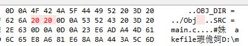

2025年代码说明：

最新 3.17：

git checkout -b test
git reset --hard e081ec2a64ed50c5892  好的
git reset --hard 672d123292a929d24c 好的
06d8124c3f24f77 好的
git checkout main
git branch -D test

-------
我的cdt eclipse工程下不知道为什么debug hover显示不出来了

Window → Preferences → C/C++ → Editor → Hovers

把Macro Expansion去掉，把Debugger或Combined Hover勾上

-------
重装系统后配置git：
把原来的.ssh文件夹、.gitconfig文件、.git-credentials全部拷过来         
关键：tortoisegit的setting-》Network里设置C:\Program Files\Git\usr\bin\ssh.exe          
git config user不能补全，把原来的git-completion.bash文件拷过来         
C:\Program Files\Git\mingw64\share\git\completion\git-completion.bash      

---------
eclipse 新建C工程，选 hello world ansi c project，它会生成一个c文件，注意默认字符是GTK编码，然后我把其他工程的Makefile拷到这个目录，乱码，右键工程属性把编码改为utf-8显示正常，改了下Makefile，编译报错

make all 
Makefile:52: *** mixed implicit and normal rules: deprecated syntax
make: *** No rule to make target '%.c', needed by '../Obj'.  Stop.

最后反复排查，一个makefile可以，另一个不行，beyond compare文本比较完全一样，二进制比较，总算找到不一样的地方了。

 

解决方法很简单，先把工程设为utf-8,然后再把makefile拷过去，这样就不会出现eclipse自带的字符转换导致的错误。新建code2工程，重复上述过程把code1的Makefile拷过去不会出现这个问题，玄学，好像还要特定的Makefile才会触发这个问题。

还有代码路径里不要有中文，否则gdb启动不了，这些就是我今晚碰到的问题。eclispe+make这套环境搭建问题，让我搭建100次我就会出错100次，但是只要思路清晰，总是可以解决的，而且只需解决一次，以后就不用管了。