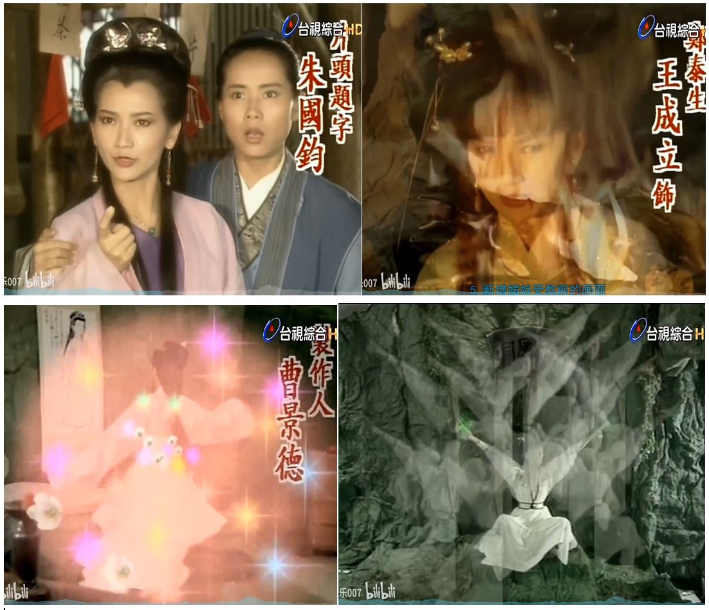
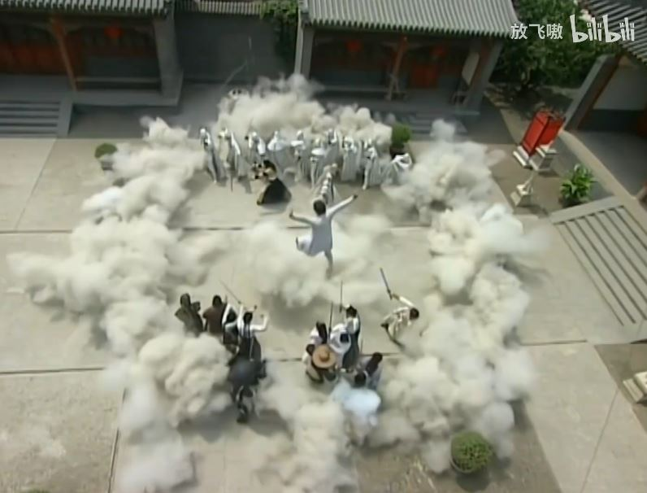
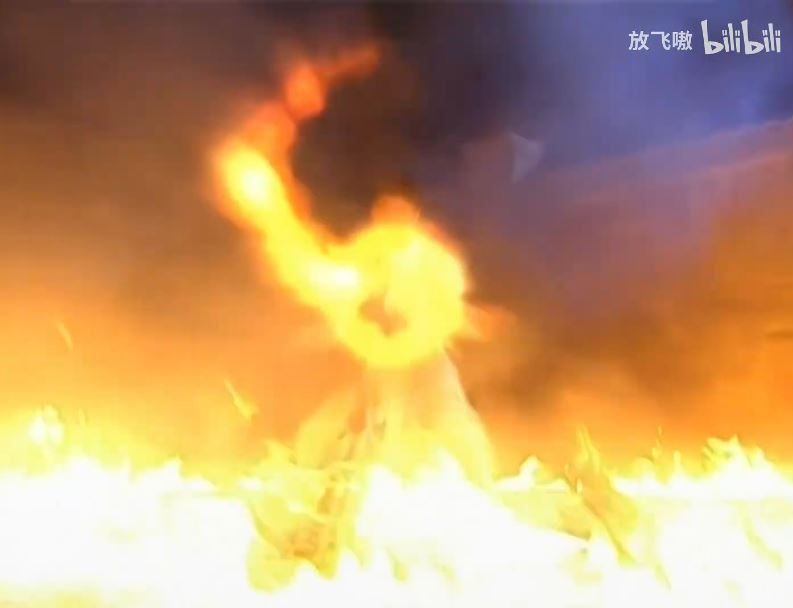
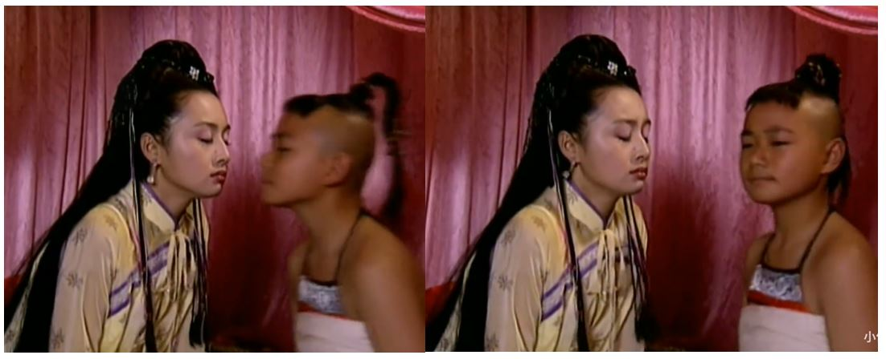

梁朝伟/刘德华 - 无间道

作词:林夕
作曲:伍乐城

不 我不愿意结束 
我还没有结束 
无止境的旅途 
看着我没停下的脚步 
已经忘了身在何处 

谁能改变人生的长度 
谁知道永恒有多么恐怖 
谁了解生存往往比命运还残酷 
只是没有人愿意认输   
我们都在不断赶路 
忘记了出路 
在失望中追求偶尔的满足 
我们都在梦中解脱 
清醒的苦 
流浪在灯火阑珊处 
去不到终点 
回到原点 
享受那走不完的路 
                               
一路上演出难得糊涂 
一路上回顾难得麻木 
在这条亲密无间的路 
让我像你 
你像我 
怎么会孤独 

既然没终点回到原点 
我想我们都不不在乎

------
金南玲 - 逆流成河 (完整版)

词曲: 廖伟志
编曲：刘旭阳

斑驳的夜色在说什么 
谁能告诉我如何选择 
每当我想起分离时刻 
悲伤就逆流成河 
你给的温暖属于谁呢 
谁又会在乎我是谁呢 
每当我想起你的选择 
悲伤就逆流成河 

失去了你也是种获得 
一个人孤单未尝不可 
每当我深夜辗转反侧 
悲伤就逆流成河 
离开你也是一种快乐 
没人说一定非爱不可 
想问你双手是否温热 
悲伤就逆流成河 
我想是因为我太天真 
难过是因为我太认真 
每当我想起你的眼神 
悲伤就逆流成河 

-----
张伟进 - 猴哥

作词：张黎 作曲：肖白

猴哥猴哥 
你真了不得 
五行大山压不住你 
蹦出个孙行者 
猴哥猴哥 
你真太难得 
紧箍咒再念 
没改变老孙的本色 
拔一根毫毛 
吹出猴万个 
眨一眨眼皮 
能把鬼识破 
翻个跟斗十万八千里 
抖一抖威风山崩地也裂 
哪里有难都想你 
哪里有险都有哥 
身经百战打头阵 
惩恶扬善心如佛 
你的美名万人传 
你的故事千家说 
金箍棒啊永闪烁 
扫清天下浊 

 

-----------
陋室空堂，当年笏满床，[甲戌侧批：宁、荣未有之先。]

衰草枯杨，曾为歌舞场。[甲戌侧批：宁、荣既败之后。]

蛛丝儿结满雕梁，[甲戌侧批：潇湘馆、紫芸轩等处。]

绿纱今又糊在蓬窗上。[甲戌侧批：雨村等一干新荣暴发之家。甲戌眉批：先说场面，忽新忽败，忽丽忽朽，已见得反覆不了。]

说什么脂正浓，粉正香，如何两鬓又成霜？[甲戌侧批：宝钗、湘云一干人。]

昨日黄土陇头送白骨，[甲戌侧批：黛玉、晴雯一干人。]

今宵红灯帐底卧鸳鸯。[甲戌眉批：一段妻妾迎新送死，倏恩倏爱，倏痛倏悲，缠绵不了。]

金满箱，银满箱，[甲戌侧批：熙凤一干人。]

展眼乞丐人皆谤。[甲戌侧批：甄玉、贾玉一干人。]

正叹他人命不长，那知自己归来丧！[甲戌眉批：一段石火光阴，悲喜不了。风露草霜，富贵嗜欲，贪婪不了。]

训有方，保不定日后[甲戌侧批：言父母死后之日。]作强梁。[甲戌侧批：柳湘莲一干人。]

择膏粱，谁承望流落在烟花巷！[甲戌眉批：一段儿女死后无凭，生前空为筹划计算，痴心不了。]

因嫌纱帽小，致使锁枷杠，[甲戌侧批：贾赦、雨村一干人。]

昨怜破袄寒，今嫌紫蟒长。[甲戌侧批：贾兰、贾菌一干人。甲戌眉批：一段功名升黜无时，强夺苦争，喜惧不了。]

乱烘烘你方唱罢我登场，[甲戌侧批：总收。甲戌眉批：总收古今亿兆痴人，共历幻场，此幻事扰扰纷纷，无日可了。]

反认他乡是故乡。[甲戌侧批：太虚幻境青埂峰一并结住。]

甚荒唐，到头来都是为他人作嫁衣裳！[甲戌侧批：语虽旧句，用于此妥极是极。苟能如此，便能了得。甲戌眉批：此等歌谣原不宜太雅，恐其不能通俗，故只此便妙极。其说得痛切处，又非一味俗语可到。蒙双行夹批：谁不解得世事如此，有龙象力者方能放得下。]

--------------
苏芮 - 凭着爱

作词:潘源良
作曲:卢冠廷

曾踏遍 刺脚的弯路 
疲倦了 谁来倾诉 
遇过几多痴情 怎会不知道 
但我深知 总有一日 定会找得到最好 

凭着爱 我信有出路 
凭着爱 情怀不老 
在这一刻跟你 终于可拥抱 
就算始终 失意倒运 人生已再没苦恼 
曾在这高高低低弯弯曲曲中跌倒 
才骤觉开开心心简简单单已极好 
最美丽仍然是爱带泪尝仍然是好 
未惧怕一生的波折伴到老 

未惧怕一生的波折伴到老

--------
杜甫 - 石壕吏

暮投石壕村，有吏夜捉人。 
老翁逾墙走，老妇出门看。 
吏呼一何怒！妇啼一何苦！ 
听妇前致词：三男邺城戍。 
一男附书至，二男新战死。 
存者且偷生，死者长已矣！ 
室中更无人，惟有乳下孙。 
有孙母未去，出入无完裙。 
老妪力虽衰，请从吏夜归。 
急应河阳役，犹得备晨炊。 
夜久语声绝，如闻泣幽咽。 
天明登前途，独与老翁别。 
(出门看 一作：出看门)

------
周美茵-谁在意

作词：小美  作曲：冯镜辉

窗纱之后 静望帘外雨   
静望帘外雨 谁在意   
怀念着前事 怀念着前事 太痴   
从前事看似琐碎   
却叫我心醉 未能睡去   
绝情憾事凝聚   
热情梦话凝聚 共对   

某个某个某个冬天 深夜里   
爱已破碎破碎   
风中翻飞 小雨像流泪   
为谁话别赔罪 为谁绝望垂泪 也许   

天空洒泪 滴落长路里   
滴落长路里 无路退   
如遇着情尽 人倦极无梦 记取   
离情话叫我心碎   
我怕再想那 绝情字句   
奈何风中雨水 令人通通记起 记取   
从前事看似琐碎   
却叫我心醉 未能睡去   
绝情憾事凝聚 热情梦话凝聚 共对   

某个某个某个冬天 深夜里   
爱已破碎破碎   
风中翻飞   
小雨像流泪   
为谁话别赔罪   
为谁绝望垂泪 也许   

-----------
满江红·和郭沫若同志  毛泽东

小小寰球，有几个苍蝇碰壁。 
嗡嗡叫，几声凄厉，几声抽泣。 
蚂蚁缘槐夸大国，蚍蜉撼树谈何易。 
正西风落叶下长安，飞鸣镝。 

多少事，从来急； 
天地转，光阴迫。 
一万年太久，只争朝夕。 
四海翻腾云水怒，五洲震荡风雷激。 
要扫除一切害人虫，全无敌。 

-------
毛阿敏 - 历史的天空

作词: 王健 
作曲: 谷建芬

暗淡了刀光剑影 
远去了鼓角铮鸣 
眼前飞扬着一个个 
鲜活的面容 

湮没了黄尘古道 
荒芜了烽火边城 
岁月啊你带不走 
那一串串熟悉的姓名  
兴亡谁人定 啊 
盛衰岂无凭 啊 
一页风云散 啊 
变幻了时空 
聚散皆是缘 啊 
离合总关情 啊 
担当生前事 啊 
何计身后评 
长江有意化作泪 
长江有情起歌声 
历史的天空闪烁几颗星 
人间一股英雄气 
在驰骋纵横

------
《送别》终于让我找到最好听的版本~  
https://www.bilibili.com/video/BV1ZV411r7Yg/?

【童声独唱】李叔同《送别》（1935年首版）  
https://www.bilibili.com/video/BV16G4y1Q72w/

作词：李叔同 
作曲：安东尼·德沃夏克 
编曲：李叔同

长亭外 古道边 
芳草碧连天 
晚风扶柳笛声残 
夕阳山外山 

天之涯 海之角 
知交半零落 
一壶浊酒尽余欢 
今宵别梦寒

情千缕 酒一杯 
声声离笛催 
问君此去几时来 
来时莫徘徊 

草碧色 水绿波 
南浦伤如何 
人生难得是欢聚 
惟有别离多 

------
高胜美 - 千年等一回

作词: 陈自为
作曲: 左宏元

千年等一回等一回啊 
千年等一回我无悔啊 
是谁在耳边说爱我永不变 
只为这一句啊哈断肠也无怨哎 
雨心碎风流泪梦缠绵情悠远那 
(cha\~cha\~na\~) 
(cha\~cha\~na\~) 
(cha\~cha\~na\~) 
(cha\~cha\~na\~) 

西湖的水我的泪 
我情愿和你化作一团火焰 
啊……啊……啊…… 

千年等一回等一回啊 
千年等一回我无悔啊 
雨心碎风流泪梦缠绵情悠远那 

千年等一回等一回啊 
千年等一回我无悔啊 
千年等一回等一回啊 

千年等一回

 

-------
叶振棠 - 万里长城永不倒

作词: 卢国沾
作曲: 黎小田

昏睡百年 
国人渐已醒 
睁开眼吧 
小心看吧 
哪个愿臣虏自认 
因为畏缩与忍让 
人家骄气日盛 
开口叫吧 
高声叫吧 
这里是全国皆兵 
历来强盗要侵入 
最终必送命 

万里长城永不倒 
千里黄河水滔滔 
江山秀丽 
叠彩峰岭 
问我国家哪像染病 
冲开血路 
挥手上吧 
要致力国家中兴 
岂让国土再遭践踏 
个个负起使命 
这睡狮渐已醒

------
风采姐妹 - 爸爸的草鞋

词曲：叶佳修

草鞋是船 
爸爸是帆 
奶奶的叮咛载满舱 
满载少年十七的梦想 
充满希望的启航 启航 

船儿行到黄河岸 
厚厚的黄土堆上船 
夜来停泊青纱帐 
天明遥遥山海关 

草鞋是船爸爸是帆 
故国的叮咛不敢忘 
满载半世纪飘泊的沧桑 
倦航的船儿快来靠港靠港

------
张卫健 - 虚虚实实

作词: 林敏骢
作曲: 温浩杰

假如我可以再生  
像太极为两仪而生  
动静（之）间如行云流水  
追一个豁达的眼神  

任膨湃巨力来打我  
牵动我四两拨千斤  
以弱可胜强  
后发可先至  
天大地大博大精深  

在虚虚在实实 神会中  
虚守实发掌中穷  
来势凶不为动  
所向无敌真英雄  
随心行动  
心底我是这样的人  

在虚虚在实实 现实中  
爱与不爱都很难  
伤依然那么深  
每一条路的尽头  
是一个人  
看不透世上的真  
你还是这样天真  

  
  
  
  

-------
满文军 - 心要飞

作词:宋小明
作曲:常馨内

心要飞留也难留不用去追 
梦要碎就让我再多一点睡 
山水苍茫天地尽头彩云归 
这一生一世的奔波很累 

爱不悔望了又望好想流泪 
头不回就让我喝最后一杯 
儿女情长涌上心头就沉醉 
那一哭一笑的模样很美 

小小年纪就要学会面对 
有些事想起来真让我们惭愧 
小小年纪就该学会无畏 
有些人活到老能有真情几回 

有些人活到老能有真情几回

 
 
 
 

-------
【郭采洁】One Night Fever首场个人演唱会  
https://www.bilibili.com/video/BV12x411N7Bn/

36分 单曲循环

郭采洁 - 单曲循环

作词: 姚若龍
作曲: 陈小霞

最愛聽你講著故事 
幻想以前你的樣子 
你有一只銀色戒指 
封印讓你傷痛的事 
最愛坐著你的車子 
笑著探訪每個城市 
書寫新的感人歷史 
願我是你快樂的事 

單曲循環我的幽默 
隔離一個專屬宇宙 
在情人懷裡 
放鬆和懶惰 
才能在現實世界 
繼續奔波 

單曲循環你的溫柔 
不想關注別的誘惑 
在情人面前 
故意不成熟 
是會上癮的浪漫 
無藥可救

你像那種 
似乎有點難的歌 
但是會越聽越懂得 
我像那種 
似乎很簡單的歌 
但是會越聽越深刻 

---------
裘海正 - 爱我的人和我爱的人

作词: 许常德
作曲: 游鸿明

盼不到我爱的人 
我知道我愿意再等 
疼不了爱我的人 
片刻柔情它骗不了人 
我不是无情的人 
却将你伤的最深 
我不忍我不能 
别再认真 
忘了我的人 

离不开我爱的人 
我知道爱需要缘分 
放不下爱我的人 
因为了解他多么认真 
为什么最真的心 
碰不到最好的人 
我不问我不能 
拥在怀中 
直到他变冷 

爱我的人对我痴心不悔 
我却为我爱的人甘心一生伤悲 
在乎的人始终不对 
谁对谁不必虚伪 
爱我的人为我付出一切 
我却为我爱的人流泪狂乱心碎 
爱与被爱同样受罪 
为什么不懂拒绝痴情的包围 

--------
李晖 - 火辣辣的军营火辣辣的兵(吉特巴)

作词:侯汉瑜
作曲:老兵

火辣辣的天空 火辣辣的云 
火辣辣的大地 火辣辣的风 
火辣辣的军营 火辣辣的兵 
火辣辣的热血 火辣辣的情 
练兵 习武 为打赢 哎 
我们是对对火辣辣的兵 
练兵习武为 打赢 哎 
我们都是火辣辣的兵 
哎嗨哟 呀 儿哟 
哎嗨哟 呀儿哟 
火辣辣的热血火辣辣的情 
哎 嗨哟 呀儿哟 
哎嗨哟 呀儿哟 
火辣辣的军营 火辣辣的兵 
一切为打赢！嗨！ 
（火辣辣的天空 火辣辣的云 
火辣辣的大地 火辣辣的风 
火辣辣的军营 火辣辣的兵 
火辣辣的热血 火辣辣的情 ） 
练兵习武 为打赢 哎 
（练兵习武为打赢哎） 
我们是对对火辣辣的兵 
（我们是对对火辣辣的兵 哎） 
练兵习武为打赢哎 
（练兵习武为打赢哎） 
我们都是火辣辣的兵 
哎嗨哟 呀儿 哟 
哎嗨哟 呀 儿哟 
火辣辣的热血火辣辣的情 
哎 嗨哟 呀儿哟 
哎 嗨哟 呀儿哟 
火辣辣的军营 火辣辣的兵 
一切为打赢！嗨！

一切为打赢！（嗨） 
一切为打赢！为打 赢！！！（嗨）

------
陈毅 - 梅岭三章

一九三六年冬，梅山被围。余伤病伏丛莽间二十余日，虑不得脱，得诗三首留衣底。旋围解。

（一）

断头今日意如何？创业艰难百战多。 
此去泉台招旧部，旌旗十万斩阎罗。 

（二）

南国烽烟正十年，此头须向国门悬。 
后死诸君多努力，捷报飞来当纸钱。 

（三）

投身革命即为家，血雨腥风应有涯。 
取义成仁今日事，人间遍种自由花。 

--------
李丽芬 - 爱江山更爱美人

词曲：小虫

道不尽红尘舍恋 
诉不完人间恩怨 
世世代代都是缘

留着相同的血 
喝着相同的水 
这条路漫漫又长远 
红花当然配绿叶 
这一辈子谁来陪 
渺渺茫茫来又回 
往日情景再浮现 
藕虽断了丝还连 
轻叹世间事多变迁

爱江山更爱美人 
哪个英雄好汉宁愿孤单 
好儿郎浑身是胆 
壮志豪情四海远名扬

人生短短几个秋 
不醉不罢休 
东边我的美人 
西边黄河流 
来呀来个酒 
不醉不罢休 
愁情烦事别放心头

--------
Tomorrow will come 追梦人英文版 
https://www.bilibili.com/video/BV1sV411y7WN/

As time goes by everyday of my life 
How I long for yesterday 
Slowly years have gone and come 
And I know that you'll wait for me till the end 
Looking back on days of the past that we had so long ago 
I can't hide these feelings all inside 
My love continues to grow 

Without you here everything is unclear 
All that's left of me and you 
I'll wait endlessly for you and for us for a love I'll never let go 
All my life I'll wait everyday every night for your return 
You and I together for all time our flame forever will burn 

Oh so faraway I'm holding onto yesterday 
I will wait tomorrow tomorrow will come again 

You and I together for all time our flame forever will burn