张宇 - 月亮惹的祸

作词:十一郎
作曲:张宇

都是你的错 轻易爱上我 
让我不知不觉满足被爱的虚荣 
都是你的错 你对人的宠 
是一种诱惑 
都是你的错 在你的眼中 
总是藏著让人又爱又怜的朦胧 
都是你的错 你的痴情梦 
像一个魔咒 
被你爱过还能为谁蠢动 

我承认都是月亮惹的祸 
那样的月色太美你太温柔 
才会在刹那之间只想和你一起到白头 
我承认都是誓言惹的祸 
偏偏似糖如蜜说来最动人 
再怎么心如钢铁也成绕指柔 

怎样的情生意动 
会让两个人拿一生当承诺 

-------
潘玮柏/张韶涵 - 快乐崇拜

作词:林夕/潘玮柏
作曲:Turtles
编曲:马毓芬

忘记了姓名的请跟我来 
现在让我们向快乐崇拜 
放下了包袱的请跟我来 
传开去建立个快乐的时代 

快乐到底属于哪个年代 
70 80 90 还是 
Y世代 
翻开历史课本 答案就算仔细找 
也会找不到 背也会背不好 
放松 让我 来说 
什么年代吹着什么样的风 
我拿着我的麦克风 
唱出 Old School Show 
Yall Ready To Roll 
70的年代 复古我最High 
Disco Fever 
从来不肯Say Goodbye 
只有放放放克才能酷 
男男女女老老少少 
我们穿着喇叭裤 
YO 爆炸头 在望春风 
左右摇摆 上下一指神功 
黑白电视可能无法感受 
但 相信你们可以悟出黑色幽默 

忘了你存在（存在） 
有什么期待（期待） 
欢乐你邀请它一定来 
与其渴望关怀 
不如一起精彩 
快乐会传染 
请你慷慨 Come on 

相恋的失恋的请跟我来 
一边跳一边向快乐崇拜 
开心不开心的都跟我来 
美丽而神圣的时光不等待 

到了80年代 要喊什么 
B Boys B Girls 
Let's Make Some Noise 
要穿什么呢 Hmmm... 
紧裤子 紧上衣 
秀出你的身材 
有人露出金牙 
千万不要惊讶 
嘻哈正在发芽 
别拔它假牙 
Locking Popping We Dancing 
Ain't No Stopping 跟我一起唱 
快乐崇拜 快乐无害 
虽然快乐像个病毒病毒会传染 
90年 我们等待千禧年 
Party电子音乐 疯狂玩整夜 
Hip-Hop For Life That's Right 
每个人嘴里喊着Westside 
管你是不是 真正Party 天才 
扬起你的嘴角 
跟我快乐崇拜 

现代 这个匆忙时代 
虽然少了时间但千万不要倦怠 
今天的事 交给今天去做 
因为明天才有很多时间一起去疯 
YO 放肆的节奏 
看你放肆的互动 
看你放肆的感动 
看我放肆的创作 
要我怎么再说 
People Feel My Flow 
看我拿着麦克风 
唱出快乐的Show 

-------
刘欢 - 好汉歌

作词:易茗
作曲:赵季平

大河向东流啊 
天上的星星参北斗 
咳咳参北斗哇 
生死之交一碗酒啊 
说走咱就走啊 
你有我有全都有啊 
咳咳全都有啊 
水里火里不回头啊 

路见不平一声吼啊 
该出手时就出手啊 
风风火火闯九州啊 
该出手时就出手啊 
风风火火闯九州啊 
嗨呀依儿呀唉嗨唉嗨依儿呀 
嗨呀依儿呀唉嗨唉嗨依儿呀 
路见不平一声吼啊 
该出手时就出手啊 
风风火火闯九州啊 
嘿嘿嘿呦嘿嘿 

大河向东流啊 
天上的星星参北斗 
咳咳参北斗哇 
不分贵贱一碗酒啊 
说走咱就走啊 
你有我有全都有啊 
咳咳全都有啊 
一路看天不低头啊 

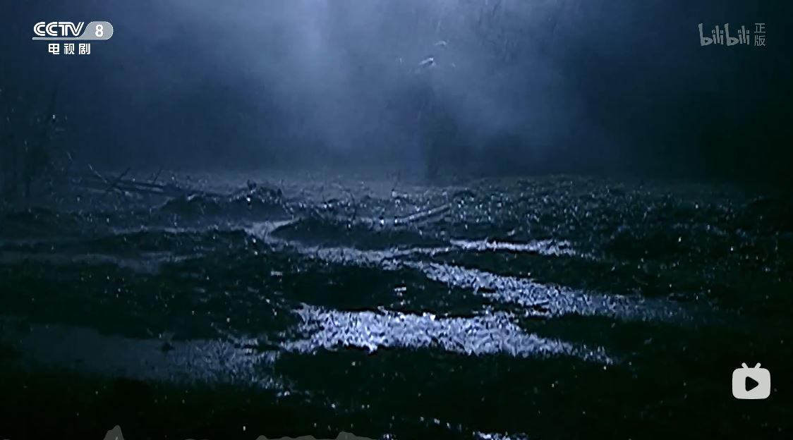 

-------
赵雷 - 成都

作词:赵雷
作曲:赵雷

让我掉下眼泪的 
不止昨夜的酒 
让我依依不舍的 
不止你的温柔 
余路还要走多久 
你攥着我的手 
让我感到为难的 
是挣扎的自由 

分别总是在九月 
回忆是思念的愁 
深秋嫩绿的垂柳 
亲吻着我额头 
在那座阴雨的小城里 
我从未忘记你 
成都带不走的只有你 

和我在成都的街头走一走喔 
直到所有的灯都熄灭了也不停留 
你会挽着我的衣袖 
我会把手揣进裤兜 
走到玉林路的尽头 
坐在小酒馆的门口 

-------
那英- 雾里看花

作词:阎肃
作曲:孙川

雾里看花水中望月 
你能分辨这变幻莫测的世界 
涛走云飞花开花谢 
你能把握这摇曳多姿的季节 
烦恼最是无情夜 
笑语欢颜难道说那就是亲热 
温存未必就是体贴 
你知哪句是真哪句是假 
哪一句是情丝凝结 

借我借我一双慧眼吧 
让我把这纷扰 
看个清清楚楚明明白白真真切切 
借我借我一双慧眼吧 
让我把这纷扰 
看个清清楚楚明明白白真真切切 

啊 
让我把这纷扰 
看个清清楚楚明明白白真真切切 
借我借我一双慧眼吧 
让我把这纷扰 
看个清清楚楚明明白白真真切切 

-------
S.H.E - 不想长大

作词:施人诚
作曲:左安安
编曲:陈台证

为什么就是找不到 
不谢的玫瑰花 
为什么遇见的王子 
都不够王子啊 
我并不期盼他会有 
玻璃鞋和白马 
我惊讶的是 情话竟然 
会变成谎话 
为什么幸福的青鸟 
要飞得那么高 
为什么苹果和拥抱 
都可能是毒药 
我从没想过有了他 
还孤单得可怕 
我突然想起从前陪我那个洋娃娃 

我不想 我不想 不想长大 
长大后 世界就 没童话 
我不想 我不想 不想长大 
我宁愿 永远都 笨又傻 
我不想 我不想 不想长大 
长大后 我就会 失去他 
我深爱的他 深爱我的他 
已经变得不像他/ 
怎么会 爱上别个她

为什么水晶球里面 
看不出他在变 
为什么结局没欢笑 
而是泪流满面 
我愿意在他回来前 
继续安静沉睡 
但他已去到别座城堡 
吻另一双嘴 
为什么对流星许愿 
却从来没实现 
为什么英勇的骑士 
会比龙还危险 
我当然知道这世界 
不会完美无暇 
我只求爱情能够不要那么样复杂

------
吴启华 - 风起云涌

作词: 张美贤
作曲: Keith Yip/麦皓轮

踏千山天高海阔中 
静看风转动云起暗涌 
屠龙倚天一秒斩清空 
世上需经风雪万重 
情义最终两者不会相容 
在我生命中 
何日那处去追我旧时梦 
万载千世谁狂勇 
号令世间天赞颂 
谁能去分正邪从一而终 
名利悄然流过怎带进梦中

仇恨纵然沉重 
一笑化成空

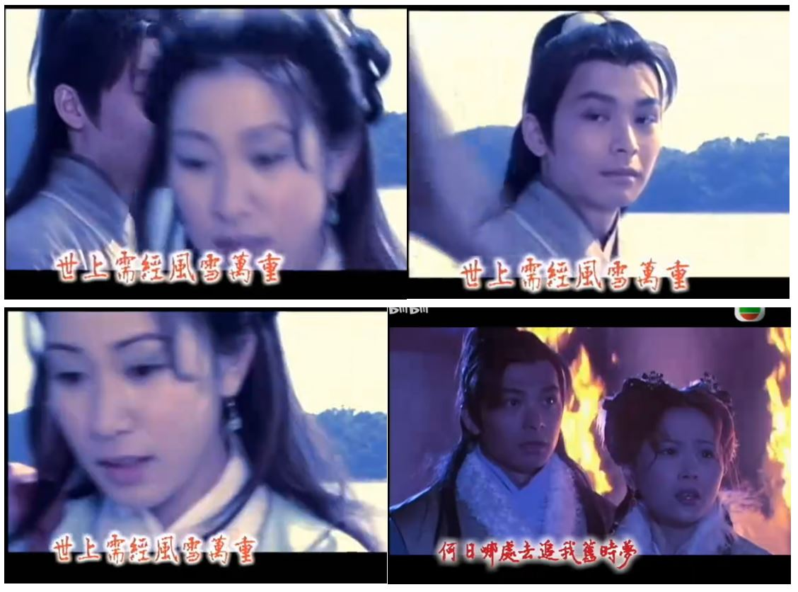 

-------
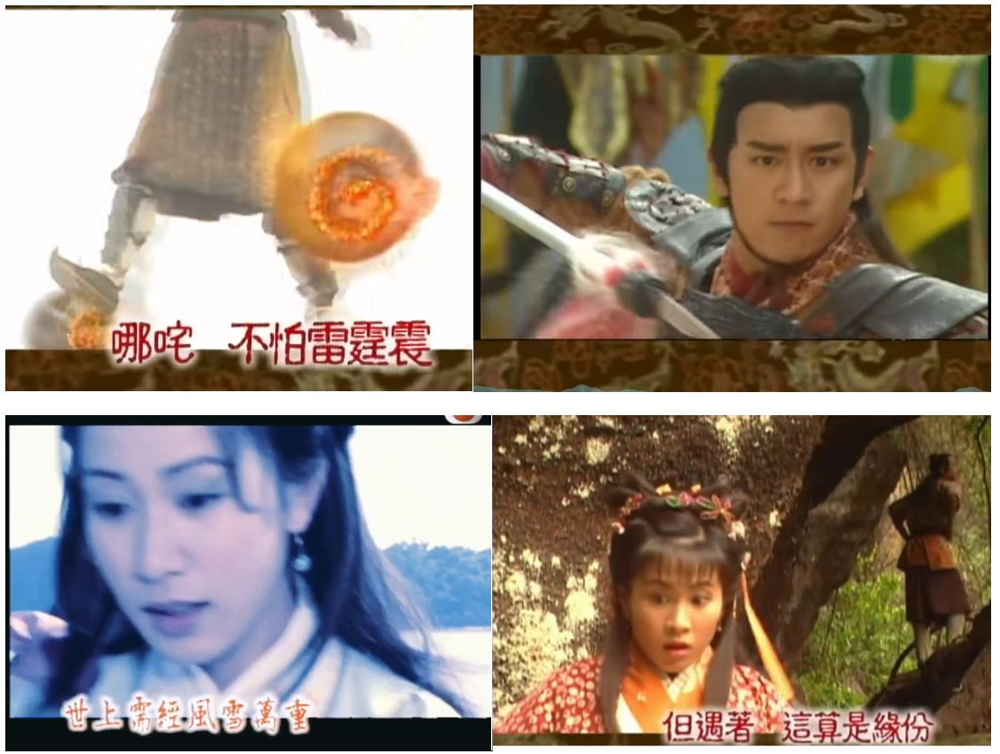 

-------
梁朝伟/刘德华 - 无间道

作词:林夕
作曲:伍乐城

不 我不愿意结束 
我还没有结束 
无止境的旅途 
看着我没停下的脚步 
已经忘了身在何处 

谁能改变人生的长度 
谁知道永恒有多么恐怖 
谁了解生存往往比命运还残酷 
只是没有人愿意认输   
我们都在不断赶路 
忘记了出路 
在失望中追求偶尔的满足 
我们都在梦中解脱 
清醒的苦 
流浪在灯火阑珊处 
去不到终点 
回到原点 
享受那走不完的路 
                               
一路上演出难得糊涂 
一路上回顾难得麻木 
在这条亲密无间的路 
让我像你 
你像我 
怎么会孤独 

既然没终点回到原点 
我想我们都不不在乎

------
顾海滨 - 抬头望望天

抬头望望天 月亮在笑 
低头看看地 浪花在跳 
这个世界 我们多么渺小 
只要努力 就会心比天高 
快！快！快！冲！冲！冲！ 
四驱战士在行动 
驾着勇敢的赛车 
追寻冠军的征程 
快！快！快！冲！冲！冲！ 
四驱战士在行动 
沿着飞驰的轨迹 
是奥妙智慧的启迪 

-----
满文军 - 最近最远的人

一路风雨走过来 
只为寻找梦中的爱 
一次次的误解 
是因为对你太在意 
一路风雨走过来 
只为寻找梦中的爱 
一次次的伤害 
是因为和你太亲近 
一次次想离开你 
可你总在我心上 
一次次想靠近你 
总也走不进你心里 

最近的人是你和我 
最远的人是我和你 
爱到深处此情最难留 
最近的人是你和我 
最远的人是我和你 
留在梦中天长地久 

留在梦中天长地久

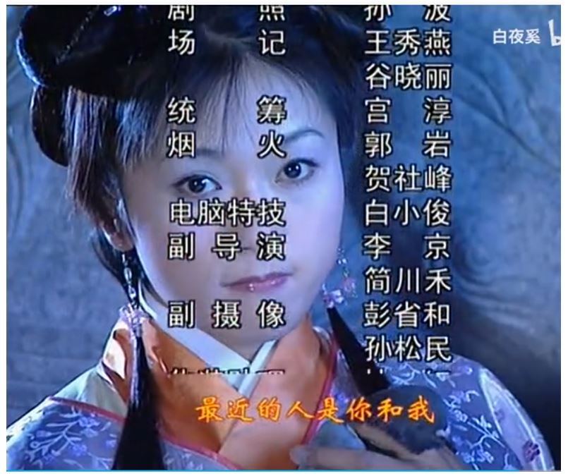 
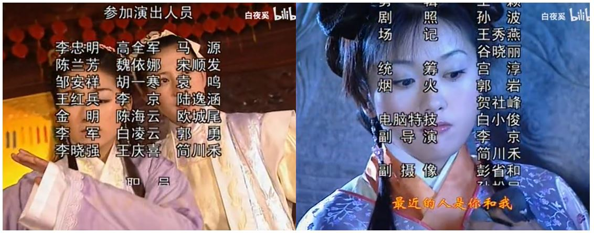 
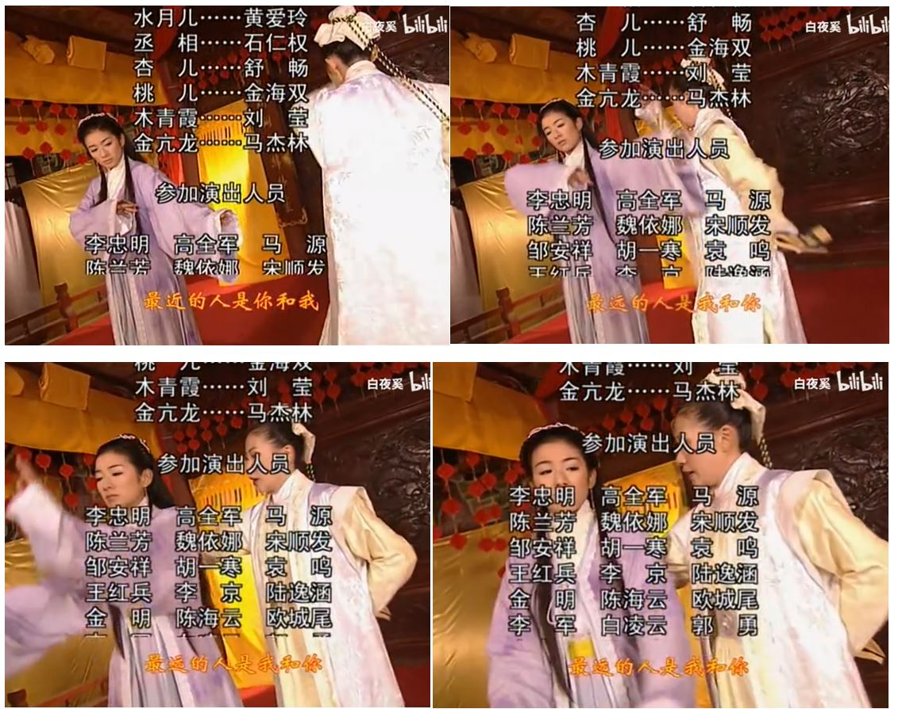 

-------
张正言 - 少年真英雄

作词：宋小明 
作曲：常馨内 
合唱：北京市海淀区实验小学合唱团

问你一声怕不怕 
不怕不怕就不怕 
眼里不揉沙 
身后无牵挂 
上前一步敢说话 

问你一声傻不傻 
不傻不傻就不傻 
要夸你就夸 
要骂你就骂 
做人一世不掺假 

少年真英雄 
心也高 
志也大 
虽然姜老的辣 
小的也不差 
少年真英雄 
天之角 
海之涯 
凡事不能靠老爸 
自己闯天下 

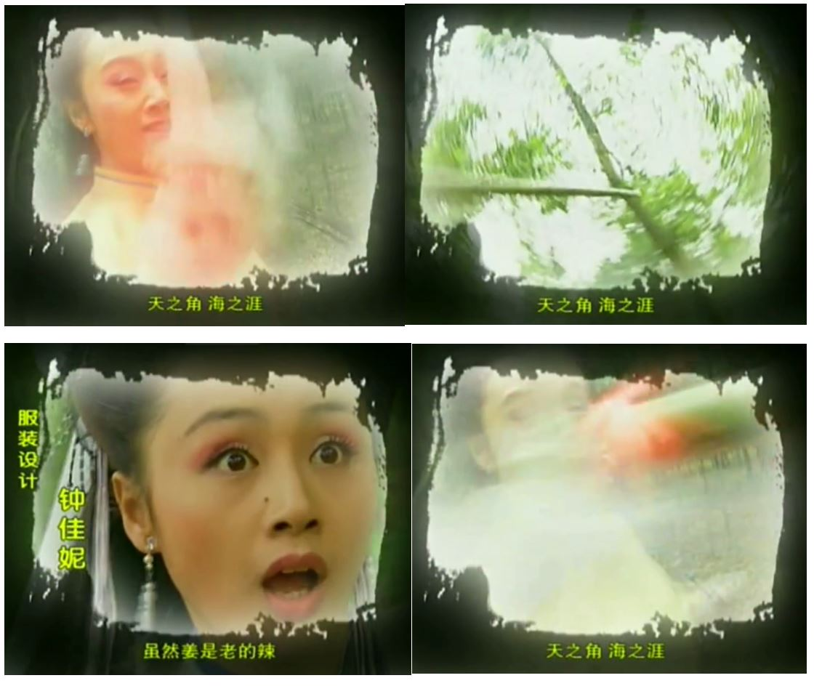 
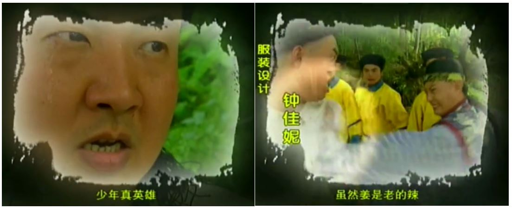 
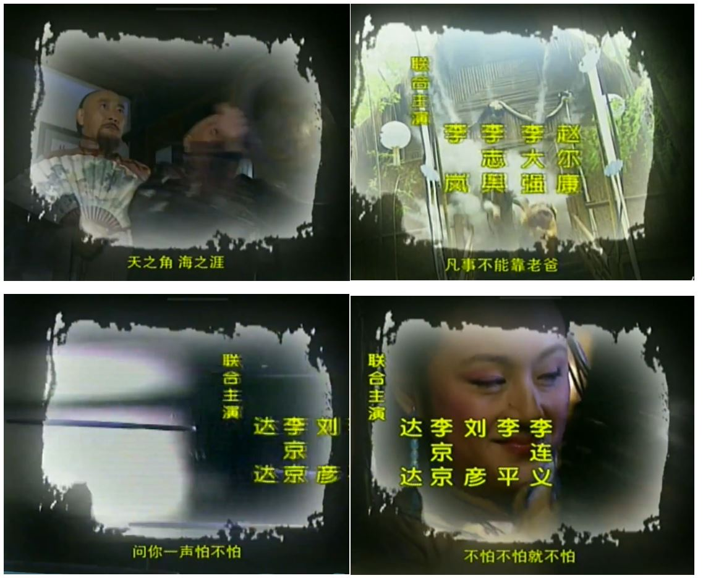 
 

--------
刘禹锡 - 酬乐天扬州初逢席上见赠

巴山楚水凄凉地，二十三年弃置身。 
怀旧空吟闻笛赋，到乡翻似烂柯人。 
沉舟侧畔千帆过，病树前头万木春。 
今日听君歌一曲，暂凭杯酒长精神。 

-----
伍佰 - 突然的自我

作词:徐克、伍佰
作曲:伍佰

听见你说 朝阳起又落 
晴雨难测 道路是脚步多 
我已习惯 你突然间的自我 
挥挥洒洒 将自然看通透 

那就不要留 时光一过不再有 
你远眺的天空 挂更多的彩虹 
我会紧紧的 将你豪情放在心头 
在寒冬时候 就回忆你温柔 
把开怀填进我的心扉 
伤心也是带着微笑的眼泪 
数不尽相逢 等不完守候 
如果仅有此生 又何用待从头 

------
胡月 - 烧饼皇后

作词：简单，孙川
作曲：孙川

烧饼烧饼暖就像日头暖 
烧饼烧饼圆好比月亮圆 
日精月华是百姓的天 
烧饼烧饼暖就像人心暖 
烧饼烧饼圆好比人情圆 
圆它一个善良在人间 

呼儿嗨呀嗨呀奇呀么奇呀奇 
烧饼和娘娘有奇缘 
楞格里格楞格里格妙妙妙 
芸芸的民妇和金銮殿 
那个真假忠奸难呀么难分辨 
唯有这烧饼实呀么实实在 
实实在在暖又圆 
圆它一个善良在人间

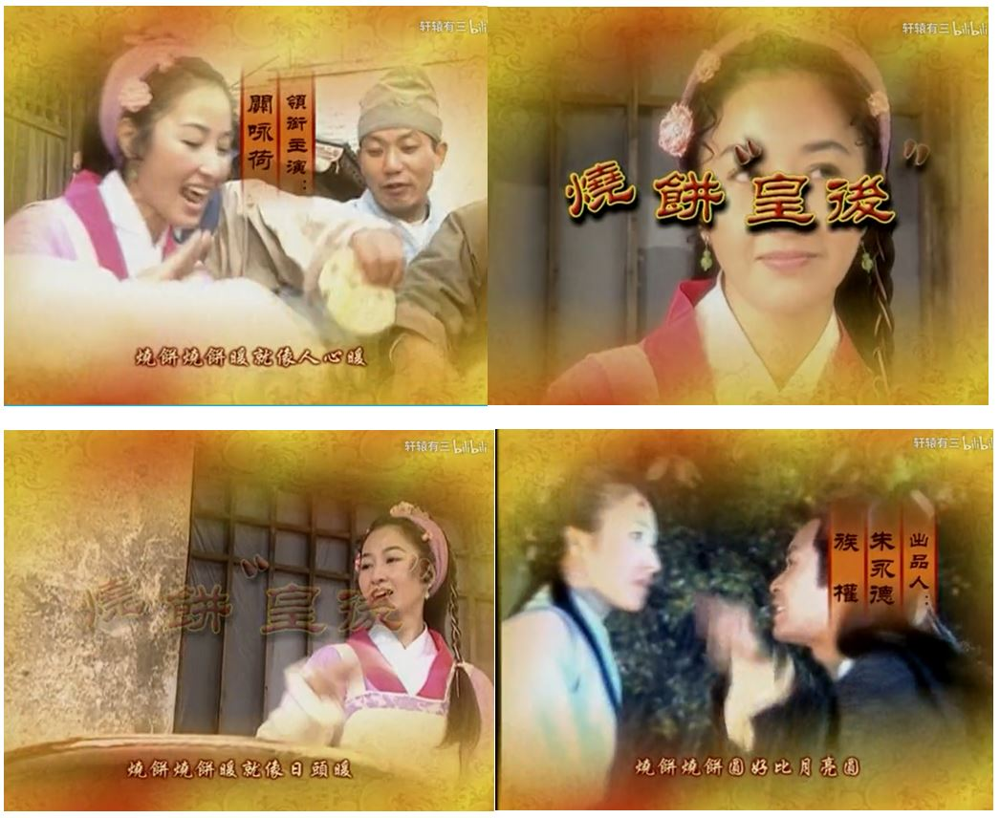 
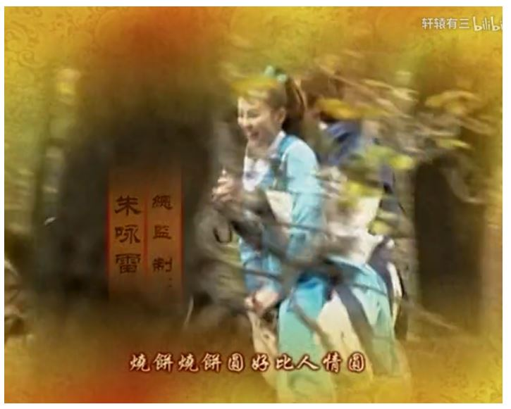 
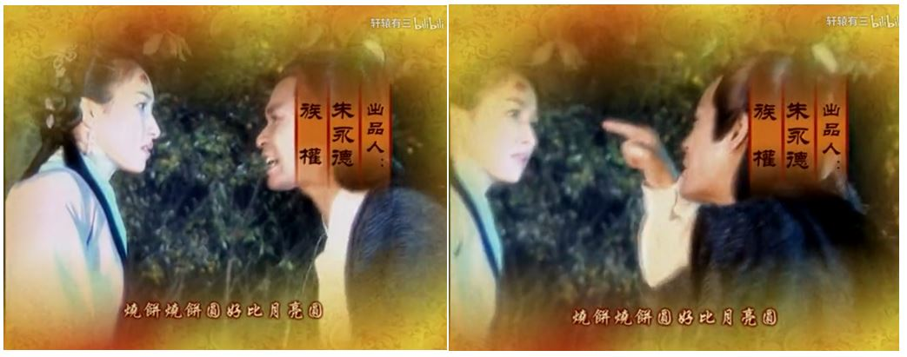 

------
王馨平 - 别问我是谁

词曲：蔡议樟

从没说过爱着谁 
为谁而憔悴 
从来没有想过对不对 
我的眼中装满疲惫 
面对自己 总觉得好累 

我也需要人来陪 
不让我心碎 
让我爱到深处不后悔 
其实我并不像他们说的 
那样多刺难以安慰 
爱人的心应该没有罪 
为何在夜里却一再流泪 
每天抱着寂寞入睡 
生活过得没有滋味 

别问我是谁 请与我相恋 
我的真心没人能够体会 
像我这样的人不多 
为何还要让我难过 
别问我是谁 请和我面对 
看看我的眼角流下的泪 
我和你并没有不同 
但我的心更容易破碎 

 
 
 

-------
梅艳芳 - 似是故人来

作词: 林夕
作曲: 罗大佑

同是过路同做过梦 本应是一对 
人在少年梦中不觉 醒后要归去 
三餐一宿也共一双 到底会是谁 
但凡未得到 但凡是过去 
总是最登对 

台下你望台上我做 你想做的戏 
前事故人忘忧的你 可曾记得起 
欢喜伤悲老病生死 说不上传奇 
恨台上卿卿 或台下我我 
不是我跟你 

俗尘渺渺 天意茫茫 
将你共我分开 
断肠字点点 风雨声连连 
似是故人来 

何日再在何地再聚 说今夜真暖 
无份有缘回忆不断 生命却苦短 
一种相思两段苦恋 半生说没完 
在年月深渊 望明月远远 
想象你忧怨 

留下你或留下我 在世间上终老 
离别以前未知相对 当日那么好 
执子之手却又分手 爱得有还无 
十年后双双 万年后对对 
只恨看不到 
十年后双双 万年后对对 
只恨看不到

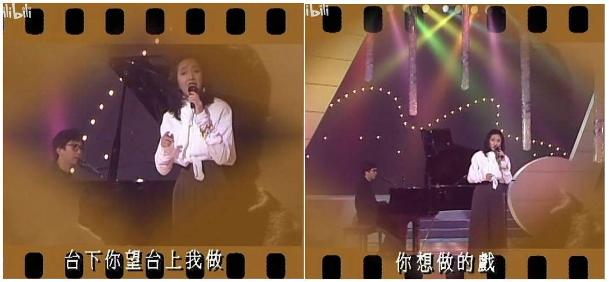 
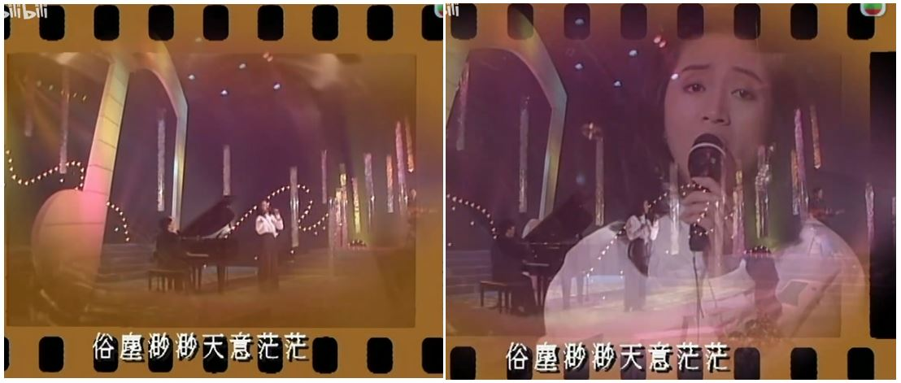 
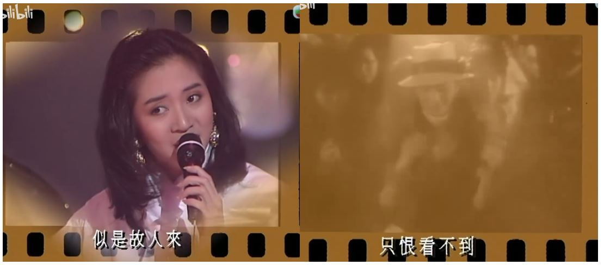 

-----
陈百潭 - 爱情一阵风

作词：陈维祥、陈百潭 作曲：陈百潭

爱情亲像一阵风 
来无影去无踪 
乎我笑容乎我悲伤 
乎我怨叹在心中 
害我将将将 
油门来催尽磅 
也是追追追 
袂着伊的影踪 
是我愚 
是我愚 
是我空 
是我空 
是我痴情又倔强 
伊是风生成是爱流浪 
要见面就在梦中

-----
屠洪刚 - 你

作词: 陈涛
作曲: 张宏光

你从天而降的你 
落在我的马背上 
如玉的模样清水般的目光 
一丝浅笑让我心发烫 

你头也不回的你 
展开你一双翅膀 
寻觅着方向 
方向在前方 
一生叹息将我一生变凉 

你在那万人中央 
感受那万丈荣光 
看不见你的眼睛 
是否会藏着泪光 
我没有那种力量 
想忘也终不能忘 
只等到漆黑夜晚 
梦一回那曾经心爱的姑娘 

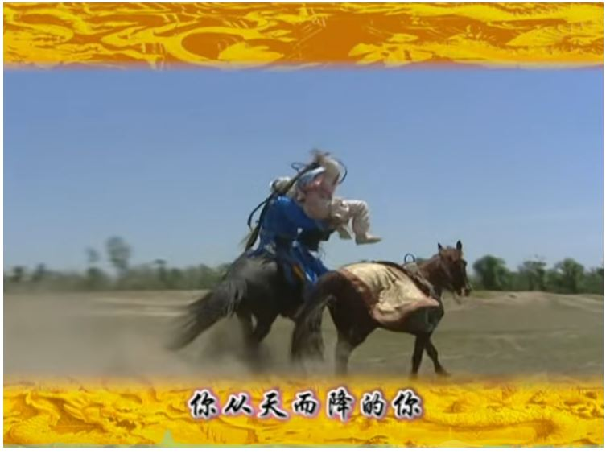 
 
 
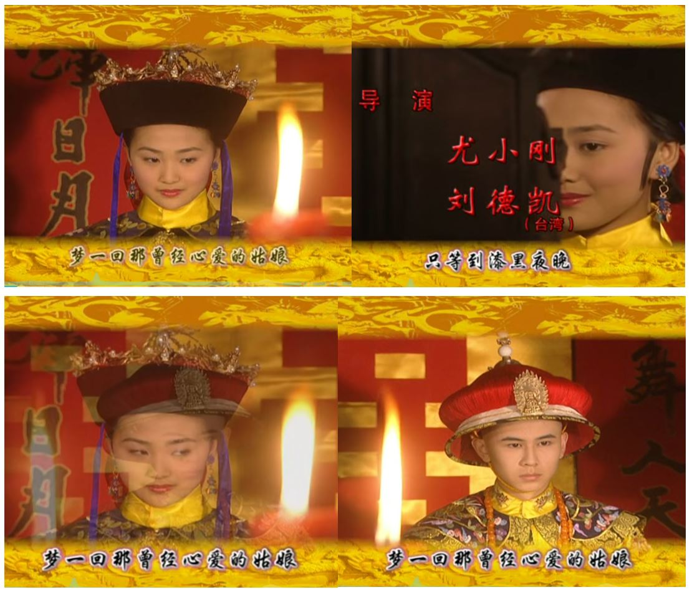 