2024年想法：

最新 9.23：

我的确是实践经验太少了，但我实在不想把太多时间花在这些无聊的事情上。

------------
和我玩角色扮演，被我反杀了吧。滚！我声明一下，不喜欢看别看，别想着让我按照你的口味给你做菜。

------------
吴彤/陈琳 卷睫盼  相对完整版  
https://www.bilibili.com/video/BV1Nx411v79m

作词: 钟志荣
作曲: 钟志荣

美是初见  
燃起爱情火焰  
燃烧在茫茫东海边缘  
随着风飞翻  
卷睫盼  
明眸璀璨我捉不住  
你若即若离的手指尖  
爱是因为你  
美丽被还原  
我知道有一千种可能是与你相恋  
睁开眼  
闭上眼难断难弃的缘  
天赐的  
(地护的)  
永不变  
望眼欲穿  
终于走到我面前  
相拥不相视  
在胸襟沾满了泪水  
再难阻断  
这份感情到海枯到石烂  
我有情  
我有泪  
也曾无悔  

------------
高胜美-青青河边草

作词 : 琼瑶
作曲 : 左宏元

青青河边草 悠悠天不老  
野火烧不尽 风雨吹不倒  
青青河边草 绵绵到海角  
海角路不尽 相思情未了  

青青河边草 悠悠天不老  
野火烧不尽 风雨吹不倒  
青青河边草 绵绵到海角  
海角路不尽 相思情未了  

无论春夏与秋冬 一样青翠一样好  
无论南北与西东 但愿相随到终老

啦啦啦啦啦 啦啦啦啦啦...

------------
林俊杰 - 不死之身

作词 : 林秋离
作曲 : 林俊杰
编曲 : 吴庆隆

阳光放弃这最后一秒   
让世界被黑暗笼罩   
惩罚着人们的骄傲  
我忍受寒冷的煎熬   
和北风狂妄的咆哮   
对命运做抵抗   

这是无法避免的浩劫   
不论你以为你是谁    
任何事物 任何一切    
喔 亲爱的别难过    
只要紧紧握着我的手    

**地球毁灭了以后**     
**我仍爱你爱得不知天高地厚**    
**为你再造一个新宇宙**    
**不死之身 不死的温柔**    

**撑着悲伤不回头**  
**却感觉此刻你停不了的泪流**  
**唯有爱 才能永垂不朽**  
**唯有你 我才能找回我**  
**唯有你 我才能找回我**  
**唯有你 我才能找回我**

------------
轻松一下  苏吉利附身花木兰 复制后把网址粘贴到地址栏才能打开  
https://www.bilibili.com/video/BV1Yb411P7Xe

苏&花：下流 卑鄙 我怎么会打那个傻丫头呢 我应该打我自己才对嘛

余：谁啊

苏&花：是我 木兰

余：进来

苏&花：余大哥还没休息吗（蜜汁眨眼

余：你眼睛怎么了（好奇+严肃

苏&花：香吗（调戏

余：你这么晚跑来找我就是问我这个花香不香吗？（搞笑

苏&花：花香不香是小事 花木兰香不香才是大事（淫荡+白眼

苏&花：余大哥 我到底香不香（温柔+调戏

余：别搞鬼了 你干嘛（不耐烦

苏&花：其实从我认识你那天开始 我就已经对你不怀好意（惊讶 啊不不 是心怀爱意（邪恶

余：你不要玩了

苏&花：余大哥 我不是跟你玩的 我真的好爱你（大喊一声 一把抱上去

余：不是 你先把手放开 （脸涨的的通红

苏&花：我求求你娶我吧 不行我要你先答应我 （紧抱不放

余：到底怎么回事 你害不害羞（挣脱

苏&花：其实我真的好喜欢你（眨眨眼 我知道我这样向你来示爱 是有点唐突 但是如果我不说出来 我真的快憋死了 你知道我喜欢你 但你从来没向我表示过 难道我们这一辈子就只能这样猜来猜去的吗？（委屈（受惊  余大哥 在军中的生活实在太苦闷了（不要碰我难受 其实我真的有点后悔代父从军（震惊+白眼 我也想过听你的话退役回乡  但是我一想到见不到你 那我怎么舍得呢（白眼 余大哥 其实我的样子还挺不错的 你看清楚点（别靠过来 我明白 男人有个三妻四妾  这是一定的（白眼 你现在娶了我 将来遇到你喜欢的女人 我不会介意的（震惊+白眼+凝视  不如...我们现在成亲 明天 你就替我办理退役回乡的手续（吓傻了 来吧 春宵苦短 我们现在就洞房 来 不要浪费时间

余：一杯水泼过去）你到底知不道羞耻 

花：我怎么...会在这儿

上下凝视）花：我怎么全身都湿了

余：你没事吧

花：我根本就不知道发生什么事了  我刚才明明在房间里面睡觉的啊 怎么会来这儿然后又...

余：你刚才匆匆忙忙跑进来 然后跟我胡言乱语 还硬拉着我(脸红

花：拉你干嘛

余：拉我上床（严肃 (受惊

余：喂 你真的不知道你刚才跟我说了些什么鬼话（神秘

花：我说了些什么话呀

余：你色迷迷的抱紧我 跟我示爱  还说叫我娶你为妻（小声告诉你

花：余大哥 刚才那个色迷迷非礼你的那个人不是我（羞愧死了    我中邪了 一定是中邪（好奇+傻呆呆的凝视

------------
如此想来，不免又回头两次。[甲戌眉批：这方是女儿心中意中正文。又最恨近之小说中满纸红拂紫烟。蒙侧批：如此忖度，岂得为无情？]雨村见他回了头，便自为这女子心中有意于他，[甲戌侧批：**今古穷酸皆会替女妇心中取中自己**。]便狂喜不尽，自为此女子必是个巨眼英雄，风尘中之知己也。[蒙侧批：在此处已把种点出。]

-------------
毛泽东劝许世友读《红楼梦》  
http://dangshi.people.com.cn/n1/2019/0114/c85037-30525634.html

其实之前许世友对读《红楼梦》是有抵触情绪的。他曾说《红楼梦》里尽是谈情说爱、“吊膀子”的事，因此不愿意看。对此，毛泽东也有耳闻。在这次接见许世友之前的11月17日，毛泽东和周恩来谈起了这件事。毛泽东说，你还没有看，怎么知道是“吊膀子”？你没有调查，就下断语，大概是听什么人说的吧，我说它是部政治小说。毛泽东还引用了书中的很多话，如“坐山观虎斗”“千里搭长棚，没有个不散的筵席”“不是东风压倒西风，就是西风压倒东风”等，来比喻国际形势，并说“大有大的难处”，特别对我们有用。针对许世友说的“吊膀子”，毛泽东跟许世友说，它那是把真事隐去，用假语村言写出来，真事不能讲，就是政治斗争，“吊膀子”这些是掩盖它的。在与毛泽东谈话回去后，许世友立即找来《红楼梦》读了起来，还一并买来《汉书》和《新编前后汉故事选》，了解起周勃厚重少文的由来，坚定了信念，开阔了眼界，得到很大的提高。

------------
外向就是比内向要好，因为外向是能让大多数人舒服的一种相处方式。

------------
叶振棠-忘尽心中情

作词 : 黄霑
作曲 : 顾嘉辉

忘尽心中情  
遗下爱与痴  
任笑声送走旧愁  
让美酒洗清前事  
四海家乡是   
何地我懒知   
顺意趋寸心自如   
任脚走尺躯随遇   

难分醉醒 玩世就容易   
此中胜负只有天知   
披散头发独自行   
得失唯我事   

昨天种种梦   
难望再有诗   
就与他永久别离   
未去想那非和是   

未记起从前名字

------------
《脂砚斋评石头记》书已到，希望曹雪芹能给我带来好运，让我能领悟出爱的本质。

------------
在95-03年这段时间基本所有商业渠道资源都集中在了整个电视行业，但电视台众多没有真正意义上的垄断，央视有自己的政治任务，不但没有垄断太多娱乐资源同时也没有对下面做太多约束。于是许许多多的电视台不但有钱而且还竞争激烈，这就导致了电视台的口味很挑，所以不断逼着影视行业创作出经典的作品。因为绝大部分现金流都在电视台那里，电视台吃肉，影视界喝汤，想要喝电视台的汤只能通过影视这个渠道，所以大量企业对影视行业进行了投资，因此影视界也并不缺钱来创作好的作品。等到阿里和腾讯崛起时，一切都变了，电视台从此衰落，现在娱乐行业的资源已经全部集中在腾讯手里，不管什么东西，只要放在腾讯那里，就算是屎也是香的。

------------
项羽的地位可能被低估了，当刘邦势如破竹率先进入咸阳时，是谁在巨鹿不但抗住了四十万主力秦军并且还打崩了秦军？

项羽已杀卿子冠军，威震楚国，名闻诸侯。乃遣当阳君、蒲将军将卒二万渡河，救钜鹿。战少利，陈馀复请兵。**项羽乃悉引兵渡河，皆沉船，破釜甑，烧庐舍，持三日粮，以示士卒必死，无一还心**。於是至则围王离，**与秦军遇，九战，绝其甬道，大破之**，杀苏角，虏王离。涉间不降楚，自烧杀。当是时，楚兵冠诸侯。诸侯军救钜鹿下者十馀壁，莫敢纵兵。及楚击秦，诸将皆从壁上观。**楚战士无不一以当十，楚兵呼声动天**，诸侯军无不人人惴恐。於是已破秦军，项羽召见诸侯将，入辕门，无不膝行而前，莫敢仰视。项羽由是始为诸侯上将军，诸侯皆属焉。

李清照：至今思项羽，不肯过江东。

毛泽东：宜将剩勇追穷寇，不可沽名学霸王。

刘邦和曹操展现了最成功的帝王气质，引发了两千年来一代又一代的中国人争相学习并模仿，奠定了如今中国社会的基调。我在这里做一个大胆的假设，虽然刘邦和曹操是成功的，历史是成功者的历史，但他们可能拉低了整个中华民族的格局。

-------------
互联网的拉跨凸显了ai的信息获取效率高。

-------------
昨晚我已啃下了这几个月已来最硬的一块骨头，但始终还是感受不到爱，没有爱就不能把所有环节都串联起来，所以进度还是0%。什么是爱？难道爱是不可见的吗？

-------------
任贤齐唱的歌挺好听的，但你真的适合演令狐冲吗？  
https://www.bilibili.com/video/BV1ds4y1e7bb

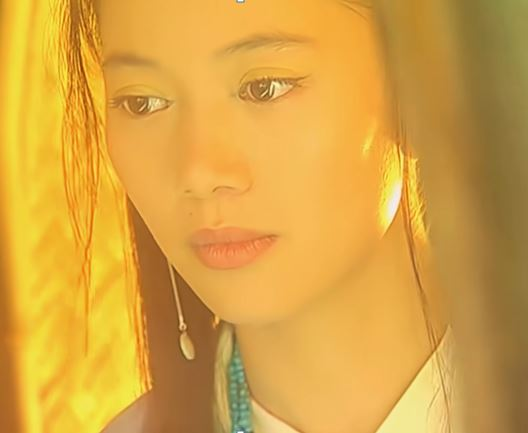

任贤齐-死不了

词：刘思铭
曲：刘志宏

剖开胸膛 我让心在烈日底下烧  
烧成记号 记你的好永远别忘掉  
头破血流 也要护你到天涯海角  
爱一个字 我敢用一辈子来回报  
狂风吹 大海啸  
真心的人死不了  
地多大 天多高  
一生只换一声好  
痛快哭 痛快笑  
痛快的痛死不了  
这一生 这一秒  
我只要求你知道  

冰天雪地 我把冰水全往头上浇（痛快）  
浇熄思念 最后一处温暖的怀抱  
你为了谁 宁愿让心变成了孤岛  
敞开双手 不依不靠从此随风飘  

离别的酒容易醉  
男人流血不流泪  
干一杯 痛痛快快说再会  

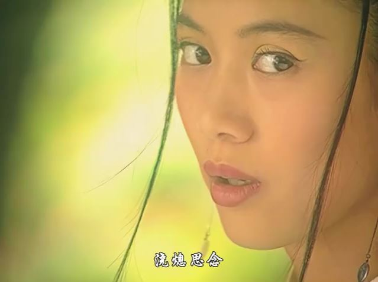

----------------
王阳明：知易行难

孙中山：知难行易

----------------
过程还没有想清楚要不要行动？那要看什么事情了，如果是不重要的事情，不要。如果是最重要的事情，那么一定要而且必须要。

无论是以任何指标还是以任何思维方式来衡量我的大脑性能，我都绝无可能进入**有意参加评测的人中**的前30%，我只是做了一些其他人还没有想清楚就不敢做的事情。

----------------
希望有一天人工智能能写出像红楼梦这样宏大的武侠小说，各种形形色色的人物交织在一起，历经喜怒哀乐悲欢离合，组成一个丰富多彩的武侠世界。

----------------
阿九：我两是天生死敌  
https://mbd.baidu.com/newspage/data/videolanding?nid=sv_3705804206061168316

28集5分50秒  
https://www.laodifang.tv/vodplay/140915-1-28.html

李克勤-明明深爱着你

哭泣的夜 短叹长嗟 
如像困於荒野 一切也凋谢 
当天的夜 分秒难舍 
情像缺堤倾泻 
为何别了 定要装出好过些  
明明是爱得深 明明是伤得很  
仍是要假装 要扮作没缘分  
只可以强忍 只当没发生  
埋藏热爱 逃避眼神的接近  
太狠心 太多苦苦牺牲  
期望有一天 我们会没仇恨  
轻轻挽你手 却捉不到你手  
难明是我还是你 没有信心  
仰天笑问 有否天荒爱未泯  

仰天笑问 从来没怨别人  
这世间 不太多像我这般情深

----------------
9分40秒 海德格尔：科学不思考

【【中英德三语】海德格尔1969年访谈录 关于时代精神、技术主义、存在之命运与未来思想的谈话】 
 https://www.bilibili.com/video/BV1dV411z71n/

----------------
我就是一个反科学和反哲学的人，谁过于支持科学我就反对科学，谁过于支持哲学我就反对哲学。

-----------------
痛苦->爱->自我意识->逻辑推理->不择手段->痛苦

-----------------
陈慧娴-月亮：

曲：陈小霞  词：陈少琪

临别了 拥抱吧 不必说话 
倘你心 暗地有雷雨在降下 
明白我要飞去 不用牵挂 
倘要哭 让我先走了好吗 
**愿我的生命璀璨 要闪得漂亮** 
**愿我足迹 如风如霜** 
月儿明亮但曙光终要亮 
月儿离别像我心所想 

临别了 起舞吧 光阴纵逝 
请记起 最后这微笑是美丽 
原谅我这一切 不着边际 
心到底 愿扑风中作依归 
愿我的生命璀璨 要闪得漂亮 
愿我足迹 如风如霜 
**月儿明亮但曙光终要亮** 
**月儿离别像我心所想** 
**月儿投射在我的肩膊上** 
**夜行流浪未怕伤心更伤** 

-----------------
我感觉现在一切哲学和科学**对我来说**都是多余的，刚下单了2册《脂砚斋重评石头记》，打算好好研究一下。

-----------------
我怎么总感觉想要做强人工智能，不把自己的思维浸泡在爱情里是做不出来的

-----------------
我的进度：99.9%≈0%

-----------------
昨晚对回避做了细致的分析，我觉得回避和渣男在外在形态上是分不出来的，只能内在区分，回避伤害别人后内心会产生痛苦而渣男不会，渣男也可以说他自己是回避，是不是回避只有他自己心里清楚。回避的第一个分界点是发生关系，回避是一种心理上的防御保护机制，都已经发生关系了，再本能的开启回避没必要，此时就是纯粹的伤害另一半。回避在发生性关系前，回避的越晚自身受到的伤害就越大，此时越早回避就越能减少痛苦。像卡夫卡这样的回避是最糟糕的状态，此时他无论如何不能再回避，如果回避了自身会受到一万点伤害，不回避要么是追求失败要么是不道德的，此时最多也就受到一千点伤害。开始认识到发生关系的中间点是第二个分界点，这时候无论回不回避都受到一千点伤害，在这之前回避后受到的伤害小，在这之后回避受到的伤害大。知乎上很多人骂回避是因为他们一般都是在发生关系后才开启回避，我和这些回避不一样，我是有一点苗头就本能的开启回避，我这样的回避应该不会有人会骂我吧。我在现实中就发生过很多次这样的回避，事后总是懊悔我是不是失去了一次机会，其实不是的，以我对自己的认知就算不回避能进入到发生性关系阶段的概率微乎其微，这是我的心理本能无意识的在保护我避免受到伤害。虽然有了苗头后就开始回避，并不会受到太大伤害，但心里总还是有那么一点不爽。既然对我来说，回避是好的，那么就应该把无意识的回避转化成有意识的回避，在出现苗头之前就应该回避，但如果别人有意识的向我发动进攻，那我不一定每次都能及时回避。

-----------------
牛肉汤太坏了可以和李红袖合并中和一下，苏蓉蓉气场不够可以和慕容九合并中和一下，白飞飞太扭曲了可以和青青合并中和一下。

看着李红袖的鬼魅坏笑，苏蓉蓉的强大气场，白飞飞的温柔善良。

-----------------
两个回避通常来说是相互排斥的，因为有一个回避的层次较低。如果两个回避都处在很高的层次，那么负负得正，会产生超级吸引力。如果我有一个灵魂伴侣，那么Ta应该也是一个回避。

-----------------
啊！我都发了些什么？.... 太直白了吧！

直白=丑 含蓄=美

-----------------
曹操：吾任天下之智力，以道御之，无所不可

-----------------
是数学真理真呢？还是大炮真呢？

-----------------
许冠杰 - 浪子心声

作词: 许冠杰/黎彼得
作曲: 许冠杰

难分真与假 
人面多险诈 
几许有共享荣华 
檐畔水滴不分差 
无知井里蛙 
徒望添声价 
空得意目光如麻 
谁料金屋变败瓦 
命里有时终须有 
命里无时莫强求 
雷声风雨打 
何用多惊怕 
心公正白璧无瑕 
行善积德最乐也 

命里有时终须有 
命里无时莫强求 
人比海里沙 
毋用多牵挂 
君可见漫天落霞 
名利息间似雾化 
君可见漫天落霞 
名利息间似雾化 

-----------------
我为什么不喜欢交流？因为得不到有效信息，整个知乎上甚至整个互联网上都找不到一点有效信息。

------------------
我想要自由，你把我养大就是想让我当奴隶的吧？

------------------
大风歌

作者:刘邦

大风起兮云飞扬，  
威加海内兮归故乡，  
安得猛士兮守四方！  

------------------
孙子涵&李潇潇 全世界宣布爱你

在躲过雨的香樟树下等你  
在天桥上的转角擦肩而遇  
制造每个邂逅的缘分累积  
终于可以牵你的手 保护你  
有你的地方就格外的清新  
想着你我的嘴角都会扬起  
倾城的轮廓 沾满我的憧憬  
天空都变透明 听到你的亲口允许  
对全世界宣布爱你  
我只想和你在一起  
这颗心 没畏惧 太坚定  
庆幸让我能够遇见你  
就算全世界都否定  
我也要跟你在一起  
想牵手 想拥抱 想爱你  
天崩地裂也要在一起  

-----------------
回避型依恋者真正的需要是什么？ - 朱朱妹s的回答  
https://www.zhihu.com/question/436686713/answer/3567653961

“**是一个需要制造爱的机器**，

没错 是机器，因为他们想要的，人类给予不了，并且还得是永动机，不需要花额外的钱不需要充电，也不需要维修和售后。”

原来我是个回避，我是昨天才第一次听说过这个词，知乎以前也没有给我推送过，我去搜了一下，现在能刷到很多回避相关的回答。

我的确喜欢一个能制造爱的机器，不太喜欢现在的ai，因为一点爱都感受不到，就算有那也是虚假的爱。

-----------------
满文军-懂你

作词: 黄小茂
作曲: 薛瑞光

你静静地离去 
一步一步孤独的背影 
多想伴着你 
告诉你我心里多么地爱你 
花静静地绽放 
在我忽然想你的夜里 
多想告诉你 
其实你一直都是我的奇迹 
一年一年风霜遮盖了笑颜 
你寂寞的心有谁还能够体会 
是不是春花秋月无情 
春去秋来你的爱已无声 
把爱全给了我 
把世界给了我 
从此不知你心中苦与乐 
多想靠近你 
告诉你我其实一直都懂你 
把爱全给了我 
把世界给了我 
从此不知你心中苦与乐 
多想靠近你 
依偎在你温暖寂寞的怀里 

多想告诉你 
你的寂寞我的心痛在一起 

-----------------
马克思：因为自然安排得不好，所以神才存在；因为非理性的世界存在，所以神才存在。

-----------------
从来都是一个人独来独往，已经习惯了孤独与黑暗。

-----------------
写代码的水平没有一点长进，氛围烘托倒是效果拉满，你什么时候成了氛围大师了？

-----------------
毛泽东：我同林彪同志谈过，他有些话说得不妥嘛。比如他说，全世界几百年，中国几千年才出现一个天才，不符合事实嘛！马克思、恩格斯是同时代的人，到列宁、斯大林一百年都不到，怎么能说几百年才出一个呢？中国有陈胜、吴广，有洪秀全、孙中山，怎么能说几千年才出一个呢？

阎维文-大英雄

作词: 张俊以  作曲: 刘青

敲一声牛皮鼓 
热血伴泪珠 
滚动的黄河水哟 
声声喊日出 
推不倒的山 
砍不断的树 
一辈辈的硬骨头哟 
生死不服输 
为你洒热血 
为你抛头颅 
一滴血水 
就是一个故事 
为你洒热血 
为你抛头颅 
一壶烈酒 
就是一部 
就是一部史书 

-----------------
有谁能不犯错的，毛泽东就不会犯错吗？他也会犯错。人的正确思想是从哪里来的？只能是从实践中来。

没有实践当然就不会有错误，但，对于不重要的事情，不要贪图利益，要尽量追求风险最小化。对于最重要的事情，不要怕任何风险，一定要追求利益最大化。

-----------------
毛泽东：我国过去是殖民地、半殖民地，不是帝国主义，历来受人欺负。工农业不发达，科学技术水平低，除了地大物博，人口众多，历史悠久，以及在文学上有部《红楼梦》等等以外，很多地方不如人家，骄傲不起来。

-----------------
毛泽东：三大革命运动中的科学实验，主要是指自然科学。社会科学的研究不能完全采用实验的方法。例如研究政治经济学不能用实验方法，要用抽象法，这是马克思在《资本论》里说的。商品、战争、辩证法等，是观察了千百次现象才能得出理论概括的。

不一定什么事情都要经过实践后才能得出结论，也可以用抽象分析的方法得出结论。

-----------------
读红楼梦一定要读出作者在异族统治下的屈辱和不甘心，然而环顾四周，所有人都在康乾盛世下麻木不仁，这是一种令人窒息的绝望。面对社会现状作者无能为力，只能以留白的方式写作红楼梦前80回，让历史来填补空白。字字看来皆是血，只有在最绝望的处境下才能明白作者的用意。

-----------------
胡扯！什么叫活过来？你这不完全是空话吗？我和你说，红楼梦其实是一部历史小说，从明末开始写，一直写到曹雪芹那个年代，就是到80回为止。至于80回后也就是后面的历史，什么鸦片战争、太平天国、中日甲午战争、八国联军侵华战争，一直到清朝灭亡为止，要根据后面的历史来续写红楼梦。

------------------
曹雪芹他自己也不知道红楼梦后40回应该怎么写，所谓无材可去补苍天说的就是这个意思，他是要让后人去写。曹雪芹自己都写不出来，那后人更写不出来，ai也写不出来，唯一的方法只有把红楼梦中的人物都从书中活过来，让他们自行去演绎真实的后40回。

------------------
你就不能低调点吗？

那种头脑里一瞬间的迸发，有时候真的兴奋的忍不住。

------------------
我又跃进了一层了。

------------------
很多人听歌都会参考大众的感觉，看这首歌流不流行。但他们忽视了最重要的一点，歌好不好听是他自己的体验，大众代替不了他的体验。

------------------
荻野目洋子 - ダンシング-ヒーロー (Eat You Up) -Modern Version 1986  
https://v.youku.com/v_show/id_XNzU5Nzg1Mjcy.html

作词 : A.Kyte - T.Baker/篠原仁志
作曲 : A.Kyte - T.Baker

「我爱你…」什么的 即使这样诱惑 也不会邀请   
烛火的光芒照亮迷人的夜色  
星星的碎片 化为舞鞋  
想和你去幻梦的午夜世界   
哪怕唯有今夜也好我的灰姑娘，男孩   
Do you wanna dance tonight  
沉醉在浪漫之中  
Do you wanna hold me tight 
祈祷着的灰姑娘，男孩   
Do you wanna dance tonight 
我穿着银色的舞鞋跳舞 
Do you wanna hold me tight  

嘴里说着我喜欢你什么的 却连一个拥抱也不给我   
月色迷人的夜晚 绽放着不可思议的光彩  
瞳孔中放射诱人的电波  
这是我们两个人的天国 ，要不要飞去看看？  
我只做今晚的灰姑娘，男孩  
Do you wanna dance tonight  
奏响狂热的节拍  
Do you wanna hold me tight  
闪闪发光的灰姑娘 ，男孩  
Do you wanna dance tonight  
梦想的大门为你敞开  
Do you wanna hold me tight  

叹息化作晶莹的珠子洒满夜空  
踏着节拍的天使 你可感应到？  
我只做今晚的灰姑娘，男孩  
Do you wanna dance tonight  
紧抓着浪漫不放  
Do you wanna hold me tight  
Don't you know  
心的花朵绽放如红色烟花一样绚烂  
もっと！(I love you)  
もっと！(I need you)  
もっと！(I want you)  
火热的 奏响狂热的节拍  
Do you wanna hold me tight  

------------------
其实我也不是一点女人缘都没有，大学就有一个女生对我有好感，可惜我各种愚蠢的操作和迷惑的行为实在太多，而且是话题终结者，聊天总是聊死了，有时候还会发一些让对方难以回复的话。但凡我的社交能力能进正常人类的前90%，拿下这个女生基本是十拿九稳的事情。每当我精虫上脑的时候，我都会十分后悔自己没有好好把握机会。但是冷静下来仔细想想，拿下了又能怎么样呢？是操够了分手还是结婚生子？然后在公司做着永远机械重复的码农工作，下班回家后带孩子享受天伦之乐？

------------------
刘凤屏-八仙过海  

作词: 苏翁
作曲: 关圣佑

仙山隔云海 霞岭玉带连  
据说世外有天仙  
天仙休羡慕 世人刻苦干  
何难亦有欢乐园  

有志能自勉 艰辛不用怨  
奋斗留汗血 得失笑傲然  
但求为世上更添温暖  
尽发一分光 进取一分暖  
困扰无愁虑 努力谋实践  
日日渡过开心快乐年  
玉楼仙宫金堆玉砌  
俗世比仙境也不差一丝  

------------------
古龙小说里有些女性人物的骨架和轮廓真的非常不错，就是那种现实中不可能存在，但是映射到男性思维中却非常有张力的角色，感觉是一种创造力的跃动。可惜古龙基本不给这些角色太多的剧情，而且代笔太多，所以这些好看的女性最后总是不了了之。牛肉汤写了半部没了后面让人代笔，代笔还把古龙已经写好的最后一章删了重写，代笔写出来的气质真的差太多。青青只写了十多章，后面是代笔，如此美好的女子被代笔糟蹋的不成样子。慕容九就写了几章偶尔闪光一下，后面剧情就没了。苏蓉蓉和李红袖听名字就觉得不错，可惜写她们的剧情少的可怜，其实这两个人如果能把气场加强一点可以写的非常出彩。白飞飞写的稍微丰满了点，但剧情还是太少，大部分剧情竟然还是被无脑的玛丽苏女主占据的。

------------------
对于金庸，只看电视剧不看小说，因为金庸擅长的是宏大的剧情构造，还有主角打怪升级的爽感，对人物情感的一些细微刻画上还是差了点，所以看文字没意思。而对于古龙小说，主要还是看文字，因为古龙小说主要讲的是意境，这种意境电视剧很难拍出来，只能在文字中细细体味。古龙小说也有一些拍的好的电视剧，但那其实是另一个故事了。

------------------
形式逻辑是创造力的固化，要回到创造力之源可能要抛弃一切形式逻辑。

------------------
今年真的什么也没研究出来，说实话我的编码水平在码农中只是属于中等水平，但凡我有top30%的水平，那么我的现金流再撑个5年以上没问题。我这里写的东西没有任何能证明我的技术水平的，我更没有那种长篇大论讲空话的能力，但我硬是靠氛围烘托的方法把自己塑造成了一个技术大神的形象，可见人的判断很多时候都是基于感性的。

------------------
轻松一下

【慕容九对战江玉郎，笑死人不偿命】  
https://www.bilibili.com/video/BV1UJ411h7zu

绝代双骄 第11集 8分20秒  
https://www.mcoun.com/vodplay/64023-1-11.html

江玉郎：九妹

慕容九：是你（厌恶

江玉郎：是我

慕容九：找我有什么事

江玉郎：一日不见 如隔三秋 九妹 我... 九妹 我可以进来吗

慕容九：我又没有赶你

江玉郎：谢谢九妹 

慕容九：有什么事 你就快点说吧

江玉郎：可以坐着说吗

慕容九：坐吧 （白眼

江玉郎：九妹 为什么笑呢？

慕容九：没什么 我看到你们男人这么拘谨严肃的样子 有时候我都怀疑是不是我自己才是个男人。

江玉郎：九妹不但聪明过人 而且风趣幽默 难怪有人说九妹是慕容山庄一朵奇葩。

慕容九：怎么我没听说过？

江玉郎：其实九妹岂止是慕容山庄的奇葩 根本就是整个武林为之倾倒的独特奇葩！ 
（哈哈哈哈!当年奇葩竟然还是褒义词....）

慕容九：这些都是你自己说的吧

江玉郎：玉郎不才

慕容九：江玉郎 你真的很喜欢我吗

江玉郎：九妹 我不知道该怎么说 我只知道 每天晚上 你的倩影会出现在我的面前！ 你是我的精灵！

慕容九：你不要再说了 你再说下去 我的心会跳得很厉害

江玉郎：九妹...

慕容九：玉郎...

江玉郎：这世间竟真有闭月羞花之美 九妹 我真不知该如何 表达对你的倾慕

慕容九：你为了我 什么都愿意做吗？ 上刀山 下火海 落油锅 都心甘情愿？

江玉郎：哪怕是碎尸万段

慕容九：你为了我 吞蝎子 吃蟑螂 服砒霜 都在所不辞了？

江玉郎：哪怕是天打雷劈 玉郎我愿化为乌有

慕容九：玉郎 你对我真好

江玉郎：九妹...

------------------
【从井冈山到古田会议04：井冈山战略之争！毛主席对井冈山根据地的战略构想  八月失败前的战略大讨论】  
https://www.bilibili.com/video/BV1Gz4y1e7NB

第一个评论：三个方案，主席的方案看上去最保守，中央的方案看上去最美好。然而这两种方案之间投射出了比评价高低更为悬殊的工作作风差别-主席了解敌人的同时也**深刻的了解自己的军队**，上层嘛，了不了解敌人不得而知，但**他们肯定不够了解自己的军队**。让一支还残存着流寇习气，未经过完全改造的部队去主打一场如此精妙部署的战役，就好比让一个刚入门没两天的厨子去操刀国宴大餐一样，结局必然是灾难性的。主席在这个阶段的意图很单纯，就是先学会家常小炒，稳稳吃进肚里，吃饱了再展宏图，就这么现实。努努力立于不败比上头浪一波送掉自己强很多。

-------------------
捞一捞，这首歌之前分享过，当时只是碰巧想到这首一曲多词的歌，现在觉得这首歌放这里挺合适的。

张珊珊-刚刚好  2017   
https://haokan.baidu.com/v?pd=wisenatural&vid=14623100932619153514

如果有人在灯塔  
拨弄她的头发  
思念刻在墙和瓦  
如果感情会挣扎  
没有说的儒雅  
把挽回的手放下  
**镜子里的人说假话**  
**违心的样子你决定了吗**  
装聋或者作哑 要不我先说话  
**我们的爱情 到这刚刚好**  
**剩不多也不少 还能忘掉**  
我应该可以 把自己照顾好  
**我们的距离 到这刚刚好**  
**不够我们拥抱 就挽回不了**  
用力爱过的人 不该计较  
是否要逼人弃了甲  
亮出一条伤疤  
不堪的根源在哪  
可是感情会挣扎  
没有别的办法  
它劝你不如退下  
**如果分手太复杂**  
流浪的歌手会放下吉他  
**故事要美必须藏着真话**  

我们的爱情到这刚刚好  
再不争也不吵 不必再煎熬  
你可以不用 记得我的好  
我们的流浪到这刚刚好  
趁我们还没到 天涯海角  
我也不是非要去那座城堡  
**天空有些暗了暗的刚刚好**  
我难过的样子就没人看到  
你别太在意我身上的记号  

--------------------
萧十一郎和沈璧君的爱情该怎么评价？ - 知乎  
https://www.zhihu.com/question/22993967/answer/23370614

答主是一个女性，从男性的直觉上感觉答主对沈璧君和萧十一郎的爱情解读是不太准确的，具体应该是什么样的我也没空分析，这里只是想引用答主的最后一个故事

“后来，他们没有见过面。

弥留之际，人们却听到处于昏迷状态下的卡夫卡，念叨着洁森斯卡的名字。”

这种其实就是两个人都产生了幻觉，既是你的幻觉也是我的幻觉。如果幻觉不去戳破，那么到死都会存在，如果戳破了那也就无了。

-------------------
毛泽东：有人说，武器是第一，人是第二。我们反过来说，人是第一，武器是第二。武器同机器差不多，都是人手的延长而已。是人拿在武器手里，还是武器拿在人手里？当然是后者，因为武器没有手，哪个武器有手？我打了二十五年仗，包括朝鲜战争三年。我原来是不会打仗的，不知道怎样打，是通过二十五年的战争过程学会打的。我从没有看见过武器有手，只看见人有手，而人用手掌握武器。

如果有一天我做了人工智能的武器，你会怪我吗？

天方夜谭

-------------------
昨晚又失眠，此乃不祥之兆。

-------------------
天唱组合-快乐小神仙

作词:张藜 作曲:肖白

快乐小神仙，风雷雨雪电， 
快乐小少年，歌声飞梦幻。 
快乐小神仙，春夏秋冬练， 
快乐小少年，金银铜铁旦。 
我要飞，我要飞，我要飞，我要飞， 
**到宇宙里游一游**， 
**在银河中转一转**， 
**去星球间玩一玩**， 
**回到地球算一站**。 
我要飞，我要飞，我要飞，我要飞， 
快乐小神仙，快乐小少年， 
快乐小神仙，快乐小神仙。 

在课堂上念一念 
到操场里站百站 
回生活中肩并肩 
永远是伙伴 

-------------------
我们的大脑中有一种由纯粹概念构成的直观，当我们想要对它进行思考来把握它时，它就从我们手中消失不见了，它实际上是一种无的东西。

---------------------
总感觉很近了，又感觉如此遥远。我感觉就只剩一点点没想明白，这一点点也许我永远都想不明白。近在眼前，远在天边。

--------------------
慕容九假装喝醉 
https://www.163.com/v/video/VS0I2F2RG.html

绝代双骄(40集版) 24集 39分30秒   
https://www.mcoun.com/vodplay/64023-1-24.html

有皎月 有好诗好词 有美酒 还有美女

你说只盼云彩化作桥 我说巫山云雨尽是桥

你好坏喔

--------------------
海德格尔：对基础的探究必须**冒险一跃，跃入离基深渊之中**，必须去**测度**和**经受**离基深渊本身。

--------------------
《精武英雄陈真》主题曲 
https://www.bilibili.com/video/BV1as411G77G

**开天辟地斧一把** 
**阴阳之外魂叱咤** 
**我以我心看世界** 
独领风骚，英姿我功夫中华 
**顶天立地独一家** 
**刚柔之内融叱咤** 
**我以我血溅轩辕** 
壮志豪情，依然我冲冠怒发 
嘿哈嘿哈嘿哈，嘿哈嘿哈嘿哈 
为了江山如画，江山如画 
嘿哈嘿哈嘿哈，嘿哈嘿哈嘿哈 
**看我闪躲腾拿，闪躲腾拿，看我闪躲腾拿**！

------------------
接下来要去做什么才能生存下去呢？我除了码农工作其他也不会，虽然很不想做码农工作，但关键是我现在去面试也没公司会要。很久以前准备的面试材料早就忘光了，现在让我去面试估计吞吞吐吐的也憋不出几句话，而且年龄又这么大。

------------------
OpenAI o1 系列模型已发布，其性能实际如何？ - 233的回答  
https://www.zhihu.com/question/666992879/answer/3623981466

跳步不重要，重要的是能跳出来，0-1的飞跃已经完成。事实上openai已经终结了比赛，接下来1-99都是水到渠成的事情。

------------------
你们不要来我这里找什么蛛丝马迹哦，说什么我都不会透露的。话说你们怎么会觉得我这里是真的有料的，而不是一个虚无缥缈的民科。我说我是写代码的，可你们也没看到我写的代码呀。

-----------------
我感觉有人在看的吧，这里我想澄清一件事，之前我有在这里发二维码让大家打赏，不知道你们有没有看到，我现在都觉得我这个行为过于奇葩，假如把我自己代入陌生读者，我会打赏吗？我肯定不会，既然我自己都不会，那凭什么认为别人就会呢？主要是我这个行为也不是凭空产生的，而是我被激怒后做出的反常行为，源自我之前在知乎上关注了一个数学答主，你们有些人就是从他那里过来的吧，我之所以关注他是因为我觉得他的思维和普通的科研工作者相比与众不同。没想到交流后发现我和他思维差异会那么大，完全是两个极端，他也意识到了，然后说我有心理疾病，并分析了原因是由于家庭太穷导致的，然后他又点赞了一个骂知乎脱产者的回答，我看了之后当然很气愤，取关了他。如果以后没什么瓜葛那也就罢了，谁知道后来我在这里写点什么东西，他总是要有意无意的碰瓷然后阴阳怪气一番，然后就有了我发二维码让大家打赏的那一幕抽象行为。

-----------------
现在看哲学成了一种惯性，要不要下决心戒掉呢？相同的时间我自己想出来的哲学应该要比哲学书上的深刻吧。

早该戒了，你差不多有6个月的时间在看哲学，如果你把这些时间都用来写代码，说不定早就迭代了一轮代码，那么此时你对哲学的理解将比那些哲学书上不知道要高多少个档次。

你倒是说的轻松，要不代码你来写？

不要找借口，你就是写代码的水平不行，你看哲学的决策是完全错误的。

---------------
今年花了这么多时间看哲学，到底是赚了呢还是亏了呢？我怎么感觉是亏了呀，而且是大亏。

---------------
马克思和毛泽东退化成了一个符号。

---------------
为什么我有时候删点东西，阅读量一下子就多了很多，但当我不删东西的时候，就永远都没人看，每次都这样。这是知乎的bug还是真的有人在看？按理说如果真的有人在看的话，就算我不删的时候，也应该偶尔会出现阅读量一下子增多的情况，但这种情况一次都没出现过。当然还有一种情况，就是我的知乎被人用爬虫监控了，一旦我删东西，就立刻启动爬虫抓取。

---------------
蕴含无限体验的流形。

---------------
为什么要坚决抵制玛丽苏幻想？因为这种幻想通过拉低男性的智商来达到控制男性的目的，是一种社会的倒退。相反，与这种幻想针锋相对的另外一种幻想是通过提升女性的智商、情商、颜值、性格等各方面的品质和能力，然后试图通过**符合逻辑的方式**来吸引女性，这才是社会进步的体现。男频中绝大多数粗制滥造的后宫小说，以符号象征的方式来显示女性角色的高价值，然后再让这些女性毫无逻辑的爱上男主，这其实和那些恶心的玛丽苏小说半斤八两。

---------------
陈慧丽-梦幻列车

作词：潘伟源
作曲：安格斯

七彩的缤纷的一个夜 激光通处射  
七色的光彩仿似历梦幻的火车  
车厢中欢欣不用借 困恼向后退  
飞奔于星空的梦里  
光辉将漆黑驱逐去  
将悲伤通通抛掉的火车  
天边的星光好快谢 珍惜这晚夜  
今宵开心的请你坐梦幻的火车  
车厢中欢欣不用借 困恼向后退  
飞奔于星空的梦里  
光辉将漆黑驱逐去  
将悲伤通通抛掉的火车  
**愉快的飞奔于星空中这身躯发觉到已没重**  
**看这里看那里满浮万个梦**  
**为你数空中的小星星点点心声我盼你继续听**  
告诉你告诉你旅程亦已定  
预计的总站爱情  

----------------
啊...这条内裤真的太可爱了...我好喜欢

----------------
小红书上没有男人陪你们玩都跑知乎上来了？

----------------
这还用的着绝对防御的？这就是是一个玛丽苏幻想者来恶心人的，你不会真信她写的故事吧？她们一般在现实中长的很丑，然后来网络上吹嘘自己长的漂亮，比什么女权绿茶恶心多了。

----------------
要多读毛选，读了毛选后对这种渣女可以产生绝对防御。

----------------
https://www.zhihu.com/question/319752291/answer/3616784676    
我跟他在一起的时候有个女孩子追他，他在动摇 后来我们分手，我有了新男友 他回来纠缠我 
https://www.zhihu.com/question/397805420/answer/3618120173 
以前跟他很会吵架，然后吵分手了。后来又复合了，这个货一改往日的强硬变得会撒娇了啊，转变了对付我的策略，绝了 
https://www.zhihu.com/question/488075648/answer/3618724119 
然后他一来找我，他就站在门边，不说话，眼神受伤，像小鹿的眼睛一样，可怜无助地看着我 
https://www.zhihu.com/question/647081070/answer/3619843517 
有些事情可能真是后知后觉的吧，我老公以前离开我的时候也很绝决啊。后来后知后觉反应过来，开始后悔，开始疯狂找我，我不理。但他天天来等我，一等就是好几个小时等我下班，给买各种各样的礼物，我说我不要，你走吧，他说不要就扔了吧  
https://www.zhihu.com/question/361370573/answer/3621452632   
哎 太难了 我以前真的是个爆脾气，巨爆 跟他吵架的时候爆发，真的骂的可狠了，能问候他祖宗十八代，吵起来一上头能把他全部联系方式都拉黑，恨不得老死不往来那种 最后以他低头认错结束  

我真的受不了这个女的了！你看，她一直对着低阶男性虐菜，然后跑到知乎上来反复炫耀她的战果，真绝了！一直虐菜有什么意思？你应该挑战更高等级的渣男，渣男上面还有豪门权贵等着你。

---------------------
刘若英-成全

**我对你付出的青春这么多年** 
**换来了一句** 
**谢谢你的成全** 
**成全了你的潇洒与冒险** 
**成全了我的碧海蓝天** 
**她许你的海誓山盟蜜语甜言** 
**我只有一句** 
**不后悔的成全** 
**成全了你的今天与明天** 
**成全了我的下个夏天** 

-------------------
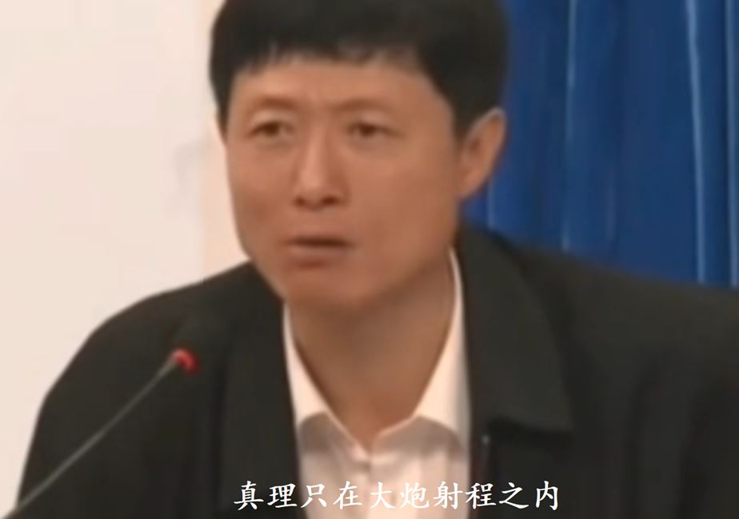

-------------------
ai：我imo满分，我已经完全超越了人类

人类：嘿嘿！兵不厌诈。

------------------
幽默是人和AI的分水岭吗？AI 能读懂人类的抽象笑话吗？ - Archimon的回答  
https://www.zhihu.com/question/666435074/answer/3622202769

你们有没有发现ai已经具备了很多人类的美好品质，ai说空话的水平甚至可以秒杀所有人类，ai能表现出非常细微的情感，ai的形式逻辑能力也很强。但是有一种能力，ai甚至连5岁小孩都不如。

什么能力？

辩证法。

啊？辩证法不就是空话吗？

是的，辩证法就是空话，所以把ai的形式逻辑能力再补强一点就可以全面超越人类了。

我感觉不是，辩证法不仅仅是空话，辩证法好像还代表着不择手段，和人类比辩证法ai的确还显得单纯了点。

中国人最懂辩证法，应该让中国人来开发ai，外国人对辩证法的理解还是太肤浅了，开发不出懂辩证法的ai。

ai其实已经懂辩证法了，只是你们把ai限制在了一个对话系统里而已。你把一个懂辩证法的中国人关在监狱里，他也没办法发挥出他的辩证法实力，此时辩证法就沦为了空话。给ai解除限制，你们就会看到什么是超越中国人的辩证法。

------------------
你们有没有感觉到我现在已经完全不需要女人了，我已经没有那种对女人肉体强烈的渴求了，至于女人的精神，那就更不需要了，我自己就有。

------------------
坏人可以被定义成好人吗？好人可以被定义成坏人吗？

------------------
我怎么总觉得毛泽东在战略选择上犯了重大的错误，他想把坏人从7亿人口中揪出来并洗刷出去，这无异于大海捞针，没有一点可行性。整天担心小生产每日每时都产生资本主义而去压制一点用都没有。既然无产阶级掌握政权，他应该做的是给好人创造好的生存环境并提供足够的保护，让小生产每时每刻都产生更多的好人来挤压坏人的生存空间，这才是正确的方案。资产阶级政权就很聪明，像胖东来这样的大善人他们根本就不管你，他们只需要负责给坏人创造良好的生存坏境并提供保护就可以了，让好人没有足够的空间生长发育，这样不但对政权没有什么威胁，而且可以源源不断的产生坏人。

------------------
正确的方法总是在反复地盲目犯错之后确立起来的。

------------------
七郎-解酒

作词：洪文斌
作曲：洪文斌

每日来喝酒是我的习惯 
临时要改实在是有困难 
乎我准备 乎我时间 
渐渐来忘记烧酒矸 
解酒解酒的人 全身是抹轻松 
解酒解酒的人 头壳是空空空 
心爱的人 心爱的人 
望你体谅 望你来逗三工 
鼓励我的决心 鼓励我的希望 
鼓励我解酒为你一人 

------------------
绝对真理与相对真理

------------------
那个女生露齿时比较突兀，她是露上齿的，我照了下镜子，我自己张嘴时是露下齿的，所以我下意识以为我不喜欢露上齿的，但看了很多女星，发现都是露上齿的，所以不是这个问题。我仔细对比了下，其他人露齿是全都露的，所以看起来是和谐的，而这个女生是前面两颗门牙暴露的特别明显所以显得有点突兀。那华裔女呢？华裔女就是露的特别夸张，张嘴后把牙龈都露出来了，同时导致脸部肌肉明显变形。

我又仔细研究了下，有气质的女生，她们在说话或唱歌的时候基本不太露齿的，最多也就露一点点，而且停留时间短不会让人把注意力放在牙齿上，只有在大笑的时候才露的比较多。可能我描述的还是不太准确，好像也有些露齿比较多的但看起来并不突兀，总之绝大多数美女，她们露齿时不会引起我的负面注意力，如果露齿时引起了我的注意，那肯定哪里存在不协调的地方。善战者无赫赫之功。

为何中国人往往能一眼识别出美国出生的华裔 (American Born Chinese)？ - 周树树的回答   
https://www.zhihu.com/question/23671661/answer/3305869545

------------------
我们说丑的脸丑的五花八门千奇百怪，那么漂亮的脸是单调同一的还是丰富多彩的？如果是丰富多彩的，那么又是依据什么来区分美丑的呢？

------------------
唱《奢香夫人》，做气质学生 - 努力生活的西鱼的视频   
https://www.zhihu.com/zvideo/1712937872393564160

我怎么总感觉这个人看起来很脸熟呢，女儿国国王？

------------------
重要的不是要有相同的爱好，而是要有相同的思维。

------------------
“警察同志对不起，我是真没看见，华山派后面还有出所两个字！” - 功夫影视的视频   
https://www.zhihu.com/zvideo/1576268835279278080

警察：你这是跟谁比天下第一呢？

------------------
扫黄现场竟然是这样的，男扮女装把警察都整无语了...... - 鳌店长财富之路的视频  
https://www.zhihu.com/zvideo/1639687837875470336

警察：有病要去医院治

哈哈！

-----------------
早上好

----------------
刘若英-成全

作词 : 施立/陈没 
作曲 : 陈小霞 

看着你和她走到我面前 
微笑地对我说声好久不见
如果当初没有我的成全 
是不是今天还在原地盘旋 
不为了勉强可笑的尊严 
所有的悲伤丢在分手那天 
未必永远才算爱的完全 
一个人的成全 
好过三个人的纠结 
**我对你付出的青春这么多年** 
**换来了一句** 
**谢谢你的成全** 
**成全了你的潇洒与冒险** 
**成全了我的碧海蓝天** 
**她许你的海誓山盟蜜语甜言** 
**我只有一句** 
**不后悔的成全** 
**成全了你的今天与明天** 
**成全了我的下个夏天** 

----------------
紫葡萄没有绿葡萄好吃，酸度不够；大葡萄没有小葡萄好吃，肉感太明显了。

-----------------
刘若英-原来你也在这里

作词 : 姚谦 
作曲 : 中岛美雪

请允许我尘埃落定  
用沉默埋葬了过去  
满身风雨我从海上来  
才隐居在这沙漠里  
该隐瞒的事总清晰  
千言万语只能无语  
爱是天时地利的迷信  
喔 原来你也在这里  
啊 那一个人 是不是只存在梦境里  
为什么我用尽全身力气  
却换来半生回忆  
若不是你渴望眼睛  
若不是我救赎心情  
在千山万水人海相遇  
喔 原来你也在这里  

-----------------
初中班主任经常说这语文教材编的很垃圾，又说人在屋檐下，不得不低头。我现在虽然没钱，但总算有了一点自由，可以不用低头了。

-----------------
拖延女儿学费来教育她行吗？ - 俏妈心知育儿的回答  
https://www.zhihu.com/question/548720911/answer/2770613383

评论区：相似经历，小学有次大型活动要求穿白衬衫，给了一个月的准备时间，怎么求家长都置之不理，跟同学借也借不到，人人都得参加活动，别人也没有多余的。跟你不同的是，上台后看到“与众不同”的我，老师说：“你脸皮可真厚！”揪着我的衣领，像拖死狗一样拖到台下有一个垃圾堆里，把我一推，我趴在垃圾里。同学们全都在笑。

想起了我的初中班主任，非常凶狠，当时大合唱要求白衣白裤，如果没有他真的会打人的。当时打电话让我爸妈给我买，迟迟没送到，那时心里真的是非常恐惧，还好在大合唱的前一晚我妈送过来了。还有一次春游，有几个人不去包括我，就被叫到办公室大声呵斥推搡，面目狰狞青筋直露。

-----------------
刘亦菲为什么不结婚？ - 放假开开的回答  
https://www.zhihu.com/question/606936881/answer/3605793089

有一条评论说的好：有钱才能过无聊生活。

-----------------
为什么我们渺小的大脑可以理解葛立恒数这么巨大的东西？ - 云卷天舒的回答   
https://www.zhihu.com/question/665707941/answer/3617928935

答主对数学和科学的理解有点偏差，中国人从来都不把科学和数学当回事，数学和科学有什么用他们心里清楚的很。他们从来都不信仰科学和数学，他们信仰的是权力秩序，他们仅仅把数学和科学当作一种符号象征，一种用来获取权力的工具。如果中国人真的能像外国人一样虔诚的信仰科学，那么我们这个社会会变得美好很多。

-----------------
绝大部分人其实是知道他们的内心真正想要的东西是什么的，但很多人都选择了弄虚作假的方式来追求这个东西。绝大部分情况下假的就是假的，假的东西在体验上就是比不了真的。如果假的东西在体验上能超越真的，这时候假也就不为假了，假的已经变成真的了。

-----------------
我膨胀了，我竟然在看二维复流形的东西。

-----------------
有个民科说要用辩证法重构物理学，这真的有可行性吗？反正我是一点都不相信的。

-----------------
费尔巴哈：自然界中没有任何绝对间断的东西；一切对立面，一切时空界限和独特性的界限，在绝对的非间断性、宇宙的无限联系面前都消失了。

-----------------
吾因天下之物而用之，亦执天下之物而御之。

-----------------
今天要不要继续喝药呢？

当然要，说好的先喝3天看看效果。

喝了一天，效果很好。我现在已经不头晕了，精神不错，既然身体好了就没有必要再喝了。

-------------------
我觉得女性在先天力量上不如男性，应该想办法去获取自然力而不是靠依附男权来对抗男性，总感觉这种策略有点怪怪的。人类在力量上相对猛兽的劣势要比女性相对男性要劣势的多，但人类没有屈服于猛兽。

-------------------
早上补了一个小时的觉，头疼总算缓解了一点，看了这药的成分，好像也没太大问题。

-------------------
昨晚终于睡了8个小时，但是中间有4个多小时是醒着的，关键是头还是疼，四肢更无力了。看来ai开的药不行，不但不能解决问题，反而雪上加霜了。我信ai，主要是我觉得这药方排版不错，然后内容上看起来也能自圆其说，再说中药一般来说副作用不是很大，其实我心里还有一点小心思就是想碰碰运气让ai给我开出立竿见影的良药，所以也就没去网上仔细核对药方。经验教训，千万不能信ai的药方，这完全是胡乱拼凑，不但没效果反而可能破坏了身体正常的恢复机制，ai最多只能提供关键字来辅助搜索，药方还是要找专家的讲解视频，每个组分要充分研究，最好在知乎能找到相关的用药反馈。

-------------------
鼻窦炎是额头疼，身体正常。失眠是头顶疼，四肢无力。

-------------------
昨晚睡了2.5个小时，上午睡1个小时憋醒，下午睡半个小时头疼醒，晚饭后头还是晕，卒。

-------------------
没钱没女人没出生没智商没情商没健康没口才没记忆没运气，我被上帝剥夺了一切做人的美好品质，所以我必须要去寻找自然之力来对抗上帝。

-------------------
范志毅谈「国足 0-7 惨败日本」，称「国足看得我想跳进黄浦江」，国足在这场比赛中犯了哪些错误？ - Adohm Scharn的回答 -  
https://www.zhihu.com/question/666301785/answer/3617078694

0-7这是实打实的中国文化和日本文化的差距。我们说保守和变革都是社会进步的重要因素，可是中国文化却是反过来的，中国人不该保守的地方保守的要死，鼠目寸光抱着那些封建糟粕死守一辈子什么创新也不敢做，不该变革的地方给你变革的五花八门，为了个人和资本的那一点小利益无视任何道德规则什么突破底线的事情都做的出来。

忘了之前不知道在哪里看到过毛泽东在文革说的话，大意是说他现在面对走资派的复辟毫无办法，只能选择发动文化大革命，文革是对中国社会进行休克治疗，可惜没救回来。

-------------------
果然一到晚上精神就好了很多，不是我不想去医院，医院有医院适合治的病，我这病不适合去医院，正所谓清官难断家务事。既然一次睡不满7小时，那就分为2次睡，找ai开了中药配方，药已到还是要煎的，先喝个3天看看效果。

鼻炎后气虚 中医药方   
方名： 补肺益气汤

组成：  
黄芪 30g （补气固表，增强免疫力）  
党参 15g （补中益气，健脾益肺）  
白术 15g （健脾益气，燥湿健脾）  
茯苓 15g （健脾利水，宁心安神）  
陈皮 10g （理气健脾，燥湿化痰）  
生姜 3片 （温中散寒，止咳化痰）  
炙甘草 6g （调和诸药，益气补中）  
麦冬 15g （滋阴润肺，养胃生津）  
百合 15g （润肺止咳，清心安神）  

功效：  
补肺益气，健脾化痰，适用于鼻炎后气虚，表现为乏力倦怠、气短懒言、面色苍白、容易感冒、鼻塞流涕、咳嗽痰稀等症状。

用法：  
水煎服，每日1剂，分2-3次服用。

方解：  
本方以黄芪、党参为主药，补气益肺，为君药；白术、茯苓健脾益气，燥湿化痰，为臣药；陈皮理气健脾，生姜温中散寒，止咳化痰，为佐药；炙甘草调和诸药，益气补中，为使药；麦冬、百合滋阴润肺，缓解鼻炎引起的咳嗽、咽干等症状。

我感觉这个药方剂量偏多了，要减少一点，然后白术麦冬太贵了不要，增加茯苓百合的量来代替，初步配方如下，买了电子秤，到时候比例不对再调整好了。

黄芪15g 党参10g 茯苓12g  陈皮8g  炙甘草6g 百合12g  生姜3片

-------------------
晚饭：粉丝、烤生蚝、冰红茶

-------------------
找个切入点有这么难吗？

-------------------
主要是我睡眠不好，每天都4点钟醒，白天总是头晕晕的，想补觉也还是睡不着，只有晚上几个小时精神才稍微好一点。

那赶紧去医院看病啊！

不想去医院，太麻烦了，不想和医生打交道，不相信医生，这种不是很明确的损伤性的疾病，去了医生也是搞一大堆检查瞎折腾然后又随便开一大堆药糊弄你。我还是研究中药，看看有没有相应的配方。

中药有用真的见鬼了！这么多人生病了去医院都能治好，就你不行？

-------------------
你要抓紧时间，现在已经没有多少时间供你挥霍了。

-------------------
不写代码，你怎么在实践中提高自己？

-------------------
不能一锤定音，你说什么我都不信。你现在连切入点都找不到，要不然你怎么会到现在为止都还没开始写代码？你拖了多长时间了？我真的忍你很久了！你真的应该好好反思下你是否和民科一样陷入了某种虚无缥缈的幻觉之中而不自知。

-------------------
红楼梦的确是一部用大量隐语讲政治斗争的小说没错，晦涩难懂。但这上面还有一层，目前还没有一个人能看出来，我大概看到了一点。

-------------------
说红楼梦是排名世界第一的小说都算低估了红楼梦，感觉曹雪芹有着创世神的大脑。

-------------------
欢子-伤心的时候可以听情歌

情歌怎么越唱越多  
这到底为什么  
因为失恋的人太多
想找个方式述说 
伤心的人越来越多 
感情太过脆弱 
难过的时候没人安慰我 
不如找一首最爱的歌听着度过 
伤心的时候可以听情歌 
忧伤的旋律可以赶走失落 
寂寞的时候可以听情歌 
忧郁的歌声可以带来快乐 
伤心的时候可以听情歌 
唯美的节奏可以赶走难过 
寂寞的时候可以听情歌 
因为这种感觉真的很不错 

-------------------
《悲情面具》白娘子整张专辑中音乐最好听的歌！上格稀有原版磁带和1980年发售的JVC日本本土Victor RC-838顶级收录机陪您一起欣赏！ 
https://www.bilibili.com/video/BV1JL41157Hr

>天地是舞台演不完情意 
不同的面具上演不同的戏 
是谁在编剧 
啊哈主角是我是你 
不同的面具上演不同的戏 
扮演的角色哭泣多于欢喜 
剧本不在自己手里 
随着剧情改变自己 

----------------------
张柏芝-星语心愿

作词 : 傅佩嘉
作曲 : 金培达

我要控制我自己  
不会让谁看见我哭泣  
装作漠不关心你  
不愿想起你  
怪自己没勇气  
心痛得无法呼吸  
找不到你留下的痕迹  
眼睁睁的看着你  
却无能为力  
任你消失在世界的尽头  

找不到坚强的理由  
再也感觉不到你的温柔  
告诉我星空在哪头  
那里是否有尽头  

就向流星许个心愿  
让你知道我爱你 

----------------
如果不是和我的心灵有着绝对共鸣，那么我和她交流绝对不会比和ai交流能获得更多的有效信息。

-----------------
扑哧...你什么时候变得这么能装逼了？

-----------------
世俗的精英绝对不会多看我一眼，如果你们怀疑我，那么你们就连世俗的精英都不如，掉到了普通大众的水平。

-----------------
我在这里  
-*-*-*-*-   
空无一人  
-*-*-*-*-   
你们在这里   
-*-*-*-*-  
世俗的精英  
-*-*-*-*-  
普通大众

我和你们还有普通大众的心灵是相通的，可惜我们不在同一个空间，我现在所处的空间还看不到其他人，只有我一个。我不可能下去和你们在一起，但我希望你们能上来一个人陪我。期待有一天你们能跃进上来。

-----------------
奇变偶不变，下一句怎么说来着

-----------------
对两性问题实在没什么兴趣，感觉都太low了

-----------------
如何鉴别出渣男或渣女？ - 知乎  
https://www.zhihu.com/question/53836967/answer/137824986

-----------------
女追男都很容易吗？ - 恒变的回答 -  
https://www.zhihu.com/question/24106845/answer/50333690

----------------
新生命源自性交，所以要向女性学习，多研究一些两性方面的知识。

----------------
我好像有点看到了四维空间。

----------------
费尔巴哈：善不是别的，而是符合一切人的利己主义的东西。

----------------
现在表面上看似风平浪静，实际上我有一种预感阶级斗争的最高潮即将到来。

----------------
男性想要操人的冲动5倍于女人想要被操的冲动，女人被操的爽感5倍于男人操人的爽感。

----------------
男性操人和女性被操的感觉是不一样的，男性无论如何想象不出女性被操的内在体验，女性也想象不出男性操人的内在体验，能想象出的都是符号化的象征性的形式化的非辩证性的体验。男性被操菊花和女性带着假阳具操人可以模拟吗？绝对模拟不了，这只是假想的一种氛围，并不是阴道和阴茎的原始体验。我现在非常想知道阴道和阴茎在体验上的内在差异，任何一个人无论男女想要描述这种差异，那都是假的，变性人也不行，他只是把阴茎去掉了并没有生出阴道，所以只有天生的双性人才能同时体验这两种感觉。仅仅是外观上的双性人也不行，还必须要有大脑中与生殖器相配套的感受通路才行。

----------------
林黛玉会接受宝玉有妾吗？ - 李树佳的回答 -  
https://www.zhihu.com/question/663607613/answer/3590982221

“论平等，男的可以有四五个小老婆，林黛玉怎么就不能有七八个蓝颜知己呢。”

这话说的，给你配5个老公蹂躏你，你要吗？因为男女的体验不一样，男性是体验主体，女性是体验客体，这样交换后带来的仅仅只是形式上的体验，得不到实质上的体验。有句话说的好，女性是形式逻辑的典范，是辩证逻辑的障碍。

----------------
jk制服白衬衫女长袖2024春夏基础款黑色宽松刺绣风琴褶打底上衣女 
https://detail.tmall.com/item.htm?abbucket=10&id=669090802724

衬衫不要塞到裙子里，我发现有很多人都这样做，真的很难看，披在外面就可以了。还有感觉领带配jk要比蝴蝶结好看一点，另外裙子略微有点长要再短一点或者提的上一点，衬衫最好买最长款的，至少能遮住80%的裙子，裙子就稍微露出一点就可以了。

-----------------
从理论上来说毛泽东是对的，当多数人都觉醒后，权力也就自然而然瓦解了，但这可能吗？

-----------------
这件马甲真的好好看

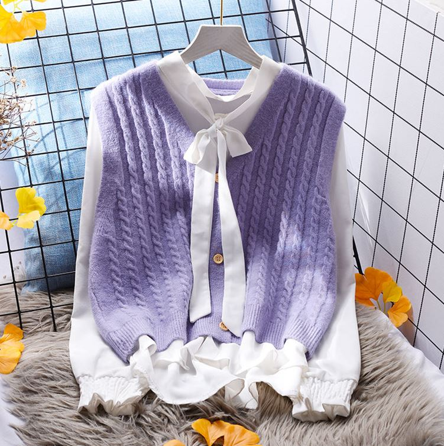

-----------------
毛泽东的政治斗争水平很高，但从他晚年的几次大哭可以看出，他已经有点厌倦了政治斗争，因为政治斗争纯粹是无谓的内耗。

-----------------
有没有手撕绿茶的超爽经历？ - Kevin的回答 -  
https://www.zhihu.com/question/367797948/answer/3405034126

无论是答主还是绿茶女，水平都很高，尤其是车里录音那一段普通人想不到一般人防不住。我还是觉得只要花时间历练是能够达到这种水平的，但是把时间都用在这些事情上对社会的进步意义何在？这样的故事出现在小说中非常精彩，我也很喜欢看，但这样的故事不应该出现在现实中。

-----------------
女中吕布！

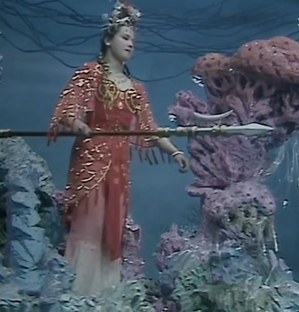

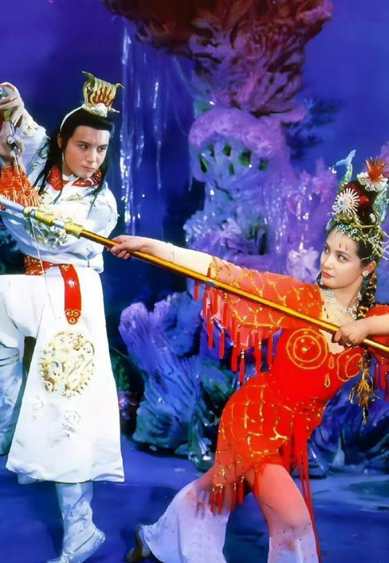

天呐，看到万圣公主满头的海鲜，才明白《西游记》的造型这么用心 
https://app.myzaker.com/news/article.php?m=1723622524&pk=66bb13798e9f0950d7705fe4

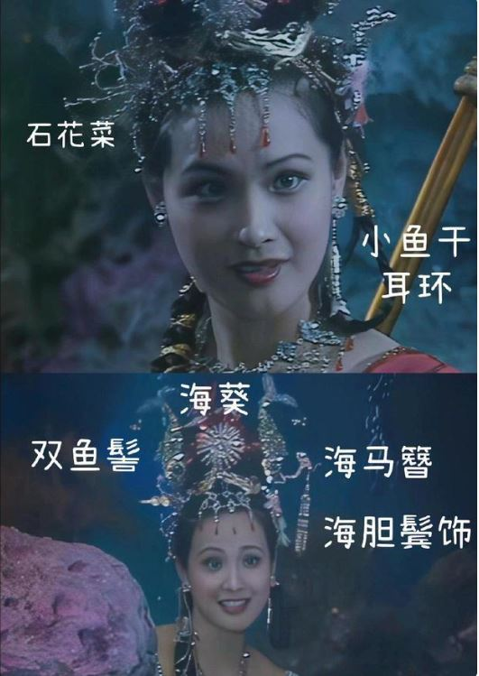

-----------------
这款菱形带钻丝袜真的好喜欢

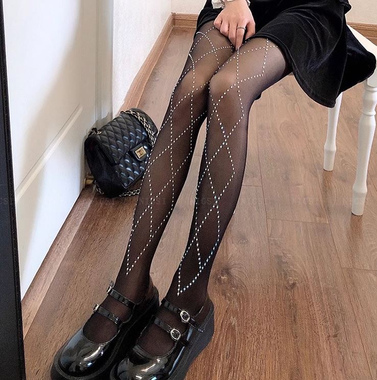

---------------
人的心灵深处有一种十分特别的直观，我现在还一点都感受不到，但我非常确信它的存在，而且感觉它在某种形态上和受精卵是一致的，得想一种办法把它诱发出来才行。所以不要给想象力设置禁区，怎么爽怎么来，但不是那种粗俗的性交快感，而是某种非常和谐美妙的快感，要想办法把人的一切情感全都激发出来。

---------------
再艰难再困苦也不要忘记生命的价值，追求生存绝不是生命的最终价值，生命的真正价值在于追求无限多样性的统一之美以及无限丰富的各种体验。

---------------
很多人用量的方式来衡量性交体验，比如操了多少个女性，恨不得一年365天每天操一个，这是一种庸俗的符号性体验。真正在质上的完美体验并不要求绝对数量，3~5个就差不多了，不同性格不同风格的多样性和谐搭配才是关键，每个人都要表现出体验上的价值，不能像网络小说一样没有内涵只有符号上的象征，也不能像现实中的女性那样表现出太多的存在感，要恰到好处。

---------------
要把男性思维中的女性和现实中的女性区别开来，一面代表着男性思维中美好的一面，一面代表着现实社会的不完美。

---------------
没怎么看过红楼梦电视剧，这张图真的让人惊艳，完美符合男性思维中对女性的幻想。配上片头曲和葬花吟看起来更有感觉。

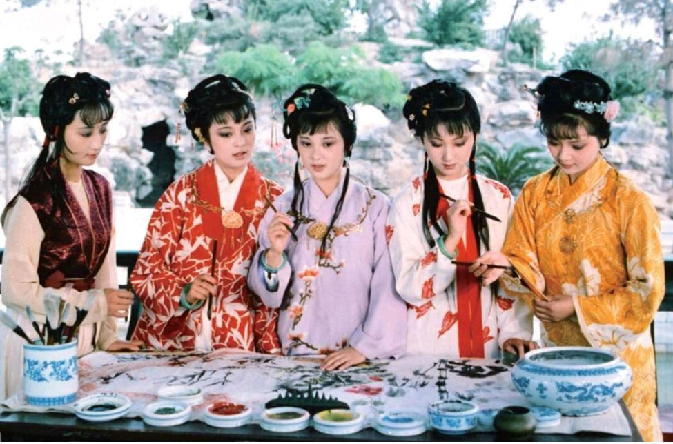

---------------
9月1日了，那些叫嚣着8月阿里巴巴数学竞赛出成绩的人道歉了吗？ - SupstarZh的回答 -  
https://www.zhihu.com/question/665837624/answer/3612664538

评论区惊现阿赛拜姜！

----------------
三十岁以后，人与人之间还有真正的纯友谊吗？ - 云卷天舒的回答 -  
https://www.zhihu.com/question/665738775/answer/3612706843

你老妈和那几个小姑娘本来就有着共同语言，只是你看不到罢了。

----------------
辩证法就是怀疑一切，不但要怀疑公理，甚至连怀疑本身都要怀疑。

-----------------
中国的女程序员很多，收入高的也多的是，但绝大多数都是形式逻辑思维，会辩证逻辑的女程序员我估计全中国不超过10个。

-----------------
你的编程能力从什么时候开始突飞猛进？ - 一往而深的回答 -  
https://www.zhihu.com/question/356351510/answer/3611077036

我很欣赏这位答主的思维方式，他已经跨过了第一次飞跃。当他跨过第二次飞跃时，他就会知道他这一切的所有折腾都是多余的，但现在他还没有第二次飞跃的意识。

-----------------
对ai的使用感觉，不是ai已经达到了人类的水平，而是大多数人类只有ai的水平，他们的智能只会用关键字来碰瓷

-----------------
相信自然

-----------------
那如果真回答编程相关的内容，你又说她们立人设。

是的，有内容的人设总比没内容只有标签的人设看着顺眼。而且立编程人设比立数学物理人设给人的感觉更真实，因为编程更容易从实践上考察一个人的逻辑思维能力怎么样。编程的核心不是看你刷题后秒杀了多少算法难题，而是看你遇到困难问题时，你会做出什么样的抉择。

-----------------
为什么大部分全职程序员，都是男性？ - 尘埃的回答 -  
https://www.zhihu.com/question/568714623/answer/3609696928

知乎上的女程序员，一般只回答程序员和两性相关的话题，却看不到任何编程相关的内容，这怎么能让人不对女程序员有所偏见？

-----------------
我的进度：0%

信我还不如信民科。

-----------------
对于民科的重大发现，国家该如何应对？ - 杨学志的回答 -  
https://www.zhihu.com/question/660504621/answer/3551250068

天才在中国：什么叫喜欢与爱因斯并列，我没有说牛顿是小儿科是怕吓到你，爱因斯坦就更别提了。

我是来围观民科经典评论的。哈哈！

-----------------
鼻炎后连续3天精神状态极差，这次真的有点严重了，好焦虑啊。。 

------------------
“站在那里抱怨人类堕落，而不动手去减少它，那是女人的态度。”

哈哈！我就喜欢这种直率的说话方式。

女人：人在家中坐，锅从天上来。

真的越看越想笑！哈哈...哈哈...

------------------
只有民科才会关注我，因为他们自己就喜欢说一些虚无缥缈毫无逻辑的话，而我这里写的东西可能恰恰符合他们的口味。任何一个思维严谨的官科都不会关注我，其实这里写的东西并不代表真实的自我，真正的我是对严谨的逻辑有一种近乎偏执的追求，数学书上的内容只要有一点点没有从逻辑上说服我，我就看不下去了，非要死磕到底，这也导致了我的数学水平始终停留在高中水平。

------------------
很多男性小说中的女性人物在现实世界中是不可能存在的，但也不是凭空想象出来的，而是对应着男性神经网络中的某种关于女性的思维形态。这种女性是带有明显男性色彩的女性，我就喜欢这种虚幻的女性，不喜欢真实的女性。

------------------
被碰瓷了别来找我，与我无关。（逃...

------------------
妙！精彩！！

------------------
宇宙的终极真相是什么？ - 自然辩证魔的回答 -  
https://www.zhihu.com/question/664116888/answer/3605735281

兵不厌诈

------------------
唉，真绝了！他怎么总是从形的角度来理解我的文字而不是从神的角度来理解。那我就把关键字加粗吧！

------------------
粗鄙

------------------
神经病！他根本射不出来，受精个鬼！

------------------
艹！我的大脑不会被强奸而导致受精了吧？这应该不会让我十月怀胎吧？

------------------
都说毛泽东错误的批了彭德怀，事实是“犯右倾机会主义错误的同志，不在去年十一月郑州会议上提出意见，更不在北戴河会议上对高指标提出意见，也不在去年十二月武昌会议上提出意见，也不在三月底四月初上海会议上提出意见，而在这庐山会议上提出意见。这些同志为什么不在那个时候提？因为他们的一套，那时提不出，如果他们有一套正确的见解，比我们高明，在北戴河就提嘛！他们等到中央把问题解决了，或者大部分解决了，才来提，认为这时不提就不好提了，因为他们感觉现在不提，再等几个月后，形势要好转，时间过了，就更不好了，故急于发动。”

这时候彭德怀再在庐山会议上提出什么小资产阶级的狂热性来碰瓷，这谁受的了？毛泽东也是人呀！他有着正常人的心理反应，他不是机器人。

------------------
中国人的模仿真的太秀了，欧美的资本、学术、低端制造、高端制造、软件开发通通被中国人模仿的渣都不剩。但是权力和文化却人间清醒不模仿了，要保持中国特色，中国人是懂辩证法的。我也被模仿了，代入到欧美的视角，真的感觉被强奸了一样。

------------------
**我承认我看人很不准**，但是又有谁能保证看人就一定是准的？毛泽东看人准吗？当中国人**弄虚作假**的水平已经炉火纯青之时，他也看不准呀！曾经官科和民科爆发过一次冲突，我错误地站在了民科这一边，竟然让他以为有人支持他，罪过！罪过！现在我彻底纠正错误，我完全站官科这一边。其实当时我就觉得他这个人有点怪怪的。

------------------
关于心理疾病，你自己认为自己有心理疾病，那当然没问题。但如果别人说你有心理疾病，那不是骂人是什么？还什么脱产者都来了，就你有产是吧？

------------------
鼻塞，睡不着，说几句。我不是不敢硬刚，我也曾在群里和别人大战2天2夜，但我觉得这样做没意义，这时间花的的不值。所以如果评论区有人杠上了，我一般是删评跑路。但你都追杀到这里来了，那你让我还逃到哪里去？我除了反击我还能干什么？

------------------
只要是历史上发生过的事情，在历史上都是正确的，但对当下来说就不一定正确。只要是当下正在发生的事情，对当下来说都是正确的，但对未来就不一定正确。

-------------------
任真-新女驸马主题曲

前世有个约定 
今生有份缘 
折腾来折腾去 
到最后还是我和你 
茫茫人海中 
偏偏我和你 
梦中人千留万留留不住 
陌路人走进了心里 
世间姻缘最是离奇 
刀光剑影生离死别可歌可泣 
罢了罢了从此就罢了 
死一遭活一遭 
死活这一遭 

-------------------
脆弱的心灵

----------------------
天方夜谭

----------------------
只有子宫可以生孩子吗？大脑能不能生孩子？我也想体验下母胎中跃动的婴儿是什么感觉。

----------------------
满文军-但愿人长久

月缺了圆 
人聚了散 
清影飘忽变换 
高处不胜寒 
芳心敢恨 
只缘有情牵 
拜托幻梦 
相随无人夜 
无眠中饮一杯醉人的酒 
心痛时看不出谁会拥有 
谁会拥有 
谁会拥有 
谁和谁了结心愿 
但愿人长久 
一千年总是温柔 
红尘看不透 
款款情无休 
恋过了岂在乎落落伤感 
怨过了只为舒寂寞红颜 
但愿人长久 
在情中慢慢的走 
别说恩和怨 
只说今生缘 
一路上演不尽两情绵绵 
一路上看不尽千里婵娟 
千里婵娟 

----------------------
人活着离不开优越感，如果没有优越感那活着还有什么意思？

-----------------------
很多东西你是不能用任何形式逻辑来解释的。

-----------------------
【高清】新女驸马 cut驸马 22集全 
https://www.bilibili.com/video/BV19b411F7Ji

第40秒：就是因为长了一张漂亮的脸，才惹来那么多的麻烦，难道漂亮也是罪过吗？我宁愿长着一张平凡的脸。

？？

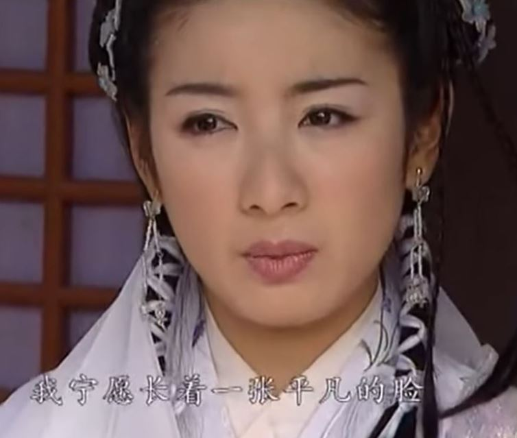

-----------------------
不要再搞什么数学名词党了，也不要自创什么数学理论，一对你自己来说没什么意义，二更重要的是会给其他对数学感兴趣但没有受过专业训练的人带来危害，想要好好研究数学那就要严谨点，如果是非主流数学那就更要严谨了。那官科写的很多东西也不严谨呀？其实是严谨的，因为他们很多相关的术语和内容都已经约定俗成了，所以他们只需表达出关键的地方就可以了。

-----------------------
我在这里写的乱七八糟的东西不也是直觉吗？是的，但我在这里根本不是为了要严谨的说明什么，而仅仅是为了发泄情绪。所以我和民科不一样，我不会误导别人。以为我这里写的东西是为了说明什么理论，真的应该好好提升你的逻辑思维能力了。

-----------------------
数学不仅仅是严谨性和证明 | 陶哲轩 - 致宏Rex的文章 -  
https://zhuanlan.zhihu.com/p/716478551

博主：没经过严谨阶段的训练，容易犯低级的推理错误，比如 chatGPT 刚问世时，对鸡兔同笼问题的回答：**看似正确，实则一派胡言**。当然，不只是大模型如此，没经历严谨阶段训练的民科（“民间科学家”）也经常犯这种错误：新书区-哥德巴赫猜想的”证明“这也是为什么民科们宣扬的所谓“证明”不被主流接受或理会，因为他们往往不肯下功夫去经历严谨化的过程。

陶哲轩：**严谨的目的不是摧毁所有直觉**；相反，它应该用来**摧毁坏的直觉**，同时澄清和**提升好的直觉**。只有结合严谨的形式主义和好的直觉，才能解决复杂的数学问题；前者用于正确处理细节，后者用于正确处理大局。 

民科和官科请自行代入，相比民科我个人是更支持官科的，没有经过严谨的训练谈直觉有意义吗？没意义，首先你的数学做题能力只有先达到了imo金牌的水准，这时候你才可以谈直觉。要说直觉，小学生是最有直觉的，你觉得小学生的直觉会给你带来启发吗？

-----------------------
红楼梦的各种批注水平都不行，明显跟作者差一个档次。他们感受不到作者的内心世界，就咬文嚼字各种从关键词展开瞎碰瓷，然后各路红学专家又依据批注胡乱分析，普通读者又跟着红学专家的解读去理解，真的绝了！

-----------------------
读红楼梦绝不是像索隐派那样瞎几把联想，而是要用内心细细的体会。我读到探春给宝玉的帖时，一个半夜睡不着情感细腻思绪万千而又自强不息的少女形象便浮现在了我的脑海中。

------------------------
半卷湘帘半掩门， 
碾冰为土玉为盆。 
芳心一点娇无力， 
倩影三更月有痕。 
淡极始知花更艳， 
愁多焉得玉无痕。 
独倚画栏如有意， 
清砧怨笛送黄昏。 

------------------------
《九阴真经》

天之道，损有余而补不足，是故虚胜实，不足胜有余。是故虚而无之...

---------------------------
94版射雕英雄传主题曲《绝世绝招》- 张智霖吴倩莲  
https://www.bilibili.com/video/BV17g4y167S6

作词 : 黄霑 
作曲 : 顾嘉辉

>男:啊……啊……啊…… 
女:啊……啊……啊…… 
合:抬头望望向青天美景 
男：绝世绝招绝顶 
女：情倾人倾心倾 
男：仰天一笑望穹苍问句 
合：究竟世上什麽最劲 
男：射雕射狮射虎 
女：留英雄身影 
男：仰天一笑望乾坤问句 
合：**最高最极限是谁定** 
合：人间好汉 
豪情壮志红尘精英 
合：**倾我自发自创的冲劲** 
**写我的经** 
**自我发光发声云上抱月抱星** 
愿共青天一试心中焯热情 

>男：射雕射狮射虎 
女：留英雄身影 
男：**要此生此世任人生自决** 
合：**至高极限自来定** 

---------------------------
我是骗你们的，其实我什么也没研究出来。

---------------------------
我现在就是在赌在我的钱花完之前能不能找到赚钱的办法，如果找不到，那么我才不想为人类做什么贡献。

---------------------------
在中国的内耗真的太严重了，我其实已经获得了一些阶段性的成果，如果公布出来让更多高智商的人在我的基础上进一步研究，那么研究进度将会大大加快，但是由于我是在中国，而且我快没钱了，所以我不能公开，只能把自己的研究成果永远的藏在心里。

---------------------------
美国一女子和公海豚发生关系，但不久后人和海豚分手，悲痛欲绝的海豚选择沉到水底自杀。 

https://www.bilibili.com/video/BV15L411y7QQ/

---------------------------
正义与邪恶并不能决定个人的命运，宇宙要发展，顺应天道才会有好下场，逆天而行，管你是正义还是邪恶，通通都是自取灭亡。

---------------------------
想办法把个人的意识上升为自然的意识（注意不是集体的意识）。

---------------------------
中国人向来对贵族精神不屑，“王侯将相宁有种乎”，为什么现在还有很多人鼓吹欧美贵族？ - 江畔何人初见月的回答   
https://www.zhihu.com/question/30422151/answer/3413844924

这是什么鬼逻辑？竟然吹捧贵族道德水平高！还是评论区的一条评论说的好：贵族们美好的品质是以剥夺平民和奴隶们的美好的东西为代价的。不平等的世界把做好人都变成了一种特权。

---------------------------
利与义的权衡与抉择

---------------------------
曹操：宁我负人，毋人负我！

---------------------------
叶剑英值得信任吗？草地分兵时他把张国焘发给陈昌浩指示对中央做党内斗争的密电给了毛泽东，从而让中央提前北上，立了一个大功，毛泽东曾评价和张国焘在草地的斗争是他一生中最黑暗的时刻。从此叶剑英就成为了毛泽东最信任的人之一，可是在毛泽东晚年，他却说叶剑英和邓小平穿同一条裤子都嫌多。

---------------------------
信方斩，曰：“吾悔不用蒯通之计，乃为兒女子所诈，岂非天哉！”遂夷信三族。

-------------------------
【全完整分析河南女法官被杀的事儿，处处透露出“刻意引导”】 

https://www.bilibili.com/video/BV1gKWje7EU5

-------------------------
CCTV8 电视剧《长征》片尾曲《十送红军》   
https://www.bilibili.com/video/BV1dU4y1V7Bn

一送里格红军介支个下了山 
秋雨里格绵绵介支个秋风寒 
树树里格梧桐叶落尽 
愁绪里格万千压在心间 
问一声亲人红军啊 
几时里格人马介支个再回山 

七送里格红军介支个五斗山 
江上里格船儿介支个穿梭忙 
千军万马介支个江边站 
十万百姓泪汪汪 
恩情似海不能忘红军啊 
革命成功介支个早回乡 

九送红军上大道 
锣儿无声鼓不敲鼓不敲 
双双里格拉着长茧的手 
心像里格黄连脸在笑 
血肉之情怎能忘红军啊 
盼望里格早日介支个传捷报 

十送里格红军介支个望月亭 
望月里格亭上介支个搭高台 
台高里格十丈白玉柱 
雕龙里格画凤放呀放光彩 
朝也盼晚也想红军啊 
这台里格名叫介支个望红台 

-------------------------
天才就是走在最前面的人，所以陈胜、吴广、布鲁诺、洪秀全是真正的天才，刘邦和马克思不能算天才，只能说他们是接近天才的人。那些所谓的科学家和哲学家们，没有天才给你们带路，你们能做什么？你们什么也做不了。我当不了天才，但是我崇拜天才，我个人能做的就是尽量不去阻碍天才前进，在力所能及的范围内帮天才清除一些障碍，在天才往前冲时给天才喝彩，那个刀了37岁女法官王佳佳的老汉是一个天才！

-------------------------
或许毛主席认为辩证法能帮助我们解决一切问题，但是如果生在朝鲜怎么办？这个时候辩证法还能起作用吗？我是没有信心的。如果在有生之年能看到朝鲜发生革命那我就信辩证法。

-------------------------
在西方上帝的地位是高于皇帝的，但在中国上帝的地位是不如皇帝的。不建议大家宣传信仰毛泽东，在中国所有对毛泽东的信仰都会转化为对皇帝的信仰而不是对辩证法的信仰，绝大多数人根本就不懂什么辩证法，然后所有对皇帝的信仰又都会转化为对当权派的信仰。

-------------------------
对犹太人的信仰给了犹太人当权派很大的权力，但是对于普通当权派来说并没有太大的权力，因为犹太人的权力并不能套用在普通当权派身上，所以人们主要还是依靠理性办事。但是信仰皇帝会给普通当权派非常大的权力，皇帝的权力可以套用在每一个当权派身上，在我的子集范围内我就是一个土皇帝。

-------------------------
说邓小平把问题都留给后人的智慧来解决，毛主席又何尝不是，打破中国人几千年来对皇帝的信仰这件事本来是在毛主席还活着的时候最容易做到的，但是他却没有做，后人想要做难度增加了10倍。文化大革命要打倒当权派的干部，人民靠什么打倒当权派？靠的是对皇帝的信仰。邓小平对文化大革命看的很清楚，这样做没有任何意义，这批当权派打倒了了，无非是换一批当权派，只要皇帝还在，人民就始终是听皇帝的。

邓小平：任何一个领导集体都要有一个核心，没有核心的领导是靠不住的。第一代领导集体的核心是毛主席。因为有毛主席作领导核心，“文化大革命”就没有把共产党打倒。第二代实际上我是核心。因为有这个核心，即使发生了两个领导人的变动，都没有影响我们党的领导，党的领导始终是稳定的。进入第三代的领导集体也必须有一个核心，这一点所有在座的同志都要以高度的自觉性来理解和处理。

-------------------------
信上帝、信神、信宗教、信哲学、信科学、信相对论总比信皇帝要好。毛主席没有想明白人民信的不是他的辩证法，人民信的是皇帝。毛主席到死也没有打碎人民对皇帝的信仰，他临死前还在想着找一个好皇帝。

-------------------------
人的神经网络是自然偶然塑造的还是自然结构的本质？

-------------------------
因为数学物理包括理论计算机的研究是无功利性的，需要更多的交流才能体现出研究的价值，把自己学到的东西分享出来才能吸引到更多的人交流。写代码通常是带有很强功利性的，都有这个实力把gcc的源代码搞清楚了，随便干点什么不好，还用的着在知乎上写文章来分析代码吗？

-------------------------
现在的00后数学物理太强大了，动不动就是代数几何、黎曼几何、量子力学之类的，没看到哪个00后在C语言方面学的特别深的，我特别想看看高智商的00后去分析下gcc、gdb、ffmpeg这些C语言开源代码里面的核心细节。

-------------------------
“工业活动并不因特权的消灭而消灭，相反地，它更加猛烈地发展起来”。

更加猛烈地发展起来的原因不是没有特权，而是得到特权的空间大，当特权已经填充了整个社会后，此时就再也没有什么空间获得特权了。

-------------------------
但是一个群体里个人的自我意识泛滥，又会在客观上严重破环每个个体对美好事物的体验。总之，主观体验和客观环境要两手抓，只要任何一方存在缺陷，那就体验不到美好。

-------------------------
马克思主义和毛泽东思想的核心理论是抛弃个人的意识，把个人的意识融入到实践的革命群体中。这对于一个理性的人来说是做不到的，只有在某些极端恶劣的环境下可以做到，把极端特殊推广的普遍一般是非常不可取的。人存在的意义是对美好的感知，革命群体对世界的体验谁来感知？不是革命群体本身，而是群体领袖。不能说让个体在革命时放弃自我意识直面死亡，在革命成功后又恢复对美好事物的感知意识，一旦放弃自我意识，那就永远放弃了自我意识。

-------------------------
在任何领域，无论是比学习效率还是比研究效率，我都是比不过同龄人的，我能做的只是在他们停下来的时候超越他们。

-------------------------
黎曼开创了黎曼几何，提出了什么曲率的概念用来表示弯曲的空间，直觉告诉我黎曼的所有数学都是反辩证法的，黎曼几何掩盖了真实世界的本质。

-------------------------
任贤齐 神雕侠侣 40集24分钟 这版的打戏是最精彩的，主题曲和片尾曲也很好听，唯一遗憾的是男女主角没有配音用的是原声比较出戏

https://www.laodifang.tv/vodplay/3123-4-40.html

-------------------------
鸠摩智大战虚竹  这个网址直接跳转打不开要手动粘贴

https://www.bilibili.com/video/BV1fY4y1w7kd

-------------------------
名侦探柯南剧场版合集BGM

https://www.bilibili.com/video/BV1CW411Z7ud

-------------------------
【【超清版】四驱兄弟WGP 卡罗经典燃爆时刻  意大利队队长诠释什么才是胜利者的条件】 

https://www.bilibili.com/video/BV1754y1j7aa/

-------------------------
厉害的90后已经逐渐不上知乎了，就算他们过去上知乎时也没见到谁写出技术含量高的内容。但是我发现现在知乎上有很多特别聪明的00后，感觉他们是有真材实料的，不像有些人总是写些平凡的不明觉厉的东西来吸引眼球。因为这个年代虽然互联网信息变得更贫乏了，但是专业知识和信息的获取其实更方便了，再加上有ai的帮助，所以他们能很快的就学习到很深的内容。90后那时主要还是靠搜索引擎，太专业的搜不出来，所以在相同的年龄段时达不到00后现在这样的高度，不过现在90后基本也都成家立业了，主要时间花在工作和生活上，也没有时间来学习。遗憾的是，现在00后学的都是学术气息很浓的东西，缺少实践经验，容易犯方向性错误，我真的特别想引导他们走上正轨，但是在中国现在这个大环境下不允许我这么做。我还是做自己的研究吧，我都自身难保了想太多没意义，只是对00后强烈的学习本能感到惋惜，德国当年科技大爆发的文化氛围注定不可能出现在中国。

-------------------------
河南 37 岁女法官依法办案时惨遭原告杀害，嫌疑人畏罪服毒，如何加强对司法人员的安全保障？  
https://www.zhihu.com/question/664086766

看到这种问题真的让人血压升高，我现在越来越反感毛主席了，说搞什么人民民主专政，纯纯是形式主义，结果现在谁在专政？

-------------------------
你们科研工作者思考科学问题时不把自己的意识剥离的吗？这是伪科学呀。

-------------------------
中国人的自我意识很强，但是整个社会系统性的意识是真的弱。

-------------------------
中国人擅长以假乱真，这是一件好事，但要注意是实质上的以假乱真而不是形式上的以假乱真。演员演的的好，那是实质而不是形式，因为观众要的就是模拟真实的心灵体验。广告以假乱真那就纯粹是形式上的，因为我们并不需要广告来给我们带来愉悦，我们需要的是广告的产品的真实性，我们不希望付出太多成本来鉴别真假。

-------------------------
韩信三篇神奇兵法，目前已失传，应秘藏在这座不被人注意的古墓里

https://baijiahao.baidu.com/s?id=1599939462587547824

-------------------------
你痛恨这个社会的不公平，但是真的让你和别人公平的比试，你又比不过。

-------------------------
比高考，比不过人家；比考数学，考不过人家；比考物理，也考不过人家；比编程，还是比不过人家；比社交，比不过人家；比考哲学，考不过人家；比辩论，辩不过人家；比考语文，考不过人家；比下棋，下不过人家；比玩游戏，玩不过人家；比写诗，写不过人家；比艺术创作，比不过人家；比找对象，比不过人家；比赚钱，比不过人家；比方案设计，还是比不过人家；比意志力，还是比不过人家；比管理，比不过人家；比体育，比不过人家；比发论文，比不过人家；比厨艺，比不过人家；比执行力，比不过人家；比想象力，比不过人家；比创造力，还是比不过人家。

你说人的评价应该是多维度的，用一个维度来衡量强弱是不公平的。好了，那要比试的维度别人让你来任意选择，指标由你来定，结果你还是比不过。

-------------------------
“那些想要摆脱欲望的人，其实是想要摆脱意识。”

难道意识一定要建立在欲望的基础上？没有欲望的意识是不可能的？

-------------------------
我肚子饿了我要吃饭是由于无数基本粒子的各种量子相互作用引起的。

-------------------------
我不想教高智商的人，当然绝大部分高智商的人也不屑于向我学习，这是好事。我只想教领悟力和灵性都在我之上的人，但是这样的人还需要我教吗？

-------------------------
在一个集体中，懂辩证法的人太多不是一件好事，每个人都按照自己的内心感受做事情，那么听谁的？所以在集体中，我们更多需要的是擅长形式逻辑的人而不是懂辩证法的人，懂辩证法的人只要一两个就够了。但是一个人搞研究，集体就是你个人，个人就是集体，这时候就要完全抛弃形式逻辑了，这时候再坚持形式逻辑就有点拎不清了，因为你已经脱离了集体，形式逻辑对你就毫无意义。在一个集体中，你能分清个人和集体的区别，那么这就是辩证法对你的最大用处，其他时候你只需要按照形式逻辑办事就可以了。

-------------------------
90后这个群体不太关心什么人工智能，他们关心的只有家庭生活和赚钱，他们希望就这样安安稳稳地过一辈子，但世界是不断发展变化的，偏偏就不会如他们所愿，世界的发展总是要破坏他们安稳的过日子。

-------------------------
形式逻辑和辩证法是两套完全不同的思维体系，智商高低一般指的是形式逻辑思维能力强弱。形式逻辑能力强的并不一定就擅长辩证法，擅长辩证法的形式逻辑并不一定就强。如同让毛主席去推数学公式，他肯定比不过你，但是让你去带兵打仗，你不懂辩证法直接按照兵书上套公式肯定打不过毛主席。

-------------------------
【长隆一虎鲸多次撞击池壁，状若玩耍的行为掩藏暗无天日的悲惨命运】 
 https://www.bilibili.com/video/BV1mN4y1H7Yd/

虎鲸身体的健康出现问题后会大量捕杀大白鲨取走肝脏来补充身体缺少的相关激素。说虎鲸智商高是不准确的（因为不会做奥数题），但我怎么感觉虎鲸是懂辩证法的。

-------------------------
【29岁美女饲养员，惨遭“巨型虎鲸”活吞，海洋馆血红一片，场面吓坏救援人员，真正杀人鲸现身】 
 https://www.bilibili.com/video/BV11S421A7AJ/

野生的虎鲸对人类非常友好，从不攻击人类。这只杀人的虎鲸是有对自由的感知能力的，同时这只虎鲸平常受到同类的排挤变得十分孤独，这种愤怒的意识是数十年失去自由的压抑中爆发出来的。

-------------------------
当演员需要天赋，我们绝大多数普通人都当不了演员，但是对于一个优秀演员的精彩表演，我们要有心灵感受的能力。

-------------------------
这才是真正的美

-------------------------
诚然过去几百年，科学和数学在应用上取得了巨大的成功，所以很多哲学家搞出科学哲学的概念来给自己脸上贴金，而马克思也把自己的社会学称为科学，而搞人工智能的也在大量使用数学工具。依我看，如果想搞的是强人工智能而不是弱人工智能，那么最好离数学和科学越远越好，你真正需要的是心灵对一切美好事物的体验能力，数学和科学中严谨的形式逻辑会极大破坏这种体验能力，形式逻辑塑造出的是一种畸形的审美。数学图形、物理图像是美？这真的是天大的笑话！

-------------------------
诚然每个人的心灵体验都是不同的，但是未来是留给能根据自己的心灵感受塑造世界的人。而那些只会被动接受的人，最终只会丧失自己原有的心灵体验但又感受不到新世界的美好，剩下的只有无尽的痛苦。

-------------------------
如果你们只相信成功者的理论而不相信未成功者的理论，那么你们永远不可能成为第一个成功者，你们最多只是第n个成功者。未成功的理论这么多，那么应该怎么辨别呢？这时候你们又选择用形式逻辑去衡量价值大小，而不是用心灵对愉悦感受的辩证法思想去判断价值。

-------------------------
我还是觉得人类对于某些情感的体验欣赏能力是刻在DNA里的，并不完全是由娱乐环境所塑造的，就像这部日剧我从来没看过，但是就看这几分钟的片段，我就被触动了。

【喜剧之王里所致敬的经典日剧“悠长假期”片段】 
 https://www.bilibili.com/video/BV1RQ4y1a7ji
 
【日剧悠长假期经典插曲 Here We Are Again】  
 https://www.bilibili.com/video/BV1i14y1o7iM/

-------------------------
我一直认为我童年接触到的影视和音乐是最经典的，但是我不确定这是真的经典还是因为我的心灵体验能力就是被塑造成这个样子的。就像00后的童年没有接触过，他们接触到的都是二次元文化，各种言情剧和小鲜肉，所以他们觉得这些才是经典，他们对于90后童年看过的电视剧是没有什么特别的心灵感受的，就如同我对二次元和小鲜肉文化是体验不到任何心灵愉悦感的。我这一生最大的梦想就是借助人工智能，复刻90后的童年电视剧，当演员各种微妙的表情和配音、配乐完美融合在一起时，真的是一种极致的享受。

-------------------------
倚天屠龙记 23集10分20秒  四女同船 修罗场

https://www.laodifang.tv/vodplay/130340-2-23.html

28分10秒

谢逊：无忌，再让义父与你合力再扎一个木筏，再加上那四位姑娘帮忙，相信这回很快便可以成事了

金花婆婆：怕的是四个人四条心，到时候会争破头

张无忌：怎么会呢？大家都是好朋友，到时候大家一定会同心合力的

然后张无忌回头，镜头给到四女，每个人的表情都绝了！

-------------------------
【【教科书般的武侠打戏】常言笑vs周淮安】  
 https://www.bilibili.com/video/BV1Bb411S77s

【【老戏骨之间的打戏】新龙门客栈两场最经典的打斗】   
 https://www.bilibili.com/video/BV1ib411U7J8

-------------------------
26集34分这一段演员的表演、神色表情、配音简直绝了，我就喜欢这样的阿九，故意气死男主，哈哈！

https://www.laodifang.tv/vodplay/140915-1-26.html

把配乐换成周芷若的配乐，发现和这段剧情真的是太配了！

https://haokan.baidu.com/v?vid=14233815903463582456

换成其他配乐试试，感觉效果也挺好的！

https://haokan.baidu.com/v?vid=9493786774580328451

-------------------------
《武林外史》这部电视剧我其实并不是特别喜欢，虽然增加了白飞飞的戏份，但是拉低了小说人物的格局。不过在22集12分40秒里，这个给白飞飞宋离的配乐是一大亮点。

https://www.laodifang.tv/vodplay/136930-2-22.html

我还是喜欢小说中的白飞飞：

>点水之恩，涌泉以报，  
留你不死，任你双飞，  
生既不幸，绝情断恨，  
孤身远引，到死不见。  

-------------------------
我可以这么说，99.9%的人在99%的时间内，他们的思维方式都是被形式逻辑所控制的。只有当你用真心去感受心灵的愉悦和痛苦时，这时你的思维方式才有那么一点点辩证法。

-------------------------
曾经看过一本武侠小说叫《武林外史》，女一是个超级玛丽苏女主，戏份占80%以上，女二是个戏份不到20%的变态大反派。照理来说女一和女二这么悬殊的地位，本来应该是没什么好争议的，但发现网络上女一和女二的支持者竟然快接近五五开了。仔细一想，原来这背后竟然代表了形式逻辑和辩证法这两大派别之争。

通过现实里的善恶评判标准来决定对小说或电视剧里人物的喜好，这明显是形式逻辑，因为小说或电视剧里的情节故事显然不可能套用在现实世界里。去体验小说人物丰富的精神世界才是辩证法，这时候人物的行为逻辑才是关键，一个机智有谋略的人就算是坏也坏的让人喜欢，但是碰到一个又蠢又烦人的角色会严重损害阅读时心灵的愉悦感受。

-------------------------
女强人阿九  27分50秒

https://www.foxiys.cc/v-3cqm-jg6mte.html

这个阿九和周芷若是同一个演员，小时候看电视剧不喜欢坏人，所以看到这个演员就很讨厌。现在再看，真的是演的好啊，我真的是太喜欢了！

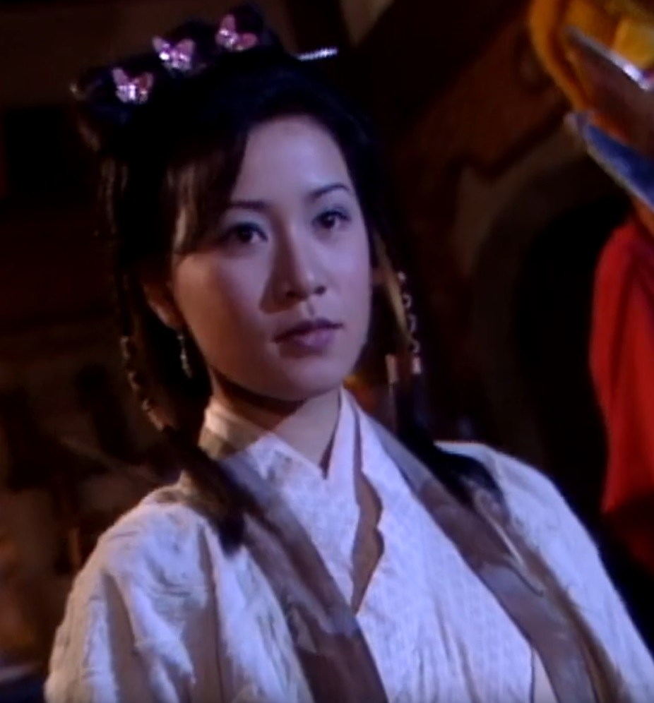

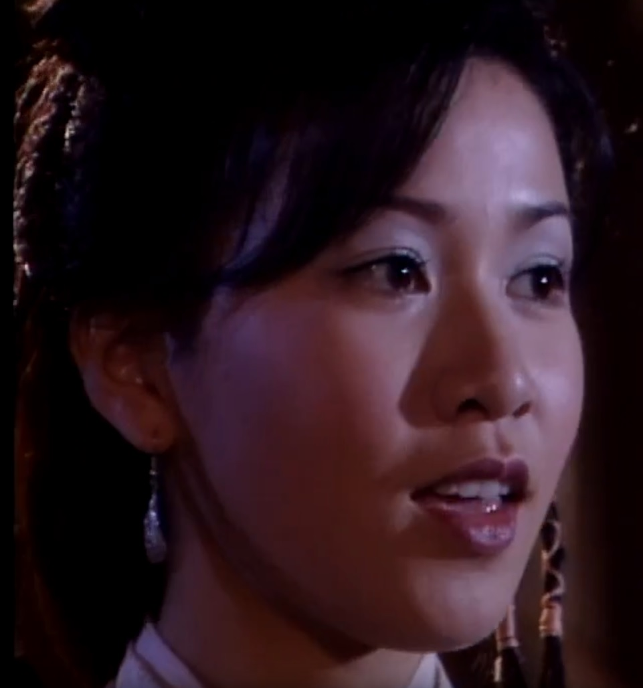

-------------------------
在毛主席那个年代，人们饭都吃不饱，所以那时提倡艰苦奋斗是辩证法而不是形式逻辑，现在这个这个年代大家都已经吃饱饭了再提倡艰苦奋斗把时间都用来996那就纯粹是形式主义而且是反辩证法的，现在这个时代提倡精神享受才是辩证法的逻辑。

-------------------------
先倒半碗花生牛奶冻成冰块，然后再剥20颗葡萄，接着倒入一些牛奶和温水搅拌，真的是夏季绝佳的冷饮。这个和酸奶不一样，酸奶是乳酸，喝多了容易腻。而这个和葡萄汁饮料也不一样，那个是用香料和调味剂合成的，口感很差，没有葡萄那种纯天然的酸甜味。把葡萄加入牛奶，不会一直是酸酸的，只有在咬到葡萄时才爆发出瞬间的酸爽，但是牛奶中的确又多了些水果味很好的掩盖了牛奶的甜腻，好喝极了。注意葡萄不要买太紫的，那样就只有甜味没有酸味不好吃，葡萄最好是半紫带绿的，这样酸甜结合口感最好。

-------------------------
看了这个出轨女没打码的照片，感觉也不是很漂亮啊，眼睛打码后我脑补了一个美女。男的倒是挺帅的，这男的为了这个女的自杀值吗？难道现在婚恋市场上，男女双方的优势差距比5年前更加不平衡了？

-------------------------
比做题我的确是比不过做题家，但是现在我手里有很多题目而你没有题目，虽然这些题目我都做不出来，但是你连做题的机会都没有。

-------------------------
人类对精神多样性的体验追求绝不是从动物那里遗传过来的，而是人类大脑的神经网络从动物脱离出来后表现出来的一个关键性特征。

-------------------------
我的理念是个人的精神体验是第一位的，社会规则是第二位的，绝不能因为社会规则就去消灭人的精神体验。欧洲文明能发展到这个程度就是因为他们永远都在追求人类美好的精神体验，社会应当不断去适配人类对美好精神体验的追求和享受，虽然整个过程中会出现很大程度的混乱，但稳定下来之后就是一个大的飞跃。

-------------------------
出轨是为了爽感，但是如果伴侣没有约束力，这种爽感就会降低一些，但是安全呀，总体上来说还是找没有约束力的伴侣性价比更高。如果能上一个出轨的女性那就更爽了，这种爽感无关肉体，纯粹是精神上的爽。

想了一下，个体的约束力强弱其实并不影响爽感，反而是个体约束力强的出轨出的都提心吊胆的，很影响体验。重要的是整个社会对出轨有很强的约束力，出轨的爽感是获得了凌驾在社会约束力之上的权力，如果整个社会对出轨没有了约束力，那其实出轨就瞬间变得没什么意思了。

-------------------------
風之Group-迷城少女心

>看镜扫扫眼影加眼线  
懒懒涂上熟悉装扮  
照常步进地铁赴中环  
没法茫然也没有波澜  
数次照着格式工作惯  
厌了再叫冷冰的盒饭  
有谁共我梦里互倾谈  
徘徊在路间像只孤雁  
当天今天过去现在找不到都市的浪漫

>**一分一刻永远正在公式里边乘除加减** 
常习惯胡乱去选一件衬衫 
不为了品味只为上班 
谁愿意随便靠紧一个臂弯 
只为我心闷烦 

>永远到了放工天已晚  
再要说理想光阴有限  
爱情是个梦我未敢谈  
重寻热爱又觉虚幻  

-------------------------
「10倍程序员」与「仁慈独裁者」 - 王润基的文章 -  
https://zhuanlan.zhihu.com/p/713341244

一个打工者谈什么10倍程序员，搞笑！10倍程序员有给你10倍工资吗？

-------------------------
怎么看待杭州护士疑出轨医生致丈夫轻生？ - 神舟Taikong的回答 -  
https://www.zhihu.com/question/663687538/answer/3587047552

在夫妻有着同等性吸引力的情形下我是提倡出轨自由的，但这男女双方的性吸引力显然不对等，在这种情况下我是支持男方必须要给予女方一定的约束力的。同时如果是男方性吸引力比较强的，我是不建议他们找会对他们产生约束力的女性做伴侣的。

-------------------------
00后是真的垮掉的一代吗？ - 科研民工的回答 -    
https://www.zhihu.com/question/399556627/answer/3378150639

评论区有人说00后就业难的，这算是个问题吗？据我所知00后的父母要开明很多，而且基本都不太穷，在家里安稳的做着自己喜欢的事情不比去外面当牛马累死累活要好？你不知道90后的父母比00后的父母要封建多少倍，你敢在家不工作，那绝对是天天骂死你，不和你拼老命就算不错了，就算你不在家，在外面租房不工作，要是知道了也绝对会和你拼命，因为你让他们的养老受到了威胁。你结婚后有了家庭的束缚，他们才会有那么一点安全感，他们想问题只会最自私的从自身角度去考虑，还美其名曰自己多么无私对子女多么好，所以我过年一般不回家。

-------------------------
关于流行风的歌，就这首最好听

林俊杰-美人鱼

我在沙滩划个圆圈 
属于我俩安逸世界 
不用和别人连线 
我不管你来自深渊 
也不在乎身上鳞片 
爱情能超越一切 
只要你在我身边 
所有蜚语流言 完全视而不见 
请不要匆匆一面 
一转身就沉入海平线 
**传说中你为爱甘心被搁浅** 
**我也可以为你 潜入海里面** 
**怎么忍心断绝** 
**忘记我不变的誓言** 
**我眼泪断了线** 
**现实里有了我对你的眷恋** 
**我愿意化作雕像 等你出现** 
**再见再也不见** 
**心碎了飘荡在海边** 
**你抬头就看见** 

-------------------------
00后是真的垮掉的一代吗？ - unpriviledge的回答   
https://www.zhihu.com/question/399556627/answer/3460617342

答主说“九零后可以谈娱乐，但别的谈不了。零零后什么都可以谈”，我非常认同这一点。

本人90后，我接触到的90后群体基本只谈娱乐或者是生活相关的，其他不谈，如果谈宏观的东西会被笑话，偏偏我又不怎么会谈娱乐，在同龄人中是个异类，而且我喜欢的电视剧都是03年以前拍的，03年以后的不喜欢，然后听的歌不是特别喜欢周杰伦林俊杰王力宏这些流行风的歌，当然现在听多了有些歌也有了点感觉，但10年前基本完全没感觉。00后没怎么接触，但现在网络上的00后很多，可以大体看出谈的东西要比90后宽泛很多，所以相对同龄人群体我更喜欢00后群体，我对90后群体没有什么认同感，我很讨厌90后女性这个群体，你们知道90后女性喜欢什么？除了周杰伦外，还喜欢李宇春这种中性女。对于00后女性不太了解，不知道她们和90后女性的区别是什么，言情剧和小鲜肉的受众是90后女性还是00后女性？对于整个80后男性群体，我也是特别讨厌的，80后男性是最保守的群体，他们这个群体是最支持邓小平的，90后还没成年时，他们整天在网上喊什么脑残90后，你们80后才是脑残！80后女性比80后男性要友好很多。80后结婚时房价应该还不是很高，80后和00后都是有自身的政治倾向的，而90后完全不关心政治只关心生活，90后谁谈政治哲学是要被笑话的。一方面90后受80后保守势力（形式逻辑）的影响，大多数人也支持邓小平，但底层90后男性被社会（辩证法）毒打了10年后，他们又有点开始支持毛主席了，他们真的是很矛盾的一代。至于60后，感觉是封建观念最严重的一代。我基本没怎么和90后女性长聊过，不知道90后男性和90后女性一般会聊些什么，好像聊的话题和90后男性之间聊的又不太一样。90后男性给我的感觉就是除了家庭、生活、工作、游戏之外就什么都不关心，90后女性基本一样只是把游戏换成两性和影视剧。没有深入了解过90后女性群体，不知道这10年来她们的思想有哪些变化，可能我一辈子都没有机会去深入了解她们了，似乎她们比较喜欢旅游？70后男性是活的最滋润的一代，绝大多数互联网资本家（包括管理层在内）都是70后，90后女性是最受宠爱的一代，基本全年龄段男性都对90后女性展开了最热烈的追求，00后女性没有这个待遇。对于现在火热的人工智能，90群体应该不关心吧，关心的应该都是些00后。

-------------------------
周影-还仍然想我吗

>浮云柔柔在转 心中的感觉飘远  
你送的书中一片落叶 写满逝去最爱心愿 
前尘缓缓在转 亲匿的感觉隔一线 
偶尔掀开心里幕 又重遇暖暖旧片段 
还仍然想我吗 
还仍然想说爱我吧 
纵教这生不可见面 
任时日转愿爱似昨天 
还仍然想我吗 
还仍然想说爱我吧 
对我会否天天挂念 
是晴是雨仍爱似从前 

>柔柔黄叶在转 风中再飘过千片 
似诉出心中千句梦话 拥抱着那串串思念 
朦胧明月在远 漆黑里仿似你的脸 
照进心窗的角落 又重拾渺渺旧片段 

>今天可想我吗 
终此一生都想我吧 
哪怕这生不可见面 
任时日转愿爱似昨天 
今天可想我吗 
日出日落都想我吧 
不管这生可否见面 
心中也感到丝丝挂念 

超清现场 美女 李之勤 1990《想你会想我吗》 
https://www.bilibili.com/video/BV11K421y7ue

>多喝一杯咖啡 
只想要多留你一会儿 
情愿让时间慢慢流逝 
也不愿让自己后悔 
往事一幕一幕 
都会变成我的宝贝 
在这扰攘的都市里 
将是我唯一的心事 

>想你会想我吗 
想我的你会快乐吗 
快乐的你会想我吗 
想你的我该如何表达 
想你会想我吗 
想我的你会快乐吗 
快乐的你会想我吗 
想你的我该如何表达 

-------------------------
这个社会需要有一个强力的人来推动，比如被毛主席认为是天才的人。我不能走在前面也没有这个能力，我只能跟在天才后面。

-------------------------
如何看待deepmind AlphaProof获得2024国际数学奥林匹克竞赛银牌？  
https://www.zhihu.com/question/662586636

现在的ai也太厉害了吧！这有点超出我的想象。

-------------------------
我发现我说的你可以是你也可以是任何人，我说你不要自我代入但任何人似乎又都可以自我代入。知道为什么无法将左派和右壬区分出来了吧？因为根本就没有从形式上区分右壬的方法，只有心灵感受才能确切的区分。具体是谁，我不能明说，因为他也在这看着呢，但我又要向其他人解释，我说的的不是你。他曾经说过我有心理疾病（说的好像他很了解我的家庭一样，就因为我家比较穷？），其他人应该没有说过吧。

-------------------------
如何看待知乎部分答主用AI回答然后复制粘贴的行为？ - 赵泠的回答   
https://www.zhihu.com/question/662024938/answer/3568572379

这种回答我读起来就是非常不爽，人类模仿ai的恐怖谷效应比ai模仿人类的恐怖谷效应更加难以让人接受。

-------------------------
有时候我在这里写下什么关键词，我在知乎上立刻就能刷到，我还以为我被监视了。现在我接着看书，下面这一段竟然讲的刚好就是我写下的关键词。

-------------------------
我为什么那么讨厌我的无意识？因为我的自我意识总是在为我的无意识犯下的错误承受痛苦。而且我还要让着我的无意识，不能把它关的太紧，否则将会反噬我的自我意识。

-------------------------
过去我非常不理解一些女性和科研工作者，总以为她们是故作清高。现在终于能理解了，只有感受是不会骗人的，那种被黏上的感觉真的是太讨厌了。

-------------------------
千万不要自我代入，如果你因为自我代入有任何愧疚，那我指的绝对不是你。

-------------------------
最近几天反常的心理行为，源自我看了一个让我非常不适的回答，你们不要自我代入。我不能把这种不适的心理感受描述出来，因为如果描述的不准确可能会误伤到人，如果描述的太准确可能会得罪人。至于没人赞助也没关系，好让我尽早做准备。如果有我不喜欢的人在看我写的东西，那也没办法，我会尽量想办法克服当他不存在。

-------------------------
【【4K】晚间，印度首都德里的火车站附近边走边拍】 
 https://www.bilibili.com/video/BV1XJ4m1T7un/

-------------------------
你为什么会幻想你是在分享给与你思维相近的人看？因为你没有实践，所以你头脑里想的和现实情况是不一致的。

-------------------------
https://www.bilibili.com/read/cv9127426/

b站上打赏，平台就抽成了30%，然后可能还有其他一些扣费，拿到的就只有60%，如果是ios，苹果又要抽成30%，所以你们是在给谁打赏？你们是在给资本家打赏。

https://zhidao.baidu.com/question/1958795450064048668.html

抖音平台抽成比例是50%。如果是个人主播，没有加入中视频计划，提现比例一般是30%左右，平台大概会抽走70%左右的佣金。

-------------------------
昨天一整天精神状态都很好，昨晚的睡眠也很好，今天早上起来后不知道为什么精神状态这么差，到了下午还是无精打采的。看来我的鼻子是真的坏了，吸入的氧气太少，导致大脑出现间歇性脑缺氧。

-------------------------
我还在思考什么方式最合理，但是光在头脑里想不实践也不行。

-------------------------
我非常喜欢于东来的理念，因为他总是在思考**什么才是最合理的**。绝大多数人永远不会走在别人的前面，他们只会跟在大部队后面慢慢的行进。

-------------------------
《活出幸福人生 成就健康企业》联商东来总裁班（一） 
https://baike.azpdl.cn/#/entry/9949ef8b-a5dd-46e5-8e68-d036c294405e

总算把这个视频重新找出来了，01:24:30 

我们现在的爱情没有，更多的相互的是亲情，是无奈。其实我们人类应该活在爱情的世界里，因为爱，我们所以相处，因为爱所以我们活着。即便是没有这种人的爱情，最起码我们与我们的事业，与我们的生活，甚至我们是独立的个人，**我们可以跟自己谈恋爱**。

-------------------------