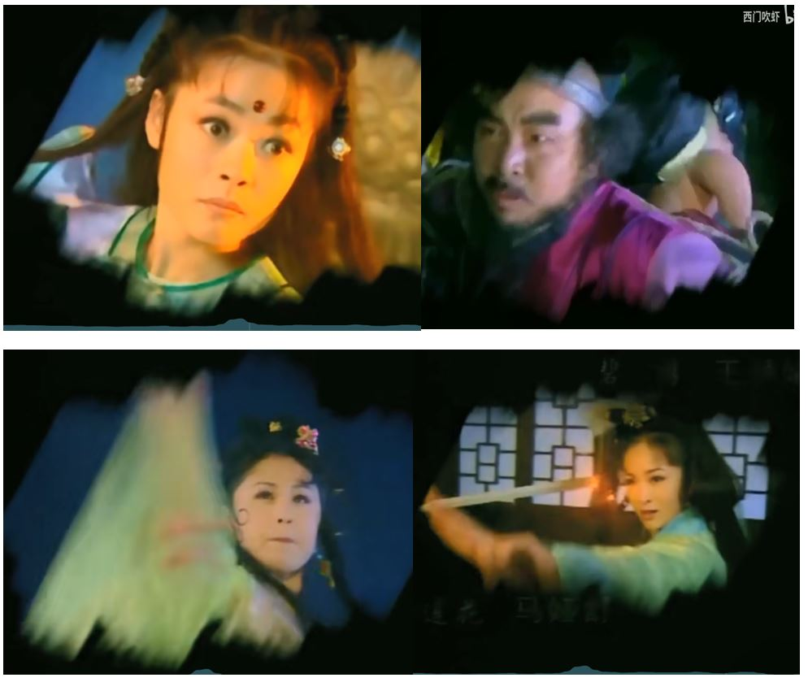
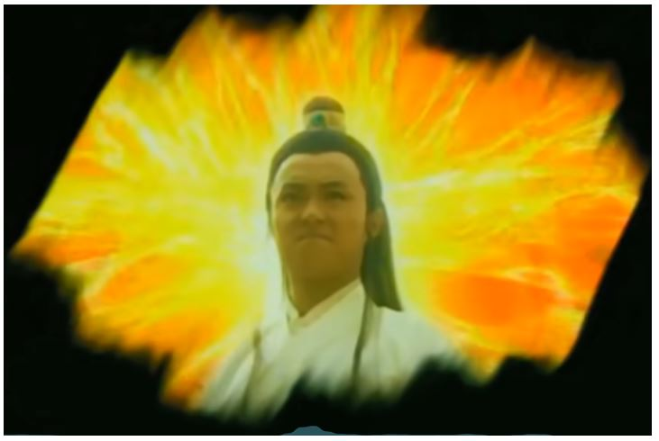
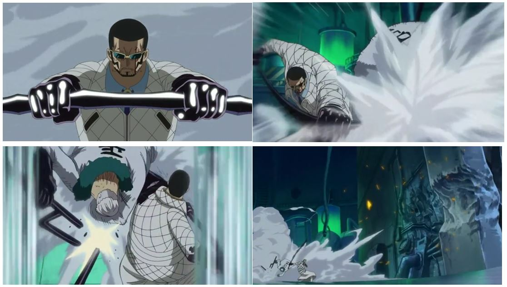
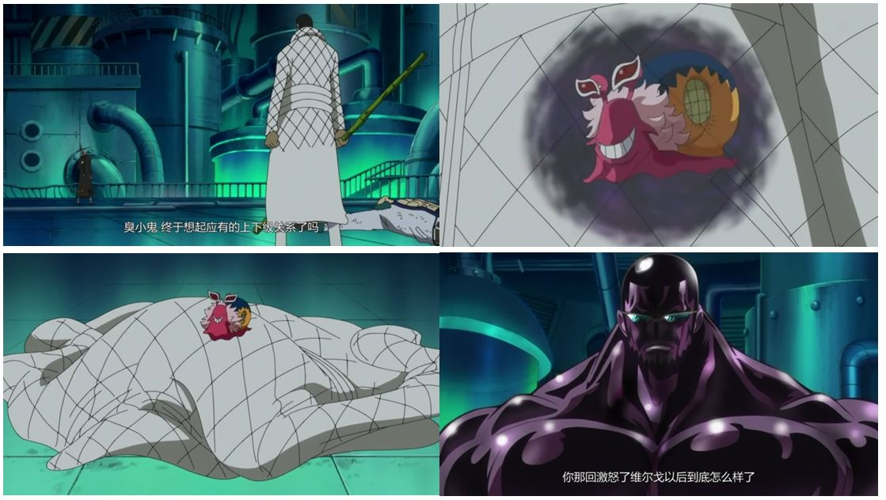
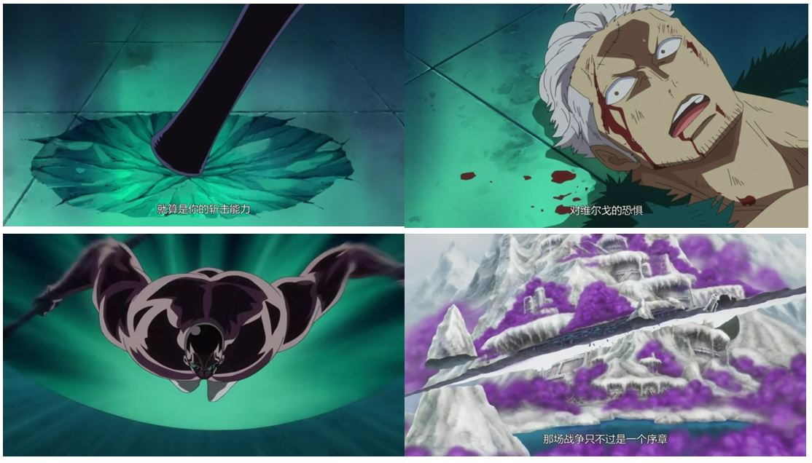
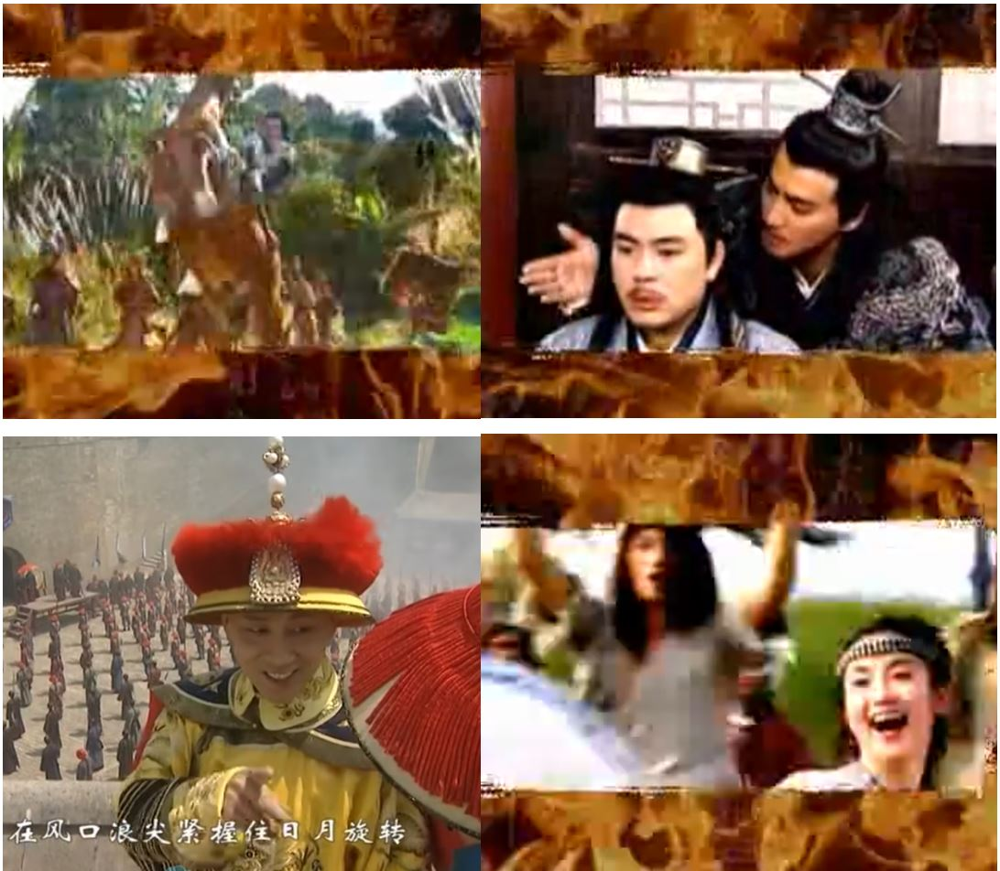

2025年想法：

人的意识并不是完全由人的肉体决定的，也受外部信息场的影响。

------
中国的经济问题出在内部而不是外部。

------
如何看待近期发表在《Science》杂志上关于「大器晚成」的文章，对我们的人才培养体系有何借鉴意义吗？ - 遥远地方剑星的回答  
https://www.zhihu.com/question/1987787265116770829/answer/1989385022633961189

“在某个领域，共有人群10万人，其中青少年就是精英的人有1000人。这个领域的顶尖成年人只有100人，大概是千分之一的比例。这100人中，青少年就是精英的有10人，有90个人青少年时并不是精英。

这个结果能说明“少时了了，大未必佳”吗？其实并不能呀。因为简单的计算就可以发现，青少年精英的1000人中，成才的有10人，占比1/100；而全体人群10万人中，成才的才100人，占比1/1000 。也就是说，如果你是青少年精英，你成才的概率是平均概率的10倍。这恰恰说明青少年时就是精英的人，更有可能成为领域内顶尖人才呀！”

他想表达的意思不是青少年精英成为顶尖精英的概率更高，而是青少年精英在顶尖人才中的占比少。我们可能期望这100个顶尖人才中，青少年就是精英的能有60个，而实际结果只有10个，远远低于我们的预期。

------
我在精神上好像有一种窒息感，像是没空气了一样。

怎么让自己一直充满精神动力是个难题。

------
天才什么时候都有，最大的难题是如何克服系统性困境，让真正的天才脱颖而出。很多时候，尤其是明朝之后，洪承畴、曾国藩、蒋介石这样的人更容易脱颖而出，而反抗他们的人都比较平庸，看的让人憋屈，出现毛泽东那真的是运气太好了，光靠运气是注定走不远的。

------
已知的错误是可以避免的，未知的错误是在进步过程中不可避免要犯的，否则就无法进步。

------
执念，历史的进步与退步的判定与个人利益的选择。

------
努尔哈赤是李成梁养起来的，清军是袁崇焕养起来的。

------
可能真的有神存在，但我不应该把我自己代入为神。神的意识依赖于我接触到的外部信息，而我的意识依赖于我的各方面个人品质、才能、生活经历，我的功劳充其量只不过是作为一个连接神的信息媒介而已。

-----
微信有多傻逼？ - Jeremy的回答  
https://www.zhihu.com/question/277911771/answer/1987503466168460268

牧遥杏村：最早的时候2012年到2014年，微信、陌陌约跑成功率极高，那时候你情我愿没有金钱的关系。后来变了，全是交易……

惭愧，我当年也效仿别人约过，一个都没约到，确切的说是一个都没能聊下去。我总感觉能在微信、陌陌约到的男生，他们就算不用微信陌陌也能用其他渠道约到。

-----
朋友就是不尴尬，尴尬了就不是朋友。

如果是相爱的朋友，尴尬也会变得不尴尬。

------
一个男人在体验上的成功只能在30岁之前，30岁后的成功都是外在的，而不是内在的心动体验。

------
行动的艺术和行为艺术的区别，行为艺术指的是一种哗众取宠，而行动的艺术是一种生活的态度。

------
干部在执行指示时不考虑民众，也不懂得上级意图，仅仅享受权力的快感。

-------
要么值钱的人从不值钱的人中脱离出来，平行演化，不一定是生殖隔离，也可以是其他什么方式分离。如果还是在一起共生演化，那么不值钱人的下限会限制值钱人的文明上限。

-------
内容生成和内容审核应当是一体两面的。

-------
合作社不是在数量资金人力上的扩大规模，而是分工协作取长补短，组成一个有机配合的统一整体。

------
就是你要做的事情是对的，但是你不能用更错误的方式来证明事情的正确性，我们要做的是首先纠正大错误而不是纠缠于小错误。就如同有人编造撒切尔的话说苏联怎么怎么样，因为你本身的行为就错了，后面你想表达的事情对错和你一点关系都没有，毛泽东自己当了皇帝，却要发动人民反抗皇帝，这没意义。

所以李世民是对的，他要做的是大正确的事情，而不在乎一些小错误（假的大错误）。

这里就显现出了女性还有大部分追求稳定的男性的对错观和我的巨大分歧，他们总是过于看重局部的、规则的、形式的、世俗大众的是非观，而我则看重系统的、辩证的、历史发展的、实践创新的是非观。我认为形式逻辑不是真理，形式逻辑是历史发展过程中资源和认识不足时为了方便模仿合作沟通而产生的一种暂时不考虑长远反馈（或基于过去的经验过于担心开拓创新带来的负反馈）的手段。

现实性需要依赖经验，忽略客观实际没有调查实践而随意想象是幻想，用过去的经验和形式逻辑通过简单粗暴的套用来否定未来还没有形成经验的开拓创新也同样是幻想。

------
1949年，叶剑英请毛主席从香山搬到中南海，主席却说：我不做皇帝 - 帝哥说史的文章  
https://zhuanlan.zhihu.com/p/564743114

毛泽东并没有破除中国人五千年的皇帝崇拜，在搬进中南海前毛泽东说我不做皇帝，可最后还是做了皇帝。但有一点他和历史上的皇帝不同，他敢于向社会稳定挑战，他发动的文化大革命极大破坏了新中国刚建立起来没多久的社会稳定,而他写进宪法里的罢工自由我估计未来几十年没有哪个中国领导人会（敢）支持。

------
我不是代表我个人，而是代表能运用辩证法创新的这一类人。中国现在的道路中国的几千年历史已经走过无数遍了，不能说一片黑暗，但上限也就那样了。

-------
西游记后传 - 梦中蝶影

 
 
 

------
文化大革命有效果吗？总是有一点效果的吧？

------
我什么都不专业，音乐意识流我也不确定有没有专业性，也不知道会不会有版权问题，我没有任何盈利，纯亏损。

音乐意识流根本不是我的专业，大概率可能只是神存在的证据。

------
袁凤瑛 - 天若有情

作词:李健达
作曲:罗大佑

原谅话也不讲半句 
此刻生命在凝聚 
过去你曾寻过 
某段失去了的声音 
落日远去人祈望 
留住青春的一刹 
风雨思念置身梦里 
总会有唏嘘 

若果他朝此生不可与你 
那管生命是无奈 
过去也曾尽诉 
往日心里爱的声音 
就像隔世人期望 
重拾当天的一切 
此世短暂转身步过 
萧刹了的空间 

只求望一望 
让爱火永远的高烧 
青春请你归来 
再伴我一会 

 

------
西游记续第4集15分57秒：不有中有 不无中无

 
 

------
要让音乐意识流的肉体隐形精神长期存在。

------
海贼王第273集2分48秒配乐：追いつめられた

11分56秒：身体里冒出蒸气 你在模仿蒸汽机吗

------
新中国成立以前，是90%的中国人都生活在水深火热之中，那个时候不走群众路线不行啊。现在人民都吃饱饭了，人们的悲欢离合各不相同，所以像微信抖音一样再走群众路线强制把所有人都捆绑在一起没什么意思，每个人都应该去建立一个让自己舒适的自由开放丰富有序的小圈子。

------
音乐意识流能不能完全代表我的意识？不能，但我自认为它的意识比我自己的意识要高级。

------
 (x1,x2)可以用((1,0),(0,1))表示的本质是，((1+x1+x2^2),(1+x2+x1^2))可以用([(1,1,0),(0,0,1)],[(0,0,1),(1,1,0)])表示,进而推出（5x0+12x1，5x1+6x0）可以用 ((5 12) (6 5))表示。而不是(x1,x2)可以用((1,0),(0,1))表示就能直接推出（5x0+12x1，5x1+6x0）可以用 ((5 12) (6 5))表示。

------
ROCKETS vs HORNETS 04/14/07 
https://www.youtube.com/watch?v=4OIntX55aJk

------
「Fate/Zero」ED1 MEMORIA中日平假名罗马音对照歌词 
https://www.bilibili.com/opus/434320300000163757

藍井エイル - MEMORIA

作词：蓝井エイル、FUMIO YASUDA 
作曲：FUMIO YASUDA

悄然流转 在久远的记忆中 
一旦轻碰回忆 便会浮现你的面容 
早已司空见惯 你那映在窗边上消沉黯淡的侧脸 
虽然冷漠无情地咽下泪声 那双瞳眸却坚定不移地望着明天 
明知此命运不可逆亦毫无半分畏惧 我衷心相信 

悄然流转  在久远的记忆中 
与你共度年华的证据确实存在于此 
把心潮澎湃的心情告诉我的不正是你吗？ 
哪怕世界支离破碎  我仍然屹立此地 

记得我曾经说过想去海边走走 
你我追逐着无法实现的梦 
在飘零的寒雪当中彷徨失措 
受尽伤害的你  再也不是孤苦伶仃 

即使相隔天涯海角也不曾遗忘 
因为是你教会我何谓光明 
夺眶而出的泪是对你的感激 
昔日彼此结下誓言的天际丝毫没有褪色 

悄然流转  在久远的记忆中 
一旦轻碰回忆  便会浮现你的面容 
即使相隔天涯海角也不曾遗忘你 
与你共度年华的证据确实存在于此 
把心潮澎湃的心情告诉我的不正是你吗？ 
哪怕世界支离破碎  我仍然屹立此地 

昔日彼此结下誓言的天际丝毫没有褪色 

------
大家不要相信音乐意识流这个东西真有什么技术，只能说巧合足够多是因为我运气足够好，运气太好可能会赚很多钱运气太差也可能亏很多钱，只能说我这个运气赚不了钱也亏不了钱，就和打游戏一样，不计较输赢，用时间换点心情的愉悦。

------
吃撑了后下一顿应该少吃而不是不吃，通过饥饿感把胃的消化能力激发出来，不吃可能会导致胃习惯饥饿而暂停工作，恶性循环。

------
我的计算力和反应力极差，但是我自认为我是有能力研究的，我也有能力提升我自己的专业水平，只是我不屑于做那种把学习、研究、实战经验固化为“肌肉”记忆这种事情。

------
我不能去工厂，因为我现在要做的事情还没有工人能代替我。

------
为什么现代编程抵制goto语法？  
https://www.zhihu.com/question/1961937399216047547

抵制goto语法是人类编程的需要，如果是具有认知功能的ai自动编程写的代码一定是有大量goto语句的，不过这个代码人类不看，有了chatgpt后人类可以和ai用自然语言交互编程相关需求和业务，真的需要讨论细节也可以转换成可读性好的C语言。

------
逆天是要经过比较才能确定的，把红楼梦跟三从四德进行比较的确很逆天，但是放在女性穿衣自由的现代社会红楼梦还是太保守了。

------
解析几何，证明圆上任意一点到圆心距离相等。

------
关于文化宣传问题，把外国文化引进中国，没有外国人在做这件事吧？都是中国人在做。但是把中国文化输出到外国，这不是中国人应该做的事情，中国人应该做好中国文化在中国的宣传工作，至于外国人要不要引进随他们自己选择。

------
资本主义的“自由”与共产主义的“集体” - 玛雅大专生的文章   
https://zhuanlan.zhihu.com/p/1905925195241324562

资本主义的“集体”与共产主义的“自由”

------
乔帮主大战四大恶人 李延宗  
https://www.bilibili.com/video/BV1fN4119765/

------
我不是写小说的，也不是想博取关注度，只是音乐意识流真的很奇特，我是想把它当作一种研究意识的实验材料。

明显不是，音乐意识流主要还是娱乐为主，主要是一个人搞研究太寂寞了，想给自己的精神来一些刺激缓解一下寂寞。

------
我觉得黄衫女子应该让这两个人来演

 

-----
过于注重事实性这种思维方式会让人以为很多东西是可以凭空得到的。

-----
蜀山奇侠之仙侣奇缘主题曲——正义柔情永在（郑伊健陈松伶主演） 
https://www.bilibili.com/video/BV16s41117fh/

陈松伶/温兆伦 - 正义柔情永在

作词: 潘伟源
作曲: 徐嘉良

星光与朗月长伴照耀  
清风与白云永不分开  
无惧世间变幻  
那管宇宙变迁  
陪着你 正义柔情永在  
生生世世亦难被替代  
痴痴这份情似比深海  
情义化于剑道  
爱心擦亮剑尖  
陪着你 正义柔情永在  

让爱飘  
两手牵  
天地之间  
心相爱  
共挽手温馨常在  
啊......  
那惧心魔恶妖  
长存浩气俩并肩  
地老天荒不灭心中一份爱  
合俩心  
 两手牵  
相伴相依  
心相爱  
令世间光辉常在  
啊......   
遍地春风在吹  
愁云尽散 朗月开  
浩气充於天地和爱永在  

 
 

------
音乐意识流的互动时间是不需要同步的,不是像下棋一样你下一步我下一步。

------
沙画还原颜值最高剧《小李飞刀》  
https://www.bilibili.com/video/BV1py4y1i7JC/

------
毛泽东：彭真被国民党抓过，怎么出来的，我们不清楚。为什么他们混进党内这么久没有看出来呢？他们的错误我们发觉过，如彭真在延安办党校就犯过错误。在晋察冀时也犯过错误，现在才揭发出来，过去不知道。聂荣臻知道，他是晋察冀的司令员兼政治委员。杨成武也是晋察冀的。彭真到晋察冀不到两年时间，执行王明路线。这个时候的王明路线同10年内战时不同；10年内战时王明路线是“左”的，主张打大城市；抗日战争时期，王明路线是右的，是投降主义。后来，王明也跑了，去莫斯科，是我们送去的。他现在还用假名字写文章骂我们。此外，跑了的还有张国焘，当时是中央政治局委员，红四方面军的领导人，现在香港当美国特务。在井冈山时的总政治部主任、接替我的政委、后勤部长，也都叛了党，跑到国民党方面去了。你看，几朝都是叛变。陈独秀叛变了，瞿秋白被捕后写了自首书。**向忠发（实际上是李立三路线）被捕之后，给敌人带路抓人；敌人把人抓完后，把他也杀了，相当蠢**。王明被捕后也成了叛徒。他被捕了几次，怎样放出来的我们都不知道。在东北，他被日本人抓过；在上海，被蒋介石抓过，然后放出来。饶潄石在新四军时被抓过，怎么放出来的不清楚。彭德怀是国民党的团长，同我们打过仗，后来投机，历来都犯路线性的错误。罗瑞卿是同彭德怀合作过的。彭德怀、罗瑞卿、彭真、陆定一、杨尚昆，他们都是一伙，为什么这么久才揭露？我们是要看一看。他们还里通外国。

胡志明：留下来不是危险得很么？

-------
在一个团队里，你一切都做的很完美，就好像你不存在一样 ❌

当你真的不存在时，你的团队还是完美的运行  ✅

------
agi是一个不可分割的整体，是不可能像软件开发那样分工协作的。

------
一切不合理的东西就是世界的真相。

------
萧十一郎14集16分51秒 江湖心儿女情

23分59秒：凌云幻灭

26分11秒：舞翼烟飞

28分52秒：落日峰下

31分20秒：至少爱过

40分28秒：转弯

---------
海贼王第616集17分01秒：『鬼•竹』

17分51秒配乐：田中公平 - 麦わら海賊団、反撃開始

20分40秒：岩崎文紀 - ルフィvsラチェット Round 2   
https://www.bilibili.com/video/BV1FJM2zvEtg/

秒杀这段是失败的，前面的气氛白烘托了

22分33秒：田中公平 - 食ったら,さぁグランドライン!

187集15分27秒：田中公正 - 海贼

 
 
 

-------
很多问题其实在当时毛泽东也解决不了，他只是想拖延时间，不要那么快就走资本主义道路，让后人来解决问题。

--------
李白 - 梦游天姥吟留别

海客谈瀛洲，烟涛微茫信难求； 
越人语天姥，云霞明灭或可睹。 
天姥连天向天横，势拔五岳掩赤城。 
天台四万八千丈，对此欲倒东南倾。(四万 一作：一万) 

我欲因之梦吴越，一夜飞度镜湖月。 
湖月照我影，送我至剡溪。 
谢公宿处今尚在，渌水荡漾清猿啼。 
脚著谢公屐，身登青云梯。 
半壁见海日，空中闻天鸡。 
千岩万转路不定，迷花倚石忽已暝。 
熊咆龙吟殷岩泉，栗深林兮惊层巅。 
云青青兮欲雨，水澹澹兮生烟。 
列缺霹雳，丘峦崩摧。 
洞天石扉，訇然中开。 
青冥浩荡不见底，日月照耀金银台。 
霓为衣兮风为马，云之君兮纷纷而来下。 
虎鼓瑟兮鸾回车，仙之人兮列如麻。 
忽魂悸以魄动，恍惊起而长嗟。 
惟觉时之枕席，失向来之烟霞。 

世间行乐亦如此，古来万事东流水。 
别君去兮何时还？且放白鹿青崖间，须行即骑访名山。 
安能摧眉折腰事权贵，使我不得开心颜？

------
人类是从猴子中脱离出来的，未来不会有新物种从人类中脱离出来吧？

-------
周星驰自己当导演后拍的不好看，严格来说大部分我没看过。不过之前拍的一些喜剧片演得是真的好，国语配音也很好，只是现在没什么重温的欲望。

他可以演好自己的角色，但是审美品位和全局把控能力都不行。周星驰的采访表现的确不太好，但是术业有专攻，他擅长的是喜剧表演。如果要看这种访谈节目，我不会去看周星驰，我会去看窦文涛。

-------
未来的ai感知摄像机应该是这样的，根据你的一些基本特征来生成录音和录像，同时基本特征的选取和生成方式都有无数种选择。以后拍黄片也不用打码了，别人无法根据视频中的你认出现实中的你，但是真实感又是无可挑剔的，同时在体验上也是完美的。长得漂亮的女生就不要去拍黄片了，因为拍出来的就是你本人，但是你拍出来的在无数ai感知摄像机拍的视频中又是非常普通的，所以去拍也没关系。现在ai生成的图片和视频，从我个人的审美角度看无论是真实感还是体验性都完全不合格，和现实中拍出来的差距很大，当然要区分也是有门槛的，绝大部分普通人甚至ai工程师都区分不出来。

真实性不等于真实感，我认为日本、台湾拍的a片真实感很差，有些韩国的三级片真实感稍微好一点，其实看多了也会觉得很假。

ai感知摄像机除了拍黄片还可以拍电视剧，可以拍出你最喜欢的电视剧，而不用看别人喂给你的电视剧。

--------
亚视四大经典武侠剧超燃武打！浓浓的武侠风，满满的回忆！  
https://www.bilibili.com/video/BV1ft4113743/

1分33秒、3分38秒和3分50秒

配乐：黄邦贤 - 离手剑

------
分类、排序、连接

------
Lのテーマ

-------
刘德华/梁朝伟 - 无间道

作词:林夕 作曲:伍乐城
 
华:我要为我活下去 
也代你活下去 
捱极也未曾累 
伟:忘掉我有没有在陶醉 
若有未来依然要去追 

华:生命太短 明日无限远 
始终都不比永远这样远 
伟:不理会世上长路太多 
终点太少 
木马也要去继续转圈 

华:明明我已昼夜无间 
踏尽面前路 
梦想中的彼岸为何还未到 
伟:明明我已奋力无间 
天天上路 
我不死也为活得好 

合:有没有终点 
谁能知道 
在这尘世的无间道 

华:如何能离开失乐园 
伟:能流连忘返总是情愿 
华:要去到极乐条长路远 
伟:吃苦中苦 
华:苦中苦 
合:亦永不间断 

快到终点 
才能知道 
又再回到起点 
从头上路 

-------
江青“我是毛主席的一条狗，他叫我咬谁我就咬谁”  
https://www.hutong9.net/forum.php?mod=viewthread&tid=166500

江青要做“没有戴帽子的皇帝” 
https://www.jfdaily.com/wx/detail.do?id=7289

江青接着讲到了她和邓小平在政治局内的斗争，自称是“过了河的卒子”，要吃掉邓小平这个“反革命老帅”：

答意大利记者奥琳埃娜·法拉奇问 
http://www.qstheory.cn/books/2019-07/31/c_1119484755_47.htm

邓：江青打着毛主席的旗帜搞，毛主席干预不力，这点，毛主席是有责任的。江青坏透了。怎么给“四人帮”定罪都不过分。“四人帮”伤害了成千上万的人。

-------
《大英雄郑成功》插曲——向天再借五百年（韩磊） 
https://www.bilibili.com/video/BV1Xx411K77a

【康熙王朝】片头曲：向天再借五百年，豪迈帝王之声  
https://www.bilibili.com/video/BV1Fx411n7QM

韩磊 - 向天再借五百年

作词:樊孝斌 作曲:张宏光

沿着江山起起伏伏温柔的曲线 
放马爱的中原爱的北国和江南 
面对冰刀血剑风雨多情的陪伴 
珍惜苍天赐给我的金色的华年 

做人一地肝胆 做人何惧艰险 
豪情不变年复一年 
做人有苦有甜 善恶分开两边 
都为梦中的明天 
看铁蹄铮铮 踏遍万里河山 
我站在风口浪尖紧握住日月旋转 
血（怨）淹没人间 安得太平美满 
我真的还想再活五百年 

我真的还想再活五百年 

 

---------
什么是霍奇猜想，它的证明会给数学带来什么发展？ - 彬彧渊然的回答  
https://www.zhihu.com/question/532951939/answer/2526779745

事情是这样的，我之前刷到这个数学问题，看起来好像很深奥我反正一点都看不懂。然后有个屌毛截了个图，好像又有个专业人士@他让我以为他也是数学专业人士，之后我又在知乎刷到了好几次他的回答，然后就关注了他也没看他过去的回答。现在回过头来再看他那1700个回答，都是些什么玩意儿，这像是有一点点数学专业素养的样子吗？亏我还是学辩证法的人，都学了些什么？看来是学到马桶里去了。知乎的回复拉黑功能挺好用的，可以试试。斗还是要斗的，但是要和高水平的人斗，也就是和我左边的那些人斗，和垃圾有什么好斗的，我不是你的出气筒。

------------
比肩胖东来！河北信誉楼董事长张洪瑞专访时间到（河北卫视20150702期《中华好家风》考古专题节目）  
https://www.bilibili.com/video/BV1CqayeMEas

--------
【虫哥】女扮男装娶公主的童年经典神剧《新女驸马》，这部剧真的是sao话满满啊~   
https://www.bilibili.com/video/BV1h54y1C7HV/

9分51秒：狗屎

--------
是什么东西让语言融合进人类的思考中？最关键的就是情绪和分析，人的头脑中有很多幻想，这两样东西让你知道你是一个生活在现实中的活人。

--------
穿越时空的爱恋片头曲-太多 (建议音效设为现场版) 
https://v.youku.com/v_show/id_XMzk2MjcwMjI2OA

陈冠蒲《穿越时空的爱恋》片头曲《太多》 
https://www.bilibili.com/video/BV1v8411L7Cg

陈冠蒲 - 太多

作词: 李岩修
作曲: 徐嘉良

将爱情肆无忌惮的挥霍 
心都碎了还要计较些什么 
无论你想要什么都让你带走 
如果你觉得自由是快乐 
爱是犯了软弱陈旧的差错 
又何必在乎别人怎么看怎么说 

太多的借口太多的理由 
为了爱情我也背叛了所有 
如果你想离开我就别再畏畏缩缩 
太多的借口太多的理由 
别再问我难过时候怎么过 
或许会好好的活或许会消失无踪 
你在乎什么 

----------
曹颖 - 喜欢你

词曲：古月

喜欢你呀喜欢你 
别以为我想你 
别以为我爱你 谢谢你 
我要说声对不起 跟你say sorry 
撞见别人粘上你呀 我就会在意 
假如把你换成我 把我换成你 
谁都不愿让对方呀 爱情不专一 
Yeh Yeh Yeh 爱我死心塌地 
NO NO NO 爱情不是儿戏 
Yeh Yeh Yeh  啦 •••••• 
NO NO NO  啦 •••••• 

第二集22分30秒插曲：

喜欢你呀喜欢你 
别以为我爱你 
别以为我想你 谢谢你 
真的对不起 跟你say sorry 
撞见别人粘上你呀 我就会在意 
把你换成我 把我换成你 
谁都不愿让对方呀 爱情不专一 

----------
大妈你就不能跟他说一句人没有心一样能活吗 
https://www.bilibili.com/video/BV1sQ4y1D7wH

----------