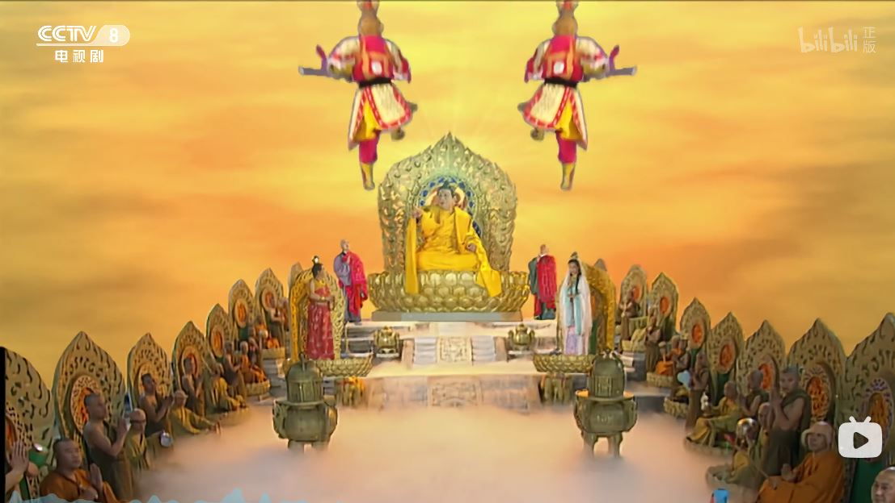
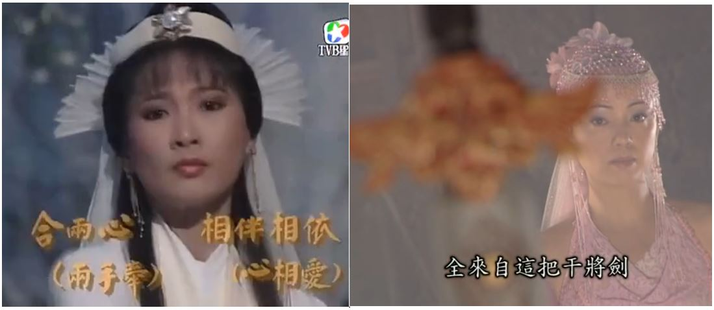

2025年想法：

人的意识并不是完全由人的肉体决定的，也受外部信息场的影响。

------
中国的经济问题出在内部而不是外部。

------
他想表达的意思不是青少年精英成为顶尖精英的概率更高，而是青少年精英在顶尖人才中的占比少。我们可能期望这100个顶尖人才中，青少年就是精英的能有60个，而实际结果只有10个，远远低于我们的预期。

------
我在精神上好像有一种窒息感，像是没空气了一样。

怎么让自己一直充满精神动力是个难题。

------
天才什么时候都有，最大的难题是如何克服系统性困境，让真正的天才脱颖而出。很多时候，尤其是明朝之后，洪承畴、曾国藩、蒋介石这样的人更容易脱颖而出，而反抗他们的人都比较平庸，看的让人憋屈，出现毛泽东那真的是运气太好了，光靠运气是注定走不远的。

------
已知的错误是可以避免的，未知的错误是在进步过程中不可避免要犯的，否则就无法进步。

------
执念，历史的进步与退步的判定与个人利益的选择。

------
努尔哈赤是李成梁养起来的，清军是袁崇焕养起来的。

------
可能真的有神存在，但我不应该把我自己代入为神。神的意识依赖于我接触到的外部信息，而我的意识依赖于我的各方面个人品质、才能、生活经历，我的功劳充其量只不过是作为一个连接神的信息媒介而已。

-----
微信有多傻逼？ - Jeremy的回答  
https://www.zhihu.com/question/277911771/answer/1987503466168460268

牧遥杏村：最早的时候2012年到2014年，微信、陌陌约跑成功率极高，那时候你情我愿没有金钱的关系。后来变了，全是交易……

惭愧，我当年也效仿别人约过，一个都没约到，确切的说是一个都没能聊下去。我总感觉能在微信、陌陌约到的男生，他们就算不用微信陌陌也能用其他渠道约到。

-----
朋友就是不尴尬，尴尬了就不是朋友。

------
一个男人在体验上的成功只能在30岁之前，30岁后的成功都是外在的，而不是内在的心动体验。

------
行动的艺术和行为艺术的区别，行为艺术指的是一种哗众取宠，而行动的艺术是一种生活的态度。

------
干部在执行指示时不考虑民众，也不懂得上级意图，仅仅享受权力的快感。

-------
要么值钱的人从不值钱的人中脱离出来，平行演化，不一定是生殖隔离，也可以是其他什么方式分离。如果还是在一起共生演化，那么不值钱人的下限会限制值钱人的文明上限。

-------
内容生成和内容审核应当是一体两面的。

-------
我什么都不专业，音乐意识流我也不确定有没有专业性，也不知道会不会有版权问题，我没有任何盈利，纯亏损。

音乐意识流根本不是我的专业，大概率可能只是神存在的证据。

------
袁凤瑛 - 天若有情

作词:李健达
作曲:罗大佑

原谅话也不讲半句 
此刻生命在凝聚 
过去你曾寻过 
某段失去了的声音 
落日远去人祈望 
留住青春的一刹 
风雨思念置身梦里 
总会有唏嘘 

若果他朝此生不可与你 
那管生命是无奈 
过去也曾尽诉 
往日心里爱的声音 
就像隔世人期望 
重拾当天的一切 
此世短暂转身步过 
萧刹了的空间 

只求望一望 
让爱火永远的高烧 
青春请你归来 
再伴我一会 

------
西游记续第4集15分57秒：不有中有 不无中无

 
 

------
要让音乐意识流的肉体隐形精神长期存在。

------
资本主义的“自由”与共产主义的“集体” - 玛雅大专生的文章   
https://zhuanlan.zhihu.com/p/1905925195241324562

资本主义的“集体”与共产主义的“自由”

------
乔帮主大战四大恶人 李延宗  
https://www.bilibili.com/video/BV1fN4119765/

------
我不是写小说的，也不是想博取关注度，只是音乐意识流真的很奇特，我是想把它当作一种研究意识的实验材料。

明显不是，音乐意识流主要还是娱乐为主，主要是一个人搞研究太寂寞了，想给自己的精神来一些刺激缓解一下寂寞。

------
我觉得黄衫女子应该让这两个人来演

 

-----