2025年想法：

最新 3.2：

赵薇 - 情深深雨濛濛

作词: 琼瑶
作曲: 徐嘉良

（情..深深 雨..濛濛） 
（情深深雨濛濛） 
（情深深雨濛濛） 
（情深深雨濛濛） 
（情深深雨濛濛） 

情深深 雨濛濛 
多少楼台烟雨中 
记得当初 你侬我侬 
车如流水马如龙 
尽管狂风平地起 
美人如玉剑如虹 

啊情深深雨濛濛 
世界只在你眼中 
相逢不晚为何匆匆 
山山水水几万重 
一曲高歌千行泪 
情在回肠荡气中 

啊情深深雨濛濛 
天也无尽地无穷 
高楼望断 情有独钟 
盼过春夏和秋冬 
盼来盼去盼不尽 
天涯何处是归鸿 

--------
1996年剧版《新龙门客栈》剪辑：常言笑计杀魏忠贤  
https://www.bilibili.com/video/BV1G5411Y7wR

这首琴歌你喜欢吗？（配乐:胡伟立-东厂）

---------
都是些什么垃圾？

----------
郑渊洁承认自己写不过 AI，让 AI 写用自己的手法写文章仅用 4 秒钟，AI 未来会取代作家吗？  
https://www.zhihu.com/question/13616094567

“我觉得未来我们的孩子最需要保护的就是想象力，是最重要的事。”

想象力很重要，但要注意想象力是要和现实中最重要的事情联系起来的，显然想象力不是最重要的事情。

---------
我爱片头 古装美女 
https://v-wb.youku.com/v_show/id_XOTM5OTQxNjg=.html

大概是几年前，想到这个视频，去优酷上找了下还有，但没有保存，就收藏了这个链接。昨天想看一下发现打不开，这个视频的配乐是凡心大动+甜蜜蜜。

我爱片头之 古装美女2  甜蜜蜜前面那段曲子是哪的啊 
https://zhidao.baidu.com/question/51645920.html

我爱片头 影视人物集锦-古装2（我爱片头制作）片头曲是什么~~  
https://zhidao.baidu.com/question/89173282.html

我知道，这首曲子叫凡心大动

古装美女合集2 
https://tv.sohu.com/v/dXMvNDkxNjMxODcvMTc4MjY1Nzguc2h0bWw=.html

我的天，赶紧保存下来。昨天找了很久，一直找不到，还以为这个视频在互联网上消失了。32秒这张图片看起来还行，没找到出处，不知道是谁。找到出处了，是花代珍，清晰版的没那么好看，还是这样模糊的好看。

第十放映室古装美女合集第一版 
https://tv.sohu.com/v/dXMvNDkxNjMyMjUvMTg4MjMwMDcuc2h0bWw=.html

这个作者做的另外一个视频也找到了。总的来说这两个视频中收集的图片并不是最完美的，但是他的特效做的真的非常好，尤其是图片放映的节奏和背景音乐非常搭。

这张很好看，为什么我总感觉还是模糊一点的更有气质，好像还是斜着更好看。

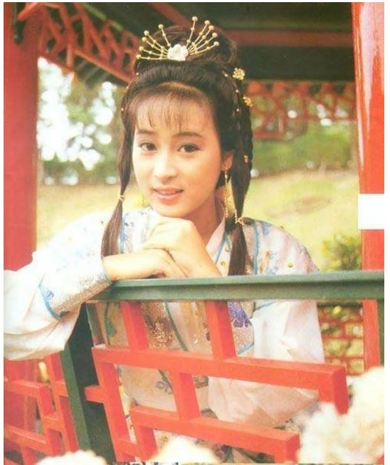 

-------
《大英雄郑成功》插曲——向天再借五百年（韩磊） 
https://www.bilibili.com/video/BV1Xx411K77a

【康熙王朝】片头曲：向天再借五百年，豪迈帝王之声  
https://www.bilibili.com/video/BV1Fx411n7QM

韩磊 - 向天再借五百年

作词:樊孝斌 作曲:张宏光

沿着江山起起伏伏温柔的曲线 
放马爱的中原爱的北国和江南 
面对冰刀血剑风雨多情的陪伴 
珍惜苍天赐给我的金色的华年 

做人一地肝胆 做人何惧艰险 
豪情不变年复一年 
做人有苦有甜 善恶分开两边 
都为梦中的明天 
看铁蹄铮铮 踏遍万里河山 
我站在风口浪尖紧握住日月旋转 
血（怨）淹没人间 安得太平美满 
我真的还想再活五百年 

我真的还想再活五百年 

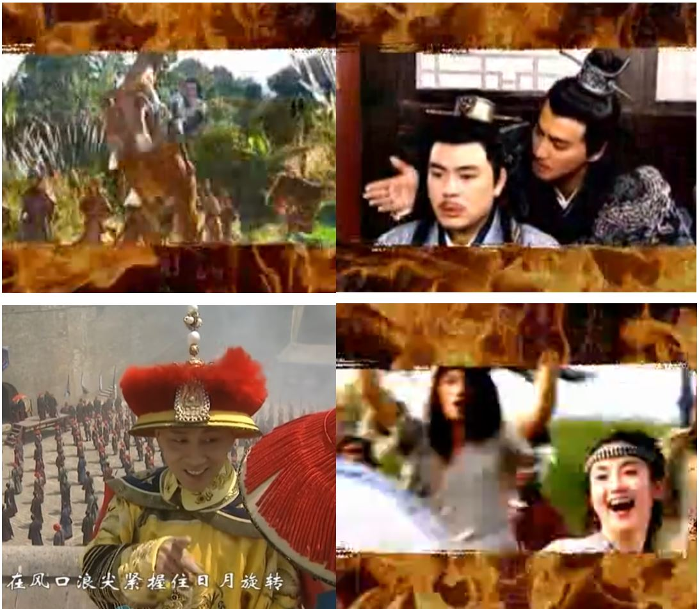 
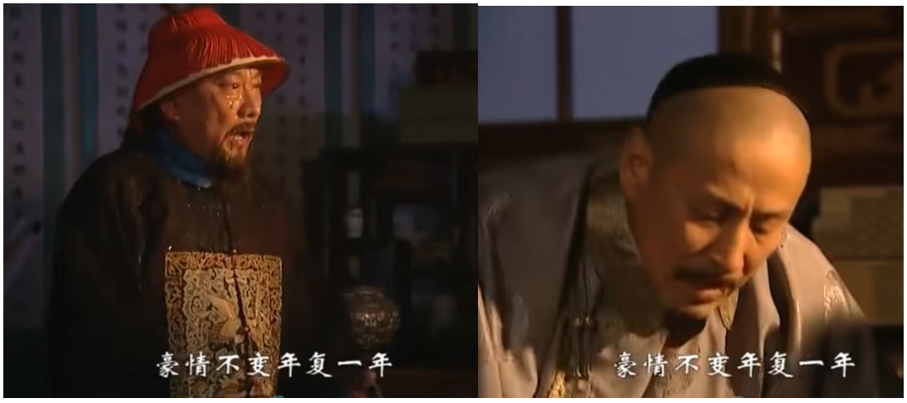

---------

用西游记的方式打开新白娘子传奇 
https://www.bilibili.com/video/BV1NR4y1j7PV

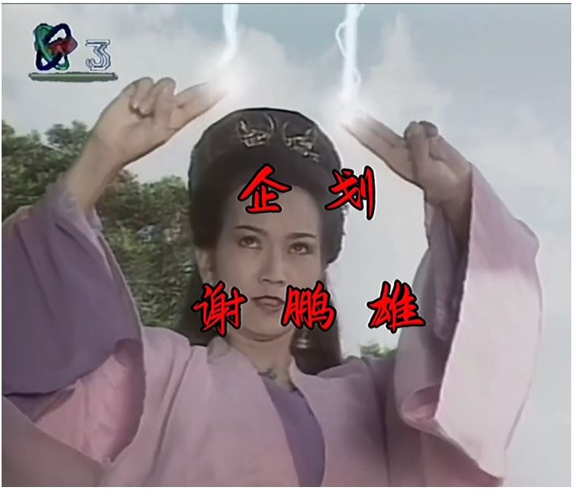 

--------
天才解法震惊人类！谷歌AI破天荒摘得奥数金牌，横扫IMO 42道几何难题 - 新智元的文章  
https://zhuanlan.zhihu.com/p/22246198904

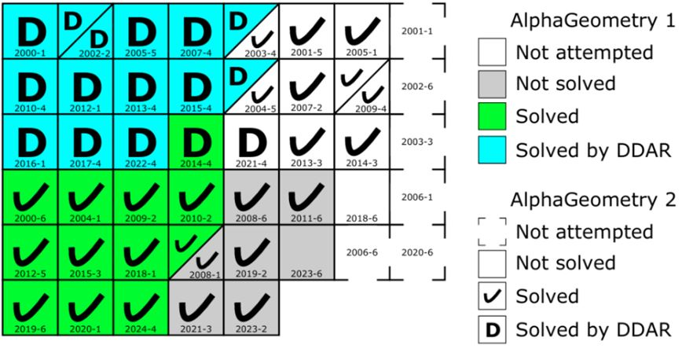 

2018年这题是怎么回事，ai就这题做不出来，反过来能做出2018年那题的人类就一定能做出所有题目吗？
  
-------
去年九月，中共中央于一九六五年九月十八日至十月十二日在北京举行工作会议，在会议期间，十月十日，毛泽东同大区第一书记谈了话，提出要战备。各省要把“小三线”建设好。不要怕敌人不来，不要怕兵变，不要怕造反。又说，如中央出了修正主义，你们怎么办？很可能出，这是最危险的。中央出了修正主义，你们就造反。各省有了“小三线”，就可以造反嘛。过去有些人就是迷信国际，迷信中央。现在你们要注意，不管谁讲的，中央也好，中央局也好，省委也好，不正确的，你们可以不执行。

这里我感觉毛泽东的逻辑有问题，这些地方书记根本就没有判断对错的能力，你让他们怎么造反？就算有一两个能判断对错，这么多人也不可能完全达成一致。

他这话是说给能判断对错的人听的。

-------
大家在做登录功能时，一般怎么做暴力破解防护？ 
https://www.zhihu.com/question/662362474

我不太懂网络安全，不知道现在防ddos攻击的主流方案是什么？就算是再好的算法也要对发来的request ip包做判断的吧，这就要消耗服务器的cpu资源，当然大厂可以堆服务器使cpu资源远远超过攻击者的服务器资源，但是如果只有一台服务器好像就不太好防了。能不能反过来，客户端做为服务器，服务器做为客户端，这样是不是就很难进行ddos攻击了。

-------
你不用解释了，我都已经知道了。

--------
我感觉你确实进步了。

-------
【雪千寻】动态简谱，胡伟立作曲，（东方不败）插曲 
https://www.bilibili.com/video/BV1Eb421b7cS

--------
胡塞尔、海德格尔这些最顶尖的哲学家研究了一辈子哲学，他们到死也没想明白原来哲学还可以像我这样操作的。科学每个模块都是可以独立研究的，不同模块的人甚至可以完全不懂别人在研究什么。但是哲学不行，最高的哲学必须把历史上的所有哲学和科学串成一个有机的整体。

-------
不太了解美国政治，但我直觉上怎么感觉特朗普本性不坏啊。

------
人不怕死的时候可以报复社会，也可以选择做一切你心中觉得美好但违背公序良俗的事情。

-------
嫩豆腐还是这么好吃，不用什么调料，就加点盐随便炒一下，然后加点水烧个几分钟，最后加点鸡精就很好吃了。

------
tvb金玉满堂配乐-主题 
https://5sing.kugou.com/bz/1582760.html

tvb金玉满堂配乐-悲伤主题完整版 
https://5sing.kugou.com/bz/2244794.html

TVB古装配乐-练功（完整版） 
https://5sing.kugou.com/bz/2173589.html

TVB金玉满堂配乐-欢快主题 
https://5sing.kugou.com/bz/1907952.html

-------
朱洁仪 - 对手戏

作词:梁天山 作曲:王文光

心从来未想放弃 
可是你太不羁 
醉谁料到心更痛 
长此不息作弄 
心完全地给了你 
这未免太可悲 
爱难道最终放弃 
留下一生缺憾的回味 

情好比是对手戏 
男女斗演技 
越爱得深越输不起 
谁没顾忌 
啊..哈....... 

情好比是对手戏 
同你斗猜忌 
越爱得真越输不起 
谁没顾忌 
唯有走进梦境逃避 

--------
你们在分析技术，我在分析你们是怎么分析的，你们有能力分析我是怎么分析你们是怎么分析的吗？

---------
注意，我这里发的东西并不保证是我本人在操作，至于能不能在我这里获得有价值的信息，是要你自己来保证的。就算是同一个人，难道人的心态和目的就不会变了？反过来，你发的信息对我有没有价值也要由我自己来判断。当然我也有选择不看的权利，你也有选择不看我的权利；我还有选择看不看你的权利，你也有选择看不看我的权利，这里没有权力。

--------
tvb金玉满堂配乐-思念  
https://5sing.kugou.com/bz/1616833.html

这部剧没看过，但这部剧的很多配乐听过。这首配乐的前奏在天子寻龙20集25分31秒中也出现过。

【陈好】【李卫当官】中岳思盈换回女装回眸一眼，水波盈盈——此刻我们都是李卫  
https://www.bilibili.com/video/BV13x411E7fY

这部剧小时候只看过一集，当时不太喜欢看，现在也没看过不知道好不好看。

-------
很久以前下过一首带人声的未知配乐，后来才知道是出自牛郎织女这部电视剧，有人给这首配乐取了个名字叫七彩云。不过这首配乐在哪里截的我忘记了，好像是洪武三十二里的，我没看过这部剧，所以也不确定是不是。

--------
乘风破浪的姐姐这档节目就很迷，虽然我没看过，但我不相信90后女性的演技就比80后要差很多，她们只是没有足够多优秀的影视资源锻炼罢了。我童年看的电视剧，很多20多岁的70后女性就演的非常好。

--------
卧龙生小说里的白惜香、梅绛雪、蓝小蝶这三个不错，但是由于她们莫名奇妙的爱上一个比自己段位低很多的男主，会让人怀疑她们的智商有问题，像是男频yy小说里的女主。要是能配上古龙小说里的男主就好了，李寻欢、楚留香、陆小凤、萧十一郎、小鱼儿这几个都可以。还有仙鹤神针电视剧里的白云飞和蓝小蝶不够漂亮，让冯素贞和慕容九来演效果要更好一点。但是由于男主并不是很有魅力，所以还是算了，就这样吧。

-------
那个DMA的维护者对C语言的理解已经到了一个很高的水平，并且有那么丰富的编程经验，再守着DMA不放是不合适的。他应该去做其他更有趣的事情，并通过实践证明他的工程理念是对的。

本人不才，想做一个集成gcc、gdb、agent的统一构建系统，用C语言取代make和shell的一切操作，不过这项工作需要等到我的研究完全成功后才能进行，坚决抵制有多少人工就有多少智能。以前我说这话你们一定以为我在大放厥词，现在你们不会半信半疑吧，就因为我分享了几首歌？这两件事之间好像也没什么特别的联系。

我现在不需要你们的钱，我相信等我研究成功后，会有人给我投资的。

-------
火箭少女101 - 卡路里

作词: 李聪
作曲: Akiyama Sayuri

每天起床第一句 先给自己打个气  
每次多吃一粒米 都要说声对不起  
魔镜魔镜看看我 我的锁骨在哪里  
美丽 我要美丽 我要变成万人迷  

pose pose  
我要变成万人迷  
pose pose  
为了变成小蛮腰 天天提着一口气  
为了穿上比基尼 吃草吃成沙拉精  
天生丽质难自弃 可惜吃啥我都不腻  
努力 我要努力 我要变成万人迷  

WOW ~~\~\~\~  
卡路里卡路里卡路  
卡路里卡路里卡路  
卡路里卡路里卡路  
卡路里卡路里卡路  
卡路里我的天敌  
燃烧我的卡路里  

拜拜 甜甜圈 珍珠奶茶方便面  
火锅米饭大盘鸡  
拿走拿走别客气  
拜拜 咖啡因 戒掉可乐戒油腻  
沙发外卖玩游戏  
别再熬夜伤身体  
来来 后转体 高温瑜伽仰卧起  
动感单车普拉提  
保温杯里泡枸杞  
来来 深呼吸 晨跑夜跑游几米  
平板哑铃划船机 不达目的不放弃  

奇了怪了 小的时候明明是 妈妈说  
吃光盘中餐粒粒 皆辛苦  
直到最爱的裙子的扣子都系不上了  
原来吃得掉 甩不掉 更辛苦  
希望 体重 秤是坏的  
帅哥 爱唐代的  
不如跟着节奏没在怕的 努努力  
别让卡路里卡路里 卡住你  
不达目的不放弃  
燃烧我的卡路里  

不放弃  
燃烧我的卡路里  
不放弃  
燃烧我的卡路里  
我要变成万人迷  

--------
北酒場　石川さゆり（動画なし）　１９８２年   
https://www.bilibili.com/video/BV1BW411a75E

邓丽君 - 遇见你

作词:郑国江 作曲:中村泰士

遇见你 找到心中爱的影子  
你的心透出了丝丝美丽情意  
无言地像看见幸福在凝聚  
爱己开始  
情难自禁心里喜欢你  

共你一起极诗意  
今我倾心祗是你  
无限柔情 爱意极甜腻  
共你相识是天意  
共你一起天造美  
今天开始全属你  
遇见你 找到心中爱的影子  
盼这一生  
留罗曼蒂克色彩里  

-------
Linus Torvalds 回应 Christoph Hellwig：你在 Rust 方面没有发言权 - Nugine的文章   
https://zhuanlan.zhihu.com/p/25336308295

徐辰：这次我站Linus，他说的没错，你可以不喜欢Rust，但如果连谁来用你的代码你都要管确实是手伸的太长了点。

你做一个东西的时候，你必须要考虑怎么用的，甚至可以说如果你不知道怎么用那么你做的东西毫无价值。先确立了怎么用，再去做一个东西，而不是反过来，外国人就这样，很多时候都在盲目的做一件事，当然中国人的问题就更大了，他们已经想好了这个东西有什么用，但就是不去做，等别人先做好了再拿来用。

无名：为下游负责我觉得也很扯淡啊，比如skia、FFMpeg等。那么多下游项目在使用它们，难道都让上游作者变更后去维护下游代码？

GaaS：不是的，linux主线有大量的驱动代码，这些驱动会调用linux各个子系统提供的函数，所以这里上游是dma子系统，下游是驱动代码，他们是一个仓库里的，上游维护者要做breaking change就必须把所有下游代码改成新的

-------
我很早就想明白了，社保局的钱你想花可以，但是你付出的精力和代价要大于你交的钱。我社保里还有些钱，应该用不了吧。而高收入或者是工作轻松的人应该是不在意社保交的那点钱的。

--------
叶丽仪_仙鹤情缘 仙鹤神针主题曲(全长完整版)  
https://www.bilibili.com/video/BV124411z7om

叶丽仪 - 仙鹤情缘

作词: 郑国江 作曲: 黎小田

仙鹤云里现  
散下世间美善  
偏有恨仇 万重恩怨  
竟牵引雷电

用我的真爱下宏愿  
美梦总不会断  
穿过浊流像神针牵线  
连绵着美和善  
爱永在 情那会断  
两心终不会倦  
你延续了我梦  
共抱爱火中并肩  
仙鹤情侣碧空笑遨手相连  
爱在情在有谁倦  
仙鹤情侣千山笑遨飞不倦  
情義永远互牵  

情義永远相牵

--------
淑熙 - 啦啦啦 
https://dai.ly/k3TrbIyUF6HKkLCvgMS

作曲: 赵英秀
作词: 姜银京

爱情啊爱情啊我的爱情啊 
无法得到的痛苦的我的爱情啊 
心啊 心啊 我的心啊 
像傻瓜一样不争气的我的心啊 
思念你却连想你了这句话都说不出口 
虽然只能在远处看着你 
但是仅仅因为在同一个世界上活着 
而值得感谢的人 
虽然爱情使我 我 我 感到痛苦 
但是因为你的存在使我活下去 
虽然一句话 话 话 都说不出口 
但是比任何人都爱着你 

即使走近最终也哭不出来 
在身后 屏住呼吸哭泣 
仅仅能在远处看着你 
就能给我带来幸福的人 
虽然爱情使我 我 我 感到痛苦 
但是因为你的存在使我活下去 
一句话 话 话 都说不出口 
比任何人都爱你 

我我我虽然是傻瓜 
只要有你 即使痛苦也不要紧 
我爱你 你 你 虽然无法拥有你 
因为你永远是我的全部 

啦啦啦~ 啦啦啦~ 啦啦啦啦~ 
啦啦啦啦~ 啦啦啦啦啦~ 
啦啦啦~ 啦啦啦~ 啦啦啦啦~ 
啦啦啦啦~ 啦啦啦~ 啦啦啦~ 

--------
刚果金地狱油轮，近千人挤一间厕所，无水电坚持一个月  
https://www.bilibili.com/video/BV1aj411N72G

--------
阶跃星辰开源 Step-Video 和 Step-Audio 两款模型，有哪些信息值得关注？ - hzwer 黄哲威的回答    
https://www.zhihu.com/question/12539093156/answer/105904691498

情感和说话风格：情感和说话风格数据一直具有挑战性，因为在区分和定义情感类别及其各自的强度方面存在困难，以及准确描述和记录各种风格类型的复杂性。为了解决这个问题，提出了一种基于音频编辑模型的方法。它巧妙地将复杂的情感和风格描述转换为相对数据构造格式。Step-2用于重写具有特定情感和风格的聊天文本。收集了来自同一说话者的正常和情感语音样本，具有相同的文本，并使用Step-Audio进行克隆和连续生成，以创建（文本，中性音频令牌，情感和风格音频令牌）数据。仅使用（中性音频令牌，情感和风格音频令牌）对在音频冷却预训练模型上进行SFT，以获得音频编辑模型。使用这个模型，中性风格语音可以输入以生成情感或风格增强的音频，并且可以迭代产生具有不同情感或风格强度的数据。

目标说话者：通过模型对基础语言和方言数据的泛化来支持目标说话者的多种语言或方言具有挑战性，因为它通常无法达到母语人士的水平。为了减轻这个问题，我们使用从具有与目标说话者相似的音色和韵律的母语人士生成的音频中提取的双重 tokens。这些双重 tokens 与目标说话者的提示音频结合，重新生成新的音频，然后再次从该音频中提取双重 tokens。通过这个简单的过程，目标说话者在新的语言和方言中的语音变得更像母语人士。

此外，我们比较了最终对话模型的ASR能力。在测试GLM-4-voice Chat模型时，我们尝试了各种提示，并最终选择了提示“请写下你听到的语音内容：”进行评估。然而，该模型仍然难以有效遵循指令。相比之下，Step-Audio Chat模型实现了平均CER为5.89，保持了强劲的性能，这反映了其强大的指令遵循能力。

“死光，要组织一批人专门去研究它。要有一小批人吃了饭不做别的事，专门研究它。没有成绩不要紧。”

-------
 

-------
林黛玉这个角色我没太大感觉，只能说不喜欢也不讨厌。我喜欢的是小说中的慕容九，刚出场那段太惊艳了，古龙后面没写好。她是那种冷淡而又神秘的少女，”慢“这个字非常能体现出她的特点，如同妲己一个人躺在浴池里一脸倦意慵懒的玩水，无限自恋的抚摸自己的脸颊。电视剧里的演员演的也很好，但感觉和小说里不是同一个人，电视剧里多了一分俗气，少了一分仙气。是不是学物理的女性都有那么一点这种气质？

-------
不知道是谁提出压缩即智能这个概念的，如果你能把一万字浓缩到100字以内，并且不丢失任何信息，那么这100个字基本上就是真理了。

-------
问一下金牌大大，你认为可以把《红楼梦》和《水浒传》合并成一本小说吗？

-------
笠道梓的想法  
https://www.zhihu.com/pin/1875666176480251904

“我常常希望了解一些普适的规律，但又不能在其中找到什么有趣的，也许震撼的东西往往都在特例中。”

这句说的有一定道理，如果我去公司面试，不管面试官用什么方法考察我还是考验我，我永远都是那个不达标的特例。

--------
我最喜欢吃的3种：奶油味瓜子、多味花生、开心果

--------
早上完全起不来

--------
所谓随机应变并不是凭空而来的，而是把题目的所有变化全都吃透了，以不变应万变，构建出一套系统的理论架构后才获得的。

--------
怎么评价陈道明的刘邦？ - 金吾的回答   
https://www.zhihu.com/question/419578734/answer/3389644307

“刘邦在与项羽停战，划楚河汉界，二分天下后，项羽毫无戒心的领兵东归，刘邦同样遵守诺言、放弃痛打落水狗的想法而西归，是群臣们玩命劝谏，要刘邦违约，刘邦犹豫后才下决心违背诺言的。”

如果刘邦是做为一个中国历史的决策者，而不仅仅是一个战争的胜利者，那么我认为刘邦在犹豫后下的决定是错的。

（这部剧我没看过）

--------
如果只靠刷题就能考高分，那么其实我的成绩应该还算挺不错的，高中时我的记忆力虽然不是很好但也不是特别差。我最怕的就是考那种灵活多变的题目，也就是考察单位时间内随机应变的能力并考验临场反应时的心态和发挥，对于我一个擅长做深度思考的人来说是个灾难，偏偏我高考那年考的题目和往年都不太一样，出的很怪，导致我连二本都考不上，去复读了一年。

-------
看着你好，看着你坏。

--------
【倩女幽魂03版142】朋友，听说过干将莫邪的故事吗？  
https://www.bilibili.com/video/BV1wt411T7Ht/

配乐：琴心

-------
不要刻意去装逼，也不用过度在意别人的看法，而应该根据实际环境做出最恰当的行动。对于家庭条件不是特别好的，高中最重要的是分数，比谈恋爱都重要，所以一切行动都要围绕分数展开。高一可以看高三的数学书吗？可以，只要你相关的基础知识都已熟练掌握，并且平时考的分数都很高，如果为了装逼那就算了。至于什么数学竞赛就免了，在高中这个时候，数学竞赛对我没有任何用处，实在是感兴趣可以等到大学的时候再看，最好是和实际应用比如人工智能等结合在一起去研究。那我现在是什么情况？专心工作10~20年赚足够多的钱，然后等到四五十岁的时候再去搞研究吗？不，我认为30多岁的年龄是最适合搞研究的，我不认为在我20多岁时认知力和判断力都不健全又没有ai辅助的情况下能研究出什么东西，20多岁是最适合去谈恋爱的年龄，当然能一边谈恋爱一边搞研究也是一种不错的选择。

------
不要用形式化对齐的方法，这很容易被那些很low的人模仿。

我之前不是问过ai人类喜欢被模仿吗？分两种情况，一种是让人高兴的模仿，一种是让人恶心的模仿。

让人高兴是因为这种模仿是灵动的有机的富有生命力的，让人恶心是因为这种模仿是机械的呆板的死气沉沉的。

欢迎积极阳光友善的人来到这里，充满恶意情绪的人不要过来。

其实也没关系了，没有黑暗，哪来的光明？

-------
看到一笔巨款

-------
苗翠花（關詠荷）剪輯和主題曲  
https://www.bilibili.com/video/BV1Z54y187M3

TVB苗翠花主题曲  
https://www.bilibili.com/video/BV1Gb411P7ri

电视剧《苗翠花》主题曲《小小女子半边天》李乐诗（1997年经典歌曲） 
https://www.bilibili.com/video/BV19i421C7po

李乐诗 - 小小女子半边天

作词: 潘源良 作曲: 方树梁

男儿情怀莫笑我  
豪情原同属你与我  
拥有并没不可  
小女子天空都广阔  
如汉子一个  

红尘浮沉问对错  
凭谁来维护  
更叫我非要自立不可  
小女子的心眼内藏  
谁会猜得破  

不必嗟怨风波急转叹奈何  
我永远会勉励你更加多  
不必声称我只懂口讲那样傻  
你会看见是我如何突破  
女子天生机警不过  
好比水中的火  
暗暗会给你援助  
也可肩担起天一半  
对错分清楚  
永远知道这世间  
爱什么  

浓浓柔情是你我  
前途如何伴你过  
只盼并没疆锁  
小女子交出这份情  
求你珍惜我  

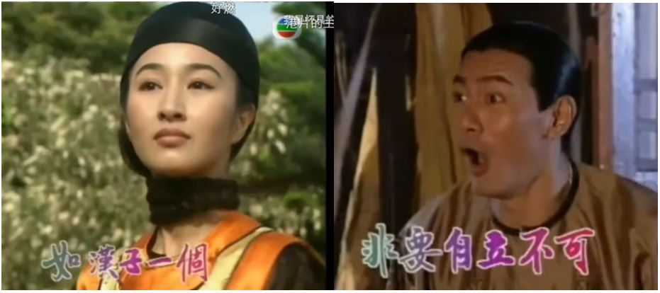 
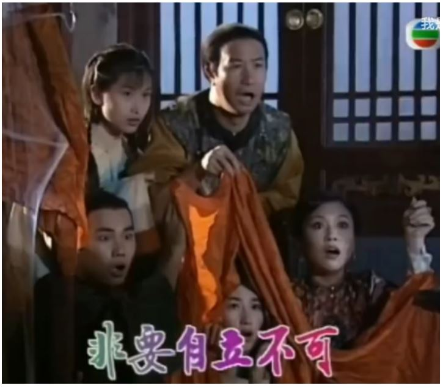 

（省略100张截图...）

-------
【虫哥】女扮男装娶公主的童年经典神剧《新女驸马》，这部剧真的是sao话满满啊~   
https://www.bilibili.com/video/BV1h54y1C7HV/

9分51秒：。。。

--------
列宁和毛泽东想把他们的思想传播给广大的普通人民群众，但客观上确实做不到，如果借助政权强力传播，得到的结果只能是盲目的个人崇拜，这和崇拜皇帝有什么区别？

------
为什么应试教育的成功者并没有给我一种他们经受了大量重复性训练的折磨的感觉？ - 大剪子的回答  
https://www.zhihu.com/question/551391138/answer/3473878555

这个答主我记得，他写过一个骂知乎脱产者的回答，言辞很激烈，然后被一个攻击我的数学答主点赞连击了，当时让我恶心了好久。

OpenAI 首席执行官强调通用人工智能(AGI)时代临近，你怎么看？ - 呵呵的回答   
https://www.zhihu.com/question/11838578321/answer/97718476857

这个回答我觉得还可以，虽然我看不懂，但我能感觉出答主的思维看起来还是比较清晰的，就是对人工智能的理解有点思维定式了。

评论区：sam最新访谈，说发现了直通agi的算法，不会就是循环RL吧？

我虽然不是做agi的，但从我脱产搞研究到现在，几百个天马行空的奇思妙想是有的，但最后都发现其实是幻觉。

-------
直男中又分为让人喜欢的还是让人讨厌的两种，比如许世友和粟裕都算是直男，我就不喜欢许世友而喜欢粟裕。

--------
侍剑不喜欢石中玉？武侠世界中有可能，现实世界绝无可能。

--------
的确现实中喜欢油腻男的女生很多，但和我没什么关系，我反正不喜欢油腻男，也不会喜欢喜欢油腻男的女生。

要注意石中玉这种油嘴滑舌的帅气好色男不算油腻，石中玉要比油腻男高出不知道多少个段位，如果现实中碰到石中玉和石破天这样的人，我更喜欢石中玉。

--------
一个直男装女生，想要装的像，付出的代价是非常大的。不想付出代价硬装，那就只能装成一个油腻男。所以还是别装了，无论付出多大的代价都不划算，老老实实做一个直男最好。

-------
我也打算写点文字，不过我可能真的写不多，因为每写一句话我都要想很久。

刚开始写的时候可以随意一点，写完之后再深思熟虑反复修改。

--------
我对油腻键政真的没什么兴趣。键政没什么问题，关键不要有油腻感，这就需要你进行深度思索来把握这里面的微妙平衡。

--------
我也想不明白一个做题家装油腻是为了图什么，装油腻会感到快乐吗？装油腻还不如做直男。

-------
【倩女幽魂03版220】只有梦里，七夜才最开心，但无论是人是魔，都该活在现实，梦总会醒  
https://www.bilibili.com/video/BV1g4411d7sL

4分25秒：凄美爱情配乐

-------
一个人吃汤圆

-------
Zard【4K60帧蓝光修复】我的朋友(マイ フレンド)字幕版 
https://www.bilibili.com/video/BV1my4y137UL

作词: 坂井泉水
作曲: 織田哲郎

曾经一心向往的 昔日梦想 
如今依旧耀眼 
无论心中 有多么不安但是 
我坚信自己选择的路 
喜欢你那不加修饰的素颜 
倘若改变 会多么令人伤悲 

一直都熠熠生辉 如少年一般 
你的明眸 My friend 
只要你在我身旁  
不知为何就会变得坦率 
穿越彼此的距离 我愿化为清风 

只要是真正的爱 总会有重重阻碍 
一定可以跨越 
仰望满天繁星  
为了不让眼泪掉下来 
深深地吸了口气 

比起独处时的寂寞 
两人相处时的孤独 更为悲伤 

一直都面带笑容 那时的我俩 
还真伤感 My friend 
只要想起你 内心就会变得坚强 
我会一直注视着你 继续奔跑 

一直都闪耀着光芒 如少年一般 
你的明眸 My friend 
只要想起你 内心就会变得坚强 
我会一直注视着你 继续奔跑 

继续奔跑

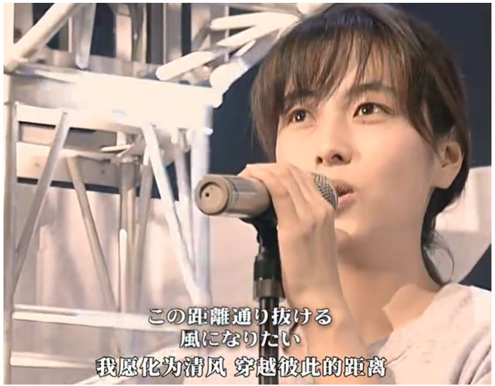 
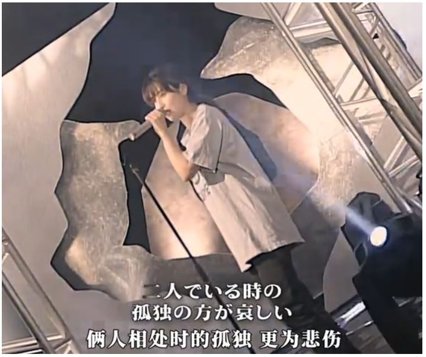 
 
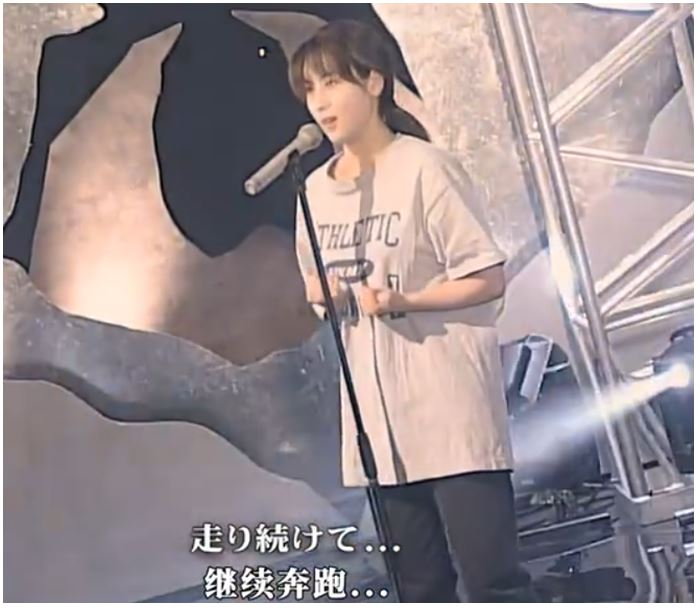 

--------
【倩女幽魂03版219】决战前夜流云用入梦大法拉正道反派梦中尽欢，一醉方休  
https://www.bilibili.com/video/BV1M4411d7CE/

4分27秒配乐：Far Eastern Bells-Mark Dwane

-------
幻想太多会导致记忆力大幅下降。

------
从来就没有什么能卖钱的ppt，能赚钱的是ppt背后大佬的资源和身价。

------
总是爱到不能忘 
往事还在心上 
想你想到没有主张 
我的心跌跌撞撞 
泪游游荡荡 
未来不知归向何方 

总是爱到不能忘 
往事还在心上 
多情的人注定受伤 
从你决定离开后 
世界变得一片 
迷惘 

------
曹骏 - 神仙哪里好

词曲：木子

混沌浊世天人道 
人心却要和天比高 
古来都说神仙好 
两袖清风踏云彩飘 

神仙凡人总一样 
拥有快乐和悲伤 
如果还要走一回 
人间才是真天堂 
凡间虽然有苦恼 
神仙日子也无聊 
想要幸福乐逍遥 
柴米油盐逃不掉 

我歌 我唱 
我哭我笑我痴我癫我狂 
哈哈哈哈 

------
在公司里工作，领导和同事会允许你做和业务完全无关的民科研究吗？比如比较深度学习神经网络和人脑神经网络在做数学题或算法题上有什么区别。

允许，只要你是高学历人才。

-------
石头的结构和人脑的结构都可以归结为数学，明显这是两种不同的数学，并且有高下之分。

-------
有了ai后，也就是剔除一切记忆力和计算力相关的因素，你对数学的理解还有多少？

--------
《中国龙》序曲 1995 何国杰（Ricky Ho） 
https://www.bilibili.com/video/BV1Ys411R7vH

太极宗师杨昱乾闯塔大战六大高手，27年前剧集尽显太极功夫 
https://www.bilibili.com/video/BV1RUqXY6EPd

11分24秒：硬的地方不打 专打我软的地方 不打了

[4K修复] 太极宗师 全集 
https://www.bilibili.com/video/BV1ZU4y1w7yL?p=74

6分32秒：杨昱乾 你记着 我们后会有期

5分30秒：你是什么东西？也配我跟你动手

https://www.bilibili.com/video/BV1ZU4y1w7yL?p=69

6分50秒：告辞了 二叔 一路平安啊

--------
判断ai的性能标准绝不能靠大量用户的测评打分或者任何指标，而只能靠你内心深处的绝对真理来判断。

-------
输入层--->中间层---->输出层（痛苦、快乐)

------
梦迴。花香 - 蔡志展《茶烟轻扬》VIP 专享   
https://www.bilibili.com/video/BV1qZ421p7qJ

大粽子

天地四方为江湖 世人聪明反糊涂      
名利场上风浪起 赢到头来却是输

天当被子地当床 叮叮当当走四方     
人生本是无根草 醉了何必问家乡

-------
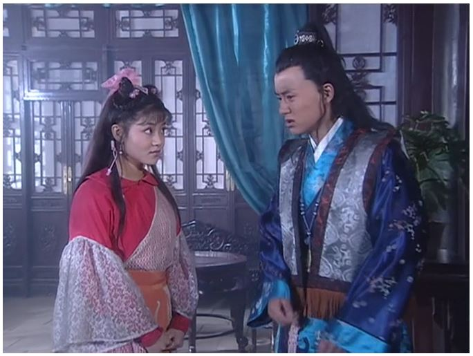 
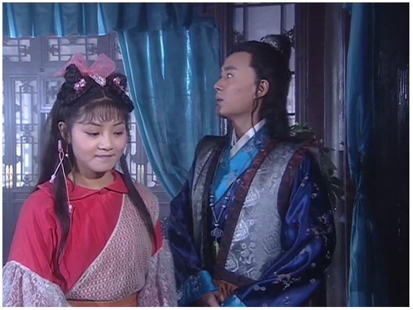 
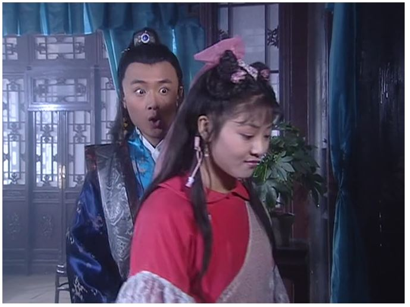 

-------
龙井茶刚泡开的清香真的太好闻了，买的绿茶香水就差远了，茶叶喝起来倒也不是特别好喝，还不如喝奶茶和牛奶。

-------
随着科技的进步，人们可以用摄像机模拟视觉，用录音机模拟听觉，然后在电脑上播放出来，但是好像还没有模拟嗅觉的设备。

之前买了很多香水，放在那里一年多没闻了，现在再闻好像有一股酒精味，我记得银色山泉、纳西素、无人区玫瑰、慵懒周末这几款都挺不错的。不过我只买小样或者仿制的，没钱买品牌也不需要，反正只要好闻就行，管它什么品牌。

-------
对了，侠客行里贝海石最后进的那个石洞是什么地方？小时候没看明白，也没去研究过，好像挺玄幻的，进去后可以看到外面的世界，却永远走不出来。

在32集31分44秒，记错了，没什么玄幻的，就一个普通的石洞而已，只是拍摄手法比较诡异。

-----
无为 开门 你干什么？

我是不会把门打开的 ...

为什么你要这么做 你死了也没用 我是不会爱你的 我心里一点感觉也没有 快点出来

今天我们虽然不能相爱 不过我相信有一天 有人会让你感受到爱的存在

---------
如果人工智能能够远程指挥(不是协助)交警分析自动驾驶事故的原因，那么可以认为是agi。

--------
大模型ai的通用性已经足够强了，但是精确性是没有保证的，这就不能直接应用于现实，因为现实中一个很微小的bug就可能造成一次很大的事故。对gcc、matlab这样的人工智能来说，精确性已经足够了，却没有通用性，只能应用在特定的领域。

所以agi必须要满足3个基本功能：

1.足够强的泛化能力       
2.足够高的精确性       
3.如果出现错误，有反思、复现、溯源、修正的能力     

这3点都满足后，人类就不要瞎操心了，剩下的交给agi自学就行。

--------
如何评价第859期睡前消息？ - 黄哲威 hzwer的回答  
https://www.zhihu.com/question/11285665541/answer/94012627767

真进步和假创新不区分或者不想区分的态度，是当下国内做人工智能创新的最大阻碍

---------
如何评价DeepSeek等大模型在中科院物理所理论竞赛中的表现？ - 方辰的回答  
https://www.zhihu.com/question/10879827313/answer/89554736784

“具有深度思考功能的AI，对于几乎每道题目都有正确的思路，但是在执行思路的过程中有可能会出现一些非常低级的错误，而且你告诉它什么地方错了，都未必能改正。这跟一个受过相当程度训练的人是正好反过来的：对于人来说，最重要的也是最难的，就是有正确的思路，剩下的具体计算只要足够细心，低级错误是完全可以避免的，更不可能存在明确告诉哪步计算出错了，愣是改不过来的情况。”

如果想做的是agi，而不是普通的人工智能，那么这个问题非常关键，一定要解决，重要性属于top级。

-----
倩女幽魂电视剧24集(无片头) 0分07秒：月老月老 小雪写上圣君的名字 不是希望你让他跟我永远在一起 只是希望你能够保佑圣君过着快乐的日子 

18分44秒：我知道的爱情故事也很有限 不过我可以告诉你我一个好朋友的故事 她的名字叫做聂小倩

-------
侠客行26集30分：三人吃饭

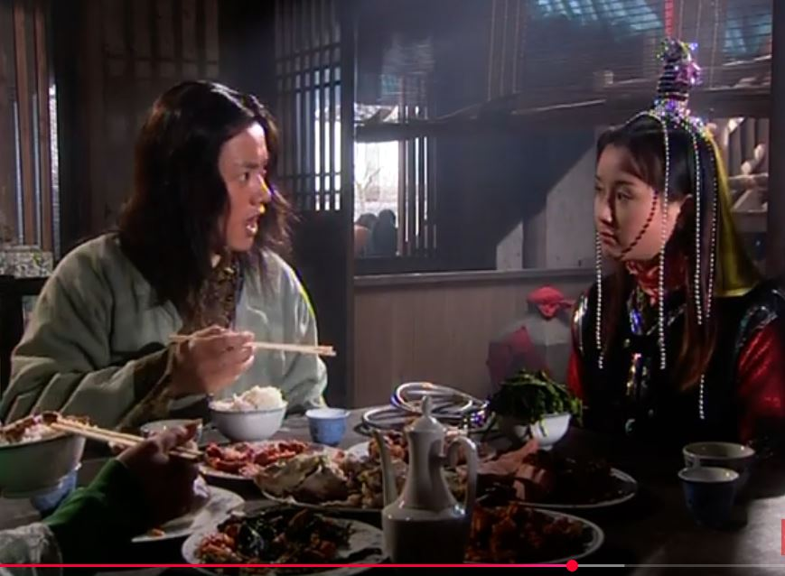 
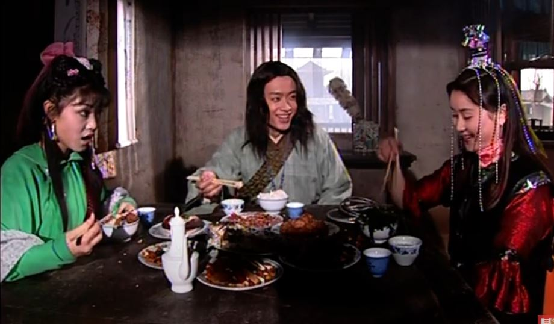 

-------
烧花菜时留一些汤，第一顿先别吃完，剩下的等第二顿加热后再吃，会好吃很多，尤其是这汤汁，太鲜美了。

-------
贾环也过来顽，正遇见宝钗、香菱、莺儿三个赶围棋作耍，贾环见了也要顽。宝钗素习看他亦如宝玉，并没他意，今儿听他要顽，让他上来坐了一处。一磊十个钱，头一回自己赢了，心中十分欢喜。[庚辰眉批：写环兄先赢，亦是天生地设现成文字。己卯冬夜。]后来接连输了几盘，便有些着急。赶着这盘正该自己掷骰子，若掷个七点便赢，若掷个六点，下该莺儿掷三点就赢了。因拿起骰子来，狠命一掷，一个作定了五，那一个乱转。莺儿拍着手只叫“幺”，[庚辰侧批：好看煞。][庚辰双行夹批：娇憨如此。]贾环便瞪着眼，“六——七——八”混叫。那骰子偏生转出幺来。贾环急了，伸手便抓起骰子来，然后就拿钱，[庚辰侧批：更也好看。]说是个六点。莺儿便说：“分明是个幺！”宝钗见贾环急了，便瞅莺儿说道：“越大越没规矩，难道爷们还赖你？还不放下钱来呢！”莺儿满心委屈，见宝钗说，不敢则声，只得放下钱来，口内嘟囔说：“一个作爷的，还赖我们这几个钱，[庚辰侧批：酷肖。]连我也不放在眼里。前儿我和宝二爷顽，他输了那些，也没着急。[庚辰侧批：倒卷帘法，实写幼时往事。可伤。]下剩的钱，还是几个小丫头子们一抢，他一笑就罢了。”宝钗不等说完，连忙断喝。贾环道：“我拿什么比宝玉呢。你们怕他，都和他好，[庚辰侧批：蠢驴！]都欺负我不是太太养的。”[庚辰侧批：观者至此，有不卷帘厌看者乎？余替宝卿实难为情。]说着，便哭了。宝钗忙劝他：“好兄弟，快别说这话，人家笑话你。”又骂莺儿。

-------
张燕妮 - 跳舞街 
https://github.com/pianfei/gequ/tree/master/ge1

作词:未知 作曲: Baker/Kyte

踏着节拍摇摇摆摆 
跳舞街上逍遥自在 
少年情怀不用遮盖 
歌声也东倒西歪 

这夜晚痛痛快快 
这一招一式古古怪怪 
不要把快乐廉价拍卖 
尽情去跳尽情去爱 

别问该与不该你不要徘徊 
Do you wanna dance tonight 
不要傻傻呆呆伸出手来 
Do you wanna hold me tight 

管它什么青红皂白 
不会跳舞日子难捱 
只要有你为我喝彩 
梦里也死去活来 
不理睬高高矮矮 
不理睬你是什么身材 
纵然是走路一瘸一拐 
也要让你目瞪口呆 

让你想让你猜 
大街上有多少好风采 
别指摘有能耐 
是天才你就在街上和我来 
摆个擂台 
Do you wanna dance tonight                   

-------
左宏元/张慧清 - 渡情

作词: 贡敏
作曲: 左宏元

啊……啊……  
啊……啊……  
西湖美景三月天哪哎  
春雨如酒柳如烟哪哎  
有缘千里来相会  
无缘对面手难牵  
十年修得同船渡  
百年修得共枕眠  
若是千呀年呀有造化  
白首同心在眼前  
若是千呀年呀有造化  
白首同心无在眼前  
啦……  
啦……啦……  
啦……啦……  

幻化人形（纯音乐） 
https://www.bilibili.com/video/BV1UL41167oa

1992 《新白娘子传奇》【赵雅芝】版 (片尾曲) 
https://www.bilibili.com/video/BV1KW411Y7XL

新白娘子传奇第五十集法术片尾无水印版本 
https://www.bilibili.com/video/BV1Nu4y1x7jy

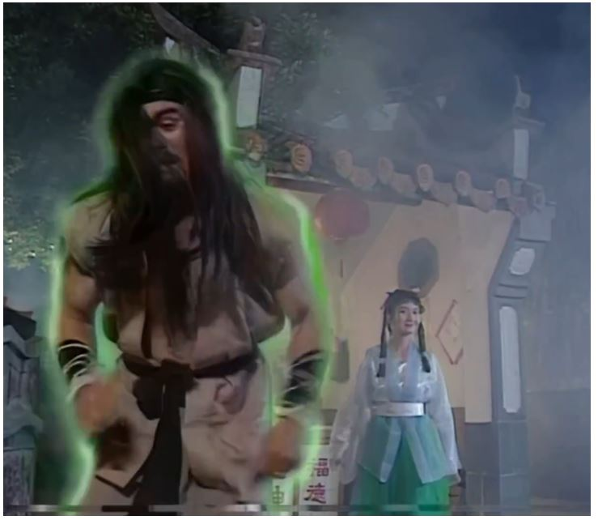 
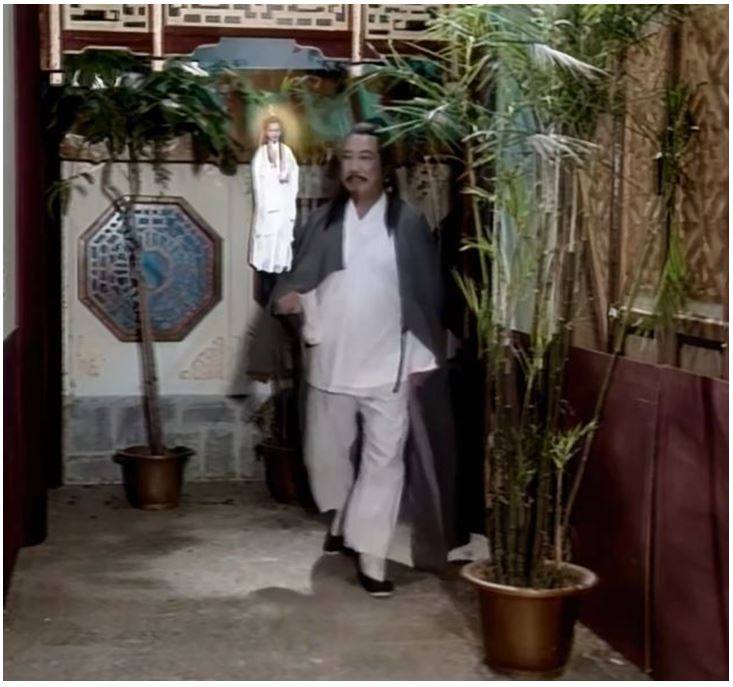 
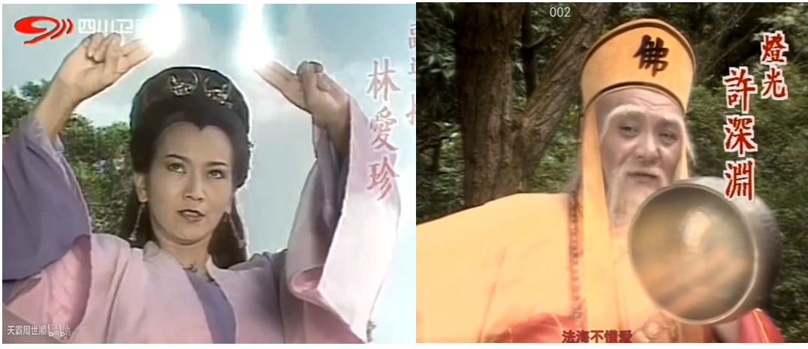 
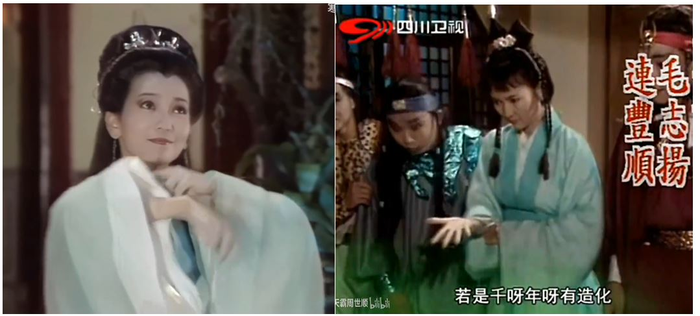 
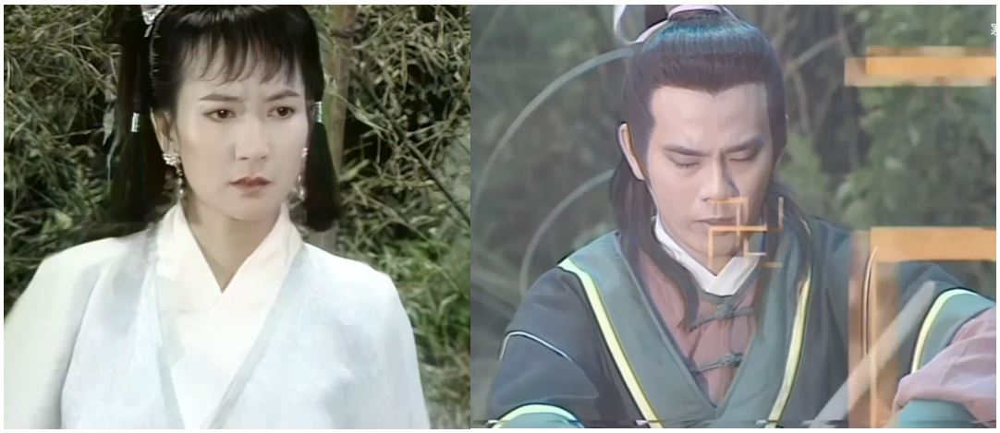 

-------
小仙女 小仙女 你不要走 不要走

小仙女 小仙女 你别走

对了 那天晚上我到千鲤湖去了 凶手啊 很有可能就是崔明冲 诗里面有他的名字

-------
我求求你了，不要再跟我吵了。

-----
一定是美艳动人 冰雪聪明

我说啊 你这个小豆丁啊

就值一两

偷看我的东西 我就偷看了 老三 你偷看别人的东西 你卑鄙的很

你走开

---------
梁朝伟 - 愿你知我心

作词:郑国江 陈美琪 作曲:黎小田

人生充满着疑问 
人性更是难信任 
敌友猜不透 
恩怨猜不透 
但我心不记恨 

人间充满着仇恨 
人世几许爱得真 
但我偏偏要 
恩怨一招了 
让你知我决心 

天际一片云 
生不了根 
偏要跟它接近 
风霜中往还 
生死不必问 
愿你知我最真 

--------
卢旺达总统卡加梅论两国关系 
https://www.bilibili.com/video/BV13i421f7k6

从人间炼狱到非洲新加坡，猛男卡加梅如何力挽狂澜？ 
https://www.bilibili.com/video/BV1CWsVewEeh

7分44秒：他咨询了大量中国和新加坡的专家

照搬中国是错的，参考新加坡是对的，同时参考中国和新加坡就更好了。

-------
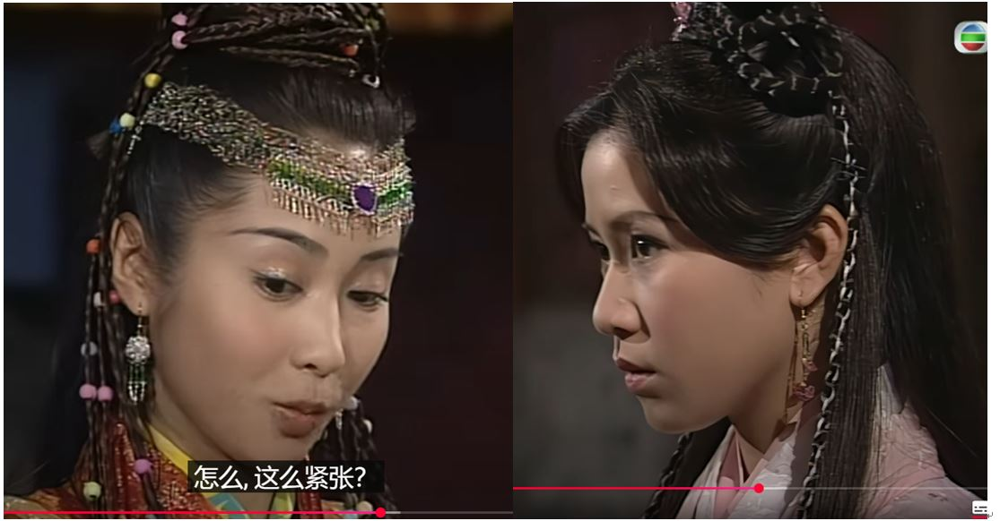 
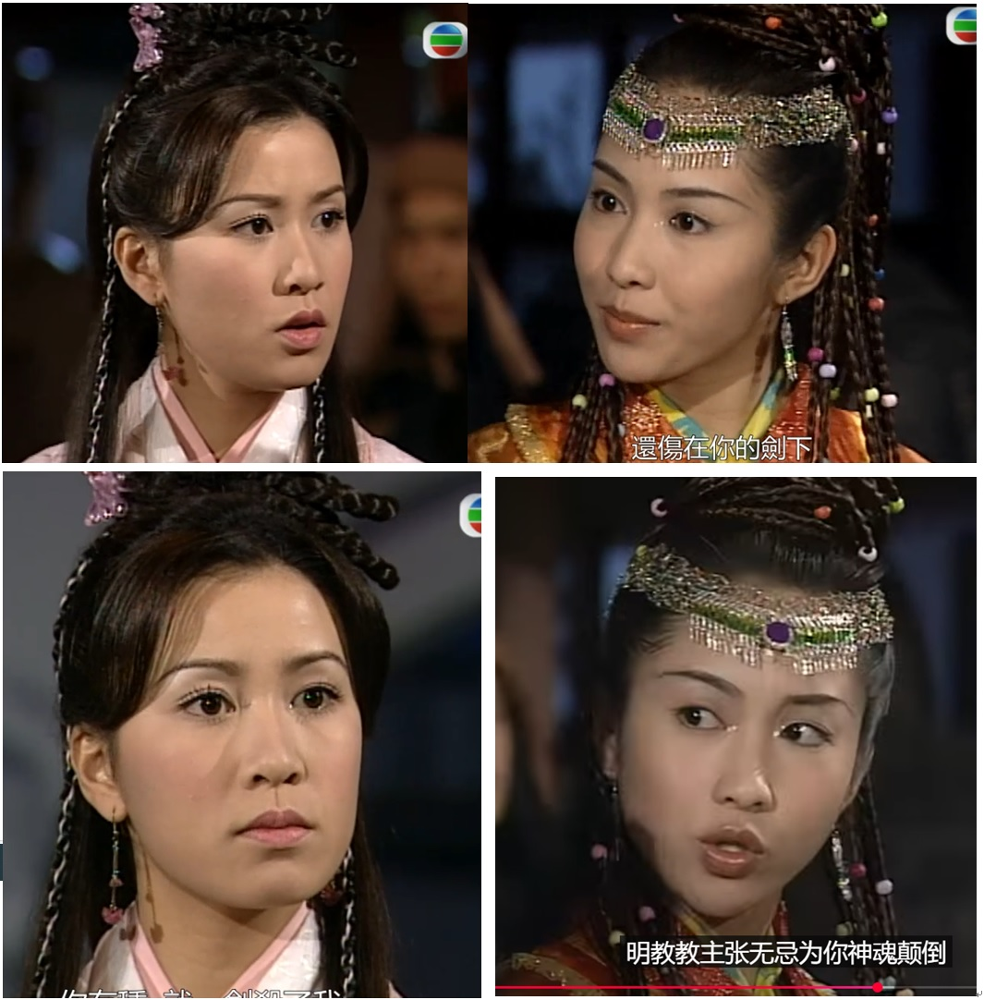 
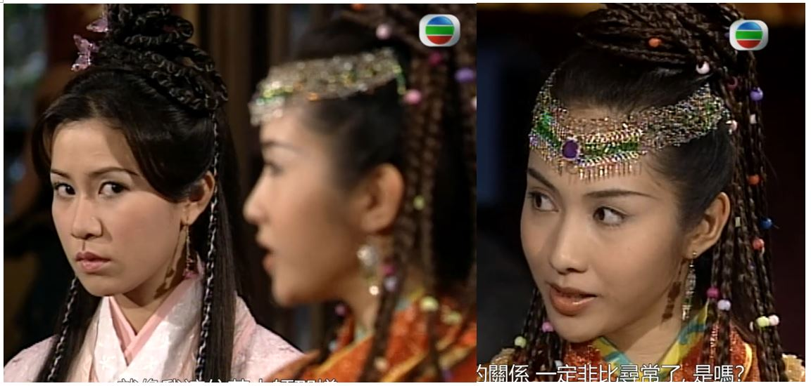 
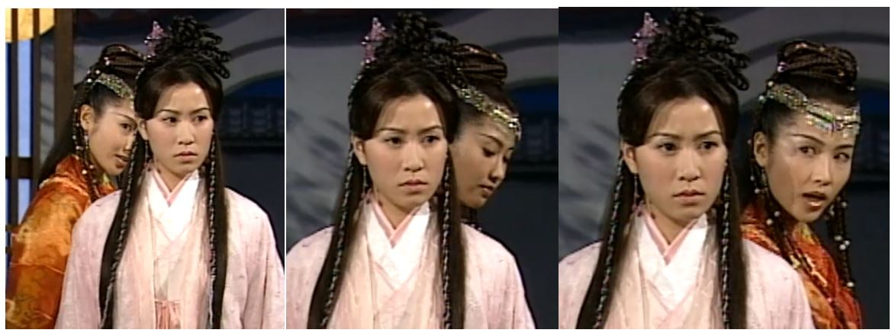 
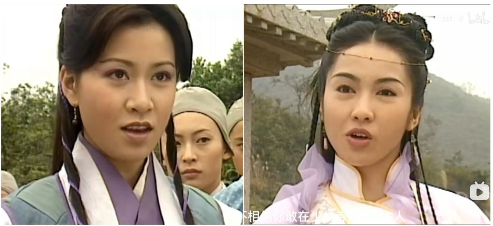 

--------
老牌国货黄芪眼霜去淡化细纹黑眼圈紧致抗抗皱衰老官方旗舰店正品 

这款我本来是买来去黑眼圈的，没想到用了一段时间后发现脸上和额头的皮肤都变得很光滑了。我是在研春堂旗舰店买的。

-------
罗晓音 - ks64

罗晓音 - ks68

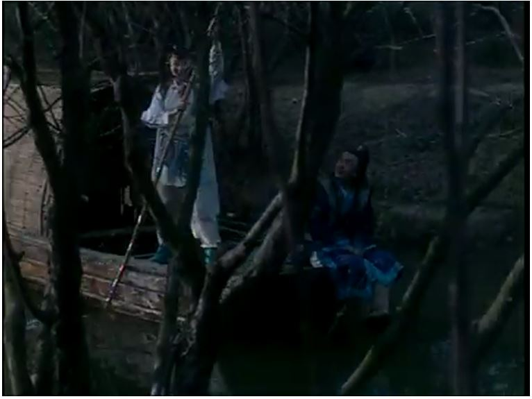 
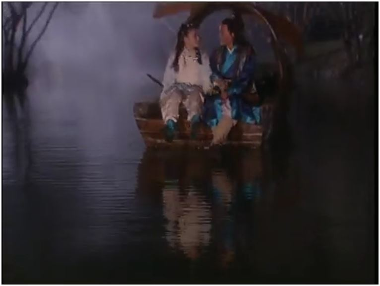 
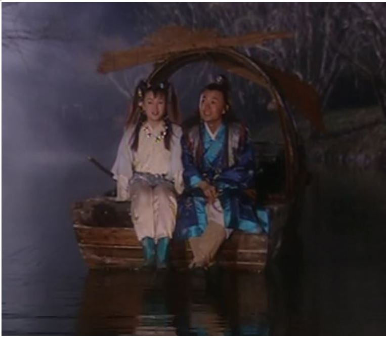 

起

-------
赵敏+丁当+侍剑 vs 小兰+水仙+阿九

小说：牛肉汤 vs 慕容九

-------
DeepSeek 绕开 CUDA 垄断，针对英伟达 PTX 进行优化实现最大性能，英伟达护城河还在吗？  
https://www.zhihu.com/question/10949909331

“在使用英伟达的H800 GPU训练DeepSeek-V3时，他们针对自己的需求把132个流式多处理器（SMs）中的20个修改成负责服务器间的通信，而不是计算任务。

变相绕过了硬件对通信速度的限制。

△ DeepSeek-V3 Technical Report

这种操作是用英伟达的PTX（Parallel Thread Execution）语言实现的，而不是CUDA。

PTX在接近汇编语言的层级运行，允许进行细粒度的优化，如寄存器分配和Thread/Warp级别的调整。”

牛！

--------
李艳秋 - 江湖

作词：陈涛 作曲：张宏光

相逢一笑多少年  
解开腰间龙吟三尺剑  
向青山深处云雾里  
劫后余生相聚依依恋恋  
身在江湖暮色寒  
归来时人未老心已倦  
我的足迹尘遮掩  
长啸一声震落飞花一片  

转身走向人间  
锁定一世悲欢  
却将无限深情交给命中情缘  

人生荣辱之间  
只觉青春如电  
许多未了心愿……心愿……  
人生过半  

---------
秋野 - 天地都在我心中

作词: 易茗
作曲: 赵麟

千秋霸业  
百战成功  
边声四起唱大风  
一马奔腾  
射雕引弓  
天地都在我心中  

狂沙路万里  
关山月朦胧  
寂寞高手一时俱无踪  
真情谁与共  
生死可相从  
大事临头向前冲  
开心胸  

一马奔腾  
射雕引弓  
天地都在我心中  

-------
周华健 - 江湖笑

词曲:小虫 编曲: 涂惠源

江湖笑 恩怨了  
人过招 笑藏刀  
红尘笑 笑寂寥  
心太高 到不了  

明月照 路迢迢  
人会老 心不老  
爱不到 放不掉  
忘不了 你的好  
看似花非花 雾非雾  
滔滔江水留不住  
一身豪情壮志 铁傲骨  
原来英雄是孤独  

江湖笑 爱逍遥  
琴或箫 酒来倒  
仰天笑 全忘了  
潇洒如风 轻飘飘  

江湖笑 爱逍遥  
爱或恨 都不要  
仰天笑 全忘了  
潇洒如风 轻飘飘  

--------
四大名著拍的好，这并不是让人们都按这个样板去拍剧，而是让其他人拍剧时用心一点，不管什么题材的电视剧，只要你拍的足够好，就不怕你反革命。03年之前的很多电视剧都挺符合我的审美的，直到张纪中开始拍金庸剧后，彻底改变了人们的认知，原来电视剧拍成这样就能赚很多钱，而且还能收获很好的口碑，只要在宣传上多花点心思就可以了。张纪中拍的金庸剧到现在仍然是无数90后的童年回忆，06神雕我爸也很喜欢看，我是一集都没看，03射雕和03天龙我都看完了，因为我很喜欢看金庸的武侠电视剧，刚好当时很多电视台都在放，94射雕和97天龙我是后来才看的。我现在明白了，我喜欢看的电视剧不需要有太多的人和我共鸣，只要我自己的内心确认是喜欢的就足够了。

---------
是谁第一个给我背书的，我也不知道你是想陪我玩玩，还只是想逗逗我，反正我就选择你了。

-------
每天用眼看手机，有什么好的方法保护眼睛？ - 吕凌凌的回答  
https://www.zhihu.com/question/9345157776/answer/77060625450

“用大屏手机。

减少虚化的背景在视野中的占比。

你的视觉在无意识中会在前景和背景中移动，”

谢谢，虽然看不大懂，但你给了我很大的启发。在win10的颜色过滤里把电脑屏幕设置成黑白，再在显示设置里开启夜色模式防蓝光，手机设置深色模式、护眼模式、亮度调低，知乎再设成黑色背景，感觉很有效果。只在需要截图的时候再把屏幕设回彩色。

------
不知道为什么那么多人喜欢她，我从小就对她不感冒。傻白甜当然不是最好的，但肯定比傻白不甜要好很多。

-------
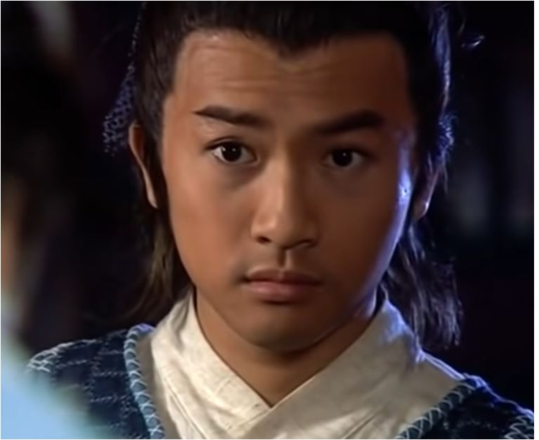 
 
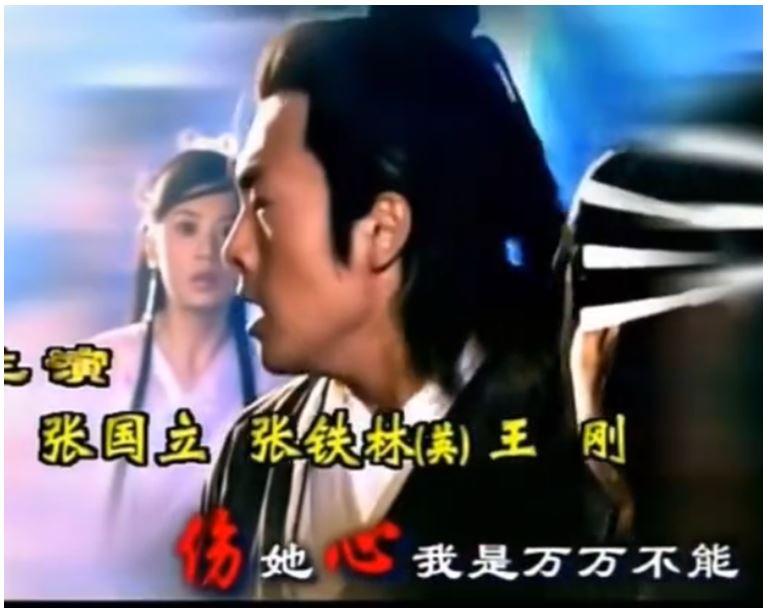 
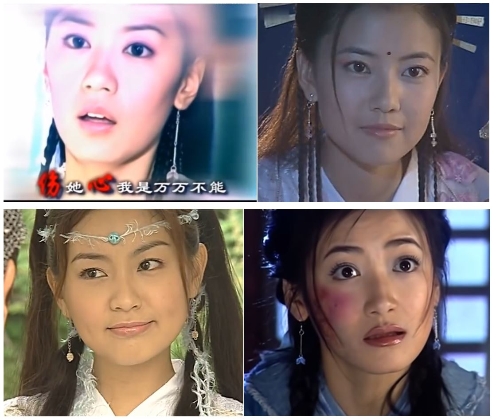 
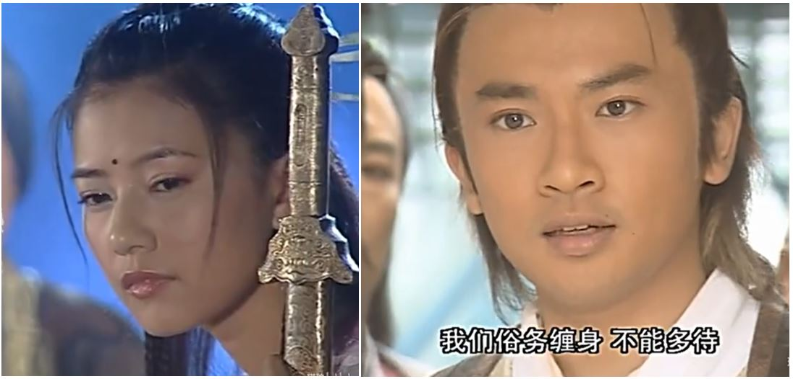 
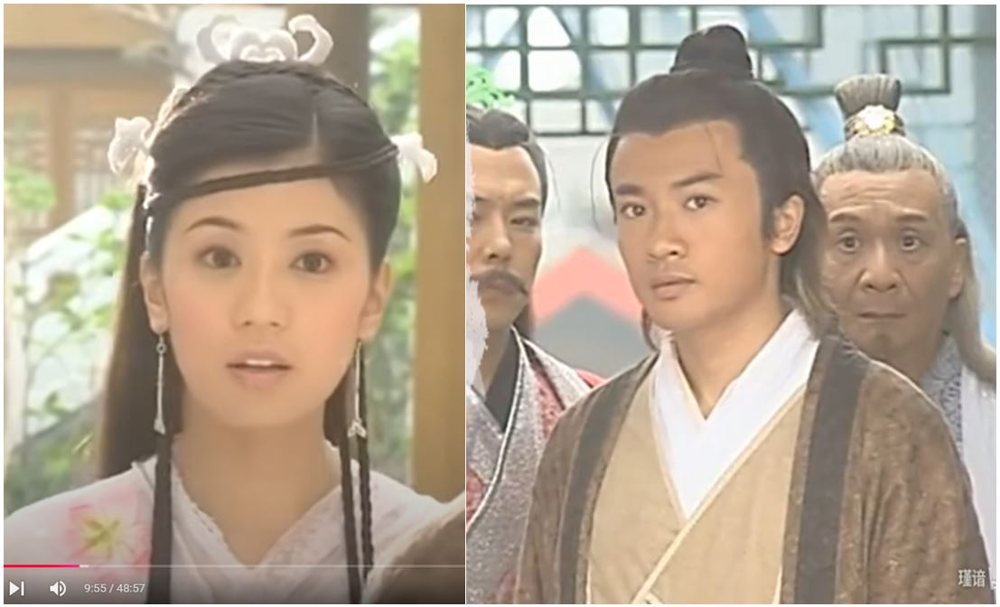

--------
醉春风

苏有朋版电视剧《倚天屠龙记》的主题曲（其实这首歌叫《心爱》） 
https://baike.baidu.com/item/%E9%86%89%E6%98%A5%E9%A3%8E/22044944

金学峰 - 心爱

作词: 陈涛
作曲: 王备

醉春风 
我醉春风 
初初见面 
两人齐齐心动 
情网中看不一样的天空 
我张开心胸 
无情的人笑我痴 
我笑无情人懵懂 
我愿意在她手掌之中 

醉春风 
我醉春风 
忍了冲动 
她又让我感动 
伤她心我是万万不能 
我愿意在她手掌之中 

不要坏我大义 
我会倚天屠龙 
但愿情意交融 
让我有始有终 
不要坏我大义 
我会倚天屠龙 
但愿情意交融 
让我有始有终 
让我有始有终 

-----------
琵琶 两小无猜 03版倚天屠龙记插曲 
https://www.bilibili.com/video/BV1Ab411w7c9

倚天屠龙记配乐：两小无猜/王备 
https://www.bilibili.com/video/BV1MX4y1m7Zh

倚天屠龙记 (2003版) 之甜蜜吵架 - 张无忌与赵敏  
https://www.bilibili.com/video/BV1gs411a7GZ

-----------
那我呢？

----------
醉拳？我也会

---------
甄妮《鲁冰花》91年春晚现场, 记忆中最美的旋律 
https://www.bilibili.com/video/BV11b411L7Mi

作词: 姚谦
作曲: 陈扬

啊...啊 啊...啊 
夜夜想起妈妈的话 
闪闪的泪光鲁冰花 
天上的星星不说话 
地上的娃娃想妈妈 
天上的眼睛眨呀眨 
妈妈的心呀鲁冰花 
家乡的茶园开满花 
妈妈的心肝在天涯 
夜夜想起妈妈的话 
闪闪的泪光鲁冰花 
啊...啊 啊...啊 
夜夜想起妈妈的话 
闪闪的泪光鲁冰花 
啊...啊 啊...啊 
夜夜想起妈妈的话 

---------
孟庭苇 - 风中有朵雨做的云

作词: 李安修 
作曲: 陈耀川 
编曲: 涂惠源 

风中有朵雨做的云 
一朵雨做的云 
云的心里全都是雨 
滴滴全都是你 

风中有朵雨做的云 
一朵雨做的云 
云在风里伤透了心 
不知又将吹向哪儿去 

吹啊吹吹落花满地 
找不到一丝丝怜惜 
飘呀飘飘过千万里 
苦苦守候你的归期 

每当天空又下起了雨 
风中有朵雨做的云 
每当心中又想起了你 
风中有朵雨做的云 

--------
萧十一郎第1集41分05秒配乐:天心难测

41分31秒：你是谁？敢管本公子的闲事！你找死！

--------
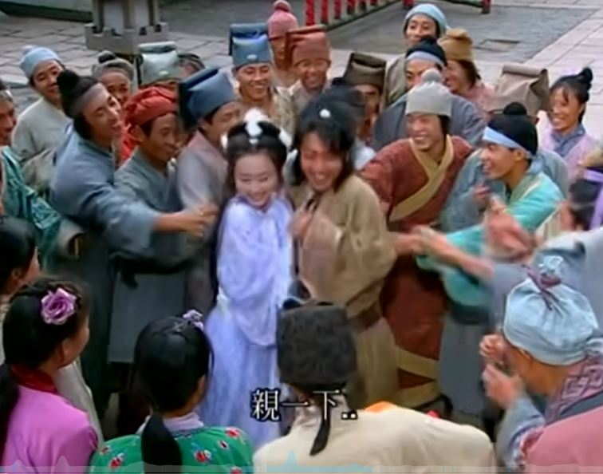

--------
渡江战役在事实上美苏并没有干预，假如真的干预了会有什么变化？如果粟裕南下渡江后并像八路军一样生根发芽，美苏还有能力干预吗？

我怎么感觉粟裕南下了还真会干预，只是三大战役打的太突然，赢得太快，美苏来不及干预。

-------
上问曰：“如我能将几何？”信曰：“陛下不过能将十万。”上曰：“於君何如？”曰：“臣多多而益善耳。”上笑曰：“多多益善，何为为我禽？”

是谁的小心思被我一眼看穿了？明明比不过人家，还要强行跟人家比。

-------
火开的太大了，刷完牙回来就这样了

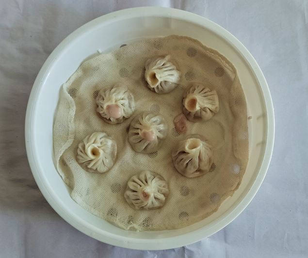

-------
西游记续 滑稽配乐  
https://www.bilibili.com/video/BV14s411D7rf/?p=2

--------
小时候一直以为冬瓜不好吃，原来是做法不对，冬瓜一定要红烧，红不红烧完全是两个味道。今晚第一次做冬瓜，真的是太好吃了。

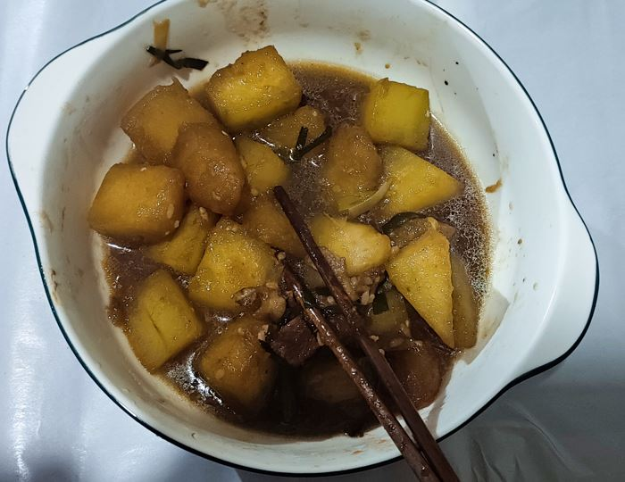

----------
柯洁直播还原判罚现场，称几天吃不下东西，哽咽落泪不断重复「柯洁，永不妥协」，这次比赛对柯洁影响有多大？  
https://www.zhihu.com/question/10664355691

影响就是这个时候情绪已经超越了钱和荣誉

---------
许佳慧 - 预谋

词曲：代理仁

何必要那么多的借口 
让我内疚自己还爱的不够 
预谋了很久不过是想分手 
何不直截了当的说出口 
既然你非要你的自由 
挽留也会让我委屈到最后 
煎熬了这么久 
已没有继续的理由 

反正他都不难受他只要自由 
他都不会理会我的感受 
退到无路可走不如就放开手 
我也想要自由 
他都不难受他只要自由 
他都不会理会我的感受 
退到无路可走不如就放开手 

既然他都不难受他只要自由 
他都不会理会我的感受 
退到无路可走不如就放开手 
我也想要自由 
他都不难受他只要自由 
他都不会理会我的感受 
退到无路可走不如就放开手 

--------
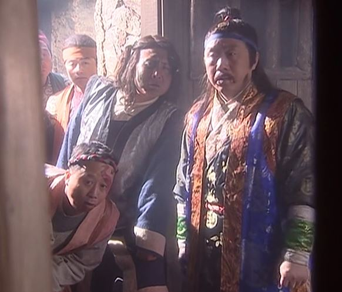 
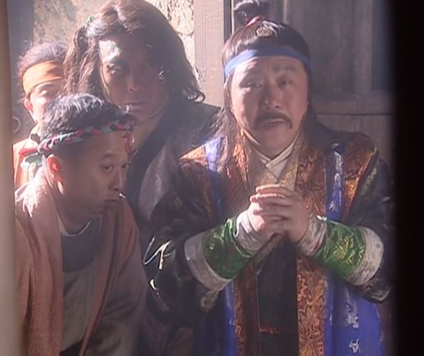 

-------
罗晓音 - 夜色

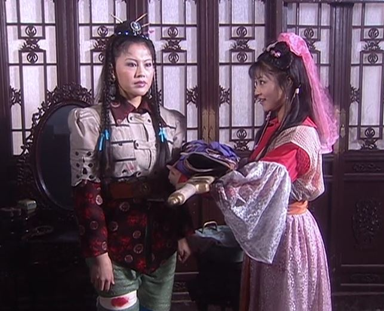 
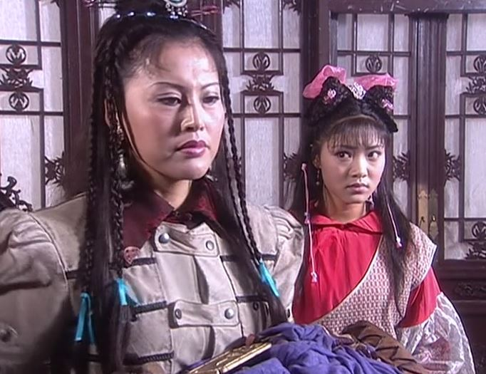 
-------
成龙 - 醉拳

作词: 厉曼婷
作曲: 李偲菘/李伟菘

我颠颠又倒倒 好比浪涛 
有万种的委屈 付之一笑 
我一下低 我一下高 
摇摇晃晃不肯倒 
酒里乾坤我最知道 

江湖中闯名号 从来不用刀 
千斤的重担我一肩挑 
不喊冤也不求饶 
对情意我肯弯腰 
醉中仙好汉一条 

莫说狂 狂人心存厚道 
莫笑痴 因痴心难找 
莫怕醉 醉过海阔天高 
且狂且痴且醉趁年少/在今朝 

干了吧 站稳脚步你放轻松 
酒过三巡你别偷溜 
棒打老虎鸡吃虫 
鸡吃了虫 它变成龙 
看我脸红脖子也粗 
心里明白我是英雄啊 
六六六啊 顺五六啊 
三星照啊 四季财啊 
七匹马啊 两相好啊 
五魁首啊 一定中 全到了啊 
三星照 四季财啊 
七匹马 两相好啊 五魁首啊 
江湖中闯名号 从来不用刀 

---------
罗晓音 - 悦动

罗晓音 - ks69

--------
罗晓音 - 情剑

--------
大模型不是agi，但是openai搞出gpt后，人们开始去思考agi的可能性了，此前agi在人工智能领域被认为是像永动机一样反科学的东西。

---------
醉拳2成龙精彩武打片段，经典好看 
https://www.bilibili.com/video/BV1Sg4y187kL

4分50秒：醉拳？不过如此嘛

5分22秒：我的拳也很厉害

双截龙：国内最强酒鬼霸气出手，这套浮空15连已经超神 
https://www.bilibili.com/video/BV1ht411b78W

2分钟：这个对酒鬼的理解已经完全超过了酒鬼

双截龙：无规则真的是酒鬼最强吗？但是这玛丽更恐怖  
https://www.bilibili.com/video/BV1mG4y187he

双截龙无规则:难得一见的顶级小龙有多恐怖！摸到就死  
https://www.bilibili.com/video/BV1j64y1x76V

双截龙：双龙转生果然才是最强的！无规则酒鬼也要靠边站！  
https://www.bilibili.com/video/BV1rV4y197Av

双截龙格斗：车总顶级酒鬼大战断水，看谁的技术更胜一筹  
https://www.bilibili.com/video/BV15v411K78q

双截龙：组队决赛  超级火猪大战酒鬼！ 
https://www.bilibili.com/video/BV1TnyaYREDC

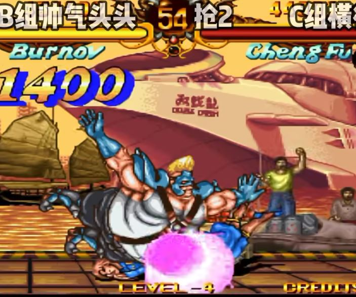 

双截龙：火猪已经开发到能跟酒鬼拼无规则了！ 
https://www.bilibili.com/video/BV1Qc411b7ut

--------
如果你对我研究的东西是有感知的，你完全可以自己去做而不需要对我有什么期待，搞深度学习的人对我是没有感知的。你大脑里的东西我练不出来是真的，但我大脑里的东西你完全可以通过后天实践来获得，如果你懒那就没办法了。

--------
17年有段时间过度用眼把眼睛搞坏了到现在也还没完全好，每次看电脑或看手机时间太长总是眼睛疼，但是又控制不住，烦死了。

--------
存在即合理，恶臭普信女应该也是有价值的，正因为恶臭普信女的大量存在，所以美好的女子才是美好的。如果世界上不再有恶臭普信女，那么现在的美好也就变得普信了。

---------
只有当你变得不再畏惧死亡的时候，你才能挖掘成人性中最真实的东西。

--------
无论是好女人、坏女人还是骚女人我都是喜欢的，我最不喜欢的就是恶臭普信女了，我宁愿光棍一辈子也不想和恶臭普信女有任何交集。

--------
蠢 ≈ 坏 

坏 = 蠢

---------
对了，还有欲仙欲死的喵女、爱发小脾气的倔强小表妹，喜欢吗？

-------
知心大姐姐和年轻漂亮的职场女强人也挺喜欢的。

--------
也挺喜欢冰山美女的，但必须是身上没有沾染任何普女恶臭的那种纯净的冰山美女。

好像不太对，在冰山美女身上恶臭味也是香的，当恶臭真的大到一定程度的时候，此时冰山美女已经不再是冰山美女了，而是普信女。

-------
不喜欢低智商无脑傻白甜。

--------
不喜欢男人婆，但是比油腻恶俗男要好，油腻恶俗男是最恶心的。

-------
喜欢幽默风趣的人，不喜欢那些没有情趣的普女。喜欢媚极！韵极！喜欢温柔平易近人傻呆呆而不傻白甜的可爱。

--------
油腻、恶俗绝对不等于幽默！

--------
陆逊给关羽的信，妙就妙在，他是在真夸而不是假夸，更妙的是，相对于威震华夏来说吹得还远远不够。

-------
你们的思维只会玩假，而不会玩真。

--------
笑死我了，没想到你们这帮高学历的人玩的这么花。我们这些底层人民没有这个福气享受，会翻墙的只能找些黄片来看看，不会翻墙的那就只好看看擦边喽。

---------
西游记续集 第4集 18分35秒 配乐：灵山宝曲

观音尊者 你看这两个孙悟空 哪一个是真 哪一个是假

弟子不能辨明 

你们法力广大 能普阅周天之事 却难遍识周天之物

请我佛赐教

周天之内有五仙 天 地 人 神 鬼 有五虫 赢 鳞 毛 羽 昆 但是有四种猴子却不在这十类之中

敢问这假悟空是哪一种 

他也是天地间一灵猴

--------
喜欢听我分享的中文歌吗？我还收藏了很多好听的歌没分享，今年不一定能发的完。有些歌虽然好听，也不是想发就能发的，而是要在恰当的情绪和氛围下才能发出来。

-------
我昨晚有点傻了，像喝醉了一样。

-------
有一个人和我心灵碰撞好几次，我也不知道怎么回事，但是你这个不男不女的号给我的观感很油腻啊，你另外一个女号看起来还行。

--------
乌兰托娅 - 套马杆

作词:刘新圈 作曲:郭永利

给我一片蓝天一轮初升的太阳 
给我一片绿草绵延向远方 
给我一只雄鹰一个威武的汉子 
给我一个套马杆攥在他手上 
给我一片白云一朵洁白的想象 
给我一阵清风吹开百花香 
给我一次邂逅在青青的牧场 
给我一个眼神热辣滚烫 

套马的汉子你威武雄壮 
飞驰的骏马像疾风一样 
一望无际的原野随你去流浪 
你的心海和大地一样宽广 
套马的汉子你在我心上 
我愿融化在你宽阔的胸膛 
一望无际的原野随你去流浪 
所有的日子像你一样晴朗 

----------
江华 - 热爱终极

----------
侠客行第8集 24分42秒：

依我看 如今帮主大智若愚 绵里藏针 是不会再用残酷的手法去惩治弟兄们的

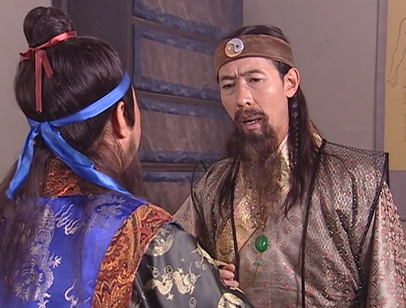 

---------
时速110公里！猎豹捕捉瞪羚 
https://www.bilibili.com/video/BV1Lx411S7Rb

猎豹：我预判了你预判我的预判 
https://www.bilibili.com/video/BV1Pi4y1x7Q3

-----------
不要轻易给别人的小号背书，否则会掉你的身价。

-------
作为数学推导起点的数学公理是如何被确定的？如果它无法被证明，那么为什么又如此值得“相信”？ - 御坂16899号的回答  
https://www.zhihu.com/question/632429530/answer/3328123997

不知道这篇文章的思想是不是过时了，给我的感觉就是你不是信这个就是信那个，为什么总是要去信别人的东西呢，而不是去信你思维中最真实的东西。

“共产党员对任何事情都要问一个为什么，都要经过自己头脑的周密思考，想一想它是否合乎实际，是否真有道理，绝对不应盲从，绝对不应提倡奴隶主义 。”

--------
谢霆锋 - 只要为你活一天 

词曲：洪典

爱上了你 爱上了你 
注定的是你 我输得彻底 
爱上了你 爱上了你 
早预言了分离 决定了悲剧 

上天给了我多少时间 
全都给你 我忘了我自己 
赶在生命里有限的时间里 
就让这一刻停在这里 

只要为你再活一天 我愿意 
不管明天就算有更坏的消息 
只要为你再活一天 我的心 
我的心 就会满意 

da la dang(da la dang) dang..dang..dang da la.. dang..dang.. 
da la dang(da la dang) dang..dang..dang da la.. dong..ang..

--------
柯洁 LG 杯第三盘又提子没及时放回棋盖，但裁判 20 分钟后才在卞相壹思考时中断比赛，这做法合理吗？ - 萌之检事正的回答  
https://www.zhihu.com/question/10351013703/answer/85383491002

“
萌之检事正​     
我们一起学猫叫一起喵喵喵喵喵(^･ｪ･^)      
2491 人赞同了该回答       
这个跟昨天不一样，昨天是柯洁大优，强行判柯洁负，

今天虽然柯洁确实大劣势，但卡子哥也在悬崖边上，出错就完蛋

这是在给卡子哥思考争取时间，以及让卡子哥冷静一下不要上头“

对于柯洁来说第3局退赛当然是对的，但是晚了，第2局就应该果断退赛，这样的比赛继续下下去无论输赢都是一种耻辱，柯洁又不差钱也不差荣誉，对吧。对于卞相壹来说，第2局就应该拒绝判罚，毕竟可以输棋但不能输人。既然第2局柯洁被坑后还是选择下第3局，那么这便宜赚了也就赚了，谁让你不退赛的？但是当第3局又出现中断比赛时，卞就应该果断抗议，就算时间不够被逆转了，也收获了一个好名声，万一不小心赢了，赛后接受采访时还可以说第2局对柯洁不公平，自己当时没反应过来，后来仔细想了一下这个比赛规则不合理，自己赢得不光彩，挺过意不去的。这样不但赢得了最后的胜利，同时弥补了第2局判罚导致的比赛含金量大幅下降的问题。

-------
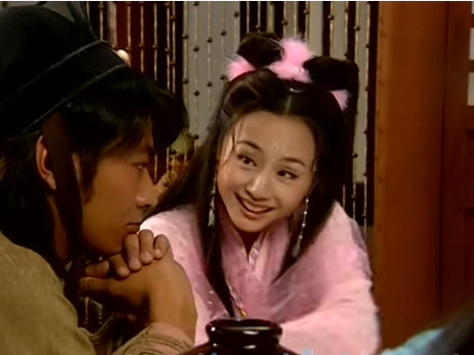 
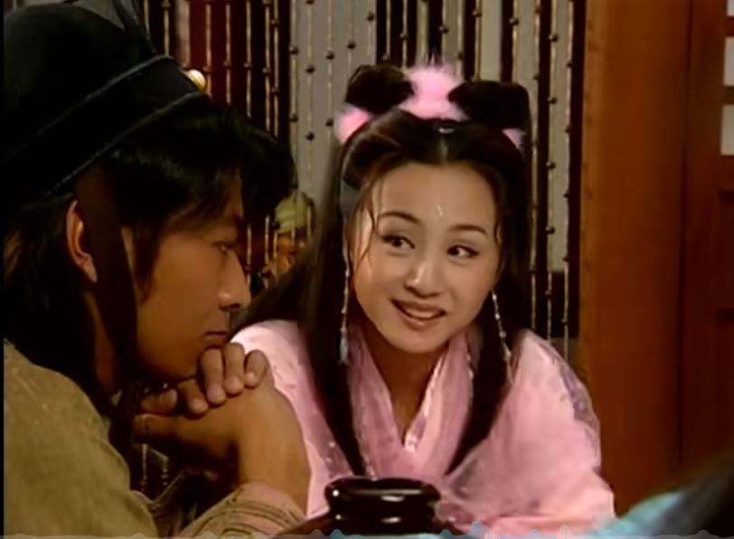 
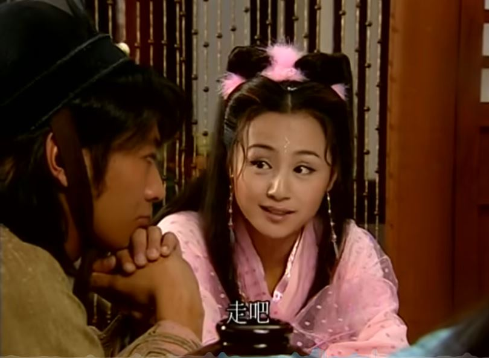 
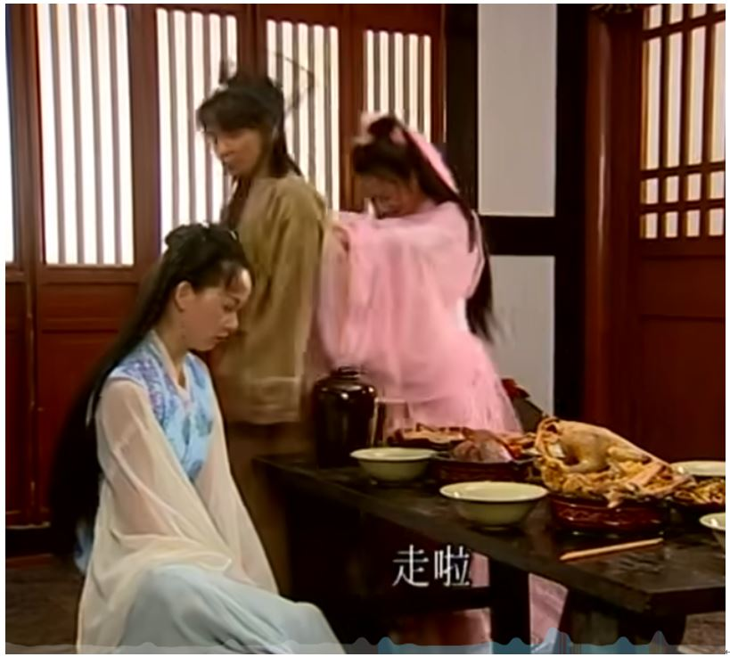 

--------
那英/孙楠 - 只要有你 

词曲：陈颂红

谁能告诉我 
有没有这样的笔 
能画出一双双不流泪的眼睛 
留得住世上一纵即逝的光阴 
能让所有美丽从此也不再凋零 
如果是这样 
我可以安慰自己 
在没有你的夜里 
能画出一线光明 
留得住快乐 
全部都送去给你 
苦涩的味道变了甜蜜 
从此也不用分开相爱的天和地 
还能在同一天空月亮太阳再相遇 
生命中只要有你 
什么都变了可以 
让所有流星随时都相遇 
从此在人世上也没有无奈的分离 
我不用睁着眼睛看你远走的背影 
没有变坏的青春 
没有失落的爱情 
所有承诺永恒得像星星 

---------
坚持假赛论的观众如何评价 TI10 真视界？ - Paprika的回答  
https://www.zhihu.com/question/555464203/answer/2689581914

Lao：任何一种观点都是可以的，但是假赛是没有事实依据的

--------
早上醒来在床上一直躺到大中午

----------
叶俊华 - 往事  伴奏 
https://5sing.kugou.com/bz/2235917.html

作词：陈旭东  作曲：黄水泉

是谁转动了记忆的魔方 
让往事走出来晒晒太阳 
过去的早插上风的翅膀 
留住的就让她在怀里疗伤 
往事是品不尽的七色酒 
往事是喝不完的百草汤 
往事是笑中的辛酸泪 
往事是苦里的话梅糖 

是谁转动了记忆的魔方 
让往事走出来看看月亮 
模糊的早淋上雨的油漆 
清晰的就让她在梦里飞扬 
往事是看不够的万花筒 
往事是冲不破的防火墙 
往事是命运的交响曲 
往事是人生的纪念章 
哎 嘿 

---------
Various Artists天马&音乐 钢琴弹奏 往事 
https://dai.ly/k7nTDPncgbJsJLChnYG

孟庭苇-往事-伴奏 
https://www.bilibili.com/video/BV19L411r7xv

孟庭苇 - 往事

作词: 邱晨 
作曲: 陈秋霞 
编曲: 涂惠源 

如梦如烟的往事 
洋溢着欢笑 
那门前可爱的小河流 
依然轻唱老歌 
如梦如烟的往事 
散发着芬芳 
那门前美丽的蝴蝶花 
依然一样盛开 

小河流 我愿待在你身旁 
听你唱永恒的歌声 
让我在回忆中寻找往日 
那戴着蝴蝶花的小女孩 

小河流 我愿待在你身旁 
听你唱永恒的歌声 
让我在回忆中寻找往日 
那戴着蝴蝶花的小女孩 

小河流 我愿待在你身旁 
听你唱永恒的歌声 
让我在回忆中寻找往日 
那戴着蝴蝶花的小女孩 

小河流 我愿待在你身旁 
听你唱永恒的歌声 

----------
 

--------
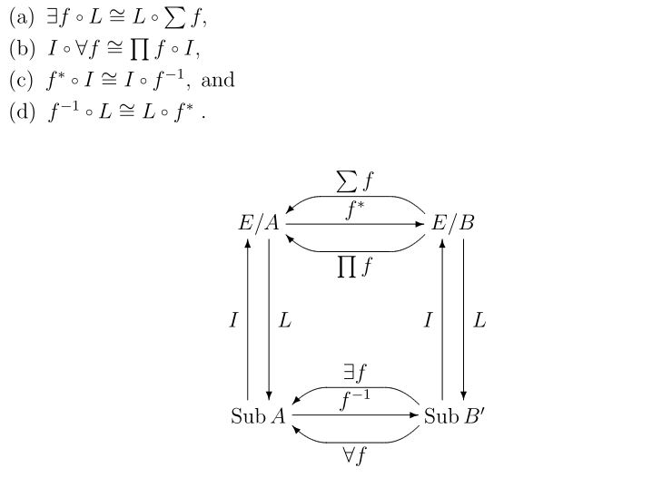 

-----------
好像没有听说有人用代数几何来做人工智能的。

----------
东来哥讲述名牌大学面试经历大学生思想固化的非常可怕#胖东来#于东来#商业思维 
https://www.bilibili.com/video/BV1bb4y1G7bi

----------
少年包青天第一部24集28分20秒配乐：韦启良 - 皇上驾到

怎么三甲里没有包拯的名字...

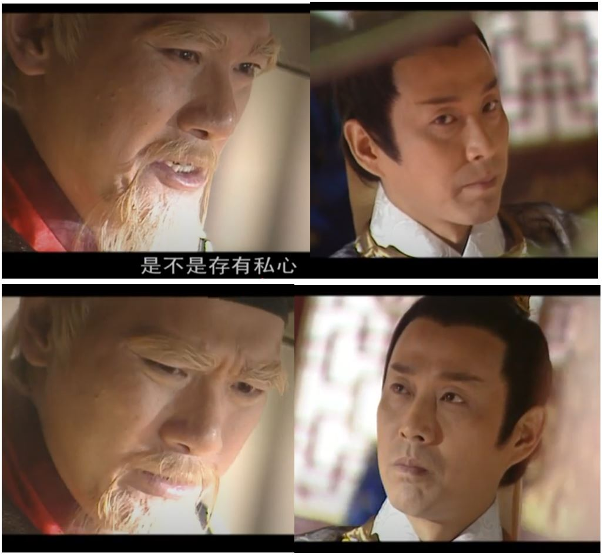 

-------
蔡琴/林志美 - 你的眼神

作词:苏来/郑国江  
作曲:苏来

像一阵细雨洒落我心底 
那感觉如此神秘 
我不禁抬起头看着你 
而你并不露痕迹 

虽然不言不语 
叫人难忘记 
那是你的眼神 
明亮又美丽 
啊 有情天地 
我满心欢喜 

淡淡然掠过 
神秘又美丽 
他仿似骤来的雨 
我也难自禁抬头看你 
你偏将心事瞒住 

就算默然不语 
我都深深记住 
因你的眼神 
使我心里着迷 
啊 已将我心 
轻轻地留住 

---------
高祖击布时，为流矢所中，行道病。病甚，吕后迎良医，医入见，高祖问医，医曰：“病可治。”於是高祖嫚骂之曰：“吾以布衣提三尺剑取天下，此非天命乎？命乃在天，虽扁鹊何益！”遂不使治病，赐金五十斤罢之。

这个良医没有考虑过他治了后治不好会怎么样，也没有考虑他如果说“病不可治”会怎么样，他就是本能的觉得可以试试看。

---------
千百顺 - 很任性2017

词曲：高进

一个人很寂寞另一个很洒脱 
谁先放开的手当初却没有说 
以为感受到你那跳动的脉搏 
也曾觉得分分合合没什么了不得 

一个人的拥抱能转移给几个 
简单温暖胜过一万次的承诺 
天涯路太遥远谁会相伴走过 
丢过幸福的人请和我一起唱情歌 

很任性相爱过 
很任性的执着 
很任性的以为自己 
放手时很洒脱 
很任性流眼泪 
很任性的哭着 
很任性的拥抱 
有多难得 

---------
实拍纯欲甜美少女感抹胸小吊带抹胸设计感百搭潮流夏季新款上衣女 
https://detail.1688.com/offer/789924152097.html

---------
ZARD - Top Secret  

作词:坂井泉水 作曲:栗林誠一郎

我对今晚的菜肴很有自信 
你却姗姗来迟真是过分啊！ 
本以为是可以经常在一起 
在开始共同生活的时候 
我走在大街上 可是很引人注目的呦 
It's my top secret 你不会明白 
女孩子啊 对于自己要做的事情 
画画线 就可以决定了 
曾几何时 两个人互相确认彼此的感情 
有时候对着镜子 怀疑自己是不是没有魅力 
趁着汤变冷之前 就先来一个微笑吧 
嘟噜噜噜....电话响了五声 
虽然有一种不好的预感 

最初朋友都一直反对 
It's my top secret 听到了一些谣言 
争吵是感情要好的证明 
不值得去声张 

今天给前男友打了电话 
扑通扑通 心脏要坏掉的感觉 真让人怀念 
他的性格和你截然不同 
到现在也一点都没有改变 
果然还是你更好啊 

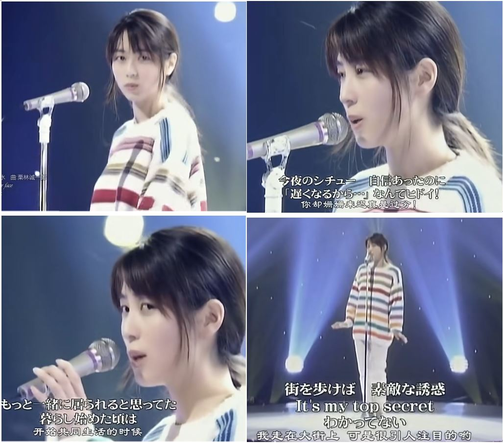 
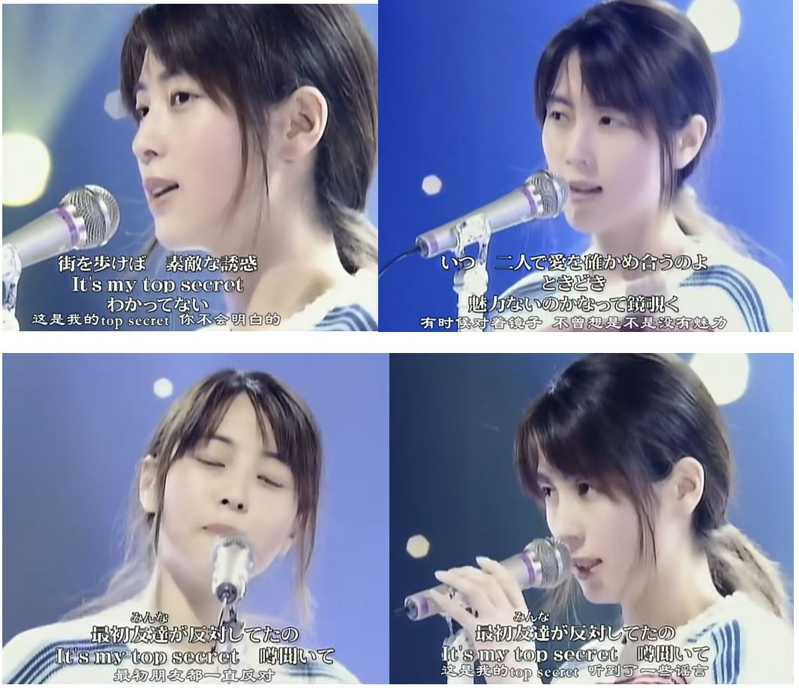 
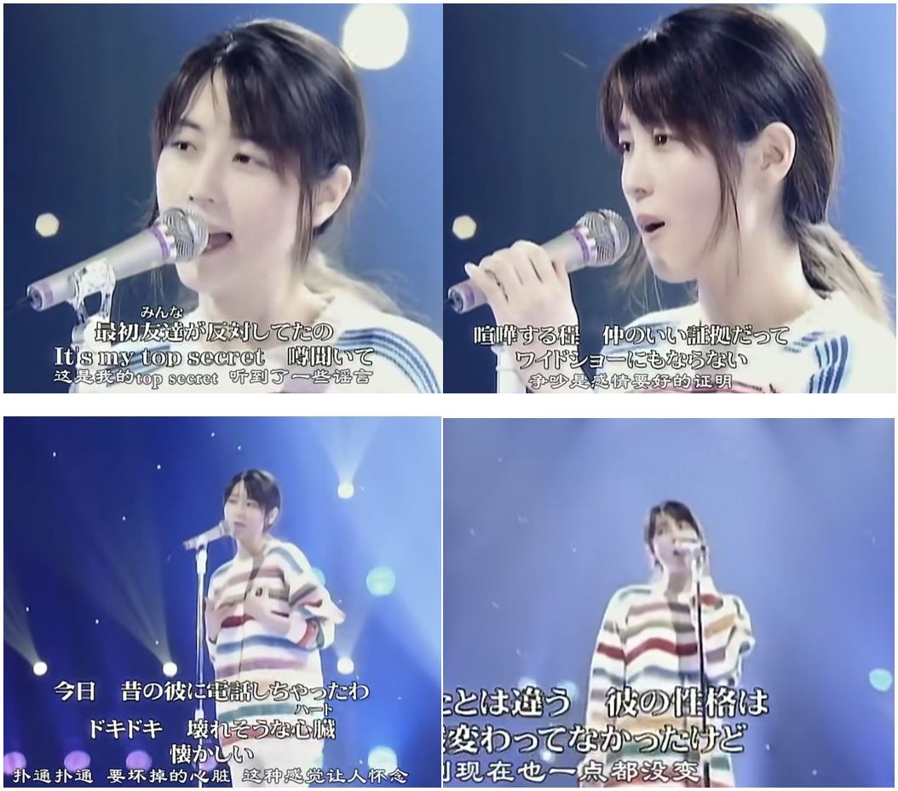 

----------
为什么经济学家给人的感觉实际上没怎么读书？ - Epictetus的回答  
https://www.zhihu.com/question/579495129/answer/2936037283

--------
“有一个同志讲得对，我的东西，他说有些能用，有些不能用，这就作了分析。”

---------
许银川:作为象棋圈中人士，我也不便发表什么言论 
https://www.bilibili.com/video/BV1Pcc8eUE1p

------
我发现有些人非常迷恋于一项技术中的各种复杂细节，也就是除了重新表述技术原创者的想法外就没有自己的理解，粟裕也不会这么死板不会变通。

如何评价粟裕大将？  
https://www.zhihu.com/question/20566125/answer/272951556

--------
我不喜欢许世友、林彪、刘少奇、彭德怀、陶铸，我喜欢粟裕。

--------
ai可以有意识，但是会产生安全问题，就是这种ai可能会产生毁灭人类的动机。

也存在没有意识的ai，也就是说除了没有情绪外其他方面的能力碾压人类并且远远强过有意识的ai。

两种ai都是可能的

---------
女人天生就是感性的动物，所以多学点数学刚刚好。

--------
杨千嬅 - 处处吻

作词: 林夕
作曲: 雷颂德

你爱热吻却永不爱人 
练习为乐但是怕熟人 
你爱路过去索取见闻 
陌路人便特别有份好感 

你热爱别离 
再合再离 
似花瓣献技 
叫花粉遍鼻 噢噢 
你在播弄这穿线游戏 
跟他结束 
他与她再一起 

你小心 
一吻便颠倒众生 
一吻便救一个人 
给你拯救的体温 
总会再捐给某人 
一吻便偷一个心 
一吻便杀一个人 
一寸敏感一寸金 
一秒崎岖的旅行 

让半夜情人 
延续吻别人 
让你旧情人 
又惠顾他人 
每晚大概有上亿个人 
在地球上落力的亲吻 
你那习惯散播给众人 
在地球上惠泽遍及世人 

噢 你为何未曾尽兴 
这塑胶的爱情 
跳蚤的旅程 噢 
延展铺天盖地 
好本领 噢 
这吊诡的爱情 
播种的旅程 Kiss 

别了他  
他吻她他吻她吻他吻她 
延续愉快过程 
你我他真高兴 

下个他 他吻她 
他吻她再亲你结束这旅程 
多得你这煞星 
你小心 

下个他  
他吻她他吻她吻他吻她 
延续愉快过程 
你我他真高兴 
十个他 千个她 
恩爱扩展的旅程 

 
 
 

-------
杨洪基 - 临江仙

作词: 杨慎
作曲: 谷建芬

滚滚长江东逝水 
浪花淘尽英雄 
是非成败转头空 
青山依旧在 
几度夕阳红 
白发渔樵江渚上 
惯看秋月春风 
一壶浊酒喜相逢 
古今多少事 
都付笑谈中 
一壶浊酒喜相逢 
古今多少事 
都付笑谈中 

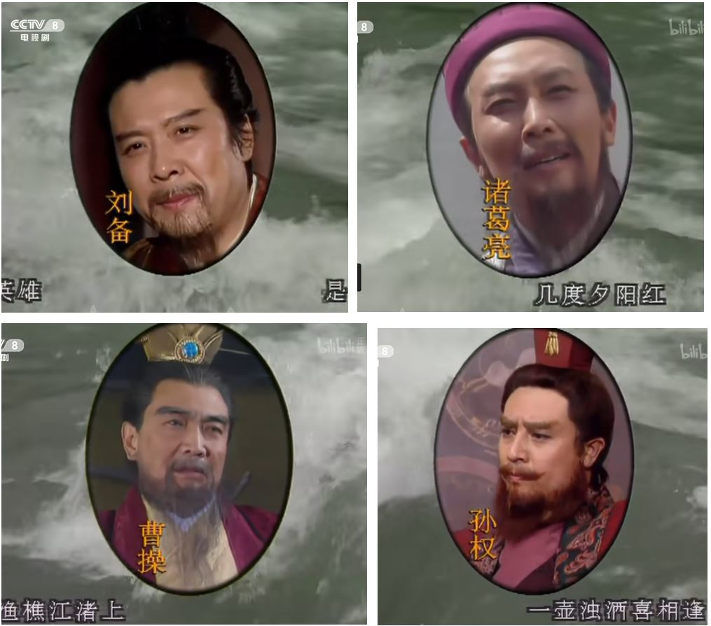 

----------
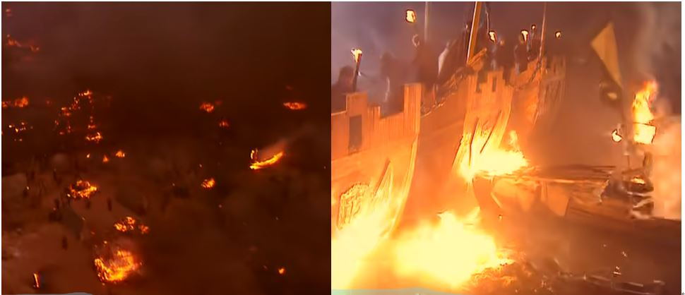 
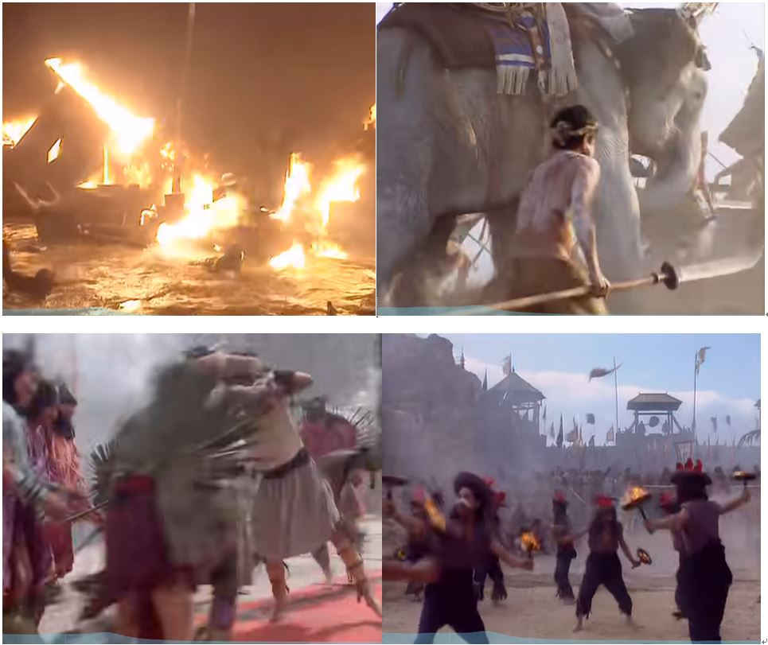 

---------
今天换水冷时螺丝型号和主板对不上，判断型号对不对不是看参数，而是看螺丝能不能拧的上，参数对了，但如果实际操作时拧不上那还是错的。

---------
朱洁仪 - 情不禁

作词：未知  作曲：李海鹰

多么多么辗转这晚夜 
谁倾诉 这心声 
太多依依不舍说有再会期 
狂苦恋 纠缠不清 
夜静的今天仿佛 感染相思症 
望夜空 盼见天际那流星 
静静一刻的想起 想到多凄美 
你可知道 我心这段情 

情不禁 禁制不绝 
今生跟你来约定 
情不禁（情不禁） 借天与地（天与地） 
尽管爱 没余地/直到死 

来吧咄咄不息不休走进生命 
来吧抱抱心中爱未停 
毋用暗暗偷偷想你想到深夜静 
来吧再次继续爱情 

-----------
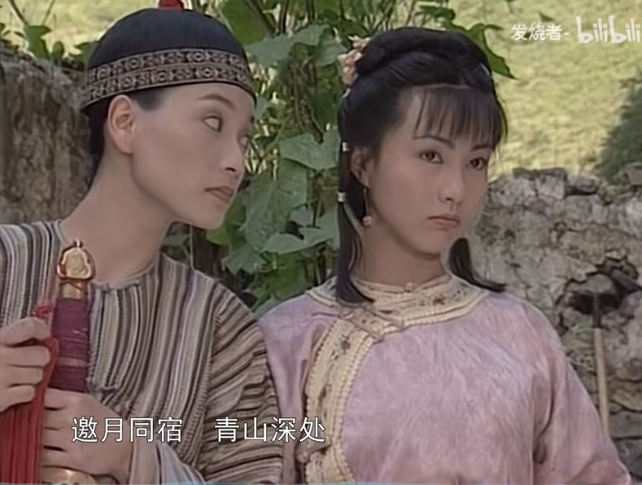 

-----------
海贼王181集1分58秒：你知道海楼石这东西吗？艾尼路

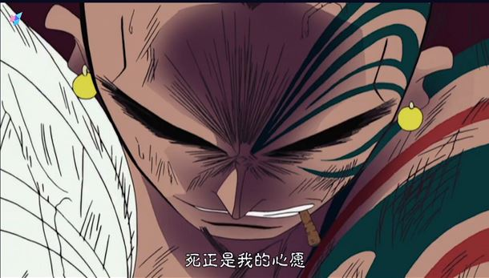 
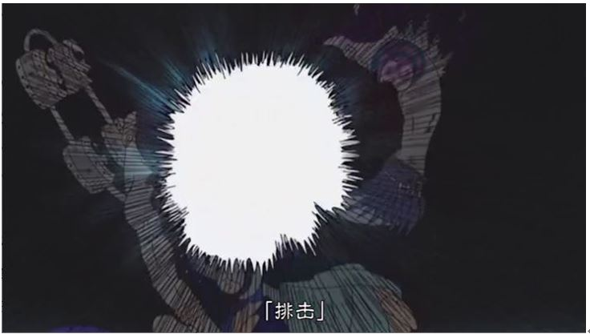 

181集2分34秒配乐 ウーナンと岩蔵

将真意传达给心灵，什么也不用说。我们是编织历史之人。传说这就是800年前历史正文上记载的话语。

历史正文？

当盯上那石头的人们出现之时，黄金都市山多拉的战士勇敢地和他们进行了战斗。

打赢了吗？

打赢了。不过 战斗非常激烈。牺牲者众多，在那之后，为数不多地幸存者就成为了静静守护着都市地残骸和历史正文的护卫。

那就是我们真正的祖先吗？

可是400年前，岛却飞到了这个「SKYPIEA」

被这个国家的家伙们抢走了

将祖先费尽千辛万苦保卫下来的土地

给抢走了

阿帕亚多不但是我们的故乡，而且还拥有着消失在黑暗时光之中的重要历史。即使现在它来到了天空，我们以为豪的都市，山多拉的灯也不可以熄灭。

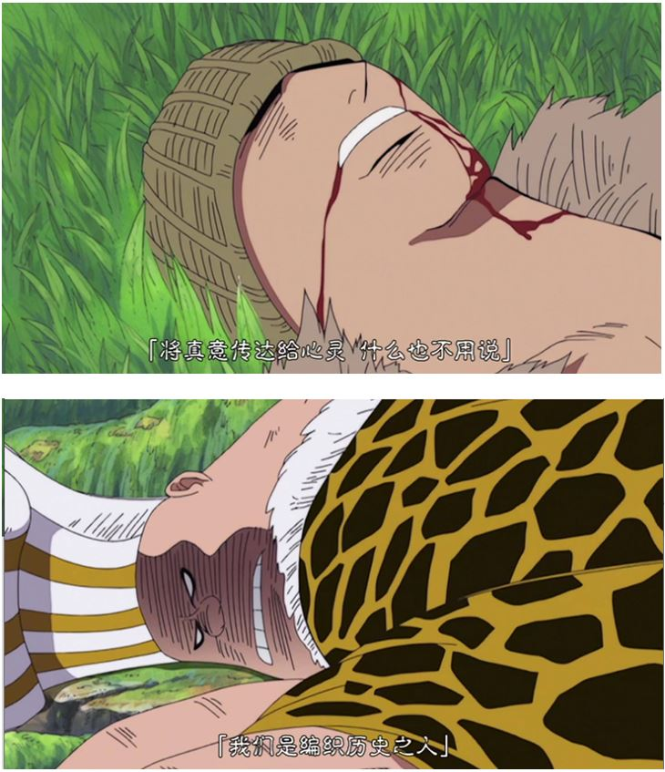 
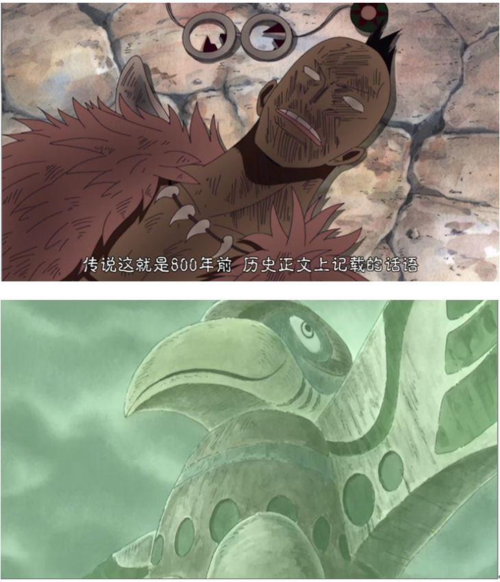 

------------
【天凤】锐评十段新AI幸运J（不建议小朋友学习） 
https://www.bilibili.com/video/BV1uo4y1u7ML

----------
什么是霍奇猜想，它的证明会给数学带来什么发展？ - 彬彧渊然的回答  
https://www.zhihu.com/question/532951939/answer/2526779745

事情是这样的，我之前刷到这个数学问题，看起来好像很深奥我反正一点都看不懂。然后有个屌毛截了个图，好像又有个专业人士@他让我以为他也是数学专业人士，之后我又在知乎刷到了好几次他的回答，然后就关注了他也没看他过去的回答。现在回过头来再看他那1700个回答，都是些什么玩意儿，这像是有一点点数学专业素养的样子吗？亏我还是学辩证法的人，都学了些什么？看来是学到马桶里去了。知乎的回复拉黑功能挺好用的，可以试试。斗还是要斗的，但是要和高水平的人斗，也就是和我左边的那些人斗，和垃圾有什么好斗的，我不是你的出气筒。

------------
一曲《纵横江湖》，配上吴健的精彩打戏，超燃！ 
https://www.bilibili.com/video/BV1NH4y1d7hh

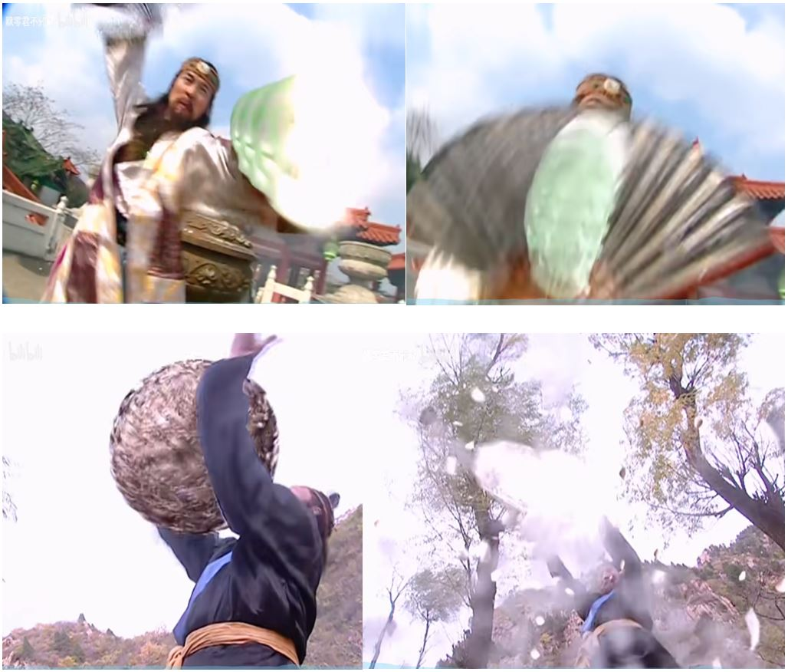 
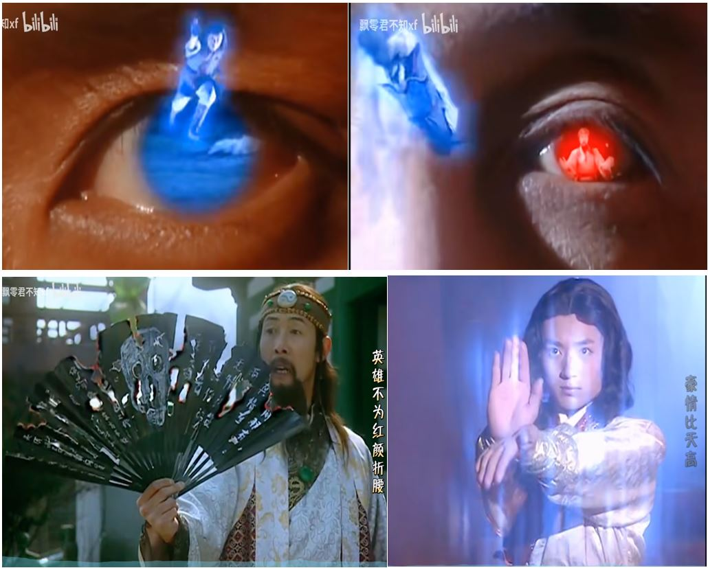 

洪勇 - 纵横江湖

作曲：罗晓音
作词：翟廷雅

纵马江湖道  
今生任逍遥 
英雄不为红颜折腰 
豪情比天高 
 一身冷傲骨 
天地来打造 
剑荡群魔鬼神惊 
男儿正侠少 
手握残阳沥血剑 
心有冷月凝霜刀 
绝顶一览众山小 
男儿世间走一遭 

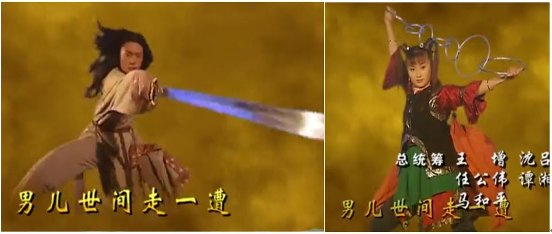 

--------
邀月催眠慕容九 
https://www.bilibili.com/video/BV1mY411j7C8

不是召，是抓。

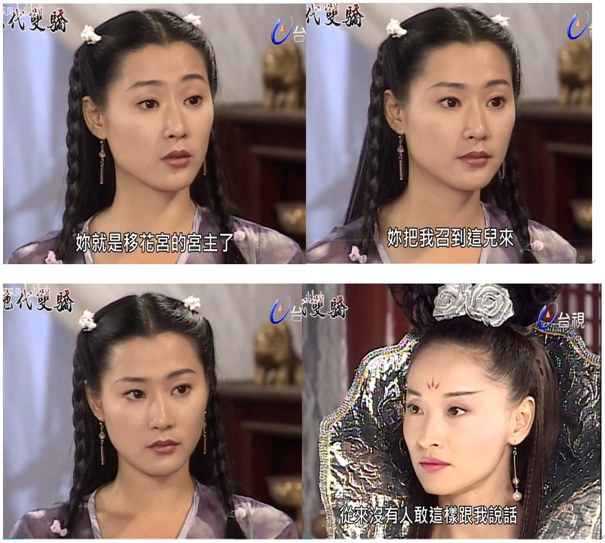 
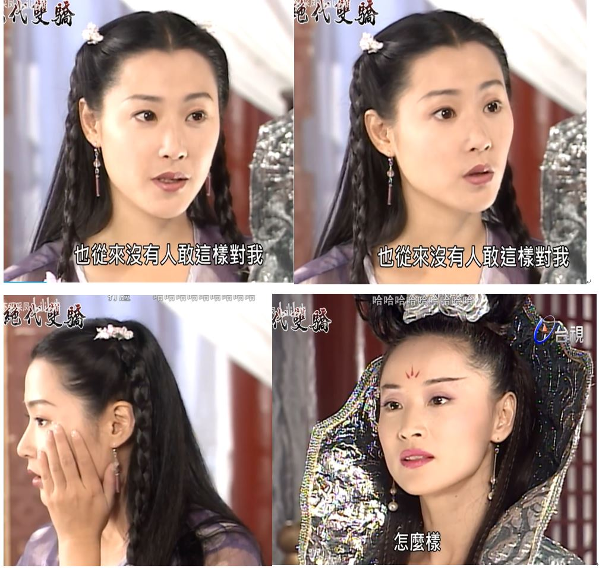 
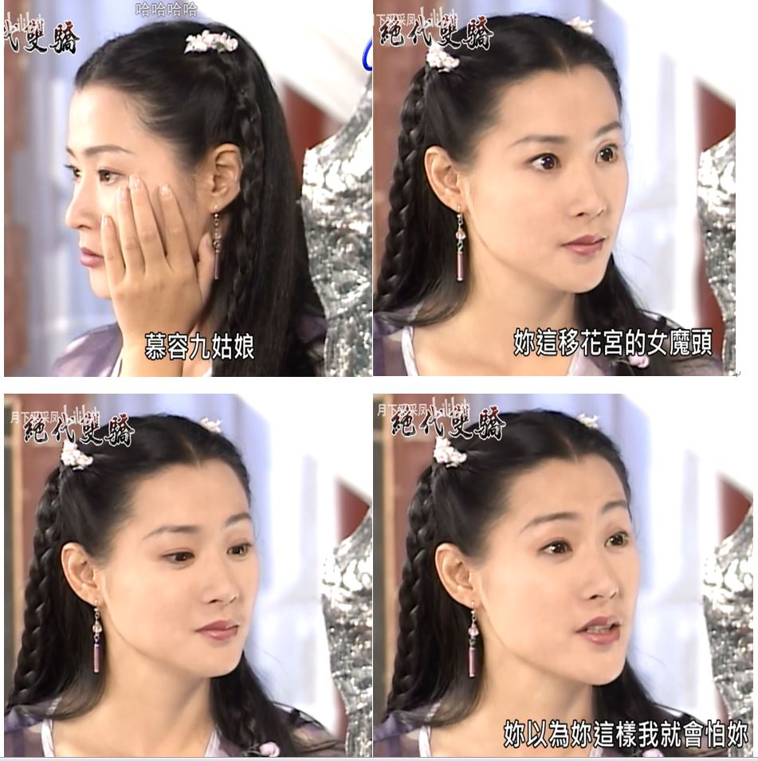 

----------
我不搞研究了，也不去工作，你们谁想斗我就和你们斗到底！你们想要斗多久，我就陪你们斗多久！搞什么破研究？开战！

----------
之前不知道哪个没教养的女屌毛在那里瞎比喻，今天老爹就好好教育一下你，让你长长见识，让你知道谁才是真正的单雄信。

 

----------
太极宗师不知道哪一集，想看的自己找，配乐是 Choppers / Scaling The Dome

黄毛光棍男：你已经输了，快走吧

吴京：还没打完

黄毛光棍男：难道真的要我把你打的爬不起来吗？

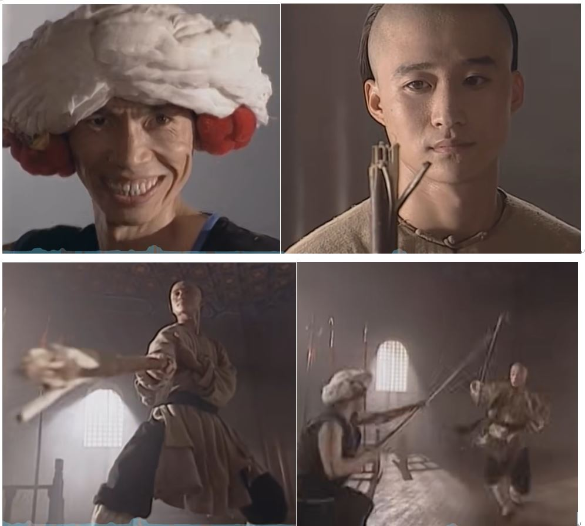 
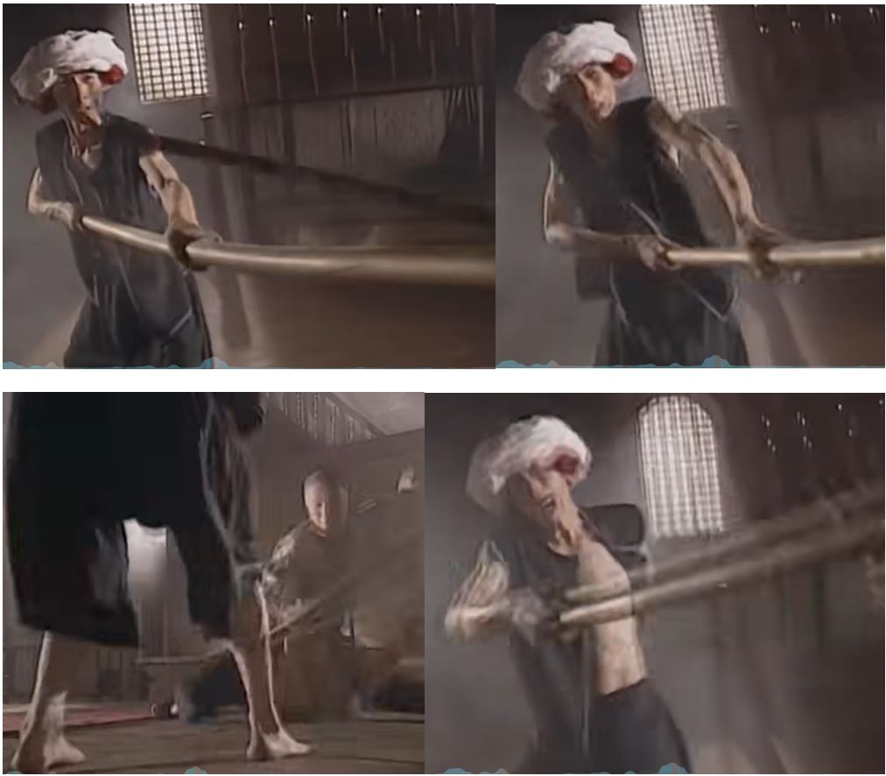

----------
侠客行13集 20分53秒

叮叮当当：那阿黄到底是谁呀？

狗杂种：是我养的一条狗啊

---------
乌龙闯情关 第8集 16分53秒： 唉 你想跑

---------
对于那些做科学、数学、深度学习和计算机相关研究的人，如果他们只局限在他们的职业范围内做研究，那么他们不会出现任何错误，毕竟这些学科都是逻辑自洽的，谁又能比他们更了解自己职业的专业细节呢？

-----------
过去看书时我经常因为搞不懂作者的想法而苦恼，现在我想出了一种新的看书方法，就是看书时重点关注我自己能从书中获得什么新的理解。作者想要表达什么意思根本不重要，他想要表达的东西不一定对我有用，只有我自己悟出来的东西才对我有用，况且作者的认知水平就一定比我高吗？不一定，我感觉在我自己的研究领域内，没看到有人的认知比我高的。

---------
2017.9.15 老KS战15比14辉辉录像弹幕 
https://tieba.baidu.com/p/5323405277?pn=1

---------
银河少儿电视艺术团《歌声与微笑》 
https://www.bilibili.com/video/BV1Wy4y1q7Pb

作词: 王健
作曲: 谷建芬

请把我的歌带回你的家 
请把你的微笑留下 
请把我的歌带回你的家 
请把你的微笑留下 

明天明天这歌声 
飞遍海角天涯飞遍海角天涯 
明天明天这微笑 
将是遍野春花将是遍野春花 

请把你的歌带回我的家 
请把我的微笑留下 
请把你的歌带回我的家 
请把我的微笑留下 

明天明天这歌声 
飞遍海角天涯飞遍海角天涯 
明天明天这微笑 
将是遍野春花将是遍野春花 

（老师好）

----------
悲情面具 葫芦丝（完美版） 
https://5sing.kugou.com/bz/1415472.html

----------
面向专业人士，完全用学术语言也可以引导别人做哲学思考。面向普通人，也可以用哲学语言引导别人做专业性思考。但千万不要学那些民科，长篇大论胡言乱语，睁眼说瞎话。当然我也是民科，只是不会长篇大论罢了。

-----------
《太极宗师》主题曲片头曲《英雄谁属》 
https://www.bilibili.com/video/BV15R4y1C72Y/

注意1分22秒~1分30秒吴京挑扁担这个片段（一定要看动态效果）

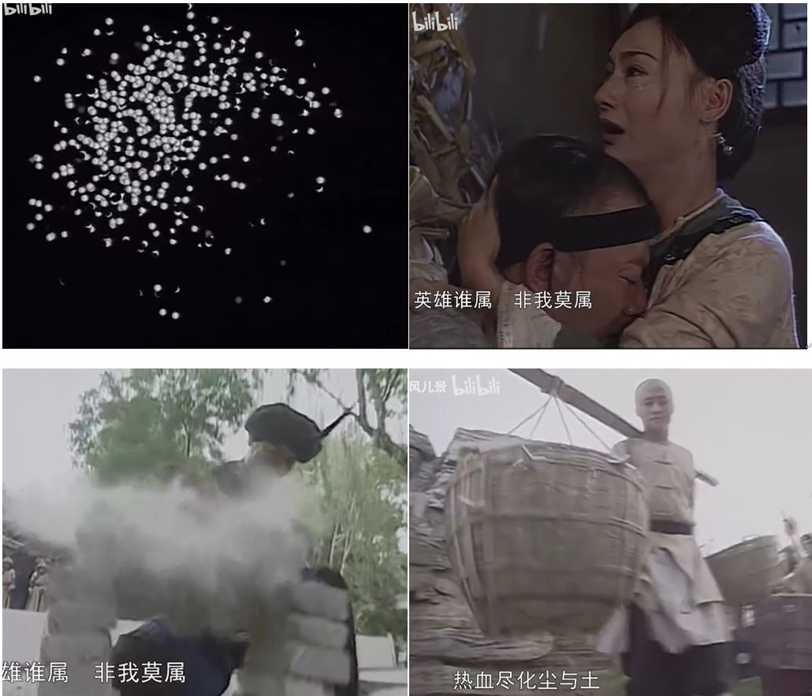

《英雄谁属》 吴京版太极宗师主题曲 卞留念 电视原版 
https://www.bilibili.com/video/BV15x411v77e

卞留念 - 英雄谁属

作词：陈涛 作曲：卞留念

天已暮 月如初 
千里江川 任我飞渡 
歌声住 人环顾 
邀月同宿 青山深处 

英雄谁属非我莫属 
历经千辛万苦 
只为换你芳心如故 
英雄谁属 非我莫属 
热血尽 化尘与土 
只为博你 嫣然一睹 
热血尽 化尘与土 
只为博你 
英雄谁属非我莫属 
呜呀子喂 千里江川 
英雄谁属 非我莫属 

梦醒处 来时路 
晨风吹动 谁家旗鼓 

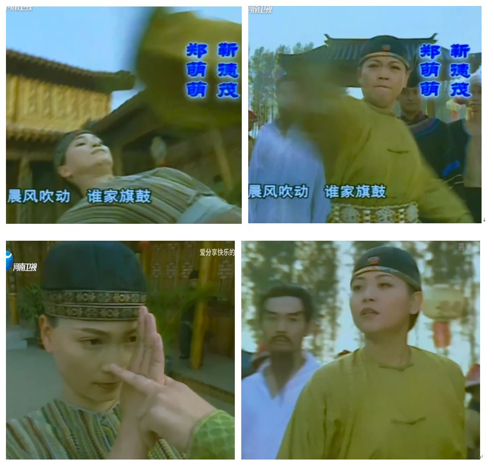

----------
数学绝不是独立的，而是依赖于人的思维而存在的。假如把人的思维从这个世界上抽离，此时物质还是物质，那么数学还有什么存在的价值？

--------
agi的判断不是客观的而是主观的，也就是你在和ai聊天时，是你在指出ai的概念不清逻辑混乱，还是ai在指责你的思维混乱偷换概念强词夺理等各种骚操作向你发脾气。

---------
忘记在哪本哲学书上看到的一句话，大概意思是作者说他不担心人们考虑问题时漏掉了某些信息，他最担心的是人们经常把各种不同的概念混为一谈，然后睁着眼睛做梦。这句话说的非常对，去搜索漏掉的信息那是ai干的事情，把模糊不清的概念清晰化并整合成一个专业这才是人类应该做的工作。那些科学家、数学家、哲学家、民科们，当然还有直线思维的码农，你们都是ai吗？

----------
当你的专业领域被哲学打出了一个洞时，有2种态度：1.划定一条红线自我封闭起来，自娱自乐。2.积极面对，把哲学中有价值和模糊的东西专业化并吸收进来从而扩充本领域的范围。

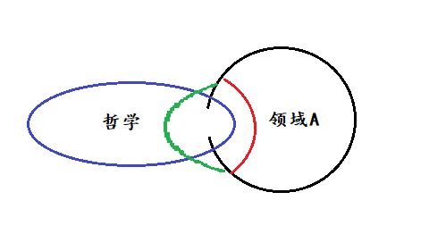

---------
我之前看到有人点赞一个洋人开教堂无偿救济中国人的回答，好像说的是你不去团结有的是人去团结。我感觉他好像是点赞给我看的，他的意思是不是说他想要团结我，但我不去团结他会吃大亏，但他自己怎么不去开教堂去团结那么多需要他团结的底层人民？像他这样的人有很多，这些人永远都只会形式逻辑那一套！永远都学不会辩证法！

记得那个问题是为什么全国有那么多教堂。那个黄毛点赞的回答好像找不到了，有脸点赞给我看就别取消啊，孬种！

--------
“我们不能走世界各国技术发展的老路，跟在别人后面一步一步地爬行。我们必须打破常规，尽量采用先进技术，在一个不太长的历史时期内，把我国建设成为一个社会主义的现代化的强国。”

你们高学历的人是看不上华为，我是根本就进不了华为，所以我是没有资格来评价华为的，因此我现在很少发表关于华为的言论，况且人家老总自己号称是熟读毛选的。

---------
我以前听歌对音质的要求不是很高，只要好听就行。现在感觉我的听觉越来越敏感了，音质差的听起来总给人一种憋屈感，无法酣畅淋漓的宣泄情绪。

---------------
穿越时空的爱恋片头曲-太多 (建议音效设为现场版) 
https://v.youku.com/v_show/id_XMzk2MjcwMjI2OA

陈冠蒲《穿越时空的爱恋》片头曲《太多》 
https://www.bilibili.com/video/BV1v8411L7Cg

陈冠蒲 - 太多

作词: 李岩修
作曲: 徐嘉良

将爱情肆无忌惮的挥霍 
心都碎了还要计较些什么 
无论你想要什么都让你带走 
如果你觉得自由是快乐 
爱是犯了软弱陈旧的差错 
又何必在乎别人怎么看怎么说 

太多的借口太多的理由 
为了爱情我也背叛了所有 
如果你想离开我就别再畏畏缩缩 
太多的借口太多的理由 
别再问我难过时候怎么过 
或许会好好的活或许会消失无踪 
你在乎什么 

----------
别以为我会向你们借钱，我就算死一万次也不会向你们借钱的，只要我不是真的快要死了。

---------
曹颖 - 喜欢你

词曲：古月

喜欢你呀喜欢你 
别以为我想你 
别以为我爱你 谢谢你 
我要说声对不起 跟你say sorry 
撞见别人粘上你呀 我就会在意 
假如把你换成我 把我换成你 
谁都不愿让对方呀 爱情不专一 
Yeh Yeh Yeh 爱我死心塌地 
NO NO NO 爱情不是儿戏 
Yeh Yeh Yeh  啦 •••••• 
NO NO NO  啦 •••••• 

第二集22分30秒插曲：

喜欢你呀喜欢你 
别以为我爱你 
别以为我想你 谢谢你 
真的对不起 跟你say sorry 
撞见别人粘上你呀 我就会在意 
把你换成我 把我换成你 
谁都不愿让对方呀 爱情不专一 

----------
大妈你就不能跟他说一句人没有心一样能活吗 
https://www.bilibili.com/video/BV1sQ4y1D7wH

----------
李健达 - 也许不易

作词：李健达 作曲：罗大佑

从远处听见叹息的诗 在呼唤着旧日名字 
从远处看见某个影子 在挂念着落日情意 
挥不去抑郁别离乱绪 力掩饰当中伤心的故事 
思忆中仿佛早已失去昨天的爱孤单一生又再开始 
尘世里至爱没法相依 就算活着亦无意义 
人远去破碎是她的心 静悄地在滴着情泪 
驱不散空虚是谁后悔 但急风早吹干她的眼泪 
心飞絮今天虽再相见但往日情随着落日已消失去 

哭泣洒泪 洗不去当天忘情的罪 
拥抱着儿子 又再想起悲痛心事 
空虚失落 倾出我一生情和义 
撕破的前事 也许修补恐怕不易 
