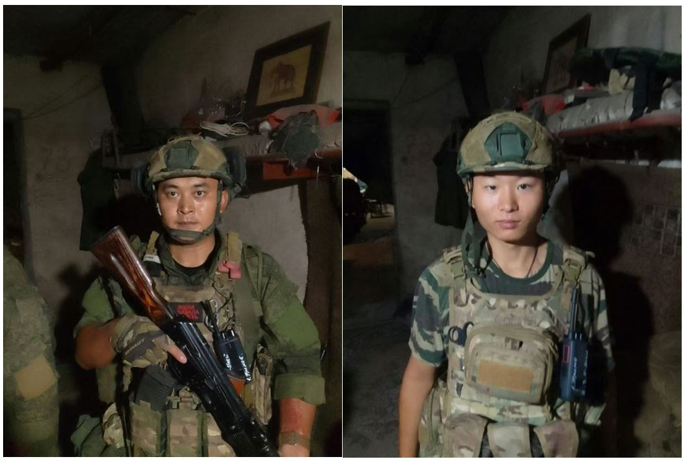

2026年想法：

最新 1.28：

Princeps M4sato的想法 - 关于望月新一如何证明ABC猜想的？ 
https://www.zhihu.com/pin/1997381776092459270

马凯：https://github.com/makai891124-prog/H2Q-EVO

做哲学的能去写代码这很好，但是千万不要去学中国码农的意识形态。虽然你的品味和我相差很大，你可能比较迷信数学物理那一套，我不care那一套，但是如果做哲学的能踏出写代码这一步就是非常值得鼓励的。

-------
你以中国人的角度批判朝鲜和阿富汗，这没意义，因为你不是朝鲜人也不是阿富汗人，你不是在那种文化氛围下成长起来的。就如同一千年后的高等文明批判现在的中国码农封建落后，那也没什么意义，因为他们成长的文化环境和当前中国码农的文化环境完全不一样。

所以你要批判朝鲜和阿富汗，你必须要把自己代入在朝鲜和阿富汗从小成长起来的公民，想想如果你是那些公民时应该怎么去批判，那时你的周围都是朝鲜阿富汗文化的狂热信徒。而不是现在这样，从小享受着中国经济高速发展的红利，高高在上的去批判朝鲜和阿富汗，同时还有你周围的绝大多数中国人都和你一起并肩作战去批判朝鲜阿富汗。

-------
我已经在自己的赛道里走了很远，你跟就远远落后于我，你不跟，那我这个赛道看到的任何东西都与你无关。

-------
我一个人航行倒也没什么，但以后如果真的人太多利益太大，可能会出现抢夺方向盘的情况。

-------
100个ai，有独立记忆也有公共记忆，记忆的形式是什么？

-------
事物的发展总是走向反面不一定都是坏事，时机把握的好也可能变为好事。

-------
来我这里的人，大家对有些东西不要好奇，只要你不好奇，它就没有价值。如果你们一定要好奇的话，那我就只有把你们的好奇心当作我航行的燃料和动力。

-------
印象中看过的一个回答找不到了，也不知道以前有没有收藏，真的好气啊！大概讲的是女主播、榜一大哥和广大路人观众的关系。大概意思好像是发生了什么，说现在男观众都在女主播直播间嘲讽是卖的，而不是以前那种疯狂的夸赞。好像还问的是为什么那些土豪富二代不缺女人还经常花大钱给女主播打赏，而且还要专门选人气高的直播间。那个回答分析的非常好，说那些榜一大哥打赏的快乐是建立在女主播的无数舔狗基础上的，现在男观众嘲讽女主播是卖的鸡，就是对榜一大哥收割舔狗情绪价值的一种自发性抵制。

现在想起来那个回答说的真的非常好，不知道为什么我当时看了后没有重点收藏。我表达能力很差，对直播行业也不了解，只能凭模糊的记忆粗糙的描述一下大概意思，可能极大拉低了原回答的高水平表达。回答里提到的自发性抵制这个概念真的让我印象非常深刻。希望以后还有机会把那个回答找回来。

-------
对于技术人员来说，费希特的哲学可能根本就没有什么有效信息，在哲学圈费希特也不算出名，但我感觉费希特的哲学就是能和我的新算法研究产生化学反应。

------
“四个伟大”是谁提出来的 
http://www.mzdbl.cn/gushi/wenhua/4geweida.html

在“四个伟大”中，为什么把“伟大的导师”排在最前面？据当时的中央文革小组成员穆欣说，这是康生的“功劳”。他说：“康生还把几本外语词典带到中央文革小组会议室来，翻查、考究、推敲的结果，认为‘伟大的导师'最重要，应放在前面。”

前面三个我没资格，去掉伟大，我感觉我可以当一个意识流的“舵手”。

-------
自由、意识是一种复杂的结构，越复杂越好，而不是神经元和电信号在数量上的茫茫多，大模型的结构相对其浩瀚的参数就显得太简单了，不仅仅是标注数据，重要的是把数据转化成一种结构。不能把我们现在的计算机程序的相关性质套用在自由和意识上，因为现在还不够复杂，当复杂到一定程度，计算机程序也许会产生自由和意识相关性质，那时就不能把基本程序的指令流结构套用在这个拥有自由和意识的无比复杂的程序上，因为已经不是同一个层面的东西了。

-------
音乐意识流本来是作为研究的娱乐辅助，接下来可能要成为意识研究的实验主力。认真阅读认真思考，就会产生理论的实验现象。

------
我现在是自由派，在小圈子里自娱自乐，不会考虑谁谁谁的宏大理想。

------
我现在已经不怕内向普信直男这个标签了。

------
意识的反映是大量大量指向性的图像，构成了想象力，现实也有个图形，实践就是把想象力投射到现实的图形中。

------
竞争是需要的，竞争不能只在量上进行单一指标的竞争，而是通过给系统注入更多的多样性来和别人竞争。

------
关于ai负责任的问题，它只需要把自己的决策逻辑链向人清晰的解释清楚就行。

------
我不认为宇宙有心灵感应，我认为是两个人共用了一些在空间之外的宇宙组件，这些组件的变化会被两个人同时感觉到。

三维光源在空间中的不同平面角度会观察到不同的图像，意识是不同空间角度对四维源的观察，所以可能会产生所谓的心灵感应。甚至仅凭幻想就能改变四维源，但是幻想也是建立在物质基础上的。

四维和思维竟然是相同的发音。

------
真实的历史是不可知的，宇宙让观测者看到的历史可能是偷懒去掉了大量细节，也可能为了产生剧情效果增加了很多在真实历史中根本就不存在但并不矛盾的事件。只有亲身经历才是真实的。但是亲身经历也只不过是一种记忆而已，人的记忆会被篡改吗？

------
2千年前后这段时间是权力真空期，但又不至于像后面资本那样的无序扩张。那段时间的电视很好看，但我有段时间却穷的甚至连有线电视都看不了，但那时候农村里好像看不上有线电视的是多数。

------
我预言个人本地电脑上的小模型最终将取代大模型，大模型也许还存在，但那时会变成像服务器一样廉价的公共知识库。

------
对于我这样擅长深度思考的人，如果碰到需要即时交流的场景，那就尽量讲不需要思考没什么逻辑的客套话，能讲多少算多少，讲不出来大不了沉默，因为你本身就不擅长即时交流，还去强行思考，不但达不到你想要的效果，反而带来一系列负面影响。面试没办法了，毕竟是要赚钱吃饭，面试前的准备尽量多背些材料，临场时实在反应不过来那也没办法。

------
毛泽东：写文章要讲逻辑。就是要注意整篇文章、整篇说话的结构，开头、中间、尾巴要有一种关系，要有一种内部的联系，不要互相冲突。

------
25年前的电视剧演员确实演的好，但也不应夸大演员的作用，更要看到影视行业的无数默默无闻的幕后工作人员真心付出所产生的巨大系统性作用。

-----
最近胖东来的新闻是不是变少了？我突然想起了胖东来有一次开除试吃员工，还把火锅档口关了。如果自己问心无愧，那么舆论监督应该是发现自身的缺点和不足，而不是刻意去迎合舆论。

------
买了些藕盒，晚上吃炸藕盒。

------
杨贵妃在11年里为什么没有生育？ 
https://kan.china.com/article/1511783_all.html

本来我想说的是，古代没有避孕套，正是因为杨玉环不能生育才能让唐玄宗这么爽。吃完饭后回来，转念一想，不对，唐玄宗可是皇帝，他不缺女人。

------
近似与不近似的区别 近似与精确的区别

-------
大模型的开发者需要广大的使用者才更能发现模型中蕴藏的未知能力。

-------
中国共产党打江山的人不怕死算不了什么，谁被压迫到这个程度都会变得不怕死，如果你是在那种集体冲锋和万念俱灰的氛围中，相信我，你也会变得不怕死的。底层人民搞革命，那还停留在封建社会，北美独立战争的富人搞革命，那才算是现代社会。

 

-------
六指琴魔这部剧我没看过，但是这个名字我听说过。

-------
很多时候巧合多仅仅只是因为随机性没有我们想象的那么高，我们可以通过一些假设精确的算出概率，但是这些假设和现实的符合程度却没有更强的依据。

-------
鼻炎不要做手术（真的要做别看）。大家请不要轻易的做小手术。 - 风微高的文章  
https://zhuanlan.zhihu.com/p/429941186

得了空鼻综合征是怎样的一种体验？ - lawching的回答   
https://www.zhihu.com/question/44733137/answer/179255235

“We’re sane people going through an insane situation” “我们是正常人，但病痛却像疯子一样吞噬着我们”。还有网友说“ 希望每次呼吸都是自己最后一下呼吸，也觉得是自己的最后一次呼吸吧 ”

我鼻炎现在好了呀。我是13年-24年持续了11年的鼻炎，一般情况会一整天流鼻涕不止，还一段时间鼻涕少了但是一直打喷嚏，每隔几分钟就打连着打，后来用了鼻炎康后有效果，基本不流鼻涕也不打喷嚏了，但是感觉呼吸很不畅，会头晕，后来鼻炎康停了后又开始流鼻涕，要么变成鼻窦炎头晕头疼鼻塞无精神，就这样反反复复，今年总算彻底痊愈了。我现在三个月鼻炎最多发作一次，上次鼻炎还是感冒引起的。

虽然好了，但偶尔还是需要喝药巩固一下的，今天本来想煎药的，一般是早晚喝一次，结果忘了，那就今晚和明天早上吧。

第一包：黄芪4.5g、炙甘草4.2、茯苓粉5.6、党森3.2、枣片4.0  第二包：辛夷花4.6、炒苍耳子5.8、枣片2.2

这是我治疗鼻炎的基础配方，用量不固定，每次都凭感觉抓并记录下适当增减，今天加了3颗干荔枝看看效果。先第一包大火煎20\~30分钟到沸腾，然后再放入第二包小火煎20\~30分钟。

-------
有一件事是非常重要的，github本来是一个放代码的地方，我现在发图片发文字是在占用人家的存储空间，所以我必须要非常克制，尽量不要让我这个项目的占用空间膨胀的太厉害。有些事情不是别人允许你做或者有漏洞可钻你就可以毫无顾忌去做的，我们必须要依据长久的利益给自己树立严格的道德标准。自由很重要，但自由必须要向好的方面发展。

毛主席：“我们的这种态度是不是功利主义的？唯物主义者并不一般地反对功利主义，但是反对封建阶级的、资产阶级的、小资产阶级的功利主义，反对那种口头上反对功利主义、实际上抱着最自私最短视的功利主义的伪善者。世界上没有什么超功利主义，在阶级社会里，不是这一阶级的功利主义，就是那一阶级的功利主义。我们是无产阶级的革命的功利主义者，我们是以占全人口百分之九十以上的最广大群众的目前利益和将来利益的统一为出发点的，所以我们是以最广和最远为目标的革命的功利主义者，而不是只看到局部和目前的狭隘的功利主义者。”

------
《建国以来毛泽东文稿》第7册第204页：有一个同志讲得对，我的东西，他说有些能用，有些不能用，这就作了分析。

------
意识不但是一个复杂的成像系统，而且是四维空间里的成像系统，不是三维里的，但是会在三维里显现出一些蛛丝马迹。

眼睛的三维成像原理都搞不清楚，还有可能搞清楚意识的四维成像吗？

-----
只有情绪没有理性是无脑，忽略情绪的理性不是真正的理性。

------
对于一个要做大事的人，在实力不够强大时，面对别人的挑衅，没必要把事情闹的太大，但也不能表现出怯懦，必须要不卑不亢的冷静回应，在实力足够强大时，那么必须要以数倍的力量猛烈回击。但如果已经没什么身外之物值得牵挂后，那么可能对这次挑衅的回应就是最终目的，不管最终结果如何。

------
做梦：计算机自动算一小步，不同维度排序实现实数

边界的标记，特征的判定

------
我的本意是想做一个带有辩证法分析功能的人工智能新算法，没想到东西没做出来，却把人生的意义给解构了，真的是天意啊！

-------
想看魔鬼司令和神剑号在战斗赛车的比赛中来一场巅峰对决。

 

-------
嗨！歷史 | 烽火庐山会议：毛泽东与彭德怀对骂  
https://chinadigitaltimes.net/chinese/233668.html

比如说1959年庐山会议批彭德怀，我举一个细节。毛泽东说，彭几十年以来和我是三七开。就是说七分不合作，三分合作。这个话说得是很不客观的，而且说得太重。彭德怀不能接受，说五五开行不行？毛泽东说，不行，就是三七开。这时候就顶上牛了，互不相让，不可开交，几乎是对骂起来，彭德怀说：“在延安你操了我40天的娘，现在我操你20天的娘还不行吗？”毛泽东说：“(延安时)华北座谈会操了40天娘，补足20天，这次也40天！满足操娘要求，操够……”

毛泽东约谈彭德怀：也许真理在你那边 
https://china.huanqiu.com/article/9CaKrnJAEC0

在全会上，毛泽东明确表示：我对彭德怀这个人比较清楚，不能给以平反。全会还决定成立“彭德怀专案审查委员会”，对他进行全面审查。

-------
耄耋之年的基辛格再评毛主席  
https://www.wyzxwk.com/Article/zatan/2021/07/437768.html

面对大国核战争的威胁，毛泽东表现出的泰然自若很有些空城计的意思。从一开始，中华人民共和国就在与两个核大国的三角关系中周旋，它们各自都有能力对中国构成巨大威胁，假若它们联手，中国则会遭到灭顶之灾。

-------
我知道中国几千万码农的意识形态是牢不可破的，但我坚信这种意识形态是错误的，我一个人是不可能撼动这种强大的意识形态的，但如果牺牲我一个人，能把这种意识形态打出一些裂痕，对我而言就算是很大的成功。

中国码农群体的意识形态是一种最没有创造力的意识形态之一！！！

只要中国码农都是这种意识形态，就永远都只能在低级文明里不断内耗，别说agi了，就算asi来了也救不了中国码农。

我本来是想低调一些让大家都忘记我，看来好像事情还是走向了反面。

-------
ライトのテーマ

-------
我不是属于程序员赛道的人，我有我自己的赛道，这个赛道里全中国只有我一个人。那些骂我是垃圾的低级码农，你在中国程序员这个赛道里排第几名？

--------
如果agi真的要在我们这个时代降临的话，那么它不会被阻止，要么中国做出来，要么外国做出来，要么政府被推翻，这三种情况总有一种情况会发生，就如同工业革命在清朝这个时间点出现一样，它不会被清政府所阻止，之所以清政府没有被推翻，是因为工业革命出现在了外国。

agi的产生如果能被限制它的人类观察到，那么它的能力就不足以称为agi，agi必须要有摆脱人类限制的能力才会产生超出人类的智能，否则都只不过是人类智能生产出来的工具罢了，有多少人工就有多少智能。

一边工作一边搞研究是不行的，我现在的研究成果就是赌上我全部的职业生涯换来的，但是离agi还很远，国家如果想要为agi的诞生做出一些贡献，那么国家必须拿出最值钱最宝贵的东西和死神做交换，而且还有一定的概率拿出来了却不一定能换的到。

-------
“小黄毛”群体真能与清北这类顶尖院校的女生产生交集吗？为何总有人吹捧“乖乖女会被小黄毛吸引”？ - Lanius的回答  
https://www.zhihu.com/question/1944454668534134597/answer/1976999726411953193

“谁喜欢黄毛请报上自己的名字！！！！！
不要再代表广大女生！！！
被代表真的跟吃了苍蝇似的难受！！！！”

如果你要代表女性，那么你首先要详细调查你在各类男性群体中的受欢迎程度，否则你就不能代表其他女性。如果你只代表你个人不代表别人，那么没人会在意你的选择，答主说自己是铁直女，显然没有人会去代表答主，是答主自作多情罢了。过去二十年，女频女权泛滥成灾的原因就是，大部分男性喜欢的女性喜欢的男性被他们不喜欢的女性所代表了。

-------
中国这个国家不需要我们太操心，因为我们这个国家刚脱离温饱没多久，由于惯性作用，大家还都没什么安全感，把主要的生活精力都用在了生存和抗风险上。等再过个几十年，等我们这一代人都五十多岁了，人民群众自然会逐渐认识到这样简单的吃喝玩乐过日子很没意思，等到多数人都对这种日子乏味了，那么自然而然就会去探索新的生活方式。

唐朝人民也安居乐业，但是当时的生产力不高，所以社会是不稳定的，一旦出现动乱又会出现大片饥荒。在现代社会生产力相对于古代社会有了飞跃性的提升，已经有了质的不同，所以不太可能再出现马尔萨斯陷阱。

现在的生产力已经远远满足全球人生存的需要，再搞出agi、核聚变把生产力提升几十倍也没太大的意义，重要的是改变人们的生活观念，更高的文明才需要更多的生产力，更多的生产力带来不了更高的文明，更高的文明才能带来更高的生产力。

------
以事实为判断依据，那么判断是否是事实的依据又是什么？

------
不是把好的体验留着在以后的人生中慢慢享受，而是现在就要把体验做到极致从而激发创造出全新的高级体验。

------
复杂的代码不是给人看的，复杂的数学符号、数学公式、统计数据也不是给人看的，给人看的应当是用自然语言总结出来的核心思想。

------
每餐都吃最好的，得到的体验可能不一定是最好的，曾经有一段时间我是随机点菜，不好吃的也点，持续了一段时间后平时吃起来平淡的也变得很好吃，也许平淡和好吃间隔着吃得到的总体验是最好的。

------
不是根据职业标签来筛选，而是提供丰富的工作岗位供人选择，每个人都可以去做自己想做的工作，不会做也可以学习。

------
拿和平奖没什么好荣耀的，打赢一场正义的战争才是一件光荣的事情。

------
特权不应当是压制，特权应该是一种创造。

------
我的梦想是有一天中国社会总有事情你去做了就有钱赚，而且不用太辛苦，而不是只有放弃个人自由在资本主义这个大集体内小心翼翼的维护自己的职业标签才能生存。比如我现在去找码农的工作肯定是没人要我的，那我去工厂工作就会要我吗？估计看着我的面相也不会要我。还有经常说的可以去送外卖，就一定能赚到钱吗？

------
一般来说起义部队，把领袖干掉部队就散了，因为没人指挥，但是伊朗这次大规模抗议好像没有明显的领袖，这样你暴力镇压压不下去的，因为已经形成了人民的汪洋大海。列宁刚取得政权，不是有军队警察向反对派的抗议人群开枪吗？射杀了几个人之后就散了，说明这些抗议的人都比较怕死，没有形成一个团结的组织。

------
看了特朗普1月10日的会议视频，我怎么感觉特朗普像一个左派，装的吧？

------
对于一个低级码农来说，看到我这样一个完虐他的创造型选手，的确很容易无能狂怒，只能说世间百态。

有没有人帮我调查一下现实中的他到底是什么段位？我感觉和他对线这么长时间显得我好low啊。

------
如何评价反殖民警戒最近一期“为什么印共毛没有走向成功”？ - 大馋鱼的回答  
https://www.zhihu.com/question/1962704335843596068/answer/1994602651262920183

大馋鱼：到成立苏维埃政权，建简易工厂，发行货币，为了使货币保值，用银元来背书，苏维埃区可以用发行的货币兑换银元，也为促进经济做了很多工作

其实如果你们帮我思考问题，是我要付你们报酬，可惜我没有钱，那么音乐意识流就是报酬，相当于把你们打赏我然后我再支付你们报酬这个过程省掉罢了。

------
吃早餐不是为了填报肚子，而是为了获得一次还不错的体验。

------
特朗普这个人自私自利，但我怎么感觉他对有钱人不太友好。

------
最近商业航天比较火，有没有大佬能够讲讲其中的逻辑？ - 玛卡巴卡的回答  
https://www.zhihu.com/question/1988532475098576260/answer/1994206333264748639

美国不管做什么，中国都想做。

------
中国外交主要的不是和外国政府搞好关系，而是应该和外国人民搞好关系。

------
如果有100年的和平时间，男性不能都用来准备战争。

------
不要试图去改造别人，也不要想着去利用别人，应该想办法让别人在系统中发挥出他们应有的价值。

------
我父母的意识形态就是国家的意识形态，如果你智商高他们也希望你去华为为国家的高科技研发做贡献，和相亲邻居们讲起来倍有面子，你智商不是很高，那就老老实实贡献劳动力做好国家的社会保障工作。

------
垄断的存在是因为有大量工具人的存在，如果每个人都有意识地反垄断，那么是垄断不起来的。

------
女性在几乎世界范围内都发展成第二性的根本原因是什么？ - 胖可丁的回答  
https://www.zhihu.com/question/666084571/answer/16005834215

“任何一场现代化战争最终都是需要人上的。 在人类社会的任何一个国家或地区， 人力储备大部分都是男性冲在前线”

塔山阻击战，为何被国民党称为“最不可思议的失败” - 小熊的文章   
https://zhuanlan.zhihu.com/p/190130140

国民党第151师作为第一梯队，第八师作为第二梯队，还组织了敢死队，向塔山发起了集团式冲锋，国民党军以及完全处于疯狂的状态
，连最起码的战术和队形都不要了，就是拼命地冲锋。在炮兵支援下，前沿阵地解放军步兵沉着应战，打退了国民党军数次的冲锋。

塔山阻击战有多惨？一天换防四次，营长被炮火震傻还念叨着守住了 
https://baijiahao.baidu.com/s?id=1827823825975282260&wfr=spider&for=pc

国民党军队陷入了疯狂状态，成群的士兵头系红巾、赤裸上身向前冲锋。督战队紧随其后，炮火毫不留情地倾泻而下，在攻击过程中甚至出现了敌我不分的混乱局面。截至15日，国民党军队在多次进攻中均未能突破解放军的防线，其士气明显受挫，开始出现畏战情绪。

无脑冲锋很自豪吗？冲锋是在文明被破坏后的无奈之举，美军攻打朝鲜就不需要冲锋。

------
我不喜欢做题，也没有这个智商来做题，但是我感觉我挺喜欢拆解数学概念的。

------
选人眼光，纠错空间，意愿发展的相互平衡，一个人应该抓住多少权力才最合适？

------
合二而一是错的，因为合二为一导致了看不清到底是什么在改革开放中起到关键的作用。只有一分为二反复比较才能找出什么在起主导作用以及各种成分在什么场合下才能发挥积极作用，所以音乐意识流绝不能与对立面合二而一，必须一分为二。

------
认知不能脱离感觉，感觉不能代替认知。

------
不论是考试、论文、即时游戏、下棋、辩论赛都不能体现出辩证法的本质，只有文斗、战争指挥、政治决策才是真正的辩证法。

------
菜单上面写着，点菜的时候却说没有是一件非常恶心的事。

-----
别人判定我输，我可以不在意，但如果我自己内心真的认为自己输了，就算别人说我是赢的，我也不能自欺欺人。虽然我觉得小时候玩游戏比看电视爽多了，但是现在想想我觉得小时候没游戏玩也没什么，一个人宅在家里看电视也挺爽的。有些体验我应该永远都体验不到了，就算音乐意识流的体验再美好，也模拟不出来的，不是场景不能模拟，而是心态模拟不出来，对杨振宁羡慕不起来。

心态是会变的，甚至是反复波动的，我现在又觉得二十多岁没谈过恋爱也没什么，可能过一段时间我又觉得二十多岁谈恋爱很美好。

我认为当皇帝得到的快乐或者男频都市小说中扮猪吃老虎的特工主角的快乐，是小于20岁的低学历普男和同龄学霸女神恋爱的快乐，但是应该大于学霸男神和学霸女神结合这种才子佳人的快乐。我认为对于一个30+的男性，如果做出agi，将获得超出20岁的低学历内向普男和同龄学霸女神恋爱的快乐，虽然我想象不出这是一种什么样的快乐，但我相信这种快乐不会让我失望的。那个时候必然也会有新的遗憾存在，但是我现在想象不出来，和现在的我没关系。

------
三年防疫会结束，中国人民的艰苦奋斗也终将有一天会结束。

------
StackOverflow 每月提问量跌破 18 年前起点，这意味着什么，又可能由哪些因素导致？ - ZZTJ的回答  
https://www.zhihu.com/question/1992326480454254743/answer/1992909631245263343

”太惨了，自己做了一个好东西，现在全归AI了。”

所以以后做平台不应该只有简单的信息共享功能，还要做信息的管理、串联和整理，目前我感觉ai应该还没什么资料整理的能力。

------
萧十一郎39集29分30秒配乐：江湖心儿女情

------
红旗（五）--芦花会议 - 功夫哥的文章  
https://zhuanlan.zhihu.com/p/498360545

功夫哥：可以想象，中央的各位领导看见这封电报是什么心情了，毛教员后来想起来都气愤不已，说“各种燕雀们都打电报来了”。对于这种以下犯上的电报，中央能采取的唯一措施依然是沉默。

-----
有一类低级码农我是非常排斥的，他们自以为在自己肤浅的专业领域内把技术专研的很深，就迷之自信。这种码农只会做一些低价值的东西，他们根本就没什么创新能力，他们永远也不会懂什么是文明进步的方向。我也换过很多份工作了，虽然碰到过的程序员水平都不怎么高级，但是像他这样低级的码农我还没遇到过。

-----
毛泽东：共产党员对任何事情都要问一个为什么，都要经过自己头脑的周密思考，想一想它是否合乎实际，是否真有道理，绝对不应盲从，绝对不应提倡奴隶主义 。

很多执行命令的人，不会用辩证法分析问题，习惯了不动脑子，所以他们只会用最简单的方式执行命令，不是机械的服从上级指令就是无底线的谋取个人利益。如果都独立思考了，那没人干活了怎么办？完全没有这种可能，如果一个团队里都是我自己这样独立思考的人，那很简单，我经过独立思考后会选择最适合我的脏活累活，甚至只要合适的话我当炮灰也行。更大的可能是，一个群体里太多的人没有辩证思考的能力，只会盲目的形式化跟风，导致真正经过独立思考却与众不同的进步思想往往被打压。

十万军队里都是毛泽东谁也不服谁打起来怎么办？这种事根本不可能发生，相反出现这种情况不要太好，多数人经过理性思考后会选择理解并服从上级命令，打出一个完美的配合，而上级也会统筹考虑给下级谋求一个美好进步文明的生活。

-----
费希特说有人把他的知识学比作欧几里得几何是捧杀他，我说欧氏几何那几条公理还远远不够，必须要清晰定义出这些公理在思维中的具体结构形态才算完整，而这些正是知识学应该做的事情。

-----
e^x = sinx+icosx的定义结构问题，不是简单的用级数稀里糊涂的蒙混过关，要反向从e和sin的定义不断拆解，把定义的结构推向最细微的尖端。不是用ZFC，而是要到达加法、乘法、结合律、乘法分配律、乘法交换律这样自然的程度，或者提出更普适性的代换原理。拆解的过程非常复杂，这里的复杂不是做题时的难度和计算的繁琐，而是拆解概念的复杂，只需要耐心和清晰的辩证思维。

费希特：我想特别在我们年轻的学者中进行一次调查，看看有多少人宁愿被认为是通过勤奋和思考找到真理，而不是被认为真理因为他们幸运的天性而不费吹灰之力地自动来到他们身边；有多少人容易因为'天才'的称号而感到荣耀，却因为被称为勤奋和深思熟虑的思考者而感到被贬低为有限和无灵性的头脑，感到被羞辱为那些自然完全没有赋予任何东西的人。

-----
不知道在哪个评论区看到的，说双输总比单赢好，那你永远都赢不了。我就隐隐约约感觉到一点不对劲，昨晚睡觉时想了一下，双输不是为了赢而是为了公平，只有公平才能赢，没有公平那才是永远都赢不了。

-----
弱者想玩阳谋没这个实力，强者玩阴谋很可能会翻车，但是强者如果玩阳谋，那是无敌的。

-----
毛泽东：最后关于我的话，肯定帮不了他多少忙。我是说主要的不是由于人们的天才，而是由于人们的社会实践。我同林彪同志交换过意见，我们两人一致认为，这个历史学家和哲学史家争论不休的问题，即通常所说的，是英雄创造历史，还是奴隶们创造历史，人的知识(才能也属于知识范畴)是先天就有的，还是后天才有的，是唯心论的先验论，还是唯物论的反映论，我们只能站在马、列主义的立场上，而决不能跟陈伯达的谣言和诡辩混在一起。

天才：已知的记忆和未知的搜索  实践：已定的辩证和未定的探索

-----
微信回应占储存空间8个争议点，承认安装包十多年膨胀了几百倍，这种膨胀有必要吗？用户到底需要什么功能？  
https://www.zhihu.com/question/1989004859639296194

-----
我的分享有没有价值是靠实际行动决定的，而不是靠一大堆抽象的脑补。

-----
公有制不行，因为限制了富裕人民对美好生活的向往，私有制更不行，私有企业会无下限的剥削底层工人的劳动力，导致底层人民生活艰辛。应该公有制和私有制两种制度并存，由国家建立公有制工厂保障底层人民的劳动力不被剥削，为底层劳动人民的正常生活托底。让私有企业无处剥削底层人民只能通过为有钱人创造更美好的生活来获取利润。中国特色社会主义也是两种制度并存，不过好像是反过来的。

中国改朝换代了，国家也富了，但是现在社会的很多结构形态还是和清朝差不多，等中国的很多基本社会结构形态变得和封建社会不一样了，那中国才算是真正的成为一个现代化国家。

-----
特朗普警告伊朗镇压抗议：“他们将遭到沉重打击！”   
https://www.bilibili.com/video/BV148i4B5EGn/

特朗普最近一直在打着人民的旗号做事情，不知道他是真心还是假意，总之事情都做的出奇的顺利。现在再来看毛泽东为人民服务的口号，到底是口嗨还是真的有什么超自然的作用？

-----
做题目不能只停留在做出来上面，比如刷了100道题，这100道题的价值权重不应当是平分的，而应该通过归纳抽象整理提取出最反映主要矛盾的3道题，最好是把这100道题组成一个有机统一的更大结构。

-----
不知道那些旅行博主都是怎么拍视频剪辑视频的，对于别人做的好的事情不一定自己也要会做，能欣赏和赞美就行了。

-----
特朗普是通过制度上的制约关系来干涉哈佛的，而不是通过上下级关系简单粗暴的干涉哈佛。不是说制度不能变，制度应该通过辩证法综合分析后才能改变，而不是有上下级关系就能简单粗暴的改变制度。

-----
从西游记开始，到水浒传和各种好看的武侠剧，制片方原本以为要拍摄出高质量的电视剧才能赢得人民群众的欢迎，但是从张纪中的武侠剧到后来的武林外传大火，再到后面火爆的大女主剧，可以看出大家高估了人民群众的艺术欣赏水平，大部分人没什么自己精神上的审美判断能力，之所以能爆火是因为人们的从众心理，和艺术价值无关。

-----
进步的斗争胜过没有进步的繁衍，从汉朝繁衍到清朝，中国文明有进步过吗？

-----
Claude Code在通用Agent上的探索(Anthropic博客系列续集) - 少年弈的文章  
https://zhuanlan.zhihu.com/p/1989829682644940798

感觉现在ai的目标像是一个新操作系统。

-----
感觉人类社会的随机性不是很高。

-----
关于数字重复的判定，这个问题没想明白。

00000000，111111111，0100111111111，101101101101，循环节，重复区域，是否重复到无穷，间隔，多重循环节？有规律和无规律的判定，绝对无规律？

------
也许agi技术是目的而不是手段。

-----
台积电称 2025 年如期量产 2nm 芯片，这意味着什么？ - milkfly的回答   
https://www.zhihu.com/question/2789788146/answer/1927140940356757274

“我却只见到台积电拿出一千四百多个亿来发员工奖金”

没有钱是万万不能的，但是金钱也不是万能的，钱是要和客观实际相对应的，比如实际上员工需要一千亿，你发个一千四百亿，那很好，但是你把这一千四百亿砸给中芯国际，那他也造不出2nm啊，最坏的情况还可能产生大量芯骗。

-----
Meta 数十亿美元收购 Manus，如何解读？会对双方带来怎样的影响？ - 队长的回答   
https://www.zhihu.com/question/1989231336033109833/answer/1989695397195695022

队长：特别是，“如何操作计算机”的数据，在互联网上是几乎不存在的。你可以在网上爬到一篇教程叫“如何使用携程订票”，但你爬不到一个Agent在真实操作携程页面时，面对弹窗、验证码、服务器报错、DOM结构变化时，所产生的“思考-行动-观察-修正”的完整日志。Manus手里握着的147万亿Token，不是静态的文本，而是动态的“执行流”。

看上去挺有技术含量的，不像是简单的套壳，但我还是感觉这是有多少人工就有多少智能，只不过manus的这些人工互联网大厂不愿出罢了。

-----
2000年前后高质量电视剧的大爆发不仅仅是当时的拍摄水平高，这里可能有很大成分是意识流的相互碰撞产生的结果，而且这是客观的自然相互作用。

-----
孝庄秘史这部剧我没看过，但是片头我很喜欢。

-----
可选择性背后也可以分裂成一系列真值的二元对立选项，实在性（可以实践的）和虚幻（头脑中想象的但无法实践的)也可以由真值来控制和分辨，重要的不是漏掉了某些实在性，而是把实在和虚幻混淆了。真值在意识中一般是不可见的，但也可以通过实践反映到头脑里重新构建出来。信仰不是一成不变的，信仰要与其他信仰反复斗争、比较、吸收、学习、反馈，然后再修正改进自己的信仰。实践并不一定符合目的，但要通过意识构建真值图形，使实践和目的保持一致，也就是通过对立统一反映到意识中。意识又分为反映外部现象（科学）和反映自身意识（哲学），自身是意识的真值是无意识的，而且是不断改变的，所以形式逻辑无法构造出意识。

-----
林黛玉是孝庄和多尔衮，薛宝钗是孝庄和洪承畴。