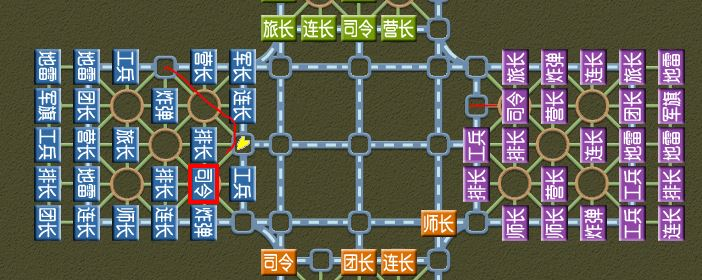
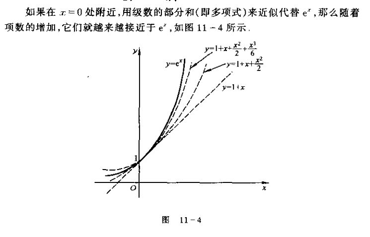

接下来要看路径相关的代码TravAllMovePath，TravOneMove，这是老的路径方案，代码已经完全忘光了，这部分代码比较重要，很多地方都用到，必须要回忆起来，然后再想想怎么用路径场的方法取代老方案。

对于工兵在铁路上的src dst，找到把兵线挡住的点位，这个我记得是参考了一个知名算法，叫什么名字忘记了，描述这个算法的关键词也忘记了。

找了一下，还好以前收藏了。既然找到了，那慢慢看，迟早会把这个代码看明白的。

【朝夕的ACM笔记】图论-割点 - 朝夕的文章 <br>
https://zhuanlan.zhihu.com/p/269306969

现在就是有一个问题，像这种复杂代码我不可能一个一个写过去的，必须要让ai学会自动写代码，理解需求，实现需求，调试验证，这整套流程必须要全部自动化。当然我说的需求只局限在军棋ai这个场景内部，因为这是一个封闭的场景，它对于自身实现需求的信息全部都有，所以理解需求时完全不需要和人类交互，没理由自动写代码是做不出来的。

在封闭场景内自动写代码做一定是能做出来的，就是难度比较大，需要把我研究出来的辩证法应用起来，让ai学会辩证的分析代码，目前还是没有找到好的切入点。目前以我的理解来看，大模型写代码的辩证能力为0，如果你觉得大模型看起来好像有辩证能力，其实是近似的，辩证意味着绝对精确。人也会犯错误？人犯错误那是疏忽，或者信息不完备时的探索当然会犯错误，人在完备信息里的辩证是像数学定理一样精确的，是像1+1=2一样精确的，是像计算机执行一条指令一样精确的。

不能说ai没有辩证能力，好像拿各种问题去考ai，ai的水平已经明显高于大部分人类，但是总感觉和普通人相比，ai还缺点什么，这缺的到底是什么呢？ai有辩证能力，但ai不知道什么要辩证。我的绝大部分能力都是低于人类平均水平的，但是我在需要辩证的关键信息的选择上是很强的，而ai在这方面特别薄弱，它认为所有信息都是平等的，而对于一个有自我意识的人来说，对信息的偏好是很强的，而理性的人尤其偏好支撑目的、立场、意愿、喜好等关键信息的逻辑骨架。

下一步大模型需要攻坚的方向已经不是生成信息了，而是选择信息、整理信息、能分辨出哪些信息是自己没接触过的，产生新鲜感，并按照一定的逻辑将新信息融合进自己的大模型内。所以必须要给大模型创造自主实践的环境（这和强化学习有什么区别？），这些能力人也是从实践中锻炼出来的。

让ai给我讲解代码，讲的挺好的，我感觉我在ai面前像是一个低智商的笨蛋，看来我对现在最先进的ai认知已经落伍了。全知全能也不一定就好，况且现在的ai还没有到达全知全能，人类就算是低智商的笨蛋，只要还不是脑残，一般情况下能判断出自己哪里不懂，当自己不懂时会独立思考解决也可以请教别人，搞懂后的乐趣就是一种求知的乐趣，当ai碰到自己不懂的知识是什么情况？是大方承认还是借助自己强大的知识库强行装懂？

学德布罗意口嗨一下，他说物质也是一种波，我说不是增强ai的能力，而是削弱ai的能力，不是ai回答用户专业技术，而是ai向用户学习专业技术，接下来不是比谁家的ai懂的多，而是比谁家的ai学的懂。当然这个场景对于大模型的开发者不好模拟，现在的ai什么都懂了，没有ai不懂的。

在完备信息下的任何工作都属于工具范畴的，在信息不完备时能判断出自己缺失了哪些信息才算是有认知能力的。

对表论是反马列主义的，要分析出是什么关键成分对整个棋局起到重大的影响，比如本来是有优势的，结果不小司令被炸了，优势变劣势，本来是能守和的，结果炸弹被摸了后变得守不和了，本来是能赢的，结果工兵被飞了不够挖地雷导致赢不下来。

TravAllMovePath核心是递归调用`SearchGraphCut(pJunqi,pNbr,pTrav);`这个函数，`pTrav->aLow[idx] = path_idx;pTrav->aFlag[idx] = path_idx;`aFlag和aLow相当于上面回答里的红框和蓝框里的数字，当然我这个代码写的非常杂还加了很多其他功能。

核心逻辑是遍历所有的点，看看能不能绕过去，能绕过去说明不能分割，不能绕过去才能分割。

61--->99，94的low是9，碰到126的low是7，把94的low也设为7。这里没什么好说的，就是判断aLow是不是比aFlag小，判断是不是能绕过去，不能绕过去就是割点，很多逻辑细节需要反复调试才能跑通。判断结果存在`u8 aCut[129];//0:没遍历到,1能分割连通图，2:不能分割`

TravAllMovePath先是调用TravMovePath生成src到dst的路径，用的是广度递归遍历，需要用到相邻格子遍历。如果是TravOneNbr，铁路上也是只找相邻的，TravOneMove在同一条铁路上生成没有阻碍的所有点，TravGongbOne所有铁路上能到达的点。接着调用SearchGraphCut把生成的路径打上能不能分割的标记。当然把这个代码看明白，不是继续使用老方案，而是为了更好的构思出新方案。

-------
与90% 3.0-0修5跳过后手 第6步 司令为什么进营  第12步 蓝色的司令为什么走了这么奇怪的路线？

关于代码要不要开源问题，还是先不开源吧，试试先不通过代码能不能把逻辑讲清楚。再强调一遍，我不是让ai像剪枝算法一样有强大的搜索能力，也不是让ai像深度学习一样有强大的直觉能力，而是让ai像人一样有正常的逻辑辩证能力。

不一定要追求结果，可以先在这整个旅途过程中思考哪些人类的能力是ai所不具备的。人会对一些事情感到奇怪，比如我看到我的代码下出了这样的棋我就会感到奇怪，ai有奇怪这个概念吗？



33 38 是AbstractSendMove(pJunqi,apSend);打印出来的，那么我们就要去看看apSend来自于哪里。开源不是目的，目的是给研究agi的人提供一个普通程序员是怎么分析代码的实验对象。

接下来断点进入GenCheckTraceSendMove(pJunqi,apSend);这时apSend还是空的，现在只要我们一步一步追踪就能找到apSend是在哪里被赋值的。

遍历pTrace，pParse->pTraceVec已经是通过优先级排好序的，选择好的步子放在pTrace->out，四家的trace是混杂在一起的，通过条件if(apChess[0]->pLineup->iDir==pJunqi->eTurn)选出最后的着法。这里的逻辑感觉也没什么复杂的，接下来看pTrace是哪里生成的。

我这个代码的逻辑是这样的，军棋棋盘总共129个格子，先无脑遍历所有的129\*129根据一些过滤条件和比较产生一些优先级比较高的配对放在pTrace里，基本上大部分都是src和dst的配对，src到dst有很多步，在SearchDstMove里生成路径，我是这样做的，先遍历src到所有格子的最小步数x，再遍历dst到所有格子的最小步数y，src到dst的最小步数是n，然后x+y=n的格子就是最小路径上的格子。找到最小路径不是主要目的，主要目的是建立格子到所有其他格子的路径场，这个应该是可以复用的，后面还有很多其他用途。

我的智商其实不算特别低的，就是速度慢，你在调试程序的时候肯定也是要放慢速度的，不可能劈里啪啦在那里运行还能调试的起来。如果你们想调试我的思维，那我刚刚好，智商太低的没什么调试价值，智商太高的运行速度太快你们跟不上。

接下来主要分析为什么33 38紫色司令进营的优先级比30 9军长吃排长的优先级高。

下一步就是把比较的条件断点给设出来，但我现在数据结构是什么样的不太记得了，所以还是比较麻烦的。

通过GetNodeFeature设置pTrace配对的所有成分，这里的逻辑感觉不容易说清楚，成分是对应多种特征的，比如子力pLineup、格子pChess、路径数组aMoveBuf、移动apMove是基本成分，然后特征是根据成分构造的，比如src pLineup和dst pChess这两个成分可以生成吃子eat、可能吃 may eat、撞死killed等特征，只用dst这个成分可以获取师长、军长、炸弹、工兵、地雷、big、not big、camp等特征，src可以生成工兵、地雷等特征 ，然后通过GetModuleFeature获取各种成分生成的原始特征，因为原始特征我手动写了一张函数表有编号的，所以存放在aOut的u16数组里。

这里特别绕的是这多种原始特征是可以组合在一起的，pParse->pVarHash->u1.ppAst是一张存储特征的hash表，结点是类似链表结点的复杂数据结构`AstNode *pAst`，特征可以是单独的原始特征也可以是多种特征组合在一起的复合特征，复合特征既放在ppAst的特征表里也存在第一个原始特征的链表里，主要是为了加快查找速度，特征里记录着优先级，现在是写死的，以后会增加动态调整的功能。GetAllFeatureNode获取aOut的所有特征包括复合特征放在pAstVec这个数组里。

这里的代码基本上都是围绕着特征数据结构AstNode和TraceLink玩的，我感觉如果能把我这两年的研究结果应用进来，尤其是在特征上增加范畴动态变换和灵活代换，能把特征数据结构玩出花来，不仅仅是优先级这么简单可能会有各种形式变换，不过我现在还是没有想好切入点。
 
现在就可以看到我的代码写的有很大的问题，两个配对比较时是用pAstVec这个变量来比较的，但是pAstVec的结构类型是Vector这种通用类型，比较结束后外层只记录pBestAstVec，根据pAstVec生成的pTrace插到了pJunqi->pParse->pTraceHead链表里，并没有返回到上层，那么我在进入比较函数后就不知道pBestAstVec对应的是哪个pTrace。

逻辑上看起来很简单，只要在UpdateNodeTrace加个pTrace的返回值就行，但是这个函数我有4处地方在调用，我要一处一处改过去，以后如何避免碰到这个问题？我现在不是工作，完成任务不是我主要考虑的，我的重心应该放在思考方案上。用ai改。算了，感觉差不多，我手动改一下吧，只要不是太繁琐，效率问题现在不是我需要考虑的主要矛盾。

这代码写的好烂啊，所有4\*30\*129的配对竟然共用一个全局的pJunqi->pParse->apAstVec[0]，然后又分4次在外面调用GenHomeNode，感觉很容易就把全局变量和局部变量搞混了。之前是全局的，我现在调式时定义局部肯定是不行的。我不用全局变量，所有全局变量全部放在pJunqi，这次调试图个方便直接放函数外面好了。

```
    for(i=0;i<4;i++)
    {
        if(pJunqi->aInfo[i].bDead) continue;
        GenHomeNode(pJunqi,i);
    }
	TraceLink *pTrace = NULL;
    TraceLink *pBestTrace = NULL;
    pBestAstVec = pJunqi->pParse->apAstVec[1];
    pAstVec = pJunqi->pParse->apAstVec[0];
```

先是紫色30 9和橙色的9 30比，比不过，这两个比有什么意义？接下来的pBestTrace我打印了一下，分别是44 30，44 33，44 38，45 40，但是为什么GenCheckTraceSendMove里没有产生apSend又重新运行GenHomeNode？因为所有四家配对都混杂在一起比较，但是没有产生走棋方的配对，所以要重新开始。先不管第一轮了，还是从第二轮开始吧，这个代码写的太乱了，而且有点复杂，不开源是无法给别人讲清楚的，现在只是给自己做个分析记录。主要关注这两个点，我又发现GenHomeNode生成的不是33 38，而是33 34，然后根据src dst再生成src next 33 38，这个问题就更大了。

最后看了下生成apSend的trace，是33 38没错。我pBestTrace是在比赢的地方记录的，最后是33 34，但是33 38是在比输的地方生成的，那就之前说的全部有问题，忘记当时怎么想的，为什么比过了或者没比过都调用UpdateNodeTrace，那比较的意义在哪里？

比赢了进入最高优先级，比输了把pTraceHead链表里最低优先级淘汰掉，那应该也是33 34才对，怎么变成33 38了？

先把以前写的打印函数给用起来
```
call PrintAllTraceVec(pJunqi)
call PrintAllTraceLink(pJunqi)
call PrintTraceNode(pJunqi,pTrace)
call PrintFeatureVar(pJunqi,nVar,aVarNum)
```
在TraceLink里生成的是33 34，33 38 顺序没错，然后放到TraceVec排序后，由于这两个优先级一样，所以换了个顺序变成了33 38，接下主要探究这些杂七杂八的特征到底是什么意思。
```
src 33 dst 38 iNum 23
feature:
CheckTravNbr  相邻碰撞
CheckMaxFake  src是最大子
CheckMoveTurn 
FtrSrcNotGongb
FtrDileiNoBreak

src 30 dst 9 iNum 1
feature:
CheckTravNbr
CheckMoveTurn
FtrMoveMayEat
FtrDstNotBig
FtrSrcNotGongb
FtrDileiNoBreak
```

总算了解了一下特征代码的大概框架，其他无关的代码就不看了，等用到的时候再看吧，接下来主要还是构思怎么把我这两年的研究应用起来，24年和25年我竟然整整两年没写代码了。也不是应用起来，主要找一个切入点，让接下来的写代码和构思能启动起来，然后就仿照音乐意识流那样随机应变（随波逐流？）

今晚看看111步跳过的原因是什么，现在先把代码熟悉起来。有了打印函数，调试起来就方便很多了，all trace vec 是有trace的，79 54，39 50，但都不是属于下棋方的，接下来重复运行5次GenHomeNode(pJunqi,pJunqi->eTurn);直到生成send为止，如果实在没有，那就是跳过了，运行了一次后all trace vec是53 58，51 52，这两个确实也不行，第二次是54 53，51 128。51 128感觉可以啊，不知道为什么pTrace->pSub链表是空的，那么接下来就要去SearchNodeNextMove看一下是什么情况。

看了下生成的路径是51 50 30 128，在PlayTraceDst中生成src next的特征，碰到pAst->aVar[j]==FT19FtrMoveBlock被过滤了。aVarAll的意思是，把src到第2步、第3步、第4步...的所有特征都加起来。

接下来看SearchRspMove，这个代码感觉一时半会很难看懂。这个代码是一个半成品，大概意思是生成了对手的pTrace src next，然后再生成一个block，把这个pTrace挂在block里。`InsertVector1(pJunqi,pBlcok->pTraceVec,pTrace);`

这个代码就看到这里吧，后续要想想开发方案。

--------
已知0 < a < 1，x^2 + y = 0，证明：log_a (a^x + a^y) >= log_a 2 + 1/8

对于0.1^t，当t取2时是0.1\*0.1，但是当t取-1、-2、-3、-1.3时究竟意味着什么？

a^m\*a^n=a^(m+n),指数在乘法的代换形式中把+换成了×。自然数加法是+1乘以个数，乘法是加法基数乘以个数，是先有个数的形式，然后在形式上再定义一个基数。基数和个数的形式是一体的，定义新概念时是用形式，而使用时用的是基数。

a×a=2,a架空了乘法由加法构成的基本形式。(b^a)^a=b×b，指数b^a架空了指数由乘法构成的基本形式。单位面积和粒子哪个更基本？

不是架空是扩域出来的，用不等式连接出来的，基本结构生成多项式，多项式再生成无理数等更复杂的结构，复杂结构不一定继承简单结构的相关性质，复杂结构会有很多新的性质，这些新的性质产生什么定理怎么证明不是我关心的，但是从基本结构到复杂结构的生成过程是我必须要搞清楚的。

2+2中把+换成了×后变为2×2，到底改变了什么？变换了什么？无论是2+2还是2×2，这里的2都是基数。2×2中的后一个2本来是个数，但在这里好像变成了基数。现在的目的是理解单调函数a^x的本质是什么，单调是从什么地方被定义出来的？

2×3= 0+{1+1}+{1+1}+{1+1}，2^3 = 2×2×2 = ？感觉从这里到定义出单调还有很大的距离。把2×2×2表示成幂，就不再考虑{1+1}+{1+1}这种基数乘以个数的形式，主要考虑大小等性质。

1+1/x的x次方单调递增该如何证明? - 玲珑的回答  <br>
https://www.zhihu.com/question/505740092/answer/1956304861210608957

先把单调递增和存在极限证出来后才有e这个数字吧？

如何证明e＜3? <br>
https://www.zhihu.com/question/26233759

失望，到底是我对数学分析不了解还是数学家根本就没有对e定义的先后次序做严格证明？

如何证明(1+1/x+1)^(1+x)>(1+1/x)^x,其中x是自然数，我用计算器从2、3、4、5一个个试过去是递增的。

知乎直答说是用二项式定理证明的，展开后比较每一项，我看懂了。还有另外一种方法用均值不等式证明，应该也是对的。

如何证明e＜3? - yuyu的回答 <br>
https://www.zhihu.com/question/26233759/answer/32411484

我失望的原因是因为把e定义成级数，没仔细看，下面这个回答是用的二项式，我看成也是级数了，搞混淆了。用二项式证这个次序我是赞同的，用级数证我在直觉上是排斥的，现在级数怎么定义出来的我还没看，我也不知道我的直觉对不对，说不定用级数定义e和用极限定义还真有可能是等价的。

我研究数学不是为了发论文，而是为了把数学的定义写成计算机代码，所以定义步骤的次序非常重要，弄乱了代码就运行不起来。

如何证明e＜3? - 寄给你的往事的回答  <br>
https://www.zhihu.com/question/26233759/answer/1913295290414401210

回答里是把n!缩放成2^n-1的等比数列，算出上界。不等式是先定义出范畴3-1/2^n-1<3，再结合形变扩展，2^k-1-->k!--->(1-1/n)...(1-(k-1)/n)，n-1/n中，分子来自于(1+1/n)^n中的指数，分母来自于1/n，接下来二项式展开要考虑的是组合问题。指数转化为组合数，组合数再除以1/n中的n究竟意味着什么？

数列 $\left(1+\frac{1}{n}\right)^n$ 的单调性是数学分析教材中的经典内容，几乎所有主流教材都会通过 **单调有界原理** 证明其递增性，并以此定义自然常数 $e$。以下是具体说明：

### **1. 教材中的标准证明：二项式展开与比较**
数学分析教材通常采用 **二项式定理** 展开数列通项，通过逐项比较证明其递增性。以华东师范大学《数学分析》为例，其核心步骤如下：  
将 $\left(1+\frac{1}{n}\right)^n$ 展开： 

$$
\left(1+\frac{1}{n}\right)^n = \sum_{k=0}^n \binom{n}{k} \frac{1}{n^k} = 1 + n \cdot \frac{1}{n} + \frac{n(n-1)}{2!} \cdot \frac{1}{n^2} + \cdots + \frac{n!}{n!} \cdot \frac{1}{n^n}
$$

对于第 $k$ 项（ $k \geq 1$），可表示为：
  
$$
\frac{n(n-1)\cdots(n-k+1)}{k! \cdot n^k} = \frac{1}{k!} \left(1 - \frac{1}{n}\right)\left(1 - \frac{2}{n}\right)\cdots\left(1 - \frac{k-1}{n}\right)
$$  

当 $n$ 增大到 $n+1$ 时，展开式的第 $k$ 项变为：
  
$$
\frac{1}{k!} \left(1 - \frac{1}{n+1}\right)\left(1 - \frac{2}{n+1}\right)\cdots\left(1 - \frac{k-1}{n+1}\right)
$$  

由于每个因子 $\left(1 - \frac{i}{n+1}\right) > \left(1 - \frac{i}{n}\right)$（i < n），且 $\left(1+\frac{1}{n+1}\right)^{n+1}$ 比 $\left(1+\frac{1}{n}\right)^n$ 多一个正项，因此：
  
$$
\left(1+\frac{1}{n}\right)^n < \left(1+\frac{1}{n+1}\right)^{n+1}
$$  

即数列严格递增。这一方法由黎曼（Riemann）首次提出，也是教材中的标准证法。


### **2. 其他证明方法：不等式与导数工具**
除二项式展开外，数学分析中还会介绍多种证明思路，例如：  
- **均值不等式**：设 $a_1 = a_2 = \cdots = a_n = 1 + \frac{1}{n}$， $a_{n+1} = 1$，由算术-几何平均不等式：
  
$$
\frac{n\left(1+\frac{1}{n}\right) + 1}{n+1} > \sqrt[n+1]{\left(1+\frac{1}{n}\right)^n \cdot 1}
$$

化简得 $\left(1+\frac{1}{n+1}\right) > \left(1+\frac{1}{n}\right)^{\frac{n}{n+1}}$，两边取 $n+1$ 次方即证递增。  


如果是$$一定要换行才能显示，latex的语法没有渲染出来时完全没有可读性。

我知道没有数学专业的人会去研究基础概念的定义（构造）问题，因为这很low，那些高深复杂的数学问题才高大上，纠结这些平凡的概念会显得像民科。

懂辩证不需要你会做复杂的数学难题，甚至简单的题目做不出来也没关系，只要能把答案看懂就行。辩证法不是文科，只有在基础的数学概念上说服自己，不一定要说服别人，才能算真正懂得辩证法。

辨证出题目中所有概念的定义结构（a点）<--------题目（o点）---------->做出题目（b点），我不理解做题家的思维方式是怎么样的，我感觉b点到a点的距离是比ao距离大很多的。每一道数学题你都可以往a或b方向走，往b方向刷了一万道题，你成了做题家，往a方向刷一万道题，你将成为辩证法大师。学生时期也向b方向刷了很多题，很平庸也有点排斥，我现在已经完全不刷了，我现在要刷题，只往a方向刷，但我也没刷过几道题，刷起来还是挺吃力的，感觉一天刷一道都刷不完。

连续是依赖单调性的，对于a点和b点，如果要说ab两点连续，那么必定在ab之间存在一点c，使得f(a)<f(c)<f(b)，如果f(c)不在f(a)和f(b)之间，那么就要对在ac之间和cb之间继续寻找（定义），直到出现三点单调为止，我们才能说这两点是连续的，定义可以是无限递归的，取决于你要多少精度。

用向无限冲去的定义来拆解sinx

根据一一对应和单调性这个理由，再结合x^2的导数形式是2x+Δx，来定义x^2的导数不能比2x小否则不能一一对应，也不能比2x大，否则在x处的斜率就不单调了，只有设为2x才能同时满足一一对应和单调性。

关于级数的余项没想明白，e^x = ∑1/n!x^n,余项怎么会是1/(n+1)!x^(n+1)呢？不应该是e^x-∑1/n!x^n吗？

<br>

e^x的导数是自身，那么e^x的面积也是自身。

e^x的任何导数都是自身，1+x<e^x是因为1+x的导数是1<e^x，1+x+1/2x^2<e^x是因为1+x+1/2x^2的导数是1+x，由前面的证明已经有1+x<e^x，后面以此类推，这样就证明了∑1/n!x^n越来越接近e^x而且永远不可能超过e^x，最后还要证明∑1/n!x^n是无限接近e^x，这样才能认定e^x = ∑1/n!x^n

把e^x导数的形式写出来((1+Δx)^1/Δx)^x*(((1+Δx)^1/Δx)^Δx-1)/Δx，e^x到底是极限还是函数？

$$
\frac{\left( (1+\Delta x)^{\frac{1}{\Delta x}} \right)^x \times \left( \left( (1+\Delta x)^{\frac{1}{\Delta x}} \right)^{\Delta x} - 1 \right)}{\Delta x}
$$

感觉这里有很多嵌套关系，小括号内的Δx和大括号里的Δx在最基本的定义上是否是同一个东西？感觉这里指数函数、单调连续一一对应的相关定义还需要再仔细分析一下。

我怎么感觉指数函数的定义变得越来越复杂了，能辩证到一个更基本的概念里吗？


sin cos -sin -cos 1 i -1 -i

两角和差的正余弦公式的若干证明方法 - 西风冷香的文章 <br>
https://zhuanlan.zhihu.com/p/361839484

sin是一个比例，(sin(x+Δx)-sinx)/Δx，Δx到底是什么？

sin是一个比例，导数是通过单调性和连续性定义出一个形式，这个形式又设定出极限，最后算出是cosx。

为什么在电机学中要假设气隙磁通为正弦分布？ - 龙行天下的回答  <br>
https://www.zhihu.com/question/663457469/answer/3586449022

知识扫盲 | 勾股定理的证明 - 包学习的文章 <br>
https://zhuanlan.zhihu.com/p/99359524

勾股定理的证明，用梯形证。构造了a+b的正方形和边长为c的正方形，所有面积都是直角边相乘，面积是可分割和组合的。三角形内角和180度是由平行线的同位角相等决定的。平行线好像相交在无穷远点。90度是一条直线过一点把另一条直线分成两个相等的角。面积肯定是由平行线和直角来定义的。直线绕点旋转是刚体，从而定义出对顶角相等。每个三角形为什么所有底乘高都相等？【这个很关键，没想明白】

相似三角形证明勾股定理，角C是直角，CH垂直AB，AHC相似ACB，x+y=c,x/a=a/c，xc=a^2,yc=b^2，a^2+b^2=c(x+y)=c^2，三个角相等为什么边的比例就相等？

边角边相等三角形全等，那么第一个角相等是怎么判定出来的？首先垂直分割直线形成两个直角得到相等的概念，然后依次类推，接下来的复杂过程好像以我的智商短时间间内就处理不过来了。突然想到对顶角也是相等的吗，上学时是怎么推的？我忘记了。

每条直线都是180°，夹角共用，等量减同量。直线的判定？两点确定一条直线。平行线的同位角相等，交于无穷远点的角为0。旋转也可以得到相等的角，这个概念感觉不是最基础的。这个应该是可以根据对顶角证出来的。不像，怎么保证两条边的旋转角度是相同呢？这个问法就有问题，整个角的旋转是一个整体，你可以是一条边单独旋转也可以是整个角旋转，边旋转和角旋转是独立的，在静态上边和角存在一定的逻辑关系，但是（边）旋转和（角）旋转除了都是旋转外没什么其他关系，而旋转是一种同构。这里定义的先后次序要仔细分析，是旋转、平移、对称等基本操作定义出公理，还是公理推导出基本操作？

同构产生基础操作。既然旋转和平移都是同构，那么除了同构外，它们的差别在哪里？移动的路径不同。对称是不是可以看作是三维空间上的旋转？

对于一个平面图形，将一个点移动到另一点，第二个点不确定移动到哪里，可以是第一个点圆周上的任意一点，如果第一个点和第二个点确定，那么第三个点只能是线段两侧的对称位置了，但是如果把第3个点扩展到三维空间，那么出现了在另一个二维空间的圆，这个圆只有两个点在第一个二维空间里，接下来是三个点固定，第4个点只能是三个点做球交出来的在平面上下两侧的对称两点，但如果把第4个点扩展到四维空间，那么就会产生一个圆环处在四维空间里的另一个三维空间，那对称的两个点就是两个不同三维空间交出来的点。

三角形c<a+b,c^2<a^2+b^2+2ab

单位正方形面积，切割成等边直角三角形，再组成根号2边长的正方形，直角扇形面积，三角形三边求高。三角函数，角度分割，边长不是有理数，边长分割，则角度不是有理数，有理数是一种离散关系，无理数是无限分割，有理数和无理数是通过不等式连接的，把所有连接的基本不等式提取出来是一个复杂的工作。不等式本身也是一种离散符号，这就构成了全部的对立统一。根号2是通过乘法扩域，是一种多项式的等号连接，扩域的同时也伴随着不等号连接。

无理数的发现，生命对自身的认知，超意识能否认识自身？

海伦公式和三斜公式如何推导？ - 人生的回答  <br>
https://www.zhihu.com/question/426756324/answer/2476851349

把复杂性剥离似乎是一个很复杂的工作。余弦定理依赖勾股定理，海伦公式太复杂了，我之前想的一直是三条边围出一个面积，是不是可以反过来，通过面积的各种分割形变来定义长度？

1.5\*1.5>√2，单位正方形\*2构造，再分割出4个三角形，构造出√2正方形，单位正方形<两个0.5\*1的长方形，最后还多出来一个0.5\*0.5的正方形。

以什么样的离散定义角度的连续？最常见的例子是点在圆上运动。