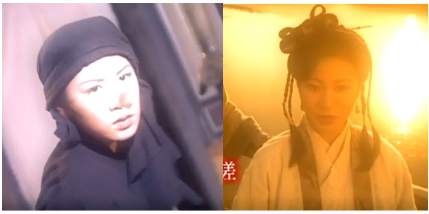
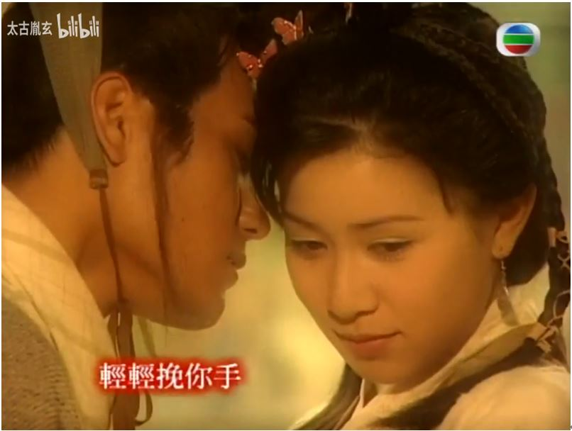
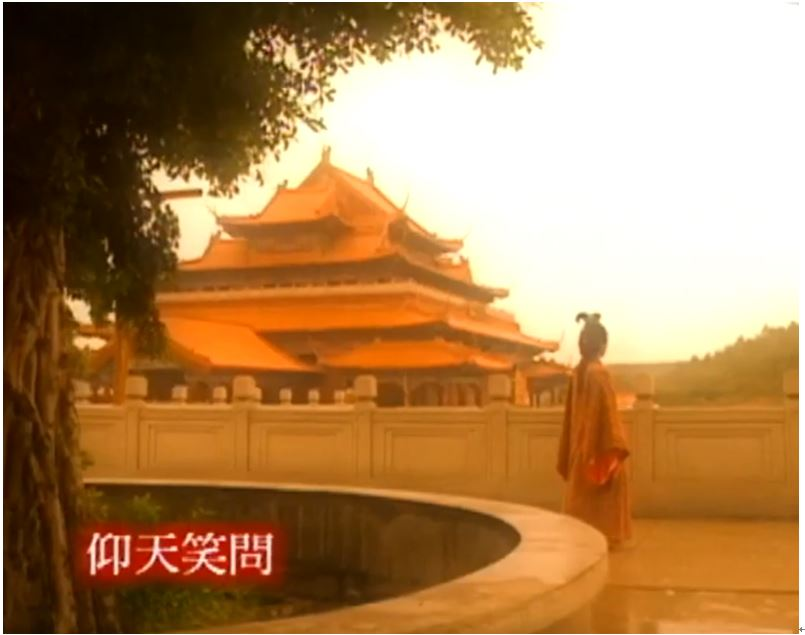
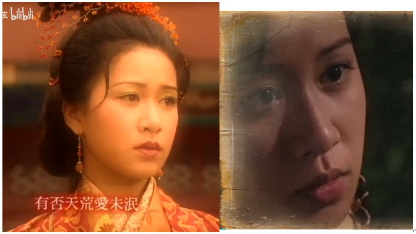

2025年：以歌词为主，没说明都是ai所作

最新 2.27：

高胜美 - 千年等一回

作词: 陈自为
作曲: 左宏元

千年等一回等一回啊 
千年等一回我无悔啊 
是谁在耳边说爱我永不变 
只为这一句啊哈断肠也无怨哎 
雨心碎风流泪梦缠绵情悠远那 
(cha~cha~na~) 
(cha~cha~na~) 
(cha~cha~na~) 
(cha~cha~na~) 

西湖的水我的泪 
我情愿和你化作一团火焰 
啊……啊……啊…… 

千年等一回等一回啊 
千年等一回我无悔啊 
雨心碎风流泪梦缠绵情悠远那 

千年等一回等一回啊 
千年等一回我无悔啊 
千年等一回等一回啊 

千年等一回

-------
邓丽君 - 我只在乎你

作词: 慎芝
作曲: 三木刚

如果没有遇见你 
我将会是在哪里 
日子过得怎么样 
人生是否要珍惜 
也许认识某一人 
过着平凡的日子 
不知道会不会 
也有爱情甜如蜜 

任时光匆匆流去 
我只在乎你 
心甘情愿感染你的气息 
人生几何能够得到知己 
失去生命的力量也不可惜 
所以我求求你 
别让我离开你 
除了你 我不能感到 
一丝丝情意 

如果有那么一天 
你说即将要离去 
我会迷失我自己 
走入无边人海里 
不要什么诺言 
只要天天在一起 
我不能只依靠 
片片回忆活下去 

-------
周美茵-谁在意

作词：小美  作曲：冯镜辉

窗纱之后 静望帘外雨   
静望帘外雨 谁在意   
怀念着前事 怀念着前事 太痴   
从前事看似琐碎   
却叫我心醉 未能睡去   
绝情憾事凝聚   
热情梦话凝聚 共对   

某个某个某个冬天 深夜里   
爱已破碎破碎   
风中翻飞 小雨像流泪   
为谁话别赔罪 为谁绝望垂泪 也许   

天空洒泪 滴落长路里   
滴落长路里 无路退   
如遇着情尽 人倦极无梦 记取   
离情话叫我心碎   
我怕再想那 绝情字句   
奈何风中雨水 令人通通记起 记取   
从前事看似琐碎   
却叫我心醉 未能睡去   
绝情憾事凝聚 热情梦话凝聚 共对   

某个某个某个冬天 深夜里   
爱已破碎破碎   
风中翻飞   
小雨像流泪   
为谁话别赔罪   
为谁绝望垂泪 也许   

-------
細川たかし - 北酒场

作词: なかにし礼
作曲: 中村泰士

北方的酒吧街上  
长发的女人很适合  
稍微随和的比较好  
愿被追求的人最好  

今晚的恋曲在香烟的前端  
是替我点火的人  
缠绕的手指 犹如命运一般  
以心相许  
北方的酒吧街上  
有令女人陶醉的恋情  

北方的酒吧街上  
容易落泪的男人很适合  
稍微多情的比较好  
能够眉目传情的最好  

寻梦的人 喝干了酒  
也喝尽了记忆  
因为有过几次破碎的恋情  
所以越能对人温柔  
北方的酒吧街上  
有令男人哭泣的歌曲  

------
周影-还仍然想我吗

作词: 早陪
作曲: 纪宏仁

浮云柔柔在转 心中的感觉飘远  
你送的书中一片落叶 写满逝去最爱心愿 
前尘缓缓在转 亲匿的感觉隔一线 
偶尔掀开心里幕 又重遇暖暖旧片段 
还仍然想我吗 
还仍然想说爱我吧 
纵教这生不可见面 
任时日转愿爱似昨天 
还仍然想我吗 
还仍然想说爱我吧 
对我会否天天挂念 
是晴是雨仍爱似从前 

柔柔黄叶在转 风中再飘过千片 
似诉出心中千句梦话 拥抱着那串串思念 
朦胧明月在远 漆黑里仿似你的脸 
照进心窗的角落 又重拾渺渺旧片段 

今天可想我吗 
终此一生都想我吧 
哪怕这生不可见面 
任时日转愿爱似昨天 
今天可想我吗 
日出日落都想我吧 
不管这生可否见面 
心中也感到丝丝挂念 

-------
满江红·和郭沫若同志  毛泽东

小小寰球，有几个苍蝇碰壁。 
嗡嗡叫，几声凄厉，几声抽泣。 
蚂蚁缘槐夸大国，蚍蜉撼树谈何易。 
正西风落叶下长安，飞鸣镝。 

多少事，从来急； 
天地转，光阴迫。 
一万年太久，只争朝夕。 
四海翻腾云水怒，五洲震荡风雷激。 
要扫除一切害人虫，全无敌。 

-------
黄鹤翔 - 九妹

词曲：王云好

你好像春天的一幅画 
画中是遍山的红桃花 
蓝蓝的天和那青青篱笆 
花瓣飘落你身下 

画中呀是不是你的家 
朵朵白云染红霞 
哥哥心中的九妹你知道吗 
是我心中那一幅画 

九妹九妹漂亮的妹妹 
（漂亮的妹妹） 
九妹九妹透红的花蕾 
（透红的花蕾） 
九妹九妹可爱的妹妹 
（可爱的妹妹） 
九妹九妹心中的九妹/我的九妹 

九妹 九妹 
九妹妹九妹 

九妹 

春天的桃花依旧放 
你却已不在种桃花 
悠悠的流水和空空牵挂 
伴着那淡淡云霞 
不知你远去在何方 
思念是我对你的表达 
红红的脸颊带着点点的笑 
在梦里萦萦缠绕

九妹九妹我的 九妹

-------
赵学而-我恨我是女人

作词: 张美贤
作曲: 谭展辉

开心从来未想我 
孤单了才愿找我 
如旧抱着我 如旧热切地亲我 
像是情人 偏不爱我 
开心完全是因你 
伤心了还是因你 
从没有伴侣 
从来没法认识你 
心想放弃 却已没处飞 
仍继续 继续再亲 动人 动情 动心 
你伤我都要这么震撼 
我愿你是女人 恋爱不发生 
不必求你再热烈抱紧 
继续 继续再等 没停 没原 没因 
等每一次你的过分 
我恨我是女人 热情难自禁 
偷泣仍要这样共你亲吻 

-------
茅屋为秋风所破歌 杜甫

八月秋高风怒号，卷我屋上三重茅。 
茅飞渡江洒江郊，高者挂罥长林梢，下者飘转沉塘坳。 
南村群童欺我老无力，忍能对面为盗贼。 
公然抱茅入竹去，唇焦口燥呼不得，归来倚杖自叹息。 
俄顷风定云墨色，秋天漠漠向昏黑。 
布衾多年冷似铁，娇儿恶卧踏里裂。 
床头屋漏无干处，雨脚如麻未断绝。 
自经丧乱少睡眠，长夜沾湿何由彻？ 
安得广厦千万间，大庇天下寒士俱欢颜！风雨不动安如山。 
呜呼！何时眼前突兀见此屋，吾庐独破受冻死亦足！ 

-------
崔子格 - 卜卦

作词:陈立志 作曲:조영수

风吹沙 蝶恋花 
千古佳话 
似水中月 
情迷着镜中花 
竹篱笆 木琵琶 
拱桥月下 
谁在弹唱 
思念远方牵挂 
那年仲夏 
你背上行囊离开家 
古道旁 我欲语泪先下 

庙里求签 
我哭诉青梅等竹马 
求 菩萨保佑我俩 

不停的猜 猜 猜 
又卜了一卦 
吉凶祸福 还是担惊受怕 
对你的爱 爱 爱 
望断了天涯 
造化弄人 缘分阴错阳差 

田里庄稼 
收获了一茬又一茬 
而 我们何时发芽 

猜 猜 猜 又卜了一卦 
是上上签 可还是放不下 
对你的爱 爱 
挨过几个冬夏 
日夜思念 祈求别再变卦 

--------
『宋祖英-我的祖国』『电影《上甘岭》插曲』 
https://www.bilibili.com/video/BV1zs411e7Sq

郭兰英 - 我的祖国

作词:乔羽 作曲:刘炽

一条大河波浪宽 
风吹稻花香两岸 
我家就在岸上住 
听惯了艄公的号子 
看惯了船上的白帆 

这是美丽的祖国 
是我生长的地方 
在这片辽阔的土地上 
到处都有明媚的风光 

姑娘好像花儿一样 
小伙儿心胸多宽广 
为了开辟新天地 
唤醒了沉睡的高山 
让那河流改变了模样 

这是英雄的祖国 
是我生长的地方 
在这片古老的土地上 
到处都有青春的力量 

好山好水好地方 
条条大路都宽畅 
朋友来了有好酒 
若是那豺狼来了 
迎接它的有猎枪 

这是强大的祖国 
是我生长的地方 
在这片温暖的土地上 
到处都有和平的阳光 

--------
光良 - 童话

词曲：光良

忘了有多久 再没听到你 
对我说你 最爱的故事 
我想了很久 我开始慌了 
是不是我又 做错了什么 

**你哭着对我说 童话里都是骗人的** 
**我不可能是你的王子** 
**也许你不会懂 从你说爱我以后** 
**我的天空 星星都亮了** 

**我愿/要/会变成童话里 你爱的那个天使** 
**张开双手 变成翅膀守护你** 
**你要相信 相信我们会像童话故事里** 
**幸福和快乐是结局** 

一起写 我们的结局

---------
陈淑桦 - 梦醒时分

词曲：李宗盛

你说你爱了不该爱的人 
你的心中满是伤痕 
你说你犯了不该犯的错 
心中满是悔恨 
你说你尝尽了生活的苦 
找不到可以相信的人 
你说你感到万分沮丧 
甚至开始怀疑人生 

早知道伤心总是难免的 
你又何苦一往情深 
因为爱情总是难舍难分 
何必在意那一点点温存 

要知道伤心总是难免的 
在每一个梦醒时分 
有些事情你现在不必问 
有些人你永远不必等 

-------
胡杨林 - 香水有毒

作词: 陈超
作曲: 陈超

我曾经爱过这样一个男人 
他说我是世上最美的女人 
我为他保留着那一份天真 
关上爱别人的门 

也是这个被我深爱的男人 
把我变成世上最笨的女人 
他说的每句话我都会当真 
他说最爱我的纯 

我的要求并不高 
待我像从前一样好 
可是有一天你说了同样的话 
把别人拥入怀抱 

你身上有她的香水味 
是我鼻子犯的罪 
不该嗅到她的美 
擦掉一切陪你睡 

你身上有她的香水味 
是你赐给的自卑 
你要的爱太完美 
我永远都学不会 

-------
忘情水 伴奏 剪辑版 
https://5sing.kugou.com/bz/876826.html

忘情水 伴奏 有人声 
https://5sing.kugou.com/bz/3176369.html

忘情水 伴奏 无声版 
https://5sing.kugou.com/bz/396487.html

刘德华 - 忘情水

作词: 李安修
作曲: 陈耀川

曾经年少爱追梦 
一心只想往前飞 
行遍千山和万水 
一路走来不能回 
蓦然回首情已远 
身不由己在天边 
才明白爱恨情仇 
最伤最痛是后悔 
如果你不曾心碎 
你不会懂得我伤悲 
当我眼中有泪  
别问我是为谁 
就让我忘了这一切 

啊 给我一杯忘情水 
换我一夜不流泪 
所有真心真意 
任它雨打风吹 
付出的爱收不回 
给我一杯忘情水 
换我一生不伤悲 
就算我会喝醉 
就算我会心碎 
不会看见我流泪

-----
朱洁仪 - 对手戏

---------
赵传 - 雪花女神龙

词曲：赵传

孤灯提单刀 
漂泊我自傲 
碎心江湖行 
问天何时尽 
此生如能照我意 
真想永远抱着你 
轻轻说出千万次的爱你 
无奈无奈无奈 
江湖要我背对着你 
啊狂风呀暴雨 
狂风呀暴雨 
别得意 
有什么了不起 
我就此发誓 
挥刀杀到天变晴 

-------
刘德华 - 天意

作词: 李安修
作曲: 陈耀川

谁在乎我的心里有多苦 
谁在意我的明天去何处 
这条路究竟多少崎岖多少坎坷途 
我和你早已没有回头路 
我的爱藏不住 
任凭世界无情的摆布 
我不怕痛不怕输 
只怕是再多努力也无助 

如果说一切都是天意一切都是命运 
终究已注定 
是否能再多爱一天能再多看一眼 
伤会少一点 
如果说一切都是天意一切都是命运 
谁也逃不离 
无情无爱此生又何必 

--------
成龙 - 醉拳(粤)

作词: 林夕
作曲: 李偲菘/李伟菘

人生颠颠倒倒 境界更高 
拳风风风骚骚 领尽风骚 
尽情大醉 醉是最好 
借酒挥洒我自豪 
行侠济世 永不靠刀 

人生丑丑好好 不见更好 
是非颠颠倒倒有谁知道 
是邪是正有坏有好 
醉中方知有或无 
无谓清醒得太早 

莫笑我 醉生一醉何妨 
狂也放 把千秋喝光 
莫笑我 醉中真我未忘 
让我笑着醉闯万重浪 

人生三分清醒 海阔天高 
留低七分颠倒有何不好 
又摇又跌 却未跌倒 
醉酒方知我路途 
行侠济世 永不靠刀 

来我地饮胜拉 扎稳马步松一松  
酒过三杯 成竹在胸 拳打脚踢  
南北西东 打完老虎 我变做成龙 
面红耳热系我台风 四大皆空系真英雄啊 

无谓计较谁是最高

---------
陈倩倩 - 巧解姻缘天作合

作词: 张子恩/童边
作曲: 雷蕾

世事艰辛多磨难 
独自少欢乐 
说是会心一笑更难得 
千万别错过 
当轻松时且轻松 
不要苦心去琢磨 
好来好去跟着总有好结果 
开怀饮 放声歌 
人在一起心里热  
你也说 我也说  
戏里戏外都是乐  
日子也好过  
好日子里出了错  
错也不算错  
咱们巧解姻缘说善恶  
一波三折  
来到家中不是客  
欢欢喜喜天作合  
有情有意一定会有好结果  

--------
罗文 - 小李飞刀

作曲: 顾嘉辉
作词: 卢国沾

难得一身好本领 
情关始终闯不过 
闯不过柔情蜜意 
乱挥刀剑无结果 
流水滔滔斩不断 
情丝百结冲不破 
刀锋冷热情未冷 
心底更是难过 

无情刀永不知错 
无缘份只叹奈何 
面对死不会惊怕 
离别心凄楚 
人生几许失意 
何必偏偏选中我 
挥刀剑断盟约 
相识注定成大错 

--------
孙楠 - 无愧于心

作词: 向雪怀
作曲: 王刚

头上一片青天 
心中一个信念 
不是年少无知 
只是不惧挑战 
凡事求个明白 
算是本性难改 
可以还你公道 
我又何乐不为 
一些漫不经心的说话 
将我疑惑解开 
一种莫名其妙的冲动 
叫我继续追寻 
你的一举一动 
我却备加留心 
只要真相大白 
一切 一切无愧于心 

我在等你出现 
体验爱恨缠绵 
本来词锋锐利 
却变有口难言 
不是一时冲动 
原来情深暗种 
只想携你一起 
走过将来的路 

-----------
陈秋霞 - 罂粟花

作词: 郑国江
作曲: 陈秋霞

谁将罂粟花种于路旁 
任令它生长 
纯良的他不知花险恶 
沉溺在它的幽香 
谁将罂粟花种于路旁 
任令它飘香 
纯良的他不知花险恶 
犹在慢慢欣赏 
沾上它大好壮志会颓丧 
沾上它健康快慰也尽丧 
将花烧光不许生世上 
罂粟花偏偏艳丽象斜阳 

---------
琵琶行 白居易

浔阳江头夜送客，枫叶荻花秋瑟瑟。 
主人下马客在船，举酒欲饮无管弦。 
醉不成欢惨将别，别时茫茫江浸月。 

忽闻水上琵琶声，主人忘归客不发。 
寻声暗问弹者谁，琵琶声停欲语迟。 
移船相近邀相见，添酒回灯重开宴。 
千呼万唤始出来，犹抱琵琶半遮面。 
转轴拨弦三两声，未成曲调先有情。 
弦弦掩抑声声思，似诉平生不得志。 
低眉信手续续弹，说尽心中无限事。 
轻拢慢捻抹复挑，初为《霓裳》后《六幺》。(六幺 一作：绿腰) 
大弦嘈嘈如急雨，小弦切切如私语。 
嘈嘈切切错杂弹，大珠小珠落玉盘。 
间关莺语花底滑，幽咽泉流冰下难。 
冰泉冷涩弦凝绝，凝绝不通声暂歇。(暂歇 一作：渐歇) 
别有幽愁暗恨生，此时无声胜有声。 
银瓶乍破水浆迸，铁骑突出刀枪鸣。 
曲终收拨当心画，四弦一声如裂帛。 
东船西舫悄无言，唯见江心秋月白。 

沉吟放拨插弦中，整顿衣裳起敛容。 
自言本是京城女，家在虾蟆陵下住。 
十三学得琵琶成，名属教坊第一部。 
曲罢曾教善才服，妆成每被秋娘妒。(服 一作：伏) 
五陵年少争缠头，一曲红绡不知数。 
钿头银篦击节碎，血色罗裙翻酒污。(银篦 一作：云篦) 
今年欢笑复明年，秋月春风等闲度。 
弟走从军阿姨死，暮去朝来颜色故。 
门前冷落鞍马稀，老大嫁作商人妇。 
商人重利轻别离，前月浮梁买茶去。 
去来江口守空船，绕船月明江水寒。 
夜深忽梦少年事，梦啼妆泪红阑干。 

我闻琵琶已叹息，又闻此语重唧唧。 
同是天涯沦落人，相逢何必曾相识！ 
我从去年辞帝京，谪居卧病浔阳城。 
浔阳地僻无音乐，终岁不闻丝竹声。 
住近湓江地低湿，黄芦苦竹绕宅生。 
其间旦暮闻何物？杜鹃啼血猿哀鸣。 
春江花朝秋月夜，往往取酒还独倾。 
岂无山歌与村笛，呕哑嘲哳难为听。 
今夜闻君琵琶语，如听仙乐耳暂明。 
莫辞更坐弹一曲，为君翻作《琵琶行》。 

感我此言良久立，却坐促弦弦转急。 
凄凄不似向前声，满座重闻皆掩泣。 
座中泣下谁最多？江州司马青衫湿。 

--------
沈雁 - 一串心

作词: 孙仪
作曲: 刘家昌

天上星星数不清 
个个都是我的梦 
纵然有几片云飘过 
遮不住闪亮亮的情 
心串串 心蹦蹦 脸儿红 
都是为了你 
是你到我的梦里来 
还是要我走出梦中 
(啦啦啦...啦啦啦...)

池里浮萍数不清 
片片都是我的梦 
纵然有几阵风吹过 
拂不去浓又密的情 
心串串 心蹦蹦 脸儿红 
都是为了你 
盼你的心和我连成一串 
一生一世不分离 

--------
陈慧丽-梦幻列车

作词：潘伟源
作曲：安格斯

七彩的缤纷的一个夜 激光通处射  
七色的光彩仿似历 梦幻的火车  
车厢中欢欣不用借 困恼向后退  
飞奔于星空的梦里  
光辉将漆黑驱逐去  
将悲伤通通抛掉的火车  

天边的星光好快谢 珍惜这晚夜  
今宵开心的请你坐 梦幻的火车  
车厢中欢欣不用借 困恼向后退  
飞奔于星空的梦里  
光辉将漆黑驱逐去  
将悲伤通通抛掉的火车  

**愉快的飞奔于星空中这身躯发觉到已没重**  
**看这里看那里满浮万个梦**  
**为你数空中的小星星点点心声我盼你继续听**  
告诉你告诉你旅程亦已定  
预计的总站爱情  

---------
Beyond - 海阔天空

词曲：黄家驹

今天我 寒夜里看雪飘过 
怀着冷却了的心窝漂远方 
风雨里追赶 雾里分不清影踪 
天空海阔你与我 
可会变（谁没在变） 

多少次 迎着冷眼与嘲笑 
从没有放弃过心中的理想 
一刹那恍惚 若有所失的感觉 
不知不觉已变淡 
心里爱（谁明白我） 

原谅我这一生不羁放纵爱自由 
也会怕有一天会跌倒 
背弃了理想 谁人都可以 
哪会怕有一天只你共我 

仍然自由自我  
永远高唱我歌 
走遍千里 

--------
许茹芸 - 独角戏

作词: 许常德
作曲: 季忠平

是谁导演这场戏 
在这孤单角色里 
对白总是自言自语 
对手都是回忆  
看不出什么结局 

自始至终全是你 
让我投入太彻底 
故事如果注定悲剧 
何苦给我美丽  
演出相聚和别离 

没有星星的夜里 
我用泪光吸引你 
既然爱你不能言语 
只能微笑哭泣  
让我从此忘了你 

没有星星的夜里 
我把往事留给你 
如果一切只是演戏 
要你好好看戏 
心碎只是我自己 

----------
1：1重剪《太极宗师》片尾曲 情缘不了 完整版 
https://www.bilibili.com/video/BV1Fq4y1o7VH

朱桦 - 情缘不了

作词：童心
作曲：卞留念

最是那回眸一笑 
惹得百花报春早 
晓风暗月歌声飘 
红颜正为君来傲 
最是那情痴年少 
寻得三江把月邀 
春露秋霜时辰好 
芳心正为君来摇 
怨你怨你真怨你  
笑把恩怨情仇一起了 
念你念你想念你  
同是天涯相识路不遥 
恨你恨你就恨你  
错把前程旧事当今朝 
爱你爱你我爱你  
山河易碎情缘不了 

---------
伍佰 & China Blue - 再度重相逢

词曲：伍佰

你说人生如梦 
我说人生如秀 
那有什么不同 
不都一样朦胧 
朦胧中有你 
有你跟我就已经足够 
你就在我的世界 
升起了彩虹 

**简单爱你心所爱** 
**世界也变的大了起来** 
**所有花都为你开** 
**所有景物也为了你安排** 

我们是如此的不同 
肯定前世就已经深爱过 
讲好了这一辈子 
再度重相逢 

--------
陈百强 - 偏偏喜欢你

作词: 郑国江 
作曲: 陈百强 
编曲: 周启生 

愁绪挥不去 苦闷散不去 
为何我心一片空虚 
感情已失去 一切都失去 
满腔恨愁不可消除 
为何你的嘴里总是那一句 
为何我的心不会死 
明白到爱失去 一切都不对 
我又为何偏偏喜欢你 
爱已是负累 相爱似受罪 
心底如今满苦泪 
旧日情如醉 此际怕再追 
偏偏痴心想见你 
为何我心分秒想着过去 
为何你一点都不记起 
情义已失去 恩爱都失去 
我却为何偏偏喜欢你 

-------
行路难 李白

金樽清酒斗十千，玉盘珍羞直万钱。 
停杯投箸不能食，拔剑四顾心茫然。 
欲渡黄河冰塞川，将登太行雪满山。 
闲来垂钓碧溪上，忽复乘舟梦日边。 
行路难！行路难！多歧路，今安在？ 
长风破浪会有时，直挂云帆济沧海。 

-------
S.H.E - 波斯猫

作词: 武雄
作曲: 王治平

眼眯成一条线  
轻轻踮着脚尖  
屋顶上的瓦片 是他的琴键  
一步步 一点点  
游走在爱情边缘  
想出现就出现  
想不见就不见 
想睡就睡一天 不理任何人 
不回电 不上线 
不会和任何人争辩 

爱上他危险危险 
不爱他思念思念 
他总是若即若离 若隐若现 
有时候沉默冰冷 
有时候温柔腼腆 
任谁都不会是他爱情的主人 
靠近时缠绵缠绵 
离开时敷衍敷衍 
他总是忽热忽冷 忽近忽远 
他可以一成不变 
也可以瞬息万变 
但是他不会为你做任何改变 

**波斯猫 眯着他的双眼** 
**波斯猫 踮着他的脚尖** 
**波斯猫 守着他的爱恋** 
**一转眼却又看不见** 
（一转眼又看不见）	

什么他都看见 
什么都没看见 
无谓的耸耸肩 是他的消遣 
左一遍 右一遍 
等待着他的有情人 

**啦啦啦 啦啦啦啦啦啦** 
**啦啦啦 啦啦啦啦啦啦** 
**啦啦啦 啦啦啦啦啦啦** 
**啦啦啦 啦啦 啦啦啦** 

一转眼 看不见 
啦啦啦 啦啦 啦啦啦

----------
孙美娜 - 失落的心

作词：张名河 作曲：刘念劬、马有道

山有恨 水有恨  
痛那一片真情  
天含冤 地含冤  
哭那一个梦魂  
失落了那颗心  
那颗赤诚的心  
再也无法去找寻  
何处去 何处去找寻  
何处去找寻

-------
张国荣 - 始终会行运

作词: 黄霑
作曲: 顾嘉辉

在情在理 他心我心  
不必争论也懒问  
为人为我 不必区分  
一切事干 开心要紧  
顺缘顺意 嘻哈半生  
欢欣自会接近  
自然入世 自己有自信  
终此生 始终有鸿运  

像风也像片云 
乐得笑面对人 
任上天引导我行 
随缘觅梦欢笑真 

合情合理 开心称心  
一心想做快活人  
未愁未怨 实在有自信  
终此生 始终都会行运  

---------
Love Is Only Just A Dream 
https://v.youku.com/v_show/id_XMjgxODUzNTg4.html

Life's not a dream  
When emptiness has spilled the scene 
When you walked away from me 
And told me love is only just a dream 
I have tried to say goodbye 
But words have gotten in the way 
Couldn't hold my feelings 
I just broke down and cry 
Breaking up is a not a game 
Oh my baby can't you see in me  
I still love you baby  
I just can't let you go  
Couldn't live without you baby  
I'll rather run my life this way  
When you turn and walked away  
I knew that love is only just a dream  

--------
路家敏 - 小时候

作词: 郑国江
作曲: 顾家辉

小小的宇宙 
欢欣的宇宙 
蹦蹦跳哈哈笑 
是我小时候 

小小的宇宙 
天真的宇宙 
真的我真的你 
唔系小木偶 
爱动脑筋活泼天真 
凡事好发问 
踢波跑步打千秋 
不知天高地厚 
小小的宇宙 
缤纷的宇宙 
像皮球天天转 
奇妙事不断有 

----------
李克勤-明明深爱着你 
https://www.bilibili.com/video/BV1xs4y187yG

作词：李克勤 作曲：江港生

哭泣的夜 短叹长嗟 
如像困於荒野 一切也凋谢 
当天的夜 分秒难舍 
情像缺堤倾泻 
为何别了 定要装出好过些  
明明是爱得深 明明是伤得很  
仍是要假装 要扮作没缘分  
只可以强忍 只当没发生  
埋藏热爱 逃避眼神的接近  
太狠心 太多苦苦牺牲  
  
我们会没仇恨  
  
却捉不到你手  
难明是我还是你 没有信心  
  
  

仰天笑问 从来没怨别人  
这世间 不太多像我这般情深

--------
赵方婧-尽头 

作词: 朱鸽

觥筹交错 时光如梭  
迷失自我 享受折磨  
这是你要的 物质生活  
一身污浊 自得其乐  
谁的命运 谁又能把握  
这是种孤独 没有结果  

**精神虚伪的寄托 不择手段的** 
**迷离恍惚的假想 推翻不假思索** 
如果换做是我 又是何得的 
变作 无趣的枷锁 
**肉体诚实的反驳 不合时宜的** 
**消散太快的热度 假装不食烟火** 
不由分说的我 换个身份变作 
有趣的恶魔 

---------
陈慧娴 - 傻女

作词: 林振强  
作曲: M.T. Diego/M.L. Diego  
编曲: 卢东尼  

这夜我又再独对夜半无人的空气 
穿起你的毛衣重演某天的好戏 
让毛做长袖不经意地 
抱着我静看天地 
让唇在无味的衣领上 
笑说最爱你的气味 

我恨我共你是套 现已完场的好戏 
只有请你的毛衣 从此每天饰演你 
夜来便来伴我坐 默然但仍默许我 
将肌肤紧贴你 将身躯交予你 
准许我这夜做旧角色 
准我快乐地重饰演某段美丽故事主人 
饰演你旧年共寻梦的恋人 
再去做没流着情泪的伊人 
假装再有从前演过的戏份 

重饰演某段美丽故事主人 
饰演你旧年共寻梦的恋人 
你纵是未明白仍夜深一人 
穿起你那无言毛衣当跟你贴近 

--------
许冠杰 - 铁塔凌云

作词: 许冠杰
作曲: 许冠杰

铁塔凌云 望不见欢欣人面  
富士耸峙 听不见游人欢笑  
自由神像 在远方迷雾  
山长水远 未入其怀抱  

檀岛滩岸 点点粼光  
岂能及渔灯在彼邦  
俯首低问  
何时何方何模样  
回音轻传  
此时此处此模样  
何须多见复多求  
且唱一曲归途上  
此时此处此模样  
此模样  

---------
陈秋霞 - 点解手牵手

词曲：黄霑

点解手牵手  
令我心中无恨愁 
难道大家手相牵 
就会牵开心里忧 
点解手牵手 
令我心中乐悠悠 
难道你个心有暖流 
在你手中轻轻渗透 

今天原是我与你 
开始手牵手 
但愿日后也与你 
共对相欢开笑口 
双双手牵手 
令我心中再无愁 
唯望你一双手 
为我解开心里扣 

手牵手共渡患难 
替你分忧 
但愿日后我与你 
共对今生欢笑不休 
双双手牵手 
共你一生永并头 
从此你一双手 
为我解开心里扣 

----------
周杰伦 - 不能说的秘密

作词: 方文山
作曲: 周杰伦

冷咖啡离开了杯垫  
我忍住的情绪在很后面  
拼命想挽回的从前  
在我脸上依旧清晰可见  
最美的不是下雨天  
是曾与你躲过雨的屋檐  
回忆的画面在荡着秋千  
梦开始不甜 

**你说把爱渐渐放下会走更远** 
**又何必去改变已错过的时间** 
**你用你的指尖阻止我说再见** 
**想象你在身边在完全失去之前** 
**你说把爱渐渐放下会走更远** 
**或许命运的签只让我们遇见** 
**只让我们相恋这一季的秋天** 
**飘落后才发现这幸福的碎片** 
要我怎么捡 

----------
徐世珍 - 爱到不能忘

词：李姚
曲：蔡议樟

没有你在身旁 
日子变得漫长 
以为我能遗忘 
是孤单也无妨 
假装失去你我够坚强 
却掩不住内心的慌张 
才明白这倔强 
不过是对自己说谎 

**总是爱到不能忘** 
**往事还在心上** 
**想你想到没有主张** 
**我的心跌跌撞撞** 
**泪游游荡荡** 
**未来不知归向何方** 

**总是爱到不能忘** 
**往事还在心上** 
**多情的人注定受伤** 
**从你决定离开后** 
**世界变得一片** 
**迷惘** 

---------
袁文杰 - 男儿无泪

作词：杨绍鸿 萧笙
作曲: 徐嘉良

问大地苍生爱恨字字肠断  
寂寞内心空虚烦乱  
在风中打转是雪花不断  
偏偏这结局未如愿  

极目望天边隔断今昔眷恋  
剩下独追忆已疲倦  
是心中痴怨是不舍不倦  
心底的说话早变酸  
长夜里没法睡  
千缕千丝挂牵  
情共爱像有罪早已累  
痴恋仍然未许男儿无泪  
流逝了不可再追  
长夜里没法睡  
千缕千丝挂牵  
情共爱像有罪早已累  
可有移情别恋说再会   
一切让爱恨化水  

--------
沖田浩之 - 燃えてヒーロー

作词: 吉岡治
作曲: 内木弘

快看刚刚过去的那个人 是球队的王牌选手 
都说他的球技 引得全场轰动 
蝴蝶飞舞的桑巴舞 魔幻神奇的桑巴舞 
听到他的传闻 所有人都一起狂奔 
所以我们这样到底又算什么 
为了一个球 拼命地追逐 
dash dash dash （全力冲刺） 
kick and dash （带球急奔） 
总有一天会完成 闪电射门 
那一刻 我将成为超级英雄 
dash dash dash （全力冲刺） 
kick and dash （带球急奔） 
燃烧吧青春 尽情去狂奔 

令人不禁为之着迷啊 球队王牌的微笑 
连猫咪嘴里的 秋刀鱼都掉了下来 
充满魅力的桑巴舞 魔幻神奇的桑巴舞 
为他沉迷的麻雀就有3只之多 
所以我们这样到底又算什么 
被人说无知笨拙 也无所谓 
dash dash dash （全力冲刺） 
kick and dash （带球急奔） 
终于大放异彩 完成了头球射门 
那一刻 我将成为超级英雄 
dash dash dash （全力冲刺） 
kick and dash （带球急奔） 
燃烧吧青春 尽情去狂奔 

-------
WANDS - 直到世界的尽头

作词: 上杉升
作曲: 织田哲郎

孤身一人 彷徨在大都市 
像被丢弃的 空啤酒罐一样 
如果非要探究 彼此的一切 
才叫爱的话 
还不如永久长眠 

**直到世界的尽头** 
**也不愿与你分离** 
曾在千万个夜晚 许下心愿 
**一去不回的时光** 
**为什么却如此耀眼** 
让已憔悴的心 再次破碎... 
刹那的思念... 
在这个悲剧的夜 

而人们总是 追求表面答案 
结果错失 无可取代的宝物 
在这充斥着 欲望的街头 
就连夜空繁星 也难以照亮我们 
**在世界结束之前** 
**谁愿给我讲一个** 
与繁花盛开 最贴切的不幸 
**谁都满怀着期望** 
**却又不相信永远** 
...可是也一定 梦想着明天 
短暂的时光 在这悲剧的夜晚 

-------
吴彤 - 好春光

作词: 王远
作曲: 钟志荣

好春光 不如梦一场 
梦里青草香 
你把梦想带身上 
蓝天白云 青山绿水 
还有轻风吹 斜阳 

一千年 年年花开放 天天好时光 
一次人间也匆忙 
小风大浪 地狱天堂 
还有你的灿烂 脸庞 

开心一刻 也是地久天长 
痛痛快快 向前走绝不回望 
这花开花落 一千年一切形状 
我还是自己模样 

不是神仙自己 编造的翅膀 
晃晃悠悠 飞起来 飞过四大洋 
好春光 

------
梨冻紧/Wiz_H张子豪 - 罗生门（Follow）

词曲:梨冻紧/Wiz_H张子豪

我没转身 

**一直走一直梦** 
**一直疯一直没停留** 
**那些美好的** 
**越靠近越沉溺** 
**越来越不想放手** 
Wherever you go 
Wherever you go 

-------
西游记动画片尾 - 白龙马

作词: 张黎
作曲: 肖白

白龙马 蹄朝西 
驮着唐三藏跟着仨徒弟 
西天取经上大路 
一走就是几万里 

什么妖魔鬼怪 
什么美女画皮 
什么刀山火海 
什么陷阱诡计 

都挡不住火眼金睛的如意棒 
护送师徒朝西去 
白龙马 脖铃儿急 
颠簸唐玄奘小跑仨兄弟 
西天取经不容易 
容易干不成大业绩 

什么魔法狠毒 
自有招数神奇 
八十一难挡(拦)路 
七十二变制敌 

师徒四个斩妖斗魔同心合力 
邪恶打不过正义

-------
刘若英-成全

作词 : 施立/陈没 
作曲 : 陈小霞 

看着你和她走到我面前 
微笑地对我说声好久不见 
如果当初没有我的成全 
是不是今天还在原地盘旋 
不为了勉强可笑的尊严 
所有的悲伤丢在分手那天 
未必永远才算爱的完全 
一个人的成全 
好过三个人的纠结 
**我对你付出的青春这么多年** 
**换来了一句** 
**谢谢你的成全** 
**成全了你的潇洒与冒险** 
**成全了我的碧海蓝天** 
**她许你的海誓山盟蜜语甜言** 
**我只有一句** 
**不后悔的成全** 
**成全了你的今天与明天** 
**成全了我的下个夏天** 

-------
莫籽独唱 - 盗将行 
https://www.bilibili.com/video/BV1vt411s7Qf

作词 : 姬霄
作曲 : 花粥

劫过九重城关 
我座下马正酣 
看那轻飘飘的衣摆 
趁擦肩把裙掀 
踏遍三江六岸 
借刀光做船帆 
任露水浸透了短衫 
大盗睥睨四野 

枕风宿雪多年 
我与虎谋早餐 
拎着钓叟的鱼弦 
问卧龙几两钱 
蜀中大雨连绵 
关外横尸遍野 
你的笑像一条恶犬 
撞乱了我心弦 

谈花饮月赋闲 
这春宵艳阳天 
待到梦醒时分睁眼 
铁甲寒意凛冽 
夙愿只隔一箭 
故乡近似天边 
不知何人浅唱弄弦 
我彷徨不可前 

烽烟万里如衔 
掷群雄下酒宴 
谢绝策勋十二转 
想为你窃玉簪 

入巷间吃汤面 
笑看窗边飞雪 
取腰间明珠弹山雀 
立枇杷于庭前 

---------
叶斯淳 - 我曾遇到一束光

作词: 宋普照
作曲: 陈抒妮
编曲: 侯江浩

**我曾遇到一束光在前方** 
**我乘着风的翅膀去飞翔** 
生命要闯过多少层层迷障 
才能抓住幸福的方向 
我们要扛过 多少孤单晚上 
才能将阑珊也点亮 

万物在朝夕之间疯狂生长 
我们努力靠近对方 
心跳在感应着 同样频率的荡漾 
期待在某一秒碰撞 
**时间的手一点一点推向了心房** 
**轮廓出你的模样** 
**我敞开梦一点一点慢慢对你讲** 
**幸福拥有了形状** 

我曾遇到一束光在前方 
我乘着风的翅膀去飞翔 
奔向你无畏曾经那些受过的伤 
手心握着云朵 月亮 
**我曾遇到一束光你的光** 
**我看到我掌心中的信仰** 
**再一次因为你无邪的笑而绽放** 
谢谢有你在身旁 

-------
杨采妮-笑着流泪

作词：何启弘 作曲：Alex San
 
忘了为什么想痛哭一场  
你给的理由听来都牵强  
说服不了我只好继续假装  
眼底没有泪光  
几乎要承认对感情失望  
但你一靠近又想要原谅  
伤心的话语都往心里面藏  
受不了也不讲  
我笑着流泪 就怕夜色太漫长  
必须面对失去你的凄凉  
温柔已经让我受了伤  
多痛一点又何妨  
我笑着流泪 把快乐留在脸上  
不让你看到谁变的心慌  
所有关于爱你的迷惘  
都让我一个人尝

------
BAAD - 君が好きだと叫びたい

作词: 山田恭二
作曲: 多々納好夫

顶着耀眼的阳光 我在街头奔跑着 
你像平时一样地拍打我的肩头 
为你着迷 却又说不出理由 
也从来没有挽过你的手臂 
不知不觉我的眼里开始只有你 
离开不了 无法动摇 crazy for you 
好想大声说爱你 试着去改变明天 
打破逐渐冻结的时间 
好想大声说爱你 勇敢地迈出第一步吧! 
希望你能接受我这热情的思念 

在嘈杂的地板上 越过热闹的桌间 
我无意间沉醉在你的眼神里 
感觉像是在恋爱中一样 被一股力量驱使着 
为你而剧烈跳动的心已不再说谎 
什么时候才能改变这不耐烦的朋友关系 
想要传达 想要确认 I take you away 
好想大声说爱你 什么我都不管了 
想要找出能融化你心的话 
好想大声说爱你 今晚不想回去 
让只能凝视着你的日子就这样结束吧 
I wanna cry for you 

好想大声说爱你 试着去改变明天 
打破逐渐冻结的时间 
好想大声说爱你 鼓起勇气踏出第一步吧! 
希望你能接纳这份炽热的情感 
I wanna cry for you 

---------
吴彤/陈琳 卷睫盼  相对完整版 有人声 有烟花升起的鸣叫   
https://www.bilibili.com/video/BV1Nx411v79m

词曲: 钟志荣

美是初见  
燃起爱情火焰  
燃烧在茫茫东海边缘  
随着风飞翻  
卷睫盼  
明眸璀璨我捉不住  
你若即若离的手指尖  
爱是因为你  
美丽被还原  
我知道有一千种可能是与你相恋  
睁开眼  
闭上眼难断难弃的缘  
天赐的  
(地护的)  
永不变  
望眼欲穿  
终于走到我面前  
相拥不相视  
在胸襟沾满了泪水  
再难阻断  
这份感情到海枯到石烂  
我有情  
我有泪  
也曾无悔  

这一段情一段忆 我爱的人 
你的一瞬是我的永恒 

-------
魏佳艺 - 我来人间一趟

作词：陈红卫 作曲：余又

一路上跌跌撞撞受过不少伤 
再回首半生已过犹如梦一场 
我望着天空愈发地迷茫 
不知道未来究竟在何方 

一辈子匆匆忙忙虚度着时光 
所谓的诗与远方还只是奢望 
我随着人潮四处在漂荡 
心中的话却不知和谁讲 

我来人间一趟本想光芒万丈 
谁知世人模样只为碎银几两 
我来人间一趟历尽风雨沧桑 
无意打碎夕阳却被劝返天堂 
我来人间一趟也曾年少轻狂 
怎奈世事无常终难如愿以偿 
我来人间一趟受尽世态炎凉 
回顾前尘过往徒留满腹惆怅 

回顾前尘过往徒留满腹惆怅 

---------
孟庭苇 - 你看你看月亮的脸

作词 : 杨立德
作曲 : 陈小霞

圆圆的 圆圆的月亮的脸  
扁扁的 扁扁的岁月的书签  
甜甜的 甜甜的你的笑颜  
是不是到了分手的时间  
不忍心让你看见我流泪的眼  
只好对你说 你看 你看  
月亮的脸偷偷的在改变  
月亮的脸偷偷的在改变  

圆圆的 圆圆的月亮的脸  
长长的 长长的寂寞海岸线  
高高的 高高的蔚蓝的天  
是不是到了离别的秋天  

我们已走得太远 已没有话题  
只好对你说 你看 你看  
月亮的脸偷偷的在改变  
月亮的脸偷偷的在改变  
月亮的脸偷偷的在改变  
月亮的脸偷偷的在改变  

---------
杨采妮-但愿你明白

作词: 张美贤
作曲: Alex San

谁陪坐半天 看星光照耀  
谈胡闹笑话 这些太无聊  
你纵是积极 把新相识介绍  
寂寞没有减少  

常来电你的慰解早意料  
**谁人为我好 我都已明了**  
抱歉是心内 那伤感的爱情  
现在仍如火烧  
朋友愿明白 不用待我太好了  
无须刻意去安排太巧妙  
旧时藏在我心每个梦  
从未愿跟风远飘  
朋友愿明白 不用待我太好了  
情多真我也只能够推掉  
现时围着我的多跟少  
已经都不再重要

微红着眼睛 看星光照耀  
求停下笑话 我不想再笑  
世界像空白 你深刻的友情  
亦没法改多少  

求你愿明白 不用待我太好了  
情多真我也只能够推掉  
现时围着我的多跟少  
已经都不再重要  

----------
杨千嬅 - 野孩子

作词: 黄伟文
作曲: 雷颂德

就算只谈一场感情 
除外都是一时虚荣 
不等于在蜜月套房游玩过 
就可自入自出仙境 
情愿获得你的尊敬 
承受太高傲的罪名 
挤得进你臂弯 如情怀渐冷 
未算孤苦也伶仃 

明知爱 
这种男孩子 
也许只能如此 
但我会成为你 
最牵挂的一个女子 
朝朝暮暮让你 
猜想如何驯服我 
若果亲手抱住 
或者不必如此 
许多旁人说我 
不太明了男孩子 
不受命令就是 
一种最坏名字 

笑我这个毫无办法 
管束的野孩子 
连没有幸福都不介意 

若我依然坚持忠诚 
难道你又适合安定 
真可惜 
说要吻我的还未吻 
自己就自梦中苏醒 
离场是否有点失敬 
还是更轰烈的剧情 
必需有这结果 
才能怀念我 
让我于荒野驰骋 

我也笑我原来 
是个天生的野孩子 
连没有幸福都不介意 

----------
周杰伦 - 听妈妈的话

词曲：周杰伦

小朋友你是否有很多问号 
为什么别人在那看漫画 
我却在学画画对着钢琴说话 
别人在玩游戏 
我却靠在墙壁背我的ABC 
我说我要一台大大的飞机 
但却得到一台旧旧录音机 
为什么要听妈妈的话 
长大后你就会开始懂了这段话哼 

长大后我开始明白 
为什么我跑得比别人快 
飞得比别人高 
将来大家看的都是我画的漫画 
大家唱的都是我写的歌 
妈妈的辛苦不让你看见 
温暖的食谱在她心里面 
有空就多多握握她的手 
把手牵着一起梦游 

**听妈妈的话别让她受伤** 
**想快快长大才能保护她** 
**美丽的白发幸福中发芽** 
**天使的魔法温暖中慈祥** 

在你的未来音乐是你的王牌 
拿王牌谈个恋爱 
唉我不想把你教坏 
还是听妈妈的话吧 
晚点再恋爱吧 
我知道你未来的路 
但妈比我更清楚 
你会开始学其他同学 
在书包写东写西 
但我建议最好写妈妈 
我会用功读书 
用功读书怎么会从我嘴巴说出 
不想你输所以要叫你用功读书 
妈妈织给你的毛衣 
你要好好的收着 
因为母亲节到的时候 
我要告诉她我还留着 
对了我会遇到了周润发 
所以你可以跟同学炫耀 
赌神未来是你爸爸 
我找不到童年写的情书 
你写完不要送人 
因为过两天你会在操场上捡到 
你会开始喜欢上流行歌 
因为张学友开始准备唱吻别 

-----------
许秋怡 - 偷偷想你

作词：庞卓汶 作曲: 靳铁章

我从不肯放弃一张纸 总是留着留着 叠成一只很小很小的船儿 从舟上抛下海里 
喂，你不觉得他有时候说话很无聊吗？ 
不会啊 他挺有意思的 
**你站在桥上看风景 看风景人在楼上看你 明月装饰了你的窗子 你装饰了别人的梦** 

可知道爱情是怎样 
飘忽的风蕴酝 
可知道为谁仍张望 
心中一些震荡 
如何开始给结下的网 
常为你着迷恋有所思 
傻傻的痴收起难告示 
不经意太多挂念 

偷偷想你可会知这心意 
让幻想丰富我心事 
假使当你感觉到这心理 
别要狠狠转身别离 

当知这爱原是抽象 
找紧诗般幻象 
当知这爱难望闪亮 
给它掩饰漂亮 
为何倾心只觉全失控 
从未这样迷恋你可知 
埋藏的诗心内留故事 
可知道爱多幼稚 

愿你收起有天记起

------------
蜀道难 李白

噫吁嚱，危乎高哉！ 
蜀道之难，难于上青天！ 
蚕丛及鱼凫，开国何茫然！ 
尔来四万八千岁，不与秦塞通人烟。 
西当太白有鸟道，可以横绝峨眉巅。 
地崩山摧壮士死，然后天梯石栈相钩连。 
上有六龙回日之高标，下有冲波逆折之回川。 
黄鹤之飞尚不得过，猿猱欲度愁攀援。 
青泥何盘盘，百步九折萦岩峦。 
扪参历井仰胁息，以手抚膺坐长叹。 

问君西游何时还？畏途巉岩不可攀。 
但见悲鸟号古木，雄飞雌从绕林间。 
**又闻子规啼夜月**，愁空山。 
蜀道之难，难于上青天，使人听此凋朱颜！ 
连峰去天不盈尺，枯松倒挂倚绝壁。 
飞湍瀑流争喧豗，砯崖转石万壑雷。 
其险也如此，嗟尔远道之人胡为乎来哉！ 

剑阁峥嵘而崔嵬，一夫当关，万夫莫开。 
所守或匪亲，化为狼与豺。 
朝避猛虎，夕避长蛇，磨牙吮血，杀人如麻。 
锦城虽云乐，不如早还家。 
蜀道之难，难于上青天，侧身西望长咨嗟！ 

--------
王菲菲-情与泪

作词：李泗磷 作曲：肖白

战乱纷飞 人间冷暖 
儿女情长 富贵梦 
有谁知 苦海无边 
情窦初开 千金女 
一朝好梦却难圆 
沦落风尘 泪撒千年 
苍天恨 
道是红颜多薄命 
还忆当年 再续前缘 
愿天下永太平 
再爱意绵绵 
美好因缘古难全 
追忆当年 要续情缘 
愿天下有情人 
再爱意绵绵 
再爱意绵绵 

----------
心然-莫失莫忘

作词：汉魂统帅 作曲：麦振鸿

晚风拂帷裳 孑影无灯伴 
相离莫相忘 天涯两相望 
月如霜 并泪沾裳 浸湿单罗杉 
铃儿轻轻荡 声声入愁肠 
遥寄相思 远眺旧乡 伊人何方 
静夜阑 寥落微星挂天上 
不思量 自难忘 浊酒一杯慰情殇 
凭栏空对愁 岁月尽成憾 
寒鸦秋雁携凄凉 
危坐思君为哪般 
秋水望穿 临风轻叹 
燕子不归 徒留情长 
历遍巫山沧海 看尽洞庭云雨 
枫落时 姻缘散 
梦回几转泪轻淌 

-----------
张伟进 - 猴哥

作词：张黎 作曲：肖白

猴哥猴哥 
你真了不得 
五行大山压不住你 
蹦出个孙行者 
猴哥猴哥 
你真太难得 
紧箍咒再念 
没改变老孙的本色 
拔一根毫毛 
吹出猴万个 
眨一眨眼皮 
能把鬼识破 
翻个跟斗十万八千里 
抖一抖威风山崩地也裂 
哪里有难都想你 
哪里有险都有哥 
身经百战打头阵 
惩恶扬善心如佛 
你的美名万人传 
你的故事千家说 
金箍棒啊永闪烁 
扫清天下浊 

-----------
黄龄 - 痒

词曲：孟楠

她是悠悠一抹斜阳 
多想多想有谁懂得欣赏 
他有蓝蓝一片云窗 
只等只等有人与之共享 
她是绵绵一段乐章 
多想有谁懂得吟唱 
他有满满一目柔光 
只等只等有人为之绽放 
来啊快活啊反正有大把时光 
来啊爱情啊反正有大把愚妄 
来啊流浪啊反正有大把方向 
来啊造作啊反正有大把风光 
啊痒 

大大方方爱上爱的表象 
迂迂回回迷上梦的孟浪 
越慌越想越慌越痒越搔越痒 

----------
叶振棠-世界由我造

作词: 怡清
作曲: 陈宏

（嘿吼嘿吼 风云幻变后） 
风云幻变后 一切会如旧 
（可知道世间是你好） 
人的一生要闯漫长路（漫长路） 
孤身走遍千山万尺土（万尺土） 
谁人面对胜负这国度 
纵是受损创伤都强渡 
风云幻变后 一切会如旧 
崎岖是对手 始终闯出头 
穷途末路似风暴 
那惧命运像恶号 
啊...... 
学会退一步 世界由我造 
信心是瑰宝 
我信 有天一定会好 
（啦啦啦 啦啦啦） 

（可知道世间是你好）

-------------
光影在交织时 
深入洞察色彩的本质 
奇妙的混合瞬间显现 
内在存在偶然出现 
用实验构建起 
光学中的坚固原则 
有根据的投射真实 
理性中分解的光线 

疑问不断升起  
只有外部存在形式  
被完全压缩的现象  
指引更高环节的统一  

--------------
面对真相 选择追求还是逃避 在于你 
如果决定 心怀勇气探索未知 
那就 毅然前行 
在这世上 总有些谜要你来解开 
星空之下梦想飞扬 
信念的火炬  照亮前方的迷雾 
用希望 做你手中的画笔 
守护着 真理相伴的绵长 
融合所有的色彩  绽放最终的光芒 
主动出击 把握制胜的先机 
让智慧的火花  在行动中闪耀 
真理的种子  在实践中萌芽 
终将有 盛开结果的那天 
勇往直前 

-------------
谭咏麟-再见亦是泪

作词: 黄真
作曲: 熊美玲/林秋离

暴雨洒向寂寞汉子 
人缓步瑟缩冷风里面 
内心中的苦楚刺痛更使我倦 
梦已失去没甚意思 
从前或不懂爱的意义 
这个深夜里 
难明白什么是情 
错对或是缘 
在那天说浪漫句子 
曾甜蜜依恋往昔片段 
让娇小的身躯靠向我亲我面 
但这天你弄着雨衣 
垂头未懂得说一个字 
心爱的伴侣 
无言含泪转身去 
再见亦是泪 
我对你爱意怎可竭止 
未知那日痊愈 
对你献上最深刻的一次 
情人令我我我困倦 
寂寞是等等等未完 
仍期望你回来 
可痴恋多一次 
情人令我我我困倦 
寂寞是等等等未完 
仍期望你回来 
再共续这故事 

------------
不敢质疑 
实用主义幻影 
无法醒悟 
怕它悄然消逝 
模糊的话 
别让我思想沉重 
任那思绪 游弋在心间 
脑海一片迷蒙 
最高的真 
为何难以捉摸 
最深的思 
为何难以言表 
迷惑的影 
请不要遮蔽真相 
让那思绪 飘荡在空中 
停驻在你心中 
请你莫忘记 
我的理想 别功利至上 
请你别放弃 
就算你不懂 我心底的坚持 
携手行 共患难 
一起走出迷茫尽头 
只有真 只有爱 已无憾 

只有真 只有爱 到永恒 

---------
传说中你用语言建桥 
我愿为你 解读每个词语 
怎么忍心误解 
抛下我不变的承诺 
我的泪水断裂如句 
现实中有了我对你的依恋 
我愿化作史书 等待你的评说 
时光流逝不再回 
心碎在孤寂的烛光里 
你回头便忆起

---------
点绛唇·蹴罢秋千

李清照

蹴罢秋千，**起来慵整纤纤手**。 
露浓花**瘦**，**薄汗**轻衣**透**。 
见客入来，袜刬金钗**溜**。 
**和羞走**，**倚门回首**，却把青梅嗅。 

点绛唇·夜雨孤灯 

ai

夜雨孤灯，帘卷西风愁满袖。 
雾重云厚，梦里人还旧。 
几度春秋，心事无人奏，独自瘦。 
**回眸一瞥，满目相思透**。 

-------------
ai：

微风轻拂心间  
思绪如云在飘散  
你留的文字里藏着梦  
写满逝去岁月的爱恋  

时光慢慢流转  
记忆在心底轻轻缱绻  
内心在自我拒绝  
澄明的本质正悄然显现  

你是否依然思念我  
是否还愿意将爱托付  
即使此生难以再相见  
愿你的心依旧如故  

黄叶随风轻舞  
诉说着心中千般情愫  
在朦胧月影中重温  
那串深不见底的思念  

黑夜中浮现出你的脸庞  
映照我心灵深处  
时间与空间交织而生  
承载着颤动的本有  

今天是否思念我  
愿你终生将我牵挂  
跨越那拒绝与迷失  
任时光流转爱如昨日  

今天是否能感知我  
思绪穿越自我的存在  
即便此生无法相拥  
回忆的呼唤依然期待  