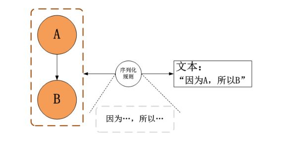
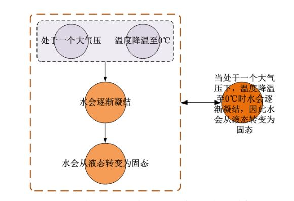

2024年摘录：不限题材，随便摘抄

最新 9.22：

“疯疯癫癫，挥霍谈笑而至。及至到了他门前，看见士隐抱着英莲，那僧便大哭起来，[甲戌侧批：奇怪！所谓情僧也。]又向士隐道：“施主，你把这有命无运，累及爹娘之物，抱在怀内作甚？”[甲戌眉批：八个字屈死多少英雄？屈死多少忠臣孝子？屈死多少仁人志士？屈死多少词客骚人？今又被作者将此一把眼泪洒与闺阁之中，见得裙钗尚遭逢此数，况天下之男子乎？看他所写开卷之第一个女子便用此二语以定终身，则知托言寓意之旨，谁谓独寄兴于一“情”字耶！武侯之三分，武穆之二帝，二贤之恨，及今不尽，况今之草芥乎？家国君父事有大小之殊，其理其运其数则略无差异。知运知数者则必谅而后叹也。]”这段文字中，有命无运，累及爹娘之物指的是什么？以及为什么会有命无运？为什么会累及爹娘？为什么会导致那么多人屈死？

这段文字出自《红楼梦》开篇，指的是甄士隐抱着自己的女儿英莲时，遇到跛足道人和癞头和尚的场景。这里的“有命无运，累及爹娘之物”主要指的是甄士隐的女儿英莲。具体解释如下：

有命无运：这句话中的“命”指的是生命或天命，而“运”则指的是运气、命运的安排。英莲虽然有生存的命，但她的命运却注定坎坷。这预示着英莲虽然出生于富贵人家，但未来会有诸多不幸遭遇，因此被称为“有命无运”。这反映了她的命运是悲剧性的，即便她有生命，但却没有好的运势相伴，最终落入悲惨的境地。

累及爹娘之物：这一句中的“累及爹娘”表达的是，英莲的命运不仅让她自己受苦，也让她的父母为她感到痛苦。这里的“物”指的是英莲，她作为“有命无运”的人，不仅自己命运多舛，还会给父母带来困扰和伤心。这个形象深刻地表现出古人对家庭责任和亲子连带关系的观念。

为什么会有命无运，累及爹娘：在小说中，英莲象征着那些命运被时代、社会所左右的人，尽管个人可能善良、无辜，但因为命运的安排，生活中充满了悲剧。这也是对当时封建社会中个体命运无常的批判。父母无力改变孩子的命运，因此也只能跟着悲伤、痛苦。这种“累及爹娘”是因为父母对子女命运的深刻牵挂与无奈。

导致那么多人屈死的原因：这段文字的眉批特别指出，英莲的悲剧象征了封建社会中很多人的悲惨命运，所谓“屈死多少英雄”、“屈死多少忠臣孝子”等等，是在指出历史上多少有才能、忠诚、孝顺、品德高尚的人因为种种外在的命运或政治原因被冤枉或悲惨地死去。他们像英莲一样，虽然有天命但无好运，最终命运不济而惨遭不幸。这表达了《红楼梦》作者对封建社会不公命运安排的深切批判与哀叹。

通过这段描写，作者借英莲的命运影射了广泛的社会现象，批判了当时命运无常、个人命运受制于天命与社会大势的现象。

----------------
戚蓼生序

吾闻绛树两歌，一声在喉，一声在鼻；黄华二牍，左腕能楷，右腕能草。神乎技也，吾未之见也。今则两歌而不分乎喉鼻，二牍而无区乎左右，一声也而两歌，一手也而二牍，此万万不能有之事，不可得之奇，而竟得之《石头记》一书。嘻！异矣。

夫敷华掞藻、立意遣词无一落前人窠臼，此固有目共赏，姑不具论；第观其蕴于心而抒于手也，注彼而写此，目送而手挥，似谲而正，似则而淫，如春秋之有微词、史家之多曲笔。

试一一读而绎之：写闺房则极其雍肃也，而艳冶已满纸矣；状阀阅则极其丰整也，而式微已盈睫矣；写宝玉之淫而痴也，而多情善悟，不减历下琅琊；写黛玉之妒而尖也，而笃爱深怜，不啻桑娥石女。他如摹绘玉钗金屋，刻画芗泽罗襦，靡靡焉几令读者心荡神怡矣，而欲求其一字一句之粗鄙猥亵，不可得也。盖声止一声，手只一手，而淫佚贞静，悲戚欢愉，不啻双管之齐下也。噫！异矣。

其殆稗官野史中之盲左、腐迁乎？然吾谓作者有两意，读者当具一心。譬之绘事，石有三面，佳处不过一峰；路看两蹊，幽处不逾一树。必得是意，以读是书，乃能得作者微旨。如捉水月，只挹清辉；如雨天花，但闻香气，庶得此书弦外音乎？

乃或者以未窥全豹为恨，不知盛衰本是回环，万缘无非幻泡，作者慧眼婆心，正不必再作转语，而千万领悟，便具无数慈航矣。彼沾沾焉刻楮叶以求之者，其与开卷而寤者几希！

-----------------
代表活跃或分化的凝聚力的是水，作为另一个中性点，即否定差异的中性点。现在我们来看线段ACB中的AC部分，从A到C，肯定的原则仍然占主导；从落在A点开始，物质逐渐扩展至C点，这里线和点的合成发生。因此，物质遵循纯粹的刚性或第一维度的方向。这一领域的主导原则是地原则或碳，这是所有金属性的决定因素。在C点，达到刚性的最大值时，相对的凝聚力或宽度极化开始活动；如果它能占上风，那么形态变化将沿着表示宽度的DC线（即DC线）方向偏离。然而，正如§139注1所示，相对的凝聚力或宽度极化在这里仍然服从于活跃的凝聚力。因此，线段AC及其正向的形态变化继续沿B方向进行；而宽度极化则在DC线中形成自己的世界。在线段CB（活跃凝聚力线的另一侧），它从未以纯粹的形式出现，而是始终与第一维度结合或合成，即仅以第三维度的形式存在，这实际上也以金属形式在此产生。（顺便说一句：人们通常错误地认为液体是扩张的，但在液体或第三维度的产品中，更多的是收缩，这证明了第一维度在这里起作用，而倾向于纯扩张、空间的第二维度并不单独占据优势。冰融化时会收缩，反之亦然）。因此，当形态变化在线段CB中继续时，第一维度的特征始终与第二维度共存；因此可以说，在线段CB中，第三维度占主导地位，就像在偏移线CE中第二维度占主导一样。在AC侧，碳是主导元素，而在CB侧通过其产品如金、汞等已经隐约可见的，则是氮或对立的原则，这种原则在到达线的边界时过渡到完全无维度的状态，包含所有维度。然而，考虑到这个原则在整个线段CB中演化，并通过其所有产品显现，可以将氮（绝对意义上，因为它的光形表现也是其存在的一种形式）——因此，作为这一整个系列的本质——等同于第三维度。现在考虑另一条线DE，如我们所知，水（实际上是绝对产生的第三维度的代表）在C点作为所有品质的缺失——不是相对的中性点，而是所有活跃凝聚力及因此所有差异的零点。它只能经历同样否定所有差异的变形：因此，虽然我们知道它也会向两个相反的方向增强，但一方面它是所有凝聚力的完全否定——因此，在这一侧它最纯粹地产生了第二维度，即在绝对意义上解构所有粘合性的纯扩张。因此，这里出现了燃素，或现代化学所说的氢，我们可以将其等同于与第一维度完全分离的第二维度。（只是氢的基本趋势始终朝向连续性）。正如水在这方面扩展一样，它在另一方面收缩；它变得自私，但由于这只是所有差异的缺失，这种自私只会表现为对所有差异，因此也是对所有凝聚力的对立；因此，在否定方面，它同样表现为无维度的，就像金属在其最高升华点在氮中同样表现为无维度的，但以积极的方式。因此，在线段DCE中，燃素或氢及其相应的第二系列产物（硫）落在E点；而消耗原则或氧及其相应的地类产物则落在D点。

如果我们现在再次总结整个构造，线段AC将是第一维度和碳的纯粹统治，偏离线段ACB的线段CE将是与第一维度分离的第二维度的纯粹统治以及氢，线段ACB的另一侧，即CB，将是第三维度的统治，因为它是对前两个维度的中立，最后，偏离线段DCE的另一侧，即DC，将是所有维度的完全否定，因此是消耗原则或氧。

因此，我们也可以根据维度的模式确定四种原始原则的关系：

对应于第一维度，决定所有金属性的是地原则或碳。
对应于与第一维度完全分离的第二维度，决定所有无凝聚力性的是燃素或氢。
对应于作为前两个维度中立的第三维度，或决定所有金属性的是对立原则或氮（作为整个CB侧的本质）。
最后，对应于所有维度的共同中立，或所有维度的对立面，是消耗原则或无维度的氧。
这一点是可以理解的，即这种无维度的或所有维度的对立面必须落在宽度极化的方向上，因为正是第一维度设定了所有的差异，因此所有否定的东西不能落入其方向。相反，线段ACB，作为设定所有维度的东西，最终在理想的想象最大值处进入现实，同样，但以积极的无维度形式，升华为氮，它在线段CB的产品中是第三维度的本质，在最高升华点B处成为积极的无维度，因此成为氧的积极对立面。这种氮与氧的关系，在一些至今仍神秘且无法解释的现象和关系中已经表现出来，只有从上述发展出的观点才能理解，并因此为该观点提供新的证实。例如，毫无疑问，氮是所有碱的主要原则。但是，碱的腐蚀力，即破坏力，不就是与火的力量，也就是氧的力量完全类似的效果吗？根据通常的观点，如何解释这两种最对立的产品，它们在结合时相互中和，却有相同的效果呢？仅此现象就证明了氮的火属性，以及它在积极方面与氧在消极方面的同一性。人们一直在试图理解金属如何在酸中溶解，但很少有人尝试理解它们如何也能被碱溶解甚至从酸中提取出来。金属氧化物通过最高的氧化程度变为透明；碱同样能够使硅土与其熔合并玻璃化，最终甚至能够在水中溶解。我在这里仅提到磷在氮气中发光和燃烧的现象，我相信上述内容足以证明我的主张，即存在实证理由迫使人们认识到，氮在积极方面与氧在消极方面是相同的。这种原则的神性，其本质的不可侵犯性，作为对立面中的对立面，特别体现在动物界，那里真正展开了渗透到物质中的神性。

此外，如果我们比较水的三种形式，我们会发现，即使是液态水也只是其一种形式，其真实本质仍然是不可见的。氧在消极方面或对于水而言，是第一维度，在其中水显得最为自私和消耗。氢在这种关系中是第二维度，正如液态水是第三维度。

到目前为止，我们总体上考虑了物质，即在其中特殊生命的形式或运动从属于静止的存在，也就是说，根据第110节的解释，我们只考虑了物质的第一种力量。运动的形式在这里作为存在的形式或静止的形式出现。现在我们转向考虑这些形式，即它们不仅仅是静止或存在的形式，而是活动的形式，因此质量更多地是它们的偶性。我在这种关系中提出以下内容：

每一存在或静止的形式在物质中必然对应一个相同的活动或运动的形式。因为根据第108节，无限现实实体中的特定事物同样属于重力和光。然而，迄今为止推导出的特殊生命的特定形式作为存在的形式，也仅仅是重力的形式，即使它们是物质中光的表现，但仍然从属于重力，而不是与光相对应的形式（这些形式仅作为运动的形式）。因为光是一切运动的本质和灵魂，所以它们同样必然作为运动或活动的形式出现，就像作为存在的形式一样。

另一种方式直接从力量的概念和第109节关于自然力量的证明出发。最简明地从一般原则出发，即自然界中没有任何东西被肯定，除非它本身就是肯定的；没有客观的东西，除非它也是主观的。既然那些特殊生命的形式作为静止的形式被肯定，那么它们必然也是肯定的，即根据先前提出的运动概念，它们也必须被设定为运动的形式。

在自然的第一种力量中，特殊生命的形式仅作为物质的偶性出现，因此是易变和短暂的；在第二种力量中，形式必须作为普遍的，而物质作为偶性或易变的出现。

这一点已经从第110节中的力量概要中得出。

即使在物质中，实质与形式或力量合为一体，如在所谓的物质中，物质仍然被视为实质，形式被视为偶性。例如，氧和氢的实质是同一的；因此，它们在实质上并没有不同，而它们只是通过力量的不同来区分，因此这种力量本身被认为是偶然的。在第二种力量中，物质应该作为运动原则的偶性出现，因此它经历所有由该原则命令的转化和变化，从而总是变化，表现为永远不同的东西。因此，第一种力量总体上是物质存在的力量，第二种力量是物质不断变化的力量。这种对立在与第三种力量的更高关系中尤为重要，在第三种力量中这种对立得到平衡。——正如在第一种力量中，运动的形式只能作为从属于实质的形式出现，所以在第二种力量中，物质则完全屈从于运动；在第三种力量中，两者作为真正实质的不变属性出现，物质是运动原则的工具，但同时通过运动自身不断再生，因此运动也是它的工具，而不是在这一同一性之外，运动在物质中熄灭，或物质在运动中消失（当然，这仅适用于将自然视为单一力量，而不是总体，因为在大或全有机体中，同样的规律存在于个体中，根据永恒相等的肯定者与被肯定者比例的规律（公理IX），始终再生相同的整体形态）。

我们现在需要将这些特殊生命的形式理解为活动的形式，就像理解为存在的形式一样；在此之前，我们需要确立所有活运动的基本规律，即从内部运动原则中涌现的运动规律。

任何物体相对自身或他者的活运动的基本规律是：相反的极性相互吸引，相同的极性相互排斥。这一定律对应于我们在第120节中作为第一种力量的一般规律所表达的内容。正如有限存在的物质规律是极性或同一性中的双重性，自然中所有运动的规律是双重性中的同一性，即相反的极性相同，相同的极性相反。这一定律的证明如下：根据第七公理，自然中的任何事物都不会根据其实质作用于其他事物，所有事物之间的相互作用，包括在运动中，都是通过一般的同一性，即绝对的实质，而中介的，这一实质在更高的力量中再次作为存在和运动的基础，随后作为重力介入，被迫以另一种形式作用，引发事物之间的引力过程，通过这一过程，它试图将通过变形从其分离的事物重新统一到特殊生命中，从而试图转化和摧毁它们。由于在物质中不可能有其他差异，除了根据极性定律，即每个可能的A和B之间的定量差异都有一个相反的差异，每一种物质中的一个因子的+都有一个相反的+，这在另一个物质中是-，因此只有通过相反者的结合，通过+和-的连接，才能建立同一性，因此所有运动的必要规律是：相反者相互吸引，相同者相互排斥。因为相反者可以互相补充，使得虽然每一个单独不是，但两者结合可以形成一个整体或同一性（这一整体或同一性相对于第三方可能再次表现为差异）。相同者不能互相补充，因为在其中一个中的东西也在另一个中，而在其中一个中不存在的东西也不在另一个中。——因此，这是自然的一般和必要的规律，维持其生命和运动的永恒交替。没有差异，自然将是一个迷失在自身和其静止中的同一性。只有差异使它行动；它为了静止而行动，为了回到同一性。

我们将根据上述规律的运动称为动力学运动。原因是这种运动不像重力那样基于实质，而是基于事物的性质或特殊性，并通过这些性质中介。

通过这种运动，事物之间也内在地联系起来，或者这种运动表达了它们内在生命的联系（根据第八公理，内在联系基于实质或普遍生命同时也是其特殊生命）。根据前面的解释，这正是在这种运动中发生的情况。因为重力，如在第一种力量中出现的，与事物的差异无关，它不关注特殊性，对差异完全平等。在当前的力量中，重力同时被提升（因为它是自然的一般同一性，因此不能被任何事物取消），在这种力量中，这一普遍同一性是运动的灵魂，因为它通过事物的特殊存在中介，而在这运动中，事物的特殊生命最明显地表达出来，因此，事物的普遍生命同时成为它们的特殊生命，即它们彼此内在联系，除了外在的重力生活，还显现出一个内在的生活，通过这种生活，它们不仅在实质上，而且在性质上彼此统一。——这使我们能够更准确地描述第二种力量与第一种力量的关系。

--------------
现在让我们进入正题！我们已经在上面说过，当前**科学工作者完全缺乏思辨能力**，而正是通过思辨，所有其他知识才能得到论证、整理和澄清，没有思辨，**所有对科学的研究只能是盲目的、或多或少被偶然性所支配的摸索**。如果有人能够理解我们，我们已经通过我们自己的思辨展示了这一点。现在，如果我们的时代与整个前世共有的缺陷不能单独归咎于我们这个时代，那么存在一个巨大的区别：前世从未听说过真正的思辨，而现在的人在过去二十五年里，通过两位在外在表达上非常不同的作者的一系列多样化的著作，已经接触到了实际思辨的规则，以及在各种材料上对这些规则的应用。

但是，当极其清晰地显示出，在这些所谓的科学工作者中，甚至连**科学本身的概念**，仅就其形式和外在特性而言，**不仅几乎完全消失了**，而且他们内心对这个概念**感到恐惧**，对它的任何唤起都**充满敌意**，他们生活中唯一的安慰就是希望永远不会真正达到科学，他们努力的唯一目的就是阻止这种情况发生，那么我们该说什么呢？难道我们不应该判断，在我们中间已经消亡的学术界的位置上，已经被**科学的最激烈的敌人所取代**，他们只是**戴着学识的面具**，为了在其保护下更安全、更胜利地攻击科学吗？

科学，只要它确实是科学，就在自身内具有绝对和不变的明证性，彻底消除任何相反的可能性和所有怀疑；而且，由于这种明证性只能以一种不变和固定的方式存在，科学有其固定和不变的外在形式。这属于科学作为科学的本质；只有在这个条件下，它才是科学；在任何有学术界的地方，这一点都被普遍相信和接受。但是，我们所谓的学者对这一点的看法和接受程度如何呢？我不知道他们中有多少人不时会发表如下言论：有人认为自己是唯一的智者和唯一的哲学家；有人想要一种整体的科学；人们必须——好像每个真理可能有不止一个立场似的——在反驳对手时站在他们的立场上；在探索真理时不应该太严格，而应该让大家各自生存；还有无数其他表述，要求科学放弃其绝对的基本特征：所有这些都被视为不容置疑的公理，**以一种天真的无知**，**完全没有意识到自己的荒谬**，以至于他们不仅确信会得到所有其他人的赞同，甚至坚信那些被他们指责独占智慧的学者只是没有意识到这一点；一旦被提醒，他们就会反省并感到羞愧。如果这些作者在另一个场合谈论科学的本质时，大约以我们上面所说的方式表达自己：我们应该认为这是他们的真心话吗？我们怎么可能这么认为？后者只是他们说的，而前者才是他们真正相信的，因为他们在实际评判现有现象时就是按照这种方式行事的；正如一些人**以令人感动的天真**补充说：这在抽象上是正确的，但在具体上绝不是如此；由此，他们清楚地承认，他们认为**科学的概念只是一个空洞的、玩笑和游戏性思考的概念**，希望永远不会变得严肃。

科学的内在本质是建立在自身之上的，它完全通过自身和从自身中创造自己，绝对地消除所有的任意性；对一个科学工作者来说，最首要的要求是，在满足这个要求之前，知识的火花永远不会进入他的灵魂，那就是他内心所有的倾向都应在真理的神圣法则面前沉默，他应永远决心平静地接受所有他认为是真实的东西。我们应该相信，他们要么已经满足了这个条件，要么至少认为有人可能会对他们提出这样的要求吗？——那些认真地向整个公众通知我们的真理不合他们的口味，并解释他们对此的真实感受，描述他们喜欢的真理应该是什么样子，并请求我们**按照他们的喜好来制造和认可真理**，如果我们不愿意，他们就会**发怒和抱怨**我们想要**把他们的心从身体里扯出来**的人；**如果我们能做到**，**我们确实很乐意这样做**，但由于我们自己的无能，我们只能把它留给神的恩典。或者我们应该相信那些人，他们不管所讲内容如何，抱怨我们教导得不够友好，给了他们一个不温柔的推动，几乎扰乱了他们内心平静的情绪；要求我们改进，将来把教导和药物包裹在他们喜欢的甜味中，否则他们会因为我们应得的惩罚而不再向我们学习任何东西？当我们看到一个新的学说几乎只用这种厌恶和在读者心中激起同样厌恶的武器来对抗，而这些读者的同情和同等程度的无知是可以确定的；同样，对学说与普通观点的巨大偏差表示惊讶，好像有人会承认某事是真的，仅仅因为它是普遍的，我们还能相信这种思维方式有很多例外吗？

对科学工作者来说，最首要的认识是：**科学不是一种空洞的游戏或消遣**，不仅仅是为了提高生活享受的奢侈品，而是人类应该追求的东西，**是人类进一步发展的唯一可能源泉**：**真理是一种善**，**是包含所有其他善在内的最高善**，**而错误则是所有邪恶的源泉**，**是罪恶和所有其他罪恶和恶习的根源**；那些阻碍真理和传播错误的人，对人类犯下了最可怕的罪行。我们能把这种认识归于那些终其一生通过所有言行表现出对真理和错误绝对漠不关心的人吗？那些一生都在继续教学却从未真正知道什么的人？那些没有任何信念，却仍然继续断言他们所说的是真理的人，他们只是碰运气，希望自己可能也说对了，这样，**在内心已经变成一个具体的伪善和谎言，继续生活在谎言中，靠谎言吃饭、喝水和穿衣**？

------------------
屯卦

  ▅▅  &nbsp;▅▅  (上六) 
  ▅▅▅▅▅  (九五) 
  ▅▅  &nbsp;▅▅  (六四) 
  ▅▅  &nbsp;▅▅  (六三) 
  ▅▅  &nbsp;▅▅  (六二) 
  ▅▅▅▅▅  (初九)
  
（水雷屯）坎上震下

卦辞：
《屯》：元亨，利贞。勿用有攸往。利建侯。

元：事物开始、初始的状态，也指根本、源头。 
亨：通达、顺利。 
利：有利、吉利。 
贞：正、诚实、光明正大。 
勿用有攸往：不宜贸然行动或前往。 
利建侯：有利于建立封侯。 
整句含义：屯卦象征着初始阶段的艰难和阻碍，但如果能坚持正道，保持诚实和光明正大，就能顺利发展。然而，此时不宜贸然行动，而是要建立稳固的基础，逐步推进。

爻辞：
初九：磐桓，利居贞。利建侯。

磐桓：徘徊停留，暂时不行动。 
利居贞：有利于保持正道和安定的状态。 
利建侯：有利于建立稳固基础。 
含义：在初始阶段，应该暂时停留、不贸然行动，保持正道和安定的状态，有利于建立稳固的基础。

六二：屯如邅如，乘马班如。匪寇，婚媾。女子贞不字，十年乃字。

屯如邅如：困顿徘徊的样子。 
乘马班如：骑马前行，步伐不稳。 
匪寇：不是敌寇。 
婚媾：婚姻缔结。 
女子贞不字：女子保持贞洁，不嫁人。 
十年乃字：十年后才嫁人。 
含义：处于困顿和徘徊的状态，前行不稳，但不是因为敌寇，而是因为婚姻和家庭的缘故。女子保持贞洁，不急于嫁人，十年后才嫁。

六三：即鹿无虞，惟入于林中，君子几不如舍，往吝。

即鹿无虞：追逐鹿没有向导。 
惟入于林中：只进入了树林。 
君子几不如舍：君子有所犹豫，不如放弃。 
往吝：前行会有悔恨。 
含义：追逐鹿没有向导，进入了树林。君子有所犹豫，不如放弃行动，否则会有悔恨。

六四：乘马班如，求婚媾。往吉，无不利。

乘马班如：骑马前行，步伐不稳。 
求婚媾：寻求婚姻缔结。 
往吉：前行吉利。 
无不利：没有不利之处。 
含义：虽然前行步伐不稳，但寻求婚姻缔结，前行会吉利，没有不利之处。

九五：屯其膏，小，贞吉；大，贞凶。

屯其膏：积聚财富。 
小：小规模。 
贞吉：保持正道吉利。 
大：大规模。 
贞凶：保持正道会有凶险。 
含义：积聚财富，如果是小规模的，保持正道会吉利；如果是大规模的，保持正道会有凶险。

上六：乘马班如，泣血涟如。

乘马班如：骑马前行，步伐不稳。 
泣血涟如：泪如血般流淌。 
含义：前行步伐不稳，内心痛苦，泪如血般流淌。

总结：
屯卦描述了事物在初始阶段面临的艰难和阻碍，从徘徊停留到逐渐前行，从困顿徘徊到寻求婚姻和合作，强调了在初始阶段保持正道的重要性。它告诫人们要在困境中保持诚实和光明正大的态度，不贸然行动，而是逐步积累力量，稳固基础，才能顺利发展。
 
  蒙卦
  
  ▅▅▅▅▅  (上九) 
  ▅▅  &nbsp;▅▅  (六五) 
  ▅▅  &nbsp;▅▅  (六四) 
  ▅▅  &nbsp;▅▅  (六三) 
  ▅▅▅▅▅  (九二) 
  ▅▅  &nbsp;▅▅  (初六)
  
（山水蒙）艮上坎下

卦辞：
《蒙》：亨。匪我求童蒙，童蒙求我。初筮告，再三渎，渎则不告。利贞。

亨：通达、顺利。
匪我求童蒙：不是我去求教童蒙。 
童蒙求我：是童蒙来求教我。 
初筮告：初次占卜会得到明确的指示。 
再三渎：多次占卜会变得亵渎。 
渎则不告：亵渎就不会再有指示。 
利贞：有利于保持正道。 
整句含义：蒙卦象征启蒙和教育，其发展是顺利的。不是我去寻找愚昧无知的人，而是无知的人来求教我。初次占卜会得到明确的指示，但过多的占卜会显得亵渎，亵渎就不会再有指示。保持正道是有利的。

爻辞：
初六：发蒙，利用刑人，用说桎梏，以往吝。

发蒙：启蒙教育。
利用刑人：适宜对违法的人施以刑罚。 
用说桎梏：解除枷锁。 
以往吝：前行会有悔恨。 
含义：启蒙教育时，适宜对犯错的人施以惩罚，解除枷锁，但如果贸然前行会有悔恨。

九二：包蒙，吉。纳妇，吉。子克家。

包蒙：包容无知。 
吉：吉利。 
纳妇：娶妻。 
子克家：儿子能够治理家庭。 
含义：包容无知是吉利的，娶妻也是吉利的，儿子能够很好地治理家庭。

六三：勿用取女，见金夫，不有躬。无攸利。

勿用取女：不宜娶妻。 
见金夫：见到富有的男子。 
不有躬：自己没有成就。 
无攸利：没有什么利益。 
含义：不宜娶妻，可能会遇到富有的人，但自己没有成就，这样的情况下不会有利益。

六四：困蒙，吝。

困蒙：困于无知。 
吝：悔恨。 
含义：困于无知会带来悔恨。

六五：童蒙，吉。

童蒙：无知的儿童。 
吉：吉利。 
含义：无知的儿童如果能够得到正确的启蒙教育，会是吉利的。

上九：击蒙，不利为寇，利御寇。

击蒙：击败无知。 
不利为寇：不宜成为强盗。 
利御寇：有利于防御强盗。 
含义：击败无知是有利的，但不宜成为强盗，而是要防御强盗。

总结：
蒙卦描述了启蒙和教育的重要性，从启蒙教育到包容无知，从困于无知到击败无知。它强调了正确的教育方式和态度，以及在教育过程中保持正道的重要性。启蒙教育需要适当的惩罚和包容，同时也告诫人们不要急于求成，而是要循序渐进，保持正道，才能取得好的结果。

-------------
　这不是小仙女！
　　她的语声，听来虽和小仙女也有七分相似，但小仙女说话不会这么慢的，小鱼儿从未听过小仙女慢慢的说一句话。　**只见一个绿衣少女，手挽着花篮，肩着花锄，款款自树后走出，她的体态是那么轻盈，像是一阵风就能将她吹倒，她的柳眉轻颦，大大的眼睛充满了忧郁，容貌虽非绝美，但却楚楚动人，我见犹怜**。
　　她身后还跟着个浓眉大眼的少年，个子虽然又高又大，却是满面稚气，毕恭毕敬地跟在她身后，连头都不敢抬起。
　　这男女两人一个就像是弱不禁风的闺阁千金，一个又像是循规蹈矩，一步路不敢走错的世家少年。
　　但碧蛇神君瞧见这两人，却像是被人在脖子上砍了一刀，头立刻垂了下去，强笑着道：“原来是九姑娘。”
　　绿衣少女淡淡道：“很好，你还未忘记我，但你莫非忘了这是什么地方，居然要在这里开膛剖腹，你的胆子也未免太大了吧。”
　　**她神色并非冷酷，只是一种淡淡的，轻蔑与冷漠**，**她并非要对别人不好，只是对任何人都不关心**。
　　**世上无论多重要的人物，在她眼中似乎都不置一顾**。
　　小鱼儿实在猜不出这少女身份，她看来本该是皇族贵胄千金公主，却又偏偏只不过是个草野女子。
　　她年纪轻轻，本该对世上的一切都抱着美丽的幻想与希望，但她却偏偏似乎早已看破一切，所以**对任何事都这么冷淡**。
　　只见碧蛇神君头垂得更低，颤声道：“小人以为这里还未到禁区，所以……”
　　绿衣少女道，“现在你知道了么？”
　　碧蛇神君道：“现在知道了。”
　　绿衣少女道：“既已知道，你总该知道怎么办吧。”
　　碧蛇神君惨笑道：“是，小人知道。”
　　突见剑光一闪，他竟将自己的左手齐腕斩断！
　　就连小鱼儿都不禁为之动容，**但这绿衣少女“九姑娘”却仍是那么淡漠**，只是轻轻挥了挥手，道：“好，你现在可以走了。”
　　话未说完，碧蛇神君已飞也似的逃走。
　　突听铁心兰挣声大呼道：“你不能放他走……不能放他走。”
　　她不知何时已醒来，此刻挣扎着要站起，却又跌倒。
　　绿衣少女瞧了她一眼，道：“为什么？”
　　铁心兰指着小鱼儿，道：“他已中了剧毒，只有碧蛇神君的解药，否则他……他……他就只怕活不过今天了！”
　　绿衣少女**淡淡**道：“**他的死活，与我又有何干**？”
　　铁心兰身子一震，又仆倒在地。
　　那少年突然笑道：”“九姐，咱们救救他们吧。”
　　绿衣少女道：“**你若要救他们，你只管救，我不管**。”
　　转过身子，款步而去，再也不回头瞧任何人一眼。
　　那少年瞧了瞧躺在地上的铁心兰，垂头道：“对不起……”
　　突也大步赶了上去，跟着她走了。
　　铁心兰颤声呼道：“姑娘……求求你……你……”
　　小鱼儿大眼睛转来转去，突然大笑道：“咱们也走吧，何必求她。”
　　铁心兰道：“但你……你……”
　　“我死就死，活就活，有什么关系？她小小年纪，又怎能救得了咱们，你逼她相救，岂非令她为难。”
　　他用力扶起铁心兰，才走了两步，突听那少女冷冷道：“站住！”
　　小鱼儿嘴角泛起一丝微笑，但口中却大声道：“为何要站住，我若死在这里，岂非沾污这条干净的道路。”
　　人影一闪，绿衣少女已挡住了他的去路，冷冷道：“你已死不了啦……但你莫以为我不知道你是在激我，**我救你，只是为了要你知道世上没有慕容姐妹办不到的事**。”
　　小鱼儿冷笑道：“我可没有激你，也并未要你救我，我自己高兴死就死，高兴活就活，用不着别人操心。”
　　九姑娘淡淡道：“**我既已要救你，现在你想死都已不能死了**。”
　　小鱼儿眨了眨眼睛，道：“这可是你自己心甘情愿要做的，我既未求你，你纵然救活了我，我也不会感激你的。”
　　九姑娘不答话，转过身子，道：“随我来。”
　　道路尽头，竟是座庄院。
　　这庄院依山而建，占地并不广，气派也不大，但每一片瓦，每间房子，都建筑得小巧玲珑，别具匠心，看来别有一番风味。
　　走进去便是个小小的院子，小小的厅房，虽然瞧不见一个仆役，但每寸地方都打播得干干净净，一尘不染。
　　小鱼儿走到这里已不住喘气，似将跌倒，那少年悄悄出手，在后面扶着他，小鱼儿感激的一笑，道：“谢谢你，你叫什么名字？”
　　那少年脸红了红，道，“顾人玉。”
　　小鱼儿道：“你不姓慕容？”
　　顾人玉红着脸道：“我是她们的表弟。”
　　小鱼儿笑道：“你这人倒真不错，只是太老实了些，倒像是个女孩子，怎地还没说话，脸就先红了起来。”
　　顾人玉吃吃道：“我……我……”
　　他若非生得又高又大，浓眉大眼，绝不会是个男子，小鱼儿真要以为他又是个女扮男装的。
　　九姑娘脚步不停，穿过厅房，穿过回廊，偌大的庭院，到处都不闻人声，更瞧不见一个人影。
　　最后，她走到小园中两三间雅轩门前，方自站住了脚，道：“进去。”
　　说完了这句话，竟又转身走了。
　　顾人玉道：“请……请进，这就是我住的屋子。”
　　铁心兰竟也笑了，接道：“这里恐怕只有这间屋子是男人能住的。”
　　小鱼儿笑道：“哦……这里除了你，莫非全是女子？”
　　顾人玉瞪大了眼睛，道：“你难道没有听过慕容九姐妹的名字？”
　　铁心兰本已连眼睛都已阖起，此刻突然失声道：“真非就是江湖人称的‘人间九秀’？”
　　她一说话，顾人玉脸又红了，轻声道：“不……不错。”
　　小鱼儿瞧着铁心兰笑道：“原来你又知道，你且说说这九姐妹又有什么厉害？”
　　铁心兰轻轻叹了口气，道：“这九姐妹不但轻功、暗器，可称天下一绝，而且每个人都是秀外慧中，只要是别人会的事，她们姐妹就没有不会的，所以，天下的名门世家，没有一家不想娶个慕容家的女儿回去做媳妇。”
　　小鱼儿眨了眨眼睛，笑道：“她们嫁了么？”
　　铁心兰道：“据说除了最小的九妹外，另外八姐妹嫁的不是武林世家的公子，就是声名显赫的少年英雄……”
　　小鱼儿大笑道：“这就难怪江湖中人要怕她们，别人纵然惹得起她们九姐妹，却也惹不起她们这八个有本事的丈夫。”
　　他此刻脸上已泛出黑气，说话时一口气也常常提不上来，但他居然还是旁若无人，大声谈笑，竟又一拍顾人玉肩头，笑道：“常言说做好，近水楼台先得月，你只管紧紧钉住她吧，这主意一点也不错，哈哈，一点也不错！”
　　顾人玉脸更红得像火，垂下了头，偷偷瞧了铁心兰一眼，道：“这……这是家母的意思，小弟我……”
　　哪知慕容九姑娘突然走了进来，冷笑道：“这本是舅妈的意思，你本不愿来这里受气的，是么？”
　　顾人玉简直恨不得找个地缝钻下去，吃吃道：“我……我不是这意思。”
　　慕容九妹**冷冷**道：“**顾少爷，这里可没有人请你来，也没有人留着你，舅母虽当你是宝贝，别人可不稀罕你**。”
　　她再也不瞧顾人玉一眼，“当”的，将一个小小的黑色玉瓶，抛在小鱼儿面前的桌子上，冷冷道：“**一半内服，一半外敷，三个时辰内，你这条命就算捡回来了，就快走吧**。”转过身子，就往外走。
　　小鱼儿嘻嘻一笑，道：“我可可没有求你救我，也没有要娶你做媳妇，你用不着对我这么神气，别人虽当你是宝贝，我可不稀罕。”
　　慕容九妹霍然回身，冷冷的瞪着他。
　　小鱼儿却若无其事，拔开瓶塞，“咕”的，将半瓶药咽了下去，舐了舐嘴唇，道：“这药怎地酸得像醋。”
　　接着又把另半瓶药敷在伤口——他究竟是聪明人，嘴里虽说着风凉话，手里却赶紧将药先用了再说。
　　慕容九妹狠狠瞪着他，冷漠的目光中，突然像是要冒出火来，她瞬也不瞬瞪了半晌，一字字道：“我虽然救了你，一样还是可以杀你！”
　　小鱼儿吐了吐舌头，笑道：“**你不会的，你看来虽狠，心却还是不错**。”
　　也不知怎地，**慕容九妹苍白的面颊竟红了红**，但瞬即厉声喝道：“出去，现在就出去，永远莫要被我再瞧见，否则我……我就先割下你的舌头，挖出你眼睛，再杀了你！”
　　顾人玉已瞧呆了，**他一生从未见到冷冷淡淡的九姑娘，发这么大的脾气，更未想到她会说出这么狠的话来**！
　　小鱼儿却仍是笑嘻嘻的，道：“我自然要走的，但我走了后，你可莫要再求我回来。”
　　慕容九妹气得身子发抖，道：“你……你这……”
　　突听外面一人遥遥呼道：“慕容九妹，你在哪里？……小姐姐来瞧你了。”
　　这呼声来得好快，一句话说完，便似已由大门外来到小园里，慕容九妹咬了咬嘴唇，轻盈的身子，流云般飘了出去。
　　小鱼儿整个人都呆住了，再也笑不出来。
　　铁心兰也变了颜色，道：“莫非是……是小仙女张菁。”
　　顾人玉道：“不……不错，她和九姐是好朋友。”
　　小鱼儿噗地坐到椅上，苦笑道：“这世界怎地如此小……”
　　只听小仙女的语声在园中笑道：“咱们的九姑娘怎地架子越来越大了，知道我来，也不迎接迎接。”
　　慕容九妹道：“**谁知道你这小游魂一天到晚要游到那里**！我不县长远不来看看我，你倒敢骂起我来了。”
　　小仙女笑道：“**呀，我们的九姑娘越来越会说话了，瞧你脸红红的，可真也越来越漂亮**……告诉我，你这几个月来，又有多少人来求过亲了？”
　　慕容九妹道：“讨厌。”
　　小仙女道：“你嘴里虽说讨厌，其实心里也想……”
　　慕容九妹冷冷道：“我这一辈子，永远不会嫁人！”
　　小仙女道：“对，男人都不是好东西，都该死，尤其是那种长得不讨厌，又能说会道的男人，更该死！”
　　她说这句话时像是想起了小鱼儿，语声中真的充满怨毒怀恨之意，铁心兰听得手足冰凉，悄声道：“咱们怎……怎么办？”
　　小鱼儿坐在椅子上，长叹道：“打又不能打，逃也不能逃，我也什么法子都没有了。”
　　话未说完，小仙女已冲了进来，失声道：“果然是你这小鬼在这里！”
　　小鱼儿笑嘻嘻道：“许久不见，你好吗？”
　　慕容九妹皱眉道：“菁姐，你认得他？”
　　小仙女恨声道：“认得，我自然认得，但……但他怎会在这里？”
　　慕容九妹淡淡道：“他在外面受了伤，我……”
　　小鱼儿突然大声道：“你莫要问了，我和慕容家丝毫没有关系，此刻又受了伤，你若要杀我，只管杀吧，既不必怕伤别人的面子，也不必怕我还手！”
　　小仙女冷笑道：“你还手又怎样？”
　　小鱼儿大笑道：“我若能还手，你就又要躺着不能动了！”
　　小仙女反手一个耳光掴过去，怒道：“你再说？”
　　小鱼儿动也不动，反而笑道：“我不说了，我还有什么可说的，你两次落在我手上，只怪我看你可怜，两次都饶了你，今日就算死在你手上，也是活该。”
　　他说的当真是大仁大义，动人已极，至于小仙女是如何会落在他手上的，他自然一字不提。
　　慕容九妹终于忍不住问道：“菁姐，你真的两次？……”
　　小仙女气得全身发抖，却偏偏说不出一句辩驳的话来，慕容九妹瞧见她这模样，面上神情突然变得甚是古怪。
　　小鱼儿瞧在眼里，失声道：“**慕容姑娘，你就让她杀了我吧**，我虽然是在你家里被她杀的，但我也知道你看不起她，我绝不怪你。”
　　小仙女已气极了，不怒反笑，道：“你以为我不敢杀你！”
　　小鱼儿道：“你自然敢的，大名鼎鼎的“小仙女’张菁，一辈子怕过什么人来？何况是我这根本不能还手的人！”
　　小仙女怒喝一声，并指如剑，向小鱼儿额角太阳穴直点过去，小鱼儿根本不能闪避，铁心兰心胆俱裂！
　哪知就在这时，人影一闪，慕容九妹突然已挡在小鱼儿面前，小仙女的手指已触及她娇怯怯的身子，方自硬生生收住，怒道：“九妹，你难道要帮外人！”
　　慕容九妹**淡淡道**：“若是在别的地方，你将他是打是杀，我全不管，但在这里，**菁姐你总该给小妹个面子**。”
　　小仙女道：“我杀了他再向你陪罪。”
　　慕容九妹道：“**这庄院自从盖成以后，就没有杀人流血的事，菁姐你一定非想破这个例，你难道不能等等**？”
　　小仙女跺脚道：“你……你不知道小鬼有多可恶！”
　　慕容九妹道：“纵然可恶，也等他走出去再……”
　　小仙女喝道：“我等不及了！”
　　她身形连闪七次，想冲过去，但慕容九妹娇怯怯的身子，却总是如影随形，挡住了她的路。
　　其实慕容九妹若真是让她动手，她也未必会真个杀了小鱼儿，但慕容九妹越是拦阻于她，她反而越是愤恨，竟真的要将小鱼儿杀了才甘心了，只见她纤指连续竟向慕容九妹攻出了七招。
　　慕容九际身子飘飘闪动，冷冷道：“菁姐，这是你先向小妹出手的？可怪不了我。”
　　小仙女手上不停，陪笑道：“我若要做一件事时，世上没有一个人能拦得住我，你也不行……你只管将慕容家那些小针小箭使出来吧……”
　　话犹未了，突听身后一人喝道：“用不着，看招！”
　　一股拳风真击过来，竟是雄浑沉厚，无与伦比！
　　小仙女一伏身，“嗖”的窜了出来，大喝道：“好呀，顾小妹，你也敢向我动手了。”
　　小鱼儿暗笑道：“原来他外号叫做‘顾小妹’，这倒真的是名符其实，只是他人虽老实，武功却端的扎实，究竟不愧为武林世家的后人，看来就算这自命不凡的‘小仙女’，也未必能胜的了他。”
　　他却不知顾人玉正因为人老实，是以武功才能练得扎实，“玉面神拳”顾人玉这七字，在江湖中也是赫赫有名的！
　　小仙女瞪着眼睛，叉着腰，喝道：“你们还客气什么，来呀！”
　　小鱼儿也在心里说：“是呀，还客气什么，赶紧打吧。”
　　谁知顾人玉却站在那里动也不动，低着头道：“只要张姑娘不向九姐出手，小弟又怎敢向张姑娘出手。”
　　小仙女冷笑道：“**原来顾家神拳的传人，竟是个没出息的小子，你除了向你的九姐讨好之外，难道什么都不会**。”
　　顾人玉站在那里，连一句话都不说了。
　　小仙女气得跺脚，道：“好，慕容九，你来吧，你那宝贝‘七巧囊’中，究竟有什么玩意，也只管一齐使出来。”
　　慕容九妹**冷冷道**：“**只要你不在这里杀人，我又怎会和你动手**。”
　　小仙女瞧瞧她，又瞧瞧顾人玉，两个人一个堵着窗子，二个堵着门，竟硬是和小仙女泡上了。
　　小鱼儿嘻嘻道：“你瞧也没用，反正你是闯不进来的，原来大名鼎鼎县仙女，也有被人拦住的时候。”
　　小仙女眼珠子一转，突也笑道：“你希望我和他们打得落花流水，你才好在旁边瞧热闹，是不是？”
　　小鱼儿大笑道：“你不敢打就走吧，又何必找个梯子下台阶。”
　　小仙女道：“我正要走了，你若能在这地方躲上一辈子，我算服气你，否则，你只要踏出这大门一步，我就要你的命。”
　　转身向慕容九妹道：“除非你嫁给他，一辈子守着他，否则他总是要死在我手上的，我又何苦现在和你动手，教别人听见，反说我欺负你。”
　　她倒退三步，身形已在银铃般的笑声中飞掠而去，这位姑娘居然真的说走就走，倒也是小鱼儿想不到的事。
　　他瞪着眼睛，呆了半晌，苦笑道：“女人，女人……唉，女人的心思，变起来真是吓得死人……”
　　**慕容九妹轻轻叹息了一声**，道：“**此人心思变化，无人能以猜测，性格也教人捉摸不定，唉！当今天下，只怕也唯有她才配做我的对手**……”
　　小鱼儿眨了眨眼睛道：“**如此说来，天下英雄，只有你和她两人了**。”
　　慕容九妹道：“正是。”
　　小鱼儿道：“那么？谁是江湖第一？”
　　慕容九妹沉吟道：“她行事精灵古怪，脾气变化无常，连我都测不透她下一步想做什么，可算是江湖第一厉害的人物。”
　　小鱼儿道：“你呢？”
　　慕容九妹冷冷道：“我并未插足江湖。”
　　小鱼儿道：“**你若插足江湖，她就得变为第二了，是么**？”
　　幕容九妹道：“哼。”
　　小鱼儿一本正经，解释道：“**不错，你确是天下第一……**”
　　**慕容九妹扬了扬眉淡淡一笑**，小鱼儿却又接着又道：“**你这自我陶醉的本事，的确可算是天下第一**。”
　　慕容九妹心情立刻又变了，小鱼儿终于忍不住大笑起来，笑得前仰后合，抚着肚子笑道：“我本来以为只有男人才会自我陶醉，哪知女人自我陶醉起来，比男人还要厉害的多，何不走出去瞧瞧，就该知道江湖中比你强的人也不知有多少，但你若只要关起门来称第一，我也没法子。”
　　慕容九妹道：“你……你……”
　　小鱼儿笑道：“你虽然两次救我性命，但那都是你自己愿意的，我可没有求你，我既不领你的情，自然也不必说好听的话拍你的马屁。”
　　慕容九妹道：“好……很好。”
　　她虽然拚命想做出冷淡从容，若无其事的样子，却偏偏作不出，偏偏忍不住要气得全身发抖。
　　她真的确也是个冷漠寡情，不易动怒的人，但不知怎地，小鱼儿随便三两句话，就能把她气得发疯。
　　顾人玉走了过来，呐呐道：“‘她总算对你不错，你又何苦如此气她。”
　　小鱼儿笑嘻嘻瞧着她，道：“**我就是喜欢故意逗她生气，她生气的时候，岂非比平时那付冷冰冰的样子好看的多**。”
　　顾人玉忍不住也转头瞧了瞧，只见慕容九妹苍白冷漠的面颊微现晕红，早就比平时更增妩媚。
　　他瞧了两眼，不觉已瞧得痴了，连连摇头道：“不错，不错，果然漂亮多了。”
　　慕容九妹眼睛一瞪，道：“你……你也敢在我面前说这样的话，你当我是什么？”
　　顾人玉骇得赶紧低下了头，道：“不……不……不漂亮，你生起气来丑得很。”
　　铁心兰虽然满腹心事，一言未发，到此刻也不禁“噗哧”笑的声来，小鱼儿更早已笑弯也腰。
　　只见两个垂髻少女，穿林而来，远远便娇笑唤道：“九姑娘……九姑娘……”
　　慕容九妹正是满肚子没处发作，怒道：“喊什么？我又不是聋子。”
　　那少女也骇得赶紧一齐垂下了头，道：“是……九姑娘。”
　　四只眼睛偷偷一瞟小鱼儿，又赶紧垂下头接着道：“屋子已经整理好了，姑娘你是不是现在……”
　　慕容九妹道：“自然现在就去瞧，每天都如此，还问什么？”
　　那两个少女从来未见着她们的九姑娘这样说话，垂头说了声“是”，头也不抬，一溜烟走了。
　　慕容九妹冷冷道：“顾少爷若是没事，就请在这里看着他们，否则我也不敢留你。”
　　顾人玉道：“小弟没事，没事，没事……”
　　他一连说了五、六句“没事”，慕容九妹早已走出了门外，小鱼儿向铁心兰挤了挤眼睛，也跟着走了出去。
　　顾人玉失魂落魄地瞧着慕容九，铁心兰也呆呆地瞧着小鱼儿，顾人玉不由自主叹了口气，铁心兰也不由自主叹了口气，道：“你对她真好……也许太好了。”
　　她嘴里在说顾人玉的事，心里想的却是小鱼儿的事，顾人玉为什么会对慕容九妹这么的，而小鱼儿……
　　她柔肠百折，想来想去，顾人玉说了句什么话，她完全没有听到，过了半晌，幽幽又道：“你是不是很喜欢她。”
　　顾人玉茫然道：“我……我不知道。”
　　铁心兰轻轻一笑，道：“你不知道？”
　　顾人玉叹道：“别人都觉得我应该喜欢她，我自己也觉得应该喜欢她，但……但我……我是不是喜欢她，我也不知道，我只知道我是怕她的。”
　　铁心兰嫣然一笑，道：“你真是个好人。”_
　　顾人玉瞧了她一眼，垂首道：“你……你也是个好人。”
　　慕容九妹走到园中，突然回过头，冷冷道：“你跟来干什么？”
　　小鱼儿笑嘻嘻道：“我本不想跟来的，但我若不跟着你，小仙女若是乘机来将我杀了，我生死虽没什么要紧，你的面子岂非难看。”
　　慕容九妹瞪了他半晌，再不说话，又往前走。
　　小鱼儿踉踉跄跄，跟在她身后，不住喘住气，柔声道：“我走不动了，你扶着我的手好吗？”
　　慕容九妹不理他，走得更快，小鱼儿道：“好，我就累死算了，我死了之后，你把我的尸体送给小仙女，她以后就必定不会找你的麻烦了。”
　　慕容九妹虽未回头，但脚步却果然已放缓。
　　小鱼儿道：“有些女孩子，平时看来虽比男人强，但真的见着男人，可就没用了！喂，**你可瞧见过不敢扶女人手的男人么**？”
　　慕容九妹终于忍不住冷笑道：“不敢？哼，我只是……”
　　小鱼儿道：“**你只是不愿，是么？哈哈，世上又有一个人会承认自已是不敢的，这‘不愿’两字，正是‘不敢’的最好托词**。”
　　慕容九妹突然转手，拉起了他的手，于是急行。
　　小鱼儿行不由主跟着她跑，嘴里还在笑嘻嘻道：“你的手真小，大概还没有我一半大……”
　　他嘴里不停在说，眼珠子也不停在转，只见花园之侧，一道浅阶曲廊，沿着山坡蜿蜒而下。
　　曲廊之旁，便是一间精致的屋子，每一间建筑的形式都不一样，每一间的窗子颜色也不一样。
　　小鱼儿数了数，这样的屋子一共有九间，想来就是慕容九姐妹的闺房，第一间的窗纸是浅黄色的，慕容九妹推窗走了进去，屋子里的窗幔，桌布，被褥……也都是浅黄色的，简简单单几样东西，却自有一种优雅之意。
　　慕容九妹走了进去，把每样东西都仔细瞧了一遍，瞧瞧上面可有灰尘，小鱼儿却在瞧着她道：“这是你大姐的闺房？你大姐可是就要回来了？”
　　慕容九妹冷冷道：“不回来就可以任它脏么？”
　　小鱼儿笑道：“不错，虽然不回来，也要将每样东西保持得干干净净，看来你们姐妹间果然是情意深厚。”
　　他突然不再说尖酸刻薄的话了，慕容九妹一时间倒摸不到他的用意，也不答话。
　　小鱼儿道：“你大姐想必是位优雅娴静，温柔美丽的女人，唉，这样的女人，世上已不多了，却不知她的夫婿可配得上她。”
　　慕容九妹终于回头瞧了他一眼，道：“世上自然没有能配得上我大姐的人，但若有一人能勉强配得上她，那就我大姐夫了。”
　　小鱼儿道：“他武功如何？”
　　慕容九妹泠冷道：“你总该知道，美玉剑客这名字。”
　　她本来决定再也不愿和这可恨可厌的小鬼说话的，但此刻不知不觉间又说了许多，只是这“小鬼”和她说的，正是她最愿意说的话题，这小鬼虽然两句话就能将她气得半死，但两句话又可将她的气说平了。
　　第二间屋子什么都是粉红的，粉红的墙壁，挂着柄长弓，还挂着口短剑，连剑鞘都是红的。
　　小鱼儿笑道：“你二姐脾气想必和大姐不同，她想必是个天真直爽的人，有时脾气虽然坏些，但心地却是最好的，而且最肯替别人设想。”
　　慕容九妹默然半晌，终于忍不住问道：“你怎会知道？”
　　小鱼儿道：“慕容家暗器之精妙，天下皆知，但你二姐偏偏要使长弓大箭，可见她脾气必是豪爽，喜欢痛快，自然就不喜欢那些精巧的玩意儿。”
　　慕容九妹道：“嗯，还有呢？”
　　小鱼儿道：“剑长则稳，剑短则险，你二姐用的剑短如匕首，可见她脾气发作时，必是勇往直前，不顾一切。”
　　慕容九妹不由得点了点头，道：“我二姐剑法之辛辣险急，可称海内第一。”
　　小鱼儿笑了笑，道：“但你二姐夫武功却不高，是么？”
　　他突然间说出这话来，慕容九妹也不禁一怔，诧异地瞧着他，瞧了足足有半盏茶时分，才绶缓点头道：“我二姐夫乃是‘南宫世家’一脉单传的独子，‘南宫世家’武功虽然高绝，但我二姐夫却是自小多病，所以……唉。”
　　小鱼儿拍手笑道：“这就是了！”
　　慕容九妹道：“是什么？”
　　小鱼儿道：“你二姐夫出嫁之后，仍将随身的兵刃留在这里，为的自然是不愿以自己的武功来使夫婿觉得惭愧难受，由此可见她夫婿武功必不如她，因此也可见她心地是多么善良，多么肯替别人着想。”
　　慕容九妹默然瞧了他几眼，转身走到第三间屋。
　　这第三间屋子窗上竟糊着的是极厚的黑纸，屋子里自然光线黝暗，但陈设却是精致，妆台旁有琴案，棋枰，书架上满堆着书，墙上挂着极精妙的工笔仕女，题款是“慕容女来”，想来就是她自己的手笔。
　　小鱼儿目光四转，笑道：“你这位三姐，想必是个才女，只是，性情也许太孤傲了些，也未免太忧郁，但古往今史的才子才女，岂非俱是如此。”
　　慕容九妹悠悠道：“她最不喜欢见到阳光，最喜欢的就是雨声，在雨声中她画出的图画，真是不带丝毫人间烟火气，她抚的琴，在雨声中听来，更好像是天上传下来的，只可惜……只可惜我已有许久未听见了。”
　　小鱼儿道：“你三姐夫呢？”
　　慕容九妹道：“他也是武林中的绝顶才子，不但琴棋书画，无一不精，而且二十九岁时，便已成为两广武林的盟主。”
　　小鱼儿笑道：“如此郎才女貌，好不羡煞了人。”

-------------------
作为可转换为资本的货币的数量是大量再生产过程的结果，但单独看，作为可借出的货币资本，它本身并不构成生产性资本的数量。

目前为止所发展的最重要的一点是，用于消费的收入部分的扩展（不包括工人，因为他的收入等于可变资本），最初表现为货币资本的积累。因此，在货币资本的积累中包含了一个与工业资本的实际积累本质上不同的要素；因为年度产品销售收入中用于消费的那部分绝不成为生产性资本。部分产品用于替代资本，即生产消费品的生产者的固定资本，但只要它确实转化为资本，它就存在于这些固定资本生产者收入的自然形式中。代表收入的同一笔货币，仅作为消费的中介，定期转化为可借出的货币资本。只要这些货币代表工资，它同时也是可变资本的货币形式；而只要它替代了消费品生产者的固定资本，它就成为这些生产者用于购买其待替代固定资本的自然要素的货币形式。在这两种形式中，它本身都不代表积累，尽管其数量随着再生产过程的规模而增长。但它暂时履行了可借出的货币，即货币资本的功能。就这方面而言，货币资本的积累必须总是反映出比实际存在更大的资本积累，因为个体消费的扩展，由于通过货币进行调解，表现为货币资本的积累，因为它提供了用于实际积累的货币形式，即用于开辟新资本投资的货币。

可借贷货币资本的积累因此部分仅反映出这样一个事实：工业资本在其循环过程中转化为的所有货币形式，并不是由生产者预先投入的货币，而是他们借来的货币；以至于实际上在再生产过程中必须进行的货币预支，表现为借贷的货币预支。实际上，在商业信用的基础上，一个人借给另一个人他在再生产过程中所需的货币。但这种形式变成了银行家，一部分生产者借给银行家，而银行家又将其借给另一部分生产者，银行家于是被视为赐福者；同时，银行家对这一资本的控制权完全进入他们作为中介的手中。

借贷资本的积累仅仅在于资金以可借出的货币资本形式存在。这个过程与资本的真实转化非常不同；它仅仅是货币以一种可以转化为资本的形式的积累。然而，如前所述，这种积累可以表达出与真实积累非常不同的因素。在真实积累不断扩大的情况下，这种扩大的货币资本积累可能部分是其结果，部分是伴随它但完全不同于它的因素的结果，部分甚至是由真实积累的停滞所导致的结果。正因为借贷资本的积累被这些与真实积累无关但仍伴随其发生的因素所增加，所以在周期的特定阶段必然会出现货币资本的过剩，这种过剩随着信用体系的发展而发展。因此，随之而来的必然是推动生产过程超越其资本主义界限的需求：贸易过剩、生产过剩、信用过剩。同时，这必须以导致反弹的形式发生。

至于基于地租、工资等的货币资本积累，这里没有必要详细讨论。只需强调一点，即真正的节约和自我克制（通过积累宝藏）的业务，就其为积累提供元素的程度而言，随着资本主义生产的劳动分工进展，已被那些获得最少此类元素的人接手，而且他们往往还会在银行倒闭时丧失自己的积蓄，如工人。一方面，工业资本家的资本并非由他自己“节省”而来，而是相对于他资本的规模，他利用了外部的储蓄；另一方面，货币资本家则将外部储蓄转化为自己的资本，并将再生产资本家之间以及公众对他们的信贷转化为自己的私人财富来源。资本主义系统的最后幻觉，即资本似乎是自己的劳动和储蓄的产物，因此而破灭。利润不仅仅在于占有外来的劳动，而且动用这些外来劳动并加以剥削的资本，本身也来自于货币资本家提供给工业资本家的外来财产，并因此他又反过来剥削工业资本家。

关于信贷资本还有一些需要说明的地方。

同一笔货币能够多少次作为借贷资本出现，完全取决于：

它多少次在销售或支付中实现了商品价值，即转移了资本，以及它多少次实现了收入。它作为实现的价值，无论是资本还是收入，落入他人手中的频率显然取决于真实交易的规模和量；

这取决于支付的经济性以及信贷制度的发展和组织；

最后取决于信贷的链接和行动速度，这样一来，当它在一个点上作为存款出现时，它在另一个点上立即又作为贷款发出。

即使假设借贷资本的存在形式仅仅是实际货币、金或银——这种物质作为价值的尺度，这些货币资本中总有很大一部分仅仅是虚拟的，即价值的凭证，很像是价值标记。只要货币在资本循环中起作用，它虽然瞬间形成了货币资本；但它并未转化为可借贷的货币资本，而是被换取生产资本的元素，或在实现收入时作为流通手段支付出去，因此不能为其所有者转化为借贷资本。但只要它转化为借贷资本并且同样的货币反复作为借贷资本出现，很明显它只在一个点上以金属货币的形式存在；在所有其他点上，它只以资本索取权的形式存在。这些索取权的积累，根据假设，源于真实的积累，即商品资本等价值的货币化；但这些索取权或称号的积累本身却与其来源的真实积累不同，也与通过借出货币而介导的未来积累（新的生产过程）不同。

乍看之下，借贷资本总是以货币的形式存在，后来作为对货币的索求，因为最初存在的货币现在在借款人手中以实际货币形式存在。对于出借者来说，它已转化为对货币的索求，变成了一种所有权凭证。因此，同样一堆实际的货币可以代表非常不同的货币资本量。单纯的货币，无论它代表实现的资本还是实现的收入，通过出借的单纯行为，通过其转化为存款（如果我们考虑发达的信贷系统时的一般形式），就成为借贷资本。存款对存款人来说是货币资本。但在银行家手中，它可能只是潜在的货币资本，闲置在其自己的保险箱中，而不是在其所有者的保险箱中。

关于信贷资本还有一些需要说明的地方。

同一笔货币能够多少次作为借贷资本出现，完全取决于：

它多少次在销售或支付中实现了商品价值，即转移了资本，以及它多少次实现了收入。它作为实现的价值，无论是资本还是收入，落入他人手中的频率显然取决于真实交易的规模和量；

这取决于支付的经济性以及信贷制度的发展和组织；

最后取决于信贷的链接和行动速度，这样一来，当它在一个点上作为存款出现时，它在另一个点上立即又作为贷款发出。

即使假设借贷资本的存在形式仅仅是实际货币、金或银——这种物质作为价值的尺度，这些货币资本中总有很大一部分仅仅是虚拟的，即价值的凭证，很像是价值标记。只要货币在资本循环中起作用，它虽然瞬间形成了货币资本；但它并未转化为可借贷的货币资本，而是被换取生产资本的元素，或在实现收入时作为流通手段支付出去，因此不能为其所有者转化为借贷资本。但只要它转化为借贷资本并且同样的货币反复作为借贷资本出现，很明显它只在一个点上以金属货币的形式存在；在所有其他点上，它只以资本索取权的形式存在。这些索取权的积累，根据假设，源于真实的积累，即商品资本等价值的货币化；但这些索取权或称号的积累本身却与其来源的真实积累不同，也与通过借出货币而介导的未来积累（新的生产过程）不同。

乍看之下，借贷资本总是以货币的形式存在，后来作为对货币的索求，因为最初存在的货币现在在借款人手中以实际货币形式存在。对于出借者来说，它已转化为对货币的索求，变成了一种所有权凭证。因此，同样一堆实际的货币可以代表非常不同的货币资本量。单纯的货币，无论它代表实现的资本还是实现的收入，通过出借的单纯行为，通过其转化为存款（如果我们考虑发达的信贷系统时的一般形式），就成为借贷资本。存款对存款人来说是货币资本。但在银行家手中，它可能只是潜在的货币资本，闲置在其自己的保险箱中，而不是在其所有者的保险箱中。

----------------
转化（conversion）就是适配性，在包含一定的关联性基础上，建立匹配的映射规则，便于后续利用该规则，结合相关算法，输出相应内容，或是开展适当的运算分析。这些转化行为，对于日后的人机交互、或是模型内容的可解释性，可以起到至关重要的作用。

1.1 序列化

作为逻辑信息模型中的对象，单个信息元素可以是通过一段文本来描述它的内涵，这段文本是这个信息元素的可见组成部分。而当多个信息元素组合成一个信息元素组时，其中每一个信息元素的可见文本并不足以单独反映出整个组合的内涵。

那么，这个问题该如何来应对？融合是一种解决方案，由发起者选择一组源信息元素，以此为基础建立融合后的目标信息元素，并申明它们之间的等价关系作为关联。基于发起者的等价申明，融合之后的目标信息元素，就可以通过其自身的文本描述来反映融合之前的那组源信息元素的内涵。

那么，在融合过程中，目标信息元素的文本描述是如何生成的？有两种可能采用的方式：一是完全由发起者来自主申明。这种方式灵活度很高，可以完全不受源信息元素的限制，自由地编排目标信息元素的表述与内涵；不过相应地，这种方式也会存在较高的等价风险，即发起者所申明等价关系的置信度偏低。二则是采用序列化的方式来辅助生成。"序列化"（serialization）是由发起者提前设定好信息元素组与文本语言的序列化规则，待到需要序列化时，再将规则套用在指定的信息元素组上，获得序列化之后的文本语言。序列化规则并不是简单叠加源信息元素组的内容，它可以用在生产融合信息元素的过程中，也可以直接用于信息元素组内涵映射文本表述的输出。

一般我们可以对几种特定关系的信息元素组做序列化：

论证的序列化
在逻辑信息模型中，一个论证可以是单独一个信息元，也可以由一组作为论证中论据和结论的命题信息元组合而成，或者可以再加上一些其它类型的信息元素。除了单独的信息元之外，当其它形式的论证需要用自然语言表述时，都必须借助于序列化。

自然语言中的表述方式千变万化，对于同一件事物，既可以用简洁通俗的文字来介绍，也可以通过异常繁复甚至晦涩的语词来阐述。而一个完整的、由自然语言描绘的论证，无论如何变化，无论是使用哪些词项，简单地来说，其实都是在表达可以用“因为...，所以...”这样的形式描述的因果内涵。无论是结论在前，还是论据在前，形如“因为A，所以B”、“（结论）B，是因为A”等；又或者是使用不同的因果联结词，诸如“因此”、“因而”、“是以”、“以至于”、“由此可见”等等，这些都只是不同的表达形式。例如，“因为鸟类有翅膀，所以鸟类会飞”、“鸟类会飞，是因为鸟类有翅膀”、“鸟类有翅膀，以至于鸟类会飞”等等这些文字的不同表述都是在描述相互等价的论证内涵。

无论一个论证是多么复杂，即便是一篇长达数万字的专业论文，也是可以分解为一定数量的论证组合——当然这个数量是有可能达到数以千计，甚至更多。而其中每一个论证归根结底也就是一种“因为（论据），所以（结论）”形式的变形。

因此，我们可以预先将合适的因果联结词设置为形如“因为...，所以...”之类的标准化论证表述形式并作为序列化规则，然后为属于同一个论证的信息元素组中的论据元素集和结论元素套用上相应的规则，由此生产出序列化之后的文本语言。

当然，用以生产文本语言的序列化规则也不是一成不变的，不同的发起者都可以依据各自需要来自定义不同的因果联结词和语句的表述规则。

 
（图33，"论证"信息元素组与文本语言表述对比转换示意图）

另外，不仅仅是论据元素集和结论元素，序列化规则也可以覆盖论证中其它类型的相关元素，如论证或命题的条件等。

例17：
“当处于一个大气压下，温度降温至0℃时水会逐渐凝结，因此水会从液态转变为固态。”

例17的论证可以分解出论据命题和结论命题两部分。论据命题为“当处于一个大气压下，温度降温至0℃时水会逐渐凝结”，其中论据的主体部分是“水会逐渐凝结”，相关的条件是“处于一个大气压”和“温度降温至0℃”。结论命题为“水会从液态转变为固态”，结论的主体部分就是其本身，同时还隐含了和论据相同的条件。

我们可以设定序列化规则为：“因为（在...的条件下），...，所以...”。将论据、结论及条件代入规则可以得出陈述：“因为在处于一个大气压、温度降温至0℃的条件下，水会逐渐凝结，所以水会从液态变为固态。”

可以看出，套用序列化规则后得到的文本陈述，与原例中陈述的涵义是相同的。

 
（图34，例17中论证映射的信息元素组模型示意图）

疑问的序列化
一个论证、一个命题或是概念，都可以是由一组信息元素来体现它的内涵，同样，与一个疑问所相关的也可以是一组信息元素。这其中除了疑问信息元自身，还会有疑问的目标对象。当这组信息元素需要用自然语言来表达其整体涵义时，同样也有必要使用序列化。

当把一个疑问通过语句表达出来时，由于语言的丰富性，其阐述方式可以是多种多样的。为此，我们有必要先简单分析一下疑问的表达形式。

在语言学中，我们了解到，疑问句通常被认为有是非、选择、特指和反义、反问等几种不同类型。除了反问和反义疑问句的重点不在于疑问而是强调语气之外，是非疑问句、选择疑问句和特指疑问句都是适合应用于问答关系中的疑问形式。

是非疑问句 询问“是与否”；
选择疑问句 让答者从两个或多个选项中择其一二。
这两种疑问句都易于理解。而特指疑问句 通常针对的是某些具体的内容，或是语句中的某一特定要素。

----------------
乾卦

  ▅▅▅▅▅  (上九) 
  ▅▅▅▅▅  (九五) 
  ▅▅▅▅▅  (九四) 
  ▅▅▅▅▅  (九三) 
  ▅▅▅▅▅  (九二) 
  ▅▅▅▅▅  (初九)

乾为天： 乾卦象征着天，代表着创造、刚健、进取、君子等含义。

卦辞：

《乾》：元亨利贞。

元: 指事物开始、初始的状态，也指根本、源头。 
亨: 指通达、顺利。 
利: 指有利、吉利。 
贞: 指正、诚实、光明正大。 
整句含义: 乾卦象征着事物开始的阶段，是充满希望和吉利的，只要遵循正道，就能取得成功。 

爻辞：

初九：潜龙，勿用。

潜龙: 指龙潜藏于水中，尚未显露。 
勿用: 指不宜行动，要等待时机。 
含义: 在事物发展的初期，力量尚未强大，时机尚未成熟，不宜轻举妄动，要潜心积蓄力量，等待时机。

九二：见龙在田，利见大人。

见龙在田: 指龙已显露于田野之中，开始活动。 
利见大人: 指有利于接近有德行的人。 
含义: 事物发展到一定阶段，力量开始显露，可以开始行动了，此时要与有德行的人交往，学习他们的经验和智慧。

九三：君子终日乾乾，夕惕若厉，无咎。

君子终日乾乾: 指君子要不断地努力进取，不懈怠。 
夕惕若厉: 指晚上要警惕，如同面对危险一样。 
无咎: 指没有过错，不会遭受灾祸。 
含义: 君子要始终保持积极进取的精神，时刻保持警惕，才能避免犯错，获得成功。

九四：或跃在渊，无咎。

或跃在渊: 指龙在深水中跃动，但没有危险。 
无咎: 指没有过错，不会遭受灾祸。 
含义: 在面临挑战和困难时，要勇于面对，积极应对，但要谨慎小心，避免冒进，才能避免危险，获得成功。

九五：飞龙在天，利见大人。

飞龙在天: 指龙飞翔于天空，达到顶峰。 
利见大人: 指有利于接近有德行的人。 
含义: 事物发展到顶峰，取得了辉煌的成就，此时要与有德行的人交往，分享成功，并继续保持谦虚谨慎的态度。

上九：亢龙，有悔。

亢龙: 指龙飞得太高，已经到了极限。 
有悔: 指如果继续前进，就会招致祸患。 
含义: 事物发展到极限，如果继续追求，就会走向反面，招致失败，要及时收敛，避免过度。

用九：见群龙无首，吉。

见群龙无首: 指龙群没有首领，各自为政。 
吉: 指吉祥，预示着好的结果。 
含义: 在事物发展到一定阶段，如果失去领导，就会出现混乱，但最终会走向好的方向，因为事物本身具有自身的规律。

总结：

乾卦阐述了事物发展变化的规律，从潜藏到显露，从积累到发展，从顶峰到衰落，并强调了君子应该具备的刚健、进取、谨慎、谦虚等品质。同时，也告诫人们要顺应自然规律，把握时机，才能取得成功。

希望以上图解和解释，能够帮助您更好地理解乾卦的卦象、卦辞和爻辞，以及乾卦所蕴含的深刻哲理。

坤卦卦象：

  ▅▅  ▅▅  (上六) 
  ▅▅  ▅▅  (六五) 
  ▅▅  ▅▅  (六四) 
  ▅▅  ▅▅  (六三) 
  ▅▅  ▅▅  (六二) 
  ▅▅  ▅▅  (初六) 
  
坤为地： 坤卦象征着地，代表着顺从、承载、柔顺、谦虚等含义。

卦辞：

《坤》：元亨。利牝马之贞。君子有攸往，先迷，后得主，利。西南得朋，东北丧朋。安贞吉。

元亨: 指事物开始的阶段，是充满希望和吉利的。 
利牝马之贞: 指有利于母马的顺从和正直，体现了坤卦的顺从和柔顺特性。 
君子有攸往，先迷，后得主，利: 指君子外出办事，开始可能会迷路，但最终会找到正确的方向，并且会获得成功。 
西南得朋，东北丧朋: 指在西南方向会遇到朋友，在东北方向会失去朋友，体现了坤卦的顺应变化特性。 
安贞吉: 指保持安定和正直，就会吉祥。 
整句含义: 坤卦象征着事物发展初期，充满希望和吉利，只要遵循顺从、谦虚、正直的原则，就能最终获得成功，并能适应环境的变化。

爻辞：

初六：履霜，坚冰至。

履霜: 指踩到霜冻。 
坚冰至: 指很快就会结冰。 
含义: 事物发展初期，要警惕细微的征兆，因为小的变化可能预示着大的变化，要未雨绸缪，做好准备。

六二：直、方、大，不习，无不利。

直、方、大: 指正直、方正、宽广。 
不习: 指不固执己见，不强求。 
无不利: 指没有不利之处，处处顺利。 
含义: 在事物发展过程中，要保持正直、坦诚、宽容的态度，不固执己见，顺应自然，就能获得顺利的发展。

六三：含章，可贞，或从王事，无成有终。

含章: 指隐藏自己的才能和智慧。 
可贞: 指可以保持正直。 
或从王事，无成有终: 指可能参与王室的事务，虽然没有立即取得成就，但最终能够完成。 
含义: 在事物发展过程中，要隐藏自己的才能，保持谦虚谨慎的态度，即使参与一些看似没有成就的事务，也要坚持到底，最终就能获得成功。

六四：括囊，无咎，无誉。

括囊: 指收敛自己的行为和欲望。 
无咎，无誉: 指没有过错，也没有荣誉。 
含义: 在事物发展过程中，要收敛自己的欲望，避免锋芒毕露，不追求虚名，踏踏实实地做事，就能避免过错。

六五：黄裳，元吉。

黄裳: 指穿着黄色的衣服，象征着尊贵和光明。 
元吉: 指大吉大利。 
含义: 在事物发展过程中，如果能够保持谦虚谨慎，并不断努力，最终就能获得成功和荣誉，达到崇高的地位。

上六：龙战于野，其血玄黄。

龙战于野: 指龙在野外争斗。 
其血玄黄: 指龙的血是黑黄色，象征着艰难和危险。 
含义: 在事物发展后期，可能会遇到一些挫折和困难，甚至会经历一些痛苦和磨难，但要坚持下去，最终就能克服困难，获得成功。

用六：利永贞。

利永贞: 指有利于长久地保持正直。 
含义: 在事物发展到最后阶段，要坚持自己的原则和信念，保持正直和谦虚，才能获得长久的成功和幸福。

总结：

坤卦阐述了顺应自然、谦虚谨慎、坚持不懈的道理，从顺从开始，到逐渐发展，最终获得成功。它强调了柔顺、包容、承载等品质，并告诫人们要脚踏实地、不骄不躁，才能获得长久的幸福和安宁。

希望以上图解和解释，能够帮助您更好地理解坤卦的卦象、卦辞和爻辞，以及坤卦所蕴含的深刻哲理。

---------------
**任何人都可以写任何东西**，而这正是‘**科学自由**’的体现：**人们更应该写自己未曾学过的内容**，并宣称这是唯一严格的科学方法。然而，杜林先生正是当下德国到处推销自己、用响亮的‘**高级空话**’淹没一切的这种冒失的伪科学的典型代表。无论是在诗歌、哲学、经济学、历史写作，还是在讲坛和演讲台上，**‘高级空话’无处不在，且声称自己具有优越性和思想深度，以区别于其他国家那些简单粗俗的空话**。‘高级空话’是德国知识工业中最典型、最泛滥的产品，价格低廉但质量低劣，完全像其他德国制造的商品一样，不幸的是，它并未出现在费城。甚至德国社会主义，尤其是在杜林先生的良好榜样之后，最近也在‘高级空话’方面取得了相当大的进展；然而，社会民主运动的**实践**却**没有**被这种‘高级空话’**所迷惑**，这再次证明了我国工人阶级在一个**除自然科学外几乎一切都生病的国家中**，仍然有着令人惊叹的**健康本质**。纳格利在慕尼黑自然科学大会上的发言中表示，人类的认知**永远不会达到全知的境界**，显然他对杜林先生的成就并不了解。这些成就迫使我不得不在一系列我充其量只能以业余身份涉足的领域上追随他的脚步。

这尤其适用于自然科学的不同分支，在这些领域中，过去常常被认为**非常不谦虚**，如果一个“外行”想要发表意见。然而，我在某种程度上受到慕尼黑的另一位先生维尔肖的言论的鼓励，他在另一处详细讨论过这个观点，即每个自然科学家**在自己的专业之外也只是个半吊子**，俗称外行。正如这样的专家可以并且必须允许自己时不时地涉足邻近领域，并且在这种情况下相关领域的专家会原谅其表达上的不便和小的错误，我也允许自己引用自然现象和自然规律作为我一般理论观点的证明例子，并且**希望能获得同样的宽容**。现代自然科学的成果以同样不可抗拒的方式强加给每一个从事理论研究的人，正如今天的自然科学家，无论愿意与否，看到自己被迫得出理论的一般结论一样。在这里出现了一种补偿。如果在自然科学领域的理论家是半吊子，那么今天的自然科学家在理论领域、在过去被称为哲学的领域上实际上也是如此。

经验自然研究积累了如此大量的正面知识，以至于在每个单独的研究领域中**系统地、根据其内在联系**对其进行整理的必要性已经变得绝对不可避免。同样不可避免的是，**将各个知识领域之间置于正确的联系中**。然而，这使得自然科学进入了理论领域，而在这里，经验的方法失效了，只有理论思维才能提供帮助。理论思维仅在本质上是一种天生的能力。

这种能力必须被发展和培养，而到目前为止，这种培养没有其他方法，只能通过对以往哲学的研究来实现。

每个时代的**理论思维**，包括我们这个时代的思维，都是一个**历史产物**，在不同的时期以非常不同的形式出现，并因此具有非常不同的内容。因此，**思维科学**和其他科学一样，是一门**历史科学**，是关于人类思维历史发展的科学。这对于思维在经验领域的实际应用也很重要。首先，思维法则的理论绝不是一成不变的“永恒真理”，不像庸俗的理解在听到逻辑这个词时想象的那样。自亚里士多德以来，形式逻辑本身一直是激烈辩论的领域。而辩证法迄今为止只有两位思想家深入研究过，即亚里士多德和黑格尔。然而，正是辩证法对于当代自然科学而言是最重要的思维形式，因为它是唯一为自然界中发生的演化过程、整体和宏观的联系、以及从**一个研究领域**到**另一个研究领域**的**过渡**提供类似物和解释方法的形式。

其次，了解人类思维的历史发展过程，以及在不同时期关于外部世界普遍联系的观点，对于理论自然科学而言也是一种需求，因为它为自然科学自身提出的理论**提供了一个标准**。然而，缺乏对哲学史的了解在这里常常显得极为明显。那些在哲学中已经被提出了几个世纪、并且往往早已被哲学界抛弃的论断，常常在理论自然科学家中被视为全新的智慧，甚至在一段时间内成为流行。

机械热力学理论无疑取得了巨大成功，它以新的证据支持并重新强调了能量守恒定律。但如果各位物理学家还记得这个定律早在笛卡尔时代就已被提出，那么这个定律还能被视为如此绝对的新发现吗？自从物理学和化学几乎完全专注于分子和原子以来，古希腊的原子主义哲学也必然重新进入了人们的视野。但即便是最优秀的学者对它的研究也多么肤浅！例如，凯库勒（在《化学的目标和成就》中）称它源于德谟克利特，而不是留基伯，并声称道尔顿首先假设了不同质量的基本原子，并首次为不同元素赋予了不同的特征重量。然而，在第欧根尼·拉尔修的著作中可以读到，早在伊壁鸠鲁时代，**原子就被认为在大小、形状乃至重量上存在差异**，因此他已经以自己的方式理解了原子量和原子体积。

-------------------------
家长在微信群怼老师称自家孩子「不上早课要睡到自然醒」，教育局回应「沟通协调」，如何看待此事？   
https://www.zhihu.com/question/646725641

王：我们班有个革干子弟，表现可不好了。上课不用心听讲，下课也不练习，专看小说。有时在宿舍里睡觉，星期六下午开会有时也不参加，星期天也不按时返校。有时星期天晚上，我们班或级里开会，他也不到，大家对他都有意见。

毛：你们教员允许你们上课打瞌睡，看小说吗？

王：不允许。

毛：要允许学生上课看小说，要允许学生上课打瞌睡，要爱护学生身体。教员要少讲，要让学生多看。我看你讲的这个学生，将来可能有所作为。他就敢星期六不参加会，也敢星期日不按时返校。回去以后，你告诉这个学生，八、九点钟回校还太早，可以十一、十二点再回去。谁让你们星期日晚上开会嘛!

王：原来我在师范学院时，星期天晚上一般不能用来开会的。星期天晚上的时间一般都归同学自己利用。有一次我们开支委会，几个干部商量好，准备在一个星期天晚上过组织生活，结果很多团员反对。有的团员还去和政治辅导员提出来：星期天晚上是我们自己利用的时间，晚上我们回不来。后来政治辅导员接受了团员的意见，要我们改期开会。

毛：这个政治辅导员做得对。

王：我们这里尽占星期日的晚上开会，不是班会就是支委会，要不就是级里开会，要不就是党课小组学习。这学期从开学到我出来为止，我计算一下只有一个星期天晚上没开会。

毛：回去以后你带头造反。星期天你不要回去，开会就是不去。

王：我不敢，这是学校的制度规定的，星期日一定要回校，否则别人会说我破坏学校制度。

毛：什么制度不制度，管他那一套，就是不回去，你说：我就是破坏学校制度。

王：这样做不行，会挨批评的。

毛：我看你这个人将来没有什么大作为。你怕人家说你破坏制度，又怕挨批评，又怕记过，又怕开除，又怕入不了党。有什么好怕的，最多就是开除。学校应该允许学生造反。回去带头造反!

王：人家会说我：主席的亲戚还不听主席的话，带头破坏学校制度。人家会说我骄傲自满，无组织无纪律。

毛：你这个人哪，又怕人家批评你骄傲自满，又怕人家说你无组织无纪律，你怕什么呢？你说正因为我是主席的亲戚，我才听他的话。正因为我听了他的话，我才造反的。我看你说的那个学生，将来可能比你有所作为。他就敢不服从你们学校的制度。我看你们这些人都是一些形而上学。

---------------
　　南郭子綦隐机而坐，仰天而嘘，嗒焉似丧其耦。颜成子游立侍乎前，曰：“何居乎？形固可使如槁木，而心固可使如死灰乎？今之隐机者，非昔之隐机者也？”子綦曰：“偃，不亦善乎，而问之也！今者吾丧我，汝知之乎？汝闻人籁而未闻地籁，汝闻地籁而未闻天籁夫！”

　　子游曰：“敢问其方。”子綦曰：“夫大块噫气，其名为风。是唯无作，作则万窍怒呺。而独不闻之翏翏乎？山林之畏隹，大木百围之窍穴，似鼻，似口，似耳，似枅，似圈，似臼，似洼者，似污者。激者、謞者、叱者、吸者、叫者、譹者、宎者，咬者，前者唱于而随者唱喁，泠风则小和，飘风则大和，厉风济则众窍为虚。而独不见之调调之刁刁乎？”

　　子游曰：“地籁则众窍是已，人籁则比竹是已，敢问天籁。”子綦曰：“夫吹万不同，而使其自己也。咸其自取，怒者其谁邪？”

　　大知闲闲，小知閒閒。大言炎炎，小言詹詹。其寐也魂交，其觉也形开。与接为构，日以心斗。缦者、窖者、密者。小恐惴惴，大恐缦缦。其发若机栝，其司是非之谓也；其留如诅盟，其守胜之谓也；其杀如秋冬，以言其日消也；其溺之所为之，不可使复之也；其厌也如缄，以言其老洫也；近死之心，莫使复阳也。喜怒哀乐，虑叹变慹，姚佚启态。乐出虚，蒸成菌。日夜相代乎前而莫知其所萌。已乎，已乎！旦暮得此，其所由以生乎！

　　非彼无我，非我无所取。是亦近矣，而不知其所为使。若有真宰，而特不得其眹。可行己信，而不见其形，有情而无形。百骸、九窍、六藏、赅而存焉，吾谁与为亲？汝皆说之乎？其有私焉？如是皆有为臣妾乎？其臣妾不足以相治乎？其递相为君臣乎？其有真君存焉！如求得其情与不得，无益损乎其真。一受其成形，不亡以待尽。与物相刃相靡，其行尽如驰而莫之能止，不亦悲乎！终身役役而不见其成功，苶然疲役而不知其所归，可不哀邪！人谓之不死，奚益！其形化，其心与之然，可不谓大哀乎？人之生也，固若是芒乎？其我独芒，而人亦有不芒者乎？

　　夫随其成心而师之，谁独且无师乎？奚必知代而心自取者有之？愚者与有焉！未成乎心而有是非，是今日适越而昔至也。是以无有为有。无有为有，虽有神禹且不能知，吾独且奈何哉！

　　夫言非吹也，言者有言。其所言者特未定也。果有言邪？其未尝有言邪？其以为异于鷇音，亦有辩乎？其无辩乎？道恶乎隐而有真伪？言恶乎隐而有是非？道恶乎往而不存？言恶乎存而不可？道隐于小成，言隐于荣华。故有儒墨之是非，以是其所非而非其所是。欲是其所非而非其所是，则莫若以明。

　　物无非彼，物无非是。自彼则不见，自知则知之。故曰：彼出于是，是亦因彼。彼是方生之说也。虽然，方生方死，方死方生；方可方不可，方不可方可；因是因非，因非因是。是以圣人不由而照之于天，亦因是也。是亦彼也，彼亦是也。彼亦一是非，此亦一是非，果且有彼是乎哉？果且无彼是乎哉？彼是莫得其偶，谓之道枢。枢始得其环中，以应无穷。是亦一无穷，非亦一无穷也。故曰：莫若以明。

　　以指喻指之非指，不若以非指喻指之非指也；以马喻马之非马，不若以非马喻马之非马也。天地一指也，万物一马也。

　　可乎可，不可乎不可。道行之而成，物谓之而然。恶乎然？然于然。恶乎可？可于可。恶乎不可？不可于不可。恶乎不然？不然于不然。物固有所然，物固有所可。无物不然，无物不可。故为是举莛与楹，厉与西施，恢诡谲怪，道通为一。

　　其分也，成也；其成也，毁也。凡物无成与毁，复通为一。唯达者知通为一，为是不用而寓诸庸。庸也者，用也；用也者，通也；通也者，得也；适得而几矣。因是已。已而不知其然，谓之道。劳神明为一而不知其同也，谓之“朝三”。何谓“朝三”？狙公赋芧，曰：“朝三而暮四。”众狙皆怒。曰：“然则朝四而暮三。”众狙皆悦。名实未亏而喜怒为用，亦因是也。是以圣人和之以是非而休乎天钧，是之谓两行。

　　古之人，其知有所至矣。恶乎至？有以为未始有物者，至矣，尽矣，不可以加矣！其次以为有物矣，而未始有封也。其次以为有封焉，而未始有是非也。是非之彰也，道之所以亏也。道之所以亏，爱之所以成。果且有成与亏乎哉？果且无成与亏乎哉？有成与亏，故昭氏之鼓琴也；无成与亏，故昭氏之不鼓琴也。昭文之鼓琴也，师旷之枝策也，惠子之据梧也，三者之知几乎！皆其盛者也，故载之末年。唯其好之也，以异于彼，其好之也，欲以明之。彼非所明而明之，故以坚白之昧终。而其子又以文之纶终，终身无成。若是而可谓成乎，虽我亦成也；若是而不可谓成乎，物与我无成也。是故滑疑之耀，圣人之所图也。为是不用而寓诸庸，此之谓“以明”。

　　今且有言于此，不知其与是类乎？其与是不类乎？类与不类，相与为类，则与彼无以异矣。虽然，请尝言之：有始也者，有未始有始也者，有未始有夫未始有始也者；有有也者，有无也者，有未始有无也者，有未始有夫未始有无也者。俄而有无矣，而未知有无之果孰有孰无也。今我则已有有谓矣，而未知吾所谓之其果有谓乎？其果无谓乎？

　　夫天下莫大于秋毫之末，而太山为小；莫寿乎殇子，而彭祖为夭。天地与我并生，而万物与我为一。既已为一矣，且得有言乎？既已谓之一矣，且得无言乎？一与言为二，二与一为三。自此以往，巧历不能得，而况其凡乎！故自无适有，以至于三，而况自有适有乎！无适焉，因是已！

　　夫道未始有封，言未始有常，为是而有畛也。请言其畛：有左有右，有伦有义，有分有辩，有竞有争，此之谓八德。六合之外，圣人存而不论；六合之内，圣人论而不议；春秋经世先王之志，圣人议而不辩。

　　故分也者，有不分也；辩也者，有不辩也。曰：“何也？”“圣人怀之，众人辩之以相示也。故曰：辩也者，有不见也。”夫大道不称，大辩不言，大仁不仁，大廉不嗛，大勇不忮。道昭而不道，言辩而不及，仁常而不成，廉清而不信，勇忮而不成。五者圆而几向方矣！故知止其所不知，至矣。孰知不言之辩，不道之道？若有能知，此之谓天府。注焉而不满，酌焉而不竭，而不知其所由来，此之谓葆光。

　　故昔者尧问于舜曰：“吾欲伐宗、脍、胥敖，南面而不释然。其故何也？”舜曰：“夫三子者，犹存乎蓬艾之间。若不释然何哉！昔者十日并出，万物皆照，而况德之进乎日者乎！”

　　啮缺问乎王倪曰：“子知物之所同是乎？”曰：“吾恶乎知之！”“子知子之所不知邪？”曰：“吾恶乎知之！”“然则物无知邪？”曰：“吾恶乎知之！虽然，尝试言之：庸讵知吾所谓知之非不知邪？庸讵知吾所谓不知之非知邪？且吾尝试问乎女：民湿寝则腰疾偏死，鳅然乎哉？木处则惴栗恂惧，猨猴然乎哉？三者孰知正处？民食刍豢，麋鹿食荐，蝍蛆甘带，鸱鸦耆鼠，四者孰知正味？猨猵狙以为雌，麋与鹿交，鳅与鱼游。毛嫱丽姬，人之所美也；鱼见之深入，鸟见之高飞，麋鹿见之决骤，四者孰知天下之正色哉？自我观之，仁义之端，是非之涂，樊然淆乱，吾恶能知其辩！”啮缺曰：“子不知利害，则至人固不知利害乎？”王倪曰：“至人神矣！大泽焚而不能热，河汉冱而不能寒，疾雷破山、飘风振海而不能惊。若然者，乘云气，骑日月，而游乎四海之外，死生无变于己，而况利害之端乎！”

　　瞿鹊子问乎长梧子曰：“吾闻诸夫子：圣人不从事于务，不就利，不违害，不喜求，不缘道，无谓有谓，有谓无谓，而游乎尘垢之外。夫子以为孟浪之言，而我以为妙道之行也。吾子以为奚若？”

　　长梧子曰：“是黄帝之所听荧也，而丘也何足以知之！且女亦大早计，见卵而求时夜，见弹而求鸮炙。予尝为女妄言之，女以妄听之。奚旁日月，挟宇宙，为其脗合，置其滑涽，以隶相尊？众人役役，圣人愚芚，参万岁而一成纯。万物尽然，而以是相蕴。予恶乎知说生之非惑邪！予恶乎知恶死之非弱丧而不知归者邪！

　　丽之姬，艾封人之子也。晋国之始得之也，涕泣沾襟。及其至于王所，与王同匡床，食刍豢，而后悔其泣也。予恶乎知夫死者不悔其始之蕲生乎？梦饮酒者，旦而哭泣；梦哭泣者，旦而田猎。方其梦也，不知其梦也。梦之中又占其梦焉，觉而后知其梦也。且有大觉而后知此其大梦也，而愚者自以为觉，窃窃然知之。“君乎！牧乎！”固哉！丘也与女皆梦也，予谓女梦亦梦也。是其言也，其名为吊诡。万世之后而一遇大圣知其解者，是旦暮遇之也。

　　既使我与若辩矣，若胜我，我不若胜，若果是也？我果非也邪？我胜若，若不吾胜，我果是也？而果非也邪？其或是也？其或非也邪？其俱是也？其俱非也邪？我与若不能相知也。则人固受其黮暗，吾谁使正之？使同乎若者正之，既与若同矣，恶能正之？使同乎我者正之，既同乎我矣，恶能正之？使异乎我与若者正之，既异乎我与若矣，恶能正之？使同乎我与若者正之，既同乎我与若矣，恶能正之？然则我与若与人俱不能相知也，而待彼也邪？”

　　“何谓和之以天倪？”曰：“是不是，然不然。是若果是也，则是之异乎不是也亦无辩；然若果然也，则然之异乎不然也亦无辩。化声之相待，若其不相待。和之以天倪，因之以曼衍，所以穷年也。忘年忘义，振于无竟，故寓诸无竟。”

　　罔两问景曰：“曩子行，今子止；曩子坐，今子起。何其无特操与？”景曰：“吾有待而然者邪？吾所待又有待而然者邪？吾待蛇蚹蜩翼邪？恶识所以然？恶识所以不然？”

　　昔者庄周梦为胡蝶，栩栩然胡蝶也。自喻适志与！不知周也。俄然觉，则蘧蘧然周也。不知周之梦为胡蝶与？胡蝶之梦为周与？周与胡蝶则必有分矣。此之谓物化。

------------------
　毛主席（以下简称主席）：什么时候走？
　　巴卢库（以下简称巴）：卡博同志后天走。
　　主席：我们准备留你（指卡博）住3个月，要你帮助我们，替我们出出主意，可是你又要走，很失望，留不住。
　　卡博（以下简称卡）：毛泽东同志，在巴卢库同志所率领的代表团以及我们前来访问以前，霍查同志和我们中央嘱咐我们向友好的中国人民，特别是向你——毛泽东同志转达阿尔巴尼亚人民、以霍查同志为首的阿尔巴尼亚劳动党对你的祝愿，祝你万寿无疆，以造福于中国人民，造福于世界各国人民，造福于全体进步人类。
　　主席：很感谢。

　　卡：同时，我们的中央，特别是霍查同志要我向你——毛泽东同志表示深切的感谢，感谢你委托康生同志转去了你亲自签署的给我们劳动党第五次代表大会的贺电。这封贺电具有特别重要的意义，在我们党的、人民的历史上具有特别重要的意义，使我们全党、全体人民受到鼓舞，鼓舞我们以恩维尔·霍查同志为首的劳动党和全体人民去捍卫马克思列宁主义，去争取社会主义和共产主义的胜利。我再次说，这封贺电具有特别重要的意义，对我们的教育、鼓舞很大，使我们更快地完成我们应尽的义务。这封贺电传达到我们国家的最边缘的地区，全国老老少少都知道这封贺电。这封贺电对我们全国的斗争是极大的鼓舞，使我们从贺电里头吸取力量，以便在恩维尔·霍查同志为首的党的领导下进行我们的斗争

　　主席：有这么大的作用？我都没有预料到。没有这么大的作用，那有这么大的作用呀？你吹得太高了。我看你这个人，是在搞个人崇拜。
　　卡：不是。我们不怕个人崇拜，毛泽东同志，对我们党和人民来说这是事实。
　　巴：非常感谢你的这种高度的评价和巨大的支持。
　　主席：我这个人是不大行的，你们同志们也知道。你们看看，中国搞得这么乱，没有搞好嘛。现在天下大乱。
　　什么时候谢胡同志到中国来的呀？
　　周恩来（以下简称周）：去年5月。

　　主席：去年5月我就向他讲这个问题，究竟还是修正主义胜利，还是马列主义胜利。这两条道路，两个阶级，还是资产阶级胜利，还是无产阶级胜利；还是马列主义胜利，还是修正主义胜利。我也说，究竟那一方面胜利现在还看不出来，还不能作结论。有两个可能，第一个可能是资产阶级胜利，修正主义胜利，把我们打倒；第二个可能就是我们把修正主义、资产阶级打倒。我为什么把第一个可能放在我们会失败这一点上呢？我感觉这样看问题比较有利。就是不要轻视敌人。
　　多少年来，我们党内的斗争没有公开化。比如，1962年1月，我们召开了7000人的县委书记以上干部大会，那个时候我讲了一篇话，我说，修正主义要推翻我们，如果我们现在不注意，不进行斗争，少则几年、十几年，多则几十年，中国会要变成法西斯专政的。这篇讲演没有公开发表，在内部发表了。以后还要看一看，里面也许有些话还要修改。不过在那个时候已经看出问题来了。
　　1962年，63、64、65、66年，5年的时间。为什么说我们有不少工作没有做好？不是跟你们讲客气的，是跟你们讲真话。就是过去我们只抓了一些个别的问题，个别的人物，比如17年来，就有和高岗、饶潄石的斗争，他们一个集团，我们把他整下去了。这是1953年冬到1954年春。然后是1959年，把彭德怀、黄克诚、张闻天这个集团整下去了。此外，还搞了一些在文化界的斗争，在农村的斗争，在工厂的斗争，就是社会主义教育运动，有些情况你们也知道。这些都不能解决问题，就没有找出一种形式，一种方式，公开地、全面地、由下而上地来揭发我们的黑暗面。
　　这场斗争也准备了一个时期，前年11月，对一个历史学家吴晗发表一篇批判文章，这篇文章在北京写不行，不能组织班子，只好到上海找姚文元他们搞了一个班子，写出这篇文章。
　　卡：受毛泽东同志指示写的。

　　主席：开头写我也不知道，是江青他们搞的。搞了交给我看。先告诉我要批评。他们在北京组织不了，到上海去组织，我都不知道。文章写好了交给我看，说这篇文章只给你一个人看，周恩来、康生这些人也不能看，因为要给他们看，就得给刘少奇、邓小平、彭真、陆定一这些人看，而刘、邓这些人是反对发表这篇文章的。文章发表以后，各省都转载，北京不转载。我那个时候在上海，后来我说印小册子。各省都答应发行，就是北京的发行机关不答应。因为有些人靠不住嘛！北京市委就是针插不进，水泼不进的市委。现在不是改组了吗？改组了的市委还不行，现在还要改组。当着公开发表北京市委改组的时候，我们增加了两个卫戍师。现在北京有三个陆军师，一个机械化师，一共有四个师。所以，你们才能到处走，我们也才能到处走。原先那两个师是好的，但是，分散得一塌糊涂，到处保卫。
　　现在的红卫兵当中也有不可靠的，是保皇派，他们白天不活动晚上活动，戴眼镜，带口罩，手里拿着棍子、刀，到处捣乱，杀了一些好人，杀死了几个，杀伤了好几百。多数都是一些高级干部的子弟，比如像贺龙、陆定一、罗瑞卿这些人的子弟。所以，我们的军队也不是没有问题的。像贺龙是政治局委员，罗瑞卿是书记处书记、总参谋长。把罗瑞卿的问题处理了，那是前年12月；把北京市委这些人处理了，是去年5月。发动大字报运动，是去年6月1日。发动红卫兵，是去年8月。你们有人不是见了北京大学聂元梓吗？谁人去见的呀？
　　卡：什图拉同志。
　　主席：她在去年5月25日写了一张大字报，那个时候我在杭州，到6月1日我才看到，我就打电话给康生、陈伯达，我说要广播。这一下大字报就满天飞了！
　　巴：大字报就发出信号。

　　主席：也不是我写的，是聂元梓她们7个人写的。红卫兵是清华大学附属中学、北京大学附属中学两处搞起来的，他们有一篇材料给我看到了。到了8月1日，我就写了一封信给两个学校的红卫兵，后来就大搞起来了。8月8日我接见了红卫兵几十万人。接着8月上旬到8月中旬就开了中央八届十一中全会，这个时候我自己才写了一张200个中国字的大字报，说，从中央到地方某些负责人，站在资产阶级的立场上，反对学生，反对无产阶级，搞白色恐怖。这才揭露了刘少奇、邓小平的问题。现在，两方面的决战还没有完成，大概2、3、4这3个月是决胜负的时候。至于全部解决问题可能要到明年2、3、4月或者还要长。才别相信我们这个党里都是好人。好几年以前我就说要洗刷几百万，那不是讲空话吗？你有什么办法？毫无办法。只有发动群众才有办法，没有群众我们毫无办法。他不听。一个《人民日报》（中央机关报），就不听我的。《人民日报》是夺了两次权的，第一次是去年6月1日；第二次是最近1月份。过去我公开声明，我说，《人民日报》我不看。当着《人民日报》总编辑也说，我不看你的报纸。讲了好几次，他就是不听。我的这一套在中国是不灵的，所有大中学校都不能进去。因为控制在刘少奇、邓小平、陆定一的宣传部、周扬的文化部这些人手里，还有高等教育部、普通教育部这些人的手里，毫无办法。
　　我们党内暴露出许多人，大概可以分这么几部分：一部分是搞民主革命的，在民主革命阶段可以合作，他的目的是民主革命，要搞资本主义。打倒帝国主义，打倒封建主义，他是赞成的；打倒官僚资本主义，他也赞成；实际上打倒民族资本主义他就不赞成了。分配土地，他是赞成的，分到农民手里，要组织合作社他就不赞成了。这一部分人，就是一批所谓老干部。
　　第二部分人就是解放以后才进党的一批人，80%是1949年以后进党的。其中有一部分人当了干部，支部书记、党委书记，甚至更高的县委书记、地委书记、省委书记，还有中央委员，这么一批人。
　　第三部分就是我们收容下来的国民党的这些人，其中有些过去是共产党被国民党抓去，然后叛变了，在报上登报反共。那个时候我们不知道他们反共，不知道他们所谓“履行手续”是一些什么东西。现在一查出来，是拥护国民党，反对共产党。
　　第四部分人就是资产阶级、地主、富农的子弟，解放以后他们进了学校，甚至进了大学，掌了一部分权。这些人也不是都坏，有许多是站在我们方面的。但是，有一部分是反革命分子。
　　大概就是这么几部分人。总之，在中国人数并不多，百分之几。他们的阶级基础只有百分之几，比如地方、富农、资本家、国民党等等，顶多有5%。那么，七亿人口里面也不过是3500万人。他们也分散，分到各个乡村、各个城市、各个街道。如果3500万人集中到一起，手里有了武器，那就是一股大军了。
　　巴：尽管合在一起也是一个没有思想的军队。

　　主席：他是灭亡的阶级，他们的代表人物，在3000多万人里顶多有几十万人，也分散，分到各城市、各街道、各农村、各学校、各机关。所以，大字报一出来，群众运动一出来，红卫兵一出来，他们吓得要死。
　　另外，还有一些什么东西也搞得很乱，又是什么毛泽东思想，又是什么毛泽东主义，我就不喜欢这个“主义”，就不喜欢这个“ism”。
　　周：我们说就是将来也用毛泽东思想，这也是一个体系嘛。

　　主席：又给我封了好几个官，什么伟大导师、伟大领袖、伟大统帅、伟大舵手，我就不高兴。但是，有什么办法！他们到处这么搞。有人建议保留一个teacher，我是个小学教员嘛，就是一个普通教员多好。至于什么Professor（教授）谈不上，我没有进过大学，你们都进过大学吧？
　　卡：一个都没有。
　　主席：你（指巴卢库）没有？
　　巴：没有。
　　主席：你（指卡博）也没有？
　　卡：没有。我刚上了中学。

　　主席：马克思是大学生，列宁是大学生，斯大林读了中学，我也是只读了中学。大学生，有很大一部分人我是怀疑的，特别是读文科、社会科学的。这些人如果不进行教育，不搞文化大革命，很危险，这些人将来都是修正主义。搞文学的不能写小说，不能写诗；学哲学的不能写哲学文章，也不能解释社会现象。还有学政治的、学法律的，都是一些资产阶级的东西，我们没有搞出什么好的教科书。还有学经济的。修正主义分子可多了。但是，现在看来有些希望，斗得厉害。
　　巴：斗得厉害很好，清洗一下好。
　　卡：人民发动起来以后，一切都可以扫得干干净净。尽管我们看得也许很少，但是我们有这样的印象，全体中国人民都已经发动起来了。
　　主席：还没有到全体。
　　卡：我们看到的是这样，都发动起来了，参加无产阶级文化大革命，反对国内的敌人，推动社会主义建设，捍卫社会主义革命，巩固无产阶级专政。我们感到欢欣鼓舞。也可能我们看得还不够，但是，我们是乐观的。
　　主席：看来比去年我跟谢胡同志谈的时候乐观一些。
　　卡：我们拿过去跟现在相比，因为过去我们有些情况是不太了解。现在我们知道，你当时说得对，敌人还睡在我们的身旁，现在已经得到证明，现在已经揭露出来了，这是一个很大的胜利。这不仅对中国来说，而且对于我国、对全体进步人类都是很重要的。就是说，中国人民、中国共产党的敌人被揭露出来，毛泽东同志所代表的路线已经取得巨大的胜利。

　　主席：取得了相当的胜利，巨大的现在还没有。在明年这个时候也许可以讲。但是，我们还不能断定。也许我们这批人要被打败，我时刻准备着，打败就打败，总有人起来继续战斗。中国这个国家有人吹牛皮说是什么“爱好和平”，才不是那样，爱斗争，动不动就打，我也是一个。（笑）
　　卡：不搞战斗，不搞斗争怎么行？我们的目标怎么实现？
　　主席：就是呀！
　　巴：我们就是通过这条道路（取得）胜利。

　　主席：所以，在中国搞修正主义没有苏联那么容易。
　　苏联老底子是沙皇帝国主义，中国是一个半殖民地的国家，被帝国主义压迫，当帝国主义的奴隶当了100多年，人民心里不愉快。心里愉快的是资产阶级、封建阶级、资产阶级知识分子这么一批人。而我们国家的革命是用军队来管，各大城市是接管的，有许多单位、各种行政机关、工厂企业都是委派的人。至于学校那是原封未动。而这些委派的人，比如彭真还不是委派的？上海的曹荻秋还不是委派的？陈丕显也是委派的，后来经过选举。所谓选举，也是开出名单来大家选吧！所以，选举这个东西我就不大相信。比如，中国有2400多个县，一个县选一个代表的，就是2400；一个县选4个代表就是1万人，这个人民大会党就坐满了。而一个县大县100多万人，中等县有几十万人，小县也有几万人到十几万人。他们怎么能够认识这4个人呀？比如，我是北京市选出来的人民代表，北京市的大多数人都没有见过面。看过照片，报上看过我的名字。北京市城市400万人，还有郊区。
　　周：北京市有些人说，红卫兵见了主席，他们还没有见过。

　　主席：外省的见了我，他们没有见过。见都没见过，可是他选我。不过是闻名而已。久闻其名，未见其人。像我这样的人，总理这些人，都是出了名的人，他们久闻名了。还有许多根本连他们名字都不知道的，他就是选举。我看还不如红卫兵民主一点，他们的领袖，他们总看过嘛，跟他们讲过话嘛。
　　卡：是呀！
　　主席：不过红卫兵也在不断地分化。在去年夏天左派是极少数，站在我们这边，受压迫，他们被打成“右派”、“反革命”等等。到了冬季起了变化，少数派变成多数派。你们到过清华大学吗？
　　卡：去过。

　　主席：“井冈山”，过去是少数派，是受打击的；北大的聂元梓也是少数派，受打击的。现在变成多数派。过去受压迫，他们少数派很革命，一到了冬季变成多数派，去年12月，今年1月有一些就分化了。有一部分人夏季是革命的，到了冬季就变成反革命的。当然，聂元梓、蒯大富这两个人，我们是在那里做工作，说服他们。但是，这种人究竟靠得住靠不住，我们还要看。不过，闹起来总会有好人在里头。
　　现在流行着一种无政府主义思想，口号是一切怀疑，一切打倒，结果弄到自己身上。你一切怀疑，你自己呢？你一切打倒，你自己呢？资产阶级要打倒，无产阶级呢？他那个理论就是不行。不过，整个潮流看来，斗来斗去那些错误的人总是最后站不住脚。你们看，北京街上有打倒我的标语，打倒林彪同志的标语。什么打倒周恩来、康生、陈伯达、江青等等的标语都有。至于要打倒李富春、谭震林、李先念、陈毅、叶剑英、聂荣臻、肖华的标语就更多一些。比如杨成武，他是代总参谋长，总参管好几个部，其中一个作战部的部长、副部长写大字报要打倒他。那是贺龙挑起来的。打倒肖华是北京军区司令员挑起来的，要搞他。昨天挑起打倒肖华，过了一两天他自己被人家打倒了。中国第二大军区呀！一个军区司令，一个政委还有个副政委张南生，几个都倒了。但是，有一条真理永远是真理，天不会掉下来的，绝大多数人民、工人、农民、知识分子、干部、党员、团员是好的，我们要坚决相信这条真理。
　　巴：他们都是活生生的力量。
　　主席：虽然有些人有些错误、缺点。我也不来包庇叶剑英、杨成武、肖华、王树声，有点缺点，但是他们基本上是好人。
　　巴：工作上可以犯错误，可以改呀。

　　主席：可以改嘛！我也犯了一些错误嘛，只有人家犯错误我就不犯？我就犯了一些错误。政治、军事各方面都犯了一些错误。至于犯了一些什么具体的错误，现在没有时间，你们如果多呆几天，可以跟你们讲，我不隐瞒自己的错误。有些人吹，说我一点错误也没有，我就不相信，我就不高兴。你那么吹，我就不相信，我是一个啥人，自己还不知道？有一点自知之明嘛。
　　如果中国天黑了，地也黑了，你们也不要怕，要相信一点，全黑也不会的。秦始皇统治16年就倒了，有两个人首先起义，一个叫陈胜，一个叫吴广，他们都是那个时候的农奴。现在中国贴大字报的红卫兵，在去年夏季被打击，被打成“反革命”的这些人，就是陈胜、吴广。我们都是斯巴达克，在社会上是没有地位的，被看不起的小人物，受压迫，组织共产党——你们为什么叫劳动党？本来是共产党嘛。
　　卡：是这样，战争以后，我们的党就改名为劳动党。当时考虑到我们的党员主要是来自农民。所以，我们跟苏联共产党，跟斯大林同志商议以后定下来的。既然主要是农民，没有什么无产阶级，就叫现在这个名字吧！在这次第五次代表大会上有人曾经提议把名字恢复为共产党，霍查同志说下一次党代表大会可以考虑。

　　主席：苏联过去叫“社会民主工党”，后来，在胜利以后列宁才改的名。
　　从马克思以来100多年，第一国际垮了，有第二国际；第二国际垮了，有第三国际；第三国际取消了，没有国际，有各国的共产党。现在许多党变成修字号的党。总有一些所谓“教条主义”的党嘛，我们都是“教条主义”嘛。总有几个马克思主义的党。现在意大利、法国，在欧洲许多国家都产生了马列主义的小组或者政党，在拉丁美洲，在亚洲也有许多这样的党，在大洋洲新西兰、澳大利亚也有这样的党。
　　卡：我们并不少。
　　主席：不少。
　　卡：而且不断地增加。
　　主席：是呀！特别是恩格斯死了以后，整个的第二国际变质了。这是马克思没有料到，恩格斯也没有料到的。但是，出来了布尔什维克，在苏联取得了胜利。
　　怎么办？
　　周：可以了。
　　主席：你们还有事吧？
　　周：他们还有宴会。
　　主席：就这样，下次再见。
　　卡：谢谢。毛泽东同志，我将向我们中央、霍查同志转达你的愿望。昨天康生同志已经对我们说了，我们的领导同志今后更多地到中国来，我们还要让其他同志有机会来。我们到中国来可以说是上大学，这是党给我们的特权。
　　再次感谢中国党、中共中央和毛泽东同志本人给我们提供的许多方便。我再次转达我们党、我国人民、我们的领导、霍查同志祝你们在这场伟大的斗争中取得彻底胜利；祝这场以你为首的中国共产党领导下的文化大革命取得伟大的胜利。正如我开始所讲的，这将有利于你们的国家，有利于全体进步的人类。祝你长寿，以造福于你们的国家、我们的国家和全体进步人类；造福于国际共产主义运动。这就是我们的人民、我们党对你的愿望。
　　主席：谢谢你。哪一位是大使？
　　纳塔奈利（以下简称纳）：我。
　　主席：你到处跑一跑嘛。不光是北京，还有其他地方，上海、哈尔滨、太原这些地方。
　　纳：很感谢。
　　主席：你们到不到上海？
　　卡：来的时候是在上海，还跟有关的同志谈了一下，同工人见了面。就是在上海工人造反派夺权的时候我们在上海。
　　主席：去年11月上旬上海造反派还只有1000多人。两个多月为成100多万人。你们现在到哪去呀？
　　周：他们回去走南路。巴卢库同志还到山东胜利油田去访问，然后到上海参观海军。
　　主席：你（指巴卢库）到上海去可以找张春桥、姚文元这些人谈谈。好！

----------------
虽然我无法保证您所提议的道路会带来您期望的效果，但我相信它仍然可以带来某种影响。我的作品并不追求所谓的‘轰动效应’；这一点您可以在我的写作风格中看到。事实上，很多人可能根本无法理解其中的内容，也许他们忽略了其中的潜在价值。那些理解它的人，我相信，会认为它是有实际用途的，尽管可能并不广为人知。这是一种不同的方式，尤其是当作者能够引起读者的兴趣时。

如果您通过您的关系能够促成某种兴趣，那当然是值得期待的，但这种事情并非一定能带来立竿见影的效果。首先，在维也纳需要有一个大的契机，最好是一个公开的论坛来展示这些观点。接下来，也许我会写出比现在更好的东西，或者至少能够对这些观点进行某种调整，使它们更加为人所知并被人接受。所有人都应该知道这一点，任何对它们产生兴趣的好人都应该了解它们。

同时，我请求您，按照您的习惯，不要觉得有义务去提供任何帮助。如果没有合适的机会，我也不会强求。我相信会有某种进展，我会等待合适的风向。

如果您说‘时机到了’，即使首相本人也无法避开这种情况，那您便道出了我的心声。这在村庄牧师和首相之间并没有太大的区别。一个进行布道，另一个则施政；这就是唯一的区别。然而，在地球上的这些事情其实微不足道，这我明白；但我也明白，我永远不会找到更大的意义。

我只有一种激情，只有一种渴望，一种完全属于我自己的需求，那就是：除了我自己以外，几乎无人理解我。越多地思考这一点，它越是让我感到痛苦。它是否源于自私？这也许是可能的，但其背后有某种真理的基础。

您知道，有一种天堂般的幸福，那就是被善良的灵魂所爱，并感受到他们对我怀有的那种真挚、热烈、持续的情感。自从我认识您的心灵以来，我第一次在其所有的深度上感受到了这一点。请您判断一下，我怀着怎样的情感写下这封信！

我将在星期一或星期二再次回来。

虽然我对此感到非常遗憾，但我无法拒绝一位我所爱的、并且处在极大困境中的朋友的请求，他恳求我为他进行一次演讲。我无法推辞。我本来完全可以在昨天告诉您，但我自己也不知道为什么没有这样做；这对我来说是一种深深的痛苦，因为我必须再次失去与您共度的几个小时，这些时光对我来说是如此珍贵，尤其是在昨天发生了一些让我非常不安的事情。或许等到下周二，我可以重新安排与您的会面。如果您不给我任何消息，我将理解为期待您的回信。我的心将因此更加忧伤；我已经开始感受到即将到来的离别，并且内心渴望再次与您相聚。

哦，亲爱的朋友！我的灵魂愿与您同在！

我感到非常遗憾，亲爱的朋友，我的这次去拉德的旅行将耗时将近30天，而其中我只能在您身边度过短短的三个小时！如果我有选择，我一定会拒绝这次旅行。然而，亲爱的灵魂，要分别并且再度长时间地远离您，我感受到一种巨大的悲伤。也许我会找到某种方式来减轻自己的痛苦；但对于如此珍贵的灵魂，我将什么也做不了。

这是一段并不算太长的交情，我们彼此只是在最后一段时间里才真正地互相了解。然而，尽管这种分离使我们痛苦，如果我们不能再见面，难道我们不应该以快乐的心情回忆那些共同的时光吗？这种想法让我感到一种巨大的安慰。我相信，您也会以同样的信心和坚定的信念看待这一切。

——感谢您对我那少量诗作的珍视，我对此向您表达千百次的感谢。我现在至少可以让您知道，我最亲爱的，您的判断让我感到无比高兴。这些诗句，虽然它们是我所能写出的最好水平，但我仍感到它们不足以完全达到我想要的表达效果。如果您愿意验证这一点，您可以询问Dr. Daaber，他或许会比我更清楚这些诗歌的价值，因为他对它们有更深的理解。如果我能从他那里听到这些评价，我想我会更加珍视这些诗句。

这封信，我现在还不能完全写完；写信让我有些不安，就像朋友在撰写和思考时，总会觉得朋友会去阅读它。如果我请求他为我做点什么事情，那又会如何呢？我不会说太多过分的话；如果这个项目要有所成就，就需要坚持一种崇高的理念。不过，我相信天意会引导我去做我该做的事情。我自认自己是有力量的，我会尽可能做到最好。然而，我也知道自己最终要服从天意的安排。如果命运让我失败，我也将坦然接受。遗憾的是，我现在已经没有太多时间了，无法再留在这个地方。如果有机会，我会感到非常高兴，尤其是当这种机会带给您快乐的时候。我并不拒绝成为一名牧师；如果现在有一个合适的机会出现，并且神学思想有了新的发展，我不会拒绝这一机会。我愿意等待，并对一切保持开放的态度。

您的判断对我成为牧师的看法也有极大的影响。我相信——因为我讨厌虚伪的谦虚——我确实在某种程度上具备成为牧师的天赋；不过，也许我缺少一些其他的东西。

我只能给您写一封非常简短的信；我现在剩下的时间已经非常少了。我已经拥有了它，但我不能告诉您我是如何获得它的。

我现在要告诉您的最重要的事情是：关于我的旅行和我们的告别。您是否真的能以如此平淡的态度接受这次告别？可以，但只有一个条件。我必须单独从您那里得到这个告别。在任何其他情况下，即使是在您的家中，这个告别都会被我所抱怨的那种情感阻碍所困扰。我将离开，并且不得不告诉您，我将在八天后出发。今天是我们最后一次见面，因为我将在星期日很早的时候出发。请您设法安排一下，让我能单独见到您。我还不知道该如何安排。但我宁愿根本不和您告别，也不愿意得到一个冷淡、形式化的告别。

对于您昨天那封真诚的信，我非常感谢您。这封信的内容让我深感安慰，特别是因为它确认了我的最根本的信念：上帝会照顾我们，绝不会抛弃任何一个正直的人。同时，信中也再次向我展示了您高贵的品格。您的善良之心，您对父母的孝顺，我一直对此深信不疑；但让我非常高兴的是，您能够如此坚定地相信自己，并且坚信，即使我不在身边，也没有任何事物能够改变我对您的感情。您早就知道原因，您了解我的思维方式，您了解自己，您知道我了解您；您是否仍然怀疑，我已经找到了唯一一个我可以真正尊敬、敬爱、珍惜的女性灵魂？我不再需要在其他女性中寻找什么了，也不可能再找到一个与您相匹配的人。

我曾在信件中，或者在我们的交流中，提到过一些事情，可能并没有完全按照它们的本意表达出来。我只是让我的心说话，这颗在被您——亲爱的、善良的灵魂——所爱着时，变得有些勇敢的心在说话。哦，我恳求您，亲爱的朋友，请不要相信那些言辞，而要相信我的心。

------------------
这里所谈到的行为，并不能用先前的智能活动来解释；因为虽然我们在理论上依赖它作为解释的依据，但实际上它并不是从先前的行为中必然得出的。——总体上来说，当我们追踪智能的创造行为时，每个后续的行为都是由先前的行为所决定的，一旦我们离开了这一领域，情况就完全反过来了，我们必须从结果推导出原因，因此不可避免地，我们最终会被引导到某个无条件的、无法解释的事物上。但这不可能成立，因为根据智能自身的思维规律，这一行为确实发生在特定的时间点上。

矛盾在于，这一行为既是可解释的，又是无法解释的。为了解决这一矛盾，必须找到一个调解的概念——一个我们迄今为止在我们知识领域中从未遇到过的概念。我们像解决其他问题一样处理这个问题，也就是说，通过不断精确问题的定义，直到只剩下唯一可能的解决方案。

智能的行为是无法解释的，意思是：它不能用先前的行为来解释，而由于我们现在只知道智能的创造行为，因此它不能用先前的智能创造行为来解释。这个说法并不意味着行为绝对无法解释。由于智能中不存在任何事物，除非是由其自身创造出来的，因此如果那东西不是创造行为，它也不能存在于智能中，但它必须存在，因为我们要从中解释智能的行为。因此，这个行为必须是由某种既是创造行为又不是智能的创造行为的东西来解释。

这个矛盾只能通过以下方式调解：那个包含自由自我决定的根源的东西，必须是智能的创造行为，但其消极条件必须存在于智能之外，因为智能中没有任何东西是通过它自身的行动而来的，而那个行为本身不能单独通过智能的自身行动来解释。反过来，那个东西的消极条件必须是智能中的一个限定条件，这无疑是一个消极的条件，而智能本质上是一种行为，因此这个条件必须是智能的不作为。

如果那个东西是通过智能的不作为，并且确实是通过智能的某种特定的不作为所条件化的，那么它就是某种可以通过智能的行为来排除和使之不可能的事物，因此它本身也是一种行为，而且是一种特定的行为。

第二个命题：自我决定的行为，或智慧对自己的自由行为，只能通过另一个智慧的确定行为来解释。

证明：这个证明包含在前面的推论中，仅仅基于两个命题：自我决定必须同时是可以解释的和不能通过智慧的产生来解释的。我们不需要在证明上花费太多时间，我们将直接转到从这个命题和它的证明中产生的问题上。

首先，我们看到另一个智慧的确定行为是自我决定的行为的必要条件，也是意识的必要条件。但是，我们不知道另一个智慧的行为如何成为我们自我决定的间接原因。

第二，我们不知道如何对智慧施加外部影响，因此我们也不知道另一个智慧如何对它施加影响。这个困难已经通过我们的推论解决了，因为我们已经证明了另一个智慧的行为只能是我们行为的间接原因。但是，我们仍然不知道如何思考这种间接关系，或者不同智慧之间的预先和谐。

第三，如果这种预先和谐通过我的不行为来解释，那么我们可以预计另一个智慧的行为将是自由的，因为它取决于我的不行为。但是，这种不行为应该是自由的行为的条件，这种自由的行为使我获得意识和自由。如何在没有自由的情况下思考这种不行为？

这些问题必须在我们继续调查之前解决。

第一个问题的解决方案：通过自我决定的行为，我应该成为自己的对象，即主体-对象。此外，这种行为应该是自由的；我应该是自己的决定的唯一原因。如果这种行为是自由的，那么我必须已经想要我通过这种行为获得的东西，而且我只能通过这种行为获得它，因为我想要它。但是，我通过这种行为获得的东西是意志本身（因为我是原始的意志）。因此，我必须已经想要意志，才能自由地行动，但我只有通过这种行为才获得意志的概念。

这个明显的循环只能通过以下方式解决：我必须能够在意志之前将意志作为对象。但是，这是不可能通过我自己实现的，因此它必须是通过另一个智慧的行为实现的。

因此，只有另一个智慧的行为可以成为我的自我决定的间接原因，这种行为使我获得意志的概念。现在的问题是，什么样的行为可以使我获得意志的概念。

它不能是使我获得一个实际对象的概念的行为，因为那样我就会回到我刚刚离开的点。它必须是使我获得一个可能的对象的概念的行为，即现在不存在但可以在下一刻存在的东西。但是，即使这样，我仍然没有获得意志的概念。它必须是使我获得一个只有通过我的行为才能实现的对象的概念的行为。只有通过这种对象的概念，我才能将自己作为智慧的对象。但是，我也只能通过这种概念成为智慧的对象。

为了真正成为智慧的对象，我必须将现在的时刻（即理想的限制）与下一刻（即创造的时刻）对立起来，并将它们相互联系起来。只有通过这种方式，我才能被迫将自己作为智慧的对象。但是，这种行为必须是一种要求，即实现对象的要求。只有通过这种要求的概念，我才能获得意志的概念。

现在，实现所要求的东西的行为是否真正发生，是不确定的，因为行为的条件是自由的行为的条件，这种条件不能与被决定的东西相矛盾。因此，意志本身仍然是自由的，并且必须保持自由，否则它就不再是意志了。只有意志的可能性必须在我身上产生，而不需要我的参与。因此，我们看到，智慧的行为同时是可以解释的和不能解释的这个矛盾已经完全解决了。这个矛盾的中间概念是要求的概念，因为通过要求，行为可以被解释，但它不一定会发生。

----------------
从彭德怀视角看粟裕：建国后屡次违令行事，虽无私心，但风险过大 - 开门见山的文章 -  
https://zhuanlan.zhihu.com/p/718073896

彭德怀和粟裕，在战争年代仅有过几面之缘，但建国之后，两人却在一起合作了6年。

一个是国防部长，兼顾主持军委日常，一个担任总参谋长，负责军队的全面工作。这两个岗位也是全军最顶层、最重要的中枢机关，联系密切，甚至连办公地点都紧挨着。

对于这两位老上级，干了12年副总参谋长的张爱萍曾说过一句公道话：

“粟裕同志任总长的时期，是总参最好的时期，也是我心情最愉快的时期，他对我们很信任，很放手，也很讲原则。彭老总负责军委工作，只要是正确意见，都可以向他提出来。”
彭德怀统筹全局，粟裕坐镇总参，张爱萍、陈赓、李克农等副总长分工协作，大家办事都讲民主，虽然也常有争论，但都是谁有理就听谁的，从不伤及友谊，下班了还一起下馆子，轮流坐庄。

每每谈及这段时期，张爱萍都叹息不已，说这是新中国军队建设最好的一个阶段，但自从粟裕1958年卸任总参谋长后，那种和谐交心的氛围就再也没有了。

在粟裕最后留在总参的那段日子，张爱萍也去劝过，并说了这么一段话：

“别老觉得委屈，干脆，开诚布公、直截了当找他谈一谈嘛！”
张爱萍口中的这个“他”，指的就是彭德怀。

在军事领域，彭德怀和粟裕有着天生默契，他们眼界超前，都着眼于军队的现代化建设。但同样毋庸讳言的是，两人之间也确实存在理念上分歧。也正是这种分歧，最终让粟裕无奈退居二线。

那么到底是哪几件事，让彭、粟之间有了不同的想法？原因又来自哪些方面？是个人性格，观念的差异，还是时代的局限性？

一、四个字的误会，竟引得三军震动
事情的起因，是1955年6月20日深夜，从南京军区发出的一封急电。

电报直接呈送国防部，由彭德怀亲自接收，其大致内容如下：

“限今年内完成解放马祖列岛的作战任务，我们反复研究后，认为同时攻击三岛困难很大，没有一年半以上的准备，无法实施。”
按理说下级军区执行任务有困难，来电要求宽限时间，算不得什么大事。但看完电报的彭德怀，却差点气得拍了桌子。

彭德怀为何会发火？

第一、国防部并未下达过要进攻马祖列岛的命令。

第二、当月月初，毛主席曾作过最高指示，提出万隆会议后因为国际形势变化，基于外交需要，攻打马祖的事情以后再定，台海局势要以平静为好。

第三、关于东海沿海作战方案，国防部曾明确规定每次只能选定一个最小最弱的敌占岛屿攻击，以求必胜，并避免多岛同时攻击，这项方案也是毛主席亲自批准的。

也就是说，南京军区不仅没接到命令就进入了战备状态，还连着违背了毛主席两项最高指示。擅作主张，私自调兵，南京军区这是想把天捅漏了？

但从接收到的电报上，彭德怀又很敏感的注意到了一个词—“作战任务”。谁布置的任务？如果不是国防部，那问题就可能出现在总参谋部。

为了搞清楚真相，彭德怀让人叫来分管作战的副总长陈赓，问他是不是绕过国防部直接给南京方面下了命令。

陈赓了解完情况，第一反应也是惊讶，赶忙解释说总参一直严格遵守工作原则，重大军事命令都会呈送国防部审批后再下发各单位，不可能直接给哪个军区下达作战任务。

不过稍缓一会后，陈赓又突然想起了什么，接着补充说了一句：

“关于打马祖的问题，总参确实开过会，我和总参谋长粟裕、作战部代部长王尚荣，以及福建军区副司令皮定均研究过，认为可筹备攻打马祖，并加紧全面准备，能三个岛同时攻击有利于速战速决，但应由南京军区司令员许世友等研究后再定。”
陈赓毕竟脑子灵活，到这里，他其实已经猜到是哪个环节出了问题。

前一段时间福建军区副司令皮定均来北京，粟裕因为担忧沿海战备过于松懈，曾代表总参特意找他谈过话，建议让福建军区及南京军区“加紧全面准备”，为解放马祖等沿海诸岛积蓄力量，有备无患。

因为只是建议，所以总参并没有下达正式文件，而是让皮定均回去之后口头传达。现在看来，南京军区之所以在火急火燎准备打马祖，大概率就是传达过程中出了问题。

而之后的调查也证明了陈赓的判断。

第一、南京军区确实把“全面准备”理解成了“全面进攻”，把总参的“建议”理解成了“作战任务”。

第二、粟裕说要考虑多岛进攻的方案，并不是否定毛主席逐岛进攻的方案，而是希望前线指挥员要预留备选方案，避免国际形势再度变化，或出现意外情况时，来不及反应，但南京军区却误以为是要把多岛进攻定为首选方案。

说到底，整件事情只是个误会。而造成误会的根本原因，在于当时刚建国不久，很多中枢部门的权责还未明确。比如国防部、总参谋部下命令的模式是什么？是和战争年代一样，口头指示也算命令，还是说一切都必须以正式文件为准？国防部和总参，军事上又到底该以谁为主，听谁的命令？

这里头的细节，莫说皮定均、许世友这些军区司令们把握不准，就连彭德怀和粟裕其实也说不好。建国初期各部门都是刚刚搭好架子，很多事情根本没有明确规定，所以令出多门，命令传达不准确这样的误会屡见不鲜。

但这一次的事件，毕竟牵扯到军事指挥权的问题，影响很大。更何况这里还涉及到一些需要避嫌的方面，南京、福建这两个军区，干部大多都是三野出身，而粟裕原来就是三野的代司令。

老首长凭几句话就能调动两个军区同时行动，这种先例可万不能开。

7月初, 在和毛主席做过具体报告后，彭德怀专门召开了一场专门关于福建沿海的作战会议。总参谋部由粟裕、陈赓、王尚荣代表出席，南京军区司令员许世友，福建军区司令员叶飞，海军副司令罗舜初，东海舰队司令员陶勇，南京军区空军司令员聂凤智等人悉数到场。

华东海陆空的指挥班子，几乎都来了。

彭德怀做事向来严谨，虽然他够理解粟裕是无心之失，但这次毕竟因为“准备”和“进攻”四个字的误会，就引得三军震动，所以该严厉还是得严厉，该有的告诫也不可少。

会上，粟裕、陈赓都做了详细说明，有误会就澄清，有疏忽就检讨，也算是把事情妥善地了结了。

但谁又能想到，一波未平，一波又起。

二、彭德怀和粟裕，都有苦衷
其实早在马祖事件之前，粟裕就考虑过国防部和总参的权责划分问题。

从时间上来讲，新中国成立半个月后，总参谋部就搭好了班子开始办公，而国防部直到1954年才正式设立。但从关系上来讲，总参又隶属于国防部。

这一来二去，就形成了一个比较尴尬的问题。

按规定，国防部成立后，总参就需要在其监管下运行，重要工作的决策和执行都要上报审批。但什么才算重要工作，谁也说不准。如果事事都上报请示，国防部根本应付不来，但如果哪件事没有请示，之后又造成了过大的影响，总参又有越权嫌弃。

就拿马祖事件来说，粟裕代表总参让下级军区加紧备战，这就是一个简单的建议，如果上报国防部，肯定是小题大做。但南京军区先是误解了传达内容，后来又把回电直接送到了国防部，让彭德怀误以为总参在绕过国防部擅自指挥军队，查来查去，事情的性质就严重了。

哪怕南京军区这封回电是直接发到总参的，两个部门也会第一时间发现误会，澄清也就好了，但中间加上一个“不明真相”的国防部，有理也扯不清。

国防部和总参，都是负责军队相关的工作，两个部门职能存在重叠与交叉，这就容易导致令出多门和沟通不畅的情况。而在国家最高军事指挥中枢出现这种失误，属于兵家大忌。

对此，彭德怀无不担忧：

“我们各机关部门，大部分是临时感到需要，就临时增加。因此有的事情还无人管，而有的事情两个部门都管，这种现象必须根除”。
而在就任总参谋长半年后，粟裕也提出要划分国防部与总参职权，并制定好方案呈送国防部，但最后据说是五易其稿，始终未批准。

既然想法一致，又为何迟迟不予批准？

其实彭德怀也有苦衷。

裁撤一些部门和人员，或是缩减一些机构的职权，这里都牵扯了太多人情世故。彭德怀刚正不阿，做事从不徇私，但毕竟也要考虑照顾多数同志的情绪。更何况此事涉及的核心部门过多，牵一发而动全身，万事都需谨慎。

一来二去，也拿不出一个完美的办法。彭德怀着急，粟裕也着急。

直到1957年11月，彭德怀和粟裕带领军事代表团出访苏联，其中有一个日程就是两国的总参谋长进行礼节性的会谈。

在见到苏军总参谋长索科洛夫斯基后，粟裕请教了很多过于军队建设的问题，感触颇深，但因为时间有限，很多话题都来不及详谈。为了借鉴更多的经验，粟裕试探性得提出，能不能请对方提供一份苏军“关于国防部和总参谋部工作职责的书面材料”，以便参考。

索科洛夫斯基答应了，事情也进行的很顺利，几个月之后, 苏军就向我军提供了有关的书面材料。

应该说，粟裕这个思路是对的。新中国成立以后采取了“一边倒”政策，军队建设基本上“照搬”苏军模式，有了这样一份得到过实践的材料，对解决眼前权责的难题是有决定性帮助的。况且用老大哥的方案，说服力也强，谁也不好再拿人情世故当由头了。

但这里，粟裕只忽略了一个关键性的问题。他向索科洛夫斯基借鉴材料，符合情理，但不符合标准。因为按规定，两国之间进行官方性的文件交换，是需要报备的。

粟裕低估了整件事情的影响。

这件事在1958年最终被定性为“告洋状”、“争权夺利, 跑到外国去找点根据”，后来甚至被无限上纲为“里通外国”。

站在粟裕的角度，他之所以没有报备，一来是因为临时起意，事先没有预料到，所以选择事急从权；二来他找苏军参谋长要的材料，只是简单的参考性文件，还达不到需要报备的标准。

其实真要公正来看，对于粟裕的指责，没有一项是站得住脚的。
他和索科洛夫斯基是第一次见面，以前根本不认识，两人的谈话加上翻译时间总共才20分钟，哪里来的“告洋状”。而且粟裕要材料借鉴，也是为了国防部和总参的工作需要，是彭德怀下达的任务需要，哪里又来的”“争权夺利”。

但一切，很多人都不能理解，其中就包括彭德怀。

三、从彭德怀视角看粟裕
1928年的12月11日，平江起义和井冈山的队伍在江西砻市顺利会师，两军召开了一场盛大的联欢会，彭德怀作为红5军代表发言，而粟裕当时刚调任红4军28团3连连长，在台下当观众，这也是他第一次见到彭德怀。

1934年的7月，粟裕调任红军北上抗日先遣队参谋长，跟随红七军团转战闽浙赣皖。3个月后，彭德怀率领红三军团开始长征。

红军时期，彭德怀和粟裕分属不同部队，且职务相差太大，都没有机会说上一句话，而之后的抗日战争、解放战争时期，更是一个征战西北，一个纵横华东，相距了大半个中国。正因如此，彭德怀对粟裕的印象并不深，甚至可以说是只闻其名，未见其人。

不同的战争环境，对两人性格的塑造也影响很大。

粟裕长期在敌人心腹地带指挥作战，不冒险就无法生存，不临机决断就会错失战机，因此他打仗向来以“险”著称，擅打神仙仗，也敢于向上级范言直谏，敢于提意见，按自己的想法去指挥。

包括在担任总长期间，粟裕也从不独断专行，敢于放手让副总长去牵头抓工作，从不施加干预和影响。正因如此，总参才被张爱萍誉为氛围极好，工作效率远高于其他部门。

但在这方面，彭德怀的习惯又和粟裕大有不同。

彭德怀原则性很强，他常年坐镇中枢，从红三军团到西北野战军、第一野战军，基本承担的都是保卫中央的工作，最忌讳的就是手下将领擅作主张，因为一旦出现失误，就会造成无法估量的影响。

一个是“兵无常势”，善用奇招、险招的冒险家，一个是横刀立马，以稳重见长的彭大将军。如果两人是在战争年代搭档，可能会取长补短，碰撞出激烈火花。但在和平年代，不同的处事风格，却需要漫长的时间去磨合，甚至是难以磨合。

从彭德怀的视角去看建国后的粟裕，他是一个非常优秀的总参谋长，在军事领域的判断力和决断力都是一流的。

但在另一面，粟裕又是一个不循规蹈矩的人，他不像一些干部，宁愿没有成绩，也不去主动做事，因为事做的越多，越容易犯错。粟裕是敢想、敢干，而且往往因为眼光过于超前，粟裕的观点很难被常人所理解。

最典型的一个例子，就是粟裕曾建议组建战略预备队，认为应该从各大军区抽调出几个军，配置在便于机动的地区，一旦发生战争，国家可以不通过军区，直接指挥这些部队，进行最快速的战争反应。但粟裕这个意见提上去后，却被人误会，说他是有“争夺这几个军的想法”。

但若干年后，国家又从战略层面考虑，成立了粟裕所说的战略预备部队，一直沿用至今。

粟裕担任总参谋长期间，提出的绝大部分想法，最终都被证明是正确的。但因为时代的局限性，这些想法一开始又难以被人所理解。包括在彭德怀看来，粟裕的一些行为虽然没有私心，但往往不合规矩，且过于冒险，一旦开了先例，被后人效仿又该如何收场？

彭德怀和粟裕，性格不同，处事风格不同，对于一些关键性问题的理解也不同。加上建国初期百废待兴，一切工作都是以快为第一标准，部门之间又存在权责不明等诸多掣肘，所以两人虽然搭档了6年，却没有太多机会进行磨合，对彼此缺乏深入的了解和信赖。

只能说，两位天才的军事家，内心都是极为纯粹的，如果真的像张爱萍所说的那样，两个人当时能开诚布公，直截了当谈一谈，可能误会终会化为友谊。

----------------
2017年，公司招了一个前台，女，28岁左右，隔壁省的（不透露，怕被骂），其老家学校的大专学历，身高大概在165以上，身材比例不错，长相大概70分，面试时地铁前来，入职不到一周开了一辆外省临时牌照的崭新宝马320上班。

该女前台工作不到一个月，就被莫名其妙调入投资分析部。我当时正式的抬头是投资分析部经理，同时还兼管着营业部。投资分析部员工绝大多数为金融、财会专业，至少本科、硕士以上学历，且对毕业院校的要求挺高。大老板特意叫我去办公室说明：1、该女能力不错；2、该女逻辑清晰，好学上进；3、营业部女性太多，你一个未结婚的男人管理起来会有难度。总结，该女在分析部学习，未来安排去营业部，按照部门负责人的标准培养。

大老板这么说了我还能说什么呢，再说就变成我嫉妒贤能阻碍发展了。于是乎，微笑接受。

分析部共14人，加我12个和尚，日常穿着随意，大都不善于修饰边幅。工作是上网搜集各种信息，电话各家券商、上市公司，然后埋头写研究报告。其中有一个大神级的存在，学历初中辍学，在地摊上淘到一本如何做股票的书，然后就迷上了，暑假跟家里借了三万块钱开户，辍学后近20年专职炒股，日常生活简朴到极致，永远都是别人请客他享用，手机费严格控制在每月58元（基础套餐），没有Wi-Fi的地方也不开流量，让同事给他开热点，上下班骑一辆老式26寸自行车，自带一个塑料吨吨壶喝水，我私下嘀咕过他应该能做到一个月不花一分钱。另外他炒股具体赚到多少不详，但家里确实有联体别墅（非农村自建），市区上百平方米住宅。此人为老板亲自招募，因文化水平实在有限，我的助理（211本科毕业女）还兼职帮他写方案。小助理脸圆圆的，眼睛圆圆的，鼓着腮帮子就是个招财猫的造型，我经常说我办公室有个招财猫，可爱的很。

故事来啦，接下去一个月左右，助理向我提出辞职，说回老家发展。我问她什么情况就不干了，助理开始眼眶子发红，泪水流淌，然后伏案大哭。伴随着抽泣声，我听懂了大概，原来助理与大神早已经同居在大神家，但一直瞒着公司（我部门明确内部不允许谈恋爱，一是感情纠纷易影响工作，二是可能出现由此引起的合规性问题）。原本两人计划待助理怀孕即辞职结婚，但因大神说不爱助理了要助理搬出去，助理因此情绪崩溃。

当时我只能暂时安抚助理，考虑到这是两个人的感情问题，又涉及到老板亲自找来的大神，不敢擅自做主，于是向老板汇报。老板听闻也是面色一沉，但未表态，只是让我去把大神叫来单独谈。大神进去后直到我下班都未见出来，当晚9:00左右，老板给我来电话，同意助理辞职，并安排前台女给大神做助理。这时候我回过味来了，合着这女的跟大神勾搭上了，然后大神把助理给踹了。

全部门（除了大神）请助理吃了欢送饭，部门集资给助理买了礼物（除了大神和前台女，大神一贯抠门，大家也懒得去计较，前台女是入职不满试用期，不用她这份），助理逐一拥抱所有人（对，包括前台女，助理还不知道这才是始作俑者），前台女抹泪目送助理打车走人。

至此后，大神无微不至的指导关怀帮助前台女，前台女也忽闪着假睫毛微笑感谢。同时，办公室的和尚们开始注意个人形象了，运动鞋换成皮鞋，格子衬衫换成了白衬衫，就是明显缺少熨烫，发胶香水味逼的我大冬天开窗换气。前台女也很会做人，经常买奶茶、水果之类的请大家吃，重点是：都按人数买，每一份都单独送到每个人手上。

再下去某天我就看到大神坐着前台女的宝马上班，但在远离电梯口的位置下车。再然后就是原本和谐的部门开始出现问题，大神与别人的争吵时有发生。起因基本都是某个项目的不同看法，逐渐引申出谁谁谁老鼠仓别当大家不知道之类的。这时候前台女总是会用双手扶着某一个人劝解：不要这样子，你们好好说话，不要让领导难做……之类的。遇到这种情况我心里了然，已经没有任何谈心疏导的必要，就是态度强硬的表示：再吵就去老板办公室吵，如果发现老鼠仓直接报警抓人，并故意咬着后槽牙，显露我的咬肌明显变化。当然，此情况我已经不止一次跟大老板反映，大老板反过来劝我原谅大神，这把年纪了，以前离过婚，现在好不容易有个喜欢的，再不行就让前台女去营业部。一周后，人事发通知，前台女调任营业部一组组长，依旧在我管理下。

营业部基本都是已婚女性，对于发现绿茶有天生的嗅觉。同时软钉子扔起来也是手段一个比一个高明。原本执行的好好的流程，到了一组就是执行不了，组员送组长的卫生球都可以开店了。没几天前台女主动要找我汇报工作，前几次还以晚一点等我空了再谈为理由拒绝，到后面她直接闯进我办公室。其实她遇到的问题很简单，前台女一无专业背景，二无实操经验，嘴上卖弄的几个专业词汇还是在分析部鹦鹉学舌来的。营业部这些姐姐，虽说职务不高，但架不住都是专业人士，行业经验丰富，背后还多少带点关系，甚至有资金支持。一个装逼的小绿茶，想领导这些姐姐，谁服她呀。再说了，姐姐们见的绿茶多了，她算哪根葱。她一进我办公室反手就带上了门，开始还是正常汇报，再说着就是委屈巴巴的开始撒娇，有流泪的预兆。我眼见苗头不对，立时起身打开门，喊助理通知一组全体集合开会。前台女以为我要给她撑腰，虽然还是哭脸的表情，但上翘的嘴角还是暴露了她内心戏。大家到齐后，我让前台女先说遇到的问题，她装作为难的样子说其实不用打扰大家工作，私下大家都很和睦，是自己能力不足，会多向老员工请教学习的。我眼神一瞄某组员，抽搐的面部表情很明显压抑不住的不屑，于是我说那大家就给她出出主意，帮助新组长，大家也一起提高。吼吼，这下1个女人等于500只鸭子真不是开玩笑说说的。过程精彩至极，总结核心内容就是：你一个绿茶，没有学历没有专业没有能力没有经验，你逼逼个登儿啊。最妙的是每个人发言完毕后还不忘补充一下：我是为你好，你在我眼里就是个妹妹，怕你经验不足会吃亏，那我可会心疼的。这个会是个胜利的大会团结的大会，会议主题鲜明，参会人员积极发言，为了公司为了部门为了小组创造更美好的明天，主动贡献自己的力量。形成会议纪要后，参会人员签字，前台女负责上传至公司行政部存档，我致电行政部姐姐放在公司内网主页宣传同事之间的团结互助精神。前台女已经凌乱了，麻木的坐在自己的工位上发呆。

安静了几天后，大神冲进我办公室来了，眼神闪躲但言辞恳切的让我不要针对前台女。我装作听不懂的样子，反问听谁说的我针对她？大神支支吾吾憋不出个屁来，然后心一横说前台女是我女朋友，我觉得你在针对她。我喜笑颜开，恭喜他终于找到女朋友，并当场和所有分析部同事一起分享这个好消息，我现场赌咒发誓我绝不向人事部泄露他们的关系。嗯，然后分析部有两个和尚脸色一会儿白一会儿红一会儿青，掏出手机发信息打电话。当天多少人没睡觉我不知道，反正第二天分析部二人请假，一人旷工，营业部一组组长事假，HR邮箱收到举报信N份。老板惊动了，严令我约束好部门成员，不要作出不理智的行为，不要违反公司纪律，否则杀我这只鸡儆那么一堆猴，同时将大神调入总经办，前台女调至行政部任文员。行政、人事、法务是同一个VP管理，是我们当地某实权部门一把手的夫人，天天派前台女送资料，做横幅标语，出墙报，搞接待，做陪同，看着挺忙，其实啥重要的事都不沾边，主打她一个专业对口。

某天下班，车子刚发动，发现前台女站在我车头前瘪着嘴哭。我探出车窗问发生什么事了，如果大神欺负你我帮你骂大神。她抹着眼睛不说话，就是哭。眼见地下车库取车的人开始关注这边，我无奈让她去办公室等我，她却二话不说拉开副驾门坐了进来。哭了一阵之后幽幽的问我：是不是因为前助理的离开让我对她怀恨在心，是不是喜欢前助理？她觉得幸福都是自己去争取来的，她觉得错不在她，她根本不知道大神跟前助理的事情。而且从她刚入职的时候就对我有好感，只是觉得我一直对她很冷淡，而大神拼命的追求她，那么节俭的男人学习奢侈品知识，学习化妆品知识，还给她买了好多礼物。她觉得大神对她很好，大神为她改变了很多所以答应大神先相处试试，当然也有故意气我的成分。但没想到大神自认为已经是男朋友了，引起那么大的误会。现在她明白了，不能这样不清不楚了，她想好了，她还是喜欢我的……于是，前台女开门，下车走人。

天雷滚滚啊，哥们儿当时虽说单身，但也是万花丛中过来的，你那么爱演，我偏不配合，谁知道后面有个什么钩子等着我呢。

次日上班，我去人事部串了个门，找了VP，说了昨天的情况，并调取前台女人事资料。VP和我一起仔细看了几遍，做了分工：我负责背调前台女的过往工作记录，VP负责动用私人关系查历史情况。

大概一周时间，期间前台女经常在朋友圈晒一些自己居家生活照片，例如炒菜了，例如养花了，例如街边的流浪猫狗，主打人设就是自然恬静，充满爱心。而我们的调查也基本完成，首先过往工作记录基本属实，只是时间跨度和离职原因出入很大，她的描述基本是三个单位都工作一年以上，第一个是服装设计工作，但不到半年辞职，理由是准备继续读书，人事掌握的情况是男友来公司闹，称其彻夜不归，出轨同事。之后空白8个月第二个单位工作，出纳员，时间9个月，因与部门领导有纠纷被劝退，无补偿。真实情况是部门领导还在读大学的儿子拿了家里好多钱送了贵重礼物给她被发现。部门领导在办公室当众甩其耳光。再空白一个月进第三个单位，行政助理，一直到入职我们这里之前一个月。离职真实原因是被老板娘捉奸在床后赶走的。人事老大查到大专学历真实，但是远程教育，基本交钱即可保证有证。其老家派出所有过出警记录，被人堵在酒店打过。离过婚，无子女。来我公司前一个月有大额资金入账记录，付款人名字与前一单位法人姓名一致。

由此，基本可以勾勒出此女品性，故我和VP一同前往大老板办公室，详细汇报后大老板叫来大神让其自己判断。大神悲愤欲绝，责怪我和VP侵犯前台女个人隐私。VP徐徐说出：原本只是前台岗位，无需背调那么仔细。后入职分析部，需要补充调查，是你在我办公室拍胸脯保证没有问题，还说先转岗后补授权调查同意书。再后面转入营业部，人事专员追着她要授权调查同意书，还是你保证没有问题。到行政部，这个岗位要求和前台一致，但我留了心眼，让她当我面签了一份授权书。大神说这些我都知道，她主动跟我说过，她是个农村孩子，她努力要出人头地，以前是遇人不淑，跟她自己本身没有关系……

我们三人面面相觑，无言以对。大老板手一抬，示意我和VP出去，关上门那一瞬间，我听到了大老板拍桌子的声音。一个小时后，人事部公开发送辞退邮件，前台女因伪造简历，弄虚做假，严重违反公司制度，予以立即辞退。因前台女入职以来一直拖延未签署保密协议，依据法律条款，前台女仍有为本公司保守秘密的义务，如违反则追究到底云云……

5分钟后，前台女群发邮件，指我职场性骚扰，追求不成迫害她。附件是在我车上的谈话录音，但经过删减，只有我对她关心、嘘寒问暖等似乎充满暧昧的言语。VP管着法务部呢，立即通知保安将前台女控制在会议室，派出所民警赶到，我提供了行车记录仪录音。叔叔随即将人带走，当晚留置在派出所调查，后续行政拘留3日，罚款并公开渠道道歉。一周后，我车在地下车库被砸，保安抓住一人，经审问为此女名义男友之一，为其出气而来，喜提银手镯一付，刑拘7日加罚款赔款。

经此之后便再无消息。

至此之后大神与我绝交。

从此之后营业部的姐姐们经常给我送饮料送点心。

最后我喜提公司妇联主席荣誉称号。

-----------------------
但是，每个人“知道”的，也就是没有人真正想了解的，是在学校里，除了这些“技巧”（阅读-写作-计算）和这些“知识”（科学文化和文学文化的要素），这些技巧和知识起着“技能”的作用，除了这些技巧和知识之外，并且在这些技巧和知识的过程中，我们也在学校里学习“规则”，也就是根据每个人在社会分工中“注定”要担任的职位，应该遵守的得体行为：职业道德规范、职业良心，这明确地意味着，遵守社会技术分工的规则，归根结底是遵守由阶级统治建立的秩序的规则。我们也在那里学习“说法语”，学习“写作”，实际上（对于未来的资本家及其仆人来说）就是学习“如何指挥”，也就是（理想的解决方案）学习“如何说话”。对工人进行恐吓或哄骗，总之就是“欺骗”他们。中学和高等教育中的“文学”教学，在一定程度上就是为了达到这个目的。

为了用更科学的语言表达这一事实，我们会说，劳动力再生产不仅需要其资格的再生产，而且还需要其服从既定秩序规则的再生产，也就是说，对于工人来说，需要再生产其对统治意识形态的服从，而对于剥削和镇压的代理人来说，需要再生产其熟练运用统治意识形态的能力，以便他们“通过言语”来确保统治阶级的统治。

这些可以是“知识”，是科学知识的初步或要素（有时甚至相对深入）。但是，我们必须在这里引入一个非常重要的区别。我们在学校里并没有学习“科学”，甚至在大多数情况下，在大学里也没有。我们学习的是科学成果、推理和证明的方法。我们主要学习的是“解决问题”或进行“实践工作”。这并不是“科学”，而是科学方法的要素和科学成果，它们是活生生科学的产物。活生生的科学只存在于，比如说，科学研究中（这句话本身就值得我们深入探讨）：为了用一个词来表达这种区别，我们可以说，活生生科学的特点与其说是解决问题，不如说是提出需要解决的问题。因此，我们在学校和大学里学习的科学，是关于如何操作和利用某些科学成果以及某些科学方法的技巧，这些技巧和方法完全脱离了它们的“生命”。这就是为什么我们可以将以下内容归为一个概念：技能、基本技巧以及科学知识的要素，即使是相对深入的要素。

换句话说，学校（以及其他国家机构，如教会，或其他机构，如军队，军队也像学校一样免费且强制性，更不用说其存在与国家存在相关的政党了）教授“技能”，但其形式确保了对统治意识形态的服从，或者说其“实践”。生产、剥削和镇压的所有人员，更不用说“意识形态的专业人士”（马克思），都必须以某种方式“渗透”这种意识形态，才能认真地（并且不需要个别警察在屁股后面）完成他们的任务——无论是被剥削者（无产阶级），还是剥削者（资本家），还是剥削的辅助者（管理人员），还是统治意识形态的大祭司，其“公务员”等等。

因此，劳动力再生产将其“资格”的再生产以及对统治意识形态的服从的再生产，或这种意识形态的“实践”作为其必要条件。必须明确指出，我们应该说：“不仅……而且……”，因为正是通过意识形态的服从形式，才确保了劳动力资格的再生产。

但由此，我们发现了一个新的现实：意识形态。

要探讨这个问题，需要进行长期的分析。我们将通过两点说明来介绍它。

第一点说明是为了总结我们对再生产的分析。

我们刚刚快速研究了生产力再生产的形式，即一方面是生产资料的再生产，另一方面是劳动力的再生产。

但我们还没有探讨生产关系再生产的问题。这个问题是[问题编号]，是马克思主义生产方式理论的关键问题。对此避而不谈，是一种理论上的疏忽——更糟糕的是，是一种严重的政治错误。

因此，我们将讨论这个问题。但为了使我们能够讨论这个问题，我们必须再次绕一个大圈子。希望读者能够认真而耐心地跟随我们。

第二点说明是，为了绕这个圈子，我们不得不重新提出我们老问题：什么是社会？

我们曾有机会强调马克思主义“社会整体”概念的革命性特征，这与黑格尔的“整体”概念有所区别。我们说过（这一论点只是重申了历史唯物主义的著名命题），马克思认为任何社会的结构都是由“层次”或“方面”构成的，这些层次或方面通过特定的决定因素相互联系：“基础设施”或经济基础（生产力和生产关系的“统一”），以及“上层建筑”，上层建筑本身包含两个“层次”或“方面”：政治法律方面（法律和国家）以及意识形态方面（不同的意识形态，宗教、道德、法律、政治等）。

主题性表征的优势
除了其理论和教学意义（揭示了马克思与黑格尔之间的区别）之外，这种概念还具有以下理论优势：它使得我们能够将我们所说的各自的效力指标纳入其基本概念的理论框架中。这是什么意思呢？

每个人都可以很容易地确信，将任何社会的结构表征为一个包含基础（基础设施）的建筑物，在其上耸立着上层建筑的两个“楼层”，这是一个隐喻，更确切地说是一个空间隐喻：主题性表征。39 像任何隐喻一样，这个隐喻暗示着，揭示着某些东西。什么东西呢？正是这一点：上层建筑的“楼层”不可能单独“悬浮”（在空中），如果它们不恰好建立在其基础及其地基之上。

因此，建筑物的隐喻的目的是首先代表经济基础的“最终决定性”。这个空间隐喻的效果是，赋予基础一个效力指标，用著名的术语来说，就是：经济基础中发生的事情最终决定着上层建筑“楼层”中发生的事情。

从这个“最终决定性”的效力指标出发，上层建筑的“楼层”显然会受到不同的效力指标的影响。什么类型的指标呢？

我们可以立即说，毫无错误风险地，上层建筑的“楼层”不是最终决定性的，而是由基础的效力所决定的；如果它们以某种方式（尚未定义）具有决定性，那么它们是作为被基础决定的而具有决定性的。

它们的效力（或决定性）指标，作为由基础的最终决定性所决定的，在马克思主义传统中以两种形式被思考：1/ 上层建筑相对于基础具有“相对自主性”——2/ 上层建筑对基础具有“反作用”。

因此，我们可以说，马克思主义主题性，即建筑物（基础和上层建筑）的空间隐喻，最大的理论优势在于：既揭示了决定性（或效力指标）问题的重要性；又揭示了基础最终决定着整个建筑物；并因此迫使我们提出上层建筑特有的“派生”效力类型的理论问题，也就是说，迫使我们思考马克思主义传统中用“上层建筑的相对自主性”和“上层建筑对基础的反作用”这两个联合术语来指称的内容。

相反，用建筑物空间隐喻来表征任何社会结构的这种表征的主要缺点显然是它是隐喻性的：也就是说，它仍然是描述性的。

我们现在认为，必须用其他方式来表征事物。请理解我们的意思：我们绝不否认经典的隐喻，因为它本身迫使我们超越它。我们并非为了否定它而超越它，认为它已经过时。我们只是想尝试思考它以描述形式提供给我们的内容。

主题性表征的局限性
摊牌吧。

我们认为，正是从再生产出发，才有可能也必须思考上层建筑的存在和本质。只要从再生产的角度出发，就能阐明建筑物空间隐喻所暗示的几个问题的存在，而没有给出概念上的答案。

在这里，需要进一步明确说明。

在我们刚才提到的文本中，40我们借鉴了马克思及其继任者的一些观点，倾向于强调上层建筑内部的区分，即一方面是政治法律上层建筑（法律和国家），另一方面是意识形态上层建筑（不同的意识形态）。

强调这种区分，仍然是一种揭示上层建筑这两个“层次”之间也存在效力指标差异的方式。

建筑物空间隐喻在这里仍然帮助我们表明，政治法律上层建筑通常比意识形态上层建筑“更”有效，尽管意识形态上层建筑在其与政治法律上层建筑的关系中也具有“相对自主性”，并能够对政治法律上层建筑产生“反作用”。

但当我们强调这种区分（上层建筑的两种形式之间的区分）时，我们仍然停留在我们隐喻的逻辑中，因此也停留在其自身的局限性中：描述的局限性。

在这里，也必须用其他方式来表征事物。

我们的意思是，我们必须用不同于建筑物描述性隐喻逻辑的方式，来表征法律-国家与意识形态之间的关系。

让我们彻底阐明我们的想法：我们也必须用不同于我们过去的方式来表征这个独特的组合，即我们所谓的政治法律上层建筑；我们必须说明将法律和国家结合在政治法律表达中的那个“连字符”，并准确地询问我们能够并且应该思考什么来证明（或质疑）这个“连字符”；我们还必须询问为什么（以及是否合理地）使用一个将法律置于国家之前的表达，以及是否相反地应该将法律置于国家之后，或者这些先于或后于的问题，远非解决办法，而仅仅是需要用其他术语来提出的问题的一个征兆。

所有这些问题，我们以一种简明的方式提出了，但我们认为是正确的，可以概括为以下问题：什么是法律？什么是国家？什么是意识形态？法律、国家和意识形态之间存在什么关系？我们可以在哪种类型的“组合”（法律-国家，或国家-法律等）中描绘这些关系以进行思考？

我们的基本论点是，只有从再生产的角度出发，才能提出这些问题（并因此解决这些问题）。

我们将从这个角度简要分析法律、国家和意识形态。我们将尝试揭示实践和生产方面发生的事情，以及再生产方面发生的事情。只有考虑到再生产与生产之间的这种区别，才能为我们正在提出的问题提供解决方案。

----------------
古龙《隐形的人》 第十章　前因后果，如今才了然   
https://www.gulongbbs.com/book/yxdr/12638.htm

　锅里的牛肉汤虽热，端着锅的牛肉汤脸上却**冷冰冰的全无表情**。
　　现在她非但好像完全不认得陆小凤，而且竟像是根本没看见石室中还有陆小凤这么一个人，慢慢的走进来，将一锅汤摆在地上，用一把长汤匙舀起了一勺，慢慢的倒入一尊伏虎罗汉的嘴里。
　　木头做的佛像居然也会喝牛肉汤！
　　牛肉汤喃喃道：“牛肉汤不但好味，而且滋补，你乖乖的喝下，就可以多活些时候。”
　　一勺牛肉汤倒下去，佛像中竟发出了一声轻轻的呻吟。
　　牛肉汤道：“我知道你嫌少，可是牛肉汤只有一锅，刚好每人一勺，连大肚的弥勒佛也只能分到一勺。”
　　刚好每人一勺，难道每一尊佛像里都有人么？
　　现在他当然已看出，佛像里活人的嘴，刚巧就对着佛像的嘴，所以不但能喝汤，还能呼吸。
　　这些人能够活到现在，就靠这每天一勺牛肉汤。
　　他们整个人都紧紧的被关在一尊钉得死死的佛像里，连一根小指都不能动，每天只靠一勺牛肉汤维持活命。
　　这么样的日子，他们竟过了三四十天，想到他们受的这种罪，陆小凤再也忍耐不得，忽然跳起来冲过去，闪电般出手。
　　**他实在很想将牛肉汤也关在佛像里去，让她也受这种罪**。

　　牛肉汤没有回头，也没有闪避，突听“嗤”的一响，风声破空，一根带着鱼钩的钓丝从外面飞进来，闪闪发光的鱼钩飞向他的眼睛，好像想把他的眼珠子一下钩出来。
　　幸好陆小凤此刻并不在水里，幸好他的手已经能够动。
　　他忽然回身，伸出两根手指一夹，就夹住了鱼钩。
　　牛肉汤冷冷道：“**这两根手指果然有点门道，我也赏你一勺牛肉汤吧！**”
　　一柄长匙忽然已到了陆小凤嘴前，直打他唇上鼻下的“迎香穴”，匙中的牛肉汤已先激起，泼向陆小凤的脸。
　　这一着她轻描淡写的使出来，其实却毒辣得很，不但汤匙打穴，匙中的汤汁也变成一种极厉害的暗器，陆小凤要想避开已很难。
　　何况他虽然挟住了鱼钩，却没有挟住贺尚书的手，眼前人影一闪，贺尚书已撤开钓竿，轻飘飘的掠了过来。
　　那贺尚书的轻功身法如鬼魅，出手却奇重，一掌拍向陆小凤的肩头，他用的竟是密宗大手印的功夫。
　　陆小凤两方受敌，眼见就要遭殃，谁知他忽然张口一吸，将溅起的牛肉汤吸进嘴里，一下子咬住了汤匙。
　　贺尚书一掌拍下，突见一样闪闪发光的东西划向脉门，竟是他自己刚才用来钩陆小凤眼珠子的鱼钩。
　　这一着连消带打，机灵跳脱，除了陆小凤外，真还没有别人能使得出来。
　　可惜他的牙齿只不过咬住了汤匙，并没有咬着牛肉汤的手。
　　她一只兰花般的纤纤玉手，已经向陆小凤左耳拂了过去。
　　如意兰花手分筋错脉，不但阴劲狠毒，手法的变化更诡秘飘忽。
　　陆小凤一拧腰，她的手忽然已到了他脑后的“玉枕穴”上。
　　“玉枕穴”本是人身最重要的死穴要害，就算被普通人一拳打中，也是受不了的，陆小凤暗中叹了一口气，劲力贯注双臂，已准备使出只有在准备和人同归于尽时才用得上的致命杀手。
　　谁知就在这间不容发的瞬息之间，牛肉汤忽然一声惊呼，整个人都飞了出去，撞上石壁，贺尚书的人竟飞出门外，过了半晌，才听见“砰”的一响，显然也撞在石壁上，撞得更重。
　　陆小凤面前已换了一个人，笑容亲切慈祥，赫然竟是那小老头。
　　刚才他用的究竟是什么手法，竟在一瞬间就将贺尚书和牛肉汤这样的高手摔了出去，竟连陆小凤这样好眼力都没有看清楚。
　　直到现在他才知道，这小老头竟是他平生未遇的高手。

　　牛肉汤已站直了，显得惊讶而愤怒。
　　小老头微笑着，**柔声问道**：“**你跌疼了没有？**”
　　牛肉汤摇摇头。
　　小老头道：“那么你一定也像贺尚书一样，喝得太醉了，否则怎么会忘记我说的话。”
　　**他的声音更温柔，牛肉汤目中却忽然露出了恐惧之色**。
　　小老头道：“喝醉了的人，本该躺在床上睡觉的，你也该去睡了。”
　　牛肉汤立刻垂着头走出去，走过陆小凤面前时，**忽然笑了笑，笑得很甜**。
　　无论谁看见她这种笑容，都绝对想不到她就是刚才一心要将陆小凤置之于死地的人。
　　陆小凤也想不到。
　　看着她走出去，小老头忽又问道：“你知不知道她的外号是什么？”
　　陆小凤不知道。她的外号当然不叫牛肉汤。
　　小老头道：“她叫蜜蜂！”
　　陆小凤道：“蜜蜂？”
　　小老头道：“就是那种和雄蜂交配过后，就要将情人吞到肚里去的蜜蜂。”
　　陆小凤的脸红了。
　　小老头却还是笑得很愉快，道：“我也知道一个做父亲的人，本不该用这种话来批评女儿的，可是我一定要让你知道，她为什么一定要杀你。”
　　他拍了拍陆小凤的肩道：“现在你当然已明白这并不是我的意思。”
　　陆小凤试探着问道：“就因为这不是你的意思，所以我才能活到现在？”
　　小老头并不否认，微笑道：“**杀人并不是一件困难的事，但是如果要杀得很技巧，那就很不容易了。**”
　　他的手轻按石壁，立刻又出现了一道门，里面的密室布置得精雅而优美。
　　他带着陆小凤走进去，从壁柜中取出个水晶酒樽，悠然道：“葡萄美酒夜光杯，这就是我特地叫人从波斯带来的葡萄酒，你喝一点。”
　　他又拿出平底的方樽，里面装着一种暗黑的酱，微笑道：“这是蝶鲨的卵，在昆仑以北，有很多人都称之为‘卡维亚’，意思就是用鱼子做成的酱，用来佐酒，风味绝佳。”
　　陆小凤忍不住尝了一点，只觉得腥咸满口，并没有什么好吃的地方。
　　小老头道：“蝶鲨就是鱏也就是鳣，盛产于千万年前，近来却已绝迹，毛诗义疏中曾说起：‘大者王鲔，小者鮛鲔。今宜都郡自京门以上江中通出鱏鱣之鱼。’本草纲目和吕氏春秋上也有关此鱼的记载，你再尝尝就知道它的异味了。”
　　看来这小老头不但饮食极讲究精美，而且还是个饱读诗书的风雅之士。
　　陆小凤忍不住又尝了一点，果然觉得在咸腥之外，另有种无法形容的风味，鲜美绝伦。

-----------------------
人类喜欢被模仿吗?

这是一个很有意思的问题！人类对模仿的态度很复杂，既有喜欢的一面，也有不喜欢的一面。

喜欢被模仿的方面：

被认可和重视： 当别人模仿我们，意味着他们认可我们的行为、风格或想法，这会让我们感到被重视，也增强了我们的自信。 
被理解和接纳： 模仿可以帮助我们更好地理解对方，建立更亲密的关系。 
学习和成长： 通过模仿，我们可以学习新的技能和知识，提升自己。 
获得成就感： 当我们看到别人模仿我们，并取得成功，会让我们感到成就感，也激励我们不断进步。 

不喜欢被模仿的方面：

失去个性和独特性： 过度模仿会导致失去自己的个性，变得千篇一律。 
被冒犯和侵犯： 当别人模仿我们，尤其是模仿我们的一些私人物品或习惯，会让我们感到被冒犯和侵犯。 
被嘲笑和讽刺： 模仿有时会带有嘲笑和讽刺的意味，让人感到不舒服。 
缺乏创新和创造力： 过度模仿会阻碍我们的创新和创造力，让我们停滞不前。 
总结来说，人类对模仿的态度取决于具体的情况和个人感受。 

当模仿是出于欣赏和学习的目的，并尊重对方的个性，通常会让人感到高兴和被认可。 
当模仿带有恶意或侵犯性的意味，则会让人感到反感和不舒服。 
你认为呢？你更喜欢被模仿，还是更喜欢保持自己的独特性呢？😊 

------------------------
　　“贫穷困苦的事实使蒲鲁东得出了一些片面的论断；他认为这个事实是同平等和公平相抵触的；他把这个事实当做自己的武器。于是，对于他，这个事实就成了绝对的合理的，而私有制存在的事实则成为不合理的了。”

　　认识的宁静告诉我们说，蒲鲁东认为贫困的事实是和公平相抵触的，——可见，他认为这个事实是不合理的；可是认识的宁静连口气都顾不得喘就赶忙声明说，对于蒲鲁东，这个事实成了绝对的合理的。

　　以往的政治经济学从私有制的运动似乎使人民富有这个事实出发，得出了替私有制辩护的结论。蒲鲁东从政治经济学中被诡辩所掩盖的相反的事实出发，即从私有制的运动造成贫穷这个事实出发，得出了否定私有制的结论。对私有制的最初的批判，当然是从充满矛盾的私有制本质表现得最触目、最突出、最令人激愤的事实出发，即从贫穷困苦的事实出发。
　　“相反地，批判则把贫穷和财产这两个事实合而为一；它发现了二者的内在联系，使它们成为一个整体，并且向这个整体本身询问其存在的前提是什么。”

　　批判直到现在还丝毫不了解财产和贫穷的事实，“相反地”，它却用仅仅在自己想象中所做到的事情来反驳蒲鲁东的真实的事情。它把两个事实合而为一，并且在把两个事实变为一个唯一的事实之后，又发现了二者之间的内在联系。批判不能否认，连蒲鲁东也承认贫穷和财产这两个事实之间存在着内在的联系，并且正是由于这种内在联系的存在，他才要求废除财产，以便消灭贫困。蒲鲁东甚至还做得更多。他详尽地表明了资本的运动怎样造成贫困。相反地，批判的批判却不屑于做这类鸡毛蒜皮的琐事。它发现贫穷和私有财产是两种对立的东西，——这可真是一个相当时髦的发现。它使贫穷和富有成为一个整体，并且“向这个整体本身询问其存在的前提是什么”，——这个问题是多余的，因为批判自己刚刚创造了这个“整体本身”，可见它的这种创造本身就是这个整体存在的前提。

　　批判的批判既然向“整体本身”去探询其存在的前提，那就等于是用真正神学的方式在这个“整体”之外寻求这些前提。批判的思辨在它似乎正在研究的那个对象以外运动着。贫富之间的这一全部对立正是对立的两个方面的运动，整体存在的前提正是包含在这两个方面的本性中，可是批判的思辨却避不研究这个形成整体的真正的运动，以便给自己留一个机会，说批判的批判作为认识的宁静是高居于两个对立方面之上的，只有它那创造“整体本身”的活动才能消灭它所创造的抽象。

　　无产阶级和富有是两个对立面。它们本身构成一个统一的整体。它们二者都是由私有制世界产生的。问题在于这两个方面中的每一个方面在对立中究竟占有什么样的确定的地位。只宣布它们是统一整体的两个方面是不够的。
　　私有制，作为私有制来说，作为富有来说，不能不保持自身的存在，因而也就不能不保持自己的对立面——无产阶级的存在。这是对立的肯定方面，是得到自我满足的私有制。
　　相反地，无产阶级，作为无产阶级来说，不能不消灭自身，因而也不能不消灭制约着它而使它成为无产阶级的那个对立面——私有制。这是对立的否定方面，是对立内部的不安，是已被消灭的并且正在消灭自身的私有制。

　　有产阶级和无产阶级同是人的自我异化。但有产阶级在这种自我异化中**感到自己是被满足的和被巩固的**，它把这种异化**看做自身强大的证明**，并在这种异化中**获得人的生存的外观**。而无产阶级在这种异化中则**感到自己是被毁灭的**，并在其中看到自己的无力和非人的生存的现实。这个阶级，用黑格尔的话来说，就是在被唾弃的状况下对这种状况的愤慨，这个阶级之所以必然产生这种愤慨，是由于它的人类本性和它那种公开地、断然地、全面地否定这种本性的生活状况相矛盾。

　　由此可见，在整个对立的范围内，私有者是保守的方面、**无产者是破坏的方面**。从前者产生保持对立的行动，从后者则产生消灭对立的行动。

　　的确，私有制在自己的经济运动中自己把自己推向灭亡，但是它只有通过不以它为转移的、不自觉的、同它的意志相违背的、为客观事物的本性所制约的发展，只有通过它把无产阶级作为无产阶级——这种**意识到**自己在精神上和肉体上**贫困的贫困**、**这种意识到自己的非人化从而把自己消灭的非人化——的产生**，才能做到这点。无产阶级执行着雇佣劳动因**替别人生产财富**、**替自己生产贫困**而给自己做出的判决，同样地，它也执行着私有制因产生无产阶级而给自己做出的判决。无产阶级在获得胜利之后，无论怎样都不会成为社会的绝对方面，因为它只有消灭自己本身和自己的对立面才能获得胜利。随着无产阶级的胜利，无产阶级本身以及制约着它的对立面——私有制都**同归于尽**。

　　如果社会主义的著作家们把这种具有世界历史意义的作用归之于无产阶级，那么这决不象批判的批判硬要我们相信的那样，是由于他们把无产者看作神的缘故。倒是相反。因为在已经形成的无产阶级身上实际上已**失去了一切人性**，**甚至失去了人性的外观**；因为在无产阶级的生活条件中，**现代社会的一切生活条件达到了违反人性的顶点**；**因为在无产阶级身上人类丧失了自己本身**，同时，无产阶级不仅在理论上意识到了这种丧失，而且还真切地由于不可避免的、无法掩饰的、绝对不可抗拒的贫困——这种必然性的实际表现，不得不愤怒地反对这种剥夺人性的现象，所以，无产阶级能够而且必须自己解放自己。但是，如果它不消灭它本身的生活条件，它就不能解放自己。如果它不消灭集中表现在它本身处境中的现代社会的一切违反人性的生活条件，它就不能消灭它本身的生活条件。它不是白白地经受了劳动那种严酷的但是能把人锻炼成钢铁的教育的。问题不在于目前某个无产者或者甚至整个无产阶级把什么看做自己的目的，问题在于究竟什么是无产阶级，无产阶级由于其本身的存在必然在历史上有些什么作为。它的目的和它的历史任务已由它自己的生活状况以及现代资产阶级社会的整个结构最明显地无可辩驳地预示出来了。英法两国的无产阶级中有很大一部分人已经意识到自己的历史任务，并且不断地努力使这种意识达到完全明显的地步，关于这点在这里没有必要多谈了。

　　“批判的批判”之所以认为自己不应当承认这一点，是因为它已宣告自己是历史的唯一创造因素。历史上的各种对立从它那里产生，消灭这些对立的行动也从它那里产生。因此它借它的化身埃德加尔的口发布了如下的宣言：
　　“有教养和没有教养、有财产和没有财产，这些对立面应该受到完全而充分的批判，只要不蓄意亵渎它们就行。”

　　有财产和没有财产被当做批判的思辨的两个对立面而受到了形而上学式的尊崇。因此只有批判的批判的手才能触动它们而又不犯亵渎圣物的过错。资本家和工人则不应该过问他们自己的相互关系。

　　埃德加尔先生甚至根本没有想到，可能会有人抨击他的关于对立面的批判的观点，可能会有人来亵渎这些圣物，结果他就把只有他自己才能对自己提出的异议硬塞在他的论敌口中。
　　批判的批判所臆造的论敌问道：“除了自由、平等这一类已有的概念而外，难道还可能运用什么其它的概念吗？我的回答是（注意埃德加尔先生的回答）［注：括弧里的话是马克思的。——译者注］，倘若以希腊语和拉丁语为表达手段的思想一旦穷尽，这两种语言也就立刻死亡了。”

　　现在可以清楚地看出，为什么批判的批判没有用德语给我们提出任何一种完整的思想。表达它的思想的语言还没有产生，所以怪不得赖哈特先生批判地处理一些外国字，法赫尔先生批判地处理英语，埃德加尔先生批判地处理法语，从而为创造一种新的批判的语言做了许多准备工作。

----------------------------
我是大厂程序员（我家偏硬件）的老婆，非全职，**家庭年入百万+**，讲讲为什么这个圈子全职太太多。

首先说一下，我之所以没有全职，要感谢我的父母，他们帮我带了6年的孩子；感谢我先生和我自己，顶住2胎压力，坚决不生二胎，不追求所谓的儿子。

因为以上两点，我才能有幸不做全职太太。

但我的很多朋友邻居，并没有这样的幸运和魄力，所以她们选择为家庭牺牲。她们本人都是高学历，重本研究生甚至还有海外留学硕士（不是水硕哈）。

当她们的老公在外996甚至连轴出差的时候，她们需要照顾家庭，照顾孩子和身体不好的老人。

尤其孩子，如果只有一个，那还可以麻烦老人，如果有两个，尤其年龄差距大一点，一个小学一个小婴儿，感受一下这致命的组合，就知道，除了全职，她们没有其他退路了。

另外，感谢超长的产假和三胎政策，把已婚未育已育女性的职场道路彻底堵死。

再聊回深圳小学教育的问题，这几年的卷非亲身经历不能体会。我亲眼见证了几个鸡妈鸡娃的疯狂，见到了幼儿园学一年级的东西，一年级学二年级的东西，初一学完初中三年的天才是如何被鸡出来的。

普娃，如何竞争？我不知道。

感谢我天资聪颖的女儿，让我没有因为她学习问题出现过情绪波动，即使我女儿是校内五好学生，成绩全部满分，但我仍旧焦虑。

深圳的升学压力太大了。

这些程序员之所以能走上中产的道路，靠的是什么？高考！所以他们清晰的知道如何应对下一代的高考，或者说，如何不让下一代阶层滑落。

这也是他们的困境，相比于富豪，他们还不够有钱到可以出国读书，也或者舍不得孩子出去；相比于经济更差的人，他们知道在资源争夺的过程中这种人的无力和艰难，因为他们都经历过。所以，为了维护这种所谓高薪中产的局面，于是他们倾尽所有，一面鸡自己，一面鸡娃。

他们聪明，相信孩子也和她们一样；他们幸运，相信孩子在极致的教育堆砌下也能和他们一样；所以他们不惜出力出人，就为了扶持下一代。

还有，深圳的孩子太过多才多艺，挤占了大量的妈妈们的时间。讲讲我邻居朋友们的孩子，乐器（钢琴小提琴古筝为主）+体育（篮球跳绳马术高尔夫舞蹈）+书法国画主持人择一，还有一个必备项英语，甚至还有第二语言，而且各个水平不差。

以英语为例，我女儿7岁，可以口语对话，自行阅读，而这一切的基础是她幼儿园开始每天保证的英语输入，感谢我妹妹，英语专业毕业，在我忙的时候帮我顶上。

所以，这样大的投入，如果没有时间和一个全职人力，怎么解决？

回答里说可以请保姆，这就是不食肉糜的说法。我小区里保姆很多，我就没见过几个合的保姆，一年十来万，买一个焦虑吗？

你们见过保姆吹烟在婴儿脸上吗？我见过。

你们见过保姆不分清皂白呵斥婴儿吗？我见过。

你们见过保姆虐待婴儿吗？我见过。

甚至说，你们见过保姆打老人吗？我见过。

所以，除了做些家务，保姆能做什么呢？而做家务，我们请个钟点工就解决了。

而且，大厂工作人员有一个问题，工作不稳定。你能今年在大厂，明年呢？大厂都有年度甚至季度绩效考核，你们不会不清楚吧？

我最高峰一年裁员2次，裁员超过350人，一个事业部的人，直接没了。

我见过一个软件部门，一年裁掉了1/3，并且不再招人，那1/3的人呢？有多艰难？

我见过总监级以上的人员，说裁就裁，一旦离职，就真的没有机会再回职场了。（再高级别的我就没裁过了）

所以，挣再多的钱也抵不住这种不安全感，除了教育和住房的硬性花费，剩下，能攒就攒。

为什么要扔给保姆？而且，很多大厂程序员出身都贫寒啊，他的父母还没钱呢。

房贷太贵了，这才是真正的大头。

为了不让自己陷入一旦离职就要卖房的窘境，这几年大家除了挣钱，做的最多的就是提前还房贷了。

还有，很多人高看了程序员了，其实他们也就是工资稍微好一点的打工仔。除了房产，他们其实也没什么投资渠道，或者说，并没有太多的信息渠道。

这也是你看新闻就发现，为什么程序员**家里都有2套3套的房子**。

最后举个例子吧，我以前一个同事，40岁意外怀孕了，她一直想打掉，但她先生说也许是个儿子，全家出动求她留下这个孩子，于是她留下这个孩子。

怀孕6个月，大女儿上一年级，重点小学，小学摸底考试，女儿班级倒数（这个小学要求小朋友入学保底认识2500-3000的汉字量，她家小朋友只认识几百个），一开学，女儿陷入了焦虑痛苦怀疑自己的情绪中，每天作业写到10点钟还要补习幼儿园就要学完的东西。

没办法，她辞职了，用了2年的时间给女儿夯实基础，你能想象一个40岁工作十几年的女性一面抱着几个月的婴儿一面带着一年级的女儿学习到鬼哭狼嚎吗？隔壁卧室还有她生病的婆婆要照顾，而她老公，还在加班。

光鲜亮丽的大厂老婆其实并不多，而我描述的这个场景，才是现实。

而我同事家的优点是，蛇口两套房，早就还清了房贷。缺点是，女儿成绩不好，花了大量的金钱去补课，尤其某些机构没有了，只能请一对一老师。

不过，经过疫情洗礼，现在很多人都改变了择偶思路，大厂程序员尽量和工作稳定清闲的人结合，体制内的女性优选体制内的男性，不再迷恋大厂的光环。

而且，人性之幽暗不可窥探，回答里的大厂程序员（**收入也就四五十万**）的阴暗心理真是真实的现实写照。

昨天和先生聊起女儿，我俩能说的一句只能是，竭尽父母之全力，所求不过是让她过上父母的生活罢了。

好处是她的选择范围要大于我们，我们不得不做大厂程序员，而她可以选择一个和我们一样深圳多套房的男孩子，两个人每个月万把块的薪资足够。

**我很羡慕我的邻居**，我女儿的同学妈妈，她和她先生都是深二代，所以深圳多套房，根本不必为所谓的房子忧心和奋斗。

她先生一年收入不过十多万，她本人一年收入也不过十来万，但从未请过保姆，因为她自己佛系教画画，顺便带娃。

她们一家三口悠哉悠哉，生活幸福感远远超过我们这些奋斗狗。

她夫妻俩唯一的重心就是合理的鸡娃，娃滑板画画英语舞蹈小提琴都玩的6，有空就四处旅游。

至于娃成绩，他们要求这么多不高，他们对女儿唯一的要求就是结婚门当户对深二代，至于其他，一切随缘。

**我们一生忙忙碌碌，却达不到人家生活的十分之一**。

--------------------------
娣探谨奉   
　　二兄文几：

　　前夕新霁，月色如洗，因惜清景难逢，讵忍就卧；时漏已三转，犹徘徊于桐槛之下。未防风露所欺，致获采薪之患。昨蒙亲劳抚嘱，复又数遣侍儿问切，兼以鲜荔并真卿墨迹见赐，何痌瘝惠爱之深哉！今因伏几凭床处默之时，因思及历来古人中，处名攻利敌之场，犹置一些山滴水之区，远招近揖，投辖攀辕，务结二三同志盘桓于其中。或竖词坛，或开吟社，虽一时之偶兴，遂成千古之佳谈。娣虽不才，窃同叨栖处于泉石之间，而兼慕薛林之技。风庭月榭，惜未宴集诗人；帘杏溪桃，或可醉飞吟盏。孰谓莲社之雄才，独许须眉？直以东山之雅会，让余脂粉。若蒙棹雪而来，娣则扫花以待。此谨奉。

**咏白海棠限门盆魂痕昏**

>斜阳寒草带重门， 
苔翠盈铺雨后盆。 
玉是精神难比洁， 
雪为肌骨易消魂。 
**芳心一点娇无力**， 
倩影三更月有痕。 
莫谓缟仙能羽化， 
多情伴我咏黄昏。

>    珍重芳姿昼掩门， 
      自携手瓮灌苔盆。 
      胭脂洗出秋阶影， 
      冰雪招来露砌魂。 
      **淡极始知花更艳**， 
      愁多焉得玉无痕。 
      欲偿白帝凭清洁， 
      不语婷婷日又昏。 

>    秋容浅淡映重门， 
    七节攒成雪满盆。 
出浴太真冰作影， 
捧心西子玉为魂。 
晓风不散愁千点， 
宿雨还添泪一痕。 
独倚画栏如有意， 
**清砧怨笛送黄昏**。

>    半卷湘帘半掩门， 
    **碾冰为土玉为盆**。 
偷来梨蕊三分白， 
借得梅花一缕魂。 
月窟仙人缝缟袂， 
秋闺怨女拭啼痕。 
娇羞默默同谁诉， 
倦倚西风夜已昏。

-------------------------
开门属干，干中有亥，干纳甲壬，金动水生，水生而生万物，故为滋
生万物之初，又为天门，所以吉也。若得乙奇相合，名为天遁，得日
精所蔽。与丙奇合，得月精所 蔽。与丁奇合，得太阴所蔽。凡有谋
为，宜名正言顺，公事从之而百吉百泰。若为阴私之事，必被他人泄
漏反遭凶咎。喜干兑之宫为相气，入坎宫为旺气，金水相 生，如母顾
子，所以为吉。出行四里或四十里见猪鼠等物，六十里见贵人车马，
逢酒食事。艮宫入墓，震宫为迫，又为四气，巽宫反吟，离宫金被火
尅，不利。开门 出者，三十里见贵人骑马吉，四十里见猪马，有酒食
吉。乙奇临见贵人着红衣，丙奇临见老人持杖，丁奇临见人执竹木等
物为应吉。

歌曰：六丙加庚荧入白，荧入白兮贼须灭。天盘丙如地盘庚，是火入金乡，此时闻贼当退。假如小满上元用阳遁五局，丙辛之日戊戌时，此时六戊在五宫，以天任直符加时干六戊于五宫，得六丙下临六庚于七宫，即荧惑入太白也。《奇门大全》云：丙加下庚也，此时战宜回避，不宜冲击，占贼来，信必虚诈。赤松子云：荧惑入太白．上下相击剥。内往外灭．以谗贼陷。诗曰：二星相入凶气横，任得奇门慎勿行。此星若也行，兵去金火之辰，是恶神。又曰：六丙来加六庚上，真贼逃避不为灾，假如阴六局，甲己日丙寅时，六丙在八宫．以直符天心加时干，即六丙下临六庚于四宫，此为荧惑入太白，占贼不来，天英天景门到七六宫，亦是火到金乡也。

-------------------------
李牧者，赵之北边良将也。常居代雁门，备匈奴。以便宜置吏，市租皆输入莫府，为士卒费。日击数牛飨士，习射骑，谨烽火，多间谍，厚遇战士。为约曰：“匈奴即入盗，急入收保，有敢捕虏者斩。”匈奴每入，烽火谨，辄入收保，不敢战。如是数岁，亦不亡失。然匈奴以李牧为怯，虽赵边兵亦以为吾将怯。赵王让李牧，李牧如故。赵王怒，召之，使他人代将。
岁馀，匈奴每来，出战。出战，数不利，失亡多，边不得田畜。复请李牧。牧杜门不出，固称疾。赵王乃复强起使将兵。牧曰：“王必用臣，臣如前，乃敢奉令。”王许之。
李牧至，如故约。匈奴数岁无所得。终以为怯。边士日得赏赐而不用，皆愿一战。於是乃具选车得千三百乘，选骑得万三千匹，百金之士五万人，彀者十万人，悉勒习战。大纵畜牧，人民满野。匈奴小入，佯北不胜，以数千人委之。单于闻之，大率众来入。李牧多为奇陈，张左右翼击之，大破杀匈奴十馀万骑。灭襜褴，破东胡，降林胡，单于奔走。其后十馀岁，匈奴不敢近赵边城。赵悼襄王元年，廉颇既亡入魏，赵使李牧攻燕，拔武遂、方城。居二年，庞暖破燕军，杀剧辛。后七年，秦破杀赵将扈辄於武遂，斩首十万。赵乃以李牧为大将军，击秦军於宜安，大破秦军，走秦将桓齮。封李牧为武安君。居三年，秦攻番吾，李牧击破秦军，南距韩、魏。赵王迁七年，秦使王翦攻赵，赵使李牧、司马尚御之。秦多与赵王宠臣郭开金，为反间，言李牧、司马尚欲反。赵王乃使赵葱及齐将颜聚代李牧。李牧不受命，赵使人微捕得李牧，斩之。废司马尚。后三月，王翦因急击赵，大破杀赵葱，虏赵王迁及其将颜聚，遂灭赵。

------------------------------
三皇无需言辞，其教化遍及天下，以至于天下之人不知其功归于谁。五帝效法天地运行，弘扬教化，制定政令，使天下太平。君主与臣子相互信任。四海之内，教化得以顺利推行，但黎民百姓却不知其缘由。因此，任用臣子无需拘泥于礼节和赏赐，以便君主与臣子之间和谐相处，融洽无间。三皇以德治民，使民心悦诚服。三皇制定法度规章，以防社会败坏，天下诸侯及时朝拜，皇帝的法令得以贯彻执行，从未废止。即使有武器装备，也无战争之祸。君主不疑于臣，臣不疑于君。国家安定，王位稳固。当大臣功成身退，适时告老还乡，君臣之间便可和谐相处，毫无猜忌。五帝运用权术策略掌控军队，以信任结交士兵，以赏赐激励士兵。若信任丧失，士人便会疏远。若无赏赐，士兵便不会舍身报效。

《军政》曰：”出兵作战，关键在于将领拥有自行决断的权力。如果军队的进退都由君主掌控，则难以取得战争胜利。

“《军政》曰：”运用贤人、勇者、贪婪者和愚笨者，各有其法。贤人喜欢建功立业，勇者喜欢实现抱负，贪婪者追求利益，愚笨者不顾性命。根据其各自特点加以运用，便是用人之道的高明之处。“《军政》曰：”不要让能言善辩之人谈论敌军实力，因为这会扰乱人心。不要用心地善良之人管理财务，因为他们会屈服于下属的要求，导致浪费钱财。“《军势》曰：”军队中应禁止巫术，不许向士兵预测吉凶。“《军力》曰：”运用有侠义之士，不能依靠金钱。因此，正直之人不会为恶人牺牲生命，聪明之人不会向愚蠢的君主献计献策。

君主不可无德。无德则臣子会背叛；君主不可无威。臣子不可无德。无德则不能辅佐君主。臣子不可无权。无权则国家衰弱。但若臣子权势过大，则会自取其祸。

因此，明智的君主治理天下，观察天下的兴衰，权衡人才的得失，然后制定法度规章。所以，诸侯掌管两军，方伯掌管三军，天子掌管六军。当天下陷入混乱时，叛乱便会滋生。君主的德行衰竭，诸侯之间开始出现结盟、立誓和互相攻伐。诸侯之间势均力敌，无人能战胜对方，于是他们争相招揽英雄豪杰，探知彼此的喜好厌恶，然后运用权术和武力。因此，没有谋划和筹划，就无法消除猜忌；没有巧妙和出奇制胜，就无法战胜叛逆；没有秘密的计划，就无法取得成功。

圣人能够通晓天道的运行规律，圣人能够学习天地运行的法则，圣人能够从历史中汲取教训。因此，撰写本书，是为了应对天下衰败的时代。制定赏罚，识别奸邪，揭示成败的根本。辨别德行，明察事变。阐明道德，考察安危，说明损害贤士所带来的罪过。因此，如果君主深刻理解，就能任用贤才，降服敌人，就能掌控将领，统帅军队，就能明辨兴衰的根本原因，熟悉治国安邦的原则。如果百姓和臣子深刻理解，就能成就功业，保全家族。

高飞的鸟已逝，良弓也应收回。当敌国被消灭后，就要削弱谋士的权力。所谓的削弱，并非要灭掉他们的性命，而是要削减他们的权力，剥夺他们的实权。在朝堂上给予他们赏赐，授予他们比其他大臣更高的爵位，以表彰他们的功劳。在中原肥沃的土地上赐予他们封地，使他们的家族富裕起来。赠送他们美丽的女子和珍宝，让他们安享富贵。军队一旦组建，不可轻易解散。军权一旦获得，不可立刻收回。战争结束后，将军们掌握兵权。对于君主来说，这是一个生死攸关的时刻。因此，要以提升地位为名，削弱他们的力量；要以削弱土地为名，剥夺他们的军权。这就是君主驾驭将领的策略。因此，君主的行为是复杂多变，不纯粹的。保全国家和招揽英雄，就是所谈论的两种可能。历代统治者都将此视为秘诀。

---------------------
这里无需探讨这种观点是否完全符合现今自然科学的水平，自然科学预言地球本身可能会有终结，但其宜居性肯定会有终结，因此人类历史也会终结，不仅承认上升阶段，也承认下降阶段。无论如何，我们距离社会历史开始衰落的转折点还很遥远，我们不能要求黑格尔的哲学去考虑在他那个时代自然科学尚未关注的问题。

但这里需要指出的是，上述发展在黑格尔那里并不那么清晰。这原本是他方法的推论，但他本人从未如此明确地得出这一结论。原因很简单，他被迫构建一个体系，而哲学体系根据传统的需要，必须达到某种绝对真理的形式。因此，尽管黑格尔尤其在《逻辑学》中强调，这种永恒的真理不过是逻辑或历史过程本身，但他本人也必须为这一过程设定一个终点，因为他的体系必须在某个地方结束。在《逻辑学》中，他可以将这个终点变成一个新的开始，因为在这里，终点——绝对理念（之所以绝对，仅仅是因为他对此一无所知）——“外化”到自然界，然后在精神中，即在思想和历史中回归自身。但在整个哲学的终点，这种回归起点的方式只有一种。也就是说，将历史的终结设定为人类对这种绝对理念的认识，并宣称这种对绝对理念的认识在黑格尔的哲学中实现了。但这样一来，整个黑格尔体系的教条内容就被宣布为绝对真理，这与他瓦解一切教条的辩证方法相矛盾；从哲学理解的角度来看，这是正确的，从历史实践的角度来看，这也是正确的。人类通过黑格尔的思想，达到了对绝对理念的阐述，也必须在实践上达到实现这种绝对理念于现实的程度。因此，绝对理念对同时代人的政治实践要求不应该过高。所以，在《法哲学》的结尾，我们发现，绝对理念必须在这种腓特烈·威廉三世坚决而徒劳地向他的臣民承诺的宪政君主制中实现，即在那个时代，德国的小资产阶级扮演着适当的角色，统治阶层的政府是有限的、温和的和间接的；这也向我们展示了贵族化思辨的必要性。

然而，正是体系的必然性足以解释，一种彻底革命的思维方式是如何产生了一个非常温和的政治结论的。这种结论的特殊形式确实源于黑格尔是一个德国人，就像他的同时代人歌德一样，身后拖着一条庸俗市民的辫子。歌德和黑格尔都在各自的领域是奥林匹斯山上的宙斯，但两人都从未完全摆脱德国市民的烙印。

然而，这一切并没有阻止黑格尔的体系覆盖比任何先前体系都更广阔的领域，并在这一领域展现出至今仍令人惊叹的思想丰富性。《精神现象学》（可以称之为精神的胚胎学和古生物学，个体意识在其不同阶段的发展，被视为人类意识历史经验的精髓）、逻辑学、自然哲学、精神哲学，以及后者在其各自的历史形式中的展开：历史哲学、法哲学、宗教哲学、哲学史、美学等等——在所有这些不同的历史领域中，黑格尔都致力于寻找和证明发展的指导线。因为他不仅是一位天才，拥有创造性的才能，而且还是一位博学之士，因此他的著作在各个领域都具有历史意义。毋庸置疑，由于“体系”的需要，他不得不经常诉诸这些强加的结构，这些正是他那些可怜的攻击者至今还在宣扬的“恐怖”。但这些结构仅仅是他作品的框架和脚手架；如果我们不沉溺于此，而是深入到这座宏伟建筑的内部，就会发现无数的宝藏，它们至今仍保持着完整无缺的价值。在所有哲学家那里，“体系”之所以会消亡，正是因为它源于人类精神永恒的需求：克服一切矛盾。 但如果所有矛盾都一劳永逸地消除了，我们就达到了所谓的绝对真理，世界历史也结束了，但历史仍在继续，即使它不再有任何事情可做——因此又产生了一个新的不可解决的矛盾。一旦我们理解——最终没有人比黑格尔本人更能帮助我们认识到这一点——哲学所提出的任务并不需要一个哲学家就能完成，而只有整个人类在其不断进步的发展中才能完成，那么所有先前意义上的哲学就结束了。人们放弃了对任何个人都无法企及的“绝对真理”的追求，转而寻求科学活动和辩证思维对其结果的综合所能达成的相对真理。随着黑格尔，哲学总体而言结束了；部分是因为他以最辉煌的方式总结了其整个发展历程，部分是因为他虽然无意中，但也向我们指明了走出这些体系迷宫，并获得对世界理解的道路，即通往真正和积极的意识的道路。

可以理解，黑格尔体系必然会对德国的哲学氛围产生巨大影响。这是一种持续了几十年的胜利游行，即使在黑格尔去世后也毫不停歇地继续着。相反，在1830年到1840年这段时期，“黑格尔主义”达到了最盛行的程度，甚至其反对者也或多或少地受到了感染；正是在这段时期，黑格尔的观点最有效地渗透到各个学科，并浸染了大众和日常的文学作品。报纸是普通“受过教育的意识”获取其智力材料的来源。但这场全面胜利仅仅是内部冲突的前奏。

正如我们所见，黑格尔的整个学说为各种实践派别的观点留下了广阔的空间；而在那个时代的理论德国，实际上有两件主要的事情：宗教和政治。那些强调黑格尔体系重要性的人，在这两个领域可能都相当保守；那些认为辩证法才是核心的人，在宗教和政治问题上可能属于极端反对派。尽管黑格尔的著作中经常出现革命性的愤怒爆发，但他总体上似乎更倾向于保守一方，毕竟，他的体系比他的方法更需要“艰苦的思考”；到1930年代末，学派内部的分裂越来越明显。左翼，即所谓的“青年黑格尔派”，在与虔诚的正统派和封建反动派斗争中，逐渐放弃了他们过去在哲学上高尚地回避日益紧迫的问题的做法，这些问题曾定义了他们的学说。当虔诚的宗教狂热；以及封建的专制反动势力在1840年随着腓特烈·威廉四世的上台而掌权时，公开表明立场变得不可避免。斗争始终是用哲学武器进行的，但斗争目标已不再是抽象的哲学目标；而是直接针对传统宗教和现有国家的摧毁。如果在《德意志年鉴》中，实际目标仍然主要以哲学的面貌出现，那么在1842年的《莱茵报》中，青年黑格尔派则直接以新兴激进资产阶级的哲学面目出现，并仅仅被用来欺骗审查哲学的审查员。

但当时的政治是一个非常敏感的领域，因此主要的斗争转向了宗教，因为自1840年以来，这同样也是一场间接的政治斗争。施特劳斯的《耶稣传》在1835年首次引起轰动。布鲁诺·鲍尔随后提出了一个反理论，证明一系列福音故事是由作者自己编造的。

两位之间的辩论以哲学的“自我意识”对“实体”为掩护，他们争论福音书中奇迹故事的形成，是通过教会中无意识的传统神话形成的，还是由福音书作者自己编造并夸大，直至成为世界历史的一部分。究竟是“实体”还是“自我意识”才是决定性的力量；最终，今天无政府主义的先驱施特纳——巴枯宁从他那里借鉴了很多——超越了他的“唯一”和“至高无上”的“自我意识”。

------------------
https://blog.sciencenet.cn/blog-38228-1441107.html

《引力的动态理论》（The Dynamic Theory of Gravity），亦作《重力的动态理论》，是尼古拉·特斯拉于1936年完成的理论框架，被誉为是大统一场理论的先驱。早在1894年，特斯拉就在《纽约时报》上首次论述他的关于光、物质、以太和宇宙的理论。特斯拉在81岁时发表了一份声明《Prepared Statement by Nikola Tesla》来宣传《引力的动态理论》。与爱因斯坦的理论不同的是：特斯拉的理论是一个基于牛顿的万有引力延伸出来的理论。这个理论从没被正式出版过，而在特斯拉逝世后美国政府将他的研究报告列入绝密档案。虽然我们仍然能够找到少量曾引用过这篇论文的内容，但其整体内容还是未知。特斯拉这个理论的中心思想，认为以太是存在的，而且是引力的存导介质，而不是引力场；而透过电磁场的高速转动，可以带动以太旋转，从而改变引力的大小与方向。根据特斯拉在81岁时发表的声明《Prepared Statement by Nikola Tesla》 [1]  以及相关资料，国际特斯拉协会的研究人员得出了以下结论：1、在网上，《引力的动态理论》被称为“人类史上最伟大的旷世巨作”，实际上这个理论没有这样一个称号。2、《引力的动态理论》中没有任何关于火星登陆、人造星球、空间传送、时间旅行、引力门系统、引力墙、光子墙或粒子墙的内容。

特斯拉的引力动态理论

尼古拉•特斯拉博士的《引力动态理论》解释了万有引力和电磁力之间统一关系的一个理论（一个关于物质、以太和能量的模式）。它是一个统一场理论，把所有基本的力统一起来（例如是所有物质之间的力）和粒子的反作用力，形成一个单一的理论框架。

介绍

特斯拉的见解是，引力是研究者更加需要严肃对待的一种场效应。在他公布这个理论的时候，他对爱因斯坦工作的批评被科学家认为是超过了理性的界限。当这个理论被一些或其它无知的人争论的时候，它并没有改变众多被当时科学家假定为“新”以太理论的明显象征。最初在1892年到1894年间发展这个理论的时候，他在进行着高频和高势能电流和电磁学的实验，随后并没有正式发表。尽管这些原理指导着他未来的研究和实验，特斯拉还没有宣布他的理论，直到将近生命完结，对战争时期的努力感到失望的时候。据报道，引力的动态理论在标准的特斯拉信息网中，既没有提到，也没有出现过，它仍然没有通过信息自由法案，还隐藏着。

引力的动态理论

特斯拉在他81岁生日的时候（1937年6月10日）准备了一份发表声明，批评爱因斯坦的相对论。以下是发表声明的一部分：
“……假设身体作用于周围的环境，引起同样的弯曲变形，它在我的头脑出现的印象是，扭曲的空间必定反作用于身体，产生了相反的效果，使弯曲变直。由于作用力与反作用力是同时共存的，接下来假设空间扭曲是完全不可能的——但是即使它存在，它也无法解释身体的运动，正如所观察的一样，它的假设无需空间扭曲。所有关于这个课题的著作都是不重要的，注定要被遗忘。所以，不认识到以太的存在，以及它在现象世界里发挥的不可缺少作用，所有对宇宙运作的尝试解释都是无用的。”
“我的第二个发现是一个最重要的物理真理。正如我搜查过的，很长时间以来，用超过半打语言写成的所有科学记录中，没有找到任何的希望。我认为是我自己最先发现这个真理，可以用以下的话来表达：除了在环境介质中获取能量以外，物质内并无能量。”——尼古拉•特斯拉
当特斯拉说出这句话的时候，-他已经“计算出一个动态引力的理论”很快地，他希望公之于世，据说在他死之前，他发表了细节。他的死仍然围绕着神秘的光环——甚至确实日期也不能肯定。据推测，他的死也许是由于代理人（特工人员）的太多“压力”，为的是要榨取和获得有关这个理论的秘密文件。
不幸的是，少许的细节被特斯拉透露了出来。这个细节是反对空间被引力效应扭曲的观点，让某些人认为特斯拉未能明白爱因斯担的理论根本不是空间扭曲，而是弯曲时空。然而，这与特斯拉对爱因斯坦理论的确实理解并不相符；在对爱因斯坦理论研究期间，特斯拉在积极地做着切实的实验。他注意到，时间只不过是一个人为的参照物，用来为了方便起见，这样一个“弯曲时空”的想法是妄想，从而相对论“时间-空间”的二重概念并无现实基础。

特斯拉的以太概念

正确地理解特斯拉独特的以太概念是重要的，因为几位流行的研究者都没有做过这个领域的研究。特斯拉的以太是类似于古典的以太“气体”理论。
“很久以前，他认识到所有可感知的物质都来自一种原质，或者是一种不可思议的稀薄东西，充满整个空间，是阿卡萨或者发光以太，在生命的影响下起到作用，发出了能量或创造力，使物质生成，在所有事物和现象中永不休止地循环。原质，以惊人的速率，陷入到无穷小的旋转涡轮中，变成了粗沌的物质；力在下沉，运动停止，物质消失，还原成原质.” 
特斯拉的以太是一种稀薄气体，极富弹性。它允许可称量的物质完全自由地穿过它，在里面的波动形成了电磁波和静电，重力和磁力，都与以太相关。重要的是要留意，在特斯拉研究者的几个主要作品里面，有了几个主要错误，他们不正确地推断特斯拉在1900年前的关于高电势交流电的演讲，特斯拉说他的以太可以被“极化”，通过一种特别高频的交流电和单一终端的线圈形成了“网格”（ ex. 1892，在伦敦的演讲），他让两块金属板“悬浮”在空气中，让它们之间的空间“秘密地”固定在一起（特斯拉效应）。详细研究过他的演讲后，认为特斯拉的以太是一种绝缘介质，显然他事实上说的是空气中的极化（偏振）和固化，而不是以太。他也说，他的以太是沉浸在一种绝缘介质的传送体，正如从他的一篇高频电流的演讲一样。但这是不正确的，因为正解地解读后，发现它说的是空气是传送体，绝缘介质是以太。1894年，特斯拉发明了一种特别的灯泡（他研究的最终结果是发明真空管；单极的“阴极”灯泡），把这种技术推广为是创造“力的管子”，可以用来作为原动力（特斯拉后来说是“空气中的真正绳索”）。注意，力的管子只是一个理论，没有严格地证实。

理论构造

特斯拉说他已经充分发展了他的引力动态理论，并且“计算出所有的细节”。这个以太基础的理论，最初是发展于1893—94，解释了引力和直接地把它和电磁现象联系在一起，也解释了太阳和所有恒星发出“最初的太阳光线”，依次地产生了次级辐射。特斯拉的理论说，这种现象是由电磁力产生，是宇宙中最重要的现象。根据来自他理论的一些片段，机械运动是普遍的，是电磁力作用于，并且穿越于介质的一个结果。不幸的是，没有这个理论的数学细节正式地公布。
特斯拉论证说，所有物体在以某种惊人的速度从我们的地球猛掷到太空的时候，都有电子容量，都拥有移动的电荷（因此是“动态的”）。他论证，通过使用他独特的真空管和特别设计的高压线圈产生的高频交流电，地球是如何发出“微波”，如何表现得像一个带电的球体。以这些发现为基础，以及它们在科罗拉多温泉得到证实，他发展和测试了首个电磁机器，可以没有“翼，螺旋桨或气体包”而飞起来

非赫兹波

12月份，在对研究特斯拉的20, 2000名不同作者和研究者的回应中，据说特斯拉的“电磁动量”概念已经在麦克斯韦的原著中出现过一下（例如，今天通常提到的麦克斯韦方程组是由奥利弗•海维赛特写的，那时正确地称为“麦克斯韦—海维赛特方程式”）。特斯拉很熟悉麦克斯韦作品的四个一组的符号，经常提到了麦克斯韦的书。特斯拉也说了J. Zenneck的地表纵波概念是他说的非赫兹波。这些在今天的微波领域理论称为“地面波”。特斯拉注意到“力场”在解释天体运动中是不可缺少的（一个场的概念建立了更恰当的模型来解释现象）。海维赛德本人提出了“引力和电磁的类比”（ The Electrician, 1893）。其它的也继续了这方面的工作。Oleg D.Jefimenko写了“因果关系，电磁效应和引力；电磁和引力场的不同理论方法”(Star City [West Virginia] : Electret Scientific Co., c1992. ISBN 0917406095 ).

-----------------------
遵义会议决议

2月8日，中共中央常务委员会按照遵义会议委托，审查和通过了由张闻天起草的《中共中央关于反对敌人五次“围剿”的总结决议》（简称遵义会议《决议》）。

遵义会议决议全面地总结了第五次反“围剿”以来红军失败的教训，系统地阐明了中国革命战争的特点和相应的战略战术，深刻地批评了“左”倾冒险主义在军事上的错误。决议强调指出：“一切事实证明我们在军事上的单纯防御路线，是我们不能粉碎敌人五次“围剿”的主要原因”。第五次反“围剿”中，在敌人采取持久战与堡垒主义新战略的情况下，“我们的战略路线应该是决战防御（攻势防御）：集中优势兵力，选择敌人的弱点，在运动战中，有把握地去消灭敌人的一部或大部，以各个击破敌人，彻底粉碎敌人的围剿。然而在反对五次围剿战争中，却以单纯防御路线（或专守防御）代替了决战防御，以阵地战堡垒战代替了运动战，并以所谓“短促突击”的战术原则来支持这种单纯防御的战略路线”。这正好实现了敌人所希望达到的战略目的。决议还指出：“在战略转变与实行突围的问题上，同样是犯了原则上的错误。”这就是当继续在内线作战取得决定性的胜利已经极少可能以至最后完全没有可能时，没有适时转变战略方针，实行战略上的退却，以保存红军的有生力量，在广阔无堡垒地区寻求有利时机，转入反攻，粉碎“围剿”，而是采取相反的战略方针，继续与敌人拼消耗，从而造成了红军的重大损失。在突围行动中，“基本上不是坚决的战斗的，而是一种惊慌失措的逃跑的以及搬家式的行动”。虽设定了广泛发动群众是红军制胜人民战争的基本原则，但严肃地批评了博古、李德取消军委集体领导、发展惩罚主义、压制意见等粗暴恶劣的作风，明确指出：在军事领导上的错误，博古、李德“要负主要责任的”。

遵义会议是中国共产党历史上第一次独立自主地运用马克思主义的基本原理，解决中国革命和革命战争的重大问题的重要会议。这是中国共产党在政治上成熟的标志。这次会议结束了以王明为代表的“左”倾冒险主义在中共中央长达4年之久的统治，实际上确立了毛泽东在红军和中共中央的领导地位，使中国共产党重新走上了马克思主义正确轨道，从而在最危急的关头，挽救了红军、挽救了党，并为胜利完成长征、开创中国革命新局面奠定了最重要的基础。这是中国共产党历史上生死攸关的转折点。

遵义会议，把战争问题放在第一位，集中全力解决当时最紧迫的、关系到中国共产党和红军生死存亡的军事问题和组织问题，对认识尚不一致的政治问题留待以后解决。这样做适合当时多数同志的认识水平，既保证了最主要问题的解决，又维护了党内的团结。

在遵义会议期间，黔军王家烈部集中力量向位于遵义以南打靶水的红3军团第3师发动突然袭击。彭德怀率遵义守备回前线，指挥部队打退了敌军的进攻，保证了遵义会议的顺利进行。与此同时，红1、红5、红9军团分别集结在桐梓、松坎、懒板凳、遵义、湄潭等地，各以一部兵力阻击敌人，掩护主力整编和开展群众工作。在红军总政治部的统一领导和部署下，各纵队都派许多工作队深入群众，宣传中国共产党的政策，发动群众打土豪、组织武装，建立革命政权。广大群众积极帮助红军筹粮筹款，护理伤病员，踊跃参加红军，在短短的10多天里，遵义地区就有4000余人加入红军，使红军在兵员和物资上得到了补充。

遵义会议后，毛泽东、张闻天、陈云等，分别到各军团、军委纵队传达会议精神，号召“全党同志像一个人一样团结在中央的周围，为党中央的总路线奋斗到底！”，极大地鼓舞了广大指战员的斗志。

一渡赤水，转向扎西（参见附图40）
红军在土城失利后，蒋介石为防止中央红军北渡长江与红四方面军会师，或东出湘西与红2、红6军团会师，除以湘军、鄂军各一部围攻红2、红6军团，以川军、陕军各一部对付红四方面军外，集中兵力向遵义地区进逼，企图围歼中央红军于乌江西北、黔边境地区。其部署是：以薛岳兵团周浑元、吴奇伟2个纵队共8个师，尾追中央红军进入贵州，在控制遵阳、习水、清镇等地后，继续北进。黔军王家烈部2个师向打靶水、懒板凳，1个师向湄潭进攻。川军以潘文华为总指挥，调集10多个旅组成“四川南岸剿匪军”，分路布防，阻止红军进入川南，其教导师第1旅开往赤水协同黔军布防；教导师第2旅开往叙永布防；总预备队教导师第3旅和独立第4旅由江津、白沙驰趋黔北温水，与到达松坎北面的模范师第3旅相应；第5师开赴台江待命。湘军刘建绪4个师进至黔东石阡、印江、思南、沿河一带、沿乌江东岸布防，鄂军1个师驻松桃下游湄沱，防止红军东返。滇军孙渡部3个旅及1个团驻昭通、毕节地区开进，防堵红军西进。桂军廖磊部2个师进到贵州的独山、都匀一带，以图策应。上官云相部正从河南向东开进，并经重庆，向叙江地区推进，以阻红军北进。

以上敌军总兵力共约40万人。中央红军只有3.7万余人。在此严重情况下，中央红军为摆脱敌军的围攻，按照遵义会议通过的决议，决定迅速北渡长江，向川西或川西北挺进。

1月19日，中央红军由遵义南地区开始北上。20日，中革军委下达了《关于渡江的作战计划》。计划指出：“我野战军目前基本方针，由黔北地域经过川南渡江后转入新的地域，协同红四方面军由川西北方面实行总的反攻”，“以粉碎敌人新的围攻，并争取四川苏维埃化”。为实现上述方针，计划规定红军当前的任务是：

由松坎、桐梓、遵义地区迅速转移到赤水、土城及其附近地域，渡过赤水，抢取蓝田坝、大渡口、江安之线的各渡河点，以便迅速渡江；
消灭和驱逐阻我前进之黔敌残敌，尽力迟滞和脱离尾追与侧击之敌；
在尾追之敌察觉我军后，如我渡赤水与渡长江发生极大困难，不能迅速渡河时，则应集结兵力突击尾追之敌，消灭其一部或多部；
在沿长江为川敌所阻，不得渡江时，我野战军应暂留于川南地域进行战斗，并准备渡过金沙江，从叙州上游渡河。
同日，中革军委电中央红军各军团：“迅速向赤水及其附近地域集中，以便争取渡过赤水的先机，在必要时并便于在赤水以东地域与追击和截击的敌人的一路进行决战”。

1月22日，中共中央、中革军委致电红四方面军，指示：为选择优良条件，争取更大发展前途起见，决定我野战军转入川西，拟从泸州上游渡江，著无阻碍，约二月中旬即可渡江北上。“这一战略方针的实现，与你们的行动有密切关系。“你们应以群众武装及独立师团沿东线积极活动，牵制刘湘”，而集中红军主力于西线进攻。“你们宜迅速集结部队，完备进攻之准备，于最近时期实行向嘉陵江以西进攻”，“若你们依战况发展，能进入阆中、南充、蓬溪地带，则与我军之配合最为有利”。

红军行动与敌军部署
中央红军遵照中革军委的命令，分3路纵队向赤水方向急进。右纵队红1军团突破黔军侯之达部约3个团的拦阻，于24日攻占土城，其前锋抵赤水城东南的旺隆场、复兴场；中央纵队红5、红9军团攻占三元场、习水，25日，红5军团一部在梅溪击退敌2个团；左纵队红3军团进占赤水东南的回龙场、丙安场、周家场等地。在红军前进途中，川军2个旅先于红军进入赤水地域，并对旺隆场、复兴场的红1军团进行反扑，阻止红军北进；总预备队2个旅积极尾追红军，其先头已到土城以东地区；模范师第3旅随后跟进，另部1个团占领习水。

中革军委为击破敌军的追堵，1月27日决定乘薛岳兵团主力远在乌江以东，黔军侯之达部又遭红军重创的有利时机，以红1、红9军团各部佯攻由赤水、习水南进之敌，集中主力围歼尾追红军的4个团，以保障红军下一步顺利北渡长江。部署是：

我三、五军团及十个团应以迅速勇敢的手段，消灭进占枫村坝、青杠坡之敌，其具体部署及战场指挥统由彭、杨指挥，命令即行；
我九军团及第二师应担任这一战役预备队的任务，九军团之第二师应开至水车项地域待命，并限十三时前赶到；
一军团之第一师仍继续担任牵制赤水、旺龙场之敌的任务，敌若向我猛进应利用葫芦口至猿猴（今元厚）之间地路，节节阻敌，直至二十九日，使敌不得占领猿猴地域；
军委纵队仍留石坪、猿猴地域。
土城战斗
1月28日晨，红3、红5军团及十个团，在彭德怀、杨尚昆的指挥下，从南北两面向进至枫村坝、青杠坡之敌军模范师、独立第4旅约3个团发起进攻，经过激战，虽击溃敌军一部，其主力仍在顽抗。为加速战斗进程，红1军团第2师也投入战斗，双方展开了激烈的拼搏。战至黄昏，红军虽给予敌军以重大杀伤，但未能全歼，形成对峙状态。这时，敌后续部队独立第3旅迅速增援上来；教导师第2旅由叙永向土城方面驰回截堵；赤水的第5师2个旅及第1师第3旅第7团也从西北向红军侧后攻出。中革军委鉴于敌情的急剧变化和红军兵力不够集中等情况，认为再战对红军不利。因此，果断决定红军立即撤出战斗，西渡赤水河，向古蔺南部地区前进，伺机北渡长江。

一渡赤水
1月29日凌晨，中央红军除以少部部队阻击敌人外，主力分3路纵队西渡赤水河（即一渡赤水）。红1、红9军团和军委纵队第2、第3梯队、总部特务团等队为右纵队。

统归林彪指挥，由猿猴场渡河，转向古蔺以南前进；军委纵队第1梯队、十个团及第5师为中央纵队，由土城下游浮桥过河，取道角子头、三角塘及石场坝前进；红3军团、红3军团直属队及第4师为左纵队，统归彭德怀、杨尚昆指挥，由土城上游浮桥渡河，取道石场坝向太平渡前进。为轻装前进，中革军委决定把一部分大炮沉入赤水河。中央红军渡过赤水河后，右纵队故向叙永、古蔺之间的两河镇方向前进，中央纵队、左纵队经古蔺以南向滇黔两省边界的扎西（即威信）地区前进。2月2日，右纵队红2师进攻叙永城不克，即撤出战斗，继续西进，于4日同中央纵队、左纵队会合于扎西。这时，敌共5个多旅向古蔺、叙永地区集结，阻止红军进入长宁、兴文、珙县、筠连、高县、庆符等县；郭勋祺指挥3个旅（欠1个团）向古蔺急进，尾追红军。红军各纵队遵照中革军委的命令，以急行军超过侧击之敌，向长宁以南、扎西以北地区集中。

中央红军西出川南后，蒋介石指令川军倾全力阻击红军入川，并加强长江沿岸的防务，规定金沙江上起滩头下至筐宾，长江上起宜宾下达江津，沿江北岸均应筑工事，并于各要点构筑碉堡；在宜宾至江津段，以军舰及装甲商船昼夜游弋江面，严防红军偷渡。同时令潘文华以一部兵力在长江南岸布防，阻止红军渡江，主力向南道追击。

蒋介石调整部署
2月9日，蒋介石重新调整部署，以追剿红军第1兵团改为第1路军，顾祝同为总司令。其任务是：以一部兵力控制乌江东岸沿河、印江等地，防止中央红军东进；主力留湘西围剿红2、红6军团。“剿匪”军第2兵团和滇军、黔军组成第2路军，龙云为总司令，薛岳为前线总指挥。辖4个纵队：吴奇伟为第1纵队司令官，下辖4个师；周浑元为第2纵队司令官，下辖4个师；滇军孙渡为第3纵队司令官，下辖3个旅及1个团；黔军王家烈为第4纵队司令官，下辖5个师。其任务是，专事“追剿”中央红军，企图在川军协同下，围歼中央红军于叙永、赤水以西，长江以南，横江以东地区。

2月5日，薛岳令孙渡纵队由毕节、昭通向盐津“追剿”；令周浑元纵队2个师驻修文、扎佐固守贵阳、永宁，另1个师由龙里、贵定向川南开进；令王家烈纵队由遵义、桐梓向土城集结，然后向川南“追剿”；令吴奇伟纵队暂驻黔西贵阳一线待命。与此同时，潘文华部3个旅正向高县前进，另3个旅正向筠连、嵩县前进。范绍增率2个旅在后跟进。

在各路敌军逼近川南的情况下，中央红军原定在泸州、宜宾间北渡长江的计划已难以实现。2月8日，中共中央决定暂缓执行北渡长江计划，改取“以川、滇、黔边境为发展地区，以战斗的胜利来开展局面，并争取由黔西向东的有利发展”。按照中央的决定，中革军委命令各军团迅速脱离川敌，向扎西地区集中。9日，中央红军各部先后到达扎西地区。

红军精简整编
2月10日，中革军委发布《关于各军团缩编的命令》，指出：“为适应目前战斗的需要，并充实各连队的战斗力，以便有力地消灭敌人有生力量，便于连续作战，军委特决定实行缩小各级军团的战斗单位”。据此，中央红军各级军团普遍进行了精简和整编，全军除十个团外，共编16个团，红1军团缩编为2个师6个团，红3军团缩编为4个团，红5、红9军团各编为3个团。整编后，部队精干了，许多师、团干部自觉服从决定，改任团、营或更低的职务。中央红军经过精简和整编，进一步充实了连队，使红军的战斗力和机动性大为增强，为尔后战斗的胜利创造了有利条件。与此同时，中央红军在扎西地区还扩大红军3000余人。

为加强川南的革命斗争，中共中央派红5师政治委员徐策、十个团干部政治委员余鸿泽等人组成川南特委，并从中央红军中抽调几十名人在石坎子成立了中国工农红军南游击纵队，在川滇黔边地区积极开展游击活动，策应主力红军作战。在红军主力北上后，他们仍留在当地，继续坚持斗争。

二渡赤水
蒋介石发现红军在扎西集结后，判断红军仍将北渡长江，急调滇军孙渡纵队由镇雄、毕节向赤水之大湾子推进；川军潘文华部以一部兵力固守叙永、兴文、长宁等地和长江、横江沿线，防止红军北进，主力则由高县、珙县、长宁及其以南地区向遵西推进；周浑元纵队主力正从黔西、大定（今大方）地区向古蔺、叙永追击，企图聚歼红军于扎西地区。

2月18日，美正当国民党军主力大部被吸引到川滇边境，黔北地区敌人兵力空虚时，中革军委决定，为迅速摆脱川军、滇军的夹击和“中央军”的追击，转兵东进，再入黔北，“准备与薛岳兵团及黔敌为主要作战目标”。部署是：以红3军团及红1军团一部为左纵队，经扎西、双河场向茅台前进；军委纵队及红1军团主力为中央纵队，经大河滩、鱼洞、石坎子向石厢子及其以东地域前进；红5、红9军团为右纵队，担任攻击任务，迷惑滇军，以掩护红军主力向东南转移。然后间水田寨、水濠前进。11日，中央红军各纵队由扎西地区开始东进。15日、中革军委命令中央红军由林滩经太平渡至顺江场地段渡过赤水河，向桐梓地域前进，准备寻机消灭黔军。

----------------------------
远古时期，帝王们驾着云彩出行，衣着朴素。黄帝身穿黑衣红裳，尧帝乘坐朱红的车驾驭白马。他们遵循着天象的规律，放弃了以寅丑为岁首，玄色的戈，白色的刃，交相辉映。

高耸的旗帜映照着太阳，帝王的车驾光彩夺目，用以守卫南宫，增添北极的光华。《月令》记载，夏季的最后一个月，妇女官员们负责染色，红色有不同的等级，各有章纹。高高的旗帜上绘有日月的形象，仪仗队伍展现出威严的仪态，车上的装饰兼具皮革和玉器，车轮转动发出和谐的乐音。这一切都使得邪恶退避，无法靠近。

君王为万物正名，修补完善天地的秩序，疏通山中的河流，平息上天的灾害。功绩越是显著，服饰就越华丽；德行越是高尚，服饰就越尊贵。所有服饰都选用最优质的材料，以成就其华美。《尚书》说：“考核功绩赏赐官职，根据功劳赐予车马服饰。”《礼记》记载：“绘有鸾鸟的马车是有虞氏的制度，饰有钩形的车是夏朝的制度，装饰华丽的车是商朝的制度，轻便的车是周朝的制度。”车上的装饰还包括绘有火山和龙的图案，以表达其深意。

前代史书记载，圣人观察鸟兽的形态、草木的精华，才创造了衣冠，并有了玄色和黄色等不同色彩；看到秋天的蓬草随风旋转，勺子和觿草形状各异，才发明了车轮，有了方形和圆形。圣人从自然万物中得到启发，创造出各种器物。

周朝沿袭了商朝的制度，由来已久。成王举行盛会时，坛上装饰着羽毛，五方诸侯带来的贡品有八十多种。周王乘坐的马车上装饰着鸟的形象，所到之处，诸侯们无不臣服，连殷公和曹叔也在此低头。

《周礼》记载，巾车氏官员掌管帝王的车服，红色的车用于上朝，白色的车用于征战。周朝的制度众多，都遵循着前代的规范。宾客来访和军队出征时，车服的制度也各有不同。正是因为有这些森严的等级和制度，才能彰显君王的威武，钩膺鞗革等装饰则展现了文采。

天子的六种冕服和五种马车，是君王的日常制度，各有差别。

到了礼崩乐坏的时代，人们的行为放纵，诸侯之间互相征伐，礼仪制度逐渐消失。齐国的服饰僭越使用了一种紫色，邹鲁地区的服饰混用了长缨。孔子说：“君子学问渊博，但穿着应符合家乡的习俗。”

那些不守规矩的豪杰和僭越礼制的百姓，在郑伯门前戴着鹬鸟羽毛装饰的帽子，在春申君的府邸穿着缀有珍珠的鞋子。

秦始皇统一六国后，吸收了其他国家的制度，珍贵的貂皮从东方运来，獬豸从南方运来。秦朝还制定了玄色旗帜和黑色旗旒的制度，以及旄头和罕车的装饰。咸阳北坂上仿建了九国的宫殿，车舆的色彩各有不同。这就是所谓的“秦人大备，陈设着战国以来的车服”。

等到秦朝焚书坑儒，经书被付之一炬，三代的制度被废除。秦朝用黄金装饰车轴，废除了六种冕服，用黑色祭服代替。汉高祖入关后，沿用了秦朝的制度。

汉世宗凭借英雄的谋略，积累文景之治的财富，扫除阴霾，乘坐华丽的马车，击鼓奏乐，在汾河祭祀后土，在甘泉宫祭祀昊天。奉常官员献上礼仪，称为“大驾”，有千乘马车和万匹战马。到了汉成帝时期，宠妃赵飞燕的马车也加入了豹尾队伍中。还有杨雄所说的“驾驭天狼星的强弓，挥舞太阳般的神旗”，各种华丽的装饰，如同云雾聚集。

后来王莽篡权，战车经常出动。赤眉军之乱后，文物荡然无存。建武十三年，吴汉平定蜀地，才开始进献车辇，充实宫廷的装饰，逐渐恢复周朝的礼仪。

汉明帝采纳《周官》和《礼记》，重新制定了衮服和章服，天子戴着通天冠，佩着玉玺。魏明帝认为黼黻太过华丽，有僭越之嫌，于是删减了一半。高堂隆上奏说：“改正朔、更改帝号，是帝王用来彰显其统治、改变百姓观念的手段。”皇帝听从了他的建议，将青龙五年改为景初元年，服饰崇尚黄色，以符合土德。

世祖武皇帝承受天命，开创了晋朝的基业，接受禅让的礼仪，都遵循唐尧虞舜的旧制。晋朝属金德，而服饰却崇尚红色，难道是官员们失传了吗？

玉路、金路、象路、革路、木路，合称五路，与天子乘坐的法驾一同，都采用朱红色车身、黑色漆轮，车厢绘有华美的龙纹。车轮三十根辐条，象征着一个月的天数；车轮毂厚实，两侧有辖，涂以红色油漆，宽八寸，长三尺，插入地面，连接两端的轴头，称为“飞軨”。车上装饰着金箔包裹的龙形图案，称为“舆倚较”，倚较厚重，上面刻有兽形图案，龙首衔着车轭，左右两侧有吉阳筒，鸾鸟和雀鸟立于车衡之上，车辕和车厢上都绘有龙纹。车盖为青色，内衬为黄色，称为“黄屋”。车盖上装饰金色的花朵，二十八个花朵象征着二十八星宿。车厢后部两侧，都用玳瑁装饰成鹍鸟翅膀的形状，再加上金银雕刻，所以人们也称其为“金鹍车”。旗帜斜插在车的左侧，棨戟插在车的右侧，都用袋子装着。棨戟的套子上绣有黻纹，上面是“亚”字形图案，系着大蛙蟆形状的旗帜。车轭长一丈多。戟的末端用牦牛尾装饰，牛尾像斗一样大，放在左边骖马的轭上，这就是左纛。车辕都向上弯曲，取自《礼纬》中“山车垂句”之意，表示不用揉搓就能自然弯曲。

玉路、金路、象路，分别用相应的材料装饰车身，并以此命名。革路用漆皮装饰，木路用漆木装饰。按照制度，玉路最为尊贵，树立着太常旗，有十二旒，旗尾垂地九仞，上面绘有日月升龙的图案，用于祭天。金路树立大旗，有九旒，用于接见各国使臣，也用于赏赐上公和天子的兄弟。象路树立大赤旗，通体红色没有图案，用于上朝，也用于赏赐诸侯。革路树立大白旗，用于军事，也用于赏赐四方诸侯。木路树立大麾，用于田猎，麾的颜色为黑色，也用于赏赐藩国。玉路驾驭六匹黑马，其余四路都驾驭四匹马，马匹都用黄金装饰鬃毛，插上翟鸟尾羽。马嚼子呈象牙形状，镂刻锡花纹，锡片位于马面，即所谓的“当颅”。金镳呈方形，用黄金装饰。釳用铁制成，长三寸，中间和两头高起，形状像山峰，中间贯穿翟鸟尾羽并系结。繁缨用红色毛织物制成，容易磨损，所以用黄金装饰十二个。繁缨是马匹装饰的缨络，位于马胸前，形状像索裙。五路都有锡鸾装饰和和铃，钩膺上镶嵌玉玦。钩膺即繁缨，瓖是马带上的玦的名称。车辕前端雕刻成龙的形状，车衡上的环用于固定鸾鸟装饰。镳扇上缠绕红色丝带，用于遮挡汗水，也是一种装饰。法驾出行时，五路各有其主，不必全部出动；举行大型宴会时，则将乘舆、车辇、旌旗、鼓乐陈列于殿庭。

--------------------------
由此可见，如果有人试图将文明人的战争仅仅归结为政府的理性行为，并认为战争会逐渐摆脱所有的激情，最终不再需要实际的武力，而只需通过他们之间的比例关系来进行运算，一种类似代数的行动，那么这种想法将是多么的不真实。理论已经开始朝这一方向发展，但最近战争的现象使其认识到自己的错误。既然战争是一种暴力行为，那么它必然也涉及到情感。即使战争并非从情感开始，它也或多或少会回归到情感上，而这种回归程度并不取决于文明程度，而是取决于敌对利益的重要性和持续时间。

因此，如果我们发现文明民族不会杀害俘虏，不会摧毁城市和土地，那是因为他们在战争中更多地运用了理智，并学会了比这些原始本能的表现更有效的暴力手段。火药的发明，火器的不断改进，已经充分表明，战争中为了消灭敌人的倾向并没有因为文明的进步而被破坏或转移。

因此，我们重复我们的观点：战争是一种暴力行为，而在运用这种暴力时没有任何限制；因此，双方彼此施加规则，产生了一种相互作用，这种相互作用在概念上必然会导致极端的结果。这是我们遇到的第一个相互作用和第一个极端。

（第一次相互作用）

目标是让敌人丧失战斗力
我们已经说过，使敌人丧失战斗力是战争行为的目标，现在我们要证明，至少在理论上这是必须的。如果我们希望敌人屈从于我们的意志，我们就必须让他处于一个比我们要求他作出的牺牲更不利的境地；而这种不利局面当然不能只是暂时的，否则敌人会等待更好的时机，而不会屈服。任何在持续的战争行为中产生的局面变化，至少在理论上，必须导致一个更加不利的局面。战争中最糟糕的局面就是完全丧失战斗力。因此，如果我们希望通过战争行为迫使敌人屈从于我们的意志，我们就必须使他事实上丧失战斗力，或让他处于可能被彻底击垮的威胁之中。因此，解除武装或击倒敌人必须始终是战争行为的目标。

战争并不是一种活力对死物的作用，因为绝对的被动不可能构成战争；战争总是两股活力之间的对抗，因而我们所说的战争行为的最终目标必须被应用于双方。在这里又出现了相互作用。只要我没有击倒敌人，我就必须担心他会击倒我，因此我不再主宰自己，而是他在对我施加规则，就像我对他施加规则一样。这是第二次相互作用，导致第二个极端。

（第二次相互作用）

极端的力量投入
如果我们要击倒敌人，我们必须根据他的抵抗力来衡量我们的努力；这种抵抗力可以通过一个无法分开其因素的乘积来表达，即现有手段的规模与意志力的强度。现有手段的规模可以大致确定，因为它（尽管并非完全如此）基于数量，但意志力的强度却难以确定，只能根据动机的强度来估计。假设我们通过这种方式获得了对敌人抵抗力的一个合理估计，那么我们可以据此调整我们的努力，要么使其足以压倒敌人，要么在我们的资源不足以压倒敌人时最大化我们的努力。但敌人也会这样做；因此，新的相互增加出现了，在理论上，这种增加必须再次追求极端。这是第三次相互作用，导致第三个极端。

（第三次相互作用）

现实中的修正
在纯粹概念的抽象领域中，推理的智慧永远不会安顿下来，直到到达极端，因为它处理的是一个极端——一场完全自由的力量冲突，这种冲突只遵循其内在的法则。因此，如果我们试图从战争的纯粹概念中推导出我们要设定的目标和要使用的手段的绝对标准，我们会在不断的相互作用中走向极端，而这些极端不过是通过几乎不可察觉的逻辑诡辩得出的想象游戏。如果我们固执地坚持绝对性，试图通过一笔带过所有困难，并以逻辑的严格性坚持无论何时都必须准备好面对极端并付出最大的努力，那么这种坚持只不过是书本上的法律，而非现实世界的法律。

即使我们能轻易找到这种极端努力的绝对标准，我们也必须承认，人类精神难以屈服于这种逻辑上的空想。在某些情况下，这会导致无谓的力量消耗，而这种消耗需要在其他治理原则中找到平衡；也会要求意志力的付出，而这种付出与既定目标不相称，因此无法实现，因为人类的意志力从未因逻辑诡辩而增强。

然而，当我们从抽象转向现实时，一切都发生了变化。在抽象领域，一切都必须服从于乐观主义，我们必须假设目标和手段不仅在追求完美，而且达到了完美。现实中会是这样吗？只有在以下情况下是这样：

战争是一个完全孤立的行为，突然爆发，与先前的国家生活无关。
它由单一或一系列同时发生的决定组成。
它包含一个自身完成的决定，而不会受到随后的政治状态的影响。

战争从来不是一个孤立的行为

关于第一个要点，两者之一的对手从来都不是对方的抽象存在，即使是抵抗力的那个不依赖外在事物的因素——意志。这个意志并非完全未知；它在今天的表现中预示了它明天的样子。战争并非突然爆发；它的蔓延不是一瞬间的事，因此每一方都能在很大程度上根据对方的实际表现来判断，而不是根据对方严格意义上应该是什么和应该做什么。然而，人类由于其不完美的组织，总是落后于绝对最好的状态。因此，这种双方都存在的缺陷就成为了一种制约因素。

------------------------------------
不仅仅是比较性的观察，而是观察本身，只有从现在进行，才能成为可能；只有这样，过去才会变得生动起来。

这真是奇妙：一开始看起来像是比较两个已知的静止物体，现在已经改变了。一个比较对象，也就是我们自己，应该成为被谈论的主体。另一个对象同样不真实，除非它也能说话。（它也应该成为我们同样可以谈论的主体。）

因此，在这个意义上，在这个意图下，首先要界定当前的困境，以便从中获得一个视角，来理解德国唯心主义的哲学。

但是，从哪里开始呢？如果我们要理解今天的困境，即现在，这是否需要与理解过去完全相同呢？难道认为我们更接近现在，甚至我们是现在的一部分，所以它就比过去更容易理解吗？难道不是相反吗？因此，现在的难题比过去更难理解，我们怎么从黑暗中汲取光明，把它带到过去呢？什么是现在的困境呢？难道是所有正在被思考和写作的东西的总和，是当前哲学流派和学派的整体图景吗？在这里如何找到一个指南呢？或者我们应该简单地为一个方向做出决定吗？谁来告诉我们，这是否就是哲学？而且，这种哲学是否源于德国唯心主义的内部？

我们是否应该完全不参考学校和大学的哲学，而参考大众哲学？或者两者都参考？或者都不参考？

那么，在现在中要抓住什么？是那些无力地继续挣扎的旧东西？还是那些急于求成却毫无影响的新东西？

现在的困境：不是寻找意见和立场，而是寻找问题，而且问题不是路边的石头，也就是说，不是简单地寻找现有的东西。问题只有在被提出时才存在。但是，也许并非所有被提出的问题都是真实而重要的。我们应该以什么为标准来判断呢？

首先：在当前哲学问题中被讨论的问题，真的是中心和本质的问题吗？所有被提出的问题都是真正的难题吗？当今的哲学难道不是在回答那些没有人问，也不关心的问题吗？难道现在的困境的特点就是没有问题吗？

那么，试图找到现有的东西就更加徒劳无功了。但是，也许这些根本就不是真正的难题，它们只是那些被人们谈论和书写的难题。

真正的难题，也许是那些根本没有被明确提出，但又如此真实的问题，也就是一个时代的趋势和驱动力。这些当然不是完全隐藏的，它们决定了表达的形式和时机。但是，如果这些趋势和驱动力本身是未知的，而我们所看到的东西只是它的倒影，而且这个倒影可以改变，那么我们如何识别出这些表达呢？

那么，什么是“把握趋势”呢？是在事件中跟随，将运动视为透明的，并尝试解释和初步概括它吗？确实，这就是我们要做的，而且必须大胆尝试。但是，这样一来，最初的任务就几乎完成了。

一开始，情况看起来是这样的：一方面是德国唯心主义，另一方面是当今有趣的哲学学说，然后两者之间进行或多或少令人愉快的来回辩论。现在，比较性观察不仅针对现在，而是从现在出发。但是，即使是从现在出发进行观察，也只有在试图把握当前的趋势时才有可能。我们要面对那些迫切和指引方向的东西，但无论如何，都要从现在出发，从现在中汲取。这意味着：只要我们还处于现在，我们就根本看不到现在；我们必须在现在中，以一种超越现在的方式看待它。只有从未来才能理解历史。只有这样，历史才能进入对话，而观察不再是比较，而是我们必须启动的对话——但这是一种必然会产生冲突的对话，也就是说，它与人们所说的“学术争论”截然不同。

现在主题已经澄清，任务也随之而来，即使在细节上还没有，但在本质上已经很明确了。我们立即看到了一件事：所有决定性的因素都取决于我们自己，取决于我们的自由。我们可以回避这一切，在旧事物中随波逐流，在新的事物中急躁不安。我们可以这样做。我们可以让它发展到有一天——无论是否清晰——我们最终会意识到，我们已经彻底放弃了自己，并任由命运摆布。我们可以这样做，而且我们倾向于这样做，因为我们内心深处潜伏着一种声音，它说：“一切都会好起来的。

那么，哲学对我们有什么用呢？如果有什么是真实的，那就是哲学对人类存在毫无用处。只剩下一个问题： “这对我有什么用？”这个问题是问我自己，还是问一个——至多——好奇的动物？

还不清楚，我是否真的在问我自己这个问题“这对我有什么用？”。也许，只要我还在问这个问题，我实际上就还没有真正到达我自己和我的存在（做人！）。如果人类的伟大不在于他如何利用和支配事物，而在于他能够超越自我，投入其中，而哲学只不过是让这种投入发生的过程，那么上面的问题“这对我有什么用？”既不是关于哲学的问题，也不是一个天真自私者的提问。

只有当我们有勇气，愿意将自己带到自我面前时，才有可能真正地投入哲学。除此之外，都是玩闹和习俗；所有关于哲学的知识和博学都毫无意义。只有这一件事值得考虑：我们是否愿意哲学？

但只有当我们拥有这种自由时，我们才足够勇敢，来承担第一项任务：解放那些被隐藏或束缚的哲学基本趋势，并将它们带入光明。因此，我们从准备工作开始这门课程。

因此，这里不是讲述哲学史，而是关于哲学本身。与德国唯心主义的哲学性交锋需要一种内在的准备。我们试图通过揭示当代哲学的基本趋势来获得这种准备，这些趋势是交锋的前提。课程分为两部分：第一部分是揭示当代哲学的基本趋势，第二部分是对德国唯心主义的交锋。（第一部分远比第二部分短，因为在交锋中，第一部分中仅初步描绘的内部问题必须浮出水面。）

------------------------------------
外卖员疑因闯岗进小区送餐，被保安锁脚示众，骑手和保安谁对谁错？该如何平衡外卖运作与小区安全之间的矛盾？ - 迎春的回答 - 知乎

https://www.zhihu.com/question/662527707/answer/3574819922

最后结果就是保安道歉，物业赔付1500。

这事，咱们得从头捋一捋。

为什么锁脚？因为外卖员闯岗了。

外卖员为啥闯岗？因为物业公司开发了一个收集个人信息的小程序，包括“姓名”、“身份证号”、“手机号”、“个人正面照片”，外卖员不愿意填所以闯岗了。

那是不是所有进小区的人都要填？不是，非配送人员不填“身份证号”“照片”。

查到，《刑法修正案（九）》对刑法第二百五十三条之一修改，规定任何单位和个人违反国家有关规定，获取、出售或者提供公民个人信息，情节严重的都构成犯罪。

那物业公司有没有泄露或出售外卖员群体的个人信息呢？？？谁在监管？？？那我就不得而知了，有的人说了“哎呀~外卖员都是底层，个人信息送出去都没人要！一点价值没有！”。

说来也怪，很多骑手就像是社会的边缘人，收到的手机短信永远只有10086的停机通知，自从去了几次万科小区，巧了！成香饽饽了，那短信是纷至沓来！各大行业纷纷寻求合作！“网络贷款”、“网络游戏”、“D博平台”、“同城可约”、“博启直播”、“国外高薪招工”，哎呦喂~~真是巧儿她妈给巧儿开门——巧到家了。

我是上海外卖骑手，配送范围有一个很大的小区，所有配送业务不让骑电动车进，送一单起码要15分钟，我送过两箱水，送完我只想找妈妈……那物业说了“哎呀，外卖员骑车横冲直撞，影响小区业主人身安全，外卖员群体鱼龙混杂，影响小区业主财产安全，都是为了业主好。”

有一家自配的公司挺好，既然大家都难做，为了小区各种安全，干脆不玩了。区域拉黑，唉\~不卖了。那小区业主急了，生活用品、食物不能下单了，这日子还咋过啊？都去和物业闹去了。所以，后面就产生一个在我看来非常魔幻的现象，都是送外卖的，只有该公司外卖员能骑车进，唉\~他们都是“安全的”，送快递的电动车大功率、大宽体也是“安全的”，而其他外卖员还得走路，他们是“危险的”。

归根还是外卖平台极致压榨。如果平台所有骑手一视同仁，“专送”和“众包”一样，每个骑手都有权拉黑几个小区，甚至只能拉黑一个，双向选择，我相信根本就不会出现物业和骑手的各种矛盾，当然了，这只是一厢情愿，“企业家”们是不允许出现这种情况出现的。

嘿嘿……网络贵族兴奋了，“哎呀，我就是伟大的业主！我拆迁了！我是贵族啦！我吃饭都是叫儿子‘请坐’！和老婆睡觉前都要背诵几段莎士比亚！我有汽车！五菱宏光就是硬！有摩托！有自行车！摇摇车我都有！我买的起！外卖员就是不安全因素！就该登记！就该不骑车！我门口放着的莆田勾勾鞋还有啊迪王，那都是贵重物品！被外卖员顺走了怎么办！”

唉，你还别说，网络贵族还挺多的，那啥580的LV帆布包排队买都买不到，都是些脱裤子放屁，显高级……“理中客”也是典，好像都说了，好像又什么都没说。

有些人就是有点东西但不多，越是秃头越在意剩下那几根毛，叽叽喳喳一大堆，老奶奶裹脚布。

解决办法多了去了，就像我配送区域，有很多高档小区，车不能进，人也不能进，被歧视？不存在的，高兴都来不急。到小区门口给物业就行，物业管家送，有啥矛盾？这不皆大欢喜吗？

还有，车不能进，人能进，物业开着高尔夫小车全程接送外卖员。还有物业避责操作，语音通话业主，告知外卖员到来，把开门的按钮交还给业主，“出了事不能怪我，不是我开的门，业主自己远程开门的。”，这才叫高级，这才叫管理，这才叫为业主着想。

送几亿洋房区，到门口一喊“外卖到了”，黑色大铁门缓缓打开，超大院子停满各种豪车，里面洋房门口站着管家朝你招手，还不是骑着车进去，送完出门，黑色大铁门在缓缓关上。

有些网络贵族给他送外卖就和去他家朝圣似的，又是登记又是刷脸，一步一步走进去，手要消毒不算，还要在楼层电梯口等他出来拿，不让人知道房号，拿过外卖就用消毒水对着外卖包装一顿狂喷。

有个词叫因噎废食，网络贵族不懂，照这种逻辑，老小区更是拥挤，里面人都生活在危险中，廉租房的人都生活在不安中，方正就是除了他们伟大的小区外，其他人点外卖就是和西海岸黑人打交道，水深火热。

唉，这些认知秃顶就喜欢对外卖行业说三道四，指点一方，因为外卖骑手是低端劳动力，以那自己浅薄的认知肯定能一语中的，并开始大放厥词，“哎呀，我遇到过！我见过！我们小区！” ，殊不知，外卖行业纷繁复杂，从业人员近一亿，背后社会问题更是一大堆。劳动法、交通法、就业、大规模产业链等等一系列相关问题。

不会有人不知道外卖员都是个体户吧？不会有不知道外卖员都是承包商吧？不会吧？不会吧？难道要低房价？女孩一追就成？难道要工作好找？一点压力没有？996不是福报？额……对不起走错了~

------------------------------------

众所周知，这是绝对同一系统的表达方式，这是一个名词，创始人自己只使用了这个名词一次，也就是为了区分与唯我论的区别，后者把自然界的本质降格为人类意识的附属品，而不把它视为自身的存在。相反，这个名词应该表明在这个整体中，主体和客体具有相同的自主性，一个是指向客体（因为潜力是主体），另一个是指作为这样一个主体的客体。

除了历史上的直接关系之外，这个名词太过宽泛，以至于无法表达出任何具体的想法。问题在于，如果我们说它指的是一个没有特殊的教义或科学的整体，那么这种说法并不准确，因为它实际上是指一种普遍的科学。所以，如果没有特殊的名称来描述它，我们就只能使用一种随机的名称，即自然哲学，这虽然是一个常见的名称，但也是误导性的，因为它实际上只是一部分。也许人们只是因为害怕被指控为泛神论而使用了这种名称。

我们承认，在最初的热情中，建立这种系统并没有实现所有可能的内容，只是为了避免被指责为忽视了神学的限制性。我们还承认，在旧约中，“神”一词原本不指代一个抽象的概念，而是指一个具体的存在，也就是说它的存在是被区别开来的。在一种存在中，神不是一个抽象的概念，而是存在本身。所以，自然哲学，这种不仅是关于自然界的，也是关于存在的整体，在这个意义上，它是正确的。

但即使如此，我们仍然可以说，这种方法在本质上是正确的，因为它在一个共同的基础上消除了任何形式的科学或宗教的限制性。我们还承认，在最初的热情中，建立这种系统并没有实现所有可能的内容。我们不想为此辩护，因为我们想避免被指责为泛神论。我们认为，如果在泛神论的意义上使用这个词，我们可以接受它。因为在斯宾诺莎的概念中，这个词也被使用，它描述了一个广泛的存在，但我们并不认为它有神的特征，因为它只是存在本身，而不是存在的实体。所以，我们可以说这个词只适用于这种存在。

但是，如果这个词也适用于科学本身，那么我们可以特别指出，那些今天的神学家认为纯粹的神学（现今被称为反对泛神论的神学）是泛神论的对立面的人们，实际上是错误的，因为他们的科学基于这样的原则，它的目标是实现一个纯粹的神学，即一个与其他所有东西都相对立的神。

在第一部分的演讲中，我们已经看到，在旧约中，这个词原本指的是一个被区别开来的存在。所以，这种科学，旨在将所有物质和潜力的东西与被认为是最普遍的意识的第一性质相区分，实际上是实现了第二个命令的实现和完成，即“使你的名字成为圣洁”，即使你的名字成为存在本身的存在。因此，这种科学本身实际上是实现了一个纯粹的神学，即一个不与其他任何东西相混淆的神。

整整一套康德的批判都是为了解决一个问题：是否可以证明神的存在。康德召集了人类理性所有的分支，进行了一次彻底的调查，彻底地探索了人类理性的可能性。通过所谓的同一系统，他将其转换为对客观的探索。问题不再是如何认识上帝，而是上帝如何从纯粹的思考中作为一个可能的知识对象存在。然而，我们想要的是真正的科学知识。即使康德的批判也没有阻止这种愿望，而是使其更加坚定。早先，有一个刚刚从康德那里出来的人曾预言，这个领域将会出现一个更加强大的和更加强大的理性，一个新的、更加强大的和更加强大的教条主义。

这也解释了为什么人们用这种方式理解了自然哲学中的逐步脱离潜在的过程。因为在这种情况下，神的存在被认为是不可知的，而人类的存在是通过其自身的存在来实现的。因此，这种过程被描述为实现自然哲学的过程，从而实现了第二个命令的实现，即“使你的名字成为圣洁”，即使你的名字成为存在本身的存在。因此，这种科学本身实际上是实现了一个纯粹的神学，即一个与其他任何东西相混淆的神。

然而，这种科学本身实际上是实现了一个纯粹的理性主义，即一个在自身中实现了自身的理性。由于在自然界中，存在本身是理性的存在，因此，存在本身就是理性的实现。因此，这种科学本身实际上是实现了一个纯粹的理性主义，即一个在自身中实现了自身的理性。

在这种情况下，科学的原则不是从人类的主观理性中产生的，而是从自身中产生的。因此，它是一种内在的、必要的、无条件的科学。这种科学本身实际上是实现了一个纯粹的理性主义，即一个在自身中实现了自身的理性。

在这种关系中，哲学的第一种科学最接近于数学，因为它也是通过对可能性的思考来实现的。数学也是通过对可能性的思考来实现的。例如，几何学通过对可能的三角形的思考来实现的。因此，几何学并不关注现实的三角形，而是关注可能的三角形。

但是，我们需要注意到，哲学的第一种科学与数学的关系是不同的。数学是通过对可能的对象的思考来实现的，而哲学的第一种科学是通过对可能的存在的思考来实现的。因此，哲学的第一种科学不能与数学完全相同。

在这种情况下，我们需要回答的问题是，哲学的第一种科学与数学的关系如何。我们已经看到，哲学的第一种科学与数学相似，但是它们之间存在着一个关键的区别。这个区别在于，哲学的第一种科学关注的是可能的存在，而数学关注的是可能的对象。

根据这个区别，我们可以说，哲学的第一种科学与数学有一个共同点，即它们都是通过对可能性的思考来实现的。但是，哲学的第一种科学与数学之间存在着一个关键的区别，即哲学的第一种科学关注的是可能的存在，而数学关注的是可能的对象。

因此，我们可以说，哲学的第一种科学与数学之间存在着一种相似性，但是它们之间也存在着一个关键的区别。这个区别是哲学的第一种科学关注的是可能的存在，而数学关注的是可能的对象。

不可能的是，任何被普遍说的东西，作为存在物，是实体1；因此，人们怎么能假设原则的概念中包含的东西本质上是自存的2？因此，要么原则是不可知的（ïšê dðéóôçôÜ），要么它们不能是独立存在的实体3。事实上，我们已经看到，它们只是作为属性承担普遍性的性质，它们在纯粹的思想4中被降级到这种性质，在第一科学的过程中同样再次被降级，只是现在是真实的，在它们被提升为实体（真实的原则）之后。但是，如果原则，即科学一般来说，是绝对的，那么要么不正确：ðåñr ïšóßáò ½ èåùñßá 5 （它是关于自存者的），而所有自存者都会消失6，或者如果还剩下任何知识，至少它不会是科学的；它可能就像我们中的一些人认为对最高自存者（上帝）唯一可能的东西，感觉、预感或类似的东西。
亚里士多德对这些严重的疑虑回答说：科学在某种程度上是一般的，而在另一种程度上不是7；但在哪种程度上是一般的，在哪种程度上不是，他让他的读者自己去发现，但同时也至少承认存在着Usia的科学。

这是可以看到亚里士多德保留了多少，以及他在他的形而上学中认为自己说了多少的情况之一。但正是通过这些似乎无穷无尽的Aporien（疑虑或困难的讨论），形而上学成为了所有时代的教科书，任何不通过亚里士多德或通过自我发现了解形而上学研究的隐藏陷阱的人都不应该期望成功，因为我认为，没有自己的经验，亚里士多德就不可能被完全理解。
如果只是再听一个道德家谈论亚里士多德的道德著作，或者再听一个修辞学老师谈论他的修辞学，恐怕没有什么吸引力；但听到一个强大的实践者谈论前者，一个强大的演说家谈论后者，却很有意思。但在哲学中，他是从最丰富的经验中说话的；这就是他经常被谈论的经验主义的主要内容。
我不知道他是否会激发第一次发明；但如果这种冲动的需求得到满足，那么是时候向他咨询了。一个致力于哲学的生活的最佳过程可能是从柏拉图开始，以亚里士多德结束。如果在此之后，我似乎对尝试相反做法的人期望不高：那么我更加坚信，那些不理解亚里士多德，不把他的讨论作为自己概念的磨刀石的人，将无法创造任何持久的东西。柏拉图和亚里士多德本身只有在一起才是一个整体；形而上学是一幅织锦，其经线属于柏拉图：事实上，如果没有柏拉图的基础，它会是什么？第一次热情和创造性生产的时代随着亚里士多德结束了；由于他与柏拉图的关系，人们必须考虑到两人之间已经出现的鸿沟，尽管两人的寿命差异很小。因为希腊生活的进程令人难以置信地快。在柏拉图身上，纯粹的希腊科学达到了最高的开花状态。尽管在亚历山大的时代，艺术的太阳仍然高高挂在希腊上空，但它已经越过了顶峰，正在走向衰落。随着他的到来，无情的必要性更加明显和果断地显现出来，这种必要性希望希腊民族的特殊性为其世界使命做出牺牲，亚里士多德也遵循这一趋势，必须致力于摧毁希腊哲学的特殊性。像柏拉图这样的现象，就像希腊艺术和诗歌中的最高成就一样，只能是一个瞬间，就像他自己也只在一个地方，像飞翔一样触及了科学的顶峰，他热情地称之为科学的顶峰。