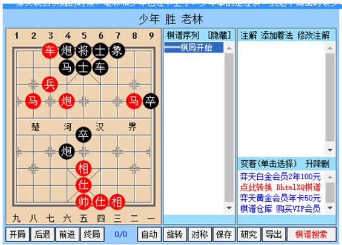
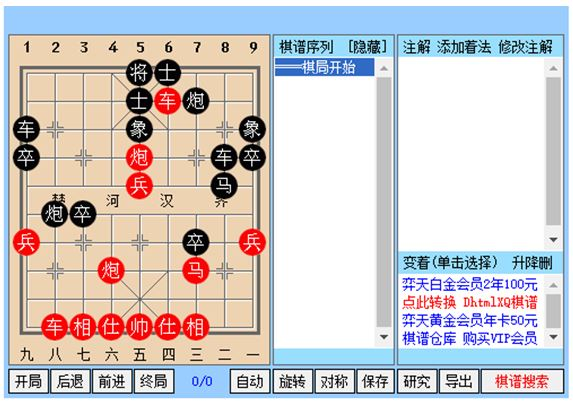

2025年摘录：不限题材，随便摘抄

最新 2.12：

图见        
https://blog.csdn.net/qq_34603425/article/details/128262599

引理：以内心F为顶点的角是90度+1/2角A，连接AF把角F分为两部分，利用三角形外角等于另外两个角，也就是180度-（角B+角C）/2 即180度-（180-角A）/2

反过来F为角平分线AG上的一点，且角BFC满足90度+1/2角A，那么必定是内心，当F移动时，BFC是递增的，所以不可能有两个不同的点满足这个值

在等边三角形三边的外面分别作一个等腰三角形，底角的大小分别为a,b,c，满足a+b+c<120,a,b,c<60,只要a,b,c足够小，那么这么做是可能的，但是要注意有些比较复杂的数学构造的可能性没有经过证明，那么后面的所有推理都是无效的。还有我们不仅要考虑满足条件后的情况，还要考虑不满足条件的时候会产生什么结果，做题家们以为在满足条件的时候证明了就万事大吉了，但现实往往是不满足条件的，这就需要你想办法去处理不满足条件的情况。那不满足条件的时候会怎么样？我脑子一片空白，懒得想。

这个<120度是错的，应该是=120度，他想说的就是P'和R'在中垂线上移动，然后Q'是要受到约束的，也就是a+b+c=120度。如果a+c就>120度，会导致b变为负值，这是什么情况？

延长线构成的角一定等于a,b,c，没看出来，这很显然吗？比如我把PRQ'固定，然后上下移动P',这个夹角是会变的，难道是我理解错了？先不管，就当a+b+c=120度吧。哦，他是这样的，先把P'和R'固定，然后上下拉动Q'使b的大小等于延长线的夹角

然后满足条件后，QR外面的两个角(a+b)+(a+c)<180度，所以延长线一定会在P'侧相交。这个在哪一侧相交没关系的吧。主要是为了构造一个三等分角的三角形和原题目相对应，那如果交在P侧，结论会变成什么样？

接下来延长线交于ABC，角A=60°-a，其他同理。连接P'P，这条线平分菱形QRPP'(其实就是一个等边三角形和等腰三角形的组合)。BPC=180-a=90+1/2(180-2a) 这步其实是恒等变形，我还在图上傻乎乎的想为什么会相等， 接下来=90°+1/2角P'，然后根据引理P是P'BC的内心，同理Q为ABQ'内心，R为AR’C内心。这样就得到AQ、AR是BAC的三等分线。

反过来，假设有一个三角形ABC，三等分线交于PQR,通过角BAC的三等分角=60度-a确定a的值，b、c同理，然后就可以构造出以P'R'Q'为顶点的三个等腰三角形，P’P是BP'C的角平分线（因为由三等分线的条件可知P是内心），这样就得到角BPC=90度+1/2角P'=90度+1/2（180-2a)=180-a,这样就得到Q'PC=a，然后角QPR=180-c-b-a，其他两个角也是这个值，三个角相等，所以PQR是正三角形。

不对啊，P'是由BQ和RC交出来的，所以角P'QR是不是等于a还要证的，我懒得想了。

原文作者的方法是随便取个正三角形P1R1Q1，构造出A'B'C'和ABC相似，然后易证P1R1Q1和PQR相似，这步太跳了，我一时没想明白，但直觉上肯定是相似的。  

想了一下，我认为正着证和反着证是不等价的，因为前面的构造隐含了P'QR是等腰三角形这个条件，从这个条件出发构造出三等分角。但是从任意三角形出发，三等分角交出来的P'点并不一定就能使得P'QR是底角为a得等边三角形，所以还要用其他方法去证明才行。

---------
分工是由两方面进行：
一方面，将所有工业的一切交涉事务付任于一个经理，这个经理对于他们负有特别的责任；
另一方面，每位董事都握有各个企业或数个企业的管理权，他们的利益是相联系的，或者他们的任务都是一样的。（资本主义已达到对于企业的一种组织的统制阶段。）

一部分董事专门对于德国国内工业方面，有时尤其是德国西部工业方面（因为西部是德国最发达的工业化区域），其他董事则专门对于外国及外国工业的关系，对于人事的关系，对于证券交易的关系等等。
除此以外，各位董事还时常负有一地方工业或一产业部门的管理责任；有的在电力公司的董事会中占据了地位；有的在化学工业、造船工业或砂糖工业的董事中占据了地位；更有在各个孤立的企业中占据了地位，在保险公司中占据了地位。

总而言之，随着大银行业务的发展与复杂，董事间的分工也基于其目的（或结果）愈加扩大；
这种目的就是扩张纯粹的银行业务，对于工业的一般问题及个个工业的特殊问题，愈能判断而通晓，在工业方面，更增银行的势力和活动。因为银行倾向于利用熟悉工业情况的人才，例如工厂主、旧办事员，尤其是在矿山或铁路等方面的人才，来参与管理机构，致使这种制度更加完善了。在法国的银行中，也有同样的制度，不过稍有差别而已。例如里昂信贷公司（Crédit Lyonnais）——法国大银行之一——设有一个金融研究所，常年雇用工程师、统计学家、经济学家、法律学家等等约五十人，常年费用达六七十万法郎。

这个研究所依次分为八部，其中第一部研究关于工业制度，第二部探求一般的统计，第三部研究关于铁路及航海，第四部关于公债，第五部关于金融事务......

其结果，一方面工业资本和金融资本合二为一——如布哈林（N. I. Bukharin）所说的“结合”——更加密切；另一方面，银行形成一种了普遍的性质。关于这个问题，可以引用耶第尔斯正确的叙述，他对这方面有较精密的硏究。

耶第尔斯：对工业的一切关系的观察结果，就可以认识为工业而活动的金融机构的普遍性质。恰同其他种类银行相反，恰同参考书上的必要叙述相反！依照这些叙述，以使银行在某一种事业或某一产业部门中，务须专门化，才不至于失掉稳定的立足地。

而大银行尽可能地勉力造成不同的多方面的工业关系，并且注意于补救不均现象；
这些不均现象可由某家银行的历史进程中看出，可由地域关系及产业部门之间的资本分配中看出。

一种趋势是期望造成工业联合的普遍化，
另一种趋势是欲使这种联合更为密切，更为稳固。

这两种趋势在德国的六大银行中算是实现过了，虽然尚未完全，但大体上已达到了相当大的范围和相等的程度了。

1901年11月19日，柏林最大的D银行（这是柏林四大银行之一，其开头字母为一D字）寄给德国北中西三部水泥公司(German Central-North-West Cement Company)一封信，信里是这样的：

“由18日某报纸上贵公司所登的广告，我们知道贵公司第二次常会决定本月30日召集，这次常会将要计议贵公司业务，将要使业务上有所变动。但是，这业务上的变动，我们是不能表示同意的。我们感到十分抱歉，因此我们往后不得不取消此前同贵公司发生的一切信用往来。倘若第二次常会能够不决议我们所不接受的事情，而且关于此点能使我们在将来获得相当的保证，那么，我们也必不至于拒绝同贵公司协商新的信用交易。”

实际上，这毕竟是小资本被大资本压迫的一种不平等现象。只在这个时候，而整个新兴企业虽高于小资本经营，免不了被大资本所压迫。小资本与大资本的斗争，重新开始，不过更加剧烈罢了。

这是理所当然的，拥有数十亿金的大银行，自能促使技术之进步，较前时代更为飞速。例如银行设立技术研究协会，其主要任务，亦都有利于结合的工业企业而已。在德国，“电力铁道研究协会”(Electric Railway Research Association)及中央科学技术研究所(Central Institute of Scientific and Technical Research)都属于这一类协会。大银行的董事们，不能不认识此后经济生活的新关系将由此而造成。但可惜他们没有认识这种现象的能力呢。

耶第尔斯：“近年来，无论何人只要观察一下大银行的董事和经理之交替，就不能不承认金融权力已转入了一部分人的掌握中，这一部分人以为对于生产发展上的积极干涉，已成为大银行的必要，且有与时俱增之重要性。银行的旧董事和新董事经常为此一问题发生不和，有时还会掀起他们间的暗斗。并且，问题就由此而发生了：干涉生产，对于充当信用机关的银行业务，能否确保无损；银行在活动范围——这种活动和银行负责任的信用媒介之任务毫无共通点，且使银行的活动更加依赖生产状况的盛衰中，抑或不能牺牲了银行的稳固的基础和确实的利益。这都是大多数银行的旧董事之意见；同时，大部分新董事以为近代大工业的发展伴随大银行的产生，则干涉工业更成为银行之急务。新旧董事对于这方面的辩论，综其意见，亦不过是一致地承认五大银行的新活动，尚未得一强固的基础与具体的目标而已。”

旧式的资本主义已逐渐逝去，新资本主义表示向另一方向发展的过渡。为了想和垄断与自由竞争而追求真实的原动力和具体的目标，这很显然是无益于追求一个不能解答的问题的解决。这种情形的实在事实，同御用的辩护者叔兰测加味刺、李夫曼及其他理论家对于粗略的“资本”所唱着的颂歌，完全不同。

大银行的新活动明确地应归于什么时期呢？对于这个重要问题，耶第尔斯给我们一个十分正确的答复：
‘工业企业其新对象、新形式及新功能的关系，正好地表明，采取中央集权和地方分权而组织的银行，在1890年以前及以后数年，尚未成为特别的经济现象；其实，这一出发点应归定于1897年，这时候，正是银行业务的大结合，是最先采用适合银行的新政策之地方分散组织的新形式。这一出发点甚至还可说更后点，因为1900年恐慌，非常加速工业和银行的集中过程，稳固这种过程，而且更使大银行同工业结合，这种结合已更成密切，更成精巧的一种垄断。’

所以，二十世纪初年是旧资本主义让位与新资本主义的关键，是一般资本的支配让位给金融资本的支配的转换关键。

---------
katago的大块死活bug：棋子越多，判断越错<br>
https://www.bilibili.com/video/BV1VV411A7bq

katago大块死活bug的精细测试。

乾杯乾就是就是

乾杯乾就是就是: 怎么安装katago

春原法米: 有简易安装包，解压就能用，b站搜一下就有

乾杯乾就是就是回复 @春原法米 :能给个关键词吗，搜了好久都找不到[保佑][保佑][保佑]

春原法米回复 @乾杯乾就是就是 :就搜围棋ai安装就行，我就这么搜的，找个直装的就行，要搭建的ai比较麻烦，直装的差点但绝对够用

乾杯乾就是就是回复 @春原法米 :谢谢，世界上还是好人多，祝你108胎😘😘

春原法米回复 @乾杯乾就是就是 :你恩将仇报(´；ω；`)

激發中消亡的躍迁電子回复 @春原法米 :摸摸

科西嘉小矮人: 有up主做过教程：全b站最详细！围棋AI安装教程

ec0079: 应该是因为抉择的时候会看前五步棋的位置吧，看到这个地方之前没下肯定是觉得以前的自己有道理就没管了

寂无忆痕: katago：棋长三尺，无眼自活

易词呃: up，现在还有这个问题吗？

邪灵行者: 长龙两眼当死棋，子多扎堆无眼活[doge][doge][doge]

照彻万川-: 上面黑棋多了你点完盖子放不下

光天辉夜: 也许和cnn架构本身特点有关

夕阳丶丶: 感觉就是数据集不够大吧，很多绝对不可能出现的场景他没有做过训练

孤独的风筝啊: 我拿今年9月的60B算的，完全不会出现这种问题[笑哭]应该是18B为了速度牺牲了什么，可能剪枝剪太多了。看来复盘还是得用60B[OK]

Player9: 專業測bug啊

OntarioTopLane: 我用katago复盘alphazero的棋谱就发现了许多bug，复杂局面下死活算不清

KataGoTest: 有没有可能是你算力太低了！

KataGoTest: katago在正常下棋的情况下是不太可能出现死活判断问题的，只有这种在实战下不出来的情况才可能出现。

科西嘉小矮人: 应该是你算力或者版本过低。katago比较新的版本应该比alphazero强不少了

嗨嗨嗨41331: 事实上ai根本不懂死活

汨湆渺渺㐅: 过于离谱的局面会是cnn产生错误的价值判断，然后把错误的值返回给蒙塔卡洛树，蒙特卡洛树同时承受离谱局面和离谱回报值双重debuff从而产生更严重的误判[doge] 说错了不负责

丶雷碧透心凉: katago的训练集都是实战下出来的，实战中下不出来的场景就可能有bug

Ptgs: 最高算力的 没有这些bug了

5HT羟色胺: ai可能认为只要子够多就是必定活棋的

不可知程度的能力: 已经找到本源bug了，接下来就是化简，看这个bug如何在更容易出现的局面下触发，最后就是试图实战下出化简后的局面。

白雪蝴蝶明月: 有日本棋手找了（78月份），绝艺紧急修复

-----------
前面的命题是经典结果的一种推广，该经典结果涉及具有连续变化切线的曲线长度的表示。

鉴于这个经典结果是已知的，如果有人打算解析地推广长度的概念，则可以采用前面的命题作为定义；可以看出，这样定义的长度不依赖于坐标轴的选择，并且，尤其地，当我们将右导数替换为左导数时，长度保持不变。

这个定义仅适用于可求长的曲线。 探究这个定义适用于哪些可求长曲线，或者它是否涉及所有可求长曲线，将会很有意义。 如果为了表达可求长曲线上的点，我们取弧长 t 作为参数，那么我们得到函数 f,φ, ψ，它们的导数是有界的； 前面段落的命题在以下情况下都适用：使得形如 Λd(f) - λd(f) 的某个差分不为零的点的集合构成一个零测集。
在通常的语言中，“一个表面的面积”指的是面积，即将与所考虑的表面在可达到的精确度下重合的多面体表面的各面的面积之和。

在几何学中，人们常常将一个表面  S  的面积视为某些多面体表面积的极限，这些多面体的极限是 S ；因此，定义面积就是确定所考虑的多面体序列。

类比于曲线长度的定义，人们首先考虑了内接多面体。根据皮亚诺（M. PEANO）(*)的说法，阿基米德所接受的假设等同于以下定义：

凸面表面的面积 是内接凸多面体表面积的上极限与外接多面体表面积的下极限的共同值；此外，在他所研究的情况下，阿基米德证明了这两个极限是一致的。

长期以来，人们认为一个表面的面积可以定义为内接多面体表面积的极限（**），其中各面的面积的最大值和边长的最大值趋向于零。然而，施瓦茨（SCHWARZ）在给热内基（GENÈCCHI）的一封信中指出，内接于有限圆柱体表面的多面体表面的面积没有上限。皮亚诺先生在1881-82年都灵大学的课程中也观察到了同样的结果，这些都是在施瓦茨信件发表之前；随后，埃尔米特（CH. HERMITE）在1882年下半年于科学学院教授的课程中（第二次印刷，第25页）也提到了这一点。

 (*) 参考意大利林琴科学院学报，会议记录 1890年

（**) 在内接多面体表面的顶点处，可以对应于平面 (u, v) 上的点，这些点对应于作为所提出表面的点的顶点。这样，多面体的每一个面对应于  (u, v)  平面上的一个多边形。我们在此以及以下的内容中假设这些多边形之间不重叠。

如果要通过考虑内接多面体来定义面积，则必须对这些多面体施加额外的条件。有时人们仅考虑那些面角不趋向于零 (*) 的多面体，或者那些面与切平面之间的角趋向于零的多面体。人们所考虑的大多数限制都不足以确保存在一个极限；此外，这些限制条件过于特殊，只有极限的存在才能证明它们的合理性。


我们还需要引用 HERMITE (埃尔米特)  (**)和 M. PEANO (皮亚诺) 提出的两个定义。

它们具有一个共同的特点，即不再依赖于对内接多面体的考虑，而是承认，作为将曲线分割成部分弧的推广，将曲面分割成由闭合轮廓界定的小块。

埃尔米特考虑一个具有*连续变化切平面的曲面z = f(x, y) 。 设 d 是 xy 平面上的一个轮廓，m 是这个轮廓内部的一个点，M 是曲面上与 m 对应的点，D' 是位于 M 处的切平面上的轮廓，切平面属于投影为 d 的曲面，D 是投影为 d 的曲面上的轮廓。 对 D，我们对应 D' 的面积（假设 d 是可求面积的）。 在此基础上，我们将曲面分割成小块； 与所使用的轮廓相关的数值之和是面积的近似值。 当小块的数量无限增加，并且这些小块的最大直径趋于零时，面积是这些近似值的极限。（极限的存在假设限制曲面的轮廓不是任意的； 对于之前的定义也是如此。）

因此，埃尔米特的定义明确地引入了坐标轴的概念，而且它也不是通过考虑内接多边形来推广长度定义的方法。

(*)： 关于这些定义的尝试，请参见上面已经引用的 M. PEANO 的注释。)

(**) 在一篇最近的文章中 (“关于长度、表面和体积的概念” - 德国数学家协会年报 1901) ，M. RUNGE (龙格) 采用了以下长度和面积的定义 。

以曲线 C 上的每个点为圆心，作一个半径为 r 的球。 至少在一个这样的球内部的点的集合是可测量的，设 V(r) 为其测度； 比值 V(r)/πr2 当 r 趋于零时的极限（如果存在）被称为 C 的长度。 同样地，如果 V(r) 是到 S 的距离小于 r 的点的集合的测度，那么比值 V(r)/2r 定义了 S 的面积。

Peano 先生的定义不存在这些不便之处。设有一条闭合空间曲线 $C$，可以证明，至少在简单情况下，存在一条闭合平面曲线 $c$，使得在任意平面上，曲线 $C$ 和 $c$ 的正交投影限定的面积相等(\*)。对于每条曲线 $C$，我们将其限定的平面区域的面积作为其对应的数值。同样，在长度的定义中，对于任意部分弧线，我们将其两端点之间的线段长度，即该线段在相同正交投影（\**）下的长度，作为其对应的数值。

在此基础上，我们将一个曲面划分为多个封闭轮廓，并使每个划分部分对应于这些封闭轮廓的数值总和。Peano 先生将该数值的上界称为这些数值之和的面积极限。  

除 Peano 先生的定义外，其他所有定义都假设某个数列的极限存在，而该极限的存在性仅在切面变化连续的曲面上得到证明。然而，在这种情况下，我们不是给每个曲面直接赋予一个数值，而是将其划分为若干平面区域，并以这些区域的面积总和作为极限、上界或下界。  

这种方法给出的数值等于二重积分：  $\iint (EG - F^2) \ du \ dv$

任何不导向该数值的几何定义，因与既定习惯不符，都应当被摒弃。一种仅适用于切面变化连续的曲面的面积定义，可能具有一定的几何吸引力，但并不能作为可行的定义标准，因为要在定义之前就已知待定义的数值，这是不合理的。

(*) 如果曲线 $C$ 的投影具有多个重合点，则 $C$ 限定的面积应按如下曲线积分计算： $\frac{1}{2} \int x \ dy - y \ dx.$  

(**) 这里讨论的不是曲线的投影，而是弧线投影的两端点之间的距离。

皮亚诺先生提出的定义适用于所有边界是轮廓 C 的曲面，正如上文所述，这些轮廓 C 可以与平面轮廓 c 建立对应关系。 但是，只有当可以在曲面上绘制足够多的轮廓 C，以便可以将曲面分割成直径可以任意小的部分，并且这些部分的边界是曲线 C 时，这个定义才真正有意义； 只有在这种情况下，面积才取决于曲面所有部分的形状。 例如，如果曲面具有连续变化的切平面，则满足此条件。

在这种情况下，曲线 C 形成一个集合，其基数为连续统的基数，那么面积就被定义为一个数值集合的上极限，而该数值集合的基数也是连续统的基数。

为了计算面积，必须在这个集合中分离出一个可数无穷的趋向上极限的数字序列； 可以证明，如果考虑由轮廓 C 对曲面进行的一系列分割，并且这些轮廓的最大直径趋于零，那么与这些分割相对应的数值将趋于面积。 但并不明显的是，是否总能通过可数无穷次操作来达到皮亚诺先生定义的数值； 此外，关于这个数值，除了它的存在性之外，我们一无所知。

一个曲面由以下方程定义：

x = f(u, v), y = φ(u, v), z= ψ(u, v)

其中 (u, v) 是平面区域 D 中的一个点。

我们不认为通过将 u, v 表示为区域 D' 中的点的坐标u1, v1的函数而获得的曲面与原曲面不同； 在 D 和 D' 之间存在一个单值且连续的点对应关系。 我们称拥有这两种表示为同一曲面的参数表示。

对应于限定区域 D 的曲线的点的集合构成了曲面的边界曲线 (*)。

如果可以通过坐标变换公式从一个曲面变换到另一个曲面，则称这两个曲面相等。

如果曲面 S 对应的 (u, v) 平面区域 D 是对应于曲面 Si 的区域 Di 的总和，且对应于 Di 的 S 的部分与 Si 相同，则称曲面 S 是曲面 Si 的和，Si 的数量可以是有限的或无限的。

如果曲面 Sp 由函数 fp, φp, ψp 给定，且 fp, φp, ψp 与 f, φ, ψ 在同一区域内定义，并一致收敛于 f, φ, ψ，则称曲面 S 是给定曲面 Sp 的极限。

(*) 因此，我们将 “曲面” 这个名称保留给通常所称的仅有一个轮廓、单连通的曲面片（calotte）。我们需要对曲面上的点重复第 1 章中关于曲线上点的讨论。

-------
太阳刚巧照在街心。<br>
街上连个人影都没有，但窗隙间，门缝里，却有很多双眼睛在偷偷的往外看，看一个人。<br>
看路小佳。<br>
路小佳正在一个六尺高的大木桶里洗澡，木桶就摆在街心。<br>
水很满，他站在木桶里，头刚好露在水面。<br>
一套雪白崭新的衫裤，整整齐齐的叠着，放在桶旁的木架上。<br>
他的剑也在木架上，旁边当然还有一大包花生。<br>
他一伸手就可以拿到剑，一伸手也可以拿到花生，现在他正拈起一颗花生，捏碎，剥掉，抛起来，张开了嘴。<br>
花生就刚好落入他嘴里。<br>
他显然惬意极了。<br>
太阳很热，水也在冒着热气，但他脸上却连一粒汗珠都没有。<br>
他甚至还嫌不够热，居然还敲着木桶，大声道：“烧水，多烧些水。”<br>
立刻有两个人提着两大壶开水从那窄门里赶出来，一人是丁老四，另一人面黄肌瘦，留着两撇老鼠般的胡子，正是粮食行的胡掌柜。<br>
他看来正像是个偷米的老鼠。<br>
路小佳皱眉道：“怎么只有你们两个人，那姓陈的呢？”<br>
胡掌柜赔笑道：“他会来的，现在他大概去找女人去了，这地方中看的女人并不多。”<br>
他刚说完这句话，就立刻看到了一个非常中看的女人。<br>

这女人是随着一阵清悦的铃声出现的，她的笑声也正如铃声般清悦。<br>
太阳照在她身上，她全身都在闪着金光，但她的皮肤却像是白玉。<br>
她穿的是件薄薄的轻衫，有风吹过的时候，男人的心跳都可能要停止。<br>
她的手腕柔美，手指纤长秀丽，正紧紧的拉着一个男人的手。<br>
胡掌柜的眼睛已发直，窗隙间，门隙里的眼睛也全都发了直。<br>
他们还依稀能认得出她，就是那“很喜欢”路小佳的红衣姑娘。<br>
谁也想不到她竟会拉着叶开的手，忽然又出现在这里。<br>
就算大家都知道女人的心变得快，也想不到她变得这么快。<br>
丁灵琳却全不管别人在想什么。<br>
她的眼睛里却全不管别人在想什么。<br>
她的眼睛里根本就没有别人，只是看着叶开，忽然笑道：“今天明明是杀人的天气，为什么偏偏有人在这里杀猪？”<br>
叶开道：“杀猪？”<br>
丁灵琳道：“若不是杀猪，要这么烫的水干啥？”<br>
叶开笑了，道：“听说生孩子也要用烫水的。”<br>
丁灵琳眨着眼，道：“奇怪，这孩子一生下来，怎么就有这么大了。”<br>
叶开道：“莫非是怪胎？”<br>
丁灵琳一本正经的点点头，忍住笑道：“一定是怪胎。”<br>
门后面已有人忍不住笑出声来。<br>
笑声突又变成惊呼，一个花生壳突然从门缝里飞进来，打掉他两颗大牙。<br>
路小佳的脸色铁青，就好像坐在冰水里，瞪着丁灵琳，冷冷道：“原来是要命的丁姑娘。”<br>
丁灵琳眼波流动，嫣然道：“要命这两个字多难听，你为什么不叫我那好听一点的名字？”<br>
路小佳道：“我本就该想到是你的，敢冒我的名字的人并不多。”<br>
丁灵琳道：“其实你的名字也不太好听，我总奇怪，为什么有人要叫你梅花鹿呢？”<br>
路小佳淡淡道：“那也许只因为他们都知道梅花鹿的角也很利，碰上它的人就得死。”<br>
丁灵琳道：“那么你就该叫大水牛才对，牛角岂非更厉害？”<br>
路小佳沉下了脸。<br>
他现在终于发现跟女人斗嘴是件多不智的事，所以忽然改口道：“你大哥好吗？”<br>
丁灵琳笑了，道：“他一向很好，何况最近又赢来了一口好剑，是跟南海来的飞鲸剑客比剑赢来的，你知道他最喜欢的就是好剑了。”<br>
路小佳又道：“你二哥呢？”<br>
丁灵琳道：“他当然也很好，最近又把河北的‘虎风堂’打得稀烂，还把那三条老虎的脑袋割了下来，你知道他最喜欢的就是杀强盗了。”<br>
路小佳道：“你三哥呢？”<br>
丁灵琳道：“最好的还是他，他和姑苏的南宫兄弟斗了三天，先斗唱、斗棋，再斗掌、斗剑，终于把‘南宫世家’藏的三十坛陈年女儿红酒全赢了过来，还加上一班清吟小唱。”<br>
她嫣然接着道：“丁三少最喜欢的就是醇酒美人，你总该也知道的。”<br>
路小佳道：“你姐夫喜欢的是什么？”<br>
丁灵琳失笑道：“我姐夫喜欢的当然是我姐姐。”<br>
路小佳道：“你有多少姐姐？”<br>
丁灵琳笑道：“不多，只有六个。”<br>
路小佳道：“三个哥哥，六个姐姐？”<br>
丁灵琳笑道：“你难道没听说过丁家的三剑客，七仙女？”<br>
路小佳忽然笑了笑，道：“很好。”<br>
丁灵琳眨了眨眼，道：“很好是什么意思？”<br>
路小佳道：“我的意思就是说，幸好丁家的女人多，男人少。”<br>
丁灵琳道：“那又怎么样？”<br>
路小佳道：“你知道我一向不喜欢杀女人的。”<br>
丁灵琳道：“哦。”<br>
路小佳道：“只杀三个人幸好不多。”<br>
丁灵琳好像觉得很有趣，道：“你是不是准备去杀我三个哥哥？”<br>
路小佳道：“你是不是只有三个哥哥？”<br>
丁灵琳忽然叹了口气，道：“很不好。”<br>
路小佳道：“很不好？”<br>
丁灵琳道：“他们不在这里，当然很不好。”<br>
路小佳道：“他们若在这里呢？”<br>
丁灵琳悠然道：“他们只要有一个人在这里，你现在就已经是条死鹿了。”<br>
路小佳看着她，目光忽然从她的脸移到那一堆花生上。<br>
他好像因为觉得终于选择了一样比较好看的东西，所以对自己觉得很满意，连那双锐利的眸子，也变得柔和了起来。<br>
然后他就拈起颗花生，剥开，抛起。<br>
雪白的花生在太阳下带着种赏心悦目的光泽，他看着这颗花生落到自己嘴里，就闭起眼睛，长长稳稳的叹了口气，开始慢慢咀嚼。<br>
温暖的阳光，温暖的水，花生香甜。<br>
他对一切事都觉得很满意。

丁灵琳却很不满意。<br>
这本来就像是一出戏，这出戏本来一定可以继续演下去的。<br>
她甚至已将下面的戏词全都安排好了。<br>
谁知路小佳却是个拙劣的演员，好像突然间就将下面的戏词全都忘记，竟拒绝陪她演下去。<br>
这实在很无趣。<br>
丁灵琳叹了口气，转向叶开，道：“你现在总该已看出他是个怎么样的人了吧。”<br>
叶开点点头，道：“他的确是个聪明人。”<br>
丁灵琳道：“聪明人？”<br>
叶开微笑着道：“聪明人都知道用嘴吃花生要比用嘴争吵愉快得多。”<br>
丁灵琳只恨不得用嘴咬他一口。<br>
叶开若说路小佳是个聋子，是个懦夫，那么这出戏一样还是能续演下去。<br>
谁知叶开竟也是一个拙劣的演员，也完全不肯跟她合作。<br>
路小佳嚼完了这颗花生，又叹了口气，喃喃道：“我现在才知道原来女人也一样喜欢看男人洗澡的，否则为什么还不肯走？”<br>
丁灵琳跺了跺脚，拉起叶开的手，红着脸道：“我们走。”<br>
叶开就跟着她走。<br>
他们转过身，就听见路小佳在笑，大笑，笑得愉快极了。<br>
丁灵琳咬着牙，用指甲用力捏叶开的手。<br>
叶开道：“你的手痛不痛？”<br>
丁灵琳道：“不痛。”<br>
叶开道：“我的手为什么会很痛呢？”<br>
丁灵琳恨恨道：“因为你是个混蛋，该说的话从来不说。”<br>
叶开苦笑道：“不该说的话，我也一样从来就不说的。”<br>
丁灵琳道：“你知道我要你说什么？”<br>
叶开道：“嗯。”<br>
丁灵琳道：“你认为不该说？”<br>
叶开道：“因为说也没有用了。”<br>
丁灵琳道：“为什么没有用？”<br>
叶开道：“因为路小佳已知道我们是故意想去激怒他的，也知道在这种时候绝不能发怒。”<br>
丁灵琳道：“你怎么知道他知道？”<br>
叶开道：“因为他若不知道，用不着等到现在，早已变成条死鹿了。”<br>
丁灵琳冷笑道：“你好像很佩服他。”<br>
叶开道：“但最佩服的却不是他。”<br>
丁灵琳道：“是谁？”<br>
叶开道：“是我自己。”<br>
丁灵琳忍住笑，道：“我倒看不出你有哪点值得佩服的。”<br>
叶开道：“至少有一点。”<br>
丁灵琳道：“哪一点？”<br>
叶开道：“别人用指甲捏我的时候，我居然好像不知道。”<br>
丁灵琳终于忍不住嫣然一笑，放松了手，道：“有时你的确像是块大木头。”<br>
她拉着他的手，笑得更甜。<br>
她忽然也对一切事都觉得很满意了，竟没有发现有双嫉恨的眼睛正在瞪着他们。<br>

--------
尊敬的朋友们，各位阁下，各位国家元首、政府首脑和第一夫人，以及各位前第一夫人、各位代表团团长、各位特别来宾……

今天，我们心中既充满了悲伤，也充满了感激。我们缅怀逝者，同时也感谢卢旺达今日的成就。对于在世的幸存者们，我们感激不尽。

我们请求你们肩负起和解的重担，去做不可能的事，而你们一直都在这样做，为了我们的国家，每一天都在继续做着不可能的事，我们感谢你们。

随着岁月的流逝，幸存者们的后代越来越难以忍受那种渴望亲人却从未谋面，甚至从未有机会出生的寂寞。今天，我们也想念着你们。我们的眼泪在内心流淌，但我们像一个家庭一样继续前进。

无数卢旺达人也抵制了种族灭绝的号召。有些人为了这份勇气付出了最高的代价，我们缅怀他们的记忆。我们的道路漫长而艰难。卢旺达被我们所遭受的巨大损失彻底击垮。我们吸取的教训是用鲜血铭刻的。

但是，我们国家取得的巨大进步显而易见，这是我们共同选择重建国家的成果。一切的基础是团结。

那是第一个选择：相信一个重新团结的卢旺达的理念，并按照这个理念生活。第二个选择是扭转问责制的箭头，它曾经指向外部，指向我们的国界之外。现在，我们首先要对彼此负责。最重要的是，我们选择超越悲剧的界限去思考，成为一个拥有未来的民族。

今天，我们也特别感谢来自世界各地的朋友和代表们与我们一同出席。在这样一个沉重的日子里，你们的到来让我们深感荣幸。你们为卢旺达的重生所做的贡献是巨大的，帮助我们站到了今天的位置。

我想感谢一些国家和个人，同时也要请求原谅，因为无法提及所有值得感谢的人。例如，乌干达多年来承担着卢旺达国内问题的重担，甚至因此受到指责。

当时，埃塞俄比亚和厄立特里亚的领导人和人民帮助我们开始了重建。事实上，今天在场的阿比·艾哈迈德总理甚至在种族灭绝事件发生后，曾是一名年轻的维和人员。

肯尼亚、布隆迪和刚果民主共和国接纳了大量卢旺达难民，并为他们提供了一个家。坦桑尼亚也这样做了，并在许多关键时刻发挥了独特的作用，包括主办和促进阿鲁沙和平进程。在这里，我必须特别提到已故的朱利叶斯·尼雷尔总统，他体现了奠定这一基础的精神。刚果共和国一直是重建和其他方面的富有成效的合作伙伴。

今天在场的许多国家也派出了他们的儿女到卢旺达担任维和人员。那些士兵没有辜负卢旺达；是国际社会辜负了我们所有人，无论是出于蔑视还是懦弱。

在今天在场的各位中，我向已故塞内加尔上尉姆巴耶·迪亚涅的遗孀和女儿致敬，他是一位英雄，他从死亡线上救出了许多卢旺达人。

1994年在联合国安理会，道义上的清醒来自尼日利亚、捷克共和国，甚至远在天边的新西兰。他们的大使们有勇气用它正确的名称来称呼种族灭绝，并抵制来自更强大国家的政治压力，以掩盖真相。尼日利亚大使易卜拉欣·甘巴里和捷克大使卡雷尔·科万达今天与我们同在，我们向你们致敬。即使在政府政策在种族灭绝期间甚至之后都站在历史错误的一边的国家，也总有一些人因他们的诚实和人道而脱颖而出。我们永远感激不尽。

我们也要感谢过去30年来，我们在欧洲、美国、亚洲的合作伙伴以及许多国际组织和慈善机构给予我们的实际支持。

一个值得注意的团结的例子来自南非，这只是其中之一。事实上，我们整个非洲大陆的希望和痛苦都可以在1994年的那几个月里看到。当南非结束种族隔离并选举纳尔逊·曼德拉为总统时，卢旺达正在进行20世纪最后一次种族灭绝。新的南非出资聘请古巴医生帮助重建我们支离破碎的医疗卫生系统，并允许卢旺达学生以当地费用就读其大学。

-----------
准备工作的知识和技能将致力于军事力量的创建、培训和维持。至于给它们什么总称，我们暂且不论，但可以看出，炮兵、筑城艺术、所谓的基础战术、军事力量的整个组织和行政管理以及所有类似事项都属于此类。

战争理论本身则致力于为战争目的使用这些已培训的手段。它仅需要这些准备工作的结果：即了解其所承担手段的主要特性。

我们称之为狭义的战争艺术，或用兵理论，或军事力量使用理论，这些对我们来说都指同一件事。

这一理论将讨论战斗作为真正的战斗，将行军、驻营和宿营视为或多或少与之相同的状态。至于部队供给，它将不视为其固有活动，而是根据其结果，像其他给定的情况一样考虑。

这一狭义的战争艺术又分为战术和战略。前者关注单个战斗的形态，后者关注其使用。两者都仅通过战斗触及行军、驻营和宿营的状态，这些对象因此或战术性，或战略性，取决于它们是关联到战斗的形态还是意义。

当然，会有许多读者认为对如此接近的战术和战略进行如此细致的区分是极其多余的，因为它对实际用兵没有直接影响。确实，要为理论划分寻求战场上的直接效果，那将是一个极其迂腐的人。

每一个理论的首要任务是厘清混乱和纠缠不清的概念和观念；只有当人们就名称和概念达成共识后，才能希望在考察事物时以清晰和轻松的方式前进，才能确信始终与读者站在同一立场。战术和战略是在空间和时间中相互渗透但本质上不同的活动，若不精确确定其概念，就根本无法清晰思考其内在法则及其相互关系。

对于认为这一切毫无意义的人，要么根本不允许任何理论考察，要么他的理解尚未受到那些混乱和令人困惑的、缺乏坚实基础、无法达成平静结论、时而平庸、时而狂想、时而漂浮在空洞普遍性中的观念的困扰——我们之所以如此频繁地听到和读到关于实际用兵的这类观念，是因为很少有科学研究精神曾在这一主题上停留。

起初，人们仅将战争艺术理解为军事力量的准备。

早先，人们一直用战争艺术或军事科学这一名称，只理解那些致力于物质事务的知识和技能。武器的配置和准备、使用，要塞和工事的建造，军队的组织和行动机制，都是这些知识和技能的对象，它们旨在展示战争中可用的军事力量。在这里，人们面对的是物质材料，是单一的活动，本质上不过是从手工逐渐提升为精致的机械艺术的活动。所有这一切与实际战斗的关系，不过如同剑匠的技艺与击剑术的关系。关于危险时刻的使用、持续的相互作用，以及精神和勇气在其赋予方向上的实际运动，尚未有所讨论。

--------
命题六十九 自由人的德性在避免危险和征服危险两方面同样伟大。

证明 根据第四部分命题七，一种情绪只能被另一个相反且更强的情绪所制止或排除。而盲目的勇敢或恐惧（根据第四部分命题三与五）可以被视为力量相当的情绪。因此，克制勇敢和克制恐惧所需的心灵德性或意志力量（关于意志力量的定义参见第三部分命题五十九附释）必然是同等强大的；换言之，自由人避免危险和征服危险都需要同等的心灵德性。此证。

绎理 因此对于一个自由人来说，适时地逃避与战斗同样需要强大的意志力量，这就是说，自由人选择逃避和选择战斗都需要同样的意志力量和机警。

附释 关于意志力量，我已在第三部分命题五十九附释中解释过。此处所说的危险是指任何可能造成伤害的事物，如痛苦、怨恨、争执等。

命题七十 生活在无知人群中的自由人将尽可能避免他们的恩惠。

证明 每个人（根据第三部分命题三十九附释）都是根据自己的情感来判断什么是善。因此，如果一个无知的人给予他人恩惠，他将根据自己的看法来估价，如果他发现受惠者对此估价较低（根据第三部分命题四十一），他将感到痛苦。但自由人（根据第四部分命题三十七）致力于与他人建立友谊，而不愿以施惠者根据其情感对所施恩惠的估价为标准来回报他人。他只希望依据理性的自由判断来指导自己和他人，并且只做他认为最重要的事。因此，为了避免引起无知者的怨恨，不屈服于他们的喜好，一个自由人将尽可能避免他们的恩惠，并遵循理性的指导。此证。

附释 我说"尽可能避免他们的恩惠"，意味着并非完全拒绝。因为尽管无知，他们毕竟是人。在困难时刻，他们也能给予出于人性的帮助，这是最珍贵的帮助。有时接受并按照他们的意愿回报是必要的。此外，谢绝他人恩惠时必须谨慎，不可表现出轻视施惠者的态度，也不可显得吝啬或害怕回报。这样可以避免在试图避免他们的怨恨时反而激起他们的怨恨。所以在避免他人恩惠时，我们必须兼顾利益和礼貌。

命题七十一 唯有自由人之间才能有最诚挚的感恩。

证明 唯有自由人（根据第四部分命题三十五及其绎理一）之间才最有益，或有最真挚的友谊联系，而且（根据第四部分命题三十七）他们才会以同样热烈的爱互相施恩。所以（根据情绪界说第三十四），唯有自由人之间才有最诚挚的感恩。此证。

附释 被盲目欲望支配的人之间的感恩，大多是交易性质或诱惑手段，而非真正的感恩。

需要注意的是，负恩本身不是一种情绪，但仍然是卑鄙的，因为负恩通常表明一个人被怨恨、愤怒、骄傲、贪婪等情绪所主导。因为一个人由于愚蠢而不知如何回报，不能称为负恩。不被娼妓、盗贼等的馈赠所诱惑，不为不义之事，更不能称为负恩。相反，如果一个人不因任何馈赠而危及自身或公共幸福，这恰恰表明他具有正直的德性。

命题七十二 自由人绝不做欺骗的事；他的行为永远正直。

证明 如果一个自由人做出欺骗的事，就他作为自由人而言，他这样做是遵循理性的命令（因为只有遵循理性，他才能称为自由的）；这样（根据第四部分命题二十四）做欺骗的事将成为一种德行，因此（根据同一命题）做欺骗的事将有利于个人自我保存。这无异于说，人与人之间只是在言语上一致，而在事实上相互对立，对人类更有益（这是不合理的，根据第四部分命题三十一绎理）。所以自由人绝不做欺骗的事，他的行为永远正直。此证。

附释 如果有人问，为了保全性命，理性是否会劝导一个人不守信用，我仍然以同样的理由回答：如果理性劝导这样做，它应该劝导所有人都这样做。这将意味着理性普遍教导人们在与他人结盟和遵守公共法规的契约时使用欺骗，这无异于说理性教导人们实际上不要有公共法规，这是不合理的。

命题七十三 一个受理性指导的人，在国家中遵守公共法令生活，比独自生活更为自由。

证明 一个受理性指导的人（根据第四部分命题六十三），他服从法令，并非出于恐惧，而是就他遵循理性的命令，努力维持自身存在而言，换言之（根据第四部分命题六十六附释），就他努力过自由生活而言，他愿意（根据第四部分命题三十七）尊重公共生活和公共福利。因此（正如第四部分命题三十七附释二所指出的），他愿意遵守国家的公共法令而生活。所以一个遵循理性指导的人，为了过一个更自由的生活，愿意维持国家的公共法纪。此证。

附释 这些关于人的真正自由的论述，都与精神力量有关，换言之（根据第三部分命题五十九附释），与意志力和仁爱力有关。我认为不需要在此详细论证精神力量的特质，也不需要详细说明为何具有精神力量的人不会憎恨、发怒、嫉妒、激怒、轻视他人，更不会骄傲自大。因为所有这些，以及与真正生活和真正宗教有关的一切德性，都可以在第四部分命题三十七和命题四十六中得到证实。这两个命题指出，憎恨可以被与之相反的爱所征服，并且每个遵循理性指导的人都希望他人能分享他所追求的善。

此外还需注意第四部分命题五十附释以及其他地方所说，精神力量坚强的人认为一切事物出于神性之必然性高于一切。因此，凡是常人认为是恶的、有害的，看似无序、可怕、不公正、卑鄙的，他都认为是由于我们观察事物时割裂和紊乱造成的。基于这个原因，他最主要的努力在于理解事物本身，并排除一切妨碍追求真知的障碍，如怨恨、愤怒、嫉妒、轻浮、傲慢以及此前讨论过的其他情绪。所以我已经说过，他总是尽可能努力做善事，追求自身快乐。至于人的德性能在多大程度上达到这些目的，以及人的德性究竟有多大能力，我将在下面第五部分中指出。

附录

在这一部分中关于正当生活方式的论述未按顺序排列，以便一目了然。我为了更容易由此推彼，将许多意思分散在各命题中分别证明。因此我在此对其进行总结归纳如下：

（一）我们的一切追求或欲望，都源于我们性质的必然性，因此可以根据人的性质作为最近因来理解，或者作为自然的一部分来理解，但就人作为自然的一部分而言，不能单独从其自身，也不能脱离其他个体来正确理解。

（二）源于我们本性、可以单独从人性自身理解的欲望，是与心灵相关的欲望，就心灵被视为正确观念的构成而言。相反，其他欲望仅与未能正确理解事物的心灵相关。因此这类欲望的力量及其增减不由人的力量决定，而是由外界事物的力量决定。所以前一种欲望可正当地称为主动行为，后一种欲望只能称为被动情感。前者总是表示人的力量，而后者仅表示人的软弱和知识不完备。

（三）主动行为或由人的力量或理性决定的欲望永远是善的；其余欲望则可善可恶。

（四）在生活中对我们最有利的莫过于尽量完善我们的知性或理性。人生的最高快乐或幸福即在于知性或理性的完善。因为幸福无非是由于对神有直观知识而产生的心灵满足。使知性完善无非是理解神，理解源于神本性必然性的神的属性与行为。所以遵循理性指导的人的最终目标，即他为节制其他欲望的最高欲望，是能够正确地理解自身和一切可作为其理智对象的事物的欲望。

（五）没有理智就不会有理性的生活；事物之所以善，只在于能促进人们享受理智所决定的心灵生活。反之，唯有阻碍人的理性趋于完善、阻碍人享受理性生活的事物才可称为恶。

（六）因为一切以人的本性为致动因的事物都必然是善的。由此可知，只有起于外在原因的事物才可能对人是恶的。换言之，唯有就人是整个自然的一部分、被迫服从自然规律、在几乎无限多的情形下适应自然整体而言，才可能产生恶的行为。

（七）要想人不是自然的一部分、不遵循自然的共同秩序是不可能的。但如果他能置身于与其性质相符的个体之中，他的活动力量将得到促进和扩张。反之，如果他处于与其性质毫无相似之处的个体中，除非大幅改变自身，否则很难适应。

（八）对于自然中存在的任何事物，只要我们判断它为恶或认为它阻碍我们保持和享受理性生活，我们就可以用最平和的方法排除它。反之，凡我们认为是善或最有利于维持存在和过理性生活的事物，我们都可以设法取用和适当使用。总的来说，每个人都有最高的自然权利去做他判断有利于自身的事情。

（九）除了同类的其他个体，没有什么东西与一物的自身性质更为相符。所以对于人维持自身存在和享受理性生活最有利的，除了遵循理性指导的人外，别无他物。既然据我们所知，没有任何个体比遵循理性指导的人更为完美，这表明除了教育人们最终能遵循理性权威生活外，一个人没有更好的方式来展示自己的技巧和才能。

---------
根据乔治·米勒（1956年）的研究，我们在心理上一次只能把握约七个项目的集合。

是否只有有限个整数？我们无法想象这种情况。我们的原始概念将是错误的。数是基于不同事物的概念。差异的概念是精确的。如果它不精确，我们就无法无限迭代。如果否认差异，也就否认了迭代。

正如我之前所说，从有限到无限需要一个巨大的飞跃。特别是，为了概览（或遍历）一个无限集合，必须求助于康德意义上的直观延伸——某种无限直观。

要达到整数的整体，需要一个跳跃。概览它预设了无限直观。这是一个心理学分析。关键是它是否产生客观确信。这是分析的开端。

在第7章中，我讨论了从整数到整数总体的转变。一旦我们认识到存在无限集合，就会发现无穷公理对于集合概念是真的：存在某些无限集合。集合论的其他重要标准公理是：限制性的外延性和基础公理；获得更多集合的子集形成、幂集和替换。

外延性公理可以被视为集合的定义特征——与概念或属性形成对比。要理解基础公理，我们简要回顾一些基本事实：

康托尔集合论引起我们对集合概念的正确视角的注意。根据这个经受时间考验的视角，存在一个集合的等级或类型层次，由通过迭代收集给定对象成集合的操作所构成。

如果我们试图可视化所有集合的宇宙，并选择排除非集合的对象，我们会得到一个奇特的树（或者更像是许多树的混乱），以空集为根，每个集合是一个节点，如果一个集合属于另一个集合，它们就由一个分支连接。

为了从这种混乱中获得某种秩序，人们使用幂集操作。显然，空集必须在底部。如果考虑空集的幂集，我们得到空集的所有可能子集，如此等等。在代表所有集合的原始树状混乱中，除了根节点外，每个节点都有向下的分支。因此，每个节点最终必须回到空集。

基础公理是集合不能属于自身这一特征的概括。它说每个集合都可以在某个阶段获得，或者每个集合集合都在等级层次中有一个最小成员。

子集形成公理（或"理解"公理）说，如果一个集合（对象或集合）包含在另一个集合中，那么它也是一个集合。

最初我们通过定义属性来理解集合。然后我们外延化，将集合概念为其元素作为构成要素的统一体。当然，如果我们能概览或遍历一个集合的成员，我们就能概览通过省略某些成员而获得的集合的任何部分。

幂集公理说，一个集合的所有子集可以被收集成一个集合。

幂集操作涉及一个跳跃。在这第二个跳跃中，我们不仅考虑集合的成员为已给，还考虑从集合中选择成员的过程。取出集合成员的所有可能方式是产生其所有子集的一种"方法"。然后我们感觉可以概览所有这些子集的集合。

我们理想化，例如整数或有限集合：
(a) 到无限整体的可能性
(b) 带有省略

这样我们得到一个具体直观的想法，然后继续前进。毫无疑问，这种理想化——以任何程度——是古典数学的基础。

从无限集合到其幂集的跳跃，比理想化整数到无限整体的可能性，更多地体现了主观与客观、知识与存在的辩证法。

与整数的整体不同，无限集合的所有子集的整体甚至不可数。很难想象我们如何知道或直观地认识这些子集中的每一个。因此，如果知道一个集合预设知道其所有成员，就很难相信我们能知道无限集合的幂集。

在我看来，这个熟悉的障碍可以通过诉诸集合论中的客观主义来克服。根据客观主义的集合概念，一个集合的存在预设其所有元素的存在，但不预设对其所有元素的个别知识。

这种区分的要点与哥德尔在恶性循环原理中的类似区分有关：没有任何整体可以包含预设这个整体的成员。

从无限集合的所有子集的存在到其幂集的可概览性，显然涉及我们直觉的强烈理想化。就存在而言，这种预设不是时间优先性的问题。关键在于，概念上，对象必须存在，以便它们的集合（作为其统一）能够存在。

替换公理说，如果在一个集合和一个集合之间存在一一对应，那么这个集合也是一个集合。例如，如果我们从一个无限集合开始，反复应用幂集操作，我们得到一个无限集合，包括原始集合、其幂集，直到每个有限迭代。由于这个集合与自然数集合存在一一对应，根据替换公理，它也是一个集合。

替换公理是一个更深层的公理。它不具有其他熟悉公理在任何更密切分析迭代集合概念之前所具有的那种直接明显性。它一开始并不十分明显。这可以从以下事实看出：它最初未被包含在策梅洛的公理系统中，弗伦克尔最初还给出了一个错误的表述。启发性地说，到达它的最佳方式如下：
 从迭代集合概念的思想本身可以推导出：如果已经获得了一个序数α，从任何集合y开始，幂集操作P迭代α次将得到一个集合pa(y)。但是，出于同样的原因，似乎可以推导出：如果不是P，而是取类型层次中的某个更大跳跃，例如从x到通过迭代x的最小序数α次所得到的集合的转换Q，Q'(y)同样是一个集合。

现在，假设对任何可想象的跳跃操作都是如此——甚至对那些通过引用所有集合的宇宙或使用选择操作定义的操作——这等同于替换公理。

迭代总是通过已经获得的序数：对于任何序数α，我们可以发明从集合到集合的任何跳跃并将其迭代α次。在每种情况下，我们得到一个迭代跳跃α次的操作。然后我们得到一个对这个操作封闭的宇宙。

通过这种方式，我们证明了替换公理和集合的等级或类型层次。你可以对任何集合进行良序，然后任何跳跃可以被迭代与其良序的序数次数一样多，从而从任何给定集合转换到另一个（可能是新的）集合。

----------
唯物主义思想的危机及其机械主义形式，承认某些不变的元素、事物的本质等，这是形而上学的唯物主义。

列宁虽然不是很专业的哲学家，但凭借哲学分析的方法，能够洞察科学和思想中复杂的世界观问题，并指出了一条道路，这条道路是他们自己未能认识到的，将物质从具体的表象提升到本质层面。

物质是客观现实，独立于人类意识且被反映。

在范畴意义上，物质是世界的本质；在非范畴意义上，物质就是整个世界。其定义超出了形式逻辑的范畴，进入辩证法领域。

一个更广泛的定义是不可能的，因为缺乏更广泛的概念。只能通过与对立面的对比来定义。

定义的意义在于：物质是世界上所有存在的事物和现象的总和；是所有可被抽象的属性、联系、关系、形式和运动；是普遍的实体。

活动性和可变性是物质唯一不变的属性。我们可以想象物质的所有转变，除了产生和消灭的过渡。

从现代物理学的角度看，宇宙的初始状态是物理真空。可以将其称为物理零点，宇宙的激发源。

20世纪初的革命性突破是辩证法的一课。物质不存在作为绝对的底层基质，也不等同于其属性的总和。运动是物质存在的方式。物质在持续不断地变化中保持自身。它以无限多样的形式、形态、过程、现象、状态等存在。没有任何具体的质态可以等同于物质本身。

科学危机表明，物质范畴对于科学具有巨大的世界观意义。自然历史唯物主义并非完全成型，而是大多数人作为一种"自发的、哲学上无意识的自然研究者的本性"的朴素信念。

世界观在生活中的图景

人的世界图景决定了对世界的感知。

他们区分科学的、哲学的和宗教的世界图景。但如果科学和哲学可以相互支撑，宗教则与科学相互对立。在当前，这些文化形式彼此隔离。

世界图景是：

世界观的理性构成 <br>
历史上形成的整体世界图像 <br>
基于科学、哲学或宗教表征形成的图景 <br>
在宗教世界观中，重点在于信仰，而非证明。宗教教义不允许任何批评，改变其基本原则。宗教要求人们顺从，而非思考。

欧洲宗教的主要原则：

创造论原则： <br>
本体论方面：存在是（不可解释的）非存在的诞生 <br>
认识论方面：存在和上帝的不可知性 <br>
预定论原则： <br>
本体论方面：世界和历史是神圣意图实现拯救人类的过程 <br>
本体论方面（决定论原则）：世界存在某些现象可以不受任何因果关联 <br>
认识论方面（启示原则）：上帝的意图不可知，但在圣经中向人类揭示 <br>
文化为人提供多种宗教回应世界观问题的选择。但世界性宗教仅承认三种：基督教、伊斯兰教和犹太教。

不可避免的是一种意识现象，它必须无意识地指向超自然。宗教信仰的非宗教方面是：

相信自身力量 <br>
不相信权威 <br>
主观确信某些事物 <br>
科学和哲学中的认知离不开信仰。任何科学和哲学理论都基于一些不需要证明的前提，即基于信仰。

哲学世界图景可以依据科学或宗教表征。根据其主要组成部分，形成主要类型：

唯物主义哲学世界图景

基本哲学原则——世界的不可穷尽性和统一性。在唯心主义哲学中，作为世界本质被视为理念；在唯物主义哲学中为物质。

当代世界图景在很大程度上由科学表征决定，主导领域是物理学。其革命性发展得益于如德谟克利特、托勒密、哥白尼、牛顿、达尔文、爱因斯坦等科学家。

科学世界图景最符合唯物主义哲学世界图景。

科学世界观的基本原则

世界物质性原则

1.1) 世界物质统一性原则

本体论方面：世界上所有存在的都是物质的形式、类型、层次和属性。存在的基本现象是运动、空间和时间。在辩证唯物主义中，这些被视为物质的属性，即其不可分割的普遍特性。意识也是高度组织的物质的一种属性。

认识论方面：体现在人类知识的相对整体性和系统性。在此基础上进行对应现实存在层面的分类。

1.2) 物质不可穷尽原则

本体论方面：原则在于承认物质的无限质的多样性，包括其形式、类型、层次、规律等。

辩证唯物主义对物质的无限性的解释包括：

首先，通过存在的多样性、无限性、不可创造性和不可毁灭性。
其次，通过物质的持续自运动和自我发展。
不可毁灭性在数量和质量层面理解：物质的任何属性都不能被最终消除。物质存在，只是从一种形式转化为另一种形式。

保持物质实体的原则是物理学能量、质量等保存定律的深层意义。

认识论方面：体现为人类对世界认知的原则性未完成性。但这不是不可知论，而是意味着对真理的无限接近和完善。

决定论原则
意味着现象受原初实质和客观现实的制约。

2.1) 因果性原则

意味着客观世界所有现象都是有条件的。

2.2) 规律性原则

意味着客观世界所有现象的普遍自然联系和相互依存。

--------
没有比自然更引人入胜、更值得研究的主题了。理解这一伟大机制，发现其中起作用的各种力量和支配这些力量的规律，是人类智慧所追求的最高目标。

自然界中蕴藏着无限的能量。而那永恒地接收并传递这种无限能量的正是以太。认识到以太的存在及其所发挥的功能，是现代科学研究最重要的成果之一。仅仅放弃“远程作用”这一观点，转而假设一种遍布整个空间、连接所有粗大物质的介质，就使思想家免除了长久以来的疑虑，并通过开启一个全新视野——带来新的、意想不到的可能性——使我们对那些久已熟知的现象重新产生了兴趣。这对于物理学的启蒙者来说，就像了解火器或蒸汽机的运作机制对野蛮人那样重要。那些我们曾经视为难以解释的奇迹般现象，如今在我们眼中已呈现出不同的面貌。感应线圈的火花、白炽灯的光辉、电流和磁力所显现出的机械效应不再遥不可及；它们不再像过去那样令人费解，而是使我们联想到一个简单的机制。尽管其精确本质仍然处于猜测中，但我们知道真相不可能再长时间被隐藏，而我们本能地感到，理解正逐渐在我们眼前显露。我们依然欣赏这些美丽的现象、这些奇异的力量，但我们已不再束手无策；在某种程度上，我们可以解释它们、说明它们，并且对最终揭开环绕它们的谜团抱有希望。

我们能够在多大程度上理解周围的世界，这是每个观察自然者终极关切的问题。我们感官的粗糙使我们无法认识到物质更深层次的构造，而天文学——作为最宏大、最实证的自然科学——所能教给我们的，也仅仅是发生在我们眼前、在我们身边的一些现象；至于那无限广阔宇宙中无数星辰和太阳的遥远部分，我们一无所知。但在远远超出我们感官极限的地方，精神仍能指引我们，因此我们可以希望，即使是那些未知的世界——无论是无限微小还是无限宏大——在某种程度上也能为我们所了解。然而，即使这种知识能传达到我们这里，探索的心灵仍会发现一道也许永远无法逾越的屏障，那就是对于貌似存在、而其外在表现仅构成我们所有哲学薄弱基础的事物的真正认识。

在自然无量、无处不在的能量形式中——这种能量不断变化、不断运动，宛如灵魂般赋予静止的宇宙生机——电与磁或许是最迷人的。我们每天都会观察到重力、热和光的效应，我们很快就习惯它们，它们也很快在我们眼中失去了那种奇妙和神奇的特性；但电和磁凭借其独特的相互关系、看似双重的性质，在自然界诸力中独树一帜，其吸引、排斥和旋转的现象、那些神秘因素的奇异表现，总能激发我们的思考和研究。究竟什么是电，什么是磁？这些问题一次又一次地被提起。最有才智的头脑也不断与这些问题斗争；然而，这些问题至今仍没有得到完全的答案。不过，虽然我们今天仍无法准确地阐明这些奇特力量的本质，但在解决这一问题上我们已经取得了长足的进展。我们现在相信，电磁现象是归因于以太的；也许我们可以正当地说，静电效应是以太受压时的表现，而动态电和电磁效应则是以太运动的结果。但这仍然未能解答：究竟什么是电和磁？

首先，我们自然会询问：电是什么？电是否真的存在？在解释电现象时，我们可以谈论电或电的状态、条件或效应。如果我们谈论电效应，就必须区分两种性质相反且相互抵消的效应，因为观察表明确实存在这两种相反的效应。这是不可避免的，因为在以太这样的介质中，我们不可能施加应力，或产生任何形式的位移或运动，而不在周围介质中造成等效且相反的效应。

但是，如果我们谈论电作为一种事物，我认为我们必须放弃两种电的概念，因为两种这样的事物存在的可能性极低。我们怎么能想象存在两种数量相等、性质相似但性质相反、都附着在物质上、相互吸引并完全中和的事物呢？尽管这种假设由许多现象暗示，且对解释这些现象非常方便，但它并没有太多值得推荐的地方。

如果电是一种事物，那么只能有一种这样的事物，可能存在过剩和匮乏，但更可能是其状态决定了正负特性。富兰克林的旧理论虽然在某些方面有所不足，但从某个角度看，仍是最可信的理论。尽管如此，两种电的理论仍被普遍接受，因为它似乎以更令人满意的方式解释了电现象。但是，一个能更好地解释事实的理论不一定就是真理。聪明的头脑会发明适应观察的理论，几乎每个独立思考的人都对这个主题有自己的看法。

我提出这些观点并非是为了推进某种观点，而是希望更好地让你了解我将要描述的一些结果，展示我所遵循的推理和我所做的偏离。

我坚持认为存在一种我们一直称之为电的事物。问题是：那是什么？或者说，在我们所知的所有事物中，我们有什么最充分的理由称之为电？我们知道它的行为类似于不可压缩的流体；自然界中必定有恒定数量的电；电不能被产生也不能被销毁；更重要的是，光的电磁理论和所有观测到的事实告诉我们，电现象和以太现象是相同的。

因此，立即浮现出这样的想法：电可能被称为以太。事实上，洛奇博士在某种程度上已经提出了这种观点。他的著作被人广泛阅读，许多人被他的论点说服。他的卓越能力和主题的迷人性使读者为之着迷；但当印象褪去时，人们意识到他只是提供了巧妙的解释。

我必须承认，我不相信存在两种电，更不相信有双重构成的以太。以太作为固体对光热波的行为，以及作为流体对穿过它的物体运动的令人困惑的表现，通过假设它处于运动状态（正如威廉·汤姆森爵士所建议的）可以得到最自然、最令人满意的解释；但不管怎样，没有什么能使我们确定地得出结论：虽然流体不能传输每秒几百或几千次的横波，但它可能无法传输每秒数百万亿次的振动。同样，没有人能证明从交变电流机产生的横波以太存在，特别是在每秒产生少量交变的情况下；对于这种缓慢的扰动，静止的以太可能表现为真正的流体。

--------
必要对立于同一律的命题的对等命题是原理命题（Satz des Grundes）。这里“原理命题”可以理解为一般意义上的原理命题，或者说是因果关系命题，或者是按雅可比式区分而同时包括两者的命题（参见《致斯宾诺莎的信》页 415⁄4）；同时，在论及物质问题时，这一命题被看作是体现在概念间、或从概念延伸至其现实，或从客观现实引向另一个客观现实的关系。

较早的哲学传统在“原理命题”的表述中体现了其理性追求的见证，而该命题在理性与反思之间的摇摆以及向后者的转变，很适当地体现在雅可比对它所作的区分中——即他分别将它视为逻辑上的原理命题和因果关系，并据此给出了理解哲学和批判哲学的道路，这正是我们要探讨的。雅可比在原理命题中认识到其作为理性认识原理的重要性，“totum parte prius esse necesse est”（见大卫·休谟著，第94页），或者说：个别事物仅在整体中才能得到确定；它只有在那绝对同一中才具有现实性，而这种同一性正是将可区分的事物纳入其中而成为绝对整体的。

雅可比指出，在一种关系中，“totum parte prius esse necesse est”无非就是“idem est idem”（相同即相同），而在另一种关系中则不然。从这一观点出发，他认为必须对这两种关系作出根本区分并严格加以区分——这便是他所谓的基本独断论的开端。事实上，雅可比将原理命题理解为纯粹的矛盾命题，并以此意义称之为“逻辑上的”，即作为一种抽象统一体，而这统一体必然要求将“异质的”（differente）部分作为经验性内容加以引入；他还区分出一种因果关系，在这种关系中，那种为使概念达到同一而额外附加的经验事实得到反映，并据此主张，将这种因果关系按照其特性看作是一种经验概念。
 
他阐明这一点的方式（参见大卫·休谟著，第99页及以后几页，以及他在《致斯宾诺莎的信》中引用的内容页415）显示出洛克派和休谟式经验主义的奇特特质，其中还混杂了一大块德国分析性独断论的成分，其程度甚至超过了芒德尔松式的表现——这一点，世界在从众神的统治中解放出来后，就连康德也未能足够感谢。

在原理命题及其整体中，雅可比发现，其中缺失了某些部分，而他不得不从整体之外另行寻找这些部分；或者，按照他的理解，所有部分实际上已经在整体中联合、共存，但这种由整体直观地获得各部分的认识仅仅是一种主观且不完整的认识，因为它缺乏客观的生成过程与连续性，为此，总体中还必须附加上因果关系。

现在，请听下面一系列语句中关于因果与连续概念的绝对必然性（“Ursache und Wirkung”以及“Sukzession”）的推演，这正是雅可比所称的（参见大卫·休谟著，第111页及以后）

对于我们的人的意识（我这里顺便补充，也就是指每个有限存在者的意识），必然存在着除那直接感知的事物之外的另一真实事物，而这个事物是会被感知到的。”

“当两个被创造出来的、彼此相互独立的存在者，以这样一种关系相对时，即其中一个对另一个产生作用，那么就存在着一个扩展的整体。”

“我们感受到我们存在的多样性是以一种纯粹统一的整体联系在一起的，这个整体我们称之为‘我’。……在一个存在中，不可分割的部分决定了它的个性，或者说使其成为一个真正的整体……我们在身体的延展中，整体的存在是不可分割的；它处处展现为那种把众多部分不可分离地联合在一起的同一个整体。”

“如果个体同时具有超越自身起作用的能力……那么，若要使这种作用发生，它们必然会以直接或间接的方式触及其它存在。”

“我们称‘触碰’时那种不可穿透的直接后果为‘阻力’。——所以，只要有触碰，就必然有双方互不渗透，因而产生阻力、作用与反作用。”

这两者正是连续性（Sukzessivität）以及时间和对时间表象的根源。

因此，基于这样的前提：即存在着各个以自身方式展示且彼此处于共同体中的有限存在，上述关于延展、因果关系以及连续性（或绝对有限性的存在）的概念推演就得以成立；同时，也由此得出结论：这些概念必然是所有有限的、以自身方式显现的存在所共有的，并且在事物自身中，它们作为独立于概念之外的对象，具有真正的客观意义。

正是这样的一种概念，必须在每次经验中以完整的、原初的形式予以给定——没有它们的客观性，就没有概念任何对象；没有了这些概念，任何认识都无从可能——因此，这样的概念无可非议地称为一般的或必要的概念，而由此衍生出的判断和推论便是先验认识。

必要对立于同一律命题的必然对偶命题，就是所谓‘原理命题’。在这里，‘原理命题’应理解为一般意义上的原理命题，或因果关系命题，或者是按雅可比区分后兼具二者特性的命题（参见《致斯宾诺莎的信》，第415页4段）；而论及物质问题时，它被视为从概念到概念、或从概念到其现实、或从一个客观现实到另一个客观现实而不断推进的关系。

较早的哲学教育在表达原理命题时，已充分体现出其理性追求的见证。这个命题在理性与反思之间的摇摆，以及向反思转化的过程，可以用雅可比所作的区分形象地描述：他把它分为作为逻辑命题的原理和作为因果关系的命题，并由此指出理解哲学以及批判哲学的途径，这正是我们即将探讨的。雅可比认为，在原理命题中，理性认识的根本原则显现为“totum parte prius esse necesse est”（参见大卫·休谟，第94页），或者说：个别的东西仅在整体中才得以确定；它只有在那绝对的同一性中才具有现实性，而这种同一性正是将可区分的事物纳入其中而构成绝对整体的。

雅可比指出，在某种关系中，“totum parte prius esse necesse est”不过意味着“idem est idem”（相同即相同），而在另一种关系中则不然。从这种意义上讲，必须对这两者加以严格区分——这便是他所说的基本独断论的起点。雅可比将原理命题理解为纯粹的矛盾命题，并在此意义上称之为‘逻辑命题’——即作为一种抽象的统一体存在，为它必须让那个与概念同一的异质部分作为经验内容加入，同时在一成因果关系中，对附加于概念同一性的经验部分进行反思和陈述。他主张：这种因果关系，按照其自身特性，正是作为一个经验概念来确定的。

这种论述方式（参见大卫·休谟，第99页及以后，以及他在《致斯宾诺莎的信》中引用的内容，第415页）表现出洛克式和休谟式经验主义的奇特特征，而且其中还掺杂了德国分析性独断论的成分，其程度甚至比芒德尔松那一派更甚——这也是为什么自从人类从诸神统治中解放出来后，连康德也未能充分感激这一点。

由此前提，即认为存在着各个以自身方式表现出来的有限存在者，这些存在者是共同体中的个体，从这一点出发，我们得出了关于延展、因果关系、连续性（Sukzessivität）以及绝对有限性存在的概念推导。同时，也得出结论：这些概念必然属于所有有限的、以自身方式表现的存在，并且在事物本身中，它们作为不依赖于概念之外的对象而存在，因而具有真正客观的意义。

正因为如此，那些在一切经验中必须完全并作为首要 已经给定的概念——没有它们的客观性，就没有任何概念的对象，也没有任何认识可能——就统称为普遍或必要的概念，而由此派生出的判断和推论则是先验知识。

更重要的是，如果这些（概念、原理等）不仅仅适用于人及其特殊的感性，而且还能从单个事物的本质及其普遍的共同体中推导出来，那么它们所获得的那种绝对、无条件（无条件这一概念是否有等级？）的普遍性就要高得多。

但是，如果我们的感官实际上一点也不教导我们事物的性质，也不告知我们事物之间的相互关系和联系，甚至连它们在先验理解中确实存在这一点都无法证明；而我们的理智仅仅依赖于那种客观上空洞、毫无事物内容表现的感性，以便按完全主观的规则塑造出纯粹主观的形式，那么在真正的理智上，我就什么也不是，周围的一切也都不是。

而我，我的“一切”，最终也只是某种空洞幻影的虚饰，仅仅是“形之形”、“幽灵”而已。

这样的体系完全摧毁了对真理认识的所有要求，只留下对最重要对象的一种盲目、毫无认识内容的信仰——这种信仰迄今尚未被期望给予人类。

--------
然而，“爱上帝胜过一切，爱邻如己”这一命令的可能性，是完全可以统一的。因为作为一项命令，它要求对一条规定爱的法律加以尊重，绝不允许任由人自选是否将其作为自己的原则来遵行。可是，把对上帝的爱理解为一种情感倾向（即病态的爱）是不可能的；因为上帝并非感官对象。同样，对人的爱虽然在情感上是可能的，但也不能下达命令说“你必须爱人”，因为没有任何人能够仅凭命令去爱某人。

因此，真正被称为“爱”的，仅仅是那种实践中的爱。这里，“爱上帝”就意味着乐于遵行他的诫命；“爱邻如己”则意味着乐于履行对他的一切义务。可是，将这一切固定为准则的命令，并不能要求我们在每一项义务行为中都抱有那种情感态度，只能命令我们去追求这种态度而已。因为命令“应当乐于去做某事”本身就蕴含了内在的矛盾：如果我们本来就自发地知道自己应该去做某事，或者如果我们意识到自己乐于去做这件事，那么再下这样一个命令就完全没有必要；反之，若我们做了某事却并非出于乐意，而只是因为对法律的敬畏去做，那么这样的命令，反而会使那种仅仅基于敬畏而形成的信念受到破坏。

因此，这条普遍的律法——正如《福音书》中所有的道德诫命一样——表现了道德信念的完美全貌。尽管这种道德理想（即圣洁的理想）对任何受造之物来说都是无法完全达到的，但它仍然是我们应当趋近的原型，我们应当以不间断、且无穷无尽的进步努力向它看齐。因为如果一个理智的受造物真的能完全乐于遵行所有的道德律法，那就意味着他体内连引诱他偏离律法的欲望都不存在；而克服这种欲望，总是要求主体付出牺牲，即需自我约束，即内在地被迫去做自己并不完全乐意去做的事情。可是，一个受造物永远也不可能达到那种道德信念的境界。

因为一个受造物，在追求使自己状态得以完全满足的过程中，总是处于依赖状态，因而它永远不可能完全摆脱那些出于物质原因而产生的欲望和倾向——这些欲望和倾向的根源与道德法则截然不同，不能自然而然地与之契合。因此，受造物始终必然需要在考虑到这些欲望的前提下，以道德强制（而非单纯的自愿顺从）来构建其行动准则，即以对法律的敬畏来作为服从法律的动力，而这种敬畏促使人们去履行那些虽不情愿但必须做的义务，而不是出于一种不会激起内心对抗的爱。与此同时，那种单纯对法律的爱（因为如果一味出于爱，法律就不再具有强制力，而道德性也就从客观要求转为主观的圣洁，进而不再等同于美德）理应成为受造物不断追求，尽管永远难以企及的持久目标。实际上，我们对于那既被高度评价又（因自知自身弱点）感到畏惧的东西，往往经过种种轻率的尝试而转化为一种满足感，把原本庄严的敬畏演变为好感，而尊敬则渐渐变为爱；至少，如果一个受造物能够达到这种境界，就意味着它体内根本不再存在任何会引诱它偏离法律的欲望——因为克服那种欲望，总是需要牺牲和自我约束，做出自己并不全然乐意的事情。

这种论述的目的，并非旨在通过明确概念来解释所引用的福音命令，从而助长对上帝之爱的宗教狂热，而是在于精确定义那种道德心态，尤其是关于对人的义务方面的态度，同时也警惕或预防那种仅仅停留在道德狂热层面上的空洞激情。依照我们的认识，人所处的道德层次（以及我们认为每一个理性受造物应有的层次）就是对道德法则的敬畏。人服从法则的态度，不是出于自愿的好感，也不可能在无人督促的情况下自发地乐意付诸行动，而必须建立在义务之上；而一个人每次能体现出的道德状态，就是美德，也就是说，是在不断斗争中展现的道德心态，而并非那种自以为是、拥有完全纯净意志状态的圣洁。

----------
在某个地方，仍然有民族和群体，但我的兄弟们，不在我们这里：这里有国家。

国家？那是什么？好吧！现在竖起你们的耳朵，因为现在我要向你们讲述关于民族之死的话语。

国家是所有冷酷怪物中最冷酷的一个。它也冷酷地撒谎；而这个谎言从它的口中爬出：”我，国家，就是人民。“这是谎言！是创造者创造了民族，并在他们之上悬挂了一种信仰和一种爱：因此，他们服务于生命。

这是谎言！是创造者创造了民族，并将信仰和爱悬挂在他们之上：因此他们为生命服务。

毁灭者是为许多人设置陷阱并称之为国家的人：他们将一把剑和一百种欲望悬挂在他们之上。

凡是还有民族的地方，那里的人们都不理解国家，并且憎恨它，视其为对习俗和法律的邪恶之眼和罪恶。

我给你们这个标志：每个民族都用自己的语言谈论善与恶：邻居听不懂。它在习俗和法律中发明了自己的语言。

但国家用所有善与恶的语言说谎；无论它说什么，它都在说谎——无论它拥有什么，都是偷来的。

它的一切都是假的；用偷来的牙齿咬人，这咬人的东西。甚至它的内脏也是假的。

善与恶的语言混乱：我把这个标志给你们，作为国家的标志。真的，这个标志预示着死亡的意志！真的，它在向死亡的传教士招手！

出生的人太多了：国家是为了多余的人发明的！

看看它是如何吸引那些多余的人的！它是如何吞噬、咀嚼和反刍他们的！

“地球上没有什么比我更伟大：我是上帝安排的手指”——野兽咆哮道。不仅长耳朵和短视的人跪了下来！

啊，即使在你心中，伟大的灵魂，它也在低语着它阴暗的谎言！啊，它猜到了那些富裕的心，它们乐于奉献自己！

是的，它也猜到了你们，你们这些战胜了旧神的征服者！你们在战斗中疲惫不堪，现在你们的疲惫仍在为新的偶像服务！

新的偶像想让英雄和光荣的人围绕着它！它喜欢沐浴在善良的良心中——这冰冷的野兽！

如果你崇拜它，新的偶像愿意给你一切：这样它就买到了你的美德的光辉和你骄傲的眼睛的目光。

它想用你来引诱那些多余的人！是的，一个地狱般的技巧被发明出来了，一匹死亡的马，在神圣荣誉的装饰中叮当作响！

是的，一种为许多人的死亡被发明了出来，它自诩为生命：真的，这是对所有死亡布道者的心灵服务！

我称之为国家，在那里所有人都是毒药的饮用者，无论好坏：国家，在那里所有人都会失去自我，无论好坏：国家，在那里所有人的缓慢自杀——被称为“生命”。

看看这些多余的人！他们窃取发明家的作品和智者的宝藏：他们称他们的偷窃为教育——一切都会变成疾病和不幸！

看看这些多余的人！他们总是生病，他们吐出胆汁，称之为报纸。他们互相吞噬，却无法消化。

看看这些多余的人！他们获得财富，却因此变得更加贫穷。他们想要权力，首先是权力的撬棍，很多钱——这些无能的人！

看看这些敏捷的猴子！他们互相攀爬，并因此把自己拉入泥潭和深渊。

他们都想要登上王位：这是他们的疯狂——仿佛幸福就坐在王位上！通常，泥潭坐在王位上——而王位也常常坐在泥潭上。

在我看来，他们都是疯子、攀爬的猴子和过于激动的人。他们的偶像，这个冷酷的怪物，散发着恶臭：在我看来，所有这些偶像崇拜者都散发着恶臭。

我的兄弟们，你们难道想窒息在他们嘴巴和欲望的烟雾中吗？还不如打破窗户，跳到外面去！

避开这股恶臭！离开这些多余之人的偶像崇拜！

避开这股恶臭！离开这些人祭的蒸汽！

现在，大地仍然向伟大的灵魂敞开。许多座位仍然空着，供孤独者和成双成对者使用，在那里，宁静的海洋的气息吹拂着。

伟大的灵魂仍然拥有自由的生活。真的，拥有得越少，就越不会被占有：赞美这微小的贫穷！

在那里，国家停止的地方，才开始了那个不是多余的人：才开始了必要的歌，那独一无二的、不可替代的歌。

在那里，国家停止的地方——看看吧，我的兄弟们！你们看到它了吗，那个超人的彩虹和桥梁？从市场的苍蝇中

逃离吧，我的朋友，逃进你的孤独中！我看到你被伟人的喧嚣所麻痹，被小人的刺所刺痛。

森林和岩石知道如何与你一起沉默。再次像你喜爱的那棵树一样，那棵枝叶茂盛的树：它静静地、警觉地悬挂在大海上。

孤独结束的地方，市场就开始了；市场开始的地方，伟大的演员的喧嚣和有毒的苍蝇的嗡嗡声也开始响起。

在这个世界上，最好的东西如果没有一个表演者，就毫无价值：人们称这些表演者为伟人。

人们很少理解伟大，也就是创造。但它对所有表演和扮演伟大事物的人都有感觉。

世界围绕着新价值观的创造者旋转——无形地旋转。但人们和荣耀围绕着演员旋转：这就是世界的进程。

演员有精神，但缺乏精神的良知。他总是相信他最能让人相信的东西——相信自己！

明天他会有一个新的信仰，后天会有一个更新的信仰。

他和人民一样，有着敏锐的感觉和变化无常的天气。

推翻——对他来说就是证明。使人疯狂——对他来说就是说服。而鲜血在他看来则是所有论据中最强的。

一个只溜进精致耳朵的真理，他称之为谎言和虚无。真的，他只相信那些在世界上制造巨大噪音的神！

市场上充斥着庄严的小丑——民众为他们的伟人感到骄傲！他们是他那一刻的主人。

但这个时刻催促他们：所以他们催促你：他们也想要你说是或否。呜呼，你想在赞成和反对之间放置你的座位吗？”“为了这些无条件者和催促者，你应该没有嫉妒，你这真理的爱好者！真理从未依附过任何一个无条件者的手臂。

为了躲避这些突然出现的人，回到你的安全之地：只有在市场上，人们才会被“是？”或“否？”袭击。

所有深井的体验都是缓慢的：它们必须等待很长时间才能知道是什么落入了它们的深处。

一切伟大的事物都发生在远离市场和荣耀的地方：新价值的创造者总是居住在远离市场和荣耀的地方。

我的朋友，逃到你的孤独中去吧！我看到你被毒蝇叮咬。逃到那里，那里吹着粗犷而强劲的风！

逃进你的孤独中！你曾经太靠近那些渺小和可怜的人生活。逃离他们无形的报复！对他们来说，你只不过是他们报复的对象。

不要再举起你的手臂对抗他们！他们不计其数，而你的命运不是成为苍蝇拍。

这些卑微而可怜的人不计其数；许多骄傲的建筑物已经被雨滴和杂草摧毁。

你不是石头，但你已经被许多雨滴掏空。你最终会被更多的雨滴击碎。

我看到你被有毒的苍蝇弄得疲惫不堪，我看到你被刺伤了一百处，鲜血淋漓；而你的骄傲甚至不愿发怒。

他们天真无邪地想要你的鲜血，他们没有鲜血的灵魂渴望鲜血——因此他们天真无邪地刺伤你。

但你，深刻的人啊，即使是小小的伤口，你也会感到深深的痛苦；甚至在你痊愈之前，同样的毒虫就爬过你的手。

你太骄傲了，不屑于去杀死这些贪婪的人。但要小心，不要让承受他们所有恶毒的不公成为你的厄运！

他们也用他们的赞美在你周围嗡嗡作响：他们的赞美是一种侵扰。他们想要靠近你的皮肤和血液。

----------
[蒙回前诗：智慧生魔多象，魔生智慧方深。智魔寂灭万缘根，不解智魔作甚。]

话说宝玉在林黛玉房中说“耗子精”，宝钗撞来，讽刺宝玉元宵不知“绿蜡”之典，三人正在房中互相讥刺取笑。那宝玉正恐黛玉饭后贪眠，一时存了食，或夜间走了困，皆非保养身体之法；[庚辰双行夹批：云宝玉亦知医理，却只是在颦、钗等人前方露，亦如后回许多明理之语，只在闺前现露三分，越在雨村等经济人前如痴如呆，实令人可恨。但雨村等视宝玉不是人物，岂知宝玉视彼等更不是人物，故不与接谈也。宝玉之情痴，真乎？假乎？看官细评。]幸而宝钗走来，大家谈笑，那林黛玉方不欲睡，自己才放了心。忽听他房中嚷起来，大家侧耳听了一听，林黛玉先笑道：“这是你妈妈和袭人叫嚷呢。那袭人也罢了，你妈妈再要认真排场他，可见老背晦了。”[庚辰双行夹批：袭卿能使颦卿一赞，愈见彼之为人矣，观者诸公以为如何？]

宝玉忙要赶过来，宝钗忙一把拉住道：[庚辰侧批：的是宝钗行事。]“你别和你妈妈吵才是，他老糊涂了，倒要让他一步为是。”[庚辰双行夹批：宝钗如何？观者思之。]宝玉道：“我知道了。”说毕走来，只见李嬷嬷拄着拐棍，在当地骂袭人：[庚辰侧批：活像过时奶妈骂丫头。]“忘了本的小娼妇！[庚辰侧批：在袭卿身上去叫下撞天屈来。]我抬举起你来，这会子我来了，你大模大样的躺在炕上，见我来也不理一理。一心只想妆狐媚子哄宝玉，[庚辰侧批：看这句几把批书人吓杀了。]哄的宝玉不理我，听你们的话。[庚辰侧批：幸有此二句，不然我石兄袭卿扫地矣。]你不过是几两臭银子买来的毛丫头，这屋里你就作耗，如何使得！好不好拉出去配一个小子，[庚辰侧批：虽写得酷肖，然唐突我袭卿，实难为情。]看你还妖精似的哄宝玉不哄！”[庚辰侧批：若知“好事多魔”，方会作者这意。]袭人先只道李嬷嬷不过为他躺着生气，少不得分辨说“病了，才出汗，蒙着头，原没看见你老人家”等语。后来只管听他说“哄宝玉”、“妆狐媚”，又说“配小子”等，由不得又愧又委屈，禁不住禁不住哭起来。

宝玉虽听了这些话，也不好怎样，少不得替袭人分辨病了吃药等话，又说：“你不信，只问别的丫头们。”李嬷嬷听了这话，益发气起来了，说道：“你只护着那起狐狸，那里认得我了，叫我问谁去？[庚辰侧批：真有是语。]谁不帮着你呢，[庚辰侧批：真有是事。]谁不是袭人拿下马来的！[庚辰侧批：冤枉冤哉！]我都知道那些事。[庚辰侧批：囫囵语，难解。]我只和你在老太太，太太跟前去讲了。把你奶了这么大，[庚辰侧批：奶妈拿手话。]到如今吃不着奶了，把我丢在一旁，逞着丫头们要我的强。”[庚辰眉批：特为乳母传照，暗伏后文倚势奶娘线脉。《石头记》无闲文并虚字在此。壬午孟夏。畸笏老人。]一面说，一面也哭起来。彼时黛玉宝钗等也走过来劝说：“妈妈你老人家担待他们一点子就完了。”李嬷嬷见他二人[庚辰侧批：四字，嬷嬷是看重二人身分。]来了，便拉住诉委屈，将当日吃茶，茜雪出去，与昨日酥酪等事，唠唠叨叨说个不清。[庚辰侧批：好极，妙极，毕肖极！][庚辰眉批：茜雪至“狱神庙”方呈正文。袭人正文标目曰“花袭人有始有终”，余只见有一次誊清时，与“狱神庙慰宝玉”等五六稿，被借阅者迷失，叹叹！丁亥夏。畸笏叟。]

可巧凤姐正在上房算完输赢账，听得後面一片声嚷，便知是李嬷嬷老病发了，排揎宝玉的人。－－正值他今儿输了钱，[庚辰侧批：找上文。]迁怒于人。[庚辰侧批：有是争竞事。]便连忙赶过来，拉了李嬷嬷，笑道：“好妈妈，别生气。大节下老太太才喜欢了一日，你是个老人家，别人高声，你还要管他们呢，难道你反不知道规矩，在这里嚷起来，叫老太太生气不成？[庚辰侧批：阿凤两提“老太太”，是叫老妪想袭卿是老太太的人，况又双关大体，勿泛泛看去。]你只说谁不好，我替你打他。我家里烧的滚热的野鸡，快来跟我吃酒去。”[庚辰侧批：何等现成，何等自然，的是凤卿笔法。]一面说，一面拉着走，又叫：“丰儿，替你李奶奶拿着拐棍子，擦眼泪的手帕子。”[庚辰侧批：一丝不漏。]那李嬷嬷脚不沾地跟了凤姐走了，一面还说：“我也不要这老命了，越性今儿没了规矩，闹一场子，讨个没脸，强如受那娼妇蹄子的气！”后面宝钗黛玉随着，见凤姐儿这般，都拍手笑道：“亏这一阵风来，把个老婆子撮了去了。”[庚辰侧批：批书人也是这样说。看官将一部书中人一一想来，收拾文字非阿凤俱有琐细引迹事。《石头记》得力处俱在此。]

宝玉点头叹道：“这又不知是那里的帐，只拣软的排揎。昨儿又不知是那个姑娘得罪了，上在他帐上。”一句未了，晴雯在旁笑道：“谁又不疯了，得罪他作什么。便得罪了他，就有本事承任，不犯带累别人！”袭人一面哭，一面拉着宝玉道：“为我得罪了一个老奶奶，你这会子又为我得罪这些人，这还不够我受的，还只是拉别人。”宝玉见他这般病势，又添了这些烦恼，连忙忍气吞声，安慰他仍旧睡下出汗。又见他汤烧火热，自己守着他，歪在旁边，劝他只养着病，别想着些没要紧的事生气。袭人冷笑道：“要为这些事生气，这屋里一刻还站不得了。[庚辰侧批：实言，非谬语也。]但只是天长日久，只管这样，可叫人怎么样才好呢？时常我劝你，别为我们得罪人，你只顾一时为我们那样，他们都记在心里，遇着坎儿，说的好说不好听，大家什么意思。”[庚辰侧批：从“狐媚子”等语来，实实好语，的是袭卿。]一面说，一面禁不住流泪，又怕宝玉烦恼，只得又勉强忍着。[庚辰眉批：一段特为怡红袭人、晴雯、茜雪三环之性情见识身份而写。己卯冬夜。]

一时杂使的老婆子煎了二和药来。宝玉见他才有汗意，不肯叫他起来，自己便端着就枕与他吃了，即命小丫头子们铺炕。袭人道：“你吃饭不吃饭，到底老太太，太太跟前坐一会子，[庚辰侧批：心中时时刻刻正意语也。]和姑娘们顽一会子再回来。我就静静的躺一躺也好。”宝玉听说，只得替他去了簪环，看他躺下，自往上房来。同贾母吃毕饭，贾母犹欲同那几个老管家宙侄放平闷，宝玉记着袭人，便回至房中，见袭人朦朦睡去。自己要睡，天气尚早。彼时晴雯、绮霰、秋纹、碧痕都寻热闹，找鸳鸯琥珀等耍戏去了，独见麝月一个人在外间房里灯下抹骨牌。宝玉笑问道：“你怎不同他们顽去？”麝月道：“没有钱。”宝玉道：“床底下堆着那么些，还不够你输的？”麝月道：“都顽去了，这屋里交给谁呢？[庚辰侧批：正文。]那一个又病了。满屋里上头是灯，地下是火。[庚辰侧批：灯节。]那些老妈妈子们，老天拔地，伏侍一天，也该叫他们歇歇，小丫头子们也是伏侍了一天，这会子还不叫他们顽顽去。所以让他们都去罢，我在这里看着。”[庚辰眉批：麝月闲闲无语，令余酸鼻，正所谓对景伤情。丁亥夏。畸笏。]

宝玉听了这话，公然又是一个袭人。[庚辰侧批：岂敢。]因笑道：“我在这里坐着，你放心去罢。”[庚辰侧批：每于如此等处石兄何尝轻轻放过不介意来？亦作者欲瞒看官，又被批书人看出，呵呵。]麝月道：“你既在这里，越发不用去了，咱们两个说话顽笑岂不好？”[庚辰侧批：全是袭人口气，所以后来代任。]宝玉笑道：“咱两个作什么呢？怪没意思的，也罢了，早上你说头痒，这会子没什么事，我替你篦头罢。”麝月听了便道：“就是这样。”说着，将文具镜匣搬来，卸去钗钏，打开头发，宝玉拿了篦子替他一一的梳篦。[庚辰侧批：金闺细事如此写。]只篦了三五下，只见晴雯忙忙走进来取钱。一见了他两个，便冷笑道：“哦，交杯盏还没吃，倒上头了！”[庚辰侧批：虽谑语，亦少露怡红细事。]宝玉笑道：“你来，我也替你篦一篦。”晴雯道：“我没那么大福。”说着，拿了钱，便摔帘子出去了。

宝玉在麝月身后，麝月对镜，二人在镜内相视。[庚辰侧批：此系石兄得意处。]宝玉便向镜内笑道：“满屋里就只是他磨牙。”麝月听说，忙向镜中摆手，[庚辰侧批：好看，趣。]宝玉会意。忽听唿一声帘子响，晴雯又跑进来问道：[庚辰侧批：麝月摇手为此，可儿可儿！]“我怎么磨牙了？[庚辰侧批：好看煞！]咱们倒得说说。”[庚辰眉批：娇憨满纸令人叫绝。壬午九月。]麝月笑道：“你去你的罢，又来问人了。”晴雯笑道：“你又护着。你们那瞒神弄鬼的，[庚辰侧批：找上文。]我都知道。等我捞回本儿来再说话。”说着，一径出去了。[庚辰双行夹批：闲闲一段儿女口舌，却写麝月一人。袭人出嫁之后，宝玉、宝钗身边还有一人，虽不及袭人周到，亦可免微嫌小弊等患，方不负宝钗之为人也。故袭人出嫁后云“好歹留着麝月”一语，宝玉便依从此话。可见袭人虽去实未去也。写晴雯之疑忌，亦为下文跌扇角口等文伏脉，却又轻轻抹去。正见此时都在幼时，虽微露其疑忌，见得人各禀天真之性，善恶不一，往后渐大渐生心矣。但观者凡见晴雯诸人则恶之，何愚也哉！要知自古及今，愈是尤物，其猜忌愈甚。若一味浑厚大量涵养，则有何可令人怜爱护惜哉？然后知宝钗、袭人等行为，并非一味蠢拙古板以女夫子自居，当绣幕灯前、绿窗月下，亦颇有或调或妒、轻俏艳丽等说，不过一时取乐买笑耳，非切切一味妒才嫉贤也，是以高诸人百倍。不然，宝玉何甘心受屈于二女夫子哉？看过后文则知矣。故观书诸君子不必恶晴雯，正该感晴雯金闺绣阁中生色方是。]这里宝玉通了头，命麝月悄悄的伏侍他睡下，不肯惊动袭人。一宿无话。

----------
最后的定理使我们能够解决一个雅各布·施泰纳 *非常关心的问题。假设我们有两个不相交的圆。它们的半径和圆心之间的距离必须满足什么关系，以便在这两个圆之间存在一系列有限的圆，这些圆都与给定的两个圆相切，并且每个圆与它在环中的两个邻居相切？设想在环中有 $n$ 个圆，并且它们构成 $m$ 个完整的回路(complete circuits)。这些数值在我们将给定的两个圆反演为两个同心圆时保持不变，其半径分别为 $r_1$ 和 $r_2$。如果新环中圆的公共半径为 $r$，则：

$$
\tan \frac{2m\pi}{n} = \frac{r}{\sqrt{(r + r_1)^2 - r_2^2}}
$$

$$
r + r_1 = \frac{1}{2} (r_1 + r_2),
$$

$$
\tan^2 \frac{m\pi}{n} = \frac{r_1^2}{r_1 r_2}.
$$

接下来，取一条通过两个圆公共圆心的直线，与环中的圆相交于 $P_1'Q_1'$ 和 $P_2'Q_2'$。


* 参见他的《文集》，第1卷，第43页和第135页。由此产生的圆系被英语作者称为“poristic”（与多圆系统相关的性质）。参见 H.M. Taylor 的《关于相切于两个圆的环形圆系的定理》，《数学信使》（Messenger of Mathematics），第7卷，1878年，以及他的兄弟 W.W. Taylor 的《关于相切于两个圆的环形圆系》，同刊。此外，参见 Lachlan 的《关于圆的 poristic 系统》，同刊，第16卷，1887年。我们当前的处理方法参考了 Vahlen 的《关于施泰纳的球链》（Ueber Steinersche Kugelketten），《数学与物理杂志》（Zeitschrift für Mathematik und Physik），第41卷，1896年。关于一个有趣的推广，请参见 Emch 的《椭圆函数的一个应用》，《数学年刊》（Annals of Mathematics，第二系列），第2卷，1901年。


为了简洁起见，我们假定第一个配对包含了最后一个圆，并且 $P_1'P_2'$ 位于中心的一侧，而 $Q_1'Q_2'$ 位于另一侧。因此，有以下关系：

$$
\frac{r^2}{r_1 r_2} = \frac{(\overrightarrow{P_1'P_2'}) \times (\overrightarrow{Q_2'Q_1'})}{(\overrightarrow{P_1'Q_1'}) \times (\overrightarrow{P_2'Q_2'})}.
$$

然而，根据方程 (4)，我们可以看出，等式右侧在反演下保持不变，其中反演中心位于给定圆的连心线上。因此，这条直线与原始圆 $P_1Q_1$ 和 $P_2Q_2$ 相交，且满足以下关系：

$$
\tan^2 \frac{m \pi}{n} = \frac{(\overrightarrow{P_1P_2}) \times (\overrightarrow{Q_2Q_1})}{(\overrightarrow{P_1Q_1}) \times (\overrightarrow{P_2Q_2})}.
$$

这个方程具有直观的几何意义。在同心圆的情况下，我们可以在 $(P_2'Q_1')$ 上构建一个圆，以其为直径。距离其中心到公共圆心的距离为 $\frac{1}{2}(r_2 - r_1),$ 
而它们的公共半径为 $\frac{1}{2}(r_2 + r_1).$ 为了计算它们相交的角度 $\theta$，我们有：

$$
\cos \theta = -\frac{(r_2 - r_1)^2 + \frac{1}{2}(r_2 + r_1)^2}{\frac{1}{2}(r_2 + r_1)^2} = \frac{\frac{1}{2}(r_2 + r_1)^2 - 4r^2}{\frac{1}{2}(r_2 + r_1)^2}.
$$

因此，有：

$$ \tan^2 2\theta = \frac{r^2}{r_1 r_2} = \tan^2 \frac{m \pi}{n}. \qquad (6) $$


定理36：
已知两个不相交的圆，设连心线与第一个圆相交于 $P_1Q_1$，与第二个圆相交于 $P_2Q_2$。点 $P_1Q_2$ 和点 $P_2Q_1$ 将彼此分隔。一个必要且充分的条件是，能够构造有限个相切圆的连续排列，既与给定圆相切，又彼此相切，这些圆以 $(P_1Q_2)$ 和 $(P_2Q_1)$ 为直径，必须以一个与 $\pi$ 成比例的角度相交，当角度以 $2\pi$ 为单位并化简为最简分数形式时，该角度的分母表示序列中圆的总数，而分子表示它们形成的完整回路(complete circuits)的数量。如果存在这样一个回路，那么将有无限多这样的回路，其中一个圆可以是完全任意的，但需满足与给定圆的相切类型。所有这些回路中的连续圆的接触点位于同一个圆上。

我们可以进一步研究这个主题。如果我们选取一个与给定的两个圆正交的圆作为反演圆，那么根据定理24，给定的两个圆在反演下是对称的(anallagmatic)。连心线在反演后变成一个与给定两个圆正交的圆，而以 $(P_1Q_2)$ 和 $(P_2Q_1)$ 为直径的圆，在反演后变为既与原始的两个圆相切，又与一个与它们正交的圆正交。因此，我们可以通过最后两个圆的相交角度，用更一般的方式陈述我们的条件。

假设我们有一个圆环，其中环中的两个圆与原始圆在同一个与原始圆正交的圆上的四个点相切。通过进行两次连续的反演，我们可以回到一个同心圆的情形。在我们之前的符号中，环中的两个圆以 $(P_1P_2)$ 和 $(Q_1Q_2)$ 为直径。同心圆会是圆环中既与以 $(P_1P_2)$ 和 $(Q_1Q_2)$ 为直径的圆相切，又与彼此相切的两个圆，而这些圆本身以 $(P_1Q_2)$ 和 $(P_2Q_1)$ 为直径。

如果我们令 $m_1, n_1$ 表示新环的参数，则有以下关系：

$$
2\pi \frac{m_1}{n_1} = 2\pi \frac{m}{n} \quad \text{或} \quad 2\pi \frac{m_1}{n_1} = \pi - 2\pi \frac{m}{n}.
$$

对于这两种可能性，需要进一步的细致分析来决定正确的解。首先需要注意的是，对于给定的 $\frac{m}{n}$，上面两个方程给出了 $\frac{m_1}{n_1}$ 的不同值，除非 $\theta = \frac{\pi}{2}$。

随着 $\theta$ 连续变化， $\frac{m_1}{n_1}$ 的正确值不会从一个方程的根跳到另一个方程的根，除非 $\theta$ 恰好经过 $\frac{\pi}{2}$。例如，令 $r_1 = 0$ 且 $m=1, n=2$，此时 $\theta = \pi$，得出 $m_1 = 1, n_1 = \infty$，因为以 $(P_1P_2)$ 和 $(Q_1Q_2)$ 为直径的圆可以反演为两条平行线。在这种情况下，显然有：

$$
\frac{m}{n} + \frac{m_1}{n_1} = \frac{1}{2},
$$

这在 $\theta > \frac{\pi}{2}$ 时成立。另一方面，如果取 $r_1 = r_2$，则 $m=1, n=\infty$。

为了找到 $\frac{m_1}{n_1}$，注意到如果两个非常小的圆彼此相邻并反演成同心圆，那么当其中一个圆的半径趋于零时，有 $m_1 = 1, n_1 = 2$。

定理37：
给定两个不相交的圆，它们具有如下性质：可以构造一个由 $n$ 个圆组成的圆环，这些圆既与给定的两个圆相切，又依次彼此相切，从而构成 $m$ 个完整的回路；如果该圆环中的两个圆在与原始圆正交的同一个圆上的点与原始圆相切，那么这两个圆也属于一个新的圆环，该圆环由 $n_1$ 个圆组成，构成 $m_1$ 个完整的回路。对这两个圆环的参数，有以下关系成立：

$$
\frac{m}{n} + \frac{m_1}{n_1} = \frac{1}{2}. \qquad (7)
$$

这个定理让施泰纳（Steiner）感到震惊，以至于他称其为整个几何学中最卓越的定理之一。

我们知道两个相切的圆可以通过反演变换为两条平行线。同样，我们可以对两个内部相切的圆 $c$ 和 $\bar{c}$ 进行反演，与这两条平行线相切的所有圆将具有相同的半径 $\rho'$。设 $c_0'$ 为该系统中圆心位于垂直于平行线的直线上的圆。

--------------
版权所有 (C) 2005-2017 自由软件基金会

贡献者：Daniel Berlin dberlin@dberlin.org

此文件是 GCC 的一部分。

GCC 是自由软件；您可以根据自由软件基金会发布的 GNU 通用公共许可证的条款重新分发和/或修改它；该许可证的第 3 版，或（可供选择）任何更高版本。

GCC 是希望它会派上用场而发布的，但没有任何保证；甚至没有适销性或特定用途适用性的默示保证。有关详细信息，请参阅 GNU 通用公共许可证。

您应该已随 GCC 接收 GNU 通用公共许可证的副本；请参阅文件 COPYING3。如果没有，请参阅 http://www.gnu.org/licenses/。

基于树的指针分析原理

这个分析器的想法是生成程序的集合约束，然后求解这些约束以生成指向集合。

集合约束是一种对涉及集合的程序分析问题进行建模的方法。它包含一种包含约束语言，描述变量（每个变量都是一个集合）和在变量上执行的操作，以及从这些操作派生事实的一组规则。要解决一组集合约束，您需要根据规则推导出所有可能的事实，这将导致正确集合的得出。

请参阅 David J. Pearce 和 Paul H. J. Kelly 和 Chris Hankin 的“高效的 C 指针分析”：

http://citeseer.ist.psu.edu/pearce04efficient.html

另请参阅 Nevin Heintze 和 Olivier Tardieu 的“使用 CLA 进行超快速别名分析：一秒钟内分析一百万行 C 代码”：

http://citeseer.ist.psu.edu/heintze01ultrafast.html

有三种类型的真实约束表达式：DEREF、ADDRESSOF 和 SCALAR。每个约束表达式都包含一个约束类型、一个变量和一个偏移量。

SCALAR 是一种约束表达式类型，用于表示 x，无论它出现在语句的 LHS 还是 RHS。
DEREF 是一种约束表达式类型，用于表示 *x，无论它出现在语句的 LHS 还是 RHS。
ADDRESSOF 是一种用于表示 &x 的约束表达式，无论它出现在语句的 LHS 还是 RHS。

程序中的每个指针变量都被分配一个整数 ID，结构变量的每个字段也被分配一个整数 ID。

结构变量通过每个变量中的“下一个字段”链接到它们的字段列表，该“下一个字段”指向按偏移量排序的下一个字段。
每个结构字段的变量都有：

1. “size”，它表示该字段的位大小。
2. “fullsize”，它表示整个结构的位大小。
3. “offset”，它表示从结构开头到该字段的位偏移量。

因此，

```c
struct f
{
    int a;
    int b;
} foo;
int *bar;
```

看起来像这样：

foo.a -> id 1, size 32, offset 0, fullsize 64, next foo.b      
foo.b -> id 2, size 32, offset 32, fullsize 64, next NULL         
bar -> id 3, size 32, offset 0, fullsize 32, next NULL        

为了求解集合约束系统，执行以下操作：

-----------
一切讚颂，全归真主——天地的创造者！他使每个天神具有两翼，或三翼，或四翼。他在创造中增加他所欲增加的。真主对于万事确是全能的。

无论真主赏赐你们甚麽恩惠，绝无人能加以阻拦；无论他扣留甚麽恩惠，在禁施之后，绝无人能加以开释。他确是万能的，确是至睿的。

人们啊！你们应当铭记真主所赐你们的恩惠，除真主外，还有甚麽创造者能从天上地下供给你们吗？除他外，绝无应受崇拜的，你们怎麽如此悖谬呢？

如果他们否认你，那末，在你之前的使者们，已被否认了。万事只归真主。

人们啊！真主的应许，确是真实的，所以绝不要让今世的生活欺骗你们，绝不要让猾贼以真主的优容欺骗你们。

恶魔确是你们的仇敌，所以你们应当认他为仇敌。他只号召他的党羽，以便他们做烈火的居民。

不信道者，将受严厉的刑罚；信道而且行善者，将蒙赦宥和重大的报酬。

为自己的恶行所迷惑，因而认恶为善者，像真主所引导的人吗？真主必使他所意欲者误入迷途，必使他所意欲者遵循正道，所以你不要为哀悼他们而丧生，真主确是全知他们的行为的。

真主使风去兴起云来，然后，把云赶至一个已死的地方，而借它使已死的大地复活。死人的复活就是这样的。

欲得光荣者，须知光荣全归真主。良言将为他所知，他升起善行。图谋不轨者，将受严厉的刑罚；这些人的图谋，是不能得逞的。

真主创造你们，先用泥土，继用精液，然后，使你们成为配偶。任何女人的怀孕和分娩，无一件不是他所知道的；增加长命者的寿数，减少短命者的年龄，无一件不记录在天经中；那对真主确是容易的。

两海不一样，这海是很甜的、可口的淡水，那海是很苦的咸水。你们可吃每一海中所产的新鲜的肉，又可採你们所戴的首饰。你看船舶在海上破浪而行，以便你们寻求他的恩惠，以便你们感谢他。

他使黑夜侵入白昼，使白昼侵入黑夜；他制服日月，各自运行至一定期。这是真主——你们的主，国土只是他的，你们捨他而祈祷的，不能管理一丝毫。

如果你们祈祷他们，他们听不见你们的祈祷；即便听见了，他们也不能答应你们；复活日，他们将否认你们曾以他们配真主。任何人不能像彻知者那样告诉你。

人们啊！你们才是需求真主的，真主确是无求的，确是可颂的。

如果他意欲，他将毁灭你们，而创造新的众生。

那对真主不是烦难的。

一个负罪者，不再负别人的罪；一个负重罪者，如果叫别人来替他负罪，那末，别人虽是他的近亲，也不能替他担负一丝毫。你只能警告在秘密中敬畏主，且谨守拜功者。洗涤身心者，只为自己而洗涤。真主是唯一的归宿。

盲人和非盲人不相等，

黑暗与光明也不相等，

背阴和当阳也不相等，

活人和死人也不相等。真主必使他所意欲者能听闻，你绝不能使在坟中的人能听闻，

你只是一个警告者。

我确已使你本真理而为报喜者和警告者。没有一个民族则已，只要有一个民族，其中就有警告者曾经逝去了。

如果他们否认你，那末，在他们之前逝去者，已否认了；他们族中的使者曾昭示他们明証、天经和灿烂的经典。

然后，我惩罚了不信道者，我的谴责是怎样的？

难道你还不知道吗？真主从云中降下雨水，然后借雨水而生产各种果实。山上有白的、红的、各色的条纹，和漆黑的岩石。

人类，野兽和牲畜中，也同样地有不同的种类。真主的僕人中，只有学者敬畏他。真主确是万能的，确是至赦的。

诵读真主的经典，且谨守拜功，并秘密地或公开地分捨我所赐予他们的财物者，他们希望这经营不破产，

以便他使他们享受自己的完全的报酬，并把他的恩惠加赐他们；他确是至赦的，确是善报的。

我所启示你的，确是真理，足証以前的经典是真实的。真主对于他的僕人们确是彻知的，确最明察的。

然后，我使我所拣选的僕人们继承经典；他们中有自欺的，有中和的，有奉真主的命令而争先行善的。那确是宏恩。

常住的乐园，他们将入其中，他们在裡面，戴的是金镯和珍珠，穿的是丝绸。

他们说：「一切讚颂，全归真主！他祛除我们的忧愁。我们的主，确是至赦的，确是善报的。

他使我们居住在常住的房屋中，那是出于他的恩惠。我们在裡面，毫不辛苦，毫不疲倦。」

不信道者，将遭火狱的火刑，既不判他们死刑，让他们死亡；又不减轻他们所遭的火刑。我这样报酬一切忘恩的人们。

他们在裡面求救说：「我们的主啊！求你放我们出去，我们将改过迁善。」难道我没有延长你们的寿数，使能觉悟者有觉悟的时间吗？警告者已降临你们了。你们尝试刑罚吧，不义者绝没有任何援助者。

真主确是全知大地的幽玄的，他确是全知心事的。

他使你们为大地上的代治者。不信道者自受其不信的报酬；不信道者的不信，只使他们在他们的主那裡受痛恨；不信道者的不信，只使他们更蒙亏折。

你说：「你们告诉我吧，你们捨真主而祈祷的那些配主，怎麽应受崇拜呢？你们告诉我吧！他们曾独自创造了大地的哪一部分呢？还是他们曾与真主共同创造诸天呢？还是真主曾授予他们一本经典，而他们是依据那本经典中的许多明証呢？」不然，不义者仅以欺骗互相应许。

真主的确维持天地，以免毁灭；如果天地要毁灭，则除真主外，任何人不能维持它。他确是至容的，确是至赦的。

他们指真主而发出最严重的誓言说：「如果有一个警告者来临我们，那末，我们遵循正道必甚过任何一个民族。」当警告者来临他们的时候，他们却更加悖谬，

在地方上更加自大，更加图谋不轨。阴谋只困其创作者，他们除了等待古人所遭受的常道外，还能等待甚麽呢？对于真主的常道，你绝不能发现任何变更；对于真主的常道，你绝不能发现任何变迁。

难道他们没有在大地上旅行，以观察前人的结局是怎样的吗？前人比他们势力更大。真主是天地间任何物不能使他无奈的，他确是全知的，确是全能的。

假若真主为世人所犯的罪恶而惩治他们，那末，他不留一个人在地面上；但他让他们延迟到一个定期，当他们的定期来临的时候，（他将依他们的行为而报酬他们），因为真主确是明察他的众僕的。

----------
在论文[21]中，泰希米勒为我们今天所称的泰希米勒理论奠定了基础（但没有复杂结构），定义了其度量并在该理论中引入了等距映射技术和二次微分作为重要工具。在本篇论文中，方法更加抽象，通过复分析几何来进行。通过某种普适性质，这里特征化了配备复分析结构的泰希米勒空间。构造了一个纤维丛，这一对象今天被称为“泰希米勒普适曲线”。

似乎泰希米勒认为他1939年的论文[21]中的方法无法定义泰希米勒空间的复杂结构。1本篇论文在精神上与之前的论文大相径庭，与他关于此主题的以往论文相比，吸引的关注相对较少，后者被Ahlfors、Bers及其所创立的学派们详细分析和评论。2 泰希米勒在本文中提出的新方法与之前的方法如此不同，以至于似乎泰希米勒本人也不确定通过当前技术获得的空间是否与他通过等距映射方法在以前论文中引入的空间相同。这篇论文未被其他数学家仔细阅读的事实由于在学术文献中很少被引用，以及论文中存在的结果和方法后来被重新发现而没有总是引用泰希米勒来证明。在这些中，我们提到：

1 后来我们可以说泰希米勒在这一点上是错误的，因为我们现在知道，可以通过等距映射理论来定义泰希米勒空间的复杂结构。在这方面，我们引用Ahlfors，他是第一个从等距映射理论中推导出泰希米勒空间的复杂结构的人。Ahlfors在[3]中写道：“泰希米勒在1944年明确表示，他的度量对构造分析结构没有用处。作者不同意，并将展示这种度量和对应的参数化至少是非常方便的工具，用于建立所需的结构。”顺便说一下，我们知道今天反之，泰希米勒度量可以从复杂结构中恢复，因为Royden表明泰希米勒度量与Kobayashi度量相一致。今天，通常通过Beltrami方程的变分理论来呈现泰希米勒空间的复杂结构，这是等距映射理论的一部分。在这一理论中，泰希米勒空间被实现为固定Riemann面上可测Beltrami微分的单位球的商空间。这一想法的起源在于泰希米勒的1939年论文[21]，尽管如我们所说，泰希米勒当时并不意识到这一事实。在这一点上，我们将读者引用到Earle的论文[11]，作为对泰希米勒空间复杂结构这一观点的简明概述。


1) 普适泰希米勒曲线的存在性和唯一性后来被Ahlfors和Bers重新发现。同时，这引入了第一个在泰希米勒空间上的纤维丛。

2) 普适泰希米勒曲线的自同构群是扩展的等价类群的证明。

3) 细致模量空间的想法。

4) 使用周期映射来定义泰希米勒空间的复杂结构的想法。

在更详细地评论这些事实时，我们将对论文的内容给出快速回顾。

-----------
自古以来，帝王们对于有功绩和德行的人加以表彰和尊崇，不仅在钟鼎上刻铭文，还在画中描绘他们的形象。因此，汉代的甘露殿和麒麟阁记录了良臣的功绩，东汉建武时期的功臣也被云台画下了他们的事迹。

司徒赵国公长孙无忌、已故司空兼扬州都督河闲元王孝恭、已故司空莱国文成公房玄龄、已故司空相州都督太子太师郑国文贞公魏征、司空梁国公杜如晦、开府仪同三司尚书右仆射申国公高士廉、开府仪同三司鄂国公尉迟敬德、特进卫国公李靖、特进宋国公萧瑀、已故辅国大将军扬州都督褒忠壮公志元、辅国大将军夔国公李宏基、已故尚书左仆射蒋忠公萧通、已故陕东道大行台尚书右仆射郧节公张开山、已故荆州都督谯襄公柴绍、已故荆州都督邳襄公李顺德、雒州都督郧国公张亮、光禄大夫吏部尚书陈国公侯君集、已故左骁卫大将军郯襄公张公谨、左领军大将军卢国公程知节、已故礼部尚书永兴文懿公虞世南、已故户部尚书渝襄公刘政会、光禄大夫户部尚书莒国公唐俭、光禄大夫兵部尚书英国公李勣、已故徐州都督胡壮公秦叔宝等：或才干被推举为栋梁之才，谋略深远，能统领军队，制定霸业规划；或学问渊博，德行高尚，隐居不求闻达，但忠诚正直之声每日传闻；或竭力于义旗，誓死效忠于藩邸，一心表明节操，百战中立下奇功；或在朝堂上受重用，开拓疆土，扫除混乱，王者的谋略广为传扬。

他们或在艰难险阻中奋战，或在军旅中辛劳，辅佐建立伟业于草创之时，推动淳朴教化于太平盛世。功绩显著，成就卓越，位列朝廷，言行正直，受到士大夫们的拥戴。确实是如同古代的伊尹和吕尚一般连结齐心，超过周公和召公的成就并远扬的人。应当参考历史事实，扩大这种优秀的典范。可以将他们的画像并列于凌烟阁，以表达对功臣的怀念，不逊于前代的记载；表彰贤能的意义，将永远传给后代子孙。

地理文献的设立，自古以来就备受重视。中国疆域之外的地理在《山海经》中有记载，国内的地理在《夏书》中有描述。《周礼》的《职方》和《王制》仅仅提到淮夷的区域；《汉书》的《地理志》和《晋书》的《地理志》大概记述了郡国的情况。从此以后，相关著作非常多。然而，有些学者学识不够广博，导致许多遗漏和缺失；有的由于南北地域分割，内容上自有优劣。要寻找公正权威的著作，却没有尽善尽美的。

左武候大将军、雍州牧、相州都督魏王李泰，品行端正稳固，见识深远，学问精通，文章冠绝文坛。他日夜乐于行善，因而广结贤士。他仔细研究地理，广泛征求儒雅之士的意见：博采地方志，从旧闻中获取信息；广泛寻访老者，考证之于可信的传说。内涵九州之地，外及八方荒远之地。其著作的规章条例井然有序，疆域的今昔无一遗漏。其内容简明而全面，广博而尤其重要，足以超越以往的记载，传之后世而不朽。应当给予褒奖，以表彰和激励。可以赏赐一万段布匹，其书应当收藏于秘阁。

我曾经告诫过你不要接近小人，就是因为这个原因。你本来就缺乏诚实和品德，又被邪恶的言论所迷惑，自己招来祸患，导致覆灭，真是痛心啊，你怎么会如此愚蠢呢！像枭和獍一样不知孝顺和忠诚，扰乱了齐地，把无辜的人诛杀殆尽。放弃坚固的城墙，选择危险的积薪之地；破坏了稳固的基石，酿成了兵戈之祸。背离礼义，是天地所不能容忍的；抛弃父亲和君主，是神人共同愤怒的。过去你是我的儿子，现在却成了国家的仇敌。不论在世还是去世，都应当忠诚正直，死也不妨碍大义；而你活着是叛贼，死后是逆鬼。他们（指忠烈之士）留下了美好的名声，而你的恶行却无穷无尽。我听说郑国的叔段和汉代的戾太子，都曾猖狂作乱，没想到生下的儿子竟然自己作恶，这让我上愧对皇天，下愧对后土，感到非常惋惜叹息，不知道还能说什么。

去年冬天，降雪不足一尺；今年春天，雨水也不及时。我想到田地里，恐怕要歉收。农业是国家治理的根本，粮食是人的天命，百姓饥饿，粮仓又能有什么指望呢？过去，颓城的妇人和霜降时的臣子，都是因为极其诚心，才感动天地。现在州县的监狱和诉讼中，常有冤屈和拖延的案件，因此上天降下警示，影响到百姓。应该派遣复查囚犯的官员到各州县，简化刑罚和监狱事务，以申雪冤屈，务必从宽处理，以体现朕的心意。希望能使惩戒如同古代商汤那样自责，而不仅仅是效仿殷商的美德；齐郡的表坟，岂能仅仅看高于汉代的做法。

我听说，死亡是生命的终结，目的在于让事物回归本真；葬礼是为了埋藏，意在让人无法见到。上古遗留下风俗，没有封土立碑的做法；后来的圣人，才开始使用棺椁。批评奢侈的，不是因为不爱惜厚重的费用；赞美节俭的，确实是因为其无害。唐尧圣帝，谷林有通树的说法；秦穆公明君，橐泉没有高丘和陵墓。孔子是孝子，防墓不封；延陵季子是慈父，嬴博可以隐。这些都是因为他们心怀无穷远虑，成就了独特的明智，是为了方便于九泉之下，而不是为了追求百代的虚名。到了阖闾违背礼制，用珠玉装饰凫雁；始皇帝没有节制，用水银象征江海。季孙专擅鲁国，用璠玙收敛，桓魋专横宋国，用石椁下葬。没有不因为多藏而招致祸患，因为贪利而招来羞辱的。元庐被发掘，导致如在夜台被焚烧；黄肠再开，尸体暴露于荒野。仔细思考这些过去的事，岂不悲哀！由此看来，奢侈可以作为警戒，节俭可以作为榜样。

我身居四海之尊，承接历代的弊端，未能明察教化，每夜都感到不安。虽然送葬的典礼，已经在仪制中详细规定；失礼的禁令，也在刑律中明确记载。然而功勋显赫和宗室的家族，多数流于俗习；普通百姓中，有些人奢侈浪费而败坏风气。把厚葬当作尽孝，把高坟当作行孝。导致衣服、棺椁极尽雕刻之华丽；灵柩和明器，穷尽金玉之装饰。富人越过法度而相互攀比，穷人倾家荡产而不及，徒然伤害教义，对地下无益，危害深重，应当惩戒和革除。从王公以下，以及黎民百姓，从今以后，送葬的物品，如果不依照规定，州府县官应严格检查，并根据情况定罪。在京城的五品以上官员，以及勋戚之家，仍需上奏报告。

自古以来，帝王治理百姓，总是立太子以继承宗庙，确保国家的根本，不因私情而废立太子，继承大统要以公义为重。所以，立季历而扶持姬发，成就了周朝七百年的基业；废黜临江王而处置戾园，稳定了汉朝的两京之业。由此可知，太子的地位关系到国家的安危；废立的决定，关乎国家命运的轻重。仔细观察历代历史，怎能让不合适的人担任呢！

皇太子李承乾，身为长子嫡嗣，位居尊贵，接受《诗》、《书》的教育，学习《礼》、《乐》。本应发扬日新之德，以延续无疆的福祉。然而他却走上邪僻之路，毫无仁义之声，疏远正直之人，亲近小人，好的事情无论多小都要背离，坏事无论多大都要沾染，沉迷于酒色，奢侈无度。倡优的技艺，昼夜不止；狗马的游戏，游玩无度。金银散给奸邪之人，鞭打仆妾，错误不断加重。我始终以往事为鉴，不忘正嫡，宽恕他的过失，多次给予教导。选择有名望和品德的人为师傅，挑选正直之士担任宫中的官员。仍希望他能改过自新，然而他愚钝的心思不改，凶恶的德行愈加明显。由于长期沉迷于恶习，心中担忧被废，听信邪说违背我的命令，怀疑弟弟们。恩宠虽深，猜疑和恐惧愈加严重，引奸邪之人为心腹，聚集小人一起游乐。淫乐郑声，不离左右；习惯兵戎战事，将其视为游戏。怀着残忍之心，竟然杀人。然而他所宠爱的小人，过去已经被显著惩罚，本以为他能因此改悔，结果却更加悲伤。哭泣于承华殿，穿上丧服，假装为博望服丧。在高殿立遗像，天天祭祀；在禁苑中修建墓地，计划加以崇敬。赠官以表愚情，立碑以纪凶迹，既破坏了礼仪，也惊骇了视听。桀纣不足以比他的恶行，竹帛无法载尽他的罪名。怎可守护国家重器，继承祖宗大业；入监出抚，承担四海重任。承乾应废为庶人。我承上天之命，为人父母，所有百姓都要抚育，何况是长子，怎能不倾注心力。一旦到了这一步，深感惭愧和叹息。

古代圣王受天命，伟大圣贤树立典范，设立储君以奉宗庙，统领国家以安定邦国。既然义在于至公，变故则要兼顾权宜之道。因此以贤为立，则王季兴周；以贵为升，则明帝定汉。详细考察各种典籍，岂不是如此吗？并州都督、右武候大将军晋王李治，身为近亲，才智明哲，至性仁孝，品德淑美，性情温和。早已显露出吉祥的征兆，流传乐善的美誉。好礼而不厌倦，勤学而不懈怠。如今承华之位空缺，天下人心系之，各方文武之士推戴。古人云：“知子莫若父，知臣莫若君。”我认为这个儿子，确实符合众望。可以作为继承者，守护国家大统，延续百世，以安定万国。应当立李治为皇太子，命令有关部门，准备礼册命令。

----------
我很怀念当年街头的棋摊，那个时候这里每天都很精彩，曾经带给我很多快乐。在去棋摊的路上我总是步履轻盈，心中充满期待，想着今天会遇到谁哪？又会见识到什么样匪夷所思的棋着？当年“教授”曾经说过一句话：“象棋就是生活”。最初听到我并不理解，开始我只是把象棋看成是一种好玩的游戏，继而认识到象棋是一门深奥的学问，但一直没有象教授这样理解得深刻，概括了棋里和棋外的一切。后来我放弃了我的象棋梦想，当年的棋摊竟也在一夜之间销声匿迹。有天晚上心血来潮，我又摆上象棋，棋子娴静地站在自己的位置上，在我眼中已不在象当年那样跃跃欲试。我摩挲着坚硬的棋子和心中同样坚硬的象棋记忆，我突然明白了教授的话，他说得太好了。教授是一所高校的教师，看棋时善于评论，所以棋友称呼他为“教授”。教授开讲的课程是英文，我觉得他应该去讲哲学。

在棋摊我每天被精彩浸泡，物质生活相对贫乏但精神世界异常丰富。梦想与现实同在，冒险与机遇并存。错误会被追究，阴谋却无人指责。谜底揭晓的那一刻每个人都能欣然接受。棋子一次一次被重新摆好，刚才失利的一方总有机会进行新的尝试。我那时的日子过得复杂而又单纯，后来我再也不能达到这样的生活境界，这就是我经常怀念棋摊的原因。

说来奇怪，在棋摊散了之后我再也没有碰到过当年下棋的熟人，只有一个人还经常来，他就是扫街的老杨，老杨还在干着老行当，只是换上了新发的制服，棋摊消失让他很是受益，他再也不用费力清扫满地乱扔的烟头。上次我和他打招呼，他竟怔住，完全想不起我是谁，他忘记了当年他还扫走过我抄录的两张市级名手的棋谱。无论象棋发展到什么地步，当年他那么做无疑是有点超前。我最希望遇到的还是教授，教授是个妙人，看他下棋就可以领略什么是矛盾的对立统一。教授支着水平极高，尤其善于识破局中的隐伏手，就这个问题他还给我上过一课，让我受益非浅。“看破千局无一手遗漏”这是前人称赞广州老天王黄松轩的话，把它送给教授我看也挺合适。教授支着够棋协大师，可是上场一下水平不到六级棋士，漏洞百出，晕着不断，经常是无来由的送马送炮，甚至自己支个士让人家弄个卧槽不出门什么的。看来一个理性的学者总是应该置身事外，从局外人的角度来观察，这样才能比较容易地发现问题。

当年的棋摊大家水平接近，一般都是教授给谁支着谁就赢棋。教授自己也满意这种情况，凌然高蹈，大有指点江山挥斥方遒之概。教授从不给老林支着，因为老林从来不听。老林的棋不错，据说拿过地区冠军，应该算这里镇盘子的棋手，就是一点不好，老林下棋话密，喜欢讥损对手。别人在棋中本已左支右绌，还要遭言语奚落，常会感到双重难堪，终于有一天一位棋友忍不了爆发了，跟老林拼了两盘，他们挂了棋摊上前所未有的大彩，这事在棋摊轰动一时。
    
多年来真正在棋上挫败老林的只有那个突如其来的少年，我总觉得此人有点神秘，少年弈理之清晰，算路之精准让那天的观棋者大开眼界。有这样的棋力应该是个行家，可是大家谁也不清楚他的来路，而之后少年也再没有在北京下棋的圈子里出现过，少年施展了一下雷霆一击的手段之后就人间蒸发了，这事从那方面讲都不合情理，甚至会让人联想到柳泉先生笔下的人物。幸好当年我有记谱的习惯，记下那日少年的棋着，情形是这样的……
    
那天我到棋摊的时候，老林和少年已经下上了，少年拿的是红棋。到这个局面时该少年走棋，对局的进程是这样的：

<br>

1.	炮六进三 炮４退６ 2. 车七退一 马４进５3. 兵七平六…… 。少年通过兑子消耗了老林的一个防守子力，为七路兵的高歌猛进扫清了障碍。那天教授也来了，看了不住点头，说：“老林的小炮儿要凉啊。”3，……士5进4，老林用士吃掉兵，扬手把这个棋子扔到一边，嘴里又不干净了：“凉个几捌，吃了小丫的，看它还闹事。”这时我都看出来了，说：“老林车不丢了。”“丢车怕什么丢车。听喇喇蛄叫唤还不种庄稼了。”老林看少年还没走棋有点不耐烦，“这棋还看什么，瞎耽误工夫。” 少年抬头看了老林一眼，我在旁边正好捕捉到他的眼神，简直太酷了，抗议老林的粗鲁，矜夸自己棋着的完美，在这种情况下都是对局者正常的反应，少年却不同，他眼睛中湛然有神，却没有表露任何的含义，就是那么自然的一瞥，就象走在街头被人拍了一下肩膀。就是这个眼神让我对这个少年产生了神秘感，外事不动于心，这是极高的境界，看他的样子象是个高中学生，小小年纪怎么会有这样的功夫。少年走棋了： 4. 马八进六 车６平４这步老林想到了，重重地把车垫上，少年又走： 5. 马二进三 将５进１这步是妙着，我回家分析的时候发现，这时如果贪车走马二进四，将5进1，马四进六，炮4进2。红马被困，红方难胜，这是老林用士吃兵时预计的变化。 6. 马六退四 将５平６ 7. 车七退二 捉死黑马，黑方再无生机，走了没几步就被将死了
接下来老林和少年又下了第二盘。

<br>

棋到中局，双方互捉，看来兑子难以避免，又该少年走棋，老林可能认为局势对自己有利，心情有所放松，因为被人家拿着一盘，不好再说什么，自己哼唱起小调来。教授说他：“老林下棋就是没样儿，又唱什么哪。”旁边一位棋友说：“我听出来了，是《翻身农奴把歌唱》。”老林笑骂：“臭大粪，你才是农奴哪。”这一切少年都似充耳不闻，走了一步马三进五。老林哼了一句“行，是好样儿的。”接着就炮7进8打了少年的底相，少年走士四进五，老林走炮7平9分边，少年走马五进七，这棋激烈了，老林陷入长考。我问教授：“这棋谁好走。”教授说：“红棋机会更多，刚才如果车吃炮，黑卒拱马，红车杀回，接着黑棋有马8进6捉车兑炮，那样老林就优势了。”
老林想了半天，走了马8进6，少年车四退四吃马，为了保证左侧进攻不受干扰，这边必须做出牺牲，少年的棋理非常清楚。老林车8进6，少年走车四退四，老林车1平2，这下少年也进入沉思。教授又说：“红棋最厉害的还是中炮。”少年本已伸手去拿中炮，可能是想走炮五平八得子，听了教授的话，把手又缩回来了，又考虑了三四分钟的光景走了马七进六。老林车２退１先看住卧槽，少年相七进五。教授又说：“好棋，要车八平七。农奴没法翻身，还是待宰羔羊。”
下面两步炮9平6，士五退四，车8退4，准备驱逐少年的六路马。少年很快就走炮六进三，这时教授和“臭大粪”同时叫了起来，教师喊“好棋好棋”，“臭大粪”喊“抽车抽车”。教授说：“抽什么车，你炮2平5，他相五进三，退炮打炮，他兵五进一，卧槽马有杀，你车丢了。”看来这步棋他在走马七进六之前就算到了，少年的棋力实在令人畏惧。
老林又走车８平４，没好棋走，先防一下红棋的车八平七。“臭大粪问教授“你不是说他出车吗，他怎么不出？”教授说：“那是你走，现在出车，老林进炮牵住，六路炮被闻着，没有车七平八硬砍的棋，老林倒有的走了，先个支士，然后再出车，黑棋就玩儿完。”老林没办法，走了退炮兑炮，下面就简单了，车八进六，车2进2，马六进七，走到这里老林就认输了。少年站起身说：“挺晚了，我回去了。”大家都和他说再见。我还说：“有空儿再来玩啊。”少年说好，转身离去，很快就消失在众人的视线之外。教授说：“这孩子的棋很高，算路很深。”一直在旁边看棋的冯老也说：“是啊，够得上北京的头路棋。”冯老年近七旬，熟知棋坛旧事，是北京棋界的活字典。冯老年轻时是买卖家的大少爷，后因好弈败家，也有一身的故事。

回到家，我把这两盘棋记到纸上，还写了几句感言。“兑子与避兑，本身是战术名称，经常用于各种局面之下”研究这种互为对立的矛盾关系，是象棋中的重要课题。虽然它有各种不同的表现方式，但总是要为全局总的战略目的服务，籍此催生后续的战术组合或促成某种特定棋形的出现。今天看到的两盘棋很有典型意义，第一局进炮兑炮，通过子力互消，降低对方产生防守战术的机会，第二局进马避兑，铁骑驰援，加强进攻力度，满足了当时局面下适宜进攻的战略需要，为战术手段的产生提供物质保障。左翼做出牺牲，是为了在右翼获取更大的利益，计算得失不能只看局部，兵法有云不谋百世者不足谋一时，不谋全局者不足谋一域，斯之谓也。下棋就是要眼观全局，狠抓棋眼，认清当前斗争的主要矛盾，并且还要注意子与势的换算，谋子与谋势灵活掌握。今日少年的棋着十分高妙，值得记取。

---------
分布式容错协议是关键任务基础设施（如金融交易数据库）的有前景的解决方案。传统上，它们在相对较小的规模下部署，通常在单一的管理域内进行，其中对抗性攻击可能不是主要关注点。作为一个具有代表性的例子，Google的容错锁服务Chubby[14]的部署由五个节点组成，最多可容忍两个崩溃故障。

近年来，一种称为“加密货币”或“区块链”的分布式系统新体现出现，始于比特币的惊人成功[43]。此类加密货币系统代表了一种令人惊讶且有效的突破[12]，并开启了我们对分布式系统理解的新篇章。

加密货币系统挑战了我们对容错协议部署环境的传统信念。与经典的“Google内部的5个Chubby节点”环境不同，加密货币揭示并激发了对广域网中共识协议的新需求，这些协议需要在大量相互不信任的节点之间运行，而且网络连接可能比经典的局域网环境更加不可预测，甚至具有对抗性。这种新环境带来了有趣的新挑战，要求我们重新思考容错协议的设计。
健壮性是首要考虑因素。 加密货币展示了一种不寻常的操作点的需求和可行性，该操作点将健壮性置于首位，甚至以牺牲性能为代价。事实上，按照分布式系统的标准，比特币的性能很差：一笔交易平均需要 10 分钟才能提交，整个系统的吞吐量大约为每秒 10 笔交易。然而，与传统的容错部署场景相比，加密货币在一个高度对抗性的环境中蓬勃发展，在这种环境中，有充分动机的恶意攻击是可以预料的（即使不是司空见惯的）。出于这个原因，比特币的许多热心支持者将其称为“货币蜜獾”[41]。我们注意到，对健壮性的需求通常与对去中心化的需求密切相关——因为去中心化通常需要广域网中大量不同参与者的参与。

优先考虑吞吐量而不是延迟。 大多数关于可扩展容错协议的现有工作 [6,49] 都侧重于优化由单个管理域控制的局域网环境中的可扩展性。由于带宽供应充足，这些工作通常侧重于减少（密码学）计算并最大限度地减少争用时的响应时间（即，请求竞争同一对象）。

相比之下，区块链激发了人们对一类金融应用的兴趣，在这些应用中，响应时间和争用并不是最关键的因素，例如，支付和结算网络 [1]。事实上，一些金融应用有意引入延迟提交交易，以允许可能的回滚/退款操作。

尽管这些应用程序对延迟并不敏感，但银行和金融机构已经表示有兴趣采用区块链技术的高吞吐量替代方案，以支持大量请求。例如，Visa 平均每秒处理 2,000 笔交易，峰值为每秒 59,000 笔交易 [1]。

有害的时序假设。 大多数现有的拜占庭容错（BFT）系统，即使是那些被称为“健壮”的系统，都假设某种形式的弱同步，粗略地说，消息保证在某个界限 ∆ 之后传递，但 ∆ 可能是时变的或协议设计者未知的。我们认为，基于时序假设的协议不适用于去中心化的加密货币设置，在这些设置中，网络链接可能不可靠，网络速度变化迅速，甚至网络延迟可能是对抗性引起的。

首先，当预期的时序假设被违反时（例如，由于恶意的网络对手），弱同步协议的活性属性可能会完全失效。为了证明这一点，我们明确构建了一个对抗性的“间歇性同步”网络，该网络违反了这些假设，以至于现有的弱同步协议（如 PBFT [20]）将陷入停顿（第 3 节）。

其次，即使在实践中满足了弱同步假设，当下层网络不可预测时，弱同步协议的吞吐量也会显著下降。理想情况下，我们希望协议的吞吐量能够紧密跟踪网络的性能，即使在网络条件快速变化的情况下也是如此。不幸的是，弱异步协议需要难以调整的超时参数，尤其是在加密货币应用设置中；当选择的超时值过长或过短时，吞吐量可能会受到影响。作为一个具体的例子，我们表明，即使满足了弱同步假设，此类协议在从瞬时网络分区中恢复时也很慢（第 3 节）

实用的异步 BFT。 我们提出了 HoneyBadgerBFT，这是第一个在异步环境中提供最佳渐近效率的 BFT 原子广播协议。因此，我们直接反驳了流行的观点，即此类协议必然是不切实际的。

------------
先主派遣诸葛亮去与孙权结盟。（◎《江表传》记载：孙权派遣鲁肃去吊唁刘表的两个儿子，并命令他与刘备结盟。鲁肃还未到达，曹操已经渡过汉津。鲁肃于是前进，与刘备在当阳相遇。鲁肃传达了孙权的旨意，讨论了天下形势，表达了孙权的诚意。鲁肃问刘备：“豫州现在打算去哪里？”（◎胡三省注：刘备之前是豫州牧，所以这样称呼他。）刘备说：“我与苍梧太守吴臣有旧交，（◎《郡国志》：交州苍梧郡治所在广信。◎《一统志》：今广西梧州府苍梧县治。◎官本《考证》称：吴臣，疑为“吴巨”，下同。◎弼按：《吴志·士燮传》、《步骘传》、《薛综传》均作“吴巨”，《通鉴》同。）打算去投奔他。”鲁肃说：“孙讨虏将军聪明仁惠，（◎胡三省注：曹操表奏孙权为讨虏将军，所以这样称呼他。）敬贤礼士，江南的英雄豪杰都归附他，已经占据六郡，（会稽、丹阳、豫章、庐陵、吴郡、庐江六郡，见《孙策传》。）兵精粮多，足以成就大事。现在为您考虑，不如派遣心腹使者去与东吴结盟，建立友好关系，共同成就大业，（◎胡三省注：荆州在西，吴在东。世业，犹言世事。）而您却打算投奔吴臣，吴臣是个普通人，偏居远郡，很快就会被别人吞并，怎么能够依靠呢？”（冯本“讬”作“托”。）刘备大喜，进驻鄂县，（◎《郡国志》：荆州江夏郡鄂。◎《水经·江水注》：○江的右岸有鄂县故城，是旧时的樊楚地。《世本》称熊渠封他的中子红为鄂王。《晋太康地记》认为这是东鄂。○《九州记》称：鄂，今武昌。孙权在魏黄初元年，从公安迁到这里，改名为武昌县。鄂县迁到袁山东，同年设立江夏郡，分建业的千家百姓来充实。到黄龙元年，孙权迁都建业，以陆逊辅佐太子镇守武昌。孙皓也曾在这里建都，孙皓回东后，命令滕牧镇守。晋惠帝永平年间，开始设立江州，傅综为刺史，治所在该城。后来太尉庾亮也在这里镇守。◎《一统志》：今湖北武昌府武昌县治。）立即派遣诸葛亮随鲁肃去见孙权，结盟立誓。）孙权派遣周瑜、程普等率领数万水军，与先主合力，（◎《江表传》称：刘备听从鲁肃的计策，进驻鄂县的樊口。（◎胡三省注：○住，止军。○《水经注》：江水经过鄂县北向东流，右岸有樊口，是樊山下樊溪水注入的地方。○陆游称：黄州与樊口正相对。○《郡国志》：鄂县属江夏郡。○孙策在这里击败黄祖，改名为武昌，今寿昌军就是这里。《通鉴》认为是孙权所改。◎苏轼诗“君不见武昌樊口幽绝处，东坡先生留五年”，即指这里。◎《方舆纪要》：樊山在武昌县西三里，山下有樊口。◎《一统志》：樊口在武昌县西北五里。）诸葛亮去见孙权还未回来，刘备听说曹操军队南下，非常恐惧，每天派遣巡逻的官吏在水边等待孙权军队的到来。（◎胡三省注：逻，巡。◎《方舆纪要》卷七十六：阳逻镇在黄州府西一百二十里，与江夏分界，相传三国时先主约孙权抵抗曹操，早晚派人在这里巡逻等待吴兵到来，因此得名。）官吏看到周瑜的船，急忙报告刘备，刘备说：“怎么知道这不是青徐的军队呢？”（◎何焯称：“之”字是多余的。）官吏回答说：“从船的样子知道的。”刘备派人去慰劳他们。周瑜说：“有军务在身，不能随便离开，（◎胡三省注：委，弃。署，置。）如果能屈尊前来，（◎胡三省注：指自己屈尊前来相见。）确实符合我们的期望。”刘备对关羽、张飞说：“他想让我去，我现在已经与东吴结盟，如果不去，不符合同盟的意思。”于是乘单船（冯本“舸”作“”，误。）去见周瑜，问道：“现在抵抗曹操，是很好的计策。有多少士兵？”周瑜说：“三万人。”刘备说：“可惜太少。”周瑜说：“这些足够了，豫州只需看我如何击败他们。”刘备想叫鲁肃等人一起谈话，周瑜说：“受命不得随便离开，如果想见子敬，可以另外安排时间。（◎胡三省注：过，音戈。《诗》云“不我过”，杜甫诗“吟诗许见过”，皆从平声。）另外孔明已经一起来，不过两三天就到了。”刘备虽然对周瑜的严谨感到惭愧和高兴，（◎《通鉴》作“备深愧喜”。◎胡注：愧者，自愧。高兴是因为周瑜的严谨。）但心中并不完全相信他一定能击败北军，所以故意在后面拖延，率领两千人与关羽、张飞一起，不肯完全听从周瑜，这是为了进退之计。◎孙盛称：刘备雄才大略，身处必亡之地，向吴国求援，获得帮助，没有理由再观望江渚而怀后计。《江表传》的说法，应该是吴人为了专美而编造的。）

-------------
秦孝公据崤函之固，拥雍州之地，君臣固守以窥周室，有席卷天下，包举宇内，囊括四海之意，并吞八荒之心。当是时也，商君佐之，内立法度，务耕织，修守战之具；外连衡而斗诸侯。于是秦人拱手而取西河之外。

孝公既没，惠文、武、昭襄蒙故业，因遗策，南取汉中，西举巴、蜀，东割膏腴之地，北收要害之郡。诸侯恐惧，会盟而谋弱秦，不爱珍器重宝肥饶之地，以致天下之士，合从缔交，相与为一。当此之时，齐有孟尝，赵有平原，楚有春申，魏有信陵。此四君者，皆明智而忠信，宽厚而爱人，尊贤而重士，约从离衡，兼韩、魏、燕、楚、齐、赵、宋、卫、中山之众。于是六国之士，有宁越、徐尚、苏秦、杜赫之属为之谋，齐明、周最、陈轸、召滑、楼缓、翟景、苏厉、乐毅之徒通其意，吴起、孙膑、带佗、倪良、王廖、田忌、廉颇、赵奢之伦制其兵。尝以十倍之地，百万之众，叩关而攻秦。秦人开关延敌，九国之师，逡巡而不敢进。秦无亡矢遗镞之费，而天下诸侯已困矣。于是从散约败，争割地而赂秦。秦有余力而制其弊，追亡逐北，伏尸百万，流血漂橹。因利乘便，宰割天下，分裂山河。强国请服，弱国入朝。延及孝文王、庄襄王，享国之日浅，国家无事。

及至始皇，奋六世之余烈，振长策而御宇内，吞二周而亡诸侯，履至尊而制六合，执敲扑而鞭笞天下，威振四海。南取百越之地，以为桂林、象郡；百越之君，俯首系颈，委命下吏。乃使蒙恬北筑长城而守藩篱，却匈奴七百余里。胡人不敢南下而牧马，士不敢弯弓而报怨。于是废先王之道，焚百家之言，以愚黔首；隳名城，杀豪杰，收天下之兵，聚之咸阳，销锋镝，铸以为金人十二，以弱天下之民。然后践华为城，因河为池，据亿丈之城，临不测之渊，以为固。良将劲弩守要害之处，信臣精卒陈利兵而谁何。天下已定，始皇之心，自以为关中之固，金城千里，子孙帝王万世之业也。

始皇既没，余威震于殊俗。然陈涉瓮牖绳枢之子，氓隶之人，而迁徙之徒也；才能不及中人，非有仲尼、墨翟之贤，陶朱、猗顿之富；蹑足行伍之间，而倔起阡陌之中，率疲弊之卒，将数百之众，转而攻秦，斩木为兵，揭竿为旗，天下云集响应，赢粮而景从。山东豪俊遂并起而亡秦族矣。

且夫天下非小弱也，雍州之地，崤函之固，自若也。陈涉之位，非尊于齐、楚、燕、赵、韩、魏、宋、卫、中山之君也；锄耰棘矜，非铦于钩戟长铩也；谪戍之众，非抗于九国之师也；深谋远虑，行军用兵之道，非及向时之士也。然而成败异变，功业相反，何也?试使山东之国与陈涉度长絜大，比权量力，则不可同年而语矣。然秦以区区之地，致万乘之势，序八州而朝同列，百有余年矣；然后以六合为家，崤函为宫；一夫作难而七庙隳，身死人手，为天下笑者，何也？仁义不施而攻守之势异也。

----------
到目前为止，我们的考察一直以一个特定的参考系为基础，我们称之为“路基”。现在假设一列很长的火车以恒定速度 (v) 沿着轨道行驶，方向如图1所示。在火车上的人们很自然地会将火车用作刚性参考系（坐标系）；他们会将所有事件都相对于火车来描述。发生在轨道沿线的任何事件，都会在火车的某个特定点发生。甚至同时性的定义也可以同样地针对火车来进行，就像针对路基一样。然而，现在自然会产生这样一个问题：两个相对于路基同时发生的事件（例如，两次闪电A和B），相对于火车是否也是同时的？我们将立即证明，答案必须是否定的。

当我们说闪电A和B相对于路基是同时的，这意味着从闪电发生点A和B发出的光线在路基上的A-B段中点M相遇。同样，事件A和B也对应着火车上的点A'和B'。设M'为行驶中火车上A'-B'段的中点。虽然在闪电发生的瞬间，M'点与M点重合，但M'点以火车的速度 (v) 向右移动（如图所示）。如果坐在M'点的观察者没有这种速度，他将一直留在M点，那么从闪电A和B发出的光线将同时到达他，即这两束光线将在他那里相遇。然而实际上，从路基的角度看，他正迎向从B点来的光线，而远离从A点来的光线。因此，观察者会先看到从B发出的光线，后看到从A发出的光线。因此，使用火车作为参考系的观察者必须得出结论，即闪电B比闪电A先发生。因此，我们得出了一个重要结论：

<br>

在路基上同时发生的事件，在火车上并不是同时的，反之亦然（同时性的相对性）。每个参考系（坐标系）都有其特殊的时间；时间的描述只有在指定了它所关联的参考系时才有意义。

在相对论之前，物理学一直隐含地假设时间的描述具有绝对的意义，即与参考系的运动状态无关。然而，正如我们刚才所见，这一假设与最直接的同时性定义相矛盾；如果放弃这一假设，那么在第7节中阐述的真空光速传播定律与相对性原理之间的冲突就消失了。

这一冲突源于第6节中的思考，而现在这种思考已不再能维持。我们当时得出结论，即在车厢内相对车厢行走一段距离 (w) 的人在一秒内走过的这段距离，相对路基也是一秒内走过的距离。然而，根据我们刚才的分析，不能将某一过程在车厢参考系下所需的时间等同于从路基参考系下观察到的同一过程的持续时间。因此，不能断言，该人通过行走相对轨道走过的距离 (w) 所需的时间，在从路基观察时也恰好是一秒。

顺便说一句，第6节的思考还基于一个在严格分析中显得任意的假设，尽管在相对论提出之前这一假设总是被隐含地接受。

我们考虑以速度 (v) 沿路基行驶的火车上的两个特定点，并探讨它们之间的距离。我们已经知道，为了测量距离，需要一个参考系，以该参考系作为基准进行测量。最简单的方法是将火车本身用作参考系（坐标系）。在火车上行驶的观察者可以通过将他的直尺沿车厢地板直线放置，重复测量直到从一个标记点到达另一个标记点。所记录的直尺放置次数即为所求的距离。

然而，我们还必须意识到，不同参考系下的距离测量可能会有所不同。如果使用路基作为参考系，测量同一段距离可能会得出不同的结果。这是因为测量距离时，不仅参考系的选择会影响结果，而且相对运动也会导致测量值的差异。例如，从路基观察，两个点之间的距离可能会因为火车的运动而显得更长或更短。

因此，我们得出了空间距离概念的相对性：两个参考系中的距离测量结果可以不同。每个参考系（坐标系）都有其特定的空间距离概念；只有在指定了参考系的情况下，距离的描述才有意义。这一相对性进一步强化了时间与空间的相对性，是狭义相对论的核心概念之一。

当从轨道的角度来评估距离时，情况则不同。可以采用以下方法。假设 (A') 和 (B') 是火车上的两个点，我们关心它们之间的距离。这两个点以速度 (v) 沿路基移动。我们首先确定路基上的点 (A) 和 (B)，在某一个特定的时间 (t)（从路基的角度观察），火车上的点 (A') 和 (B') 正好经过这些点。根据第8节中给出的时间定义，这些路基上的点 (A) 和 (B) 是可以确定的。然后，通过沿着路基重复放置米尺来测量这些点 (A) 和 (B) 之间的距离。

从先验的角度来看，完全没有理由认为这种测量会得出与在火车上测量相同的结果。因此，从路基测量的火车长度可能与从火车自身测量的长度不同。这一事实构成了对第6节中看似显而易见的思考的第二个反驳。具体来说，如果在火车上测量，人用一个时间单位走过的距离是 (w)，那么从路基测量，这段距离不一定也是 (w)。

---------
<br>

---------
少时袭人倒了茶来，见身边佩物一件无存，[庚辰侧批：袭人在玉兄一身无时不照察到。]因笑道：“带的东西又是那起没脸的东西们解了去了。”林黛玉听说，走来瞧瞧，果然一件无存，因向宝玉道：“我给你的那个荷包也给他们了？[庚辰侧批：又起楼阁。]你明儿再想我的东西，可不能够了！”说毕，赌气回房，将前日宝玉所烦他作的那个香袋儿，做了一半，赌气拿过来就铰。宝玉见他生气，便知不妥，忙赶过来，早剪破了。宝玉已见过这香囊，虽尚未完，却十分精巧，费了许多工夫，今见无故剪了，却也可气。因忙把衣领解了，从里面红袄襟上将黛玉所给的那荷包解了下来，递与黛玉瞧道：“你瞧瞧，这是什么！我那一回把你的东西给人了？”林黛玉见他如此珍重，带在里面，[庚辰双行夹批：按理论之，则是“天下本无事，庸人自扰之”。若以儿女之情论之，则事必有之，事必有之，理又系今古小说中不能道得写得，谈情者不能说出讲出，情痴之至文也！]可知是怕人拿去之意，因此又自悔莽撞，未见皂白就剪了香袋，[庚辰双行夹批：情痴之至！若无此悔便是一庸俗小性之女子矣。]因此又愧又气，低头一言不发。宝玉道：“你也不用剪，我知道你是懒待给我东西。我连这荷包奉还，何如？”说着，掷向他怀中便走。[庚辰双行夹批：这确是难怪。]黛玉见如此，越发气起来，声咽气堵，又汪汪的滚下泪来，[庚辰双行夹批：怒之极正是情之极。]拿起荷包来又剪。宝玉见他如此，忙回身抢住，笑道：“好妹妹，饶了他罢！”[庚辰双行夹批：这方是宝玉。]黛玉将剪子一摔，拭泪说道：“你不用同我好一阵歹一阵的，要恼，就撂开手。这当了什么！”说着，赌气上床，面向里倒下拭泪。禁不住宝玉上来“妹妹”长“妹妹”短赔不是。

前面贾母一片声找宝玉。众奶娘丫鬟们忙回说：“在林姑娘房里呢。”贾母听说道：“好，好，好！让他们姊妹们一处顽顽罢。才他老子拘了他这半天，让他开心一会子罢。只别叫他们拌嘴，不许扭了他。”众人答应着。黛玉被宝玉缠不过，只得起来道：“你的意思不叫我安生，我就离了你。”说着往外就走。宝玉笑道：“你到那里，我跟到那里。”一面仍拿起荷包来带上。黛玉伸手抢道：“你说不要了，这会子又带上，我也替你怪臊的！”说着，嗤的一声笑了。宝玉道：“好妹妹，明日另替我作个香袋儿罢。”黛玉道：“那也只瞧我的高兴罢了。”一面说，一面二人出房，到王夫人上房中去了，[庚辰双行夹批：一段点过二玉公案，断不可少。]可巧宝钗亦在那里。

......

彼时宝玉尚未作完，只刚做了“潇湘馆”与“蘅芜苑”二首，正作“怡红院”一首，起草内有“绿玉春犹卷”一句。宝钗转眼瞥见，便趁众人不理论，急忙回身悄推他道：“他[庚辰双行夹批：此“他”字指贾妃。]因不喜‘红香绿玉’四字，改了‘怡红快绿’；你这会子偏用‘绿玉’二字，岂不是有意和他争驰了？况且蕉叶之说也颇多，再想一个改了罢。”宝玉见宝钗如此说，便拭汗说道：[庚辰双行夹批：想见其构思之苦方是至情。最厌近之小说中满纸“神童”“天分”等语。]“我这会子总想不起什么典故出处来。”宝钗笑道：“你只把‘绿玉’的‘玉’字改作‘蜡’字就是了。”宝玉道：“‘绿蜡’[庚辰侧批：好极！]可有出处？”宝钗见问，悄悄的咂嘴点头[庚辰侧批：媚极！韵极！]笑道：“亏你今夜不过如此，将来金殿对策，你大约连‘赵钱孙李’都忘了呢！[庚辰双行夹批：有得宝卿奚落，但就谓宝卿无情，只是较阿颦施之特正耳。]唐钱珝咏芭蕉诗头一句‘冷烛无烟绿蜡干’，你都忘了不成？”[庚辰双行夹批：此等处便是用硬证实处，最是大力量，但不知是何心思，是从何落思，穿插到此玲珑锦绣地步。庚辰眉批：如此章法又是不曾见过的。如此穿插安得不令人拍案叫绝！壬午季春。]宝玉听了，不觉洞开心臆，笑道：“该死，该死！现成眼前之物偏倒想不起来了，真可谓‘一字师’了。从此后我只叫你师父，再不叫姐姐了。”宝钗亦悄悄的笑道：“还不快作上去，只管姐姐妹妹的。谁是你姐姐？那上头穿黄袍的才是你姐姐，你又认我这姐姐来了。”一面说笑，因说笑又怕他耽延工夫，遂抽身走开了。[庚辰双行夹批：一段忙中闲文，已是好看之极，出人意外。]宝玉只得续成，共有了三首。

---------
当货币转变为资本时，流通所呈现的形式与我们迄今为止所研究的关于商品性质、价值和货币，甚至是整个流通本身的所有规律相对立。这种形式与商品简单流通的形式的区别在于，两种对立过程——出售和购买——的顺序被颠倒了。这种在这些过程之间的纯粹形式上的区别，如何能像魔法一样改变它们的性质呢？但这还不是全部。这种颠倒对于共同进行交易的三个人中的两个人来说是不存在的。作为资本家，我从A那里购买商品，再卖给B，但作为一个简单的商品所有者，我先卖给B，然后再从A那里购买新的商品。A和B并不看到这两组交易之间的任何区别。他们仅仅是买家或卖家。而我在每一次交易中，都以单纯的钱或商品所有者、买家或卖家的身份与他们接触，更重要的是，在两组交易中，我仅以买家的身份反对A，以卖家的身份反对B，对他们两者既不是资本也不是资本家，或任何超过货币或商品的代表，或能产生货币和商品之外效果的代表。对我来说，从A那里购买和卖给B是一个系列的一部分。但这两个行为之间的联系仅对我自身存在。A不会为我与B的交易而烦恼，B也不会为我与A的交易而烦恼。如果我试图向他们解释将顺序颠倒的行为的优越性，他们可能会指出我对顺序颠倒的理解是错误的，整个交易实际上不是以购买开始以销售结束，而是相反，以销售开始以购买结束。事实上，我的第一个行为——购买，从A的立场来看是一次销售，而我的第二个行为——销售，从B的立场来看是一次购买。不仅如此，A和B还会宣称整个系列是多余的，只是魔术把戏；未来A会直接从B那里购买，B也会直接向A出售。于是整个交易将被简化为一个单一的行为，形成普通商品流通中一个孤立的、非补充的阶段，从A的角度来看只是一次销售，从B的角度来看只是一次购买。因此，顺序的颠倒并没有将我们带出商品简单流通的范畴，我们更应该考虑，在这种简单流通中是否存在允许进入流通的价值扩大的任何因素，从而导致剩余价值的创造。

让我们以流通过程为例，其形式表现为商品的简单和直接交换。当两个商品所有者互相购买，并且在结算日相互欠付的金额相等并相互抵消时，情况总是如此。在这种情况下，货币是记账货币，用其价格来表示商品的价值，但它本身并不是以硬通货的形式存在，与商品面对面。因此，就使用价值而言，很明显双方都可能获得一些优势。双方都放弃了对他们没有用处的商品作为使用价值，换取了他们可以使用的其他商品。而且可能还有进一步的收益。A出售葡萄酒并购买谷物，可能以给定的劳动时间生产出比农民B更多的葡萄酒，而B则在另一方面，可能生产出比葡萄酒种植者A更多的谷物。因此，A可以用相同的交换价值获得更多的谷物，B也可以获得更多的葡萄酒，而各自如果不进行任何交换，通过自己生产谷物和葡萄酒，将分别获得更少的量。因此，就使用价值而言，有充分的理由说“交换是一个双方都受益的交易”[1]。然而，对于交换价值情况则不同。“一个拥有大量葡萄酒而没有谷物的人，与一个拥有大量谷物而没有葡萄酒的人进行交易；他们以50的价值进行葡萄酒与谷物的交换。这种行为既没有为一方也没有为另一方增加交换价值；因为在交换之前，他们各自已经拥有了与通过该操作所获得的价值相等的价值”[2]。引入货币作为流通媒介，并将销售和购买分成两个独立的行为，并不能改变这一结果[3]。商品的价值在其进入流通之前通过价格来表达，因此价值是流通的前提条件，而不是其结果[4]。

抽象地考虑，即除去不立即源自商品简单流通规律的情形，交换中除了（如果我们排除用一个使用价值替代另一个使用价值）商品形式的变形外，别无他物。相同的交换价值，即相同数量的内含社会劳动，始终存在于商品所有者手中，首先以他自己的商品形式存在，然后以他用来交换的货币形式存在，最后以他用这些货币购买的商品形式存在。这种形式的变化并不意味着价值量的变化。但是，商品价值在这一过程中所经历的变化，仅限于其货币形式的变化。这种形式首先作为待售商品的价格存在，然后作为实际金额存在，然而这一金额已经通过价格得以表达，最后作为等价商品的价格存在。这种形式的变化单独来看并不意味着价值量的变化，就像将一张5英镑钞票换成主权币、半主权币和先令一样。因此，就商品流通仅仅引起其价值形式的变化，且不受干扰性影响的情况而言，它必然是等价物的交换。大众经济学对价值的本质知之甚少，但每当它希望纯粹地考虑流通现象时，便假设供需相等，这等同于其影响为零。因此，就使用价值来看，交换双方都能得到利益，但在交换价值上，双方都不能得到利益。不如说，在这里是：“在平等的地方，没有利益可言。”[5]。确实，商品可能以偏离其价值的价格被出售，但这些偏差应被视为违反商品交换规律的行为[6]，而商品交换在其正常状态下是等价物的交换，因此，没有增加价值的方法[7]。

因此，我们看到，在所有试图将商品流通表示为剩余价值来源的尝试背后，潜藏着一种等价交换，即使用价值和交换价值的混淆。例如，孔迪亚克（Condillac）说：“在商品交换中，我们并不是以价值换价值。相反，每个缔约双方在每种情况下，都以较小的价值换取较大的价值。……如果我们真的交换了相等的价值，任何一方都无法获利。然而，他们双方都获得了收益，或者应该获得收益。为什么？一件东西的价值仅仅在于它与我们的需求的关系。对一方来说更多的对另一方来说则更少，反之亦然。……不应假定我们出售的是我们自己消费所需的物品。……我们希望摆脱无用的东西，以获得我们需要的东西；我们想用较少换取更多。……人们天生认为，在交换中，只要每件交换的物品具有相等的价值，并且数量相同的黄金，便是以价值换价值。……但我们的计算中还有另一点需要考虑。问题在于，我们是否都在用多余的东西换取必需的东西。”[8] 在这段话中，我们看到孔迪亚克不仅混淆了使用价值与交换价值，而且以一种真正幼稚的方式假设，在一个商品生产高度发达的社会中，每个生产者都生产自己的生存资料，并且只将超过自身需求的部分投入流通[9]。然而，孔迪亚克的论点在现代经济学家中仍被广泛使用，尤其是在要表明商品交换在其发达形式——商业中，可以产生剩余价值时。例如，“商业……为产品增加了价值，因为同样的产品在消费者手中比在生产者手中更有价值，它可以被严格地视为一种生产行为。”[10] 但是，商品并不会因为其使用价值而被支付两次，一次是基于其使用价值，一次是基于其价值。尽管商品的使用价值对买方比对卖方更有用，其货币形式对卖方更有用。否则他会卖出它吗？因此，我们也可以说，买方通过将长袜子等物品兑换成货币，执行了“严格的生产行为”。

[1] “交换是一种奇妙的交易，在这种交易中，双方总是获利，双方都获利（！）”
——德斯图特·德·特拉西 (Destutt de Tracy)：《意志及其影响论》(“Traité de la Volonté et de ses effets”)，巴黎，1826年，第68页。此书后来以《政治经济学论》(“Traité d’Econ. Polit.”)出版。

[2] ——“梅西耶·德·拉·里维埃（Mercier de la Rivière）”，同上，第544页。

[3] “这两种价值中，一种是货币，或两者都是普通商品，这本身完全无关紧要。”
——“梅西耶·德·拉·里维埃”，同上，第543页。

[4] “决定价值的不是合同双方；在签订合同之前，价值就已经决定了。”
——勒·特罗讷（Le Trosne），第906页。

[5] 加里亚尼 (Galiani)，《论货币》(“Della Moneta”)，收于《库斯托迪现代部分》(“Custodi, Parte Moderna”)，第四卷，第244页。

[6] “当某种外部因素降低或抬高价格时，交换对一方变得不利；此时平等被打破，但这种损害来自该外部因素，而非交换本身。”
——勒·特罗讷（Le Trosne），同上，第904页。

[7] “交换本质上是一种平等的合同，其基础是价值与相等价值的交换。因此，它不是一种致富的手段，因为人们付出的与得到的是一样的。”
——勒·特罗讷（Le Trosne），同上，第903页。

[8] 孔狄亚克 (Condillac)：《商业与政府》(“Le Commerce et le Gouvernement”)，1776年，戴尔 (Daire) 和 莫利纳里 (Molinari) 编于《政治经济学文集》(“Mélanges d’Econ. Polit.”)，巴黎，1847年，第267页、第291页。

[9] 因此，勒·特罗讷（Le Trosne）公正地回答了他的朋友孔狄亚克：“在一个……发达的社会中，没有任何东西是多余的。”
同时，他以一种调侃的方式指出：“如果在交换中，两个人都以相等的数量获得更多，并以相等的数量付出更少，那么他们得到的实际上是一样的。”
正是因为孔狄亚克对交换价值的本质毫无概念，威廉·罗沙 (Wilhelm Roscher) 教授才选他来为自己幼稚的观点背书。参见罗沙的《国民经济学基础》(“Die Grundlagen der Nationalökonomie”)，第三版，1858年。

[10] S. P. 纽曼 (S. P. Newman)：《政治经济学原理》(“Elements of Polit. Econ.”)，安多弗与纽约，1835年，第175页。

---------
整个有序的宇宙，即“宇宙”——可以用物质已知和熟悉的特性来描述。主要存在两种唯物主义研究计划。

第一种可以追溯到巴门尼德，认为世界是充实的，被物质填满的；这导致了连续介质力学的发展。

第二种以“原子与虚空”为口号，认为世界在很大程度上是空的。这两种研究计划都将世界视为一个巨大的机械机器：要么是旋涡，要么是原子构成的机器。但这两种计划的核心在于，世界必须用物质的熟悉特性来解释。这种基本要求本质上是还原主义的。从这个意义上说，唯物主义和还原主义实际上是一回事。

这是一项极其重要且富有成效的计划——它确实发展成了自然科学。然而，这个计划超越了自身；这要归功于科学的批判传统，这种传统比意识形态传统更为强大。因此，那些最初研究计划中预期能够用来解释世界的熟悉特性，现在已经被抽象且陌生的规律所取代；物质的熟悉行为如今由非常陌生的抽象数学公式来解释。例如，直观上令人满意的“物质守恒”思想已被高度抽象的“能量守恒定律”所取代；而物质本身也被视为这种抽象能量的一种形式。

但这种超越唯物主义的过程更早便已开始——从牛顿及其牛顿力学，从法拉第、麦克斯韦和爱因斯坦以及场的概念开始。还有诸如原子衰变的内在概率（半衰期）等想法。

然而，这些还原主义的努力都无法解释宇宙的创造力：生命，以及生命惊人的复杂性和丰富多样的形式。事实上，在达尔文之前，还原主义者除了对自然界中设计的问题闭目不看外，几乎别无选择。

1859年《物种起源》出版后，出现了一个论点——自然选择——这是一个非常有力的论点，可以为还原主义所用。还原主义者不再需要闭上眼睛假装看不见设计问题；相反，他们现在可以利用设计问题来为还原主义辩护。

达尔文主义的还原计划因沃森和克里克的成功而得到了最大的鼓舞。难怪分子生物学不仅迅速成为科学中增长最快的领域之一，而且几乎发展成一种意识形态。

在这里，我想简要谈谈另一个重要的新发展，这一发展对生命的演化问题具有重要意义：远离平衡态的开放系统热力学的发展。

“热力学”是描述热流及其背后驱动力的另一个术语。众所周知，热量从较热的物体或区域流向较冷的物体或区域，这种流动趋向于平衡，即热流停止的状态。热力学作为一门科学试图描述这一切；而相应的分子力学（称为统计力学）提供了一种成功的还原主义和唯物主义解释。

热力学的前两条基本定律分别是能量守恒定律和熵只会增加的定律。根据玻尔兹曼对熵的解释，熵是分子无序度。第二定律表明，封闭系统的分子无序度只能增加，直到达到最大值——即完全无序状态。

这一熵增加定律若被解释为一种宇宙原则，那么生命的进化将变得无法理解，甚至显得自相矛盾。因为生命的进化总体上呈现出远离玻尔兹曼无序状态的趋势。

长期以来，人们一直怀疑，这一表面上的悖论的解决方案与这样一个事实有关，即每个生命系统，甚至整个地球及其不断发展的动植物，都是一个开放系统。

当然，第二定律（以及玻尔兹曼对其的解释）并不适用于开放系统；因此，在这一方面似乎存在一些进展的可能性。如今，这一领域已取得了显著的进展。我无法在此详述整个过程，但我希望提及最重要的成果，这主要归功于普里戈金（Prigogine）的研究。

简而言之，远离平衡态的开放系统并不表现出增加无序的趋势，尽管它们会产生熵。但这些系统可以将熵排出到环境中，从而增加而非减少其内部的有序性。它们能够发展出结构性特征，因此不会演变成一种再无任何变化可能的平衡状态。

或许最简单的例子就是放在加热板上的沸水壶。这是一个开放系统，因为大量能量从底部流入，并从顶部和四周散失。在系统内部，强烈的温差逐渐形成，这与封闭系统的行为完全相反。这样不仅产生了热流，还引发了快速的水流。当水开始沸腾时，我们甚至可以看到肉眼可见的物质结构——蒸汽泡。这些蒸汽泡大小不一，但存在一种平均大小，这是典型的概率或统计效应（这种趋势取决于整体条件：加热板的温度、水壶的大小和形状、热流等）。

此外，水被分成了两种状态——液态水和蒸汽。在接下来的时间单位内，一群分子是保持液态还是转变为气态，显然是一个概率问题：在这里（如同整个热力学领域），我们面对的是一种概率效应，也即物理学中非决定性的部分。

普里戈金正在从理论和实验两个方面发展物理学的这一领域，目前已经明确的是，远离平衡态的开放系统可以形成新的结构，而非朝向平衡状态、熵最大化和结构消失的方向发展——也即宇宙“热寂”（heat death）的状态，这种热寂状态曾长期被预测为宇宙的最终命运。

普里戈金的研究可以被视为激动人心的物理主义还原的一部分，至少在某种意义上，它迈出了理解更高层次结构演化的第一步（这似乎是地球上生命演化的一个显著方面）。因此，这或许为理解生命创造力为何不违背物理定律打开了大门。

然而，尽管这是朝着还原主义方向迈出的一步，但距离真正“还原”生命的创造性属性仍相去甚远。无论我们是否将宇宙视为一台物理机器，我们都必须正视这样一个事实：宇宙已经孕育出了生命和富有创造力的人类；宇宙对人类的创造性思想是开放的，并且已经因此发生了物理上的改变。

我们不应对这一事实视而不见，也不应让还原主义计划取得的成功蒙蔽了我们，使我们忽视这样一个事实：容纳生命的宇宙本质上是具有创造性的。这种创造性正如伟大的诗人、艺术家和音乐家的创造性一样，也如伟大的数学家、科学家和发明家的创造性一样。

----------
却说宝玉自出了门，他房中这些丫鬟们都越发恣意的顽笑，也有赶围棋的，也有掷骰抹牌的，磕了一地瓜子皮。偏奶母李嬷嬷拄拐进来请安，瞧瞧宝玉，见宝玉不在家，丫鬟们只顾玩闹，十分看不过。[庚辰双行夹批：人人都看不过，独宝玉看得过。]因叹道：“只从我出去了，不大进来，你们越发没了样儿了，[庚辰双行夹批：说得是，原该说。]别的妈妈们越不敢说你们了。[庚辰双行夹批：补得好！宝玉虽不吃乳，岂无伴从之媪妪哉？]那宝玉是个丈八的灯台——照见人家，照不见自家的。[庚辰双行夹批：用俗语入妙。]只知嫌人家脏，这是他的屋子，由着你们糟蹋，越不成体统了。”[庚辰双行夹批：所以为今古未有之一宝玉。]这些丫头们明知宝玉不讲究这些，二则李嬷嬷已是告老解事出去的了，[庚辰双行夹批：调侃入微，妙妙！]如今管不着他们。因此只顾顽，并不理他。那李嬷嬷还只管问“宝玉如今一顿吃多少饭”、“什么时候睡觉”等语。丫头们总胡乱答应。有的说：“好一个讨厌的老货！”[庚辰侧批：实在有的。]

李嬷嬷又问道：“这盖碗里是酥酪，怎不送与我去？我就吃了罢”说毕，拿匙就吃。[庚辰双行夹批：写龙钟奶母，便是龙钟奶母。]一个丫头道：“快别动！那是说了给袭人留着的，[庚辰双行夹批：过下无痕。]回来又惹气了。[庚辰双行夹批：照应茜雪枫露茶前案。]你老人家自己承认，别带累我们受气。”[庚辰双行夹批：这等话语声口，必是晴雯无疑。]李嬷嬷听了，又气又愧，便说道：“我不信他这样坏了。别说我吃了一碗牛奶，就是再比这个值钱的，也是应该的。难道待袭人比我还重？难道他不想想怎么长大了？我的血变的奶，吃的长这么大，如今我吃他一碗牛奶，他就生气了？我偏吃了，看怎么样！你们看袭人不知怎样，那是我手里调理出来的毛丫头，什么阿物儿！”[庚辰双行夹批：是暂委屈唐突袭卿，然亦怨不得李媪。]一面说，一面赌气将酥酪吃尽。又一丫头笑道：“他们不会说话，怨不得你老人家生气。宝玉还时常送东西孝敬你老去，岂有为这个不自在的。”[庚辰双行夹批：听这声口，必是麝月无疑。]李嬷嬷道：“你们也不必妆狐媚子哄我，打量上次为茶撵茜雪的事我不知道呢。[庚辰双行夹批：照应前文，又用一“撵”，屈杀宝玉，然在李媪心中口中毕肖。]明儿有了不是，我再来领！”说着，赌气去了。[庚辰双行夹批：过至下回。]

少时，宝玉回来，命人去接袭人。只见晴雯躺在床上不动，[庚辰双行夹批：娇态已惯。]宝玉因问：“敢是病了？再不然输了？”秋纹道：“他倒是赢的。谁知李老奶奶来了，混输了，他气的睡去了。”宝玉笑道：“你别和他一般见识，由他去就是了。”说着，袭人已来，彼此相见。袭人又问宝玉何处吃饭，多早晚回来，又代母妹问诸同伴姊妹好。一时换衣卸妆。宝玉命取酥酪来，丫鬟们回说：“李奶奶吃了。”宝玉才要说话，袭人便忙笑说道：“原来是留的这个，多谢费心。前儿我吃的时候好吃，吃过了好肚子疼，足闹的吐了才好。他吃了倒好，搁在这里倒白糟蹋了。[庚辰双行夹批：与前文应失手碎钟遥对，通部袭人皆是如此，一丝不错。]我只想风干栗子吃，你替我剥栗子，我去铺炕。”[庚辰双行夹批：必如此方是。]

宝玉听了信以为真，方把酥酪丢开，取栗子来，自向灯前检剥。一面见众人不在房中，乃笑问袭人道：“今儿那个穿红的是你什么人？”[庚辰双行夹批：若是见过女儿之后没有一段文字便不是宝玉，亦非《石头记》矣。]袭人道：“那是我两姨妹子。”宝玉听了，赞叹了两声。[庚辰双行夹批：这一赞叹又是令人囫囵不解之语，只此便抵过一大篇文字。]袭人道：“叹什么？[庚辰双行夹批：只一“叹”字便引出“花解语”一回来。]我知道你心里的缘故，想是说他那里配红的。”[庚辰双行夹批：补出宝玉素喜红色，这是激语。]宝玉笑道：“不是，不是。那样的不配穿红的，谁还敢穿。[庚辰双行夹批：活宝玉。]我因为见他实在好的很，怎么也得他在咱们家就好了。”[庚辰双行夹批：妙谈妙意。]袭人冷笑道：“我一个人是奴才命罢了，难道连我的亲戚都是奴才命不成？定还要拣实在好的丫头才往你家来？”[庚辰双行夹批：妙答。宝玉并未说“奴才”二字，袭人连补“奴才”二字最是劲节，怨不得作此语。]宝玉听了，忙笑道：“你又多心了。我说往咱们家来，必定是奴才不成？[蒙双行夹批：勉强，如闻。]说亲戚就使不得？”[庚辰双行夹批：更勉强。蒙侧批：这样妙文，何处得来？非目见身行，岂能如此的确？]袭人道：“那也搬配不上。”[庚辰双行夹批：说得是。]宝玉便不肯再说，只是剥粟子。袭人笑道：“怎么不言语了？想是我才冒撞冲犯了你？明儿赌气花几两银子买他们进来就是了。”[庚辰双行夹批：总是故意激他。]宝玉笑道：“你说的话，怎么叫我答言呢。我不过是赞他好，正配生在这深堂大院里，没的我们这种浊物[庚辰双行夹批：妙号！后文又曰“须眉浊物”之称，今古未有之一人始有此今古未有之妙称妙号。]倒生在这里。”[庚辰双行夹批：此皆宝玉心中意中确实之念，非前勉强之词，所以谓今古未有之一人耳。听其囫囵不解之言，察其幽微感触之心，审其痴妄委婉之意，皆今古未见之人，亦是今古未见之文字。说不得贤，说不得愚，说不得不肖，说不得善，说不得恶，说不得光明正大，说不得混账恶赖，说不得聪明才俊，说不得庸俗平□，说不得好色好淫，说不得情痴情种，恰恰只有一颦儿可对，令他人徒加评论，总未摸着他二人是何等脱胎、何等心臆、何等骨肉。余阅此书，亦爱其文字耳，实亦不能评出此二人终是何等人物。后观《情榜》评曰“宝玉情不情”，“黛玉情情”，此二评自在评痴之上，亦属囫囵不解，妙甚！]袭人道：“他虽没这造化，倒也是娇生惯养的呢，我姨爹姨娘的宝贝。如今十七岁，各样的嫁妆都齐备了，明年就出嫁。”[庚辰双行夹批：所谓不入耳之言也。]

宝玉听了“出嫁”二字，不禁又嗐了两声。[庚辰双行夹批：心思另是一样，余前评可见。]正是不自在，又听袭人叹道：[庚辰双行夹批：袭人亦叹，自有别论。]“只从我来这几年，姊妹们都不得在一处。如今我要回去了，他们又都去了。”宝玉听这话内有文章，[庚辰双行夹批：余亦如此。]不觉一惊，[庚辰双行夹批：余亦吃惊。]忙丢下粟子，问道：“怎么，你如今要回去了？”袭人道：“我今儿听见我妈和哥哥商议，教我再耐烦一年，明年他们上来，就赎我出去的呢。”[庚辰双行夹批：即余今日犹难为情，况当日之宝玉哉？]宝玉听了这话，越发怔了，因问：“为什么要赎你？”袭人道：“这话奇了！我又比不得是这里的家生子儿，一家子都在别处，独我一个人在这里，怎么是个了局？”[庚辰双行夹批：说得极是。]宝玉道：“我不叫你去也难。”[庚辰双行夹批：是头一句驳，故用贵公子声口，无理。]袭人道：“从来没这道理。便是朝廷宫里，也有个定例，或几年一选，几年一入，也没有个长远留下人的理，别说你了！”[庚辰双行夹批：一驳，更有理。]

宝玉想一想，果然有理。[庚辰双行夹批：自然。]又道：“老太太不放你也难。”[庚辰双行夹批：第二层伏祖母溺爱，更是无理。]袭人道：“为什么不放？我果然是个最难得的，或者感动了老太太、太太，[庚辰双行夹批：宝玉并不提王夫人，袭人偏自补出，周密之至！]必不放我出去的，设或多给我们家几两银子，留下我，然或有之；其实我又不过是个平常的人，比我强的多而且多。自我从小儿来了，跟着老太太，先服侍了史大姑娘几年，[庚辰双行夹批：百忙中又补出湘云来，真是七穿八达，得空便入。]如今又服侍了你几年。如今我们家来赎，正是该叫去的，只怕连身价也不要，就开恩叫我去呢。要说为服侍的你好，不叫我去，断然没有的事。那服侍的好，是分内应当的，[庚辰侧批：这却是真心话。]不是什么奇功。我去了，仍旧有好的来了，不是没了我就不成事。”[庚辰双行夹批：再一驳，更精细更有理。]宝玉听了这些话，竟是有去的理，无留的理，[庚辰双行夹批：自然。]心内越发急了，[庚辰双行夹批：原当急。]因又道：“虽然如此说，我只一心留下你，不怕老太太不和你母亲说。多多给你母亲些银子，他也不好意思接你了。”[庚辰双行夹批：急心肠，故入于霸道。无理。]袭人道：“我妈自然不敢强。且漫说和他好说，又多给银子；就便不和他好说，一个钱也不给，安心要强留下我，他也不敢不依。但只是咱们家从没有干过这倚势仗贵霸道的事。这比不得别的东西，因为你喜欢，加十倍利弄了来给你，那卖的人不得吃亏，可以行得。如今无故平空留下我，于你又无益，反叫我们骨肉分离，这件事，老太太、太太断不肯行的。”[庚辰双行夹批：三驳，不独更有理，且又补出贾府自家慈善宽厚等事。]宝玉听了，思忖半晌，[庚辰双行夹批：正是思忖只有去理实无留理。]乃说道：“依你说，你是去定了？”[庚辰双行夹批：自然。]袭人道：“去定了。”[庚辰侧批：口气像极。]宝玉听了，自思道：“谁知这样一个人，这样薄情无义。”[庚辰双行夹批：余亦如此见疑。]乃叹道：“早知道都是要去的，[蒙双行夹批：“都是要去的”，妙！可谓触类旁通，活是宝玉。][蒙侧批：上古至今及后世有情者同声一哭！]我就不该弄了来，临了剩了我一个孤鬼儿。”[庚辰双行夹批：可谓见首知尾，活是宝玉。]说着，便赌气上床睡去了。[庚辰双行夹批：又到无可奈何之时了。]

---------
天下人都知道美之所以为美，那是由于有丑陋的存在。都知道善之所以为善，那是因为有恶的存在。所以有和无互相转化，难和易互相形成，长和短互相显现，高和下互相充实，音与声互相谐和，前和后互相接随——这是永恒的。因此圣人用无为的观点对待世事，用不言的方式施行教化：听任万物自然兴起而不为其创始，有所施为，但不加自己的倾向，功成业就而不自居。正由于不居功，就无所谓失去。

不推崇有才德的人，导使老百姓不互相争夺；不珍爱难得的财物，导使老百姓不去偷窃；不显耀足以引起贪心的事物，导使民心不被迷乱。因此，圣人的治理原则是：排空百姓的心机，填饱百姓的肚腹，减弱百姓的竞争意图，增强百姓的筋骨体魄，经常使老百姓没有智巧，没有欲望。致使那些有才智的人也不敢妄为造事。圣人按照“无为”的原则去做，办事顺应自然，那么，天才就不会不太平了。

大“道”空虚开形，但它的作用又是无穷无尽。深远啊！它好象万物的祖宗。消磨它的锋锐，消除它的纷扰，调和它的光辉，混同于尘垢。隐没不见啊，又好象实际存在。我不知道它是谁的后代，似乎是天帝的祖先。

天地是无所谓仁慈的，它没有仁爱，对待万事万物就像对待刍狗一样，任凭万物自生自灭。圣人也是没有仁受的，也同样像刍狗那样对待百姓，任凭人们自作自息。天地之间，岂不像个风箱一样吗？它空虚而不枯竭，越鼓动风就越多，生生不息。政令繁多反而更加使人困惑，更行不通，不如保持虚静。

天长地久，天地所以能长久存在，是因为它们不为了自己的生存而自然地运行着，所以能够长久生存。因此，有道的圣人遇事谦退无争，反而能在众人之中领先；将自己置于度外，反而能保全自身生存。这不正是因为他无私吗？所以能成就他的自身。

最善的人好像水一样。水善于滋润万物而不与万物相争，停留在众人都不喜欢的地方，所以最接近于“道”。最善的人，居处最善于选择地方，心胸善于保持沉静而深不可测，待人善于真诚、友爱和无私，说话善于格守信用，为政善于精简处理，能把国家治理好，处事能够善于发挥所长，行动善于把握时机。最善的人所作所为正因为有不争的美德，所以没有过失，也就没有怨咎。

执持盈满，不如适时停止；显露锋芒，锐势难以保持长久。金玉满堂，无法守藏；如果富贵到了骄横的程度，那是自己留下了祸根。一件事情做的圆满了，就要含藏收敛，这是符合自然规律的道理。

精神和形体合一，能不分离吗？聚结精气以致柔和温顺，能像婴儿的无欲状态吗？清除杂念而深入观察心灵，能没有瑕疵吗？爱民治国能遵行自然无为的规律吗？感官与外界的对立变化相接触，能宁静吧？明白四达，能不用心机吗？让万事万物生长繁殖，产生万物、养育万物而不占为己有，作万物之长而不主宰他们，这就叫做“玄德”。

三十根辐条汇集到一根毂中的孔洞当中，有了车毂中空的地方，才有车的作用。揉和陶土做成器皿，有了器具中空的地方，才有器皿的作用。开凿门窗建造房屋，有了门窗四壁内的空虚部分，才有房屋的作用。所以，“有”给人便利，“无”发挥了它的作用。

缤纷的色彩，使人眼花缭乱；嘈杂的音调，使人听觉失灵；丰盛的食物，使人舌不知味；纵情狩猎，使人心情放荡发狂；稀有的物品，使人行为不轨。因此，圣人但求吃饱肚子而不追逐声色之娱，所以摒弃物欲的诱惑而保持安定知足的生活方式。

受到宠爱和受到侮辱都好像受到惊恐，把荣辱这样的大患看得与自身生命一样珍贵。什么叫做得宠和受辱都感到惊慌失措？得宠是卑下的，得到宠爱感到格外惊喜，失去宠爱则令人惊慌不安。这就叫做得宠和受辱都感到惊恐。什么叫做重视大患像重视自身生命一样？我之所以有大患，是因为我有身体；如果我没有身体，我还会有什么祸患呢？所以，珍贵自己的身体是为了治理天下，天下就可以托付他；爱惜自己的身体是为了治理天下，天下就可以依靠他了。

---------
再次转向了苏共中央的来信，毛泽东引用了其中一段说："所有的马克思列宁主义政党都了解，目前世界共产主义运动的发展已达到了一个重要关头。从我们来讲，从我们的政党来讲，我们的政策的正确性取决于我们是继续走在同一个队伍之中，还是卷入一种艰难且不必要的斗争，后者只能导致相互疏远，削弱社会主义的力量，破坏世界共产主义运动的团结。"毛泽东继续说，关于这一段，我同意这个观点。一个正确的问题是："我们是否将继续走在同—个队伍……"这的确是个问题。

仿佛为了说明这一论断，他转而讨论中方代表团在德国统一社会党第六次代表大会上的处境问题。他举例说，中国人在大会上严重地受到阻碍，他们的发言被有意破坏，而最后中国代表在大会上的发言也被删节了。

这时，伍修权提到讲话的重点被删节了。

这就是民主？毛泽东问。

他接着说，在兄弟党的5个会议上，就是在最近发生的，中共受到了攻击；而且从你们那边，他说，就有两个声明和两篇文章。他说："如果你们认为这样的做法很有效果，如果你们想在世界人民面前提出这个问题，那就提出来；如果你们不想提，那就停止论战。不管是提出问题还是提出批评，我们都会答复。什么时候回应以及回应什么——这个问题留给我们。"他说，有些事情我们会留着，会回应一部分。现在我们不会直接回应你们的文章，我们打算对法国、意大利和美国的共产党做出回应。

这时刘少奇表示，关于意大利共产党，中国会有第二篇文章，因为意大利已经发出了好几篇。

毛泽东说，法国已经写了几十篇文章，都已经刊登在《人道报》上。他们特别健谈，他说。我们的答复只有一篇文章给他们。关键在于质量而不是数量。

毛泽东再次谈到了之前信中提到的关于被卷入"艰难和不必要的斗争"。毛泽东说，这是一个过于夸张的表述。没那么"艰难"，他说，这也不是一个那么"不必要"的斗争。对此，毛泽东说，如果"这场斗争，不那么有必要，那么为什么你们还要发布4份文件，为什么43个党都公开批评我们"？当然，这一切斗争都是通过文字的。这种对立的斗争，正如我们所说，动笔，动嘴，不动手。

然后毛泽东引用了信中的一段说："如果我们在两大阵营之间尖锐斗争的形势下，没有勇气和力量按照马列主义原则和无产阶级国际主义来克服现有的分歧，那么未来的一代是不会原谅我们的。"他对此评论说："这话说得非常正确，但不应该等到后代，现在广大人民群众都不会原谅我们。"

毛泽东问：事实上，是什么造成了我们之间的敌意，在我们的人民和政党之间？之后自己回答道："我们之间不是敌人，我们有着共同的敌人——帝国主义。"

我说我完全同意这些话。

至于信中提到的克服分歧所需要的"勇气和力量"，毛泽东进一步说，我们都有这些品质。如果我们有勇气和力量去争论，我们就有勇气和力量克服分歧。例如，在华沙的中方代表与美国人斗争了7年，而苏联已经和他们斗争了40多年。毛泽东继续说，我们最近和你们讨论的更多是斗争，而不是团结。我们一直在吵架，他说，现在应该休息一下了。

首先提出的一项倡议是在越南、印尼和新西兰兄弟党代表之间举行的一次会议上。中共中央在1962年4月7日给苏共中央的信中提出了这项建议。1962年5月31日苏共中央的来信也在一定程度上说到要支持这一建议，但没有给出明确的说法。而这封信已经给出了肯定的答案。

毛泽东然后读到信的提法，"我们双方有责任在现有的形势下寻找出路，这个出路已经出现，就是勇敢而果断地清除所有妨碍我们友谊的障碍。这是唯一的出路，这是马克思列宁主义者必须采取的"。他对此评论说，这些都是很好的话，他完全支持这些提法。"但是，这只是文件中说的，我们要看看在现实中是什么样的。"

然后，毛泽东引用了信中的最后一段："我们深信克服那些已经存在的分歧，不仅服务于苏共和中共的利益，也是国际共产主义为了和平，国家独立，民主和社会主义共同奋斗的深层次目标。必须要表现出对目标的意愿和自觉以及对斗争的动力——那么再没有什么障碍可以阻碍我们加强和发展友谊以及国际共产主义运动的团结。"读完，他说他很高兴听到这些话，并觉得这是好话。他强调说信中两次提到了这些话来表示必须"表现出良好意愿"。

总体而言，毛泽东继续说，研究了苏共中央的来信，我当即决定邀请苏联大使来并且表达我的想法。

然后毛泽东谈到了苏共中央信中的建议"……召开一次有苏共和中共代表举行的双边会晤"，"如果你同意这样的会晤，可以进一步讨论开会的地点和时间"。他表示在这次接见大使之前，他咨询了刘少奇、周恩来、邓小平和康生，他们有一个提案，他们希望能够呈给苏联同志们。

我们已经听说，毛泽东继续说，赫鲁晓夫同志打算去柬埔寨，但我们不知道是什么时候去。不知道赫鲁晓夫同志在去柬埔寨的途中或是回国的途中是否方便来中国访问并且同我们在这里会晤。如果不方便的话我们将派遣一个代表团到莫斯科。请您将此转达给赫鲁晓夫同志。（可以感觉到，毛泽东对此次会晤非常有兴趣，多次回到这个问题。）

但是如果赫鲁晓夫同志来中国，毛泽东继续说，我们希望避免这种情况：在1959年中华人民共和国十年大庆的时候，在这里公开地责骂我们。

当我表示不同意这些说法时（我提醒说，我当时也在中国），毛泽东在谈话参与者的帮助下，回忆起赫鲁晓夫在北京发言的几个片段（"不应以武力考验资本主义制度的稳定"），然后提到他回莫斯科途中在符拉迪沃斯托克一次集会中的发言以及一次接受《新时代》报记者采访时所说的话。

刘少奇提醒有这样一句："他们像好斗的公鸡一样。"

这时，毛泽东有些生气地提到，嗯，那么，我们中国人，像好斗的公鸡，而你们，像好斗的母鸡，是不是？事实上，他接着说，我们中国人，是好斗，特别是我。美国人就是这样说我们的，其他人都跟着美国人说话。

再次回到了他对赫鲁晓夫访华的提议上，毛泽东说，我们欢迎赫鲁晓夫同志的访问，并希望他会表现出良好的意愿，努力改善关系并实现停战。毛泽东仿佛继续自言自语地说，就个人而言，无论是他，还是刘少奇，还是周恩来和朱德，都不会允许在中国报纸上公开进行批评。

我强调，对我来说中国同志不应该把这些词句当成是针对个人的，此外，也不应该怀疑苏联领导人有不友好的言论。我指出，在我们之间关系恶化的过程中，很多东西都是表面的；资产阶级的宣传和帝国主义的情报人员利用一切手段来煽分歧的火焰，使我们吵架，用这样或那样的表述来达到某种目的。我本人表示对赫鲁晓夫发言这种解读的明确异议。

周恩来说，在这个问题上，他和陈毅早在1959-1960年就同苏联大使谈及此事。

随后，毛泽东拿起苏共中央的来信说，不超过两个星期，中共中央将会给苏联同志一封信进行答复。不过，他接着说，我认为我有责任在收到信后立即告知我们对此的看法和意图。你，大使同志，和我，已经整整一年没有见面了。

我说，1962年底我接到指示向毛泽东转达（生日）问候。然而，他那时没有在北京，因此我将此问候转达给了周恩来。

毛泽东对此表示感谢。

我表达出我个人对于中国同志回应苏共中央关于举行双边会晤的建议的满意之情。我强调，如果我们两党代表举行包括最高级别领导会晤在内的会议更频繁的话，中苏之间就不会有现在出现的这种紧张关系了。我说，我会转达给苏共中央在此谈话中表达的所有想法。总体来说，毛泽东表达了可能访问莫斯科的愿望。

毛泽东说，这在目前是不可能的，因为“我的身体非常虚弱，而且，在你们（国家）我总是挨骂”。他说，我更愿意远离挨骂。将来我希望能够访问贵国，他说。

带着讽刺的口吻，他开始回忆他是如何“与斯大林争吵”的（中国与会者发出会意的笑声）。谈到他1949年对莫斯科的访问，毛泽东说他不想去那里“听斯大林的批评”。他继续说，原来，那时斯大林不想与中国签署友好互助同盟条约，还向我建议（在科瓦廖夫和费德林的陪同下）去列宁格勒旅行。毛泽东说，我对他们说，在莫斯科“我只做三件事：吃饭，睡觉，拉屎”，并拒绝了这次旅行。他说，“我在桌子上挥舞着拳头声明，我不是来苏联参加斯大林70诞辰庆典活动的，我对与国民党分子继续维持关系的条约表示了不满”。

毛泽东继续说，最后，我当时表示几天之内就会离开莫斯科之后，斯大林才改变了他的看法。

毛泽东继续回忆说，他收到一个文本，是斯大林事先准备的“他（毛泽东）答塔斯社记者问”。在这个文本的问题中，有一个问我打算继续留在苏联多久。“准备好的答复”说：“还要一段时间，以便签署条约。”

毛泽东继续说，在我的同意下公布了这个消息，此后，我开始等待周恩来的访问，他是总理，必须由他签署条约。然而，他没有立即获准来莫斯科，给出的理由是，毛泽东和周恩来同时出现在苏联会被资产阶级报刊看作是中国政府向莫斯科的靠拢。但周恩来最终还是来了苏联。之后联系到长春铁路和其他问题的一些争论开始出现。

毛泽东说，当时斯大林不相信中国革命。这种怀疑是在朝鲜战争（1950-1953年）中被解除的，在我们手持武器与美国人的斗争中，我们的关系开始改善了。他说，这些回忆属于“旧账”。我们“告诉你们这些事不是为了要公开”，只是对了解我们的人说的。我们不会告诉其他任何人。

再度回到了赫鲁晓夫同志可能访华的问题上，毛泽东强调指出，他们希望能够实现此行。对于我补充的中国同志如何看待赫鲁晓夫访华的问题，毛泽东与周恩来简短地交换了意见之后说，这次赫鲁晓夫

到中国来举行两党会谈将采取公开的方式。毛泽东同志回顾了1958年“与尤金关于共同舰队问题的争论后”赫鲁晓夫访问北京的情况，第一，他说，赫鲁晓夫同志的那次访问本来决定是一次秘密访问，结果有关发表公报的问题就来了，后来决定对访问“解密”。

在随后与毛泽东的谈话过程中，他主动谈起国内的生活问题。他说：你们的情况比我们好。你们有一个强大的重工业。他说，整体而言，目前中国的情况比前些年要好些，但是把注意力放在这些困难问题上，就会影响农业和工业。他说，按照英国的数据，中国宣称1962年收获1.85亿吨粮食，是夸大了。实际上，粮食的平均收成应该在1.5亿-1.6亿吨之间。与1961年相比，1962年的粮食生产增加了1250万吨。

他继续说，我们的工业已经有了一些基础。我们确实能够自己生产很多东西了。在这一方面的主要困难是，我们不具备生产大型精密机床的能力。

周恩来补充说，困难在于，他们无法生产整套的合金原料，而且生产技术水平整体上是低下的。

毛泽东进一步说，我们缺少精密机械、轧钢机和原材料。至于农业，我们拖延了5年才开始着手。为了发展农业，必须首先发展化工，生产各种化肥，各种农业机器和机械，这些机器可以在农业生产的各个阶段使用——开始是播种，之后是照看庄稼，最后是收割与运输。

毛泽东这时重复说，他们把农业拖延了5年，晚了。

我评论说，中国成功地进行了向人民公社的调整。毛泽东回应说，在生产大队的调整过程仍在进行中（他说，准确地讲是“生产大队”而不是“公社”），大约有15%-20%还没有作调整。

毛泽东表达了中共中央对中国城市和农村自发出现的私人贸易的顾虑，投机、受贿和腐败现象一直在增加。他说，中共中央现在正在制定一个关于解决这些问题的具体办法。在社会主义国家，毛泽东说，

新资产阶级分子将会产生和发展。“如果我们不掌握他们，他们就会超出我们的控制之外”。

----------
凡现象界的事物，都是以这样的方式存在着的：它的持存直接即被扬弃，这种持存只是形式本身的一个环节；形式包含持存或质料于自身内作为它自己的规定之一。这样，那现象界的事物，便以这形式亦即它的本质、它的有别于其直接性的自身回复当作它的根据，但是，这样一来，它就只是以形式的另一种规定性当作它的根据罢了。它的这个根据仍然同样是一现象界的东西，于是，现象便继续前进，成了由形式来中介持存，亦即由“非持存”来中介持存的一种无限的中介过程。这种无限的中介，同时也是一种自身联系的统一，而实际存在便因此发展成为一个现象的整体和世界，为一个自身回复了的有限性的整体和世界。

现象界中相互自外的事物是一整体，是完全包含在它们的自身联系内的。现象的自身联系便这样地得到了完全的规定，具有了形式于其自身内，并因为形式在这种同一性中，它就被当作本质性的持存。所以，形式就是内容，并且按照其发展了的规定性来说，形式就是现象的规律。但就形式不返回到自身来说，则这样的形式就成为现象的否定面，亦即无独立性的和变化不定的东西。这种形式就是与内容不相干的外在的形式。

关于形式与内容的对立，主要地必须坚持一点：即内容并不是没有形式的，反之，内容既具有形式于自身内，同时形式又是一种外在于内容的东西。于是就有了双重的形式。有时作为返回自身的东西，形式即是内容。另时作为不返回自身的东西，形式便是与内容不相干的外在存在。我们在这里看到了形式与内容的绝对关系的本来面目，亦即形式与内容的相互转化。所以，内容非他，即形式之转化为内容；形式非他，即内容之转化为形式。这种互相转化是思想最重要的规定之一。但这种转化首先是在绝对关系中，才设定起来的。

附释：形式与内容是成对的规定，为反思的理智所最常运用。理智最习 于认内容为重要的独立的一面，而认形式为不重要的无独立性的一面。为了纠正此点必须指出，事实上，两者都同等重要，因为没有无形式的内容，正如没有无形式的质料一样，这两者（内容与质料或实质）间的区别，即在于质料虽说本身并非没有形式，但它的存在却表明了与形式不相干，反之，内容所以成为内容是由于它包括有成熟的形式在内。更进一步来看，我们固然有时也发现形式为一个与内容不相干、并外在于内容的实际存在，但这只是由于一般现象总还带有外在性所致。譬如，试就一本书来看，这书不论是手抄的或排印的，不论是纸装的或平装的，这都不影响书的内容。但我们并不能因为我们不重视这书的这种外在的不相干的形式，就说这书的内容本身也是没有形式的。诚然有不少的书就内容而论，并非不可以很正当地说它没有形式。

但这里对内容所说的没有形式，实即等于说没有好的形式，没有名实相符的正当形式而言，并不是指完全没有任何形式的意思。但这正当的形式不但不是和内容漠不相干，反倒可以说这种形式即是内容本身。一件艺术品，如果缺乏正当的形式，正因为这样，它就不能算是正当的或真正的艺术品。

对于一个艺术家，如果说，他的作品的内容是如何的好（甚至很优秀），但只是缺乏正当的形式，那么这句话就是一个很坏的辩解。只有内容与形式都表明为彻底统一的，才是真正的艺术品。我们可以说荷马史诗《伊利亚特》的内容就是特洛伊战争，或确切点说，就是阿基里斯的忿怒；我们或许以为这就很足够了，但其实却很空疏，因为《伊利亚特》之所以成为有名的史诗，是由于它的诗的形式，而它的内容是遵照这形式塑造或陶铸出来的。同样，又如莎士比亚《罗密欧与朱丽叶》悲剧的内容，是由于两个家族的仇恨而导致一对爱人的毁灭，但单是这个故事的内容，还不足以造成莎士比亚不朽的悲剧。

进一步就内容与形式在科学范围内的关系而论，我们首先须记着哲学与别的科学的区别。后者的有限性，即在于，在科学里，思维只是一种单纯形式的活动，其内容是作为一种给予的材料从外界取来的；而且科学内容之被认识，并不是经过作为它所根据的思想从内部自动地予以规定的，因而形式与内容并不充分地互相浸透。反之，在哲学里并没有这种分离，因此哲学可以称为无限的认识。当然，哲学思维也常被认作是单纯的形式活动，特别是逻辑，其职务显然只在于研究思想本身，所以逻辑的无内容性可算得是一件公认的既成的事实。如果我们所谓内容只是指可以捉摸的，感官可以知觉的而言，那么我们必须立即承认一般的哲学，特别是逻辑，是没有内容的，这就是说，没有感官可以知觉的那种内容。不过好在通常意识以及一般的语言惯例所了解的内容，却并不仅限于感官上的可知觉性，也不仅限于单纯的在时空中的特定存在。

大家都知道，一本没有内容的书，并不是指没有印得有字的一册空白纸，而是一本其内容有等于没有的书。而且经过仔细考察和深入分析，我们就可见得，对于一个有教养的人说来，所谓内容，除了意味着富有思想外，并没有别的意义。但这就不啻承认，思想不可被认作与内容不相干的抽象的空的形式，而且，在艺术里以及在一切别的领域里，内容的真理性和扎实性，主要基于内容证明其自身与形式的同一方面。

但直接的实存是持存自身的规定性，也同样是其形式的规定性。因此直接实存对于内容的规定性也同样是外在的，尽管内容由于它的持存环节而得到的这种外在性，对于它内容仍然是主要的。经过这样设定起来的现象就成为关系（VerhaBltnie），在这种关系里，同一个东西，即内容，作为发展了的形式，是既作为独立实际存在的外在性和对立性，又作为它们的同一性的联系（Bezie－hung），而惟有在这种同一性的联系里，这有差别的两方面才是它们本身那样。

直接的关系就是全体与部分的关系；内容就是全体，并且是由（形式的）诸部分、由它自己的对立面所构成。这些部分彼此是不同的，而且是各自独立的。但只有就它们相互间有同一联系，或就它们结合起来而构成全体来说，它们才是部分。但是结合起来就是部分的对立面和否定。

----------
在这里，一切皆投向关于存有之真理的独一问题：投向追问。为了使这种尝试变成一种推动力，实行中的追问的奇迹（Wunder）必须得到经验，并且必须为唤醒和加强同志力量而发挥效力。

追问立即就会唤起一种怀疑，以为我们在此是空洞地寄望于不可靠之物、未决定之物和不可决断之物。它看起来就仿佛把“知识”(Wissen)扯回到一种停滞的沉思之中了。它具有收缩、阻碍甚至于否定的假象。

不过：在追问的推动性冲锋中，乃有对未被解决者的肯定，尚未称量的有待考量者的扩展。在这起支配作用的，是那种把我们提高起来的东西的越出自身之外的运行。追问是向着隐蔽的强制者的解放。

在其难得经验的本质中，追问全然不同于其非本质（Unwesen）之假象，这种假象经常剥夺了丧失勇气者（die Unmutigen）的最终勇气。但即便这样，他们也并不属于那个不可见的圆环，这圆环包围着那些在追问中应答存有之暗示的人们。

对存有之真理的道问不能根据以往之物计算出来。而如果这种追问应当为另一种历史的开端做准备，那么其实行就必须是原始的。正如与思想之历史的第一开端的争执是无可回避的，同样确凿无疑地，追问本身只需思量其急难形势，忘掉自身周边的一切。
唯在对“历史学上的东西”的直接超越中，才生成历史。

关于“意义”的问题，根据《存在与时间》的解说，亦即关于绽出之领域的建基问题，简言之就是关于存有之真理的问题，依然是我的问题，而且是我的独一问题，因为这个问题其实关乎那个最独一无二者。在一切皆完全无可疑问的时代里，首先来追问一下一切问题中的这个问题就足矣。

在起于无急难状态之隐蔽急难的无尽需要的时代里，这个问题必定表现为最无用的闲谈——关于这种闲谈，人们也已经及时地采取了不予理睬的态度。

而任务依然是：从存有之真理而来把存在者带回来。

关于“存有之意义”的问题乃是一切问题中的问题。在这个问题之展开的实行中，在此所谓“意义”（Sinn）的本质得到了规定，也就是这个问题作为沉思持留之处，也就是这个问题本身所开启出来的东西：对于自行遮蔽而言的敞开状态，即真理。
存在问题乃是这种进入存有的跳跃，人作为存有之寻求者来实行这种跳跃，因为人是一个思想中的创造者。存有的寻求者，在最本己的寻求力量的充沛溢出中，乃是“创建”存有的诗人。

而我们今人只有这一个义务：通过一种远远抢先的建基，也就是对一种为最值得道者而备的更可靠的期备状态的建基，为那个思想家做好准备。

对于少数人，他们有时重又发起追问，亦即对真理之本质现身重新进行决断。

对于稀罕者，他们携带那种对孤独的最高勇气，去思考存有的高贵，去道说存有的唯一性。

以一种唯一的方式，另一开端中的思想原始地是历史性的：对存有之本现的自行接合的支配。①

我们必须冒险一试一种敞开，即对作为本有的存有之本现的敞开，因为我们并不知道我们的历史的使命。但愿我们能够彻底地经验这个在其自行遮蔽中的未知者的本现。

或许我们其实是想要将这种知晓展开，使得这个未知的使命让我们在孤独状态中获得意志，从而强制此-在的持存达乎对自行遮蔽者的最高抑制。

对最后之神的切近乃是隐匿（Verschweigung）。这种隐匿必须具有抑制的风格，必须被置入作品和词语之中。

在神之切近处存在——哪怕这种切近是关于诸神之逃遁或到达的不可决断性的最遥远的遥远——这不能被清算为一种“幸福”或“不幸”。存有本身的持存性在其自身中带着自己的尺度——如果它竟还需要一种尺度的话。

但在我们今人当中，谁被赐予了这种持存性呢？我们几乎不能为这种持存性的必然性做好准备，或者哪怕只是暗示这种准备，作为另一种历史轨道的开始。

倒退到形而上学停滞不前的思想方式和要求中去，这件事还将继续起扰乱作用，并且还将阻碍道路的清晰性和道说的确定性。然而，过渡的历史性瞬间的实行必须基于以下知识：一切形而上学（建基于“存在者是什么？”这个主导问题之上）依然不能把人挪移入那种与存在者的基本关联之中。形而上学如何能够做到这一点呢？只要存有之真理以及存有之唯一性没有变成急难，甚至连要求做到这一点的意志也找不到任何支持。然则思想应当如何成功地获得先前一直拒绝诗人（荷尔德林）的东西呢？抑或，我们只是必须以存有之真理为指向，从掩埋中夺回诗人的轨道和作品？我们为此做好准备了吗？

存有之真理唯有通过那些追问者才能变成急难。他们是本真的信仰者，因为他们在开启真理之本质之际持守着基础（参见本书“建基”部分，第237节，“信仰与真理”）。

追问者孤独地，并且没有任何蛊惑魔力的帮助，将内立状态①的全新和至高的等级设置起来，即在存有之中心、在作为中心的存有之本现（即本有）中的内立状态。

追问者抛弃了所有的好奇心；他们的寻求热爱那离基深渊，而在这一离基深渊中，他们知道最古老的基础。

如若一种历史还能再次被赐予我们，也就是说，如若我们还能基于那种与存在的归属状态而创造性地遭受存在者，那么，我们就不能避开这种使命：为那最后之决断的时间—空间做准备——此所谓最后之决断是要决定，我们是否以及如何经验这种归属状态并且为之建基。这其中也包括：通过对作为此—在的真理之本质现身的建基，在思想上为关于本有的知晓建基。

无论人们能够如何做出关于历史性和无历史性之间的决断，追问者，即在思想上为那种决断做准备者，都必须存在（sein）；每个人都必须将孤独带入自己最伟大的时刻。

何种道说能完成那最高的思想上的静默（Erschweigung）呢？何种做法最能获取关于存有的沉思呢？是关于真理的道说：因为真理乃是对存有之本现与存在者之存在状态而言的“之间”①。这个“之间”把存在者之存在状态建基于存有之中。

然而，存有并不是某个“更早先的东西”——自为地、自在地持存着——而毋宁说，本有乃是对存有和存在者而言的时空上的同时性（参见本书“传送”部分，第112节，“先天性”）。

在哲学中，命题决不能得到固定证明；而且情形之所以如此，并不仅仅是因为没有什么最高的命题，从中可以推出其他命题，而是因为在这里真实的东西根本不是“命题”，也不简单地是“命题”所陈述的那个东西。一切“证明”皆有前提，都预设了一点：理解者，如他在表象之际面对命题内涵一样，在对其有证明作用的表象联系的理解中依然毫无变化地保持为同一个人。而且，唯有证明过程的“结果”才能要求一种改变了的表象方式，或者不如说对迄今为止未被注意到的东西的表象。
